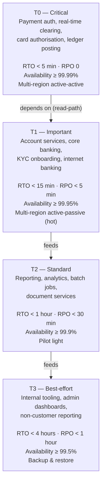

# Service Tiering + RTO/RPO Matrix

Status: Draft | Last Reviewed: 2026-05-09 | Owner: @sre-lead
Catalog ID: NFR-001 | **Spine**
Tier Applicability: N/A (defines tiers)

## Problem Statement

A Vietnamese tier-1 bank operates services with vastly different criticality — from real-time payment authorisation (regulatory, sub-second) to internal analytics dashboards (overnight tolerable). Without a single normative tiering scheme, teams choose RTO/RPO targets ad-hoc, recovery investment is unevenly distributed, and DAB reviewers can't compare submissions like-for-like. This spine doc defines the four canonical service tiers (T0–T3), their RTO/RPO targets, and the compliance hooks each tier inherits.

## Context

Reach for this doc whenever:

- Authoring any catalog row that needs to declare which tier(s) apply to it.
- Authoring a DAB submission's NFR Acceptance Criteria block (NFR-AC, see TPL-001).
- Triaging an incident — identifying the tier of the affected service drives escalation severity.
- Capacity / cost reviews — tier dictates the recovery topology (and therefore the cost).

## Solution

Four-tier classification anchored to two regulatory pegs (BCBS 230 §6 operational continuity; SBV Circular 09 §IV.2). Recovery topology and replication strategy are inherited from the tier — services don't re-derive them.

### Tier hierarchy



### Authoritative RTO/RPO matrix

| Tier | Examples | RTO | RPO | Availability target | Recovery topology | Replication strategy | Backup retention |
|---|---|---|---|---|---|---|---|
| **T0** | Payment auth (NAPAS 247), card authorisation 3DS2, real-time ledger posting, fraud screening | < 5 min | **0** (sync) | **99.99%** | Multi-region **active-active** (REF-001) | Synchronous DB replication; cross-region Kafka MirrorMaker; Aurora Global with sub-second lag | 35 days hot, 7 yrs cold |
| **T1** | Account services, core banking T24 façade, KYC/AML onboarding, internet banking BFF | < 15 min | < 5 min | 99.95% | Multi-region **active-passive (hot)** with sub-minute promotion | Async replication; auto-promote at health-check failure | 30 days hot, 7 yrs cold |
| **T2** | Regulatory reporting batches, OLAP / data lake jobs, statement generation, document services | < 1 hour | < 30 min | 99.9% | **Pilot light** in DR region (data live, services switched-off) | Cross-region async replication; manual scale-up on failover | 14 days hot, 5 yrs cold |
| **T3** | Internal admin tools, BI dashboards (non-customer), HR systems integration | < 4 hours | < 1 hour | 99.5% | **Backup & restore** | Daily snapshots cross-region | 7 days hot, 1 yr cold |

> **Source for recovery topologies**: AWS Well-Architected Reliability — DR Strategies whitepaper (see `_research-notes.md` § AWS). Numbers tuned to Techcombank-specific patterns.

### Tier assignment rules

A service is **T0** if **any** of:

1. Loss of service for more than 5 minutes triggers a regulatory reporting obligation (SBV);
2. Service is on the customer-facing payment-authorisation hot path;
3. Service writes to the general ledger or any clearing ledger;
4. Service handles cardholder data in real-time auth (PCI-DSS scope).

A service is **T1** if it directly supports a T0 service in the request path, OR if it handles customer data in flows other than real-time payment.

**T2** if it is internal-data-driven (reports/analytics/batches), customer-impact only via stale outputs.

**T3** otherwise (no customer impact, internal-only tooling).

### Inheritance chain

Each pattern's NFR Acceptance Criteria block (per [TPL-001](../templates/nfr-acceptance-criteria-dab.md)) MUST cite a tier from this matrix and inherit the corresponding RTO/RPO without modification. If a pattern needs to override (very rare), the override requires explicit EA-Board approval recorded as a comment in the catalog row's `notes` field.

## Implementation Guidelines

### Java / Spring Boot — declaring service tier in code

```java
package com.techcombank.platform.tiering;

import java.lang.annotation.*;

/** Declared on a Spring Boot @Service or top-level @SpringBootApplication.
 *  CI lint rejects build if missing or mismatched against deployment manifest. */
@Target({ElementType.TYPE})
@Retention(RetentionPolicy.RUNTIME)
@Documented
public @interface ServiceTier {
    Tier value();
    String rationale();
    String[] catalogRefs() default {};   // e.g. "REF-002 RT Payments NAPAS"

    enum Tier { T0, T1, T2, T3 }
}

// usage
@ServiceTier(value = ServiceTier.Tier.T0,
             rationale = "On NAPAS 247 hot path; SBV Circ. 09 §IV.2",
             catalogRefs = {"REF-002", "PRIN-006"})
@SpringBootApplication
public class PaymentAuthApplication { /* ... */ }
```

### Kubernetes / Helm — deployment-manifest tier label

```yaml
# values.yaml
service:
  name: payment-auth
  tier: T0
  rto_minutes: 5
  rpo_seconds: 0
  catalog_refs: ["NFR-001", "REF-001", "REF-002"]

# templates/deployment.yaml
metadata:
  labels:
    app: {{ .Values.service.name }}
    techcombank.io/tier: {{ .Values.service.tier }}
    techcombank.io/rto-minutes: "{{ .Values.service.rto_minutes }}"
spec:
  template:
    spec:
      topologySpreadConstraints:
        - maxSkew: 1
          topologyKey: topology.kubernetes.io/zone
          whenUnsatisfiable: DoNotSchedule
          labelSelector:
            matchLabels:
              techcombank.io/tier: {{ .Values.service.tier }}
```

### T24 / legacy integration

T24 / mainframe core-banking is treated as **T0** by default. Greenfield Java services that integrate with T24 inherit T0 unless the integration is read-only and tolerates stale data, in which case T1.

### Frontend / Mobile

Frontend (React) and native mobile clients inherit the tier of the **highest-tier backend** they call on the critical path. A mobile app that can initiate a payment is therefore T0 with respect to its payment flow even if its push-notification flow is T2.

## Variants & Trade-offs

| Variant | When to use | Trade-off |
|---|---|---|
| **Per-flow tiering** (this doc) | Default — assign tier to a logical service / API | Simple; some services have mixed-tier endpoints |
| **Per-endpoint tiering** | A service mixes T0 and T2 endpoints (rare) | More precise; harder to operate (different deployment topologies per endpoint) |
| **Per-tenant tiering** | Multi-tenant systems where tier varies by customer segment | Complex routing; rare in retail banking |

## NFR Acceptance Criteria

Defines the targets that other NFR-AC blocks reference. Self-validation:

- **HA**: this doc enables consistent multi-region deployment topologies; without it, services drift.
- **HP**: not directly applicable — see [NFR-002 Latency Budget Model](latency-budget-model.md).
- **HR**: tier defines blast-radius limits and recovery topology; foundation for [RES-005 Cell-Based Architecture](../patterns/resilience/cell-based-architecture.md).

## Compliance Mapping

| Layer | Reference | Section/Control | How this satisfies |
|---|---|---|---|
| Ring 0 (generic) | AWS Well-Architected Reliability Pillar | "Recovery Time Objective" definition; 4-pattern recovery matrix (Backup&Restore, Pilot Light, Warm Standby, Active-Active) | Tier table directly inherits the AWS-canonical patterns and applies them per Techcombank service class |
| Ring 1 (international banking) | Basel BCBS 230 (Operational Resilience) — §6 (Continuity) | Impact tolerance must be defined per critical operation (UNOFFICIAL — full d516 PDF pending fetch) | T0/T1 tier definitions ARE the Techcombank impact-tolerance statements |
| Ring 1 (international banking) | Basel BCBS 239 — §3 (Timeliness) | Risk-data aggregation must be timely | T0 tier sets P95 < 200ms (see NFR-002), well within BCBS 239 timeliness expectations |
| Ring 2 (Vietnam) | SBV Circular 09/2020/TT-NHNN — §IV.2 | Operational continuity (UNOFFICIAL TRANSLATION pending Legal review) | T0/T1 multi-region topology + ≥99.95% availability targets satisfy SBV continuity expectations for Tier-1 banks |

## Cost / FinOps Notes

| Tier | Approximate cost multiple vs single-AZ baseline | Primary cost drivers |
|---|---|---|
| T0 | **2.2×** | 2× compute (active-active), sync cross-region replication egress, HSM redundancy |
| T1 | 1.6× | Hot standby compute, async replication egress |
| T2 | 1.2× | Pilot-light (data only), occasional drill compute |
| T3 | 1.0× | Periodic backup snapshots; trivial cross-region storage |

**Levers**:
- Reserved-capacity for T0/T1 baseline; spot-instance for T2 batch jobs; nothing for T3.
- Cold-tier (Glacier-class) archives for backups beyond 30 days at T0/T1.
- T2/T3 services that aren't customer-facing during business hours can be auto-paused outside core hours.

**Cost of NOT having this tiering**: services default-up to over-investment (everyone wants 99.99%) which drives ~2× infrastructure spend; or default-down (everyone wants 99.9%) which fails SBV §IV.2 audit and risks regulatory penalty.

## Threat Model Summary

STRIDE for this *meta-doc*: there is no direct threat surface to the tiering matrix itself, but mis-classification is a control failure.

- **Top 3 threats this matrix addresses**:
  1. *Repudiation* of recovery commitments — explicit RTO/RPO numbers prevent "we never said it had to recover that fast" arguments.
  2. *Denial of Service* — proper tiering ensures T0 services have anti-DoS capacity (rate-limiting, cell-based blast-radius — see RES-005, RES-008).
  3. *Inappropriate cost allocation* leading to under-investment in T0 → systemic outage risk.
- **Top 3 residual threats**:
  1. *Tier mis-assignment* — a T0 service mistakenly classified as T1. Mitigation: CI lint cross-checks `@ServiceTier` annotation against tier-assignment rules in §"Tier assignment rules" above; periodic EA-Board audit.
  2. *Tier inflation* — teams default to T0 to avoid ops accountability. Mitigation: cost-allocation budgets per tier expose this.
  3. *Stale numbers* — RTO/RPO targets drift from regulator expectations. Mitigation: annual review (per §11 of the catalog).

## Operational Runbook (stub)

Tier-related alerts and dashboards are inherited by every service per its declared tier.

- **Alerts**:
  - `Tier-Mismatch`: service deployment manifest tier ≠ `@ServiceTier` annotation. Severity: Critical (CI lint).
  - `Tier-Drift`: T0 service exceeds 5-min unavailability in observability data. Severity: Critical (PagerDuty).
  - `Tier-Cost-Anomaly`: service exceeds 130% of expected tier-cost-multiple over 7-day window. Severity: Warning (FinOps Slack).
- **Dashboards**: Grafana panels per tier — `dashboard/tier-T0-services-availability`, `dashboard/tier-T0-rto-tracking`.
- **On-call escalation**: tier defines escalation chain (T0: page in 5 min → SRE primary → SRE secondary → SRE Lead).
- **Recovery steps**: pattern-specific; see [REF-001 Multi-Region Active-Active](../reference-architectures/multi-region-active-active.md) for T0 / T1 recovery; [BP-002 DR Playbook](../best-practices/disaster-recovery-playbook.md) for T2 / T3.

## Test Strategy (stub)

- **Unit**: `@ServiceTier` annotation parser; tier-assignment rule validator.
- **Integration**: deployment-manifest lint check (CI).
- **Chaos**: cell-based failure injection per tier (RES-005 + BP-005).
- **DR-drill**: quarterly per tier — T0 every quarter, T1 twice/year, T2 annually, T3 as needed.

## When to Use

- Always — every service must declare a tier.

## When NOT to Use

- N/A. There is no opt-out from tiering.

## Related Patterns

- [REF-001 Multi-Region Active-Active](../reference-architectures/multi-region-active-active.md) — recovery topology for T0/T1
- [BP-002 Disaster Recovery Playbook](../best-practices/disaster-recovery-playbook.md) — recovery procedures for T2/T3
- [RES-005 Cell-Based Architecture](../patterns/resilience/cell-based-architecture.md) — blast radius for T0
- [TPL-001 NFR Acceptance Criteria DAB Template](../templates/nfr-acceptance-criteria-dab.md) — every DAB submission references tier
- [NFR-002 Latency Budget Model](latency-budget-model.md) — companion spine doc

## References

- AWS Well-Architected Reliability Pillar — DR Strategies whitepaper (`_research-notes.md` §AWS)
- Basel BCBS 230 (Operational Resilience, BIS d516) — full PDF fetch pending
- SBV Circular 09/2020/TT-NHNN — Legal-team authoritative translation pending
- Google SRE Book — Chapter 4 (Service Level Objectives)

---

**Key Takeaway**: Every service declares a tier (T0–T3); tier is the only knob that drives recovery topology, replication strategy, and cost expectation. No service designs its own RTO/RPO.
