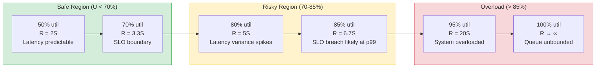

# Throughput Model

Status: Draft | Last Reviewed: 2026-05-09 | Owner: @sre-lead
Catalog ID: NFR-004 | Spine
Tier Applicability: T0, T1

## Problem Statement

- Without a formal throughput model, teams conflate "the system processed X requests/sec during a load test" with "the system can sustain X requests/sec in production" — ignoring the non-linear relationship between utilisation and response time that makes high-utilisation systems fragile.
- NAPAS 247 payment flows are subject to burst arrivals (Tết, payroll, promotional events) that push services into the high-utilisation regime where response-time variance explodes; without a defined safe operating region, SLO breaches become statistically inevitable.
- Goodput — the rate of valid, successfully completed requests — degrades before raw throughput does; teams that measure only throughput miss the early warning signal that the system is entering overload.
- Thread-pool and Kafka consumer sizing decisions made without throughput targets produce systems that look healthy under normal load and collapse at 2–3× load rather than degrading gracefully.
- Capacity requests to the infrastructure board lack quantitative justification; this model provides the formulas and benchmark methodology needed to produce defensible, auditable provisioning decisions.
- Utilisation law is routinely violated in production Java services with synchronous DB calls: a 20ms query at 50 req/s occupies 100% of a single-threaded DB connection; without this model, teams discover the bottleneck only during an incident.

## Context

Reach for this doc when:

- Authoring a service's NFR Acceptance Criteria block (DAB submission) and needing concrete throughput targets with measurement definitions.
- Running a load test and interpreting the results — use the utilisation law to confirm you are measuring in the correct operating region.
- Investigating a latency spike under moderate load — the knee-of-curve analysis identifies whether the service has entered the dangerous utilisation zone.
- Sizing Kafka consumers — partition count × consumer throughput per partition determines the maximum goodput of an event-driven processing pipeline.

## Solution

Apply queueing-theory fundamentals (utilisation law, Universal Scalability Law) to define the safe operating region for each tier. Benchmark services empirically at discrete utilisation levels using Gatling. Set throughput targets and p99 latency targets that keep services below the knee of the response-time curve.

### Key Definitions

| Term | Definition |
|---|---|
| **Throughput (X)** | Total requests completed per second, including errors |
| **Goodput** | Valid (non-error) requests completed per second; the operationally meaningful metric |
| **Offered load** | Arrival rate of requests to the system (λ, requests/sec) |
| **Carried load** | Rate of requests the system actually processes without queuing or rejection |
| **Utilisation (U)** | Fraction of time a resource (CPU, thread, DB connection) is busy |
| **Service time (S)** | Mean time spent processing one request at a single resource |
| **Knee of curve** | The utilisation point beyond which response time growth becomes super-linear |

### Utilisation Law

For any resource (CPU core, thread pool slot, database connection):

```
U = X × S
```

Where:
- **U** = utilisation (0.0 to 1.0)
- **X** = throughput of requests through that resource (requests/sec)
- **S** = mean service time per request at that resource (seconds)

**Implication**: a thread pool slot with S = 20 ms that handles X = 50 req/s is running at U = 1.0 — fully saturated. Any additional request queues. This is why the `maximum-pool-size` in HikariCP must account for peak X, not average X.

### Response Time vs Utilisation — The Knee of Curve

As utilisation approaches 1.0 (100%), mean response time approaches infinity (M/M/1 queueing result):

```
R(U) = S / (1 - U)
```

At U = 0.50: R = S / 0.50 = 2S (modest inflation)
At U = 0.70: R = S / 0.30 = 3.3S (noticeable inflation)
At U = 0.85: R = S / 0.15 = 6.7S (significant inflation — SLO at risk)
At U = 0.95: R = S / 0.05 = 20S (catastrophic — latency SLO breached)

**Safe operating region for Techcombank services: U < 0.70 for T0, U < 0.75 for T1.** This keeps response time inflation below 3.3× S, which is consistent with p99 staying within the latency budget (NFR-002) under normal load variance.



### Universal Scalability Law (USL) — Multi-Core and Distributed Scaling

For systems that add concurrency (more threads, pods) rather than faster hardware, throughput does not scale linearly with concurrency N beyond the coherency point:

```
X(N) = X(1) × N / (1 + α(N-1) + βN(N-1))
```

Where:
- **α** (contention penalty) — from serialised locks, DB connection pool waits
- **β** (coherency penalty) — from synchronous coordination overhead (distributed transactions, leader election)

In practice for Techcombank Java microservices:
- Keep α low by eliminating synchronised blocks on hot paths; use concurrent data structures.
- Keep β effectively 0 by avoiding distributed transactions; prefer eventual consistency on T1/T2 flows.
- Benchmark at N = 1, 2, 4, 8, 16 pods using Gatling; fit the USL curve to identify the theoretical throughput ceiling before horizontal scaling stops helping.

### Kafka Consumer Throughput Sizing

```
Max pipeline goodput = partition_count × consumer_throughput_per_partition
```

Where `consumer_throughput_per_partition` is empirically measured per topic (depends on message size, consumer business logic complexity, and downstream call latency).

Techcombank benchmarks on MSK (3-AZ, `kafka.m5.xlarge` brokers):

| Message size | Consumer throughput per partition | Safe partition count for 1,500 TPS |
|---|---|---|
| 512 bytes | ~3,000 msg/s | 1 partition (but use minimum 12 for parallelism) |
| 2 KB | ~1,200 msg/s | 2 partitions (use 24 for parallelism headroom) |
| 8 KB | ~400 msg/s | 4 partitions (use 36 for headroom) |

**Consumer group scaling rule**: number of consumer instances ≤ number of partitions. Do not create more consumer instances than partitions — excess consumers are idle and waste compute.

### Benchmarking Methodology

All T0 and T1 services MUST be benchmarked at the following utilisation levels before the DAB approval gate:

| Test level | Target CPU utilisation | Purpose |
|---|---|---|
| Baseline | 50% | Confirm system behaves predictably in the safe region |
| Nominal | 70% | Confirm SLO targets are met at the operating boundary |
| Stress | 85% | Confirm graceful degradation begins (latency rises, goodput stable) |
| Saturation | 95% | Confirm the circuit breaker (RES-002) trips before cascade; measure max goodput |

**Tooling**: Gatling is the standard load testing tool. JMeter is acceptable for teams already using it. All load test scripts MUST be checked into the service repository under `src/test/gatling/` and executed in CI on the staging environment.

**Gatling simulation structure** (illustrative excerpt):

```java
// src/test/gatling/NapasPaymentGatewaySimulation.scala
class NapasPaymentGatewaySimulation extends Simulation {

  val httpProtocol = http
    .baseUrl("https://staging-payment-gw.techcombank.internal")
    .header("X-Correlation-ID", session => UUID.randomUUID().toString)
    .contentTypeHeader("application/json")

  val paymentScenario = scenario("NAPAS Payment Authorisation")
    .exec(
      http("Authorise Payment")
        .post("/v1/payments/authorise")
        .body(StringBody("""{"amount":500000,"currency":"VND","accountRef":"TCB123"}"""))
        .check(status.is(200))
        .check(responseTimeInMillis.lte(200))   // p99 SLO boundary
    )

  // Ramp to 1000 TPS goodput target over 2 minutes, sustain 10 minutes
  setUp(
    paymentScenario.inject(
      rampUsersPerSec(0).to(1000).during(120.seconds),
      constantUsersPerSec(1000).during(600.seconds)
    )
  ).protocols(httpProtocol)
   .assertions(
     global.responseTime.percentile3.lte(200),   // p99 < 200ms
     global.successfulRequests.percent.gte(99.99) // error rate < 0.01%
   )
}
```

### NAPAS Payment Processing — Throughput Targets

| Metric | Normal (T0) | Tết Peak | Measurement |
|---|---|---|---|
| Goodput target | 500 TPS | 1,500 TPS | Gatling `successfulRequests.count / duration` |
| p99 latency target | < 200 ms | < 200 ms | Gatling `responseTime.percentile3` |
| CPU utilisation bound | < 65% | < 70% | Kubernetes `container_cpu_usage_seconds_total` / requested |
| Error rate | < 0.01% | < 0.01% | `(5xx_count / total_count) × 100` |
| Kafka consumer lag (NAPAS inbound topic) | < 1,000 msg | < 5,000 msg | `kafka_consumer_group_lag` |
| DB connection pool utilisation | < 60% | < 70% | `hikaricp_connections_active / hikaricp_connections_max` |

**Why 65% CPU for normal, 70% for peak**: the gap provides headroom for HPA to react (60-second stabilisation window) before a normal-load spike breaches the Tết-peak boundary. Services that sit at 70% during normal load have no HPA headroom and will breach SLOs before the first new pod starts.

## Implementation Guidelines

1. Baseline the service's current throughput profile using 30 days of Prometheus `job:payment_tps:rate1m` recording-rule data; identify the observed peak TPS, normal TPS, and the P99 latency at those utilisation levels.
2. Run Gatling benchmarks at the four standard levels (50%, 70%, 85%, 95% CPU utilisation) in the staging environment before DAB submission; record goodput and P99 latency at each level to identify the knee of the curve.
3. Set the HPA `targetCPUUtilizationPercentage` at 70% for T0 and 75% for T1; set `minReplicas` so that the baseline load lands at ≤ 50% CPU, leaving the 50–70% band as the scale-out trigger zone.
4. Document the `consumer_throughput_per_partition` benchmark result in the service's `capacity-profile.yaml`; ensure the CI `capacity-plan validate` step cross-references this value against the declared `peak_tps`.
5. For services approaching their USL contention point (α > 0.05 measured from N = 1, 2, 4, 8 pod benchmarks), investigate lock contention and shared DB connection pool bottlenecks before adding more replicas.

## Variants & Trade-offs

- **Single goodput target (default)** — declare a single `peak_tps` target (e.g., 1,500 TPS for Tết) and size for it; simple to govern, easy to test, sufficient for the majority of T0 services with a known peak shape.
- **Dual normal/peak targets** — separate `normal_tps` and `peak_tps` declared in `capacity-profile.yaml`; enables finer HPA tuning and cost optimisation between peaks but requires two benchmark runs per release.
- **Goodput + latency composite target** — combine throughput and latency SLIs into a single DAB acceptance criterion (e.g., "≥ 1,500 TPS at p99 < 200 ms"); best represents user experience but makes it harder to isolate which dimension is failing during an incident.
- **USL-based ceiling declaration** — explicitly model the theoretical throughput ceiling using USL curve fitting from the N = 1–16 pod benchmarks; provides a hard limit to prevent over-scaling; adds engineering effort but prevents capacity waste on services that have hit a serialisation ceiling.

## NFR Acceptance Criteria

```yaml
nfr_acceptance_criteria:
  id: NFR-004
  pattern: Throughput Model

  throughput:
    - id: TM-1
      statement: >
        T0 services MUST sustain 500 TPS goodput (valid non-error responses) at
        p99 latency < 200 ms with CPU utilisation < 65% under 30-minute sustained
        load in the staging environment.
      measurement: >
        Gatling load test at 500 TPS (constantUsersPerSec) for 30 minutes;
        assert global.responseTime.percentile3 <= 200,
        global.successfulRequests.percent >= 99.99,
        Prometheus container_cpu_utilisation < 65%.

    - id: TM-2
      statement: >
        T0 services MUST sustain 1,500 TPS goodput (Tết peak) at p99 < 200 ms
        with CPU utilisation < 70%. The circuit breaker (RES-002) MUST trip within
        5 seconds of the service entering the overload zone (CPU > 85% for > 30s),
        protecting upstream callers from cascading failure.
      measurement: >
        Gatling load test at 1,500 TPS for 30 minutes; assert all SLO assertions
        pass. Then ramp to 2,500 TPS; assert circuit breaker opens within 5 seconds
        (Resilience4j state = OPEN); assert upstream caller receives 503 within 100ms
        rather than waiting for a timeout.

    - id: TM-3
      statement: >
        Kafka consumer goodput for T0 topics MUST match the throughput target of the
        producing service within a lag tolerance of 5,000 messages (approx. 3.3
        seconds at 1,500 TPS). Consumer throughput per partition MUST be benchmarked
        and documented in the service's capacity-profile.yaml before DAB approval.
      measurement: >
        During Gatling peak test, record kafka_consumer_group_lag every 10 seconds;
        assert max(lag) < 5,000 over the 30-minute test window.
        Verify capacity-profile.yaml contains consumer_throughput_per_partition
        with value derived from the benchmark.
```

## Compliance Mapping

| Ring | Regulation | Provision | How this pattern satisfies |
|---|---|---|---|
| Ring 0 | ISO 27001 | A.12.1.3 Capacity Management; A.12.1.2 Change Management | Benchmarking at discrete utilisation levels before DAB approval implements formal capacity management; the utilisation law provides the engineering rationale for provisioning decisions required by change management. |
| Ring 0 | NIST SP 800-53 | SA-8 Security Engineering Principles; SC-5 Denial of Service Protection | Utilisation law and USL analysis are formal engineering principles applied to every T0 deployment; operating below the knee of curve (U < 70%) provides inherent DoS resistance by ensuring the system degrades gracefully under load rather than collapsing. |
| Ring 1 | BCBS 239 | §3 Timeliness | NAPAS payment goodput targets (500 TPS normal, 1,500 TPS peak) with p99 < 200 ms ensure risk-data flows (payment confirmations, settlement records) complete within supervisory timeliness expectations at all load levels. |
| Ring 1 | BCBS 230 | Principle 2 — Data Architecture and IT Infrastructure ⚠️ (working summary — pending PDF fetch) | Throughput benchmarking demonstrates that the IT infrastructure supporting payment-data aggregation is sized to meet peak demand without degradation, satisfying the infrastructure-adequacy dimension of Principle 2. |
| Ring 2 | SBV Circular 09/2020; Decree 13/2023 | §IV.2 Operational continuity — performance standards ⚠️ (working summary — pending Legal review) | Documented throughput targets, Gatling benchmark results, and utilisation-law justifications constitute the performance-standard evidence required for Techcombank's operational continuity obligations under SBV supervision; Decree 13 Art. 26 72-hour incident reporting requires that T0 throughput capacity never prevents timely breach detection or notification. |

## Cost / FinOps Notes

- Maintaining U < 70% means paying for ~30% idle CPU at nominal load. For T0 baseline (3 pods always on), use AWS Reserved Instances — the idle-capacity premium is ~1.3× Reserved vs On-Demand on-demand pricing, well within budget.
- Gatling load tests run on staging EKS, not production. Staging cluster can use Spot instances; intermittent Spot interruptions during a load test are acceptable (rerun). Cost per 30-minute test at staging scale: approximately USD 2–5.
- Kafka partition over-provisioning (using 24 partitions for a 2-partition raw requirement) costs roughly USD 0.025/partition/month on MSK m5.xlarge — 24 partitions = USD 0.60/month. The over-provisioning cost is negligible; the consumer parallelism benefit is material.
- The dominant cost driver is compute for the T0 service pods. The throughput model's output feeds directly into the capacity planning model (NFR-003) to produce the pod count and instance type justification for the infrastructure board.

## Threat Model Summary

STRIDE applied to the throughput measurement and target-setting process:

- **Spoofing — Synthetic benchmark environment**: staging environment does not match production (lower DB I/O, warmer cache, no NAPAS external latency). Benchmark results overstate production throughput. Mitigation: staging must use production-equivalent instance types and inject realistic external-call latency via a WireMock stub of NAPAS with production P95 latency (100ms).
- **Tampering — Gatling script cherry-picking**: load test script sends only the fastest request variant (no payload validation, cached auth token), inflating goodput numbers to pass the DAB gate. Mitigation: Gatling script must be peer-reviewed by the SRE lead before DAB submission; scripts must include realistic payload variance (randomised amounts, account refs).
- **Denial of Service — Overload in production during Tết**: actual Tết TPS exceeds the 3× model assumption (a flash campaign drives 5× load). Mitigation: circuit breaker (RES-002) and admission control limit ingress to the system's proven goodput capacity; excess requests receive 429 with `Retry-After` rather than saturating the service.
- **Repudiation — Disputed benchmark results**: a team claims their service met throughput targets but no benchmark artefacts are retained. Mitigation: Gatling generates an HTML report per run; the CI pipeline uploads the report to the artifact store (S3 `techcombank-arch-benchmarks/`) with a retention of 1 year.

## Operational Runbook (stub)

- Alert: `ThroughputGoodputDrop` — goodput drops > 20% from baseline within 5 minutes; PagerDuty high-urgency. Check: recent deployment (ArgoCD), downstream health (circuit breaker state), Kafka consumer lag. Primary action: compare current TPS to benchmark curve; if load is below the safe operating region, the issue is a service degradation, not an overload.
- Alert: `ConsumerLagCritical` — lag > 5,000 on a T0 topic for > 5 min; PagerDuty high-urgency. Check: consumer pod count vs partition count; consumer error rate (`consumer-group-errors` metric). Scale consumer pods if under-replicated; investigate DLQ for poison messages.
- Alert: `UtilisationKneeApproach` — CPU > 65% (T0) for > 5 min during non-peak periods; PagerDuty warning. Trigger: quarterly capacity review ahead of schedule. Pre-provision for the next expected peak.
- **Dashboards**: Grafana — `throughput-goodput-by-service`, `utilisation-law-scatter`, `kafka-throughput-per-partition`, `gatling-benchmark-history`.

## Test Strategy (stub)

- **Unit**: utilisation law calculator — given X and S, assert U output. Given U, assert R(U) = S / (1 - U) to 4 significant figures.
- **Integration**: Gatling tests at all four benchmark levels (50%, 70%, 85%, 95%) run in the staging CI pipeline on every release branch; report uploaded to S3.
- **Performance regression gate**: compare each release's 70% utilisation benchmark against the previous release's result; fail the pipeline if p99 latency increases by > 10% with no architectural justification.
- **Chaos**: inject 50% packet loss on the NAPAS stub connection mid-test; assert goodput degrades gracefully (not to zero) and the circuit breaker opens within the expected window.

## When to Use

- Every T0 and T1 service must produce a Gatling benchmark at all four utilisation levels before the DAB gate is approved.
- Any service that receives synchronous traffic from an external channel (NAPAS, open banking, mobile app) — throughput targets must be agreed with the channel before production launch.

## When NOT to Use

- T2 reporting and batch services — throughput is secondary to correctness and cost; use the batch-sizing model instead.
- Internal async-only services with no customer-facing SLO — Kafka consumer lag monitoring is sufficient without a formal throughput model.

## Related Patterns

- [NFR-001 Service Tiering + RTO/RPO Matrix](service-tiering-rto-rpo.md) — tier determines which throughput targets are mandatory
- [NFR-002 Latency Budget Model](latency-budget-model.md) — p99 latency target feeds the R(U) calculation to set the safe U bound
- [NFR-003 Capacity Planning Model](capacity-planning-model.md) — throughput targets are the primary input to capacity calculations
- [NFR-005 Error Budget Policy](error-budget-policy.md) — throughput degradation shows up as SLO burn; error budget tracks cumulative impact
- [RES-002 Circuit Breaker](../patterns/resilience/circuit-breaker.md) — protects the system when throughput approaches the overload region
- [BP-007 Golden Signals (SRE)](../best-practices/golden-signals-sre.md) — throughput is one of the four golden signals; this doc defines how to measure and target it

## References

- Gunther, N.J. (2007) — Guerrilla Capacity Planning, Chapter 4: Universal Scalability Law
- Brendan Gregg — Systems Performance, Chapter 4: Observability Tools (utilisation law derivation)
- Gatling documentation — simulation DSL and assertion API (gatling.io/docs)
- HikariCP pool sizing wiki — brettwooldridge/HikariCP on GitHub
- Confluent — Kafka Consumer Group Lag monitoring guide
- `_research-notes.md` §Throughput and §USL for Techcombank-specific benchmark data

---

**Key Takeaway**: Keep T0 service utilisation below 70% — above this the M/M/1 response-time law makes p99 SLO breaches statistically inevitable. Benchmark goodput at 50%, 70%, 85%, and 95% utilisation before every DAB gate; set Kafka partition count so consumer throughput matches producer goodput at Tết peak with 5,000-message lag tolerance.
