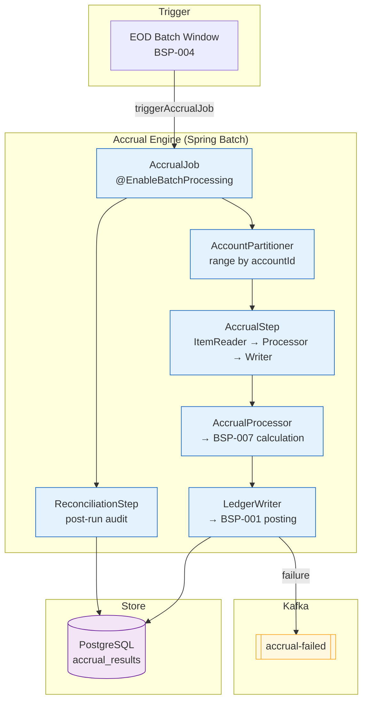

# Accrual Engine

Status: Draft | Last Reviewed: 2026-05-21 | Owner: @core-banking-domain-owner
Catalog ID: BSP-018 | Radii
Tier Applicability: T0, T1

## Problem Statement

The bank's end-of-day interest accrual for 3.2 million loan and deposit accounts runs as a single-threaded SQL procedure in the core banking system that takes 5.5 hours to complete. During this window the core banking system is in maintenance mode — no transactions can be posted, no customer service queries can be satisfied from live data, and any system failure mid-run requires a full restart from the beginning, extending the window by another 5 hours. The total maintenance window of up to 11 hours violates the bank's T0 availability SLA of 99.99%.

Accrual results are not reconciled against the product blueprint after calculation. If the interest calculation engine (BSP-007) applies a wrong day-count convention for a batch of accounts — due to a misconfigured product code — the error is not discovered until a customer complaint triggers a manual review weeks later. There is no automated post-accrual reconciliation step.

Accrual processing for different product types (deposits, personal loans, corporate loans, bonds) shares the same single-threaded batch, so a performance regression in one product type's calculation logic degrades the entire accrual window for all product types.

Failed accrual entries are silently skipped. If the ledger posting for an individual account fails (e.g., the account is frozen), the batch continues and the failed posting is never retried — the account simply does not receive its accrual entry for that day, creating an undetected interest calculation error.

## Context

The Accrual Engine orchestrates the daily interest accrual across all loan and deposit accounts. It delegates the actual interest calculation to BSP-007 Interest Calculation Engine and posts the resulting accrual entries to BSP-001 Double-Entry Ledger. It is the operational orchestrator — it knows which accounts to process, in what order, and how to retry failures. It is mandatory for T0 retail and premium deposit and loan books, and T1 for corporate and treasury books. The engine uses Spring Batch with partitioned job steps to parallelise across account ranges, achieving sub-2-hour accrual windows even at 5M+ accounts.

## Solution

A Spring Batch AccrualEngine partitions the account population into segments by account range, processes each partition independently on a configurable thread pool, calls BSP-007 for each account's daily interest calculation, posts the result to BSP-001 using the accrual date + accountId as the idempotency key, and writes a reconciliation record to the `accrual_results` table for post-run audit. A post-step reconciliation job compares the total accrued interest per product type against expected ranges (based on portfolio averages) and fires an alert if any product type is outside the tolerance band. Failed partitions are retried automatically up to 3 times; persistent failures are written to a `accrual-failed` Kafka topic for manual review.



## Implementation Guidelines

**1. Partitioned AccrualJob with Spring Batch**

```java
@Configuration
@EnableBatchProcessing
@RequiredArgsConstructor
public class AccrualJobConfig {

    private final JobBuilderFactory jobs;
    private final StepBuilderFactory steps;
    private final DataSource dataSource;

    @Bean
    public Job accrualJob(Step partitionedAccrualStep, Step reconciliationStep) {
        return jobs.get("accrualJob")
            .start(partitionedAccrualStep)
            .next(reconciliationStep)
            .build();
    }

    @Bean
    public Step partitionedAccrualStep(AccountPartitioner partitioner, Step accrualStep) {
        return steps.get("partitionedAccrualStep")
            .partitioner("accrualStep", partitioner)
            .step(accrualStep)
            .gridSize(64)          // 64 partitions across the account range
            .taskExecutor(taskExecutor())
            .build();
    }

    @Bean
    public Step accrualStep(
            JdbcCursorItemReader<Account> reader,
            AccrualProcessor processor,
            LedgerWriter writer) {
        return steps.get("accrualStep")
            .<Account, AccrualPosting>chunk(500)
            .reader(reader)
            .processor(processor)
            .writer(writer)
            .faultTolerant()
            .retry(LedgerUnavailableException.class)
            .retryLimit(3)
            .skip(AccountFrozenException.class)
            .skipLimit(1000)   // route to DLQ after 1000 frozen-account skips
            .build();
    }

    @Bean
    public TaskExecutor taskExecutor() {
        ThreadPoolTaskExecutor executor = new ThreadPoolTaskExecutor();
        executor.setCorePoolSize(16);
        executor.setMaxPoolSize(32);
        executor.setQueueCapacity(64);
        return executor;
    }
}
```

**2. AccrualProcessor — calls BSP-007 per account**

```java
@Component
@RequiredArgsConstructor
public class AccrualProcessor implements ItemProcessor<Account, AccrualPosting> {

    private final InterestCalculationClient iceClient;  // BSP-007
    private final LocalDate accrualDate;

    @Override
    public AccrualPosting process(Account account) {
        AccrualResult result = iceClient.calculateAccrual(AccrualRequest.builder()
            .accountId(account.accountId())
            .principal(account.currentBalance())
            .annualRate(account.interestRate())
            .fromDate(accrualDate.minusDays(1))
            .toDate(accrualDate)
            .convention(account.dayCountConvention())
            .build());

        return new AccrualPosting(
            account.accountId(),
            result.interestAmount(),
            account.currency(),
            accrualDate,
            result.dayCount(),
            result.daysInYear()
        );
    }
}
```

**3. Accrual results schema**

```sql
CREATE TABLE accrual_results (
    id                 UUID PRIMARY KEY DEFAULT gen_random_uuid(),
    account_id         VARCHAR(50) NOT NULL,
    accrual_date       DATE NOT NULL,
    interest_amount    NUMERIC(20,8) NOT NULL,
    currency           CHAR(3) NOT NULL,
    day_count          INT NOT NULL,
    days_in_year       INT NOT NULL,
    convention         VARCHAR(20) NOT NULL,
    ledger_posting_id  UUID,                    -- BSP-001 posting idempotency key
    status             VARCHAR(20) NOT NULL,    -- POSTED | FAILED | SKIPPED
    processed_at       TIMESTAMPTZ NOT NULL DEFAULT now(),
    UNIQUE (account_id, accrual_date)
);

CREATE INDEX idx_accrual_date_status ON accrual_results (accrual_date, status);
```

## When to Use

- Daily end-of-day interest accrual across large account populations (100K–10M+ accounts)
- When per-account calculation must be delegated to BSP-007 and the accrual orchestrator must not contain interest formula logic
- When partitioned parallel processing is required to meet the EOD window SLA
- When post-run reconciliation against product-level expected ranges must be automated

## When Not to Use

- Real-time accrual on-demand for a single account — call BSP-007 directly from the serving system
- Fee accrual triggered by discrete business events — use BSP-008 Fee Engine which handles event-driven fee posting
- Securities coupon accrual with complex ISDA schedule conventions — BSP-018 delegates to BSP-007 which handles ISDA day-count conventions, but very complex bond structures may require a specialist fixed-income calculation library

## Variants

| Variant | When to prefer | Trade-off |
|---------|----------------|-----------|
| Spring Batch partitioned (this pattern) | Large account populations; strict EOD window SLA; retry and skip logic required | Batch infrastructure complexity; requires BSP-007 to handle concurrent calls |
| Streaming (Kafka Streams) | Continuous accrual for products with intraday capitalisation | No batch window; higher complexity; requires event sourcing for balance history |
| Direct SQL procedure | Legacy core banking integration; < 100K accounts | Simple; no distributed infrastructure; single-threaded performance ceiling |

## NFR Acceptance Criteria

```yaml
nfr_acceptance_criteria:
  catalog_id: BSP-018
  pattern: Accrual Engine
  performance:
    - id: BSP-018-HP-01
      description: Full accrual run for 3.2M accounts must complete within 2 hours using 64 partitions and 32 threads.
      threshold: p99 completion < 2 hours at 3.2M accounts
    - id: BSP-018-HP-02
      description: Per-account processing time including BSP-007 call and BSP-001 ledger write must complete within 50ms p99.
      threshold: p99 < 50ms per account
  availability:
    - id: BSP-018-HA-01
      description: Accrual job must be restartable from the last successful partition checkpoint without reprocessing completed partitions.
      threshold: restart from checkpoint within 5 minutes of failure; 0 duplicate postings on restart
  correctness:
    - id: BSP-018-COR-01
      description: Each account must be accrued exactly once per accrual date; duplicate accrual postings must be prevented by the unique constraint and idempotency key.
      threshold: 0 duplicate accrual entries per day (verified by post-run reconciliation)
    - id: BSP-018-COR-02
      description: Post-run reconciliation must detect product-level accrual total deviations > 5% from the previous-day average and fire an alert.
      threshold: reconciliation deviation alert fires within 10 minutes of job completion
```

## Compliance Mapping

| Ring | Regulation | Provision | How this pattern satisfies |
|------|-----------|-----------|---------------------------|
| Ring 0 | IFRS 9 | §B5.4 — Effective Interest Method for amortised cost instruments | AccrualProcessor delegates to BSP-007 which implements the EIR method; accrual_results stores dayCount, daysInYear, and convention for each posting — sufficient for IFRS 9 audit |
| Ring 0 | IAS 39 (transitional) | §AG5 — Daily interest accrual on all financial instruments | Every account in the T0 product portfolio receives a daily accrual posting; status = SKIPPED accounts are escalated for manual review rather than silently dropped |
| Ring 1 | BCBS 239 | §4 Granularity; §5 Timeliness | accrual_results retains every account-level result; post-run reconciliation by product type enables aggregate risk reporting within the same business day |
| Ring 2 | SBV Circular 39/2016 | Art. 5 — Interest calculation method for credit institutions | day_count convention stored per posting; SBV-mandated ACT_365 for VND instruments is enforced by BSP-007 and validated by post-run reconciliation ⚠️ (working summary — pending Legal review) |

## Cost / FinOps Notes

- Spring Batch infrastructure: runs as a Kubernetes Job on the EOD window schedule; no persistent pod cost; ~$20/run at 64 partitions × 32 threads
- PostgreSQL `accrual_results`: high write volume at EOD; ~3.2M rows per day; partitioned by accrual_date; archived to S3 Glacier after 7 years; ~$30/month at steady state
- BSP-007 call volume: 3.2M calls per run; BSP-007 serves from Redis cache for accounts queried multiple times in the same window; compute cost for BSP-007 pods scales linearly with thread count
- Kafka `accrual-failed` topic: low volume under normal conditions; 3 partitions; retention 30 days; ~$5/month
- Total EOD compute cost: ~$80/run including BSP-007 scale-out pods; compare to 5.5-hour single-threaded SQL run which blocks all transactions

## Threat Model Summary

**Accrual date manipulation (Tampering)**: an attacker with access to the EOD batch trigger modifies the `accrualDate` parameter to a future date, causing the engine to calculate and post inflated interest for a date that has not yet elapsed, resulting in unjustified interest income recognition. Mitigation: the `accrualDate` parameter is validated at job launch to be ≤ `LocalDate.now()`; the EOD Batch Window trigger (BSP-004) is the only authorised caller of the AccrualJob; direct REST-triggered AccrualJob runs require an `accrual-operator` RBAC role and are logged with the caller's identity; any accrualDate > today is rejected immediately.

**Accrual skip exploitation (Denial of Service)**: an attacker deliberately freezes a large number of accounts immediately before the EOD accrual window, causing the skipLimit to be reached and the accrual job to abort prematurely, leaving the remaining accounts unaccrued. Mitigation: the skipLimit (1,000 frozen-account skips) is per-step; if exceeded, the step fails and its partition is written to `accrual-failed` Kafka topic rather than aborting the entire job; a dedicated frozen-account reconciliation process runs separately; an alert fires if the number of SKIPPED entries in `accrual_results` exceeds 0.1% of total accounts.

## Operational Runbook (stub)

1. Alert: AccrualJobFailed — fires when Spring Batch AccrualJob exits with FAILED status. p50 resolution: 10 min; p99: 60 min. Check the failed partition step: `GET /actuator/batch/jobs/accrualJob/executions?status=FAILED`. Re-run failed partitions only: `POST /actuator/batch/jobs/accrualJob/restart?executionId={id}`. Completed partitions will not be reprocessed due to Spring Batch restart semantics. If failure is caused by BSP-001 ledger unavailability, restore BSP-001 connectivity first.

2. Alert: AccrualReconciliationDeviation — fires when post-run reconciliation detects product-level accrual total > 5% deviation from prior-day average. p50 resolution: 30 min; p99: 2 hours. Query `SELECT product_type, SUM(interest_amount), COUNT(*) FROM accrual_results WHERE accrual_date = ? GROUP BY product_type` to identify the deviating product type. Check if BSP-007 was updated with a new day-count convention or if BSP-017 product blueprints changed. Notify @core-banking-domain-owner and @head-of-finance before the deviation is included in regulatory reporting.

3. Alert: AccrualSkipLimitExceeded — fires when `accrual-failed` topic depth exceeds 1,000 entries. Review frozen accounts in the failed partition. If accounts were frozen incorrectly (system error vs genuine freeze), unfreeze and re-trigger the partition: `POST /actuator/settlement/retry-accrual?partition={id}`.

## Test Strategy (stub)

**Unit**: `AccrualProcessorTest` — mock BSP-007 client returning a known interest amount for a given principal + rate + convention; assert AccrualPosting contains the correct interestAmount, dayCount, and daysInYear; mock BSP-007 client throwing LedgerUnavailableException; assert retry is triggered.

**Integration**: `AccrualEngineIT` (Testcontainers — PostgreSQL) — seed 1,000 accounts with known balances and rates; run AccrualJob with accrualDate = today; assert 1,000 accrual_results rows with status = POSTED; assert unique constraint prevents duplicate run for same date; inject one frozen account; assert that account's row has status = SKIPPED, not FAILED; assert remaining 999 accounts posted successfully.

**Compliance**: `AccrualConventionIT` — seed accounts with VND currency; run accrual; assert all accrual_results.convention = ACT_365 (SBV mandate); seed USD accounts; assert convention = ACT_360 or ACT_365 per product blueprint; assert no account uses an unlisted convention.

**Chaos**: during an AccrualJob run, kill one partition thread mid-execution; assert Spring Batch marks that partition as FAILED; restart the job; assert the failed partition is retried from its last chunk checkpoint; assert no duplicate accrual_results entries (UNIQUE constraint on account_id + accrual_date).

## Related Patterns

- [BSP-007 Interest Calculation Engine](interest-calculation-engine.md) — AccrualProcessor delegates per-account calculation to BSP-007; BSP-018 is the orchestrator, BSP-007 is the calculator
- [BSP-001 Double-Entry Ledger](double-entry-ledger.md) — LedgerWriter posts each accrual entry to BSP-001 using accountId + accrualDate as the idempotency key
- [BSP-017 Product Factory](product-factory.md) — AccrualProcessor reads the day-count convention and compounding frequency from BSP-017 via the account's productId
- [BSP-004 End-of-Day Batch Window](end-of-day-batch-window.md) — the EOD Batch Window is the authorised trigger for AccrualJob execution

## References

- IFRS 9 Financial Instruments — interest accrual guidance §B5.4 — IASB 2014
- IAS 39 Financial Instruments: Recognition and Measurement — §AG5 Daily accrual
- BCBS 239 Principles for Effective Risk Data Aggregation — BCBS January 2013
- SBV Circular 39/2016/TT-NHNN — Art. 5 Interest calculation for credit institutions
- Spring Batch documentation — partitioned step execution and fault tolerance

---
**Key Takeaway**: Orchestrate daily interest accrual via Spring Batch partitioned jobs that delegate calculation to BSP-007, post results to BSP-001 idempotently, and run a post-run reconciliation alert — so the accrual window shrinks from 5.5 hours to under 2 hours, failed accounts are escalated rather than silently skipped, and every posting has a complete audit trail.
