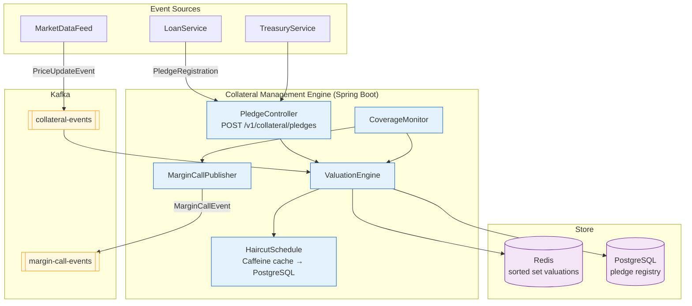

# Collateral Management Engine

Status: Draft | Last Reviewed: 2026-05-21 | Owner: @risk-management-domain-owner
Catalog ID: BSP-013 | Radii
Tier Applicability: T0, T1

## Problem Statement

Collateral is tracked in three separate systems — the loan origination platform, the treasury workstation, and the custody/depository system — with no cross-system aggregation. A secured loan can be simultaneously pledged as collateral in both the loan system and the treasury workstation without either knowing. The same bond holding can be counted twice toward two different facility coverage ratios, inflating apparent collateral adequacy.

Margin calls are calculated per-system: the loan system uses mark-to-market from the previous day's close while treasury uses real-time Bloomberg prices, producing different margin call amounts for the same collateral pool. A single borrower can receive contradictory margin call notices from the same bank on the same day.

Haircut rules — the percentage discount applied to market value for collateral eligibility — are embedded in code in each system and diverge over time as different teams apply uncoordinated patches. When the SBV revises collateral haircut floors, the bank must coordinate three separate deployments to bring all systems into compliance.

The SBV requires collateral coverage reports within 24 hours of a margin breach. Currently the bank needs 3 days to aggregate positions across the three systems, creating a recurring regulatory reporting gap.

## Context

The Collateral Management Engine is the single aggregation point for all pledged collateral across loans, repo trades, derivatives, and letter-of-credit facilities. It registers pledges, tracks market valuations, enforces haircut schedules, monitors coverage ratios, and triggers margin calls when a borrower's collateral value falls below the required minimum. It is mandatory for T0 secured lending and T1 treasury/repo products. External price feeds (Bloomberg/Reuters) are consumed from the FX Rate Engine (BSP-014 — authored in Wave 9C) and pushed as valuation events. The engine maintains a pledge registry in PostgreSQL and all real-time utilisation counters in Redis.

## Solution

An event-driven CollateralManagementEngine receives pledge registration events from lending and treasury services, consumes price update events from the market data feed, recalculates adjusted collateral value (market price × quantity × (1 − haircut)), checks coverage ratio against the credit facility's minimum collateral ratio from BSP-011 Credit Limit Engine, and emits a `MarginCallEvent` when coverage falls below the threshold. A Caffeine in-process cache holds haircut schedules refreshed every 5 minutes from PostgreSQL. A Redis sorted set tracks collateral valuations per facility for O(log N) range queries and O(1) total aggregation.



## Implementation Guidelines

**1. PledgeRegistration and ValuationEngine**

```java
public record PledgeRegistration(
    String pledgeId,          // UUID
    String facilityId,        // BSP-011 credit facility
    String assetId,           // ISIN or internal asset code
    String assetType,         // BOND | EQUITY | PROPERTY | CASH
    BigDecimal quantity,
    BigDecimal marketPrice,
    String currency,
    LocalDate valuationDate
) {}

@Service
@RequiredArgsConstructor
public class ValuationEngine {

    private final HaircutSchedule haircutSchedule;
    private final StringRedisTemplate redis;

    public BigDecimal calculateAdjustedValue(PledgeRegistration pledge) {
        BigDecimal haircut = haircutSchedule.getHaircut(pledge.assetType(), pledge.currency());
        BigDecimal grossValue = pledge.marketPrice().multiply(pledge.quantity());
        BigDecimal adjustedValue = grossValue.multiply(BigDecimal.ONE.subtract(haircut))
            .setScale(4, RoundingMode.HALF_UP);

        // Store adjusted value in Redis sorted set keyed by facilityId
        String key = "collateral:facility:" + pledge.facilityId();
        redis.opsForZSet().add(key, pledge.pledgeId(), adjustedValue.doubleValue());
        return adjustedValue;
    }

    public BigDecimal getTotalAdjustedValue(String facilityId) {
        String key = "collateral:facility:" + facilityId;
        Set<ZSetOperations.TypedTuple<String>> entries =
            redis.opsForZSet().rangeWithScores(key, 0, -1);
        if (entries == null) return BigDecimal.ZERO;
        return entries.stream()
            .map(e -> BigDecimal.valueOf(e.getScore()))
            .reduce(BigDecimal.ZERO, BigDecimal::add);
    }
}
```

**2. CoverageMonitor — margin call trigger**

```java
@Service
@RequiredArgsConstructor
public class CoverageMonitor {

    private final ValuationEngine valuationEngine;
    private final CreditFacilityClient facilityClient;   // BSP-011
    private final MarginCallPublisher publisher;

    public void checkCoverage(String facilityId) {
        BigDecimal totalCollateral = valuationEngine.getTotalAdjustedValue(facilityId);
        CreditFacility facility = facilityClient.getFacility(facilityId);

        BigDecimal utilisedAmount = facility.utilisedAmount();
        BigDecimal minRatio = facility.minimumCollateralRatio(); // e.g. 1.25 = 125%
        BigDecimal requiredCollateral = utilisedAmount.multiply(minRatio);

        if (totalCollateral.compareTo(requiredCollateral) < 0) {
            BigDecimal shortfall = requiredCollateral.subtract(totalCollateral);
            publisher.publish(new MarginCallEvent(
                facilityId,
                shortfall,
                totalCollateral,
                requiredCollateral,
                LocalDateTime.now()
            ));
        }
    }
}
```

**3. Pledge registry schema**

```sql
CREATE TABLE collateral_pledges (
    pledge_id          UUID PRIMARY KEY DEFAULT gen_random_uuid(),
    facility_id        UUID NOT NULL,
    asset_id           VARCHAR(20) NOT NULL,      -- ISIN or internal code
    asset_type         VARCHAR(20) NOT NULL,      -- BOND | EQUITY | PROPERTY | CASH
    quantity           NUMERIC(20,8) NOT NULL,
    last_market_price  NUMERIC(20,8) NOT NULL,
    currency           CHAR(3) NOT NULL,
    valuation_date     DATE NOT NULL,
    haircut_applied    NUMERIC(5,4) NOT NULL,     -- stored at time of valuation
    adjusted_value     NUMERIC(20,4) NOT NULL,
    pledged_at         TIMESTAMPTZ NOT NULL DEFAULT now(),
    released_at        TIMESTAMPTZ,               -- NULL = active pledge
    UNIQUE (facility_id, asset_id, pledged_at)
);

-- Partial index for active pledges
CREATE INDEX idx_collateral_active ON collateral_pledges (facility_id)
    WHERE released_at IS NULL;
```

## When to Use

- Any secured lending product where collateral value must be aggregated across asset types and product lines from a single registry
- When margin calls must be triggered automatically when collateral coverage falls below a configured ratio
- When haircut schedules must be centrally governed and applied consistently across lending and treasury channels
- When cross-facility double-pledging prevention is required

## When Not to Use

- Unsecured consumer lending with no collateral — use BSP-011 Credit Limit Engine directly
- Securities clearing and settlement margin (exchange-facing) — use the exchange's native margin system; this engine handles bilateral OTC collateral only
- Real-time FX position collateral for interbank trades where sub-millisecond revaluation is required — BSP-014 FX Rate Engine has tighter latency requirements for that use case

## Variants

| Variant | When to prefer | Trade-off |
|---------|----------------|-----------|
| Event-driven revaluation (this pattern) | Large collateral pools requiring continuous monitoring; real-time margin call triggers | Kafka dependency; price update lag possible |
| On-demand calculation | Low-volume secured lending; coverage only checked at loan review time | Simpler; no Redis sorted set; misses intraday breaches |
| Third-party collateral manager (Finastra/Murex) | Banks with existing treasury system investment | Off-the-shelf; expensive licensing; limited customisation for local regulatory requirements |

## NFR Acceptance Criteria

```yaml
nfr_acceptance_criteria:
  catalog_id: BSP-013
  pattern: Collateral Management Engine
  performance:
    - id: BSP-013-HP-01
      description: Pledge registration including haircut calculation and Redis sorted set update must complete within 20ms p99.
      threshold: p99 < 20ms
    - id: BSP-013-HP-02
      description: Coverage ratio check including Redis total aggregation must complete within 10ms p99.
      threshold: p99 < 10ms
  availability:
    - id: BSP-013-HA-01
      description: Collateral Management Engine must be available 99.99% for T0 secured lending paths.
      threshold: availability ≥ 99.99% (T0)
  correctness:
    - id: BSP-013-COR-01
      description: Adjusted collateral value must reflect the haircut schedule version active at the time of valuation; stale haircuts must not be applied.
      threshold: 0 stale-haircut valuation events per day (verified by reconciliation job)
    - id: BSP-013-COR-02
      description: Margin call event must be emitted within 60 seconds of a price update that causes coverage to fall below the minimum ratio.
      threshold: margin call latency p99 < 60s from price update event
```

## Compliance Mapping

| Ring | Regulation | Provision | How this pattern satisfies |
|------|-----------|-----------|---------------------------|
| Ring 0 | Basel III / CRR2 | Art. 207 — Collateral eligibility and haircut requirements | HaircutSchedule enforces Basel III haircut floors per asset type; haircut applied at time of valuation is stored on the pledge record (haircut_applied column) for audit; ineligible asset types are rejected at pledge registration |
| Ring 0 | IFRS 9 | §B5.5 — Collateral and other credit enhancements | Adjusted collateral value (post-haircut) is stored and linked to the credit facility for ECL Stage 2/3 loss-given-default calculation; valuation_date is always stored with the pledge |
| Ring 1 | BCBS 239 | §6 — Adaptability of risk data | MarginCallEvent carries facilityId, pledgeIds, shortfall, total collateral, and required collateral — sufficient for regulatory capital reporting; Kafka topic retention 90 days |
| Ring 2 | SBV Circular 39/2016 | Art. 15 — Collateral valuation and margin requirements for credit institutions | Haircut schedule is configurable per SBV-approved asset categories; all collateral valuations are timestamped and retained for SBV examination; margin calls are logged to structured audit trail ⚠️ (working summary — pending Legal review) |

## Cost / FinOps Notes

- Redis sorted sets for collateral valuations: one key per active credit facility; memory footprint = active facilities × pledges per facility × ~80 bytes = < 100 MB for 10,000 active facilities with 10 pledges each
- Caffeine haircut cache: < 1,000 entries even with full asset-type × currency × product coverage; no Redis cost for haircut lookups
- Kafka `collateral-events` and `margin-call-events` topics: 12 partitions each; retention 90 days for audit; ~$30/month storage
- PostgreSQL `collateral_pledges` table: append-only (released_at marks superseded pledges; rows are never deleted); archived to S3 Glacier after 7 years; ~$5/month at 1 M pledges per year
- No GPU or ML infrastructure required — all calculations are deterministic arithmetic over configured haircut schedules

## Threat Model Summary

**Haircut schedule manipulation (Tampering)**: an insider with database access lowers the haircut for EQUITY assets from 25% to 5%, inflating adjusted collateral values and reducing apparent margin shortfalls. Mitigation: `haircut_schedules` rows are append-only enforced by a PostgreSQL trigger (no UPDATE/DELETE without a new versioned row and audit entry); every haircut applied is stored on the pledge record (`haircut_applied` column) — a nightly reconciliation job detects any pledge whose stored haircut differs from the current active schedule; changes to haircut schedules require dual-approval in the Rate Admin UI (same pattern as BSP-006).

**Disputed margin call (Repudiation)**: a borrower claims the margin call was triggered by a stale price feed and the actual market value of their collateral was above the minimum ratio at call time. Mitigation: `MarginCallEvent` carries the exact market prices and quantities used in the coverage calculation at the time of the trigger; the `collateral_pledges` row stores `valuation_date`, `last_market_price`, and `haircut_applied` at the moment of valuation; all events are stored in an immutable Kafka topic retained 90 days and signed with HMAC-SHA256 using a Vault-managed key.

## Operational Runbook (stub)

1. Alert: MarginCallEventFailure — fires when MarginCallPublisher fails to publish to Kafka (circuit breaker open or topic unavailable). p50 resolution: 5 min; p99: 30 min. Check Kafka producer circuit breaker: `GET /actuator/health/kafkaProducerCircuitBreaker`. If topic is unavailable, margin call events queue in memory (bounded 10,000 events); restore Kafka connectivity; circuit breaker auto-resets after 60 seconds. Notify @risk-management-domain-owner immediately — undelivered margin calls are a regulatory breach.

2. Alert: CollateralHaircutStaleness — fires when Caffeine cache last-refresh timestamp is > 10 minutes old (metric: `collateral.haircut.cache.age.seconds`). Check PostgreSQL connectivity for the HaircutSchedule JPA query. If DB is unavailable, the engine continues with stale haircuts; log all valuations processed under stale haircuts for post-recovery reconciliation.

3. Alert: CollateralCoverageBreachUnacknowledged — fires when a MarginCallEvent has been on the `margin-call-events` topic for > 4 hours with no downstream acknowledgement. Escalate to @risk-management-domain-owner — manual intervention required to contact the borrower.

## Test Strategy (stub)

**Unit**: `ValuationEngineTest` — mock HaircutSchedule returning 0.25 for EQUITY; mock Redis sorted set; assert adjusted value = market price × quantity × 0.75 with HALF_UP rounding at scale 4; assert Redis sorted set entry created with correct score. `CoverageMonitorTest` — mock ValuationEngine returning total collateral below required; assert MarginCallEvent published with correct shortfall; mock ValuationEngine returning collateral above required; assert no MarginCallEvent.

**Integration**: `CollateralEngineIT` (Testcontainers — PostgreSQL + Redis) — register two pledges for a facility; assert Redis sorted set contains two entries summing to expected total; update market price for one asset; recalculate; assert adjusted total updated; reduce collateral below minimum ratio; assert MarginCallEvent emitted with correct shortfall amount; assert pledge record's haircut_applied matches active haircut schedule.

**Compliance**: `HaircutAuditTest` — after pledge registration, assert `collateral_pledges.haircut_applied` matches active haircut schedule; update haircut schedule to a new version; assert new valuations use new haircut; assert existing pledge records retain original `haircut_applied` value (immutable once written).

**Chaos**: Toxiproxy — disconnect Redis for 10 seconds during pledge registration; assert engine returns `SERVICE_UNAVAILABLE` (fail-closed — a pledge without a Redis entry would produce incorrect coverage calculations); restore Redis; assert first successful registration recreates sorted set entry with correct score.

## Related Patterns

- [BSP-011 Credit Limit Engine](credit-limit-engine.md) — CoverageMonitor calls BSP-011 to retrieve the facility's minimum collateral ratio and utilised amount
- [BSP-010 Rule / Decisioning Engine](rule-decisioning-engine.md) — collateral eligibility rules (which asset types qualify for which facilities) are authored in BSP-010 and evaluated at pledge registration
- BSP-014 FX Rate Engine — provides real-time market prices consumed as price update events (authored in Wave 9C)
- REF-016 Corporate Lending Platform — primary consumer of margin call events for secured corporate loans (authored in Wave 10)

## References

- Basel III: A global regulatory framework for more resilient banks — BCBS 2010/2011
- CRR2 (EU Capital Requirements Regulation No 575/2013) — Art. 207 Collateral eligibility and haircut requirements
- IFRS 9 Financial Instruments — IASB 2014
- BCBS 239 Principles for Effective Risk Data Aggregation — BCBS January 2013
- SBV Circular 39/2016/TT-NHNN — Lending activities of credit institutions

---
**Key Takeaway**: Register all collateral pledges in a single engine that calculates adjusted values using centralised haircut schedules, tracks coverage ratios in Redis sorted sets, and emits MarginCallEvents automatically — so margin breaches are detected within 60 seconds across all lending channels and collateral double-pledging across the loan and treasury systems is prevented.
