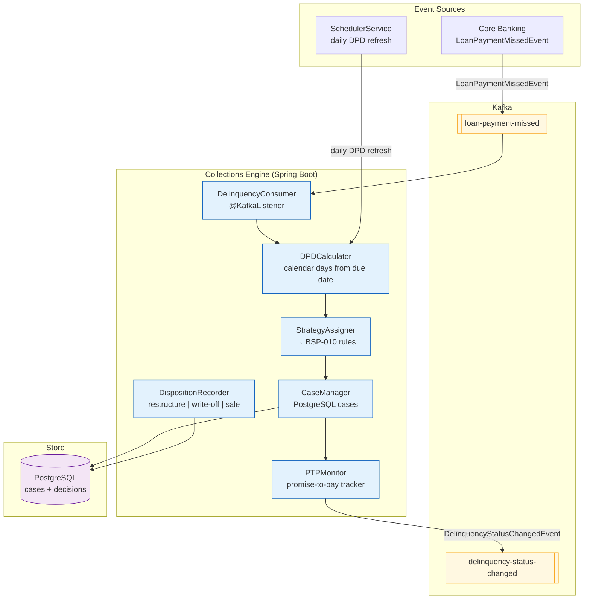

# Collections Engine

Status: Draft | Last Reviewed: 2026-05-21 | Owner: @risk-management-domain-owner
Catalog ID: BSP-019 | Radii
Tier Applicability: T0, T1

## Problem Statement

Collections for overdue loans is managed by three separate teams using three separate systems: retail collections uses a CRM module for phone campaigns, SME collections uses a spreadsheet to track promise-to-pay dates, and corporate collections is handled through direct relationship manager contact with no system tracking at all. When a loan moves from Stage 1 to Stage 2 under IFRS 9, there is no automated workflow trigger — the IFRS 9 classification happens in the regulatory reporting system while the collections workflow remains in the CRM, and the two systems have no integration.

Days-past-due calculation is inconsistent. The core banking system counts calendar days, the CRM counts business days, and the regulatory reporting engine uses a separate SQL query that neither matches. A loan that is 31 calendar days past due may be reported as 29 business days past due in the collections system, causing the IFRS 9 Stage 2 trigger (30 days past due) to be applied inconsistently across systems.

Promise-to-pay arrangements are not enforced. A customer who promises to pay by a specific date and then misses the promise generates no automated follow-up — the collections officer must manually review all open promises each morning, a process that takes 2 hours and is frequently incomplete.

Debt sale and write-off decisions are made ad-hoc by individual collections managers without a decision audit trail. Regulatory examiners asking for the basis of a specific write-off decision receive a manual summary that cannot be independently verified from system records.

## Context

The Collections Engine is the single system of record for all collection activities on overdue loans. It receives delinquency events from the core banking system (BSP-001 ledger balance queries), tracks days-past-due using a single authoritative calendar-day calculation, manages collections workflow (contact attempts, promise-to-pay arrangements, escalation queues), enforces IFRS 9 stage transition triggers, and records debt-disposition decisions (restructure, debt sale, write-off) with a complete audit trail. It integrates with BSP-010 Rule / Decisioning Engine for strategy assignment (which collection strategy applies to this borrower segment) and with BSP-011 Credit Limit Engine to block new drawings when a facility is delinquent. It is mandatory for T0 retail and SME loan portfolios and T1 corporate loans.

## Solution

An event-driven CollectionsEngine receives `LoanPaymentMissedEvent` from the core banking event stream, calculates the authoritative days-past-due using calendar days from the contractual due date, assigns a collection strategy via BSP-010, creates a collections case in PostgreSQL, schedules contact attempts via an outbound communication queue, tracks promise-to-pay arrangements, monitors promise breach and auto-escalates, and emits `DelinquencyStatusChangedEvent` to the IFRS 9 reporting system for stage classification. All disposition decisions (restructure, write-off, debt sale) are recorded in the `collections_decisions` table with the rule-engine decision rationale.



## Implementation Guidelines

**1. DPDCalculator and case creation**

```java
public record LoanPaymentMissedEvent(
    String loanId,
    String accountId,
    BigDecimal overdueAmount,
    LocalDate contractualDueDate,
    String currency,
    String productType,           // RETAIL_LOAN | SME_LOAN | CORPORATE_LOAN
    String customerSegment,
    Instant missedAt
) {}

@Service
@RequiredArgsConstructor
public class DPDCalculator {

    public int calculateDPD(LocalDate contractualDueDate, LocalDate asOf) {
        // Authoritative: calendar days (not business days)
        return (int) ChronoUnit.DAYS.between(contractualDueDate, asOf);
    }

    public IFrs9Stage resolveStage(int dpd, boolean forborne) {
        if (dpd == 0 && !forborne)  return IFRS9Stage.STAGE_1;
        if (dpd < 30 || forborne)   return IFRS9Stage.STAGE_2;
        return IFRS9Stage.STAGE_3;  // dpd >= 30 or defaulted
    }
}

@Service
@RequiredArgsConstructor
public class CaseManager {

    private final DPDCalculator dpdCalculator;
    private final StrategyAssigner strategyAssigner;
    private final CollectionsCaseRepository caseRepo;
    private final KafkaTemplate<String, DelinquencyStatusChangedEvent> kafka;

    public CollectionsCase openOrUpdate(LoanPaymentMissedEvent event) {
        int dpd = dpdCalculator.calculateDPD(event.contractualDueDate(), LocalDate.now());
        IFRS9Stage stage = dpdCalculator.resolveStage(dpd, false);

        String strategyId = strategyAssigner.assign(event.customerSegment(),
            event.productType(), dpd);

        CollectionsCase existingCase = caseRepo.findByLoanId(event.loanId())
            .orElse(null);

        if (existingCase != null && existingCase.ifrs9Stage() == stage) {
            // Update DPD and overdue amount only; no stage change event
            return caseRepo.save(existingCase.withDpd(dpd)
                .withOverdueAmount(event.overdueAmount()));
        }

        CollectionsCase updatedCase = CollectionsCase.builder()
            .loanId(event.loanId())
            .accountId(event.accountId())
            .dpd(dpd)
            .overdueAmount(event.overdueAmount())
            .currency(event.currency())
            .ifrs9Stage(stage)
            .strategyId(strategyId)
            .status("OPEN")
            .openedAt(Instant.now())
            .build();

        caseRepo.save(updatedCase);
        kafka.send("delinquency-status-changed",
            new DelinquencyStatusChangedEvent(event.loanId(), stage, dpd,
                event.overdueAmount(), Instant.now()));
        return updatedCase;
    }
}
```

**2. PTPMonitor — promise-to-pay enforcement**

```java
@Service
@RequiredArgsConstructor
public class PTPMonitor {

    private final PromiseToPay ptpRepository;
    private final CaseManager caseManager;
    private final KafkaTemplate<String, DelinquencyStatusChangedEvent> kafka;

    @Scheduled(cron = "0 0 8 * * MON-FRI")  // weekday mornings
    public void checkPromises() {
        LocalDate today = LocalDate.now();
        List<PromiseToPay> breachedPromises = ptpRepository
            .findByPromiseDateBeforeAndStatus(today, "PENDING");

        breachedPromises.forEach(ptp -> {
            ptpRepository.updateStatus(ptp.ptpId(), "BREACHED");
            // Escalate the case to next strategy tier
            caseManager.escalate(ptp.loanId(), "PTP_BREACH");
            kafka.send("delinquency-status-changed",
                new DelinquencyStatusChangedEvent(ptp.loanId(),
                    IFRS9Stage.STAGE_2, ptp.dpd(), ptp.overdueAmount(), Instant.now()));
        });
    }
}
```

**3. Collections case schema**

```sql
CREATE TABLE collections_cases (
    case_id           UUID PRIMARY KEY DEFAULT gen_random_uuid(),
    loan_id           VARCHAR(50) NOT NULL,
    account_id        VARCHAR(50) NOT NULL,
    dpd               INT NOT NULL,
    overdue_amount    NUMERIC(20,2) NOT NULL,
    currency          CHAR(3) NOT NULL,
    ifrs9_stage       VARCHAR(10) NOT NULL,   -- STAGE_1 | STAGE_2 | STAGE_3
    strategy_id       VARCHAR(50) NOT NULL,   -- BSP-010 rule set ID
    status            VARCHAR(20) NOT NULL,   -- OPEN | PTP | ESCALATED | CLOSED
    opened_at         TIMESTAMPTZ NOT NULL,
    closed_at         TIMESTAMPTZ,
    UNIQUE (loan_id)
);

CREATE TABLE promise_to_pay (
    ptp_id        UUID PRIMARY KEY DEFAULT gen_random_uuid(),
    case_id       UUID NOT NULL REFERENCES collections_cases(case_id),
    loan_id       VARCHAR(50) NOT NULL,
    promise_date  DATE NOT NULL,
    promise_amount NUMERIC(20,2) NOT NULL,
    status        VARCHAR(20) NOT NULL DEFAULT 'PENDING', -- PENDING | KEPT | BREACHED
    dpd           INT NOT NULL,
    overdue_amount NUMERIC(20,2) NOT NULL,
    created_at    TIMESTAMPTZ NOT NULL DEFAULT now()
);

CREATE TABLE collections_decisions (
    decision_id      UUID PRIMARY KEY DEFAULT gen_random_uuid(),
    case_id          UUID NOT NULL REFERENCES collections_cases(case_id),
    decision_type    VARCHAR(30) NOT NULL,  -- RESTRUCTURE | WRITE_OFF | DEBT_SALE
    decided_by       VARCHAR(100) NOT NULL,
    rule_decision_id VARCHAR(36),           -- BSP-010 Decision.firedRules reference
    rationale        TEXT NOT NULL,
    decided_at       TIMESTAMPTZ NOT NULL DEFAULT now()
);
```

## When to Use

- Any loan portfolio requiring automated DPD tracking, IFRS 9 stage classification triggers, and structured collections workflow
- When promise-to-pay arrangements must be automatically monitored and escalated on breach
- When debt-disposition decisions (write-off, debt sale, restructure) must be auditable with decision rationale linked to BSP-010 rule outcomes
- When IFRS 9 stage changes must be emitted as events to the regulatory reporting system in real time

## When Not to Use

- Credit card minimum payment tracking — credit card collections follows different regulatory rules and cycle billing logic; use a purpose-built credit card delinquency module
- Trade finance documentary credit collection — collections for LCs and guarantees follows SWIFT messaging protocols; the Collections Engine handles loan delinquency only
- Customer credit dispute resolution — use BSP-012 Dispute Management; the Collections Engine manages collection workflow, not dispute adjudication

## Variants

| Variant | When to prefer | Trade-off |
|---------|----------------|-----------|
| Event-driven DPD + rule-based strategy (this pattern) | Retail and SME loan portfolios; IFRS 9 stage automation required | BSP-010 dependency for strategy assignment; Kafka required for IFRS 9 real-time events |
| CRM-integrated collections | Banks with existing Salesforce or Siebel CRM investment | Rich contact management; limited IFRS 9 automation; no DPD authoritative source |
| Manual spreadsheet workflow | Very small portfolios (< 1,000 delinquent accounts); no IFRS 9 real-time requirement | Zero infrastructure cost; no audit trail; does not scale |

## NFR Acceptance Criteria

```yaml
nfr_acceptance_criteria:
  catalog_id: BSP-019
  pattern: Collections Engine
  performance:
    - id: BSP-019-HP-01
      description: LoanPaymentMissedEvent processing including DPD calculation, strategy assignment, and case creation must complete within 100ms p99.
      threshold: p99 < 100ms
    - id: BSP-019-HP-02
      description: Daily PTP breach check across all pending promises must complete within 5 minutes.
      threshold: completion < 5 minutes for up to 100,000 active PTP records
  availability:
    - id: BSP-019-HA-01
      description: Collections Engine must be available 99.9% for T0 retail loan delinquency event processing; IFRS 9 stage change events must not be lost during degraded mode.
      threshold: availability ≥ 99.9% (T0); Kafka guarantees event durability during engine downtime
  correctness:
    - id: BSP-019-COR-01
      description: DPD must be calculated as calendar days from contractual due date; business-day calculation must not be used.
      threshold: 0 DPD calculation discrepancies verified against reference calendar
    - id: BSP-019-COR-02
      description: DelinquencyStatusChangedEvent must be emitted within 30 seconds of a DPD threshold crossing (30 days = Stage 2, default = Stage 3).
      threshold: event emission latency < 30s from threshold crossing
```

## Compliance Mapping

| Ring | Regulation | Provision | How this pattern satisfies |
|------|-----------|-----------|---------------------------|
| Ring 0 | IFRS 9 | §B5.5.2 — Significant increase in credit risk triggers Stage 2 classification | DelinquencyStatusChangedEvent is emitted on every IFRS 9 stage transition; DPD threshold (30 days) is configurable and auditable; stage history is retained in collections_cases |
| Ring 0 | IFRS 9 | §B5.5.4 — Default definition for Stage 3 (≥ 90 DPD or unlikeliness to pay) | DPDCalculator.resolveStage() enforces the 90-day backstop; unlikeliness-to-pay is evaluated via BSP-010 rule engine and overrides the DPD threshold when triggered earlier |
| Ring 1 | BCBS 239 | §4 Granularity; §5 Timeliness | Every collections case records loan_id, dpd, overdue_amount, strategy_id, and ifrs9_stage; portfolio-level NPL data queryable by product type and segment for risk reporting |
| Ring 2 | SBV Circular 11/2021/TT-NHNN | Art. 10 — Loan classification and provisioning requirements | ifrs9_stage maps to SBV's five-tier loan classification (Standard, Special Mention, Substandard, Doubtful, Loss); collections_decisions records write-off basis required for SBV supervisory review ⚠️ (working summary — pending Legal review) |

## Cost / FinOps Notes

- PostgreSQL `collections_cases`, `promise_to_pay`, `collections_decisions`: moderate size — millions of rows for a large retail portfolio; partitioned by opened_at year; archived after 10 years (SBV retention); ~$20/month
- Kafka `loan-payment-missed` and `delinquency-status-changed` topics: 12 partitions each; retention 30 days; ~$20/month
- Collections Engine pods: 2 replicas steady-state; scales to 4 during EOD delinquency event burst; ~$25/month
- BSP-010 Rule Engine calls for strategy assignment: cached per segment × product_type × DPD_bucket; few distinct strategy assignments; BSP-010 call volume is low
- No GPU or ML infrastructure required — IFRS 9 stage classification is deterministic rule-based logic; ML-based PD scoring (if adopted) would be a separate pattern

## Threat Model Summary

**IFRS 9 stage manipulation (Tampering)**: an insider with direct PostgreSQL access updates `collections_cases.ifrs9_stage` to STAGE_1 for a loan that should be STAGE_2, reducing the provisioning requirement for that borrower and inflating reported capital ratios. Mitigation: the `collections_cases` table is written only by the Collections Engine service account; direct DML access is restricted via PostgreSQL row-level security; all stage transitions are emitted as `DelinquencyStatusChangedEvent` to an immutable Kafka topic; a nightly reconciliation job cross-checks the PostgreSQL stage against the independently calculated DPD threshold and alerts on any discrepancy.

**Promise-to-pay manipulation (Repudiation)**: a collections officer records a false promise-to-pay with a far-future date to avoid escalation, hiding a delinquent account from management reporting. Mitigation: `promise_to_pay` rows are created with the officer's authenticated identity from the JWT (`created_by`); promise dates beyond 90 days from today are rejected by the service layer; all PTP records are included in the weekly delinquency management report that is reviewed by @risk-management-domain-owner; BSP-010 strategy assignment rules include a check for accounts with > 2 consecutive PTP breaches and auto-escalate to the next strategy tier.

## Operational Runbook (stub)

1. Alert: DelinquencyEventLag — fires when Kafka consumer group `collections-engine` lag on `loan-payment-missed` exceeds 5,000 events for more than 5 minutes. Scale out: `kubectl scale deployment collections-engine --replicas=4 -n risk`. Common cause: a large batch of month-end payment reminders generating simultaneous missed-payment events. Check BSP-010 strategy assignment latency — slow rule evaluation is the most common downstream bottleneck.

2. Alert: PTPBreachCheckTimeout — fires when the daily PTP breach check (scheduled job) does not complete within 5 minutes. Check the `promise_to_pay` table size for the current day: `SELECT COUNT(*) FROM promise_to_pay WHERE status = 'PENDING' AND promise_date <= NOW()`. If count exceeds 200,000, the index may need a rebuild: `REINDEX INDEX CONCURRENTLY idx_ptp_pending`. Notify @risk-management-domain-owner that PTP breach escalations for today may be delayed.

3. Alert: IFRS9StageDiscrepancy — fires when the nightly reconciliation detects cases where PostgreSQL ifrs9_stage does not match the independently computed DPD-based stage. Immediately escalate to @risk-management-domain-owner and @head-of-compliance — any discrepancy in IFRS 9 staging is a regulatory reporting risk. Freeze write access to `collections_cases.ifrs9_stage` until the root cause is identified.

## Test Strategy (stub)

**Unit**: `DPDCalculatorTest` — assert calculateDPD returns 0 when asOf = contractualDueDate; assert 30 when asOf = dueDate + 30 days (calendar days); assert resolveStage returns STAGE_1 for 0 DPD; STAGE_2 for 1–29 DPD; STAGE_3 for 30+ DPD; assert forborne flag overrides to STAGE_2 regardless of DPD. `PTPMonitorTest` — mock repository returning one PENDING PTP with promise_date = yesterday; assert status updated to BREACHED; assert DelinquencyStatusChangedEvent published; assert case escalated.

**Integration**: `CollectionsEngineIT` (Testcontainers — PostgreSQL + Kafka) — publish LoanPaymentMissedEvent with DPD = 31; assert collections_cases row with ifrs9_stage = STAGE_3; assert DelinquencyStatusChangedEvent on `delinquency-status-changed` topic; create PENDING PTP with promise_date = yesterday; run PTPMonitor; assert PTP status = BREACHED; assert escalation event on Kafka.

**Compliance**: `IFRS9StageIT` — seed loans at DPD = 29; assert STAGE_2; advance DPD to 30; assert stage transitions to STAGE_3; assert DelinquencyStatusChangedEvent emitted with correct stage and DPD; assert collections_cases.ifrs9_stage matches event.

**Chaos**: make BSP-010 rule engine unavailable for 30 seconds; assert Collections Engine falls back to default strategy (STANDARD_RETAIL_COLLECTION); assert loan-payment-missed events continue to be processed; assert BSP-010 unavailability is logged; restore BSP-010; assert strategy reassignment occurs on next DPD refresh.

## Related Patterns

- [BSP-010 Rule / Decisioning Engine](rule-decisioning-engine.md) — StrategyAssigner calls BSP-010 to determine the appropriate collection strategy for each borrower segment × product type × DPD band
- [BSP-011 Credit Limit Engine](credit-limit-engine.md) — Collections Engine calls BSP-011 to place a hold on credit facility drawings when a borrower's loan is STAGE_2 or STAGE_3
- [BSP-001 Double-Entry Ledger](double-entry-ledger.md) — write-off disposition triggers a BSP-001 ledger posting to the Loan Loss Reserve GL account
- REF-014 Consumer Lending Platform — primary publisher of LoanPaymentMissedEvent for retail loan delinquencies (authored in Wave 10)

Note: REF-014 is plain text as that file does not exist yet.

## References

- IFRS 9 Financial Instruments — Stage classification and default definition §B5.5 — IASB 2014
- BCBS 239 Principles for Effective Risk Data Aggregation — BCBS January 2013
- SBV Circular 11/2021/TT-NHNN — Loan classification and provisioning for credit institutions
- Basel III — Expected Credit Loss and provisioning requirements

---
**Key Takeaway**: Centralise all delinquency tracking in a single engine that calculates authoritative calendar-day DPD, assigns collection strategies via BSP-010, monitors promise-to-pay compliance, and emits IFRS 9 stage change events in real time — so every stage classification is traceable, promise breaches trigger automatic escalation, and disposal decisions carry a full rule-engine rationale for regulatory examination.
