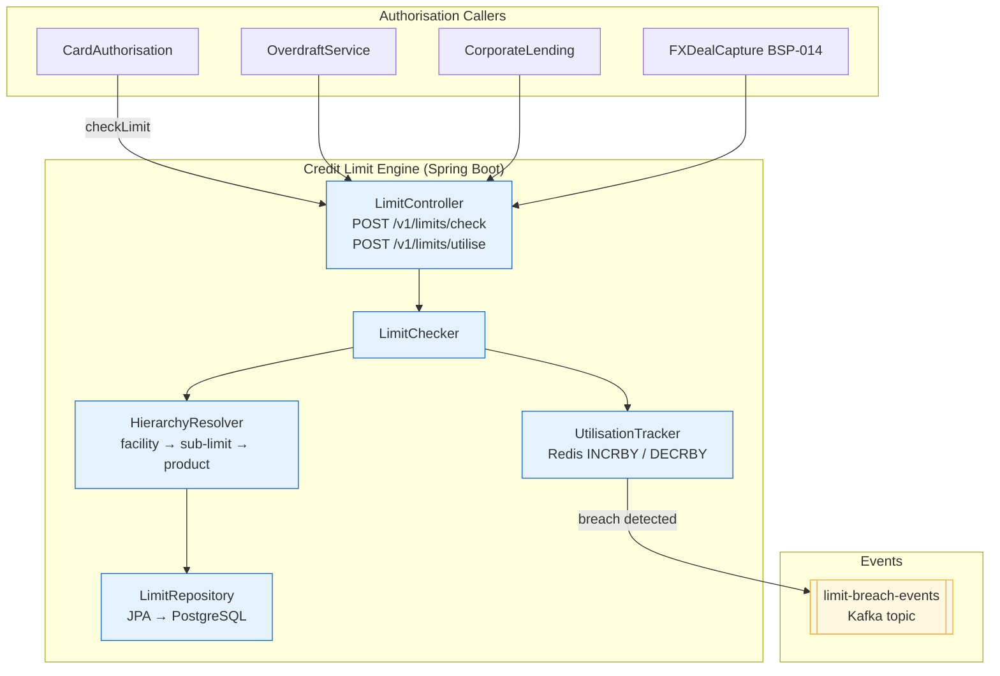

# Credit Limit Engine

Status: Draft | Last Reviewed: 2026-05-21 | Owner: @risk-management-domain-owner
Catalog ID: BSP-011 | Radii
Tier Applicability: T0, T1

## Problem Statement

Card authorisation limits are enforced by the card management system, overdraft limits by the core banking ledger, and corporate facility limits by the loan management platform — three separate systems with no unified view of total customer exposure. A corporate customer with a VND 10B aggregate credit facility can simultaneously draw VND 8B from the revolving credit line, VND 4B from an overdraft facility, and attempt a VND 3B FX deal, with none of the three systems aware that the other two have already consumed the available headroom.

The risk desk cannot see intraday aggregate utilisation across products. The only cross-product view is a next-day batch report generated at midnight, meaning a breach discovered at 09:00 the following morning has already been extended and settled.

Sub-limits — for example, a VND 5B corporate facility with a VND 2B sub-limit specifically for FX transactions — are not enforced systematically. The FX dealing desk must manually check a spreadsheet before approving a deal, and the spreadsheet is updated only at end of day.

When a limit breach is detected in the next-day batch, the manual escalation process requires the risk officer to contact the relationship manager, identify the breaching product, request a manual reversal or margin call, and update the exposure report — a process that takes 4–8 hours and introduces regulatory reporting risk if it spans a reporting date.

## Context

The Credit Limit Engine is the single enforcement point for all credit exposure checks across products. It is mandatory (T0) for card authorisation, overdraft, and corporate lending paths where a missed limit check would create uncontrolled credit exposure. T1 products (trade finance, FX dealing) use it for facility-level sub-limit checks. The engine maintains a unified limit hierarchy — customer → facility → sub-limit → product — in PostgreSQL, with real-time utilisation counters in Redis using atomic INCRBY/DECRBY operations. Limit updates (new facilities, limit increases, repayments) are propagated within 1 second via Kafka. The engine does not make credit scoring decisions (that is BSP-010 Rule Engine's domain); it enforces already-approved limits.

## Solution

A centralised CreditLimitEngine exposes two endpoints: `POST /v1/limits/check` (read-only availability check returning headroom) and `POST /v1/limits/utilise` (atomic check-and-reserve, consumes headroom on approval). The limit hierarchy is stored in PostgreSQL with effective dates; Redis holds the real-time utilisation counters for the hot path. When utilisation exceeds a configured threshold, a `LimitBreachEvent` is published to Kafka for downstream risk monitoring.



## Implementation Guidelines

**1. LimitCheckRequest / LimitCheckResult records**

```java
public record LimitCheckRequest(
    String customerId,
    String facilityId,          // nullable — omit for product-level limit check only
    String productCode,
    BigDecimal requestedAmount,
    String currency,
    String transactionRef       // idempotency key — prevents double-decrement on retry
) {}

public record LimitCheckResult(
    String outcome,             // "APPROVE" | "DECLINE" | "EXCESS_ALLOWED"
    BigDecimal availableHeadroom,
    BigDecimal currentUtilisation,
    BigDecimal limit,
    String limitId
) {}

@RestController
@RequestMapping("/v1/limits")
@RequiredArgsConstructor
public class LimitController {

    private final LimitChecker checker;

    @PostMapping("/check")
    public LimitCheckResult check(@RequestBody LimitCheckRequest req) {
        return checker.check(req, false);  // read-only — does not reserve headroom
    }

    @PostMapping("/utilise")
    public LimitCheckResult utilise(@RequestBody LimitCheckRequest req) {
        return checker.check(req, true);   // atomic check-and-reserve
    }
}
```

**2. UtilisationTracker — atomic Redis counter in minor currency units**

```java
@Component
@RequiredArgsConstructor
public class UtilisationTracker {

    private final StringRedisTemplate redis;

    public BigDecimal incrementAndGet(String limitId, BigDecimal amount, String currency) {
        String key = "util:" + limitId + ":" + currency;
        // Store in minor currency units (VND has no minor units, multiply by 1; USD ×100)
        long amountMinor = amount.movePointRight(0).longValueExact();
        Long newTotal = redis.opsForValue().increment(key, amountMinor);
        return BigDecimal.valueOf(newTotal);
    }

    public void decrement(String limitId, BigDecimal amount, String currency) {
        String key = "util:" + limitId + ":" + currency;
        redis.opsForValue().increment(key, -amount.movePointRight(0).longValueExact());
    }

    public BigDecimal getUtilisation(String limitId, String currency) {
        String val = redis.opsForValue().get("util:" + limitId + ":" + currency);
        return val == null ? BigDecimal.ZERO : new BigDecimal(val);
    }
}
```

**3. Credit facility hierarchy schema**

```sql
CREATE TABLE credit_facilities (
    id              UUID PRIMARY KEY DEFAULT gen_random_uuid(),
    customer_id     VARCHAR(50) NOT NULL,
    parent_id       UUID REFERENCES credit_facilities(id),  -- NULL = top-level facility
    product_code    VARCHAR(50),                             -- NULL = facility-level limit
    limit_amount    NUMERIC(20,4) NOT NULL,
    currency        CHAR(3) NOT NULL,
    effective_from  DATE NOT NULL,
    effective_to    DATE,                                    -- NULL = currently active
    limit_type      VARCHAR(20) NOT NULL,                   -- HARD | SOFT | REVOLVING
    approved_by     VARCHAR(100) NOT NULL,
    CONSTRAINT chk_limit_type CHECK (limit_type IN ('HARD','SOFT','REVOLVING'))
);

-- Index for fast customer exposure lookup
CREATE INDEX idx_facilities_customer ON credit_facilities (customer_id)
    WHERE effective_to IS NULL;
```

## When to Use

- Any transaction path where exceeding a pre-approved credit facility would create uncontrolled exposure
- When cross-product exposure must be aggregated in real time (card + overdraft + corporate lending)
- When sub-limits within a facility must be enforced independently (e.g., FX sub-limit within a trade finance facility)
- When limit breach events must trigger downstream risk monitoring within seconds, not overnight batch

## When Not to Use

- Credit scoring or eligibility decisions — use BSP-010 Rule Engine; the Credit Limit Engine only enforces already-approved limits
- Settlement netting exposure (bilateral or multilateral) — use the Settlement Engine (BSP-016) which has its own netting-aware exposure model
- Simple single-product transaction caps without facility hierarchy — use BSP-012 Transaction Limit Engine for per-customer per-channel daily/hourly caps

## Variants

| Variant | When to prefer | Trade-off |
|---------|----------------|-----------|
| Redis-backed real-time (this pattern) | T0 card authorisation; sub-second breach detection required | Redis state must be reconciled with PostgreSQL nightly; failover complexity |
| PostgreSQL-only (advisory lock) | Low-volume T1 corporate lending with few concurrent transactions | Simpler state; advisory lock contention at high transaction rates |
| Event-sourced utilisation | Full auditability of every increment/decrement; event replay on Redis cold start | Higher operational complexity; useful when regulatory replay is required |

## NFR Acceptance Criteria

```yaml
nfr_acceptance_criteria:
  catalog_id: BSP-011
  pattern: Credit Limit Engine
  performance:
    - id: BSP-011-HP-01
      description: Limit check (Redis read path) must complete within 10ms p99; utilise (INCRBY) within 5ms p99.
      threshold: check p99 < 10ms; utilise p99 < 5ms
  availability:
    - id: BSP-011-HA-01
      description: Credit Limit Engine must be available 99.99% for T0 card authorisation and overdraft paths.
      threshold: availability ≥ 99.99% (T0); utilisation counter updated within 1 second of transaction
  correctness:
    - id: BSP-011-COR-01
      description: Redis utilisation must not drift more than 0.1% from PostgreSQL-computed utilisation at end of day.
      threshold: |Redis utilisation − PostgreSQL utilisation| ≤ 0.1% (verified by nightly reconciliation job)
    - id: BSP-011-COR-02
      description: A DECLINE outcome must be enforced — no transaction approved when limitCheckResult.outcome == DECLINE.
      threshold: 0 unauthorised approvals past limit (verified by reconciliation alert)
```

## Compliance Mapping

| Ring | Regulation | Provision | How this pattern satisfies |
|------|-----------|-----------|---------------------------|
| Ring 0 | Basel III | §§4.1–4.3 — Credit risk measurement and exposure limits | Unified limit hierarchy with real-time utilisation provides the aggregate exposure view required for Basel credit risk capital calculations |
| Ring 0 | NIST SP 800-53 | AC-6 — Least privilege for limit override | Limit overrides require `CREDIT_LIMIT_OVERRIDE` ABAC role (BSP-011 integrates with SEC-010); dual-approval workflow enforced via BSP-010 Rule Engine |
| Ring 1 | BCBS 239 | §§4–6 — Aggregated exposure data across all products in real-time | Redis counters provide intraday cross-product utilisation; Kafka `limit-breach-events` feed risk data aggregation pipeline; no manual cross-reference required |
| Ring 1 | BCBS 230 | §27 — Limit breach escalation within operational resilience framework | `LimitBreachEvent` on Kafka triggers automated risk desk alert within seconds; breach escalation runbook documented in this pattern |
| Ring 2 | SBV Circular 41/2016; SBV Circular 09/2020 | Credit classification and provisioning thresholds (Circ. 41); breach event logging (Circ. 09 §IV.2) | Limit breach events logged with customerId, facilityId, utilisationAmount, and timestamp; retained per SBV requirements ⚠️ (working summary — pending Legal review) |

## Cost / FinOps Notes

- Credit Limit Engine pods: 3 replicas (HA); stateless hot path; ~$40/month compute
- Redis utilisation counters: one key per active facility per currency; < 100K keys even at full scale; shared Redis cluster — marginal cost increment
- PostgreSQL `credit_facilities` table: < 500K rows at full scale with history; standard indexing cost
- Kafka `limit-breach-events`: low volume (breaches are rare); 4 partitions; retention 90 days; < $5/month
- Nightly reconciliation job (Spring Batch): compares Redis counters to PostgreSQL; runs in 5 minutes; negligible compute cost

## Threat Model Summary

**Tampering — unauthorized Redis utilisation reset (Tampering)**: an operations staff member with Redis access manually sets `util:<limitId>:VND` to 0, creating artificial headroom for a declined transaction and allowing a customer to exceed their approved credit limit. Mitigation: Redis is not directly accessible to operations staff — only the CreditLimitEngine service account has write access to `util:*` keys via network policy; limit overrides require a `LimitAdminService` API call with `CREDIT_LIMIT_OVERRIDE` ABAC role (SEC-010) and dual-approval workflow via BSP-010 Rule Engine; all limit override API calls are logged to the immutable audit trail.

**Denial of Service — limit check request flood (Denial of Service)**: a compromised card authorisation service sends 500,000 limit check requests per second, exhausting Redis connection pool and preventing legitimate authorisations from completing. Mitigation: Resilience4j `RateLimiter` on `LimitController` (max 10,000 requests/second per pod); circuit breaker on the Redis client (opens after 50% error rate over a 10-second window); when the circuit breaker is open, the Limit Engine returns a configurable fail-safe response (APPROVE for pre-authorised low-value transactions, DECLINE for all others) pending Redis recovery.

## Operational Runbook (stub)

1. Alert: CreditLimitBreachUnauthorized — fires when nightly reconciliation detects a transaction that was approved despite `limitCheckResult.outcome == DECLINE`. p50 resolution: 30 min; p99: 4 hours. Immediately escalate to the Risk Management team. Identify the breaching transaction by querying the `limit-decisions` audit log. Determine if the bypass was a system bug or an intentional override missing an audit record. If bug: raise P1 incident; if override: escalate to Compliance.

2. Alert: LimitUtilisationRedisLag — fires when Redis utilisation diverges from PostgreSQL-computed utilisation by more than 0.1% on any facility. p50 resolution: 15 min; p99: 1 hour. Trigger the reconciliation job manually: `kubectl exec -n banking credit-limit-engine-<pod> -- java -jar reconcile.jar`. If divergence exceeds 5%, freeze new utilisations on the affected facility until reconciliation completes.

3. Alert: LimitRedisConnectionPoolExhausted — fires when Redis connection pool utilisation exceeds 90% sustained over 2 minutes. Scale out Credit Limit Engine pods: `kubectl scale deployment credit-limit-engine --replicas=6 -n banking`. Check for runaway limit check callers via Kafka `limit-check-requests` topic consumer group lag.

## Test Strategy (stub)

**Unit**: `UtilisationTrackerTest` — mock Redis; assert INCRBY correctly converts BigDecimal to minor units; assert DECRBY subtracts correctly; assert getUtilisation returns ZERO for missing key. `LimitCheckerTest` — mock HIER returning a VND 1B limit; mock UTIL returning VND 800M; assert check returns APPROVE with headroom VND 200M; assert request for VND 300M returns DECLINE.

**Integration**: `CreditLimitEngineIT` (Testcontainers — PostgreSQL + Redis + Kafka) — create facility hierarchy with parent VND 5B + sub-limit FX VND 2B; utilise VND 1.5B from FX sub-limit; assert parent utilisation = 1.5B; utilise VND 600M more; assert DECLINE on FX sub-limit (would exceed VND 2B); assert `LimitBreachEvent` on Kafka; verify nightly reconciliation job confirms Redis = PostgreSQL.

**Compliance**: `LimitAuditIT` — after a DECLINE decision, assert the decision is logged to `limit-decisions` with customerId, facilityId, requestedAmount, currentUtilisation, and outcome; assert no raw Redis key values in the log (no internal implementation details exposed).

**Chaos**: Toxiproxy — disconnect Redis for 30 seconds; assert Credit Limit Engine applies fail-safe policy (low-value pre-approved = APPROVE, all others = DECLINE); reconnect Redis; assert utilisation counters reconciled from PostgreSQL within 60 seconds.

## Related Patterns

- [BSP-010 Rule / Decisioning Engine](rule-decisioning-engine.md) — limit override approvals evaluated via BSP-010; dual-approval workflow uses Rule Engine
- [SEC-010 Attribute-Based Access Control](../security/attribute-based-access-control.md) — `CREDIT_LIMIT_OVERRIDE` role enforced via ABAC policy
- BSP-012 Transaction Limit Engine — per-channel per-customer daily and velocity caps (authored in Wave 9B)
- BSP-013 Collateral Management Engine — collateral values feed into facility limit calculations (authored in Wave 9B)

## References

- Basel III: A Global Regulatory Framework for More Resilient Banks and Banking Systems — BCBS 2010
- BCBS 239 Principles for Effective Risk Data Aggregation — BCBS January 2013
- BCBS 230 Principles for Sound Stress Testing Practices — BCBS May 2009
- SBV Circular 41/2016/TT-NHNN — Prudential ratios for credit institutions
- SBV Circular 09/2020/TT-NHNN — Information System Security for Credit Institutions
- Redis documentation: atomic counters — redis.io/docs/manual/data-types/strings

---
**Key Takeaway**: Maintain a single real-time credit limit hierarchy in Redis so that card authorisations, overdraft draws, and corporate drawdowns all check against the same customer exposure view — preventing multi-product limit circumvention and enabling intraday breach detection instead of next-day batch discovery.
