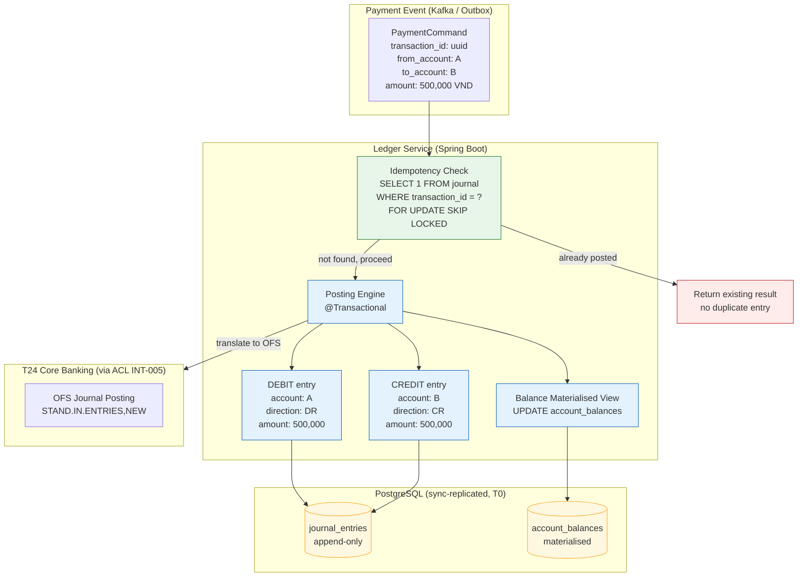

# Double-Entry Ledger

Status: Draft | Last Reviewed: 2026-05-09 | Owner: @tech-lead-backend
Catalog ID: BSP-001 | Radii
Tier Applicability: T0, T1

## Problem Statement

Every financial system rests on the double-entry bookkeeping invariant, and violations are visible to regulators, auditors, and customers:

- **Money creation risk**: a single-leg write or an unchecked partial commit can credit an account without a corresponding debit, creating phantom money. Even a millisecond window of inconsistency is exploitable under concurrency.
- **Distributed-transaction hazard**: a payment spans multiple microservices (fee, FX, settlement). A network failure mid-flight can leave one leg posted and the other absent, breaking the sum-zero invariant across service boundaries.
- **Mutation and tampering**: ledger entries that can be updated or deleted in place destroy the forensic chain of custody required by BCBS 239 and Vietnam Accounting Standards. Reconciliation becomes impossible when the "source of truth" changes retroactively.
- **Idempotency failures under retry**: a payment gateway retry that does not check for a prior successful post will create a duplicate debit, charging the customer twice. This is a Category 1 financial error.
- **Balance staleness**: a balance computed by scanning millions of ledger rows at query time introduces read latency and lock contention at peak TPS. Materialised balance views must be consistent with the ledger while remaining performant.

## Solution

Implement an append-only double-entry ledger as the financial system of record. Every value movement posts two symmetric ledger entries — a debit and a credit of equal amount — within a single atomic database transaction. The `transaction_id` field is the idempotency key. Balances are computed as materialised views over ledger entries. No entry is ever updated or deleted; reversals are new entries with negated signs.



### Entity-Relationship Diagram

```mermaid
erDiagram
    ACCOUNTS {
        uuid        account_id      PK
        varchar     account_number
        varchar     currency        "ISO 4217"
        varchar     account_type    "ASSET|LIABILITY|EQUITY|REVENUE|EXPENSE"
        timestamptz created_at
    }

    JOURNAL_ENTRIES {
        uuid        entry_id        PK
        uuid        transaction_id  FK  "idempotency key"
        uuid        account_id      FK
        varchar     direction       "DR|CR"
        numeric     amount          "positive always"
        varchar     currency
        text        reference       "payment ref, OFS journal ID"
        timestamptz posted_at       "immutable"
        uuid        reversal_of     "nullable — points to reversed entry"
    }

    TRANSACTIONS {
        uuid        transaction_id  PK
        varchar     status          "PENDING|POSTED|REVERSED|FAILED"
        varchar     initiated_by
        timestamptz created_at
        timestamptz posted_at
    }

    ACCOUNT_BALANCES {
        uuid        account_id      PK  FK
        numeric     balance         "SUM(CR) - SUM(DR)"
        timestamptz as_of           "last materialised"
        bigint      version         "optimistic lock"
    }

    ACCOUNTS        ||--o{ JOURNAL_ENTRIES  : "has entries"
    TRANSACTIONS    ||--o{ JOURNAL_ENTRIES  : "contains"
    ACCOUNTS        ||--|| ACCOUNT_BALANCES : "has balance"
```

## Implementation Guidelines

### 1. PostgreSQL Schema — Append-Only Journal with Sum-Zero Constraint

```sql
-- Accounts table: the chart of accounts
CREATE TABLE accounts (
    account_id     UUID         PRIMARY KEY DEFAULT gen_random_uuid(),
    account_number VARCHAR(20)  NOT NULL UNIQUE,
    currency       CHAR(3)      NOT NULL DEFAULT 'VND',
    account_type   VARCHAR(16)  NOT NULL CHECK (account_type IN
                                ('ASSET','LIABILITY','EQUITY','REVENUE','EXPENSE')),
    created_at     TIMESTAMPTZ  NOT NULL DEFAULT NOW()
);

-- Idempotency / transaction header
CREATE TABLE transactions (
    transaction_id  UUID         PRIMARY KEY,
    status          VARCHAR(16)  NOT NULL DEFAULT 'PENDING'
                                 CHECK (status IN ('PENDING','POSTED','REVERSED','FAILED')),
    initiated_by    VARCHAR(128) NOT NULL,   -- service or user principal
    created_at      TIMESTAMPTZ  NOT NULL DEFAULT NOW(),
    posted_at       TIMESTAMPTZ
);

-- Append-only journal: the immutable ledger
CREATE TABLE journal_entries (
    entry_id       UUID         PRIMARY KEY DEFAULT gen_random_uuid(),
    transaction_id UUID         NOT NULL REFERENCES transactions(transaction_id),
    account_id     UUID         NOT NULL REFERENCES accounts(account_id),
    direction      CHAR(2)      NOT NULL CHECK (direction IN ('DR','CR')),
    amount         NUMERIC(20,4) NOT NULL CHECK (amount > 0),
    currency       CHAR(3)      NOT NULL DEFAULT 'VND',
    reference      TEXT,
    posted_at      TIMESTAMPTZ  NOT NULL DEFAULT NOW(),
    reversal_of    UUID         REFERENCES journal_entries(entry_id)
);

-- Prevent updates and deletes on the ledger (append-only enforcement)
CREATE RULE journal_no_update AS ON UPDATE TO journal_entries DO INSTEAD NOTHING;
CREATE RULE journal_no_delete AS ON DELETE TO journal_entries DO INSTEAD NOTHING;

-- Partial index: enforce idempotency — one POSTED transaction per transaction_id
CREATE UNIQUE INDEX ux_transactions_posted
    ON transactions(transaction_id)
    WHERE status = 'POSTED';

-- Materialised balance view (refreshed on each posting, not on SELECT)
CREATE TABLE account_balances (
    account_id  UUID         PRIMARY KEY REFERENCES accounts(account_id),
    balance     NUMERIC(20,4) NOT NULL DEFAULT 0,
    as_of       TIMESTAMPTZ  NOT NULL DEFAULT NOW(),
    version     BIGINT       NOT NULL DEFAULT 0   -- for optimistic locking
);

-- Sum-zero integrity check function (called from application + scheduled audit job)
CREATE OR REPLACE FUNCTION assert_transaction_sum_zero(p_txn_id UUID)
RETURNS VOID LANGUAGE plpgsql AS $$
DECLARE
    net NUMERIC;
BEGIN
    SELECT COALESCE(
        SUM(CASE direction WHEN 'CR' THEN amount ELSE -amount END), 0
    ) INTO net
    FROM journal_entries WHERE transaction_id = p_txn_id;

    IF net <> 0 THEN
        RAISE EXCEPTION 'Sum-zero violated for transaction_id=% net=%', p_txn_id, net;
    END IF;
END;
$$;
```

### 2. Java / Spring Boot 3.x — Idempotent Posting Service

```java
@Service
@Slf4j
@Transactional(isolation = Isolation.READ_COMMITTED)
public class LedgerPostingService {

    private final JournalEntryRepository journalRepo;
    private final TransactionRepository  txnRepo;
    private final AccountBalanceRepository balanceRepo;
    private final ApplicationEventPublisher eventPublisher;

    public LedgerPostingService(JournalEntryRepository journalRepo,
                                TransactionRepository txnRepo,
                                AccountBalanceRepository balanceRepo,
                                ApplicationEventPublisher eventPublisher) {
        this.journalRepo   = journalRepo;
        this.txnRepo       = txnRepo;
        this.balanceRepo   = balanceRepo;
        this.eventPublisher = eventPublisher;
    }

    /**
     * Post a balanced double-entry pair.
     * Idempotent: repeated calls with the same transactionId return the
     * existing result without creating duplicate entries.
     *
     * @throws InsufficientFundsException if the debit account has insufficient balance
     * @throws SumZeroViolationException  if the debit and credit amounts differ
     */
    public PostingResult post(PostingRequest request) {
        validateSumZero(request);

        // Idempotency: advisory lock on transaction_id prevents concurrent duplicates
        return txnRepo.findById(request.transactionId())
            .filter(t -> t.status() == TransactionStatus.POSTED)
            .map(t -> PostingResult.alreadyPosted(t.transactionId()))
            .orElseGet(() -> executePosting(request));
    }

    private PostingResult executePosting(PostingRequest request) {
        // 1. Create transaction header (idempotency key)
        Transaction txn = txnRepo.save(Transaction.pending(
            request.transactionId(), request.initiatedBy()));

        // 2. Check debit account balance (with row-level lock)
        AccountBalance debitBalance = balanceRepo
            .findByIdForUpdate(request.debitAccountId())
            .orElseThrow(() -> new AccountNotFoundException(request.debitAccountId()));

        if (debitBalance.balance().compareTo(request.amount()) < 0) {
            txnRepo.save(txn.withStatus(TransactionStatus.FAILED));
            throw new InsufficientFundsException(request.debitAccountId(),
                                                 request.amount(),
                                                 debitBalance.balance());
        }

        // 3. Append debit entry
        JournalEntry debit = JournalEntry.builder()
            .transactionId(request.transactionId())
            .accountId(request.debitAccountId())
            .direction(Direction.DR)
            .amount(request.amount())
            .currency(request.currency())
            .reference(request.reference())
            .build();
        journalRepo.save(debit);

        // 4. Append credit entry
        JournalEntry credit = JournalEntry.builder()
            .transactionId(request.transactionId())
            .accountId(request.creditAccountId())
            .direction(Direction.CR)
            .amount(request.amount())
            .currency(request.currency())
            .reference(request.reference())
            .build();
        journalRepo.save(credit);

        // 5. Update materialised balances (optimistic lock on version)
        balanceRepo.decrementBalance(request.debitAccountId(),
                                     request.amount());
        balanceRepo.incrementBalance(request.creditAccountId(),
                                     request.amount());

        // 6. Mark transaction as posted
        txnRepo.save(txn.withStatus(TransactionStatus.POSTED)
                        .withPostedAt(Instant.now()));

        log.info("ledger.post transactionId={} debitAccount={} creditAccount={} amount={} currency={}",
                 request.transactionId(), request.debitAccountId(),
                 request.creditAccountId(), request.amount(), request.currency());

        // 7. Publish domain event (Outbox — INT-002)
        eventPublisher.publishEvent(new LedgerPostedEvent(request.transactionId(),
                                                          debit.entryId(),
                                                          credit.entryId()));

        return PostingResult.posted(request.transactionId(),
                                    debit.entryId(), credit.entryId());
    }

    /**
     * Reverse a prior posting. Creates two new symmetric entries.
     * Never updates or deletes the original entries.
     */
    public PostingResult reverse(UUID originalTransactionId,
                                 String reversalReference) {
        List<JournalEntry> originals = journalRepo
            .findByTransactionId(originalTransactionId);
        if (originals.isEmpty()) {
            throw new TransactionNotFoundException(originalTransactionId);
        }

        UUID reversalTxnId = UUID.randomUUID();
        originals.forEach(orig -> {
            JournalEntry reversal = JournalEntry.builder()
                .transactionId(reversalTxnId)
                .accountId(orig.accountId())
                .direction(orig.direction() == Direction.DR ? Direction.CR : Direction.DR)
                .amount(orig.amount())
                .currency(orig.currency())
                .reference(reversalReference)
                .reversalOf(orig.entryId())
                .build();
            journalRepo.save(reversal);
        });

        log.info("ledger.reverse originalTxnId={} reversalTxnId={}",
                 originalTransactionId, reversalTxnId);

        return PostingResult.reversed(reversalTxnId);
    }

    private void validateSumZero(PostingRequest request) {
        // For a simple 2-leg posting, debit amount must equal credit amount
        // For multi-leg compound postings, the caller provides a list of legs
        // and this method validates that SUM(DR) == SUM(CR).
        if (request.amount().signum() <= 0) {
            throw new IllegalArgumentException("amount must be positive: " + request.amount());
        }
    }
}
```

### 3. Balance Query — Computed and Materialised

```java
@Repository
public interface AccountBalanceRepository extends JpaRepository<AccountBalance, UUID> {

    @Lock(LockModeType.PESSIMISTIC_WRITE)
    @Query("SELECT b FROM AccountBalance b WHERE b.accountId = :accountId")
    Optional<AccountBalance> findByIdForUpdate(@Param("accountId") UUID accountId);

    @Modifying
    @Query("UPDATE AccountBalance b SET b.balance = b.balance - :amount, " +
           "b.version = b.version + 1, b.asOf = CURRENT_TIMESTAMP " +
           "WHERE b.accountId = :accountId AND b.balance >= :amount")
    int decrementBalance(@Param("accountId") UUID accountId,
                         @Param("amount") BigDecimal amount);

    @Modifying
    @Query("UPDATE AccountBalance b SET b.balance = b.balance + :amount, " +
           "b.version = b.version + 1, b.asOf = CURRENT_TIMESTAMP " +
           "WHERE b.accountId = :accountId")
    int incrementBalance(@Param("accountId") UUID accountId,
                         @Param("amount") BigDecimal amount);
}

// Balance recomputation from ledger (used for reconciliation / audit)
@Query(nativeQuery = true, value = """
    SELECT COALESCE(
      SUM(CASE direction WHEN 'CR' THEN amount ELSE -amount END), 0
    )
    FROM journal_entries
    WHERE account_id = :accountId
    """)
BigDecimal computeBalanceFromLedger(@Param("accountId") UUID accountId);
```

### 4. T24 Core Banking — OFS Journal Posting (ACL INT-005)

T24 implements its own double-entry ledger via journal posting. The ACL translates microservice `PostingRequest` objects into T24 OFS messages:

```java
@Component
public class T24JournalPostingAdapter {

    private final OfsGateway ofsGateway;

    /**
     * Translate a confirmed ledger posting into a T24 FUNDS.TRANSFER OFS message.
     * T24 performs its own double-entry posting internally; this adapter
     * ensures the microservice sub-ledger and T24 remain in sync.
     */
    @EventListener(LedgerPostedEvent.class)
    public void onLedgerPosted(LedgerPostedEvent event) {
        String ofsMessage = buildFundsTransferOfs(event);
        OfsResponse response = ofsGateway.send(ofsMessage);

        if (!response.isSuccess()) {
            // Publish a reconciliation-required event; do NOT reverse the microservice posting
            // automatically — reconciliation team resolves T24 discrepancies
            log.error("T24 OFS posting failed for transactionId={} ofsError={}",
                      event.transactionId(), response.errorText());
            throw new T24PostingFailureException(event.transactionId(), response.errorText());
        }

        log.info("T24 ledger posted transactionId={} t24JournalId={}",
                 event.transactionId(), response.getField("@ID"));
    }

    private String buildFundsTransferOfs(LedgerPostedEvent event) {
        return "FUNDS.TRANSFER,NEW/PROCESS//VN0010001/"
             + "DEBIT.ACCT.NO::=" + event.debitAccountNumber() + ","
             + "CREDIT.ACCT.NO::=" + event.creditAccountNumber() + ","
             + "DEBIT.AMOUNT::=" + event.amount() + ","
             + "DEBIT.CURRENCY::=" + event.currency() + ","
             + "PAYMENT.DETAILS::=" + event.reference();
    }
}
```

## Compliance Mapping

| Ring | Regulation | Provision | How this pattern satisfies |
|---|---|---|---|
| Ring 0 | NIST SP 800-53 | AU-9 (Protection of Audit Information); AU-12 (Audit Record Generation) | Append-only PostgreSQL rules (`RULE journal_no_update`, `journal_no_delete`) ensure ledger entries are immutable; every posting generates a structured log event with correlation ID |
| Ring 0 | ISO 27001 | A.8.15 Logging; A.5.33 Protection of Records | Immutable journal table with WORM-equivalent database rules; S3 archive with Object Lock for long-term retention |
| Ring 1 | BCBS 239 | §4 Granularity — risk data at transaction level; §3 Data Accuracy | Journal entries record individual debit/credit legs with full metadata (account, amount, currency, timestamp, reference); no aggregation before storage |
| Ring 1 | BCBS 239 | §5 Timeliness | Postings are synchronous within the payment flow; balance materialised view updated within the same transaction; no batch-delay between payment and ledger |
| Ring 1 | ISO 20022 | Pain.001 (credit transfer) reconciliation fields | `reference` field in `journal_entries` stores the ISO 20022 End-to-End ID and Transaction Reference; enables straight-through reconciliation |
| Ring 2 | Vietnam Accounting Standard (VAS) 01/2006 | Double-entry bookkeeping requirement; immutability of accounting records | Append-only ledger design satisfies VAS requirement that accounting entries not be altered; reversals are recorded as new entries ⚠️ (working summary — pending Legal review) |
| Ring 2 | SBV Circular 09/2020 | §IV — Transaction logging and operational continuity | Every posting writes a structured log entry with correlation ID; ledger is synchronously replicated to the standby region; RPO = 0 for T0 ⚠️ (working summary — pending Legal review) |

## NFR Acceptance Criteria

```yaml
nfr_acceptance_criteria:
  catalog_id: BSP-001
  pattern: Double-Entry Ledger

  performance:
    - id: BSP-001-HP-01
      description: >
        A two-leg posting (debit + credit + balance update + transaction header)
        must complete within 50ms P95 at 500 concurrent posting threads.
      measurement: micrometer timer on LedgerPostingService.post()
      threshold: p95 < 50ms; p99 < 100ms

    - id: BSP-001-HP-02
      description: >
        Balance read from the materialised view must complete within 5ms P99
        for any single account regardless of journal history depth.
      measurement: micrometer timer on AccountBalanceRepository.findById()
      threshold: p99 < 5ms

  correctness:
    - id: BSP-001-COR-01
      description: >
        For every committed transaction, SUM(CR) - SUM(DR) = 0.
        Verified by the assert_transaction_sum_zero() database function
        called by the nightly reconciliation job.
      measurement: reconciliation job exit code; alert on any non-zero sum
      threshold: 0 sum-zero violations per day

    - id: BSP-001-COR-02
      description: >
        Repeated posting calls with the same transaction_id must produce
        exactly one debit and one credit entry (idempotency guarantee).
      measurement: integration test — call post() 3 times with same transactionId;
        assert journal_entries count = 2
      threshold: 100% idempotency across all retry scenarios

  availability:
    - id: BSP-001-HA-01
      description: >
        The ledger PostgreSQL cluster must maintain synchronous replication
        to a standby; RPO = 0 on primary failure.
      measurement: chaos drill — kill primary; verify standby promotion
        and zero committed data loss
      threshold: RPO = 0; RTO < 30s for T0

  integrity:
    - id: BSP-001-INT-01
      description: >
        No UPDATE or DELETE statement must succeed on the journal_entries table.
        Enforced by PostgreSQL RULE objects; verified by automated test.
      measurement: integration test — attempt UPDATE and DELETE on journal_entries;
        assert both are silently rejected (rule does INSTEAD NOTHING)
      threshold: 0 successful mutations on journal_entries
```

## Cost / FinOps

- **Storage growth**: the journal is append-only and grows linearly with transaction volume. At 1 million transactions/day with 2 entries each, and ~300 bytes per entry, storage grows at approximately 180 GB/year. Plan for 5-year retention (SBV requirement): 900 GB primary + 900 GB replica. At AWS RDS gp3 pricing (~USD 0.115/GB/month), total storage cost is approximately USD 2,070/month at year 5.
- **Cold archival**: entries older than 13 months can be archived to S3 (Parquet format with partitioning by `posted_at` month). S3 Intelligent-Tiering costs approximately USD 0.023/GB/month — an 80% reduction vs RDS for cold data. Archived entries remain queryable via Athena for audit and regulatory reporting.
- **Materialised balance views**: updating the `account_balances` row within the posting transaction adds one `UPDATE` per account per posting — negligible cost. The alternative (computing balance on every read by scanning journal_entries) would require a full table scan and is untenable at scale.
- **Read replicas for reporting**: BCBS 239 reporting queries should run on a read replica to avoid contending with live postings. One RDS read replica at USD 300/month prevents reporting queries from impacting T0 payment latency.
- **Index strategy**: maintain only the indexes documented in the schema DDL. Over-indexing an append-only table is costly; every extra index must be maintained on each INSERT. Review index usage quarterly with `pg_stat_user_indexes`.

## Threat Model

STRIDE analysis against the double-entry ledger pattern:

- **Tampering — ledger entry mutation**: an insider with database write access updates an amount or account ID in `journal_entries`. Mitigation: PostgreSQL `RULE` objects silently reject UPDATE and DELETE. Supplemented by row-level audit triggers that write to a separate immutable audit log. Database user accounts for the application have INSERT-only privileges on `journal_entries`; no UPDATE/DELETE grants.
- **Tampering — reversal abuse**: an operator creates spurious reversal entries to cancel legitimate charges. Mitigation: reversals require the `LEDGER_REVERSAL` role (ABAC, SEC-010); every reversal triggers a dual-approval workflow for amounts above VND 100,000,000; reversal events are streamed to the fraud monitoring system.
- **Repudiation — disputed posting**: a customer disputes a debit claiming it never occurred. Mitigation: every `JournalEntry` has an immutable `posted_at` timestamp and is included in the daily reconciliation report signed by the ledger service (HMAC-SHA256). The report is archived to S3 WORM. The `reference` field stores the ISO 20022 End-to-End ID for cross-system proof.
- **Information Disclosure — balance staleness**: the materialised balance view lags the journal by a few microseconds during concurrent postings. Mitigation: the `account_balances.version` field (optimistic lock) is used for concurrency control. Balance reads for debit decisions use `SELECT FOR UPDATE` on the materialised view row, not the journal aggregate, ensuring consistency.
- **Denial of Service — journal table lock contention**: a long-running reporting query holds a lock on `journal_entries`, blocking postings. Mitigation: reporting queries use `SET LOCAL lock_timeout = '5s'`; they run on a read replica; `NOWAIT` on posting queries surfaces contention immediately rather than queueing.
- **Elevation of Privilege — balance manipulation via direct SQL**: a compromised service account issues a direct `UPDATE account_balances SET balance = 9999999999`. Mitigation: service accounts hold only `INSERT` on `journal_entries` and `UPDATE` on `account_balances` via the stored procedure path only; direct table UPDATE is not granted. The nightly reconciliation job detects any balance/journal mismatch.
- **Spoofing — duplicate transaction injection**: an attacker replays a valid payment message to create a second posting. Mitigation: the `ux_transactions_posted` unique index prevents a second POSTED transaction for the same `transaction_id`. The Kafka consumer also maintains a short-term idempotency cache (Redis) for hot-path deduplication before the database INSERT.

## Operational Runbook

1. **Nightly reconciliation job**: runs at 02:00 ICT. Executes `assert_transaction_sum_zero()` for all transactions posted in the prior day; compares `account_balances.balance` against `computeBalanceFromLedger()` for all accounts. Any mismatch triggers a `ledger.reconciliation.mismatch` alert (Severity: Critical, PagerDuty). The on-call engineer must not clear the alert without identifying the root cause.
2. **Alert: `ledger_posting_error_rate > 0.1%`**: check Grafana `BSP-001 Ledger` panel for the error type. If `SumZeroViolationException` — investigate the caller sending malformed requests. If `T24PostingFailureException` — open the T24 reconciliation workflow and notify the T24 operations team. If `InsufficientFundsException` spike — investigate upstream for a balance-update bug.
3. **T24 reconciliation**: when a microservice posting succeeds but the corresponding T24 OFS posting fails, the T24 operations team runs the `FUNDS.TRANSFER.REPAIR` OFS command with the stored `transactionId`. The microservice ledger entry is authoritative; T24 must be brought into sync. Do not reverse the microservice entry to match T24 — correct T24 to match the microservice ledger.
4. **Database failover**: on primary RDS failure, Aurora auto-promotes the standby within 30 seconds (T0 RTO target). Verify: (a) `journal_entries` count matches between primary and promoted standby, (b) no in-flight postings were lost (check application error log for `TransactionSystemException`), (c) run reconciliation job immediately post-failover.
5. **Cold archival**: on the first day of each month, the archive job exports `journal_entries WHERE posted_at < NOW() - INTERVAL '13 months'` to S3 Parquet (`s3://techcombank-ledger-archive/year=YYYY/month=MM/`). Verify S3 Object Lock is enabled on the bucket before the first archive run. After archival verification, `VACUUM ANALYZE journal_entries` to reclaim space.
6. **Reversal workflow for operational errors**: for bank-initiated reversals (e.g., erroneous fee charge), the senior operations officer approves the reversal in the Ledger Admin UI; the `LedgerPostingService.reverse()` method is called with the original `transactionId`; the reversal event propagates to T24 via the ACL. Both the original and reversal entries are visible in the customer statement.
7. **Performance degradation — posting P95 > 100ms**: check `pg_stat_activity` for blocking queries; look for long-running reporting queries on the primary (they should be on the read replica). Check `account_balances` lock wait time. If contention is on the balance row, review whether a high-volume account (e.g., internal float account) needs a partitioned balance strategy.

## Test Strategy

### Unit Tests
- `LedgerPostingServiceTest`: mock repositories; assert that `post()` creates exactly two `JournalEntry` objects (DR and CR) with matching amounts; assert idempotency — second call with same `transactionId` returns `alreadyPosted` without calling `journalRepo.save()`.
- `SumZeroTest`: property-based test (jqwik) generating random posting requests; assert that for any valid request, the sum of all journal entries for that transaction equals zero.
- `ReversalTest`: assert that `reverse()` creates two new entries with swapped directions and `reversalOf` pointing to the originals; assert original entries are unchanged.

### Integration Tests
- `LedgerPostingIT` (Testcontainers PostgreSQL): execute a posting; query `journal_entries` directly; assert two rows with correct `direction`, `amount`, and `transaction_id`; assert `account_balances` updated correctly; attempt a second post with the same `transaction_id`; assert still exactly two journal rows.
- `SumZeroConstraintIT`: call the PostgreSQL `assert_transaction_sum_zero()` function after every test posting; assert it returns without exception.
- `AppendOnlyIT`: attempt `UPDATE journal_entries SET amount = 0 WHERE 1=1`; assert zero rows updated (rule fires). Attempt `DELETE FROM journal_entries WHERE 1=1`; assert zero rows deleted.
- `T24OfsIntegrationIT`: mock the OFS gateway; assert that `LedgerPostedEvent` triggers a well-formed `FUNDS.TRANSFER,NEW` OFS message.

### Compliance Tests
- `BCBS239ReconciliationTest`: post 1,000 transactions; run the nightly reconciliation job; assert zero mismatches between materialised balances and journal aggregates.
- `ImmutabilityAuditTest`: after posting, query the PostgreSQL audit extension (`pgaudit`) log; assert no `UPDATE` or `DELETE` events appear against `journal_entries`.

### Chaos Tests
- Kill the PostgreSQL primary mid-posting (Toxiproxy or AWS Fault Injection Simulator); assert that the posting transaction either commits fully (both legs) or is rolled back cleanly (neither leg); assert no partial postings in the journal.
- Inject a duplicate Kafka message for the same `PaymentCommand`; assert that the idempotency check prevents a second posting; assert `journal_entries` count = 2 (not 4).

## References

- Pacioli, L. (1494) — *Summa de Arithmetica* (double-entry bookkeeping origin)
- Martin Kleppmann — *Designing Data-Intensive Applications* (Chapter 7, Transactions; Chapter 11, Event Sourcing)
- Modern Treasury — "Building a Ledger from Scratch" (public engineering blog)
- BCBS 239 — Principles for Effective Risk Data Aggregation and Risk Reporting (2013)
- Vietnam Accounting Standard VAS 01/2006 — Accounting Presentation Standards
- ISO 20022 — Universal Financial Industry Message Scheme (pain.001, camt.053)
- [PRIN-006 Idempotency-by-default](../../principles/idempotency-by-default.md)
- [INT-001 Saga Pattern](../../patterns/integration/saga.md) — cross-service transaction coordination
- [INT-002 Outbox + CDC](../../patterns/integration/outbox-cdc.md) — atomic event publication with posting
- [INT-004 Event Sourcing](../../patterns/integration/event-sourcing.md) — ledger as event log
- [INT-005 ACL / T24 Gateway](../../patterns/integration/t24-acl-gateway.md) — T24 OFS integration
- [REF-001 Multi-Region](../../patterns/reliability/multi-region.md) — synchronous replication for T0

---

**Key Takeaway**: Every value movement is an atomic pair of debit and credit entries in an immutable, append-only journal — the sum-zero invariant and idempotency guarantee make the ledger the unambiguous financial source of truth under concurrency, failure, and retry.
