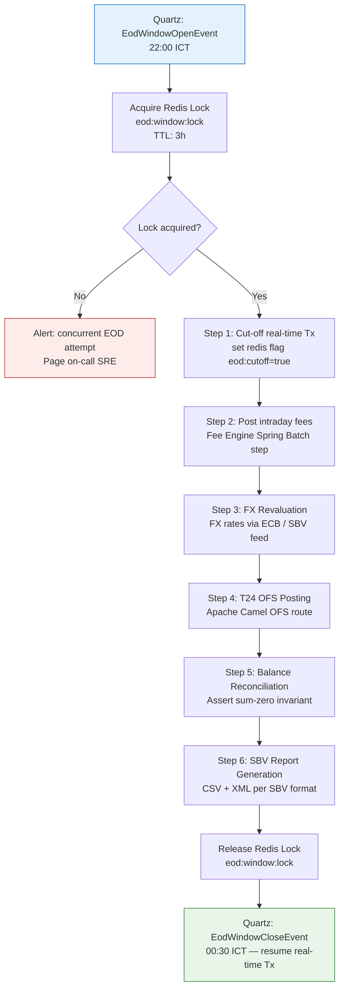

# End-of-Day Batch Window

Status: Draft | Last Reviewed: 2026-05-16 | Owner: @core-banking-domain-owner
Catalog ID: BSP-004 | Radii
Tier Applicability: T0, T1

## Problem Statement

- **Concurrent real-time and batch writes**: if real-time payment posting (T0) continues while the EOD settlement batch runs, the settlement totals are moving targets; the batch captures an inconsistent snapshot, causing T24 OFS reconciliation to fail with mismatched debit/credit sums.
- **T24 OFS window constraint**: Temenos T24 accepts OFS journal postings only during a defined processing window; submitting outside that window returns `T24-0023 OUTSIDE.PROCESSING.WINDOW`. Without an explicit batch window manager, sporadic real-time OFS calls during EOD cause pipeline failures and manual reruns.
- **Partial EOD failure and rerunability**: if the batch fails at step 3 of 8 (e.g., FX revaluation), rerunning from step 1 re-executes completed steps, creating duplicate postings. The batch must be restartable at the failed step without re-executing successful steps.
- **SBV daily reporting deadline**: SBV requires daily balance and transaction reports by 09:00 the next business day. An uncoordinated EOD process that runs ad-hoc has no predictable completion time, risking the SBV deadline.
- **Multiple system coordination**: EOD involves Ledger Service, Fee Engine, FX Service, T24 OFS gateway, and the SBV Reporting Service — each with its own completion dependency. Without explicit orchestration, services start their EOD steps in undefined order.

## Context

The EOD batch window is the nightly coordination point for all core banking settlement, reconciliation, and reporting activities. It runs in a defined time window (typically 22:00–00:30 ICT) during which T24 OFS accepts batch postings. Spring Batch provides step-level restartability and execution tracking. Quartz triggers the window open/close events on a cron schedule. A Redis distributed lock (`eod:window:lock`) prevents concurrent window execution in a multi-pod deployment.

## Solution

Quartz fires `EodWindowOpenEvent` at 22:00 ICT. The Spring Batch job is triggered, acquiring a Redis distributed lock to prevent concurrent execution. Steps execute in dependency order: (1) cut-off real-time transactions, (2) post intraday fees, (3) FX revaluation, (4) T24 OFS journal posting via Apache Camel, (5) balance reconciliation, (6) SBV report generation. Each step is tracked in the `BATCH_STEP_EXECUTION` table; failed jobs resume from the failed step. Quartz fires `EodWindowCloseEvent` at 00:30 ICT, releasing the lock and resuming real-time transaction processing.



## Implementation Guidelines

### 1. Spring Batch job configuration with step sequencing

```java
@Configuration
@RequiredArgsConstructor
public class EodBatchJobConfig {

    @Bean
    public Job eodBatchJob(JobBuilderFactory jobs,
            Step cutoffStep, Step feePostingStep,
            Step fxRevalStep, Step t24OfsStep,
            Step reconciliationStep, Step sbvReportStep) {
        return jobs.get("eodBatchJob")
            .incrementer(new RunIdIncrementer())
            .start(cutoffStep)
            .next(feePostingStep)
            .next(fxRevalStep)
            .next(t24OfsStep)
            .next(reconciliationStep)
            .next(sbvReportStep)
            .build();
    }

    @Bean
    @JobScope
    public Step cutoffStep(StepBuilderFactory steps, EodCutoffTasklet tasklet) {
        return steps.get("cutoffStep").tasklet(tasklet).build();
    }
}
```

### 2. Redis distributed lock for exclusive EOD window

```java
@Component
@RequiredArgsConstructor
public class EodWindowLockService {

    private final StringRedisTemplate redis;
    private static final String LOCK_KEY = "eod:window:lock";
    private static final Duration LOCK_TTL = Duration.ofHours(3);

    public boolean tryAcquire() {
        Boolean acquired = redis.opsForValue().setIfAbsent(
            LOCK_KEY, "LOCKED", LOCK_TTL);
        return Boolean.TRUE.equals(acquired);
    }

    public void release() {
        redis.delete(LOCK_KEY);
    }
}
```

### 3. Apache Camel route — T24 OFS journal posting

```java
@Component
public class T24OfsEodRoute extends RouteBuilder {

    @Override
    public void configure() {
        from("direct:t24-ofs-eod-posting")
            .routeId("t24-ofs-eod")
            .bean(OfsMessageBuilder.class, "buildEodJournalMessage")
            .to("http://t24-ofs-gateway:8080/ofs?throwExceptionOnFailure=true")
            .bean(OfsResponseParser.class, "assertSuccess")
            .log("T24 OFS EOD posting completed: ${body}");
    }
}
```

### 4. Quartz scheduler — cron-triggered EOD window events

```java
@Configuration
public class EodSchedulerConfig {

    @Bean
    public JobDetail eodWindowOpenJobDetail() {
        return JobBuilder.newJob(EodWindowOpenJob.class)
            .withIdentity("eodWindowOpen")
            .storeDurably().build();
    }

    @Bean
    public Trigger eodWindowOpenTrigger(JobDetail eodWindowOpenJobDetail) {
        return TriggerBuilder.newTrigger()
            .forJob(eodWindowOpenJobDetail)
            .withSchedule(CronScheduleBuilder.cronSchedule("0 0 22 * * ?")
                .inTimeZone(TimeZone.getTimeZone("Asia/Ho_Chi_Minh")))
            .build();
    }
}
```

## When to Use

- Nightly core banking settlement processes that must coordinate multiple services in dependency order within a defined T24 processing window.
- Any batch workload that posts to T24 OFS — the processing window constraint makes explicit coordination mandatory; ad-hoc OFS calls outside the window cause T24 errors.
- Multi-service EOD pipelines where step-level restartability is required — if FX revaluation fails, the batch must resume at that step without re-running fee posting.

## When Not to Use

- Intraday micro-batch processing (e.g., every 15-minute fee sweep) — use a simpler Quartz-triggered Spring Batch step without the full EOD window lock; the complexity of the EOD window is justified only for the nightly settlement cycle.
- Real-time event processing — continuous Kafka consumers are not batch jobs; applying the EOD window pattern to event processing would create an artificial processing window where none is needed.
- Services with no T24 OFS dependency and no SBV reporting requirement — lightweight services that reconcile only their own data do not need the full orchestration overhead.

## Variants

| Variant | When to prefer | Trade-off |
|---------|----------------|-----------|
| Spring Batch + Quartz + Redis lock (this pattern) | Core banking with T24 OFS; step-level restartability needed; multi-pod deployment | Requires Redis for lock management; Quartz job store needs a database for HA |
| Apache Airflow DAG | Complex dependency graphs with fan-out/fan-in; data engineering teams already running Airflow | Airflow is a heavier operational dependency; adds a new platform for the ops team to manage |
| Kubernetes CronJob | Simple single-step batch with no restartability requirement; no external orchestration database | No step-level tracking; failed jobs must rerun from start; not suitable for multi-step EOD |

## NFR Acceptance Criteria

| Metric | Threshold | Measurement |
|--------|-----------|-------------|
| EOD completion time | ≤ 2.5 h (window: 22:00–00:30) | Monitor `eodBatchJob` `END_TIME - START_TIME`; alert if > 2 h |
| SBV report delivery | By 09:00 next business day (SBV requirement) | Report file timestamp in SBV SFTP; alert if not delivered by 08:00 |
| Step restart success | 100% — all steps restartable without re-processing completed steps | Chaos test: kill job at step 4; rerun; assert steps 1–3 SKIPPED, step 4 re-executes |
| Reconciliation zero-variance | 0 debit/credit sum mismatches | Reconciliation step asserts `SUM(DR) = SUM(CR)` for all accounts for the business date |
| Availability | 99.9% (T0 SBV deadline means < 1 missed EOD per quarter) | Count missed EOD windows per quarter; assert ≤ 1 |

## Compliance Mapping

| Ring | Regulation | Provision | How this pattern satisfies |
|------|-----------|-----------|---------------------------|
| Ring 0 | ISO 22301 | Business continuity — critical process must have defined recovery steps | Step-level Spring Batch restart provides documented recovery; `BATCH_STEP_EXECUTION` table provides audit trail of step completion for incident post-mortem. |
| Ring 1 | BCBS 239 | §6 — Timeliness: risk data aggregation must support end-of-day reporting on demand | The EOD reconciliation step (Step 5) validates sum-zero invariant across all ledger accounts for the business date; SBV report (Step 6) is generated from the reconciled data, satisfying BCBS 239 timeliness. |
| Ring 2 | SBV Circular 09/2020 | §IV.5 — Daily balance and transaction reporting to SBV by 09:00 next business day ⚠️ (working summary — pending Legal review) | Step 6 generates the SBV-format CSV/XML report and delivers it to the SBV SFTP by 01:00; a Quartz alert fires at 08:30 if the report has not been acknowledged; Legal review required to confirm report format meets current SBV specification. |

## Cost / FinOps

- Redis lock: negligible — one key with a 3h TTL per night. Shared Redis cluster with other use cases.
- Spring Batch metadata tables (`BATCH_JOB_EXECUTION`, `BATCH_STEP_EXECUTION`): ~5 KB per job run; at 365 runs/year = ~1.8 MB/year. No storage concern.
- Quartz job store (PostgreSQL): ~2 KB per trigger row; fully managed within the existing core banking DB.
- T24 OFS gateway: network round-trips during the EOD window — typically 50–500 OFS messages. Negligible vs. daytime real-time traffic.
- Cost of a missed SBV reporting deadline: SBV can impose administrative penalties and require remediation reporting; reputational risk with the central bank is significant.

## Threat Model

- **Concurrent EOD execution (Tampering)**: Two pods both attempt to start the EOD job at 22:00 (e.g., after a pod restart mid-window). Without the Redis lock, two instances run in parallel, posting duplicate OFS messages. Mitigation: `EodWindowLockService.tryAcquire()` uses Redis `SET NX EX` (atomic); only one pod acquires the lock; the other logs a `CONCURRENT_EOD_ATTEMPT` alert.
- **Stale cut-off flag (Elevation of Privilege)**: The Redis `eod:cutoff=true` flag is not cleared at window close (e.g., if `EodWindowCloseEvent` handler crashes). Real-time transactions continue to be rejected post-window. Mitigation: `EodWindowCloseEvent` handler unconditionally clears the flag; a Quartz watchdog at 01:00 asserts the flag is cleared and alerts if not.

## Runbook Stub

**Alert: `eod_job_duration > 120min`**
- p50 baseline: 90 min | p99 SLO: 150 min
- Remediation: (1) Check current step: `SELECT STEP_NAME, STATUS FROM BATCH_STEP_EXECUTION WHERE JOB_EXECUTION_ID = (SELECT MAX(JOB_EXECUTION_ID) FROM BATCH_JOB_EXECUTION)`. (2) If stuck on T24 OFS (Step 4): check T24 OFS gateway health; check for T24 `OUTSIDE.PROCESSING.WINDOW` errors — T24 may have extended its maintenance window. (3) If stuck on reconciliation (Step 5): run `SELECT SUM(CASE WHEN direction='DR' THEN amount ELSE -amount END) FROM journal_entries WHERE business_date = CURRENT_DATE` — non-zero result indicates a posting error that must be resolved before completing EOD.

**Alert: `sbv_report_not_delivered_by_0800`**
- p50 baseline: delivery by 01:00 | p99 SLO: delivery by 05:00
- Remediation: P1 — (1) Check if EOD job completed: `SELECT STATUS FROM BATCH_JOB_EXECUTION ORDER BY START_TIME DESC LIMIT 1`. (2) If job FAILED, restart from failed step. (3) If job COMPLETED but SFTP failed, manually push the report file to SBV SFTP. (4) Notify the head of compliance immediately.

## Test Strategy Stub

### Unit Tests
- `EodWindowLockServiceTest`: mock `StringRedisTemplate`; assert `tryAcquire()` calls `setIfAbsent` with `LOCK_KEY`, correct value, and 3h TTL; assert `release()` calls `delete(LOCK_KEY)`.
- `EodBatchJobConfigTest`: assert job has exactly 6 steps in correct order; assert each step is configured with the correct tasklet/chunk.

### Integration Tests
- Spring Boot Test + Testcontainers (PostgreSQL + Redis): trigger EOD job; assert all 6 steps execute in order; assert `BATCH_STEP_EXECUTION` shows COMPLETED for all steps; assert Redis lock is released after job completion.
- Step restart test: inject failure at Step 4 (T24 OFS); assert job status FAILED; restart job; assert Steps 1–3 are SKIPPED (status COMPLETED from prior run); assert Step 4 re-executes.

### Chaos Tests
- Concurrent EOD start: launch two Spring Batch job executor threads simultaneously at 22:00; assert only one job execution is created; assert the second attempt logs `CONCURRENT_EOD_ATTEMPT`.
- Redis lock TTL expiry: set lock TTL to 10 s in test; let job run beyond TTL; assert that the watchdog detects TTL expiry and alerts (does not silently allow a second execution).

## Related Patterns

- [BSP-001 Double-Entry Ledger](double-entry-ledger.md) — the ledger whose sum-zero invariant is validated in EOD Step 5
- [INT-005 Anti-Corruption Layer](../integration/anti-corruption-layer.md) — the ACL that translates domain events to T24 OFS messages in Step 4
- [NFR-001 Service Tiering + RTO/RPO Matrix](../../nfr/service-tiering-rto-rpo.md) — the T0 tier SLA that mandates the SBV reporting deadline
- [BP-001 CI/CD Pipeline Design](../../best-practices/ci-cd-pipeline-design.md) — EOD job configuration changes are validated via the same pipeline

## References

- Spring Batch Reference Documentation — [docs.spring.io/spring-batch](https://docs.spring.io/spring-batch/docs/current/reference/html/)
- Quartz Scheduler — [quartz-scheduler.org](http://www.quartz-scheduler.org/documentation/)
- T24 OFS Integration Guide (internal) — confluence.techcombank.internal/t24/ofs-guide
- SBV Circular 09/2020/TT-NHNN — §IV.5 Daily reporting requirements (unofficial translation)
- BCBS 239 — Principles for Effective Risk Data Aggregation and Risk Reporting §6 (2013)
- `knowledge-base/_research-notes.md` — T24 OFS processing window schedule

---

**Key Takeaway**: The EOD Batch Window is Techcombank's nightly coordination protocol — acquire a Redis lock at 22:00, execute six ordered Spring Batch steps within the T24 processing window, validate sum-zero reconciliation, deliver the SBV report, and release the lock by 00:30, guaranteeing every business day closes with a consistent and auditable financial state.
