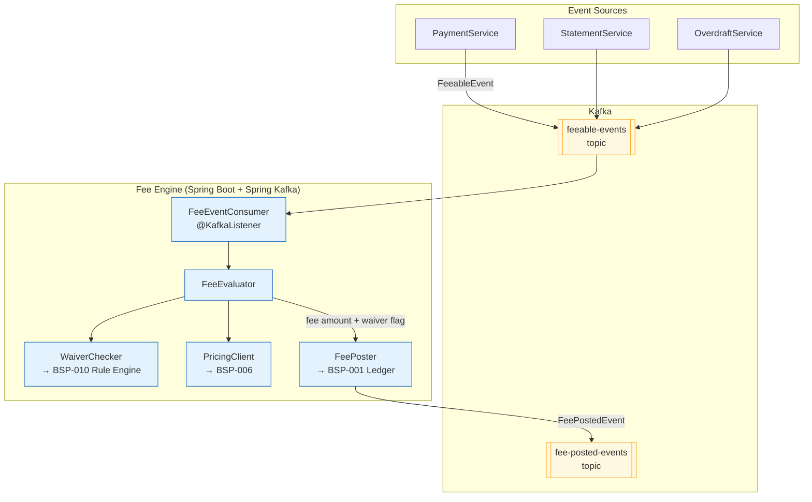

# Fee Engine

Status: Draft | Last Reviewed: 2026-05-21 | Owner: @core-banking-domain-owner
Catalog ID: BSP-008 | Radii
Tier Applicability: T0, T1, T2

## Problem Statement

Fee logic is scattered across at least four systems in a typical commercial bank: the payment gateway applies transaction fees at point of processing, the core banking system posts monthly account maintenance fees in batch, the mobile app backend charges API-access fees per session, and the CRM applies relationship-based fee waivers through a manual override screen. There is no single audit trail — a customer disputing a fee requires correlating logs from all four systems, typically taking a compliance officer 3–4 hours per case.

Fee waivers are granted informally by relationship managers through the CRM override screen with no downstream system control. A waiver entered in CRM is not visible to the payment gateway, so the fee is still charged and must be reversed manually — creating a two-step process that is frequently forgotten, leaving customers charged despite an agreed waiver.

Fee posting failures are silent: when the core banking ledger is temporarily unavailable, the payment gateway abandons the fee posting attempt without retry, leaving accounts debited at the gateway level but with no corresponding ledger entry. The resulting out-of-balance condition is discovered during the nightly reconciliation, too late to correct before regulatory reporting runs.

Customer fee disputes cannot be resolved without a complete audit chain from the originating business event to the ledger entry. Currently that chain does not exist — the fee amount in the ledger has no reference to the pricing rule that calculated it or the business event that triggered it.

## Context

The Fee Engine sits between the event-producing services (payment, statement, overdraft) and the ledger (BSP-001), acting as the single enforcement point for all fee calculation and posting. It is mandatory for T0 accounts where a missed fee or duplicate posting would create a regulatory reporting error. T1 services may use it or call BSP-006 directly for simple flat-fee products. T2 services (internal tooling) may bypass it for non-customer-facing charges. The engine is deployed independently of BSP-006 and BSP-001, allowing fee logic to be updated without releasing the pricing or ledger services.

## Solution

An event-driven FeeEngine consumes business events — transaction completed, monthly statement generated, overdraft utilised — published as `FeeableEvent` messages on Kafka. For each event it evaluates the applicable fee schedule via the Pricing Engine (BSP-006), checks waiver eligibility via the Rule Engine (BSP-010), posts the calculated fee to the Double-Entry Ledger (BSP-001) using the original event ID as the idempotency key, and emits a `FeePostedEvent` for downstream notification and audit systems. The idempotency key guarantees that a duplicate event delivery produces no second fee posting.



## Implementation Guidelines

**1. FeeableEvent schema and idempotent consumer**

```java
public record FeeableEvent(
    String eventId,               // idempotency key — UUID from source system
    String eventType,             // "TRANSACTION_COMPLETED" | "MONTHLY_STMT" | "OVERDRAFT"
    String customerId,
    String accountId,
    BigDecimal transactionAmount,
    String currency,
    LocalDateTime occurredAt
) {}

@Component
@RequiredArgsConstructor
public class FeeEventConsumer {

    private final FeeEvaluator evaluator;
    private final IdempotencyStore idempotencyStore; // Redis SET NX with TTL 24h

    @KafkaListener(topics = "feeable-events", groupId = "fee-engine")
    public void onFeeableEvent(@Payload FeeableEvent event) {
        if (idempotencyStore.isAlreadyProcessed(event.eventId())) {
            log.debug("Duplicate event {} — skipping", event.eventId());
            return;
        }
        evaluator.evaluate(event);
        idempotencyStore.markProcessed(event.eventId());
    }
}
```

**2. FeeEvaluator — waiver check, pricing, and posting**

```java
@Service
@RequiredArgsConstructor
public class FeeEvaluator {

    private final WaiverChecker waiverChecker;
    private final PricingClient pricingClient;
    private final FeePoster poster;

    public void evaluate(FeeableEvent event) {
        boolean waived = waiverChecker.isWaived(event.customerId(), event.eventType());
        if (waived) {
            log.info("Fee waived for customer={} eventType={}", event.customerId(), event.eventType());
            return;
        }
        PricingResult fee = pricingClient.calculate(PricingRequest.builder()
            .productCode("FEE_" + event.eventType())
            .pricingType("FEE")
            .currency(event.currency())
            .notional(event.transactionAmount())
            .customerId(event.customerId())
            .valueDate(event.occurredAt().toLocalDate())
            .build());
        poster.post(event, fee);
    }
}
```

**3. FeePoster — idempotent ledger posting via BSP-001**

```java
@Service
@RequiredArgsConstructor
public class FeePoster {

    private final LedgerClient ledgerClient;
    private final KafkaTemplate<String, FeePostedEvent> kafka;

    public void post(FeeableEvent event, PricingResult fee) {
        LedgerPostingRequest posting = LedgerPostingRequest.builder()
            .idempotencyKey(event.eventId())  // same as source event — prevents double posting
            .debitAccountId(event.accountId())
            .creditAccountId("BANK_FEE_INCOME_GL")
            .amount(fee.price())
            .currency(fee.currency())
            .narrative("FEE:" + event.eventType() + ":" + event.eventId())
            .build();
        ledgerClient.post(posting);
        kafka.send("fee-posted-events",
            new FeePostedEvent(event.eventId(), fee.price(), fee.currency(),
                               fee.rateTableId(), LocalDateTime.now()));
    }
}
```

## When to Use

- Any business event that should trigger a fee charge to a customer account
- When fee waivers must be centralised and auditable (relationship-based or promotional)
- When fee posting must be idempotent — duplicate event delivery must not produce duplicate charges
- When a full audit chain from business event to ledger entry is required for dispute resolution

## When Not to Use

- Internal bank charges between GL accounts with no customer impact — post directly to BSP-001
- Batch fee collection where event-driven latency adds no value — use a scheduled Spring Batch job calling BSP-006 directly
- Simple flat fees with no waiver logic and no audit requirement — call BSP-006 and post to BSP-001 directly from the calling service

## Variants

| Variant | When to prefer | Trade-off |
|---------|----------------|-----------|
| Event-driven (this pattern) | Real-time fee posting required; strong audit chain needed | Kafka dependency; consumer lag monitoring required |
| Synchronous (REST call in payment flow) | Simple fees where latency budget allows a blocking call | Simpler architecture; fee failure blocks the payment — may not be acceptable |
| Batch (scheduled job) | Monthly account maintenance fees; end-of-period charges | No real-time audit; simpler for low-volume periodic charges |

## NFR Acceptance Criteria

```yaml
nfr_acceptance_criteria:
  catalog_id: BSP-008
  pattern: Fee Engine
  performance:
    - id: BSP-008-HP-01
      description: End-to-end fee event processing from Kafka consumption to ledger posting must complete within 50ms p99.
      threshold: p99 < 50ms
  availability:
    - id: BSP-008-HA-01
      description: Fee Engine must be available 99.99% for T0 accounts; Kafka consumer lag must not exceed 10,000 events for more than 5 minutes.
      threshold: availability ≥ 99.99% (T0); consumer lag < 10,000 for > 5 min triggers scale-out
  correctness:
    - id: BSP-008-COR-01
      description: Duplicate FeeableEvent delivery must produce exactly one ledger posting and one FeePostedEvent.
      threshold: 0 duplicate fee postings per day (verified by reconciliation job)
    - id: BSP-008-COR-02
      description: Every FeePostedEvent must carry the rateTableId from BSP-006 for full audit traceability.
      threshold: 0 FeePostedEvents with null rateTableId
```

## Compliance Mapping

| Ring | Regulation | Provision | How this pattern satisfies |
|------|-----------|-----------|---------------------------|
| Ring 0 | IFRS 15 | Revenue recognition at the transaction price | FeePostedEvent records the exact fee amount, rateTableId, and eventId; revenue is recognised at the moment of ledger posting |
| Ring 0 | OWASP Top-10 | A04 Insecure Design — mass assignment / fee bypass | WaiverChecker enforces waiver eligibility rules via BSP-010; no caller can self-assert a waiver; all waivers require rule-engine approval |
| Ring 1 | BCBS 239 | §6 — Adaptability of risk data | FeePostedEvent carries the full audit chain: source eventId, rateTableId, waiver flag, and posting timestamp; no silent data loss via Kafka delivery guarantees |
| Ring 2 | SBV Circular 09/2020 | §IV.2 — transaction data logging | Every FeePostedEvent is logged with accountId, amount, currency, rateTableId, and eventId to the structured audit log; Decree 13/2023 Art. 9 personal data minimisation — customerId is the only PII field, no name or NID in the event ⚠️ (working summary — pending Legal review) |

## Cost / FinOps Notes

- Kafka `feeable-events` topic: 12 partitions for 10 K events/second throughput; retention 7 days; ~$50/month on managed Kafka
- Fee Engine pods: 2 replicas steady-state; scale to 6 on consumer lag > 5,000 events (HPA on custom metric `kafka_consumer_lag`)
- Redis idempotency store: small key set (eventId → processed, TTL 24 h); shared with other idempotency consumers — marginal cost
- `fee-posted-events` topic: 12 partitions, retention 90 days for audit trail; downstream consumers include regulatory reporting and notification services
- No GPU or ML infrastructure required — fee calculation is a pure lookup via BSP-006

## Threat Model Summary

**Tampering — fee schedule manipulation via Pricing Engine (Tampering)**: an insider modifies the fee schedule in BSP-006 (Pricing Engine) to zero-rate all TRANSACTION_COMPLETED fees, causing the Fee Engine to post zero-value fees to the ledger. Mitigation: BSP-006 dual-approval rate change workflow; FeePostedEvent records `rateTableId` so a nightly audit job can detect any posting with a rate table that was not dual-approved; circuit breaker on PricingClient — if BSP-006 returns an anomalous zero price for a normally non-zero product code, the fee event is routed to a `fee-manual-review` dead-letter topic.

**Denial of Service — fee storm from misconfigured event source (Denial of Service)**: a misconfigured payment service publishes 10 M duplicate `FeeableEvent` messages to the `feeable-events` topic in seconds, overwhelming the Fee Engine consumers and the BSP-001 ledger. Mitigation: Kafka consumer uses Resilience4j `RateLimiter` (max 5,000 events/second per pod); Redis idempotency store rejects duplicates in O(1) without touching BSP-006 or BSP-001; dead-letter topic (`feeable-events-dlq`) absorbs malformed or over-limit events; alert fires when DLQ depth > 1,000.

## Operational Runbook (stub)

1. Alert: FeePostingFailureSpike — fires when fee posting error rate > 0.1% sustained over 5 minutes (metric: `fee.posting.errors / fee.posting.attempts`). p50 resolution: 5 min; p99: 30 min. Check LedgerClient circuit breaker state (`GET /actuator/health/ledgerCircuitBreaker`). If BSP-001 is degraded, the circuit breaker opens and fee events queue in `feeable-events` — check consumer lag. Restore BSP-001 connectivity and reset circuit breaker: `POST /actuator/circuitbreakers/ledger/reset`.

2. Alert: FeeEventLag — fires when Kafka consumer group `fee-engine` lag on `feeable-events` exceeds 10,000 events for more than 5 minutes. Scale out Fee Engine: `kubectl scale deployment fee-engine --replicas=6 -n banking`. If lag persists after scale-out, check BSP-006 PricingClient latency — slow pricing lookups are the most common cause of consumer slowdown.

3. Alert: FeeWaiverRuleFailure — fires when WaiverChecker returns an error (BSP-010 Rule Engine unreachable). Default behaviour: proceed with fee posting (fail-open for waivers — it is safer to charge a fee that may later be reversed than to silently waive fees for all customers). Notify @tech-lead-backend immediately.

## Test Strategy (stub)

**Unit**: `FeeEvaluatorTest` — mock WaiverChecker returning true (waived) and false (not waived); mock PricingClient; assert waived events produce no ledger posting call; assert non-waived events call PricingClient and FeePoster. `FeeEventConsumerTest` — assert duplicate eventId produces exactly one `evaluator.evaluate()` call.

**Integration**: `FeeEngineIT` (Testcontainers — PostgreSQL + Redis + Kafka) — publish `FeeableEvent` to `feeable-events`; consume and process; assert `LedgerPostingRequest` sent to BSP-001 stub with correct idempotency key; publish duplicate event; assert no second posting; assert `FeePostedEvent` on `fee-posted-events` topic with non-null rateTableId.

**Compliance**: `FeeAuditChainTest` — after processing a fee event, query the structured audit log; assert that the log entry contains eventId, accountId, rateTableId, and amount; assert no PII fields beyond accountId and customerId are present.

**Chaos**: Toxiproxy — drop BSP-001 ledger connection for 30 seconds; assert Fee Engine circuit breaker opens within 10 failures; assert events queue in Kafka (not lost); restore connection; assert circuit breaker closes and queued events are processed without duplicates.

## Related Patterns

- [BSP-001 Double-Entry Ledger](double-entry-ledger.md) — receives ledger posting requests from FeePoster
- [BSP-006 Pricing Engine](pricing-engine.md) — provides the fee amount via PricingClient
- [BSP-010 Rule / Decisioning Engine](rule-decisioning-engine.md) — WaiverChecker calls BSP-010 to evaluate waiver eligibility rules
- [EIP-024 Idempotent Receiver](../integration/idempotent-receiver.md) — the Redis idempotency store pattern used by FeeEventConsumer

## References

- IFRS 15 Revenue from Contracts with Customers — IASB 2014
- BCBS 239 Principles for Effective Risk Data Aggregation — BCBS January 2013
- SBV Circular 09/2020 — Information System Security for Credit Institutions
- Decree 13/2023 — Personal Data Protection (Vietnam)
- Apache Kafka documentation — consumer group idempotency patterns

---
**Key Takeaway**: Process all fee events through a single engine that enforces waiver rules via BSP-010, fetches prices from BSP-006, and posts to BSP-001 idempotently using the source event ID — so every fee charged has a complete audit chain from the originating business event to the ledger entry, and duplicate event delivery never produces a duplicate charge.
