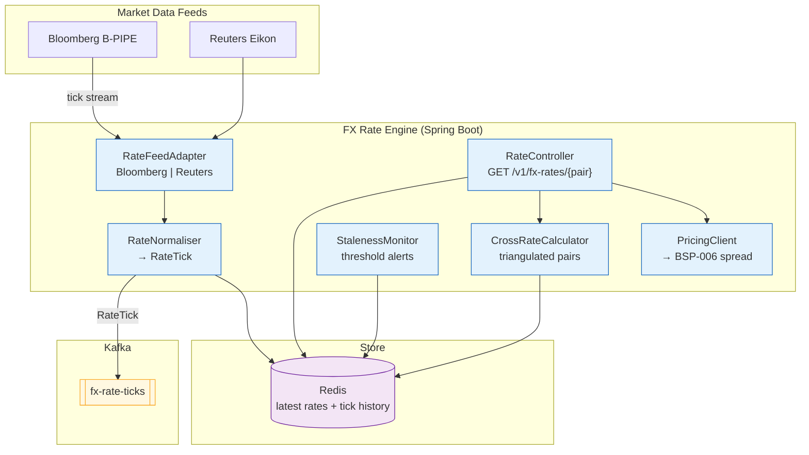

# FX Rate Engine

Status: Draft | Last Reviewed: 2026-05-21 | Owner: @treasury-domain-owner
Catalog ID: BSP-014 | Radii
Tier Applicability: T0, T1

## Problem Statement

The bank consumes FX rates from three sources simultaneously: Bloomberg B-PIPE for real-time mid-rates, a Reuters Eikon REST pull for cross-currency checks, and a manual rate file uploaded by treasury operations each morning for the core banking system's overnight batch. These three sources are consumed independently by different services — the payment gateway uses Bloomberg via a proprietary Java SDK, the FX trading system uses Reuters, and the core banking batch uses the manual file. The result is three different EUR/VND mid-rates visible in three different systems at the same point in the trading day.

Rate staleness is undetected. The payment gateway's Bloomberg connection silently fails at 14:23 and continues serving the last cached rate until a treasury operations manager notices at 15:47 that payment FX charges are based on an 84-minute-old rate. There is no alert, no circuit breaker, and no fallback.

Cross-rate calculations (VND/JPY derived from VND/USD and USD/JPY) are implemented differently in three services: the payment gateway truncates to 2 decimal places, the trading system rounds to 6, and the core banking adapter rounds to 4, producing irreconcilable P&L attribution in the daily trade reconciliation.

Promotional rate overrides — a special rate offered to a high-value customer for a specific transaction window — are applied as ad-hoc database patches in the payment gateway with no audit trail and no expiry mechanism, leading to rates that remain active long after the promotion ended.

## Context

The FX Rate Engine is the single source of truth for all FX mid-rates, cross-rates, and spread-applied customer rates across the bank. It consumes real-time tick data from Bloomberg/Reuters via the market data adapter, calculates cross-rates using a configurable chain (VND/USD × USD/JPY = VND/JPY), applies bid/ask spreads from the Pricing Engine (BSP-006), and publishes rate snapshots to a Kafka topic consumed by all downstream systems. It maintains a Redis time-series of the last 1,000 ticks per currency pair for short-window lookback queries. Staleness monitoring fires when no tick is received within a configurable threshold (default: 30 seconds for major pairs, 5 minutes for exotic pairs). It is mandatory for T0 retail FX payments and T1 treasury trading.

## Solution

An FXRateEngine Spring Boot service subscribes to Bloomberg/Reuters market data adapters via a vendor-agnostic `RateFeedAdapter` interface, normalises incoming ticks to an internal `RateTick` format, publishes ticks to a `fx-rate-ticks` Kafka topic, and maintains the latest bid/ask/mid for each currency pair in Redis. A `StalenessMonitor` checks the age of the last tick per pair and fires an alert if the threshold is exceeded. A `CrossRateCalculator` derives triangulated rates on-demand using the latest mid-rates from Redis. Customer-facing rates include the spread applied by the Pricing Engine (BSP-006). All rate lookups return the `rateId` and `effectiveAt` timestamp so downstream systems have a complete audit trail.



## Implementation Guidelines

**1. RateTick and RateFeedAdapter**

```java
public record RateTick(
    String rateId,           // UUID — uniquely identifies this tick for audit
    String currencyPair,     // e.g. "USD/VND"
    BigDecimal bid,
    BigDecimal ask,
    BigDecimal mid,          // (bid + ask) / 2, rounded to 8 decimal places
    String source,           // "BLOOMBERG" | "REUTERS"
    Instant receivedAt
) {}

public interface RateFeedAdapter {
    Flux<RateTick> tickStream();   // reactive stream of normalised ticks
    String sourceId();
}

@Component
@RequiredArgsConstructor
public class RateNormaliser {

    private final StringRedisTemplate redis;
    private final KafkaTemplate<String, RateTick> kafka;

    public void onTick(RateTick tick) {
        String key = "fxrate:latest:" + tick.currencyPair();
        // Store as Redis hash: rateId, bid, ask, mid, receivedAt
        redis.opsForHash().put(key, "rateId", tick.rateId());
        redis.opsForHash().put(key, "bid", tick.bid().toPlainString());
        redis.opsForHash().put(key, "ask", tick.ask().toPlainString());
        redis.opsForHash().put(key, "mid", tick.mid().toPlainString());
        redis.opsForHash().put(key, "receivedAt", tick.receivedAt().toString());

        // Push to tick history list; trim to last 1000 ticks
        String histKey = "fxrate:history:" + tick.currencyPair();
        redis.opsForList().leftPush(histKey, tick.rateId() + ":" + tick.mid().toPlainString());
        redis.opsForList().trim(histKey, 0, 999);

        kafka.send("fx-rate-ticks", tick.currencyPair(), tick);
    }
}
```

**2. CrossRateCalculator — triangulated rate derivation**

```java
@Service
@RequiredArgsConstructor
public class CrossRateCalculator {

    private final StringRedisTemplate redis;

    public BigDecimal getMid(String baseCcy, String quoteCcy) {
        String directKey = "fxrate:latest:" + baseCcy + "/" + quoteCcy;
        String reverseKey = "fxrate:latest:" + quoteCcy + "/" + baseCcy;
        String crossKey1  = "fxrate:latest:" + baseCcy + "/USD";
        String crossKey2  = "fxrate:latest:USD/" + quoteCcy;

        // Try direct rate first
        String directMid = (String) redis.opsForHash().get(directKey, "mid");
        if (directMid != null) return new BigDecimal(directMid);

        // Try inverse rate
        String reverseMid = (String) redis.opsForHash().get(reverseKey, "mid");
        if (reverseMid != null) {
            return BigDecimal.ONE.divide(new BigDecimal(reverseMid), 8, RoundingMode.HALF_UP);
        }

        // Triangulate via USD
        String mid1 = (String) redis.opsForHash().get(crossKey1, "mid");
        String mid2 = (String) redis.opsForHash().get(crossKey2, "mid");
        if (mid1 == null || mid2 == null) {
            throw new RateUnavailableException("No rate available for " + baseCcy + "/" + quoteCcy);
        }
        return new BigDecimal(mid1)
            .multiply(new BigDecimal(mid2))
            .setScale(8, RoundingMode.HALF_UP);
    }
}
```

**3. Staleness monitoring and rate schema**

```java
@Component
@RequiredArgsConstructor
public class StalenessMonitor {

    private final StringRedisTemplate redis;
    private final MeterRegistry meterRegistry;
    private final Map<String, Duration> thresholds; // pair → max age

    @Scheduled(fixedDelay = 10_000)
    public void check() {
        thresholds.forEach((pair, maxAge) -> {
            String key = "fxrate:latest:" + pair;
            String receivedAtStr = (String) redis.opsForHash().get(key, "receivedAt");
            if (receivedAtStr == null) {
                meterRegistry.counter("fxrate.stale", "pair", pair, "reason", "missing").increment();
                return;
            }
            Instant receivedAt = Instant.parse(receivedAtStr);
            Duration age = Duration.between(receivedAt, Instant.now());
            if (age.compareTo(maxAge) > 0) {
                meterRegistry.counter("fxrate.stale", "pair", pair, "reason", "threshold").increment();
            }
        });
    }
}
```

## When to Use

- Any service that needs a current or historical FX rate with a complete audit trail (rateId + effectiveAt)
- When cross-rates (VND/JPY via USD triangulation) must be derived consistently across all channels
- When customer-facing FX charges must include a spread applied from centralised pricing rules (BSP-006)
- When staleness detection is required — the calling service must know if the rate is more than N seconds old

## When Not to Use

- Mark-to-market revaluation of large securities portfolios requiring full real-time Bloomberg tick access — use the Bloomberg API directly for high-frequency treasury position revaluation
- Historical rate lookups beyond 1,000 ticks — query the `fx-rate-ticks` Kafka topic or a long-term rate archive (BSP-015 Position Keeping Engine uses this engine for current rates only)
- Interest rate benchmarks (SOFR, VNIBOR) — these are reference rates, not FX rates; use the Pricing Engine (BSP-006) with a RATE pricing type

## Variants

| Variant | When to prefer | Trade-off |
|---------|----------------|-----------|
| Kafka tick stream + Redis latest (this pattern) | Real-time FX payments; treasury pricing; any sub-second latency requirement | Bloomberg/Reuters licensing cost; complexity of feed failover |
| Manual file upload (EOD snapshot) | Core banking EOD batch; backward-compatible legacy integrations | Simple; no streaming infrastructure; stale during trading hours |
| ECB/SBV published rates | Non-critical FX reporting; non-trading regulatory submissions | Free; updated daily only; no bid/ask spread |

## NFR Acceptance Criteria

```yaml
nfr_acceptance_criteria:
  catalog_id: BSP-014
  pattern: FX Rate Engine
  performance:
    - id: BSP-014-HP-01
      description: Rate lookup from Redis (direct or cross-rate) must complete within 5ms p99.
      threshold: p99 < 5ms
    - id: BSP-014-HP-02
      description: End-to-end tick ingestion from feed receipt to Redis write and Kafka publish must complete within 20ms p99.
      threshold: p99 < 20ms
  availability:
    - id: BSP-014-HA-01
      description: FX Rate Engine must be available 99.99% for T0 retail FX payment paths; failover between Bloomberg and Reuters feeds must complete within 5 seconds.
      threshold: availability ≥ 99.99% (T0); feed failover < 5s
  correctness:
    - id: BSP-014-COR-01
      description: Cross-rate triangulation must produce the same result as a direct rate lookup when both are available; divergence > 1 pip triggers an alert.
      threshold: cross-rate vs direct divergence ≤ 1 pip (0.0001)
    - id: BSP-014-COR-02
      description: Staleness alert must fire within 10 seconds of the last tick exceeding the configured threshold for a currency pair.
      threshold: staleness alert latency < 10s from threshold breach
```

## Compliance Mapping

| Ring | Regulation | Provision | How this pattern satisfies |
|------|-----------|-----------|---------------------------|
| Ring 0 | PCI-DSS 4.0 | §10.7 — Audit trails for transaction monitoring | Every rate tick stored with rateId, source, and receivedAt; all customer FX transactions reference rateId for full audit chain from charge to source tick |
| Ring 0 | IFRS 9 | §B6.5 — Hedge accounting documentation requires observable market rates | FX rates from Bloomberg/Reuters qualify as Level 1 observable inputs under IFRS 13; rateId and source are archived per rate snapshot for hedge documentation |
| Ring 1 | BCBS 239 | §5 Timeliness; §6 Adaptability | Tick stream stored in Kafka with 30-day retention; rate snapshots queryable by rateId for risk aggregation reporting within regulatory deadlines |
| Ring 2 | SBV Circular 02/2021/TT-NHNN | Art. 4 — USD/VND exchange rate band enforcement | USD/VND rates validated against SBV-published daily band on each tick; rates outside the band are rejected and routed to a dead-letter topic pending manual review ⚠️ (working summary — pending Legal review) |

## Cost / FinOps Notes

- Bloomberg B-PIPE license: ~$2,000/month (bundled with existing treasury systems); marginal cost for adding this consumer is zero
- Redis for latest rates + tick history: ~$50/month (shared cluster); 1,000 ticks × 150 bytes × 200 pairs = ~30 MB
- Kafka `fx-rate-ticks` topic: 24 partitions (high-volume); retention 30 days; ~$80/month at peak tick volume for major pairs
- FX Rate Engine pods: 2 replicas steady-state; CPU-bound tick processing scales via HPA; ~$25/month
- StalenessMonitor: lightweight scheduled check; no additional infrastructure cost

## Threat Model Summary

**Rate feed spoofing (Spoofing)**: an attacker with network access between the bank's market data gateway and the FX Rate Engine injects a synthetic tick with a manipulated EUR/VND rate 5% below market, causing customer FX payments to use a fraudulently favourable rate. Mitigation: Bloomberg/Reuters connections are authenticated via mTLS with client certificates issued by the bank's internal PKI; incoming ticks are validated against a plausibility band (± 3% from the previous tick — configurable per pair); ticks outside the band are routed to a `fx-rate-anomaly` topic and a manual review alert fires; the `RateFeedAdapter` implementation verifies the feed source signature before normalising ticks.

**Stale rate exploitation (Elevation of Privilege)**: an attacker exploits a Bloomberg feed outage to submit large FX transactions during the window when the engine is serving stale rates, profiting from known rate movements that occurred after the last cached tick. Mitigation: StalenessMonitor fires within 10 seconds of threshold breach; payment services subscribe to the staleness metric and apply an additional manual-review hold on transactions above VND 500M when any leg currency pair is flagged stale; the stale flag is included in the `RateTick` response header so callers can enforce their own policies.

## Operational Runbook (stub)

1. Alert: FxRateStaleness — fires when StalenessMonitor counter `fxrate.stale` increments for a pair with reason `threshold`. p50 resolution: 5 min; p99: 30 min. Check Bloomberg/Reuters feed connectivity: `GET /actuator/health/bloombergFeedCircuitBreaker`. If primary feed is down, trigger failover: `POST /actuator/fxfeed/failover?source=REUTERS`. Notify @treasury-domain-owner; payment gateway should be alerted to apply stale-rate hold policy.

2. Alert: FxRateTickAnomaly — fires when a tick is rejected due to plausibility band violation (metric: `fxrate.anomaly.ticks`). Check the `fx-rate-anomaly` topic for the rejected tick details. If the anomaly is legitimate market volatility (e.g., flash crash), widen the band temporarily: `POST /actuator/fxrate/band/{pair}?threshold=0.06`. If it appears to be a spoofed tick, escalate to @infosec immediately.

3. Alert: FxRateCrossRateDivergence — fires when cross-rate triangulation diverges from a direct rate by > 1 pip for a pair where both are available. This indicates an inconsistency between the two source feeds (Bloomberg vs Reuters serving different mid-rates). Check which source each rate came from in the Redis hash `source` field. If divergence is systematic, adjust the source priority via `POST /actuator/fxfeed/priority`.

## Test Strategy (stub)

**Unit**: `CrossRateCalculatorTest` — mock Redis returning USD/VND and USD/JPY mids; assert VND/JPY = USD/VND × USD/JPY with scale 8 HALF_UP; mock Redis returning direct VND/JPY; assert direct rate takes priority over triangulation; mock Redis returning no rate for either path; assert `RateUnavailableException`. `StalenessMonitorTest` — mock Redis returning receivedAt 35 seconds ago for a 30-second threshold pair; assert staleness counter incremented.

**Integration**: `FxRateEngineIT` (Testcontainers — Redis + Kafka) — publish synthetic Bloomberg tick for USD/VND; assert Redis latest rate updated; assert tick on `fx-rate-ticks` Kafka topic; query `GET /v1/fx-rates/USD/VND`; assert mid matches tick; stop tick publisher for 35 seconds; assert staleness alert counter incremented.

**Compliance**: `RateAuditTrailTest` — after processing a tick, assert Redis hash contains rateId, source, and receivedAt; query rate via REST; assert response body contains rateId; assert Kafka record contains same rateId for audit chain correlation.

**Chaos**: Toxiproxy — drop Bloomberg feed connection; assert StalenessMonitor fires within 15 seconds; assert Reuters failover activates within 5 seconds; assert rate lookups continue serving the last valid Redis value during the 5-second failover window; restore Bloomberg; assert primary feed resumes.

## Related Patterns

- [BSP-006 Pricing Engine](pricing-engine.md) — BSP-014 provides the mid-rate; BSP-006 applies the bid/ask spread for customer-facing FX pricing
- [BSP-013 Collateral Management Engine](collateral-management-engine.md) — BSP-014 provides real-time market prices for collateral valuation events
- BSP-015 Position Keeping Engine — consumes `fx-rate-ticks` to mark-to-market open FX positions (authored in Wave 9C)
- BSP-016 Settlement Engine — uses FX rates from BSP-014 to calculate VND settlement amounts for cross-currency trades (authored in Wave 9C)

Note: BSP-015 and BSP-016 are plain text as those files do not exist yet.

## References

- Bloomberg B-PIPE API documentation — Bloomberg Professional Services
- Reuters Eikon REST API — Refinitiv documentation
- IFRS 9 Financial Instruments — IASB 2014
- IFRS 13 Fair Value Measurement (Level 1/2/3 inputs) — IASB 2011
- BCBS 239 Principles for Effective Risk Data Aggregation — BCBS January 2013
- SBV Circular 02/2021/TT-NHNN — Foreign exchange rate management

---
**Key Takeaway**: Consume FX ticks from Bloomberg/Reuters through a single normalising adapter that publishes to Kafka and maintains the latest rate in Redis — so all payment, treasury, and collateral services see the same rate at the same time, cross-rates are triangulated consistently, and staleness is detected within 10 seconds of a feed outage.
