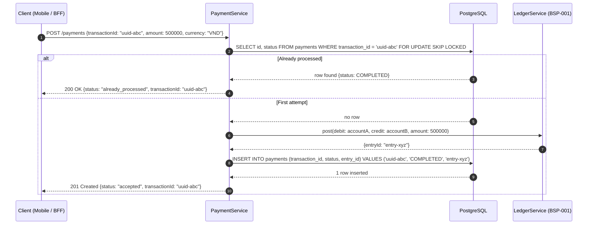

# Idempotent Payment Key

Status: Draft | Last Reviewed: 2026-05-16 | Owner: @payments-domain-owner
Catalog ID: BSP-002 | Radii
Tier Applicability: T0

## Problem Statement

- **Network timeout double-debit**: a customer's mobile app sends a payment request; the response is lost due to a 3G handover timeout. The app retries. Without an idempotency key, the payment service processes the request twice, charging the customer twice — a Category 1 financial error.
- **Kafka consumer retry without deduplication**: a payment Kafka consumer crashes after committing the offset but before persisting the result. The next pod picks up the same message. Without a `transaction_id` check, two journal entries are posted for one business event.
- **NAPAS RTT timeout retry**: the NAPAS channel times out at 20 s; the initiating bank's gateway retries the transfer. Without EndToEndId tracking, the receiving bank's Ledger Service posts the credit twice.
- **ISO 20022 EndToEndId non-compliance**: ISO 20022 pain.001/pacs.008 mandates a unique `EndToEndId` per payment instruction that must be preserved unchanged through the entire payment chain. Absent enforcement, downstream systems cannot deduplicate or correlate.
- **Manual reconciliation cost**: duplicate payments detected by nightly reconciliation require 4–8 hours of operations team time per incident to reverse, notify the customer, and report to SBV.

## Context

Apply this pattern in every T0 payment processing service that accepts payment requests from external clients (mobile, web, BFF), internal services (Saga orchestrator), or message consumers (Kafka). The idempotency key may be a UUID4 generated by the client, an ISO 20022 `EndToEndId`, or a composite of (`accountId`, `amount`, `timestamp`) for systems without client-generated keys. The pattern is mandatory for all services that write to the Double-Entry Ledger (BSP-001).

## Solution

The client generates or forwards a `transactionId` (UUID4 or ISO 20022 EndToEndId) with every payment request. The Payment Service performs an atomic read-check-write using `SELECT ... FOR UPDATE SKIP LOCKED` before any processing. If the key exists, the existing result is returned immediately — no re-processing, no duplicate posting. If the key is absent, the service processes the payment and inserts the idempotency record atomically within the same database transaction as the ledger write.



## Implementation Guidelines

### 1. PaymentService — idempotency check with `FOR UPDATE SKIP LOCKED`

```java
@Service
@RequiredArgsConstructor
public class PaymentService {

    private final PaymentRepository paymentRepo;
    private final LedgerService ledger;

    @Transactional
    public PaymentResult process(PaymentCommand cmd) {
        // FOR UPDATE SKIP LOCKED: concurrent retries wait, then find the inserted row
        return paymentRepo.findByTransactionIdForUpdate(cmd.transactionId())
            .map(existing -> PaymentResult.alreadyProcessed(existing.status(), cmd.transactionId()))
            .orElseGet(() -> {
                LedgerEntry entry = ledger.post(cmd.fromAccount(), cmd.toAccount(),
                    cmd.amount(), cmd.currency(), cmd.transactionId());
                Payment payment = new Payment(
                    cmd.transactionId(), PaymentStatus.COMPLETED, entry.entryId(), Instant.now());
                paymentRepo.save(payment);
                return PaymentResult.accepted(cmd.transactionId(), entry.entryId());
            });
    }
}
```

### 2. Repository — native query with locking hint

```java
@Repository
public interface PaymentRepository extends JpaRepository<Payment, UUID> {

    @Lock(LockModeType.PESSIMISTIC_WRITE)
    @QueryHints(@QueryHint(name = "javax.persistence.lock.timeout", value = "0"))
    @Query("SELECT p FROM Payment p WHERE p.transactionId = :txId")
    Optional<Payment> findByTransactionIdForUpdate(@Param("txId") String txId);
}
```

### 3. PostgreSQL schema — unique constraint as safety net

```sql
CREATE TABLE payments (
    id              UUID         PRIMARY KEY DEFAULT gen_random_uuid(),
    transaction_id  TEXT         NOT NULL,
    status          TEXT         NOT NULL CHECK (status IN ('PENDING','COMPLETED','FAILED')),
    entry_id        UUID,
    amount          NUMERIC(19,4) NOT NULL,
    currency        CHAR(3)      NOT NULL,
    created_at      TIMESTAMPTZ  NOT NULL DEFAULT NOW()
);

-- Unique constraint is the final safety net if application logic fails
CREATE UNIQUE INDEX uq_payments_transaction_id ON payments(transaction_id);
```

### 4. Kafka consumer — idempotency applied before any processing

```java
@KafkaListener(topics = "payments.commands", groupId = "payment-processor")
public void onPaymentCommand(PaymentCommand cmd) {
    // Same idempotency logic applies regardless of trigger source
    PaymentResult result = paymentService.process(cmd);
    if (result.isAlreadyProcessed()) {
        log.info("event=duplicate_message transactionId={} — skipping re-processing", cmd.transactionId());
    }
}
```

## When to Use

- All T0 payment processing services that accept payment requests from any client or message source where retries are possible (which is all of them).
- Services consuming ISO 20022 messages (pain.001, pacs.008) where the `EndToEndId` must be preserved and used as the idempotency key per standard §2.1.
- Any service that writes to the Double-Entry Ledger (BSP-001) — the `transaction_id` must match the ledger's `transaction_id` unique constraint to prevent orphaned journal entries.

## When Not to Use

- Read-only query endpoints — idempotency keys add no value for `GET` requests; HTTP `GET` is idempotent by definition.
- Internal event-sourced projections that are designed to be rebuilt from scratch — replaying the event log is intentional re-processing; do not apply idempotency guards to projection rebuilds.
- Analytics pipelines ingesting the same event multiple times intentionally (e.g., exactly-once Kafka Streams with Flink changelog) — these frameworks provide their own deduplication; adding an application-level check creates a conflict with the framework's offset management.

## Variants

| Variant | When to prefer | Trade-off |
|---------|----------------|-----------|
| DB unique constraint + `FOR UPDATE SKIP LOCKED` (this pattern) | T0 payment services; strong consistency required; low retry rate | Requires a database round-trip per request; lock contention possible under extreme retry storms |
| Redis distributed cache (TTL-based) | High-throughput services (>10 000 rps); idempotency window short (≤24h); eventual consistency acceptable | Redis TTL expiry means very old retries are re-processed; cache-aside pattern is not ACID |
| Kafka `enable.idempotence=true` (producer-level) | Kafka producer exactly-once delivery within a single Kafka cluster; no downstream DB deduplication needed | Only guarantees producer-to-broker idempotency; does not prevent duplicate consumer processing if consumer crashes |

## NFR Acceptance Criteria

| Metric | Threshold | Measurement |
|--------|-----------|-------------|
| Duplicate detection p99 latency | ≤ 5 ms (DB round-trip for found key) | Load test 1 000 concurrent retries of the same `transactionId`; assert p99 ≤ 5 ms; assert exactly 1 ledger entry |
| First-time processing overhead | ≤ 10 ms added vs. no idempotency check (same DB transaction) | Benchmark `process()` with and without idempotency; assert overhead ≤ 10 ms p99 |
| Zero duplicate postings | 0 duplicate journal pairs under 10 000 concurrent retries | Chaos test: inject 10 000 parallel requests with the same `transactionId`; assert `journal_entries` count = 2 |
| Availability | 99.99% (T0 — idempotency table on same PostgreSQL cluster as ledger) | Ledger HA test: replicate failover; assert idempotency checks continue |
| RTO | ≤ 10 s (same as ledger cluster failover) | Kill PostgreSQL primary; measure time to first successful payment with idempotency check |

## Compliance Mapping

| Ring | Regulation | Provision | How this pattern satisfies |
|------|-----------|-----------|---------------------------|
| Ring 0 | OWASP ASVS V5 | §5.5 — Deserialization and Retry Safety: repeated requests must not produce duplicate effects | `FOR UPDATE SKIP LOCKED` + unique index prevents any duplicate posting; the application returns the original result without side effects. |
| Ring 1 | ISO 20022 | §2.1 EndToEndId — unique identifier assigned by the initiating party and preserved through the chain | The Payment Service stores and returns the `transactionId` as the ISO 20022 `EndToEndId` in all outbound pacs.008 messages; NAPAS reconciliation uses this field for deduplication. |
| Ring 2 | SBV Circular 09/2020 | §IV.2 — transaction integrity and deduplication requirements for electronic payment systems ⚠️ (working summary — pending Legal review) | Unique constraint on `transaction_id` and atomic check-insert prevents duplicate payment entries in the ledger; `already_processed` response satisfies the retrying client without financial impact. |

## Cost / FinOps

- Additional PostgreSQL storage per payment: ~120 bytes per `payments` row. At 10 M payments/month, this is 1.2 GB/month — negligible.
- Additional PostgreSQL IOPS: one `SELECT FOR UPDATE` + one `INSERT` per new payment; the existing ledger write already accounts for similar IOPS. Net overhead is one additional index scan per payment.
- Cost of NOT using this pattern: one duplicate payment incident requiring manual reversal costs ~4 engineer-hours + customer notification + potential SBV incident report — equivalent to months of storage costs.

## Threat Model

- **Idempotency key collision (Tampering)**: Attacker submits a payment with the same `transactionId` as a prior legitimate payment. If the idempotency check returned `already_processed`, the attacker receives the original result — no financial impact. If the attacker crafts a different `transactionId` for the same payment intent, the existing amount/account validation catches it. Mitigation: `transactionId` is immutable once inserted; the `FOR UPDATE` lock prevents concurrent insertion races.
- **Lock storm under retry (Denial of Service)**: A misbehaving client retries the same `transactionId` at 10 000 rps, causing `FOR UPDATE SKIP LOCKED` to queue all retries. `SKIP LOCKED` means locked rows are skipped rather than waited on — concurrent retries return immediately without blocking. Mitigation: rate limiter (100 rps per `transactionId` at the API gateway) prevents a single client from saturating the connection pool.

## Runbook Stub

**Alert: `payment_duplicate_rate > 1%`** (unusual retry volume)
- p50 baseline: < 0.1% | p99 SLO: < 1%
- Remediation: (1) Check which `transactionId` prefixes are driving retries: `SELECT LEFT(transaction_id,8), COUNT(*) FROM payments GROUP BY 1 ORDER BY 2 DESC LIMIT 10`. (2) If a single mobile app version is retrying aggressively, push a force-upgrade (MOB-006). (3) If NAPAS is timing out, check the NAPAS circuit breaker state (RES-002). (4) If the retry source is a batch job, add exponential backoff (RES-003).

**Alert: `unique_constraint_violation ON payments`**
- p50 baseline: 0 | p99 SLO: 0
- Remediation: CRITICAL — this should never fire if application logic is correct; a constraint violation means two concurrent requests both passed the `FOR UPDATE` check. (1) Immediately inspect the application logs for the offending `transactionId`. (2) Check PostgreSQL `pg_locks` for evidence of missed locking. (3) Roll back the duplicate ledger entry using `LedgerService.reverse()`. (4) Open a P1 incident.

## Test Strategy Stub

### Unit Tests
- `PaymentServiceTest`: mock `paymentRepo.findByTransactionIdForUpdate` returning empty → assert `ledger.post()` called once, `paymentRepo.save()` called once. Mock returning existing payment → assert `ledger.post()` NOT called, result is `alreadyProcessed`.
- `PaymentResultTest`: assert `alreadyProcessed()` and `accepted()` factory methods produce correct status fields.

### Integration Tests
- Spring Boot Test + Testcontainers (PostgreSQL): submit the same `transactionId` from 100 concurrent threads; assert `journal_entries` contains exactly 2 rows (one DR, one CR); assert `payments` table contains exactly 1 row.
- Kafka consumer integration: publish 5 copies of the same `PaymentCommand` to Kafka; assert only 1 journal pair created.

### Chaos Tests
- Kill the PaymentService pod after `SELECT FOR UPDATE` but before `INSERT` (Toxiproxy TCP cut); submit the same `transactionId` to a new pod; assert idempotency is maintained (the DB transaction rolled back, so the new pod processes once cleanly).

## Related Patterns

- [BSP-001 Double-Entry Ledger](double-entry-ledger.md) — the ledger that receives exactly-once postings via this idempotency key
- [INT-001 Saga Orchestration](../integration/saga-orchestration.md) — the Saga orchestrator uses `transactionId` as the saga correlation ID, propagating idempotency through the saga chain
- [RES-003 Retry with Backoff](../resilience/retry-with-backoff.md) — client-side retry strategy that pairs with server-side idempotency
- [PRIN-006 Idempotency-by-default](../../principles/idempotency-by-default.md) — the architectural principle mandating this pattern for all T0 services

## References

- ISO 20022 Payment Initiation (pain.001) — §2.1 GroupHeader/MessageIdentification and EndToEndIdentification semantics
- [RFC 7231 §4.2.2 — Idempotent Methods](https://www.rfc-editor.org/rfc/rfc7231#section-4.2.2)
- PostgreSQL `SELECT ... FOR UPDATE SKIP LOCKED` — [PostgreSQL 16 docs](https://www.postgresql.org/docs/16/sql-select.html#SQL-FOR-UPDATE-SHARE)
- Stripe API — Idempotency Keys (public engineering blog — industry reference for UUID-based idempotency)
- SBV Circular 09/2020/TT-NHNN — Electronic Payment Transaction Integrity Requirements (unofficial translation)
- `knowledge-base/_research-notes.md` — NAPAS timeout and retry frequency data

---

**Key Takeaway**: Generate a UUID4 idempotency key at the client, carry it through every hop as the ISO 20022 `EndToEndId`, and enforce uniqueness at the database level with `SELECT FOR UPDATE SKIP LOCKED` — the only cost is one extra DB round-trip per payment, the benefit is zero duplicate charges under any retry scenario.
