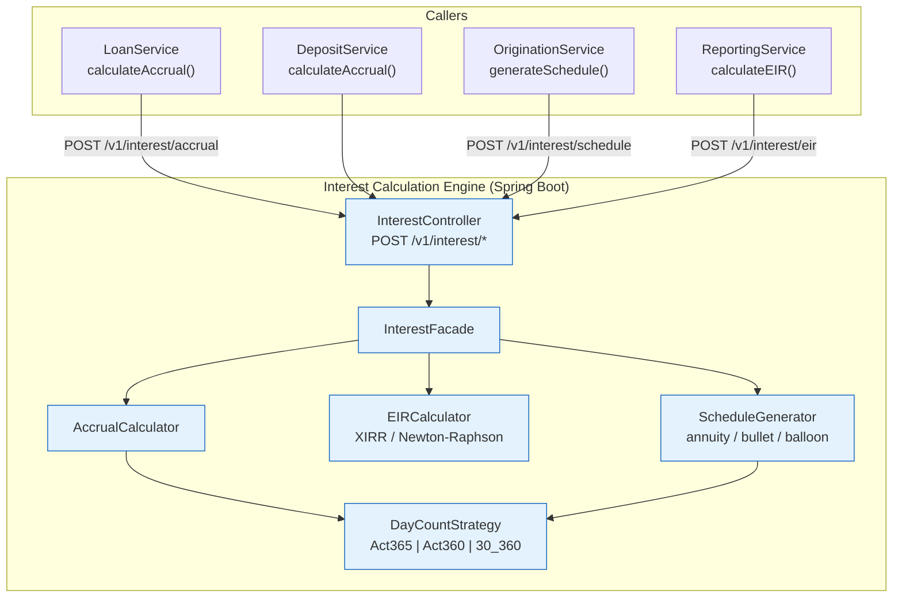

# Interest Calculation Engine

Status: Draft | Last Reviewed: 2026-05-21 | Owner: @core-banking-domain-owner
Catalog ID: BSP-007 | Radii
Tier Applicability: T0, T1

## Problem Statement

Commercial banks running loan, deposit, and bond portfolios calculate interest in at least four separate systems — the loan origination platform, the core banking ledger, the treasury workstation, and the regulatory reporting engine. Each applies a different day-count convention by default: the origination platform uses Act/365 for personal loans, treasury uses Act/360 for money market instruments, and the reporting engine uses 30/360 for bond accruals. The result is a daily interest income discrepancy that requires a manual reconciliation adjustment before month-end close, typically consuming two analyst-days per cycle.

IFRS 9 mandates the Effective Interest Rate (EIR) method for all amortised-cost financial instruments. Without a centralised calculator, EIR is recomputed independently in the origination system and the reporting system using slightly different Newton-Raphson implementations, producing different EIR values for the same loan — triggering audit findings from external auditors and SBV examiners.

Compound interest for savings products with monthly capitalisation is calculated differently in the mobile app (which shows projected balances) and the core banking system (which posts the actual accrual entry), producing customer-visible discrepancies that generate contact-centre calls.

Amortisation schedules generated at origination and recalculated at servicing diverge when a manual payment rescheduling is processed, because the two systems use different rounding rules for the principal component — making the servicing system's final payment amount unpredictable.

## Solution

A centralised InterestCalculationEngine service exposes three APIs: `POST /v1/interest/accrual` for single-period interest calculation, `POST /v1/interest/eir` for IFRS 9 Effective Interest Rate using Newton-Raphson XIRR, and `POST /v1/interest/schedule` for generating full amortisation schedules. A `DayCountStrategy` interface selects the correct convention (Act/365, Act/360, or 30/360) at runtime based on the contract attribute — no conditional logic in callers. Results are fully deterministic given the same inputs and are cached per account-ID and calculation-date in Redis. Bulk EOD accrual is delegated to the Accrual Engine (BSP-018) which calls this service in a partitioned Spring Batch job.



## Implementation Guidelines

**1. API contracts and DayCountStrategy**

```java
public record AccrualRequest(
    String accountId,
    BigDecimal principal,
    BigDecimal annualRate,          // e.g. 0.085 for 8.5%
    LocalDate fromDate,
    LocalDate toDate,
    DayCountConvention convention   // ACT_365 | ACT_360 | THIRTY_360
) {}

public record AccrualResult(
    BigDecimal interestAmount,
    long dayCount,
    int daysInYear,
    BigDecimal dailyRate
) {}

public enum DayCountConvention { ACT_365, ACT_360, THIRTY_360 }

public interface DayCountStrategy {
    long daysBetween(LocalDate from, LocalDate to);
    int daysInYear();
}

@Component
public class DayCountStrategyFactory {
    public DayCountStrategy get(DayCountConvention c) {
        return switch (c) {
            case ACT_365    -> new Actual365Strategy();
            case ACT_360    -> new Actual360Strategy();
            case THIRTY_360 -> new Thirty360Strategy();
        };
    }
}
```

**2. AccrualCalculator — core interest formula**

Simple interest accrual: `Interest = Principal × AnnualRate × Days / DaysInYear`

```java
@Service
@RequiredArgsConstructor
public class AccrualCalculator {

    private final DayCountStrategyFactory factory;

    public AccrualResult calculate(AccrualRequest req) {
        DayCountStrategy dc = factory.get(req.convention());
        long days = dc.daysBetween(req.fromDate(), req.toDate());
        BigDecimal dailyRate = req.annualRate()
            .divide(BigDecimal.valueOf(dc.daysInYear()), 10, RoundingMode.HALF_UP);
        BigDecimal interest = req.principal()
            .multiply(dailyRate)
            .multiply(BigDecimal.valueOf(days))
            .setScale(8, RoundingMode.HALF_UP);
        return new AccrualResult(interest, days, dc.daysInYear(), dailyRate);
    }
}
```

**3. EIRCalculator — Newton-Raphson XIRR for IFRS 9**

```java
@Service
public class EIRCalculator {

    private static final double TOLERANCE = 1e-10;
    private static final int MAX_ITERATIONS = 100;

    public BigDecimal calculateEIR(List<CashFlow> cashFlows) {
        double rate = 0.1; // initial guess 10%
        LocalDate baseDate = cashFlows.get(0).date();
        for (int i = 0; i < MAX_ITERATIONS; i++) {
            double f = 0, df = 0;
            for (CashFlow cf : cashFlows) {
                double t = ChronoUnit.DAYS.between(baseDate, cf.date()) / 365.0;
                double pv = cf.amount().doubleValue() / Math.pow(1 + rate, t);
                f  += pv;
                df += -t * pv / (1 + rate);
            }
            double delta = f / df;
            rate -= delta;
            if (Math.abs(delta) < TOLERANCE) break;
        }
        return BigDecimal.valueOf(rate).setScale(8, RoundingMode.HALF_UP);
    }
}
```

## Compliance Mapping

| Ring | Regulation | Provision | How this pattern satisfies |
|------|-----------|-----------|---------------------------|
| Ring 0 | IFRS 9 | §B5.4 — Effective Interest Method for amortised cost | EIRCalculator implements Newton-Raphson XIRR per IFRS 9 §B5.4; result is the discount rate for all amortised-cost instruments; cash flow inputs and EIR output are archived per instrument |
| Ring 0 | ISDA Definitions | Act/365 and Act/360 day-count conventions | DayCountStrategy pattern implements all three major conventions; convention is stored on the loan/deposit contract and passed to the engine — callers cannot override |
| Ring 1 | BCBS 239 | §4 Granularity; §5 Timeliness | AccrualResult stores convention, dayCount, fromDate, toDate, principal, annualRate for full audit traceability; no approximation before storage |
| Ring 2 | SBV Circular 39/2016 | Art. 5 — interest calculation method for credit institutions | DayCountConvention.ACT_365 is the SBV-mandated default for VND-denominated instruments; engine enforces this default for VND accounts; overrides require compliance approval ⚠️ (working summary — pending Legal review) |

## NFR Acceptance Criteria

```yaml
nfr_acceptance_criteria:
  catalog_id: BSP-007
  pattern: Interest Calculation Engine
  performance:
    - id: BSP-007-HP-01
      description: Single-period accrual calculation must complete within 5ms p99.
      threshold: p99 < 5ms
    - id: BSP-007-HP-02
      description: Thirty-period amortisation schedule generation must complete within 50ms p99.
      threshold: p99 < 50ms
    - id: BSP-007-HP-03
      description: EIR (Newton-Raphson XIRR) calculation must complete within 200ms p99.
      threshold: p99 < 200ms
  availability:
    - id: BSP-007-HA-01
      description: Service must maintain 99.99% uptime for T0 loan and deposit accrual calls.
      threshold: availability ≥ 99.99% (T0)
  correctness:
    - id: BSP-007-COR-01
      description: Accrual results must be fully deterministic — identical inputs must always produce identical outputs with no floating-point drift.
      threshold: 0 determinism failures per day (BigDecimal arithmetic throughout, no double intermediates)
    - id: BSP-007-COR-02
      description: EIR must match reference XIRR to within 1 basis point for standard amortising loan fixtures.
      threshold: |EIR_engine - EIR_reference| < 0.0001
```

## Cost / FinOps Notes

- Redis cache for accrual results (key: `accrual:{accountId}:{fromDate}:{toDate}:{convention}`) sized for intraday reuse — TTL 3,600 s; a single account queried multiple times per day hits cache every time after the first
- No GPU or ML infrastructure required — Newton-Raphson converges in < 20 iterations for standard loan cash flows
- Spring Batch EOD delegation to BSP-018 avoids calling this service 10 M times individually — BSP-018 orchestrates bulk partition calculation
- Computation is stateless and CPU-bound; horizontal scaling via Kubernetes HPA on CPU utilisation > 70%
- PostgreSQL read access for convention lookup only; write load is negligible — no dedicated read replica needed at T1 volumes

## Threat Model

**Tampering — day-count convention substitution (Tampering)**: a caller passes `ACT_360` for a VND loan that is contractually `ACT_365`, inflating the denominator and reducing the calculated interest amount. Mitigation: the DayCountConvention is authoritative on the loan contract stored in the Loan Register (immutable after disbursement); the engine reads convention from the Loan Register, not from the caller's request payload; callers that pass a convention that differs from the contract trigger an `INVALID_CONVENTION` error and an audit log entry.

**Repudiation — disputed interest calculation (Repudiation)**: a customer disputes the accrual amount posted to their account, claiming the bank calculated more days than actually elapsed. Mitigation: every AccrualResult stores `dayCount`, `daysInYear`, `fromDate`, `toDate`, `annualRate`, `principal`, and `convention` — sufficient for an independent third party to reproduce the exact result; results are signed with HMAC-SHA256 using a Vault-managed key and archived for 7 years.

## Operational Runbook

1. Alert: InterestAccrualJobFailed — fires when Spring Batch AccrualJob (BSP-018) exits non-zero. p50 resolution: 10 min; p99: 60 min. Check batch job execution log for the failed partition step ID. Re-run specific partition: `POST /actuator/batch/jobs/accrualJob/restart?executionId={id}`. If repeated failures on the same partition, inspect the account range for data anomalies (zero principal, future value date).

2. Alert: EirCalculationDivergence — fires when Newton-Raphson fails to converge within 100 iterations (delta still > 1e-10). This indicates malformed cash flows (e.g., all cash flows on the same date, or a zero-net-present-value series). Log the cash flow inputs and route to manual EIR calculation by the finance team.

3. Alert: ConventionMismatch — fires when caller's requested convention differs from the Loan Register contract. Log accountId, requested convention, and contract convention. Alert compliance team if mismatch rate > 0.1% of calls in a 5-minute window — this may indicate a misconfigured service.

## Test Strategy

**Unit**: `AccrualCalculatorTest` — parameterised across all three conventions with known-good values: VND 100,000,000 × 8.5% × 90 days / 365 = VND 2,095,890.41 (ACT_365); same principal at 360-day year = VND 2,125,000.00 (ACT_360). `EIRCalculatorTest` — use a 12-month VND 100 M annuity loan at 10% nominal rate; verify XIRR converges to 10.47% EIR (monthly compounding effect) within 1 bp of the reference Python NumPy `numpy_financial.irr` result.

**Integration**: `InterestEngineIT` (Testcontainers — no DB needed, pure computation) — POST to `/v1/interest/accrual`; verify result matches unit test fixture; POST to `/v1/interest/eir` with same cash flows; verify EIR. Test Redis cache: repeat identical accrual call; verify `accrual.cache.hit` counter incremented.

**Compliance**: `ConventionEnforcementTest` — seed Loan Register with ACT_365 for VND account; call engine with ACT_360 in request; assert `INVALID_CONVENTION` response and audit log entry generated.

**Chaos**: make Loan Register unavailable; assert engine returns `SERVICE_UNAVAILABLE` (fail-closed, not fail-open — wrong convention is worse than no answer); restore Loan Register; assert next call succeeds within one retry.

## Context

The Interest Calculation Engine is consumed by every product line that accrues interest: retail deposits (REF-013), consumer lending (REF-014), corporate lending (REF-016), and the accrual batch (BSP-018). It is a pure calculation service with no persistent state of its own — all state lives in the Loan Register or the Deposit Register. This statelessness makes it trivially horizontally scalable and independently deployable. The engine is mandatory for T0 products where IFRS 9 audit compliance requires a single authoritative EIR calculation source.

## When to Use

- Any service that needs to calculate interest accrual for a loan, deposit, or bond with an explicit day-count convention
- When IFRS 9 EIR calculation must be centralised and auditable across origination and reporting systems
- When amortisation schedules must be identical between the origination system and the servicing system

## When Not to Use

- Real-time FX interest rate lookups — use FX Rate Engine (BSP-014) for live rate feeds
- Bulk nightly accrual posting across millions of accounts — delegate to Accrual Engine (BSP-018) which orchestrates this service in partitioned Spring Batch jobs
- Simple flat-fee calculation with no time component — use Pricing Engine (BSP-006) directly

## Variants

| Variant | When to prefer | Trade-off |
|---------|----------------|-----------|
| Simple interest (this pattern) | Standard loans and deposits with no intra-period compounding | Straightforward; deterministic; preferred for regulatory simplicity |
| Compound interest (monthly/daily) | Savings accounts with monthly capitalisation; credit card revolving balances | ScheduleGenerator handles compounding by re-setting principal per period; higher CPU cost |
| IFRS 9 EIR (amortised cost) | All held-to-collect or held-to-collect-and-sell debt instruments | Newton-Raphson convergence adds latency; required for IFRS 9 Stage 1/2/3 ECL |

## Related Patterns

- [BSP-018 Accrual Engine](accrual-engine.md) — orchestrates bulk EOD accrual by calling this service in partitioned Spring Batch jobs
- [BSP-006 Pricing Engine](pricing-engine.md) — provides the nominal interest rate that feeds into AccrualRequest.annualRate
- [REF-013 Retail Deposits Platform](../../reference-architectures/retail-deposits-platform.md) — primary consumer of the accrual and EIR APIs
- [REF-014 Consumer Lending Platform](../../reference-architectures/consumer-lending-platform.md) — uses generateSchedule for origination and calculateEIR for IFRS 9 staging

## References

- IFRS 9 Financial Instruments — IASB 2014 (effective January 2018)
- ISDA 2006 Definitions — Day Count Fractions §4.16
- BCBS 239 Principles for Effective Risk Data Aggregation — BCBS January 2013
- SBV Circular 39/2016 — Lending activities of credit institutions
- Newton-Raphson method — Numerical Recipes in Java (Press et al.)

---
**Key Takeaway**: Centralise interest calculation with explicit day-count convention selection so that IFRS 9 EIR, amortisation schedules, and daily accruals produce identical results across origination, servicing, and reporting systems — eliminating the manual reconciliation adjustment that consumes two analyst-days per month-end close.
