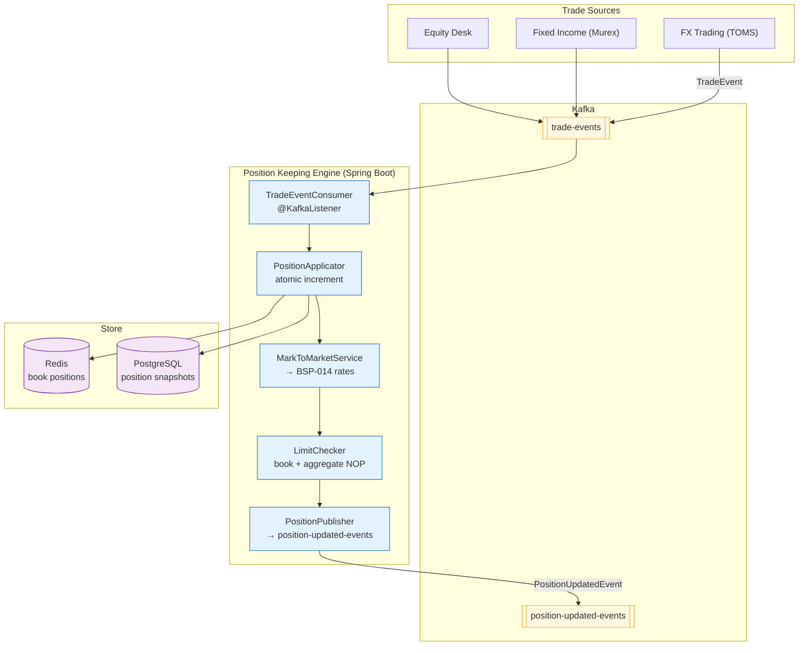

# Position Keeping Engine

Status: Draft | Last Reviewed: 2026-05-21 | Owner: @treasury-domain-owner
Catalog ID: BSP-015 | Radii
Tier Applicability: T0, T1

## Problem Statement

The bank's treasury desk maintains open FX, fixed-income, and equity positions in three separate systems: the FX trading system tracks spot and forward positions in a Bloomberg TOMS instance, the fixed-income desk uses a Murex module, and the equity desk uses a standalone spreadsheet updated manually at end of day. None of these systems share a common position ledger. When the risk manager asks "what is our total USD exposure across all trading books at this moment?", the answer requires exporting from three systems, reconciling trade IDs that differ across systems, and summing manually — a process that takes 45 minutes and is already stale by the time it is complete.

Intraday risk limits are checked per-system: the FX desk has a USD 10M net open position limit enforced in TOMS, but TOMS has no visibility into the USD exposure embedded in fixed-income positions held in Murex. A trader can technically stay within the FX limit while the combined USD exposure across FX and fixed-income exceeds the aggregate risk appetite.

Trade booking errors — wrong side, wrong quantity, wrong currency — are discovered during the end-of-day reconciliation, not at booking time. By then the position has been used as the basis for intraday limit decisions for hours.

Position history is not retained. If a regulator asks for the bank's intraday USD net open position at 14:37 on a specific date, the answer does not exist — the systems only retain end-of-day snapshots.

## Context

The Position Keeping Engine is the real-time, intraday position ledger for all trading books across FX, fixed-income, and equity desks. It receives trade events from execution systems, applies them to book-level positions, marks positions to market using rates from the FX Rate Engine (BSP-014), and enforces intraday risk limits per book and per aggregate. It maintains an immutable event log of all position changes in Kafka with full point-in-time replay capability. It is mandatory for T0 FX trading and T1 fixed-income positions. Equity positions may use it for T1 or connect to a specialist equity system.

## Solution

An event-driven PositionKeepingEngine consumes trade execution events from all trading systems via a normalised `TradeEvent` format, applies the trade to the relevant book position using atomic Redis increments (in minor currency units), marks the resulting position to market using BSP-014 rates, and publishes a `PositionUpdatedEvent` to Kafka. An intraday risk limit check (using BSP-011 Credit Limit Engine patterns) evaluates net open position against configured book and aggregate limits after each trade application. The Kafka topic is the position event log — positions can be replayed from any point in time by re-processing all events from that offset.



## Implementation Guidelines

**1. TradeEvent and PositionApplicator**

```java
public record TradeEvent(
    String tradeId,            // UUID — idempotency key
    String bookId,             // trading book identifier
    String instrument,         // ISIN or currency pair (e.g. "USD/VND")
    String side,               // "BUY" | "SELL"
    BigDecimal quantity,       // in base currency units
    BigDecimal price,          // execution price
    String currency,           // base currency (ISO 4217)
    Instant executedAt
) {}

@Service
@RequiredArgsConstructor
public class PositionApplicator {

    private final StringRedisTemplate redis;
    private final IdempotencyStore idempotencyStore; // Redis SET NX TTL 24h

    public BigDecimal apply(TradeEvent trade) {
        if (idempotencyStore.isAlreadyProcessed(trade.tradeId())) {
            return getCurrentPosition(trade.bookId(), trade.currency());
        }

        // Position stored in minor units (e.g. VND: no decimals; USD: cents)
        long delta = trade.quantity()
            .movePointRight(2)
            .longValueExact();   // 2dp for currencies with cents
        if ("SELL".equals(trade.side())) delta = -delta;

        String key = "position:" + trade.bookId() + ":" + trade.currency();
        Long newMinor = redis.opsForValue().increment(key, delta);

        idempotencyStore.markProcessed(trade.tradeId());
        return BigDecimal.valueOf(newMinor).movePointLeft(2);
    }

    public BigDecimal getCurrentPosition(String bookId, String currency) {
        String key = "position:" + trade.bookId() + ":" + currency;
        String val = redis.opsForValue().get(key);
        return val == null ? BigDecimal.ZERO : new BigDecimal(val).movePointLeft(2);
    }
}
```

**2. MarkToMarketService and LimitChecker**

```java
@Service
@RequiredArgsConstructor
public class MarkToMarketService {

    private final FxRateClient fxRateClient;   // BSP-014
    private final StringRedisTemplate redis;

    public BigDecimal markToMarket(String bookId, String baseCcy, String reportCcy) {
        BigDecimal position = getCurrentPosition(bookId, baseCcy);
        if (baseCcy.equals(reportCcy)) return position;
        BigDecimal mid = fxRateClient.getMid(baseCcy, reportCcy);
        return position.multiply(mid).setScale(2, RoundingMode.HALF_UP);
    }

    private BigDecimal getCurrentPosition(String bookId, String ccy) {
        String key = "position:" + bookId + ":" + ccy;
        String val = redis.opsForValue().get(key);
        return val == null ? BigDecimal.ZERO : new BigDecimal(val).movePointLeft(2);
    }
}

@Service
@RequiredArgsConstructor
public class LimitChecker {

    private final MarkToMarketService mtm;
    private final LimitConfigRepository limitConfig; // book-level NOP limits from PostgreSQL

    public void checkNOP(String bookId, String currency) {
        BigDecimal nopVnd = mtm.markToMarket(bookId, currency, "VND");
        BigDecimal absNOP = nopVnd.abs();
        BigDecimal bookLimit = limitConfig.getNOPLimit(bookId);
        if (absNOP.compareTo(bookLimit) > 0) {
            throw new NOPLimitExceededException(
                "Book " + bookId + " NOP " + absNOP + " exceeds limit " + bookLimit);
        }
    }
}
```

**3. Position snapshot schema**

```sql
CREATE TABLE position_snapshots (
    snapshot_id    UUID PRIMARY KEY DEFAULT gen_random_uuid(),
    book_id        VARCHAR(50) NOT NULL,
    currency       CHAR(3) NOT NULL,
    position       NUMERIC(20,2) NOT NULL,   -- signed: positive = long, negative = short
    mtm_vnd        NUMERIC(20,2),            -- mark-to-market in VND at snapshot time
    rate_id        VARCHAR(36),              -- BSP-014 rateId used for MTM
    snapshot_at    TIMESTAMPTZ NOT NULL DEFAULT now(),
    trade_id       VARCHAR(36)              -- last trade that triggered this snapshot
);

CREATE INDEX idx_position_book_time ON position_snapshots (book_id, snapshot_at DESC);
```

## When to Use

- Any trading book that requires real-time intraday position tracking with point-in-time replay
- When aggregate net open position must be enforced across multiple trading systems simultaneously
- When mark-to-market P&L must be calculated intraday using live rates from BSP-014
- When regulatory point-in-time position queries (e.g., intraday NOP at 14:37 on a specific date) must be answered from the event log

## When Not to Use

- End-of-day batch position reconciliation against the core banking ledger — use the EOD Batch Window (BSP-004) to drive a batch snapshot job
- Collateral pledging and margin tracking — use BSP-013 Collateral Management Engine which is purpose-built for pledge registration and haircut calculation
- Simple single-currency account balance tracking — use the Double-Entry Ledger (BSP-001) directly

## Variants

| Variant | When to prefer | Trade-off |
|---------|----------------|-----------|
| Kafka event log + Redis latest (this pattern) | Active trading desks; intraday risk limit enforcement; point-in-time replay required | Kafka + Redis operational overhead; feed normalisation complexity for multi-system ingestion |
| EOD snapshot only | Back-office reporting; low-frequency position tracking | Simple; no intraday visibility; insufficient for T0 trading risk |
| Vendor position system (Murex / Finastra) | Banks with existing treasury platform investment | Comprehensive; expensive; limited customisation for aggregate cross-system limits |

## NFR Acceptance Criteria

```yaml
nfr_acceptance_criteria:
  catalog_id: BSP-015
  pattern: Position Keeping Engine
  performance:
    - id: BSP-015-HP-01
      description: Trade event application including Redis increment and MTM calculation must complete within 20ms p99.
      threshold: p99 < 20ms
    - id: BSP-015-HP-02
      description: Aggregate NOP query across all books for a given currency must complete within 50ms p99.
      threshold: p99 < 50ms
  availability:
    - id: BSP-015-HA-01
      description: Position Keeping Engine must be available 99.99% during market hours (07:00–17:30 VND time) for T0 FX trading.
      threshold: availability ≥ 99.99% during market hours
  correctness:
    - id: BSP-015-COR-01
      description: Duplicate trade event delivery must produce exactly one position increment; idempotency key prevents double-counting.
      threshold: 0 duplicate position increments per day (verified by EOD reconciliation)
    - id: BSP-015-COR-02
      description: Point-in-time position query (replay from Kafka offset) must reproduce the same position as the live Redis value for any given trade sequence.
      threshold: 0 divergences between replay and live position per daily reconciliation run
```

## Compliance Mapping

| Ring | Regulation | Provision | How this pattern satisfies |
|------|-----------|-----------|---------------------------|
| Ring 0 | Basel III / FRTB | SA-CCR and IMA — intraday risk data and net open position limits | PositionUpdatedEvent carries bookId, currency, position, MTM value, and rateId; intraday NOP limits enforced via LimitChecker; point-in-time position queryable for regulatory examination |
| Ring 0 | IFRS 9 | §B6.4 — Hedge effectiveness requires observable position data | Position snapshots with MTM values and BSP-014 rateIds provide the audit data required for hedge effectiveness testing and documentation |
| Ring 1 | BCBS 239 | §4 Granularity; §5 Timeliness | Every trade event and position snapshot stored in Kafka with sub-second granularity; position replay enables any historical query within 30-day Kafka retention |
| Ring 2 | SBV Circular 02/2021/TT-NHNN | Art. 7 — Net open position limits for credit institutions | LimitChecker enforces SBV-mandated USD/VND NOP limits per book; aggregate NOP calculated in VND using BSP-014 rates; daily NOP report generated from position snapshots ⚠️ (working summary — pending Legal review) |

## Cost / FinOps Notes

- Redis for book positions: one key per book × currency; ~100 active positions at peak; negligible memory
- Kafka `trade-events` and `position-updated-events` topics: 12 partitions each; retention 30 days; ~$50/month
- PostgreSQL `position_snapshots`: append-only; high write volume during peak trading; archived to S3 after 7 years; ~$20/month at 1M snapshots/day
- Position Keeping Engine pods: 2 replicas; scales to 4 on Kafka consumer lag > 1,000 events; ~$30/month
- BSP-014 FX rate calls: cached per request within the MTM calculation; not a significant cost driver

## Threat Model Summary

**Position manipulation (Tampering)**: a rogue trader submits a synthetic `TradeEvent` directly to the `trade-events` Kafka topic (bypassing the execution system) to inflate a position and trigger a false limit breach alert, creating confusion during a market-stress event. Mitigation: `trade-events` topic is write-restricted to authenticated execution system service accounts via Kafka ACLs; `TradeEvent` records are signed with HMAC-SHA256 using the execution system's Vault-managed key; unsigned or incorrectly signed events are routed to a `trade-events-dlq` topic and an alert fires; the position replay integrity test runs hourly to verify that live Redis positions match the Kafka event log.

**Repudiation — disputed position at time of limit breach (Repudiation)**: a trader disputes that their book's NOP exceeded the limit at the time the system blocked a new trade, claiming the MTM calculation used a stale rate. Mitigation: `PositionUpdatedEvent` carries the exact `rateId` from BSP-014 used in the MTM calculation; `position_snapshots.rate_id` stores this for every snapshot; the corresponding tick can be retrieved from the `fx-rate-ticks` Kafka topic to reproduce the exact MTM value at the moment of the limit check.

## Operational Runbook (stub)

1. Alert: NOPLimitExceeded — fires when `LimitChecker` throws `NOPLimitExceededException` (metric: `position.nop.limit.exceeded`). p50 resolution: 5 min; p99: 30 min. Notify @treasury-domain-owner immediately. The breaching trade is rejected by the engine; the execution system receives a `LIMIT_BREACH` response and must halt further trades for that book pending @treasury-domain-owner approval. Do NOT manually bypass the limit — escalate to the Chief Risk Officer if business urgency is claimed.

2. Alert: TradeEventLag — fires when Kafka consumer group `position-engine` lag on `trade-events` exceeds 1,000 events for more than 2 minutes. Scale out: `kubectl scale deployment position-engine --replicas=4 -n treasury`. Common cause: MTM calculation latency spike due to BSP-014 rate lookup contention — check `fxrate.stale` metrics in parallel.

3. Alert: PositionReplayDivergence — fires when the hourly replay integrity check detects that replayed position differs from live Redis value. This indicates either a lost trade event (Kafka offset gap) or a Redis write failure. Stop accepting new trades for the affected book immediately; page @tech-lead-backend; run manual reconciliation against PostgreSQL position_snapshots.

## Test Strategy (stub)

**Unit**: `PositionApplicatorTest` — apply BUY 1,000,000 USD; assert Redis key incremented by 100,000,000 (cents); apply duplicate tradeId; assert Redis value unchanged (idempotency); apply SELL 500,000 USD; assert position halved. `LimitCheckerTest` — mock MTM returning 11M VND; book limit 10M VND; assert `NOPLimitExceededException` thrown; mock MTM returning 9M VND; assert no exception.

**Integration**: `PositionEngineIT` (Testcontainers — Redis + Kafka) — publish `TradeEvent` to `trade-events`; assert Redis position incremented; assert `PositionUpdatedEvent` on output topic; publish duplicate event; assert position unchanged; publish a trade that breaches NOP limit; assert `NOPLimitExceededException` and event on `position-updated-events` with limit breach flag.

**Compliance**: `PositionReplayIT` — publish 10 sequential trade events; record final position; replay all events from offset 0; assert replayed position equals recorded position; assert each `position_snapshots` row contains a non-null `rate_id`.

**Chaos**: Toxiproxy — disconnect Redis for 5 seconds during trade event processing; assert engine returns `SERVICE_UNAVAILABLE` (fail-closed — processing without position storage would corrupt the ledger); restore Redis; assert backlog trade events are processed in order with correct final position.

## Related Patterns

- [BSP-014 FX Rate Engine](fx-rate-engine.md) — MarkToMarketService calls BSP-014 for live mid-rates used in MTM and NOP calculations
- [BSP-011 Credit Limit Engine](credit-limit-engine.md) — NOP limit enforcement follows the same atomic check-and-reserve pattern as BSP-011 credit facility utilisation
- BSP-016 Settlement Engine — consumes `position-updated-events` to trigger settlement for matched trades (authored in Wave 9C)
- REF-017 Treasury Management Platform — primary consumer of position data for front-office desk management (authored in Wave 10)

Note: BSP-016 and REF-017 are plain text as those files do not exist yet.

## References

- Basel III Market Risk Framework (FRTB) — BCBS January 2019
- IFRS 9 Financial Instruments — IASB 2014
- BCBS 239 Principles for Effective Risk Data Aggregation — BCBS January 2013
- SBV Circular 02/2021/TT-NHNN — Foreign exchange rate management and NOP limits
- Apache Kafka documentation — log compaction and event sourcing patterns

---
**Key Takeaway**: Apply all trade events to a single position ledger using atomic Redis increments, mark positions to market via BSP-014 rates, and enforce aggregate NOP limits across all books — so intraday risk is visible in real time across all trading desks and point-in-time positions can be reconstructed from the Kafka event log.
