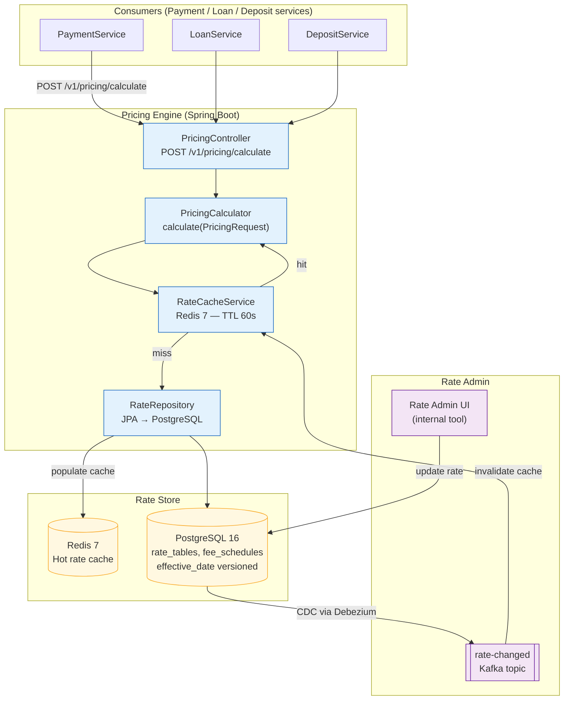

# Pricing Engine

Status: Draft | Last Reviewed: 2026-05-21 | Owner: @payments-domain-owner
Catalog ID: BSP-006 | Radii
Tier Applicability: T0, T1

## Problem Statement

Without a centralised Pricing Engine, each product service independently hard-codes its own fee schedules and rate tables. A change to the account maintenance fee requires simultaneous deployments across the payment gateway, mobile backend, web API, CRM, and core banking adapter — five independent release pipelines — with regression testing in each. The resulting deployment risk means fee changes take 4–6 weeks instead of minutes, and pricing inconsistencies between channels appear in the interim window.

FX spread, loan interest, and service fee calculations use different rounding conventions across teams: treasury rounds half-up to 6 decimal places, lending rounds half-even to 4, and payments truncates to 2. These differences produce irreconcilable P&L discrepancies in the daily reconciliation that require manual adjustment and delay month-end close.

Relationship-based pricing overrides — waived fees for platinum customers, reduced FX spreads for high-value clients — are implemented as ad-hoc `if-else` blocks in each service, invisible to auditors and impossible to trace. When a regulator asks "what fee did customer X pay for product Y on date Z, and why?", the answer requires walking four system logs by hand.

Finally, promotional rate changes (flash sale deposit rates, limited-time fee waivers) cannot take effect without a full SDLC cycle. By the time the deployment completes, the promotion window has closed.

## Solution

A shared PricingEngine microservice holds all rate tables and fee schedules in a PostgreSQL database with effective-date versioning. Consumers — payment, loan, deposit, and FX services — call it via a single REST API at transaction time. A Redis 7 cache serves hot rate lookups with a 60-second TTL; on cache miss the engine reads from PostgreSQL and populates the cache. When a rate table is updated in the Rate Admin UI, a Debezium CDC event invalidates the relevant cache key within seconds, so rate changes propagate to all consumers without service restarts.



## Implementation Guidelines

**1. PricingRequest / PricingResult API contract**

```java
public record PricingRequest(
    String productCode,
    String pricingType,    // "FEE" | "RATE" | "SPREAD"
    String currency,       // ISO 4217
    BigDecimal notional,
    String customerId,
    LocalDate valueDate
) {}

public record PricingResult(
    BigDecimal price,
    String priceType,      // "FLAT_FEE" | "PERCENTAGE" | "SPREAD_BPS"
    String rateTableId,
    LocalDate effectiveFrom,
    String currency
) {}
```

**2. PricingCalculator — Redis cache-aside pattern**

```java
@Service
@RequiredArgsConstructor
public class PricingCalculator {

    private final RateCacheService rateCache;
    private final RateRepository rateRepository;
    private final MeterRegistry meterRegistry;

    public PricingResult calculate(PricingRequest request) {
        String cacheKey = "rate:" + request.productCode() + ":" + request.currency()
                          + ":" + request.valueDate();
        return rateCache.get(cacheKey)
            .map(cached -> applyTieredLogic(cached, request))
            .orElseGet(() -> {
                RateTable rate = rateRepository
                    .findEffective(request.productCode(), request.currency(), request.valueDate())
                    .orElseThrow(() -> new PricingNotFoundException(
                        "No rate for " + request.productCode()));
                rateCache.put(cacheKey, rate, Duration.ofSeconds(60));
                meterRegistry.counter("pricing.cache.miss").increment();
                return applyTieredLogic(rate, request);
            });
    }

    private PricingResult applyTieredLogic(RateTable rate, PricingRequest req) {
        BigDecimal price = rate.tiers().stream()
            .filter(t -> req.notional().compareTo(t.minNotional()) >= 0
                      && req.notional().compareTo(t.maxNotional()) < 0)
            .findFirst()
            .map(t -> t.feeType().equals("PERCENTAGE")
                ? req.notional().multiply(t.rate())
                : t.flatAmount())
            .orElse(rate.defaultRate());
        return new PricingResult(price, rate.priceType(), rate.id(),
                                 rate.effectiveFrom(), req.currency());
    }
}
```

**3. Rate table PostgreSQL schema**

```sql
CREATE TABLE rate_tables (
    id              UUID PRIMARY KEY DEFAULT gen_random_uuid(),
    product_code    VARCHAR(50)  NOT NULL,
    price_type      VARCHAR(20)  NOT NULL,
    currency        CHAR(3)      NOT NULL,
    effective_from  DATE         NOT NULL,
    effective_to    DATE,
    created_by      VARCHAR(100) NOT NULL,
    approved_by     VARCHAR(100) NOT NULL,
    UNIQUE (product_code, currency, effective_from)
);

CREATE TABLE rate_tiers (
    id              UUID PRIMARY KEY DEFAULT gen_random_uuid(),
    rate_table_id   UUID         NOT NULL REFERENCES rate_tables(id),
    min_notional    NUMERIC(20,4) NOT NULL DEFAULT 0,
    max_notional    NUMERIC(20,4) NOT NULL,
    rate            NUMERIC(10,8),
    flat_amount     NUMERIC(20,4),
    fee_type        VARCHAR(20)  NOT NULL
);
```

## Compliance Mapping

| Ring | Regulation | Provision | How this pattern satisfies |
|------|-----------|-----------|---------------------------|
| Ring 0 | IFRS 15 | Revenue recognition at transaction price | Rate tables record the contractual price; PricingResult.price is the IFRS 15 transaction price used for revenue booking |
| Ring 0 | PCI-DSS 4.0 | §4 — Protect cardholder data in transit | Pricing API is TLS 1.3 only; no card data stored in rate tables; rate admin access requires MFA |
| Ring 1 | BCBS 239 | §4 Granularity; §6 Adaptability | Every pricing decision references a versioned rate_table_id; historical rates retained for audit; rate changes propagate to all consumers within 60 seconds |
| Ring 1 | ISO 4217 | Currency code standardisation | All PricingRequest and rate_tables use ISO 4217 currency codes enforced by CHECK constraint |
| Ring 2 | SBV Circular 09/2020 | §IV.2 — transaction data integrity and logging | Every pricing calculation logs productCode, rateTableId, effectiveFrom, and price to the structured audit log; log entries are immutable ⚠️ (working summary — pending Legal review) |

## NFR Acceptance Criteria

```yaml
nfr_acceptance_criteria:
  catalog_id: BSP-006
  pattern: Pricing Engine
  performance:
    - id: BSP-006-HP-01
      description: Pricing calculation including Redis cache lookup must complete within 10ms p99 at 10,000 TPS sustained load.
      threshold: p99 < 10ms at 10,000 TPS
    - id: BSP-006-HP-02
      description: Cache miss path (Redis miss → PostgreSQL → cache populate) must complete within 50ms p99.
      threshold: p99 < 50ms (cache miss)
  availability:
    - id: BSP-006-HA-01
      description: Pricing Engine must remain available if Redis is unreachable — fall back to direct PostgreSQL reads within 200ms.
      threshold: availability ≥ 99.99% (T0); graceful Redis fallback within 200ms
  correctness:
    - id: BSP-006-COR-01
      description: Every pricing decision must reference a versioned rate table; no calculation may use an expired rate.
      threshold: 0 expired-rate pricing decisions per day (verified by nightly audit)
```

## Cost / FinOps Notes

- Redis cluster (r7g.large, 3-node) sized for 10 K TPS rate lookups: ~$350/month; set maxmemory-policy allkeys-lru to evict cold product codes automatically
- PostgreSQL read replica for rate admin queries keeps write primary free for transactional load; replica costs ~$200/month
- Rate table audit rows archived to S3 Glacier after 7 years (SBV data-retention obligation); archival cost ~$1/month at typical volume
- CDK budget alarm at 120% of pricing engine baseline triggers PagerDuty alert before overspend compounds
- Relationship pricing integration (BSP-020) caches the combined PricingResult per customer-product-date key, avoiding a second BSP-006 call within the same request

## Threat Model

**Tampering — rate table manipulation (Tampering)**: an insider with database write access modifies a rate_tier row to apply a zero-fee schedule for a favoured merchant. Mitigation: rate_tables rows are append-only enforced by a PostgreSQL trigger (INSERT only, no UPDATE/DELETE without creating a new versioned row); every change requires `created_by` and `approved_by` from two distinct users (dual-control workflow in Rate Admin UI); Debezium CDC streams all DDL and DML changes to an immutable append-only Kafka audit topic retained for 90 days.

**Elevation of Privilege — unauthorized rate override (Elevation of Privilege)**: a development team bypasses the Pricing Engine and hard-codes a promotional rate directly in their service to meet a sprint deadline, creating an unaudited pricing path. Mitigation: API gateway policy rejects any outbound pricing call that does not route through the BSP-006 endpoint; a nightly static-analysis CI job greps the monorepo for direct fee/rate arithmetic outside the pricing-engine module and fails the build if found.

## Operational Runbook

1. Alert: PricingRateStaleness — fires when any `rate_tables` row has `effective_to < NOW()` with no successor row for the same `product_code + currency`. p50 resolution: 5 min; p99: 30 min. Open Rate Admin UI → search by product_code → create new effective row. Escalate to Pricing team lead if gap > 1 hour — all downstream calculations for that product will throw `PricingNotFoundException`.

2. Alert: PricingCacheMissRateHigh — fires when cache miss rate > 5% sustained for 5 minutes (Micrometer gauge `pricing.cache.miss.rate`). Check Redis cluster memory via `redis-cli info memory`; if `used_memory` > 80% of `maxmemory`, increase cluster size. If a recent deployment changed cache key format, a warm-up run fixes it: `POST /actuator/cache/evict-all` followed by a replay of the last 10 k product codes from the access log.

3. Alert: PricingNotFoundException — fires when `calculate()` throws for a productCode that should exist. Run `SELECT * FROM rate_tables WHERE product_code = ? ORDER BY effective_from DESC` to diagnose gaps. Common cause: a new product launched without a corresponding rate table row.

## Test Strategy

**Unit**: `PricingCalculatorTest` — mock `RateCacheService` returning empty Optional (cache miss) and a populated Optional (cache hit); assert tiered bracket selection for notional values at tier boundaries; assert flat-fee path vs. percentage path; assert cache hit does not call `rateRepository`.

**Integration**: `PricingEngineIT` using Testcontainers (PostgreSQL 16 + Redis 7) — seed `rate_tables` and `rate_tiers`; POST to `/v1/pricing/calculate`; assert `PricingResult.price` matches expected; force Redis eviction via `FLUSHDB`; assert identical result from DB fallback; assert `pricing.cache.miss` counter incremented.

**Compliance**: `RateVersionAuditTest` — update a rate table to a new version; assert that a pricing call using the old `valueDate` returns the old `rateTableId`; assert no expired rates are served; assert audit log contains both versions.

**Chaos**: use Toxiproxy to drop Redis connection mid-load; assert pricing continues serving results via DB fallback within 200 ms; restore Redis; assert cache repopulated within one TTL cycle (60 s); assert no pricing errors during the failure window.

## Context

The Pricing Engine is the single source of truth for all fee, rate, and spread calculations across the bank's product portfolio. It is mandatory for T0 services where pricing inconsistency creates P&L discrepancies or regulatory exposure, and strongly recommended for T1. It sits at the centre of the pricing layer alongside the Fee Engine (BSP-008), which handles ledger posting of the calculated fee amount, and the Relationship Pricing Engine (BSP-020), which applies customer-tier discounts on top of base rates returned by BSP-006. Tier 2 and Tier 3 services may call BSP-006 directly or rely on pre-computed rate snapshots for batch processing.

## When to Use

- Any service that charges a fee, applies an interest rate, or quotes a spread at transaction time
- When the same rate must be consistently applied across mobile, web, branch, and API channels simultaneously
- When rate changes must take effect within seconds, not deployment cycles

## When Not to Use

- Internal treasury mark-to-market revaluation of securities positions — use FX Rate Engine (BSP-014) which is optimised for real-time FX feed ingestion
- Batch accounting runs where pricing is computed retrospectively from stored snapshots — direct SQL against rate_tables is simpler and cheaper than HTTP calls at batch volume

## Variants

| Variant | When to prefer | Trade-off |
|---------|----------------|-----------|
| Static schedule (DB-driven rate tables) | Stable, infrequently changing rates — account maintenance fees, standard loan rates | Simple admin UI; not suitable for rates that move with market indices |
| Parametric model (formula + market inputs) | Loan pricing with risk-based spread: base rate + credit spread + liquidity premium | More complex calculation logic; requires live market data feed from BSP-014; latency higher |
| ML-assisted pricing | Risk-based personal loan pricing; credit card limit assignment based on bureau score | Requires MLOps pipeline; explainability mandatory for regulatory fair-lending obligations |

## Related Patterns

- [BSP-008 Fee Engine](fee-engine.md) — BSP-006 provides the calculated fee amount; BSP-008 applies waiver rules and posts to the ledger
- [DATA-013 Reference Data Master](../data/reference-data-master.md) — currency codes and product codes are mastered here; BSP-006 validates inputs against this registry
- BSP-020 Relationship Pricing Engine — queries BSP-006 and applies customer-segment discounts on top of base rates (authored in Wave 9D)
- BSP-014 FX Rate Engine — provides real-time FX mid-rates consumed by BSP-006 for FX spread calculations (authored in Wave 9C)

## References

- IFRS 15 Revenue from Contracts with Customers — IASB 2014
- PCI-DSS v4.0 §4 — PCI Security Standards Council 2022
- BCBS 239 Principles for Effective Risk Data Aggregation — BCBS January 2013
- ISO 4217 Currency codes — ISO
- Redis documentation: cache-aside pattern — redis.io/docs/manual/patterns

---
**Key Takeaway**: Centralise all fee, rate, and spread calculations in a single versioned Pricing Engine so that rate changes propagate to all channels in under 60 seconds without code deployments, and every pricing decision is auditable by rateTableId.
