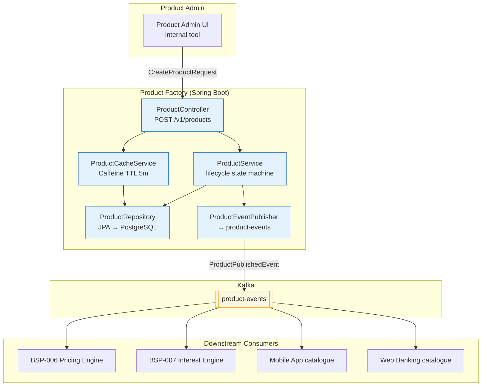

# Product Factory

Status: Draft | Last Reviewed: 2026-05-21 | Owner: @core-banking-domain-owner
Catalog ID: BSP-017 | Radii
Tier Applicability: T0, T1, T2

## Problem Statement

Launching a new retail banking product — a fixed-term savings deposit with a promotional rate, monthly compounding, and automatic rollover — requires coordinated changes across six systems: the core banking product registry, the pricing engine configuration, the mobile app product catalogue, the statement generation service, the interest accrual batch, and the regulatory reporting adapter. Each change is managed as a separate ticket, approved by a different team, and deployed in a different release window. The total time from product design approval to customer-facing availability is 6–8 weeks, which exceeds the promotional window for most rate campaigns.

Product configuration is inconsistent. The core banking system treats the compounding frequency as a free-text field ("Monthly", "monthly", "MONTHLY" appear in three product records). The mobile app reads a separate product JSON file that was manually synchronised with the core banking registry six months ago and has since diverged. A customer checking product terms on the mobile app sees different information than the teller's screen shows.

Product variants — the same base product offered to different customer segments at different rates (Standard, Premier, Corporate) — are modelled as entirely separate products in the core banking system, each requiring independent maintenance. When the base compounding formula changes, it must be applied to all three variants separately, each of which may be at a different configuration version.

Retired products cannot be cleanly sunset. Three products that were discontinued two years ago still have active accounts. The accounts continue to accrue interest under the old product terms because there is no product-version lifecycle mechanism — accounts are linked to a product code, not a product version.

## Context

The Product Factory is the master product registry for all banking products — deposits, loans, current accounts, cards, and investment products. It stores product blueprints (term, compounding, currency, tier eligibility), manages product versions with effective-date lifecycle, and publishes product configuration events to Kafka for consumption by the pricing engine (BSP-006), the interest calculation engine (BSP-007), the accrual engine (BSP-018), and all customer-facing channels. It is the single source of truth for what a product is — not what its price is (BSP-006 owns that) or what its current balance is (BSP-001 owns that). It is mandatory for T0 retail and premium products; T1 corporate and investment products may use it or maintain their own product registry if regulatory classification requires specialised product modelling.

## Solution

A ProductFactory Spring Boot service stores product blueprints in PostgreSQL with full version history, exposes a product management REST API for product creation and lifecycle transitions, and publishes `ProductPublishedEvent` to a Kafka topic on each version change. Downstream systems subscribe to the topic and refresh their product-specific configuration caches. A Caffeine cache serves hot product lookups with a 5-minute TTL. Product variants are modelled as children of a base product, inheriting configuration from the parent and overriding only the differing attributes (rate tier, segment eligibility). Product lifecycle follows a state machine: DRAFT → PENDING_APPROVAL → ACTIVE → DEPRECATED → RETIRED.



## Implementation Guidelines

**1. Product blueprint and lifecycle state machine**

```java
public record ProductBlueprint(
    String productId,           // UUID
    String productCode,         // human-readable: "FIXED_DEPOSIT_12M_VND"
    String productType,         // DEPOSIT | LOAN | CURRENT_ACCOUNT | CARD
    String currency,            // ISO 4217
    String compoundingFrequency, // DAILY | MONTHLY | QUARTERLY | NONE
    Integer termMonths,         // null for open-ended products
    Boolean autoRollover,
    String parentProductId,     // null for base products; UUID for variants
    String customerSegment,     // ALL | RETAIL | PREMIER | CORPORATE
    String status,              // DRAFT | PENDING_APPROVAL | ACTIVE | DEPRECATED | RETIRED
    Integer version,
    LocalDate effectiveFrom,
    LocalDate effectiveTo       // null if currently active
) {}

@Service
@RequiredArgsConstructor
public class ProductService {

    private final ProductRepository repo;
    private final ProductEventPublisher publisher;
    private final IdempotencyStore idempotencyStore;

    public ProductBlueprint activate(String productId, String approvedBy) {
        ProductBlueprint current = repo.findLatest(productId)
            .orElseThrow(() -> new ProductNotFoundException(productId));

        if (!"PENDING_APPROVAL".equals(current.status())) {
            throw new InvalidStateTransitionException(
                "Cannot activate product in state: " + current.status());
        }

        ProductBlueprint activated = new ProductBlueprint(
            current.productId(), current.productCode(), current.productType(),
            current.currency(), current.compoundingFrequency(), current.termMonths(),
            current.autoRollover(), current.parentProductId(), current.customerSegment(),
            "ACTIVE", current.version(), LocalDate.now(), null
        );
        repo.save(activated);
        publisher.publish(new ProductPublishedEvent(activated, approvedBy, Instant.now()));
        return activated;
    }

    public ProductBlueprint deprecate(String productId) {
        ProductBlueprint current = repo.findLatest(productId)
            .orElseThrow(() -> new ProductNotFoundException(productId));

        if (!"ACTIVE".equals(current.status())) {
            throw new InvalidStateTransitionException(
                "Cannot deprecate product in state: " + current.status());
        }

        ProductBlueprint deprecated = new ProductBlueprint(
            current.productId(), current.productCode(), current.productType(),
            current.currency(), current.compoundingFrequency(), current.termMonths(),
            current.autoRollover(), current.parentProductId(), current.customerSegment(),
            "DEPRECATED", current.version() + 1, current.effectiveFrom(), LocalDate.now()
        );
        repo.save(deprecated);
        publisher.publish(new ProductPublishedEvent(deprecated, "SYSTEM", Instant.now()));
        return deprecated;
    }
}
```

**2. Variant inheritance resolution**

```java
@Service
@RequiredArgsConstructor
public class ProductCacheService {

    private final LoadingCache<String, ProductBlueprint> cache;
    private final ProductRepository repo;

    public ProductBlueprint resolve(String productId) {
        ProductBlueprint product = cache.get(productId);
        if (product.parentProductId() == null) return product;

        // Merge parent attributes — child overrides only non-null fields
        ProductBlueprint parent = cache.get(product.parentProductId());
        return new ProductBlueprint(
            product.productId(),
            product.productCode(),
            product.productType() != null ? product.productType() : parent.productType(),
            product.currency() != null ? product.currency() : parent.currency(),
            product.compoundingFrequency() != null ? product.compoundingFrequency() : parent.compoundingFrequency(),
            product.termMonths() != null ? product.termMonths() : parent.termMonths(),
            product.autoRollover() != null ? product.autoRollover() : parent.autoRollover(),
            product.parentProductId(),
            product.customerSegment(),
            product.status(),
            product.version(),
            product.effectiveFrom(),
            product.effectiveTo()
        );
    }
}
```

**3. Product blueprint schema**

```sql
CREATE TABLE products (
    product_id            UUID NOT NULL,
    version               INT NOT NULL,
    product_code          VARCHAR(100) NOT NULL,
    product_type          VARCHAR(30) NOT NULL,  -- DEPOSIT | LOAN | CURRENT_ACCOUNT | CARD
    currency              CHAR(3) NOT NULL,
    compounding_frequency VARCHAR(20) NOT NULL,  -- DAILY | MONTHLY | QUARTERLY | NONE
    term_months           INT,                   -- NULL for open-ended products
    auto_rollover         BOOLEAN NOT NULL DEFAULT false,
    parent_product_id     UUID REFERENCES products(product_id, 1),
    customer_segment      VARCHAR(30) NOT NULL DEFAULT 'ALL',
    status                VARCHAR(30) NOT NULL,
    effective_from        DATE NOT NULL,
    effective_to          DATE,
    created_by            VARCHAR(100) NOT NULL,
    approved_by           VARCHAR(100),
    PRIMARY KEY (product_id, version)
);

-- Self-referential FK requires function-based approach; use partial unique index
CREATE UNIQUE INDEX idx_product_active ON products (product_code, customer_segment)
    WHERE status = 'ACTIVE';

CREATE INDEX idx_product_type_status ON products (product_type, status);
```

## When to Use

- Any new banking product that must be configured once and consumed consistently by pricing, interest calculation, accrual, and all customer-facing channels
- When product variants (segment-specific rate overrides) must inherit from a base product definition to avoid configuration drift
- When product lifecycle (DRAFT → ACTIVE → DEPRECATED → RETIRED) must be governed with dual-approval and audit trail
- When downstream systems must receive immediate notification of product configuration changes via event

## When Not to Use

- Account-level balance or interest tracking — use BSP-001 Double-Entry Ledger and BSP-007 Interest Calculation Engine; the Product Factory stores the product blueprint, not account-level data
- Real-time fee or rate calculations — use BSP-006 Pricing Engine directly; the Product Factory stores product structure, not pricing rules
- Customer relationship tier management — use BSP-020 Relationship Pricing Engine for customer-segment discounts; the Product Factory stores the base product definition

## Variants

| Variant | When to prefer | Trade-off |
|---------|----------------|-----------|
| Event-driven product publish (this pattern) | Banks with multiple channel systems requiring consistent product data; real-time product launch | Kafka dependency; downstream cache invalidation complexity |
| Database-polling (shared product table) | Simple monolithic core banking; few downstream consumers | Simpler; tighter coupling; schema changes affect all consumers simultaneously |
| Product catalogue in CMS | Non-financial product marketing content | Better content management tooling; not suitable for machine-readable configuration consumed by pricing or accrual systems |

## NFR Acceptance Criteria

```yaml
nfr_acceptance_criteria:
  catalog_id: BSP-017
  pattern: Product Factory
  performance:
    - id: BSP-017-HP-01
      description: Product lookup including Caffeine cache hit must complete within 5ms p99.
      threshold: p99 < 5ms (cache hit)
    - id: BSP-017-HP-02
      description: Product variant resolution (parent merge) must complete within 10ms p99.
      threshold: p99 < 10ms
  availability:
    - id: BSP-017-HA-01
      description: Product Factory must be available 99.99% for T0 product lookup paths; Caffeine cache allows reads to continue during PostgreSQL degradation for up to 5 minutes.
      threshold: availability ≥ 99.99% (T0); cache read continuity during DB outage ≤ 5 min
  correctness:
    - id: BSP-017-COR-01
      description: Only one ACTIVE version of a product_code + customer_segment combination may exist at any time; duplicate activation must be rejected.
      threshold: 0 duplicate active products (enforced by unique partial index)
    - id: BSP-017-COR-02
      description: ProductPublishedEvent must be emitted within 10 seconds of a status transition; downstream consumers must not see stale product configuration beyond 5 minutes.
      threshold: event latency < 10s; cache TTL ≤ 5 min on all downstream consumers
```

## Compliance Mapping

| Ring | Regulation | Provision | How this pattern satisfies |
|------|-----------|-----------|---------------------------|
| Ring 0 | IFRS 9 | §B5.4 — Product classification drives amortised-cost vs FVTPL measurement | product_type and compounding_frequency in the Product Blueprint determine IFRS 9 classification; all ACTIVE products are queryable at any historical date via effective_from/effective_to for retrospective audit |
| Ring 0 | PCI-DSS 4.0 | §12.3 — Product configuration changes require documented approval | Every product status transition records approved_by; Kafka event log retains full history; no product reaches ACTIVE without an approved_by value |
| Ring 1 | BCBS 239 | §4 Granularity; §6 Adaptability | ProductPublishedEvent carries the full blueprint including version, effectiveFrom, and approvedBy; all downstream risk systems receive the same canonical product definition |
| Ring 2 | SBV Circular 01/2020/TT-NHNN | Art. 6 — Deposit product classification and SBV reporting | product_type, term_months, and compounding_frequency map directly to SBV deposit product classification codes; product registry is the authoritative source for SBV product reporting ⚠️ (working summary — pending Legal review) |

## Cost / FinOps Notes

- PostgreSQL `products` table: append-only versioned rows; < 10,000 rows even with full product lifecycle history for a large bank; negligible storage cost
- Caffeine cache: in-process; no infrastructure cost; TTL 5 minutes provides stale-tolerance for PostgreSQL maintenance windows
- Kafka `product-events` topic: low volume (product changes are rare — perhaps 10–50 per day); 3 partitions; retention 365 days for full product history; ~$5/month
- Product Factory pods: 2 replicas; stateless; ~$20/month
- No GPU or ML infrastructure required — product configuration is deterministic structured data

## Threat Model Summary

**Unauthorised product activation (Elevation of Privilege)**: a developer with API access activates a product that has not passed the dual-approval workflow, bypassing compliance review and launching a product with incorrect pricing or term configuration. Mitigation: the `PENDING_APPROVAL → ACTIVE` transition requires an `approved_by` JWT claim from a user in the `product-approver` RBAC role (enforced by SEC-010 ABAC); the activating user cannot be the same as the creating user (four-eyes principle enforced in the service layer); all activation attempts are logged with the caller's identity regardless of outcome.

**Configuration drift (Tampering)**: a downstream service (e.g., the mobile app) reads product configuration directly from its own local copy without subscribing to the `product-events` topic, causing the cached product terms to diverge from the canonical Product Factory state after a version update. Mitigation: all downstream services must include the product `version` field in their cached state and publish a `product.version.mismatch` metric when the version in a transaction event differs from their cached version; the Product Factory exposes a `GET /v1/products/{id}/version` endpoint for spot-checks; an automated drift-detection job runs hourly and alerts when any consumer's product version lags by more than one version for more than 10 minutes.

## Operational Runbook (stub)

1. Alert: ProductActivationBlocked — fires when a product activation request is rejected due to missing approver (metric: `product.activation.rejected`). p50 resolution: 5 min; p99: 30 min. Check the rejection reason in the audit log: `GET /v1/products/{id}/audit`. Notify the product approver group to complete the approval workflow in the Product Admin UI.

2. Alert: ProductEventLag — fires when Kafka producer lag on `product-events` exceeds 5 events for more than 5 minutes. This indicates a Kafka connectivity issue on the producer side. Check the Kafka producer circuit breaker: `GET /actuator/health/kafkaProducerCircuitBreaker`. If circuit breaker is open, product activations are still persisted to PostgreSQL but downstream consumers will not receive events — manually trigger event replay after connectivity is restored: `POST /actuator/products/replay-events?since={timestamp}`.

3. Alert: ProductVersionMismatch — fires when the automated drift-detection job detects a consumer reporting a product version more than one behind the current active version. Identify which consumer is lagging from the `product.version.mismatch` metric tags. Force a cache refresh on that consumer: `POST /actuator/product-cache/evict?productId={id}` (standardised endpoint on all downstream services).

## Test Strategy (stub)

**Unit**: `ProductServiceTest` — create product in DRAFT; assert state = DRAFT; call activate without PENDING_APPROVAL status; assert `InvalidStateTransitionException`; transition to PENDING_APPROVAL; activate with approver; assert status = ACTIVE, approvedBy populated; attempt to activate again; assert duplicate rejection. `ProductCacheServiceTest` — create base product; create variant with null compoundingFrequency; call resolve on variant; assert compoundingFrequency inherited from base product.

**Integration**: `ProductFactoryIT` (Testcontainers — PostgreSQL + Kafka) — create and activate a product; assert `products` table has ACTIVE version; assert `ProductPublishedEvent` on `product-events` Kafka topic with correct version; deprecate the product; assert effectiveTo set; assert second event on topic with status = DEPRECATED; attempt to activate a second product with same product_code + customer_segment; assert unique constraint violation.

**Compliance**: `ProductApprovalAuditTest` — attempt activation as the creating user (four-eyes violation); assert rejection and audit log entry; activate as different approver; assert activation succeeds with approvedBy ≠ createdBy; assert Kafka event contains approvedBy field.

**Chaos**: make PostgreSQL unavailable; assert Caffeine cache serves reads for up to 5 minutes without error; after TTL expires, assert service returns `SERVICE_UNAVAILABLE` (fail-closed — serving stale product config beyond TTL is worse than returning an error); restore PostgreSQL; assert next cache miss repopulates correctly.

## Related Patterns

- [BSP-006 Pricing Engine](pricing-engine.md) — subscribes to `product-events` to invalidate rate table cache when a product version changes
- [BSP-007 Interest Calculation Engine](interest-calculation-engine.md) — reads product compoundingFrequency and term from BSP-017 to configure the AccrualCalculator convention
- BSP-018 Accrual Engine — reads the product blueprint from BSP-017 to determine which accounts require daily vs monthly accrual (authored in Wave 9D)
- BSP-020 Relationship Pricing Engine — reads the base product definition from BSP-017 and applies customer-segment discounts on top (authored in Wave 9D)

Note: BSP-018 and BSP-020 are plain text as those files do not exist yet.

## References

- IFRS 9 Financial Instruments — product classification guidance §B4.1 — IASB 2014
- PCI-DSS v4.0 §12.3 — Change management requirements for financial product configuration
- BCBS 239 Principles for Effective Risk Data Aggregation — BCBS January 2013
- SBV Circular 01/2020/TT-NHNN — Deposit product classification regulations
- Martin Fowler — "Product Configurator" pattern in enterprise application architecture

---
**Key Takeaway**: Store all banking product blueprints in a versioned, event-driven Product Factory so that product launches require a single configuration change that propagates to pricing, accrual, and all channels within 5 minutes — and product variants inherit from a base definition, preventing configuration drift between segment tiers.
