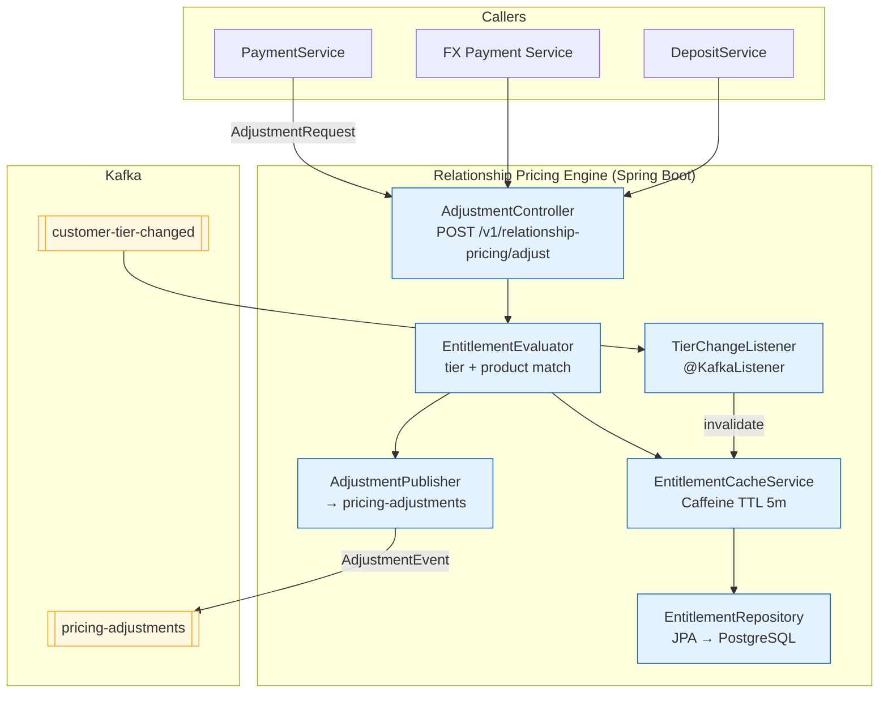

# Relationship Pricing Engine

Status: Draft | Last Reviewed: 2026-05-21 | Owner: @payments-domain-owner
Catalog ID: BSP-020 | Radii
Tier Applicability: T0, T1

## Problem Statement

Relationship-based pricing discounts — a Premier customer receiving a 0.2% reduction in the FX spread, a high-AUM deposit client receiving a 0.5% rate uplift, a long-tenure customer receiving fee waivers — are implemented as hard-coded `if-else` blocks in five separate services. The payment gateway applies its own spread discount logic, the deposit service applies a different rate uplift table, and the relationship manager's CRM displays yet another view of entitlements that was last synchronised with the operational systems six months ago.

When a customer is upgraded from Retail to Premier, the upgrade takes effect immediately in the CRM but requires a scheduled batch job to propagate to the pricing systems — a 24-hour delay during which the customer is already told they have Premier benefits but is still charged Retail prices.

Relationship pricing entitlements cannot be audited. When a customer disputes their FX charge, the bank cannot confirm whether the Premier discount was applied, because the discount logic is buried in an unlogged conditional in the payment gateway.

Promotional overrides — a 3-month zero-fee banking offer for new Premier customers — expire at different times in different systems because each service has its own promotional expiry check. A customer may lose their zero-fee entitlement in the mobile app two weeks before losing it in the web portal.

## Context

The Relationship Pricing Engine sits between the Pricing Engine (BSP-006) and all customer-facing services. It takes a base price from BSP-006, evaluates the customer's relationship tier and entitlements, and returns an adjusted price with the discount or uplift applied. Entitlements are stored in PostgreSQL with effective-date versioning and served from a Caffeine in-process cache with a 5-minute TTL. When a customer's tier changes (published by the CRM as a `CustomerTierChangedEvent`), the cache is invalidated immediately via a Kafka listener. It is mandatory for T0 retail and premium payment paths and T1 corporate pricing. BSP-020 is the last mile of the pricing chain: BSP-006 → BSP-020 → calling service.

## Solution

A RelationshipPricingEngine microservice exposes a single POST `/v1/relationship-pricing/adjust` endpoint. It receives the `PricingResult` from BSP-006 along with the `customerId` and `productCode`, looks up the customer's active entitlements from the Caffeine cache (backed by PostgreSQL), applies the highest-priority applicable discount or uplift, and returns an `AdjustedPricingResult` carrying the original base price, the applied discount, the entitlement ID, and the adjusted final price. All adjustments are published to a `pricing-adjustments` Kafka topic for audit and revenue reconciliation.



## Implementation Guidelines

**1. AdjustmentRequest and EntitlementEvaluator**

```java
public record AdjustmentRequest(
    String customerId,
    String productCode,
    String pricingType,      // "FEE" | "RATE" | "SPREAD"
    PricingResult basePrice, // from BSP-006
    String channel,          // "MOBILE" | "WEB" | "API"
    LocalDate valueDate
) {}

public record AdjustedPricingResult(
    BigDecimal basePrice,
    BigDecimal adjustedPrice,
    BigDecimal discountAmount, // positive = discount applied; negative = uplift
    String entitlementId,      // UUID of the applied entitlement; null if none
    String entitlementType,    // "PERCENTAGE_DISCOUNT" | "FLAT_WAIVER" | "RATE_UPLIFT"
    String rateTableId,        // from BSP-006 PricingResult for audit chain
    LocalDate effectiveFrom
) {}

@Service
@RequiredArgsConstructor
public class EntitlementEvaluator {

    private final EntitlementCacheService cache;
    private final AdjustmentPublisher publisher;

    public AdjustedPricingResult evaluate(AdjustmentRequest req) {
        List<Entitlement> entitlements = cache.getEntitlements(
            req.customerId(), req.productCode(), req.valueDate());

        // Apply highest-priority entitlement (lowest priority_rank value wins)
        Optional<Entitlement> best = entitlements.stream()
            .filter(e -> e.channel() == null || e.channel().equals(req.channel()))
            .min(Comparator.comparingInt(Entitlement::priorityRank));

        if (best.isEmpty()) {
            // No entitlement — return base price unchanged with null entitlementId
            return new AdjustedPricingResult(
                req.basePrice().price(), req.basePrice().price(),
                BigDecimal.ZERO, null, null,
                req.basePrice().rateTableId(), req.valueDate()
            );
        }

        Entitlement e = best.get();
        BigDecimal adjusted = applyEntitlement(req.basePrice().price(), e);
        BigDecimal discount = req.basePrice().price().subtract(adjusted);

        AdjustedPricingResult result = new AdjustedPricingResult(
            req.basePrice().price(), adjusted, discount,
            e.entitlementId(), e.entitlementType(),
            req.basePrice().rateTableId(), req.valueDate()
        );

        publisher.publish(new AdjustmentEvent(
            req.customerId(), req.productCode(), req.channel(),
            result, Instant.now()));
        return result;
    }

    private BigDecimal applyEntitlement(BigDecimal basePrice, Entitlement e) {
        return switch (e.entitlementType()) {
            case "PERCENTAGE_DISCOUNT" ->
                basePrice.multiply(BigDecimal.ONE.subtract(e.discountRate()))
                    .setScale(4, RoundingMode.HALF_UP);
            case "FLAT_WAIVER" ->
                basePrice.subtract(e.flatAmount()).max(BigDecimal.ZERO);
            case "RATE_UPLIFT" ->
                basePrice.add(e.rateUplift()).setScale(8, RoundingMode.HALF_UP);
            default -> basePrice;
        };
    }
}
```

**2. Cache invalidation on tier change**

```java
@Component
@RequiredArgsConstructor
public class TierChangeListener {

    private final EntitlementCacheService cache;

    @KafkaListener(topics = "customer-tier-changed", groupId = "relationship-pricing")
    public void onTierChanged(@Payload CustomerTierChangedEvent event) {
        cache.invalidate(event.customerId());
    }
}

@Component
@RequiredArgsConstructor
public class EntitlementCacheService {

    private final LoadingCache<String, List<Entitlement>> cache;
    private final EntitlementRepository repo;

    public List<Entitlement> getEntitlements(String customerId, String productCode,
                                              LocalDate asOf) {
        return cache.get(customerId).stream()
            .filter(e -> (e.productCode() == null || e.productCode().equals(productCode))
                      && !asOf.isBefore(e.effectiveFrom())
                      && (e.effectiveTo() == null || !asOf.isAfter(e.effectiveTo())))
            .toList();
    }

    public void invalidate(String customerId) {
        cache.invalidate(customerId);
    }
}
```

**3. Entitlement schema**

```sql
CREATE TABLE entitlements (
    entitlement_id   UUID PRIMARY KEY DEFAULT gen_random_uuid(),
    customer_id      VARCHAR(50),          -- NULL = applies to all customers in segment
    customer_segment VARCHAR(30),          -- RETAIL | PREMIER | CORPORATE; NULL = all
    product_code     VARCHAR(50),          -- NULL = applies to all products
    channel          VARCHAR(30),          -- NULL = applies to all channels
    entitlement_type VARCHAR(30) NOT NULL, -- PERCENTAGE_DISCOUNT | FLAT_WAIVER | RATE_UPLIFT
    discount_rate    NUMERIC(8,6),         -- e.g. 0.002 = 0.2% discount
    flat_amount      NUMERIC(20,4),        -- flat fee waiver amount
    rate_uplift      NUMERIC(8,6),         -- deposit rate uplift
    priority_rank    INT NOT NULL DEFAULT 100, -- lower = applied first
    effective_from   DATE NOT NULL,
    effective_to     DATE,                 -- NULL = currently active
    created_by       VARCHAR(100) NOT NULL,
    approved_by      VARCHAR(100) NOT NULL,
    UNIQUE (customer_id, product_code, entitlement_type, effective_from)
);

CREATE INDEX idx_entitlement_active ON entitlements (customer_id, customer_segment)
    WHERE effective_to IS NULL;
```

## When to Use

- Any customer-facing pricing path where segment-based or individual relationship discounts must be applied on top of the base rate from BSP-006
- When entitlement changes (customer tier upgrade, promotional offer activation) must take effect within 5 minutes without service restarts
- When all discount applications must be auditable with entitlement ID, base price, and adjusted price for customer dispute resolution
- When promotional entitlements with effective-date expiry must be enforced consistently across all channels

## When Not to Use

- Static product pricing with no customer-specific discounts — use BSP-006 Pricing Engine directly
- Credit risk pricing adjustments (spread widening for high-PD borrowers) — use BSP-010 Rule Engine for credit-risk-driven spread adjustments; BSP-020 handles relationship-benefit adjustments
- Intraday FX rate adjustments based on market movements — use BSP-014 FX Rate Engine; BSP-020 applies customer-segment spreads over BSP-014 mid-rates, not real-time market adjustments

## Variants

| Variant | When to prefer | Trade-off |
|---------|----------------|-----------|
| Entitlement cache + Kafka invalidation (this pattern) | Banks with > 10,000 unique entitlement configurations; real-time tier-change propagation required | Kafka dependency for invalidation; 5-minute stale window between invalidation events |
| Database lookup per request (no cache) | Very small entitlement tables (< 100 distinct configurations) | Simple; always current; latency increases with table size |
| Hardcoded segment tiers | Simple two-tier products (Standard vs Premium) with no individual overrides | Minimal infrastructure; cannot handle individual customer exceptions |

## NFR Acceptance Criteria

```yaml
nfr_acceptance_criteria:
  catalog_id: BSP-020
  pattern: Relationship Pricing Engine
  performance:
    - id: BSP-020-HP-01
      description: Entitlement evaluation including Caffeine cache hit must complete within 5ms p99.
      threshold: p99 < 5ms (cache hit)
    - id: BSP-020-HP-02
      description: End-to-end adjustment including BSP-006 base price + BSP-020 evaluation must complete within 20ms p99.
      threshold: p99 < 20ms (combined BSP-006 + BSP-020)
  availability:
    - id: BSP-020-HA-01
      description: Relationship Pricing Engine must be available 99.99% for T0 retail payment paths; Caffeine cache continues serving entitlements during PostgreSQL degradation for up to 5 minutes.
      threshold: availability ≥ 99.99% (T0)
  correctness:
    - id: BSP-020-COR-01
      description: Tier change event must invalidate the customer's cache entry within 10 seconds of the event being published.
      threshold: cache invalidation latency < 10s from CustomerTierChangedEvent
    - id: BSP-020-COR-02
      description: Every pricing adjustment must be published to the pricing-adjustments Kafka topic with a non-null entitlementId when a discount is applied.
      threshold: 0 adjustment events with null entitlementId when discount > 0
```

## Compliance Mapping

| Ring | Regulation | Provision | How this pattern satisfies |
|------|-----------|-----------|---------------------------|
| Ring 0 | IFRS 15 | §B42 — Variable consideration and pricing concessions | AdjustedPricingResult records basePrice, adjustedPrice, discountAmount, and entitlementId — sufficient for IFRS 15 variable consideration documentation; all adjustments retained in Kafka audit log |
| Ring 0 | OWASP Top-10 | A01 Broken Access Control — customers must not access entitlements belonging to other customers | EntitlementEvaluator resolves entitlements by customerId extracted from the validated JWT; no caller-supplied customerId is trusted without JWT validation; entitlement lookups are scoped to the authenticated customer |
| Ring 1 | BCBS 239 | §6 — Adaptability of risk/pricing data | AdjustmentEvent carries customerId, productCode, channel, basePrice, adjustedPrice, entitlementId, and rateTableId — complete pricing audit chain linking back to BSP-006 rate table |
| Ring 2 | SBV Circular 09/2020 | §IV.2 — Transaction data integrity and audit logging | AdjustmentEvent is logged to the structured audit trail with all pricing fields; promotional entitlements with effective_to dates expire automatically — no manual expiry step required; logs retained 90 days in Kafka ⚠️ (working summary — pending Legal review) |

## Cost / FinOps Notes

- Caffeine cache: in-process; no infrastructure cost; bounded at 100,000 customer entries (< 100 MB at ~1 KB per entry)
- PostgreSQL `entitlements` table: < 10 million rows even for a bank with 1M customers and 10 entitlements per customer; read-heavy; no write replica needed at T0 volumes
- Kafka `customer-tier-changed` topic: low volume; 3 partitions; retention 30 days; marginal cost
- Kafka `pricing-adjustments` topic: high volume (one event per adjusted transaction); 24 partitions; retention 90 days for audit; ~$50/month
- Relationship Pricing Engine pods: 2 replicas; stateless; ~$20/month

## Threat Model Summary

**Entitlement privilege escalation (Elevation of Privilege)**: a Retail customer manipulates the `AdjustmentRequest` to include a `customerId` belonging to a Premier customer, gaining access to the Premier entitlement tier (0.2% FX spread discount) for their own transaction. Mitigation: the `customerId` in the `AdjustmentRequest` is ignored; the engine extracts the authenticated `customerId` from the JWT claims validated by the API Gateway; caller-supplied customer IDs are rejected with a 400 error; all adjustment events include the JWT-authenticated customerId for audit correlation.

**Entitlement table manipulation (Tampering)**: an insider inserts a fraudulent entitlement record granting a specific customer a 100% fee waiver for all products indefinitely, causing all their transactions to be processed at zero fee. Mitigation: `entitlements` rows require both `created_by` and `approved_by` from two distinct users (dual-control workflow); `effective_to` is mandatory for promotional entitlements > 90 days duration (enforced by service validation); Debezium CDC streams all entitlement inserts to an immutable Kafka audit topic; a nightly reconciliation job flags any entitlement where `discount_rate > 0.5` (50%) or `effective_to IS NULL AND created_at < NOW() - 180 days` for manual review.

## Operational Runbook (stub)

1. Alert: EntitlementCacheMissRateHigh — fires when Caffeine cache miss rate > 10% for more than 5 minutes (metric: `entitlement.cache.miss.rate`). Common cause: a large tier-change event batch invalidating many cache entries simultaneously. If PostgreSQL is healthy, the cache will repopulate within one TTL cycle. If PostgreSQL is degraded, check connectivity: `GET /actuator/health/db`. During DB outage, fail-open: serve base price with no entitlement (no discount) to avoid blocking payment transactions.

2. Alert: TierChangeEventLag — fires when Kafka consumer group `relationship-pricing` lag on `customer-tier-changed` exceeds 100 events for more than 2 minutes. This means tier upgrades are not yet reflected in the entitlement cache. Scale out: `kubectl scale deployment relationship-pricing-engine --replicas=4 -n payments`. Notify @payments-domain-owner — customers may be charged Retail prices despite a Premier upgrade during the lag window.

3. Alert: AdjustmentAuditGap — fires when the nightly audit job detects transactions in BSP-006's `pricing-adjustments` Kafka topic that reference a customerId with an active entitlement but have a null `entitlementId` in the AdjustedPricingResult. This indicates the EntitlementEvaluator returned no match despite an entitlement existing. Check for effectiveFrom/effectiveTo date mismatches in the `entitlements` table.

## Test Strategy (stub)

**Unit**: `EntitlementEvaluatorTest` — mock cache returning a PERCENTAGE_DISCOUNT entitlement of 20%; assert adjusted price = base × 0.8; mock cache returning a FLAT_WAIVER of VND 100,000; assert adjusted price = max(base − 100,000, 0); mock cache returning no entitlements; assert adjusted price = base price with null entitlementId. `TierChangeListenerTest` — publish CustomerTierChangedEvent; assert cache.invalidate called with correct customerId.

**Integration**: `RelationshipPricingIT` (Testcontainers — PostgreSQL + Kafka) — seed entitlement for a Premier customer; POST AdjustmentRequest; assert AdjustedPricingResult contains discount and entitlementId; publish CustomerTierChangedEvent for same customer; assert cache invalidated; update entitlement in DB; assert next request returns updated discount.

**Compliance**: `EntitlementAuditTrailTest` — after adjustment, assert AdjustmentEvent on `pricing-adjustments` Kafka topic contains customerId, productCode, basePrice, adjustedPrice, entitlementId, and rateTableId; assert no raw PII beyond customerId in the event; verify entitlementId links to a valid `entitlements` row with non-null approved_by.

**Chaos**: make PostgreSQL unavailable; assert Caffeine cache continues serving adjustments for up to 5 minutes; after TTL expires, assert engine returns base price with null entitlementId (fail-open); restore PostgreSQL; assert cache repopulates on next request; assert no AdjustmentEvents were lost during the outage (published to Kafka with `entitlement_source=CACHE_STALE` tag for reconciliation).

## Related Patterns

- [BSP-006 Pricing Engine](pricing-engine.md) — BSP-020 receives the base PricingResult from BSP-006 and applies customer-specific adjustments on top; the rateTableId from BSP-006 is carried through in the AdjustedPricingResult for full audit chain
- [BSP-010 Rule / Decisioning Engine](rule-decisioning-engine.md) — complex entitlement eligibility (e.g., minimum AUM threshold for Premier rate uplift) is evaluated via BSP-010 rule engine rather than hard-coded in BSP-020
- [BSP-017 Product Factory](product-factory.md) — entitlement product_code references canonical product codes from BSP-017; invalid product codes are rejected at entitlement creation time
- REF-020 Wealth Management Platform — primary publisher of CustomerTierChangedEvents for Premier and Private Banking upgrades (authored in Wave 10)

Note: REF-020 is plain text as that file does not exist yet.

## References

- IFRS 15 Revenue from Contracts with Customers — §B42 Variable consideration — IASB 2014
- OWASP Top-10 2021 — A01 Broken Access Control
- BCBS 239 Principles for Effective Risk Data Aggregation — BCBS January 2013
- SBV Circular 09/2020/TT-NHNN — Information System Security for Credit Institutions

---
**Key Takeaway**: Apply relationship-based pricing discounts in a single, auditable engine that sits between BSP-006 and calling services — so Premier discounts, fee waivers, and rate uplifts propagate within 5 minutes of a tier change, every discount is logged with entitlementId for customer dispute resolution, and promotional entitlements expire automatically without manual intervention.
