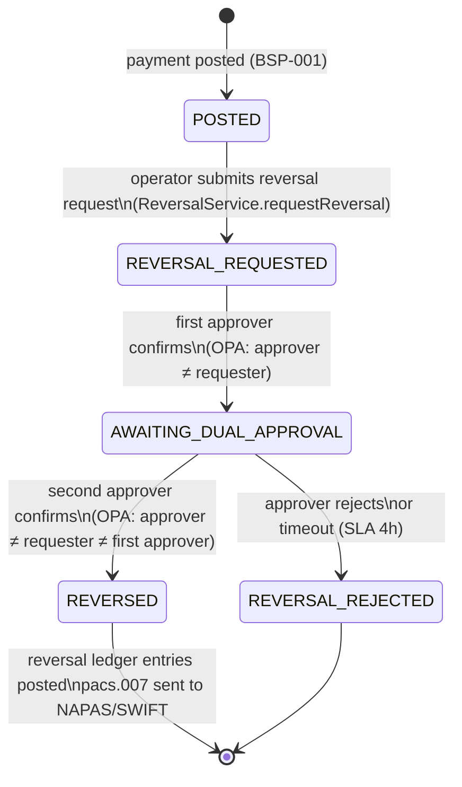

# Reversal and Chargeback

Status: Draft | Last Reviewed: 2026-05-16 | Owner: @payments-domain-owner
Catalog ID: BSP-005 | Radii
Tier Applicability: T0

## Problem Statement

- **Ledger mutation risk**: a direct `UPDATE journal_entries SET amount = 0` to correct an erroneous payment destroys the forensic audit trail required by BCBS 239 and SBV. Regulators and auditors must be able to reconstruct every balance change from the original ledger entries.
- **Chargeback time-limit compliance**: Visa requires chargebacks to be initiated within 120 days of the original transaction; Mastercard within 120 days. Without a structured workflow tracking the chargeback deadline, the bank loses the right to dispute fraudulent card transactions.
- **Dual-control bypass risk**: a single operator reversing a large payment without a second approval is an insider-threat vector. A coding error in the reversal path could also reverse the wrong transaction.
- **Downstream system inconsistency**: a reversal that updates the local ledger but fails to notify T24 OFS and NAPAS/SWIFT leaves external systems with the original (wrong) balance, causing reconciliation failures the next morning.
- **Customer notification gap**: an unreversed erroneous debit that sits unnoticed for more than the card scheme dispute window permanently destroys the customer's chargeback right.

## Context

Reversals and chargebacks are value corrections that preserve the append-only ledger invariant: instead of modifying an existing journal entry, the system posts a new pair of DR/CR entries with negated signs and a reference to the original transaction. Chargebacks additionally require card scheme message construction (ISO 20022 pacs.007 or Visa/Mastercard proprietary format) and a dual-approval workflow enforced by OPA ABAC. The Spring State Machine manages the lifecycle states to prevent duplicate reversals and enforce the approval requirement.

## Solution

The Reversal Service manages a state machine (`POSTED → REVERSAL_REQUESTED → AWAITING_DUAL_APPROVAL → REVERSED`) with OPA ABAC enforcing that two distinct approvers (not the original poster) must approve before the state transitions to `REVERSED`. On approval, the service posts two new ledger entries (negating DR/CR) to BSP-001 and sends an ISO 20022 pacs.007 message to the NAPAS/SWIFT gateway. The entire approval-and-reverse flow is idempotent using the original `transactionId` as the reversal key.



## Implementation Guidelines

### 1. ReversalService — state machine with OPA dual-approval gate

```java
@Service
@RequiredArgsConstructor
public class ReversalService {

    private final StateMachine<ReversalState, ReversalEvent> sm;
    private final OpaClient opaClient;
    private final LedgerService ledger;
    private final PaymentGatewayClient gateway;
    private final ReversalRepository reversalRepo;

    public ReversalRequest requestReversal(String originalTxId, String requesterId) {
        ReversalRequest req = new ReversalRequest(originalTxId, requesterId,
            ReversalState.REVERSAL_REQUESTED, Instant.now());
        reversalRepo.save(req);
        sm.sendEvent(MessageBuilder
            .withPayload(ReversalEvent.REQUEST)
            .setHeader("requestId", req.id())
            .build());
        return req;
    }

    public void approve(String requestId, String approverId) {
        ReversalRequest req = reversalRepo.findById(requestId).orElseThrow();
        OpaInput input = OpaInput.of(
            "requesterId", req.requesterId(),
            "approverId", approverId,
            "firstApproverId", req.firstApproverId()
        );
        boolean canApprove = opaClient.evaluate(
            "banking/reversals/can_approve", input, Boolean.class);
        if (!canApprove) {
            throw new UnauthorizedApprovalException(
                "Approver " + approverId + " cannot approve this reversal");
        }
        if (req.state() == ReversalState.REVERSAL_REQUESTED) {
            req = req.withFirstApprover(approverId).withState(ReversalState.AWAITING_DUAL_APPROVAL);
        } else {
            executeReversal(req, approverId);
        }
        reversalRepo.save(req);
    }

    private void executeReversal(ReversalRequest req, String secondApproverId) {
        ledger.reverse(req.originalTransactionId());
        gateway.sendPacs007(req.originalTransactionId());
        req = req.withState(ReversalState.REVERSED)
                 .withSecondApprover(secondApproverId)
                 .withReversedAt(Instant.now());
        reversalRepo.save(req);
    }
}
```

### 2. OPA Rego policy — dual-approval with segregation of duties

```rego
package banking.reversals

import future.keywords.if

default can_approve = false

can_approve if {
    # Approver must not be the same person who requested
    input.approverId != input.requesterId
    # For second approval: approver must differ from first approver too
    input.approverId != input.firstApproverId
    # Approver must have the reversal_approver role
    input.approverRole == "REVERSAL_APPROVER"
}
```

### 3. ISO 20022 pacs.007 message construction

```java
@Component
public class Pacs007Builder {

    public Pacs007 build(String originalTxId, Payment originalPayment) {
        return Pacs007.builder()
            .messageId(UUID.randomUUID().toString())
            .creationDateTime(OffsetDateTime.now())
            .numberOfTransactions(1)
            .paymentReturnReason(PaymentReturnReasonCode.AM09)
            .originalEndToEndId(originalTxId)
            .returnAmount(originalPayment.amount())
            .currency(originalPayment.currency())
            .build();
    }
}
```

## When to Use

- Bank-initiated corrections for erroneous debits, duplicate charges, or system errors where the double-entry ledger must remain immutable and the correction must be traceable.
- Card-scheme chargebacks (Visa/Mastercard) that require ISO 20022 pacs.007 or card-scheme proprietary dispute messages with a defined time limit.
- Any reversal workflow where dual-control (four-eyes) approval is required by internal policy or SBV regulations to prevent single-operator abuse.

## When Not to Use

- Customer-initiated payment disputes handled entirely by the card scheme — in this case, the chargeback is initiated by the card scheme, not by Techcombank's internal workflow; use a separate dispute management process (REF-012).
- Small-amount operational corrections below a bank-defined threshold (e.g., < VND 1,000) where automated reversal without dual-approval is acceptable per internal risk policy — configure the OPA policy threshold accordingly.
- Reversals of internal ledger adjustments that do not involve external payment networks — if the original transaction never left the bank, skip the pacs.007 step.

## Variants

| Variant | When to prefer | Trade-off |
|---------|----------------|-----------|
| State machine + OPA dual-approval (this pattern) | Full audit trail; regulatory dual-control; external network notification | Higher complexity; requires OPA and state machine infrastructure |
| Simple void (within same business day, before T24 EOD) | Same-day discovery; T24 supports void before EOD cut-off; no external message required | Only works within the T24 processing window; unavailable after EOD |
| Card-scheme chargeback flow (Visa/Mastercard dispute API) | Fraud-originated chargebacks where the card scheme mediates the dispute | External timeline dependency (120-day window); card scheme fees apply; network message format differs from ISO 20022 |

## NFR Acceptance Criteria

| Metric | Threshold | Measurement |
|--------|-----------|-------------|
| Reversal request to first approval p99 | ≤ 4 h (SLA for operations team response) | Measure `REVERSAL_REQUESTED → AWAITING_DUAL_APPROVAL` duration; alert if > 3 h |
| Full reversal completion p99 | ≤ 8 h (from request to REVERSED state) | Measure `REVERSAL_REQUESTED → REVERSED` duration; alert if > 6 h |
| Chargeback initiation | Within 90 days of original transaction (buffer before 120-day scheme limit) | Automated alert at 90-day mark for any POSTED transaction with an open dispute flag |
| Ledger integrity post-reversal | Sum of all DR/CR for (original + reversal) = 0 | Run `assert_transaction_sum_zero(originalTxId)` after each reversal; assert passes |
| Availability | 99.9% (T1 — reversals are not on the real-time payment path) | Reversal service pod health check; HPA for batch reversal processing |

## Compliance Mapping

| Ring | Regulation | Provision | How this pattern satisfies |
|------|-----------|-----------|---------------------------|
| Ring 0 | OWASP ASVS V1 | §1.2.4 — Separation of duties: no single person can both initiate and approve a high-risk action | OPA Rego policy enforces `approverId != requesterId` and `approverId != firstApproverId`; two distinct individuals with `REVERSAL_APPROVER` role are required. |
| Ring 1 | ISO 20022 | pacs.007 — Payment Return message schema | `Pacs007Builder` constructs a schema-valid pacs.007 with `OriginalEndToEndId`, `ReturnReasonCode`, and `ReturnAmount`; validated against XSD before dispatch to NAPAS/SWIFT. |
| Ring 2 | SBV Circular 09/2020 | §IV.3 — Error correction procedures for electronic payment transactions; dual-authorization required ⚠️ (working summary — pending Legal review) | Spring State Machine enforces `AWAITING_DUAL_APPROVAL` state before ledger reversal; OPA policy prevents self-approval; full audit trail in `reversal_requests` table; Legal review required to confirm dual-authorization satisfies SBV §IV.3. |

## Cost / FinOps

- State machine: in-memory per reversal request; no persistent state machine store needed (state is stored in the `reversal_requests` table). Negligible compute overhead.
- Additional ledger entries per reversal: 2 rows in `journal_entries`. At ~100 reversals/day, storage impact is negligible.
- pacs.007 dispatch: same NAPAS/SWIFT gateway used for original payments; no additional infrastructure cost.
- OPA ABAC evaluation: same OPA sidecar used for other ABAC decisions (SEC-010); no additional OPA pods.
- Cost of a missed chargeback window: card-scheme rule violation; bank loses the right to dispute the fraudulent charge; customer must be compensated from bank's own funds.

## Threat Model

- **Self-approval bypass (Elevation of Privilege)**: An operator submits a reversal request and then approves it themselves by calling the approval endpoint with their own credentials. Mitigation: OPA policy checks `approverId != requesterId` at the application level; the Spring Security filter ensures the authenticated user's ID is used, not a user-supplied ID.
- **Duplicate reversal (Tampering)**: The reversal endpoint is called twice with the same `originalTransactionId`, posting two pairs of negating entries (net effect: quadruple the original entry). Mitigation: `ReversalRequest` table has a unique constraint on `originalTransactionId`; the state machine is in `REVERSED` terminal state, rejecting further state transitions.

## Runbook Stub

**Alert: `reversal_sla_breach` — reversal in REVERSAL_REQUESTED state for > 3h**
- p50 baseline: 45 min | p99 SLO: 4 h
- Remediation: (1) Identify the reversal request: `SELECT id, original_tx_id, requester_id, created_at FROM reversal_requests WHERE state = 'REVERSAL_REQUESTED' AND created_at < NOW() - INTERVAL '3h'`. (2) Page the head of operations. (3) If the original approver is unavailable, escalate to the operations manager who has `REVERSAL_APPROVER` role per the BCP approver matrix.

**Alert: `chargeback_deadline_approaching` — dispute flag set and original transaction age > 90 days**
- Remediation: (1) Identify the transaction from the disputes table. (2) Initiate the card-scheme chargeback flow immediately — do not wait for a second business day. (3) Document the initiation timestamp in the dispute management system (REF-012).

## Test Strategy Stub

### Unit Tests
- `ReversalServiceTest`: mock OPA returning `can_approve = true`; assert state transitions `REVERSAL_REQUESTED → AWAITING_DUAL_APPROVAL → REVERSED`. Mock OPA returning `can_approve = false`; assert `UnauthorizedApprovalException`.
- `OpaRegoTest`: assert self-approval blocked; assert same-approver-as-first-approver blocked; assert valid dual approvers pass.
- `Pacs007BuilderTest`: assert generated pacs.007 passes XSD validation; assert `OriginalEndToEndId` matches input.

### Integration Tests
- Spring Boot Test + Testcontainers (PostgreSQL + OPA): full reversal workflow — post original payment; request reversal; first approval; second approval; assert ledger has 4 entries (DR+CR original + DR+CR reversal); assert sum-zero for the original `transactionId`.
- Duplicate reversal: attempt to request a second reversal for the same `originalTransactionId`; assert unique constraint violation.

### Chaos Tests
- Kill ReversalService between first and second approval; restart; assert state machine resumes from `AWAITING_DUAL_APPROVAL` (state stored in DB); assert second approval succeeds.

## Related Patterns

- [BSP-001 Double-Entry Ledger](double-entry-ledger.md) — the append-only ledger that receives the negating DR/CR entries
- [BSP-002 Idempotent Payment Key](idempotent-payment-key.md) — the original `transactionId` used as the reversal idempotency key
- [SEC-010 Attribute-Based Access Control](../../patterns/security/attribute-based-access-control.md) — OPA ABAC provides the dual-approval policy enforcement
- [REF-012 Dispute Management](../../reference-architectures/dispute-management.md) — the full dispute lifecycle for card-scheme chargebacks

## References

- ISO 20022 pacs.007 — Payment Return message specification
- Visa Core Rules — Dispute and Chargeback Processing (120-day rule)
- Mastercard Transaction Processing Rules — §33 Chargeback
- Spring State Machine Reference — [docs.spring.io/spring-statemachine](https://docs.spring.io/spring-statemachine/docs/current/reference/)
- SBV Circular 09/2020/TT-NHNN — §IV.3 Error correction for electronic payments (unofficial translation)
- `knowledge-base/_research-notes.md` — reversal frequency data and SLA benchmarks

---

**Key Takeaway**: Correct erroneous payments by posting new negating ledger entries — never modifying existing ones — with a mandatory two-person approval workflow enforced by OPA policy and a state machine that prevents duplicate reversals and tracks chargeback deadlines.
