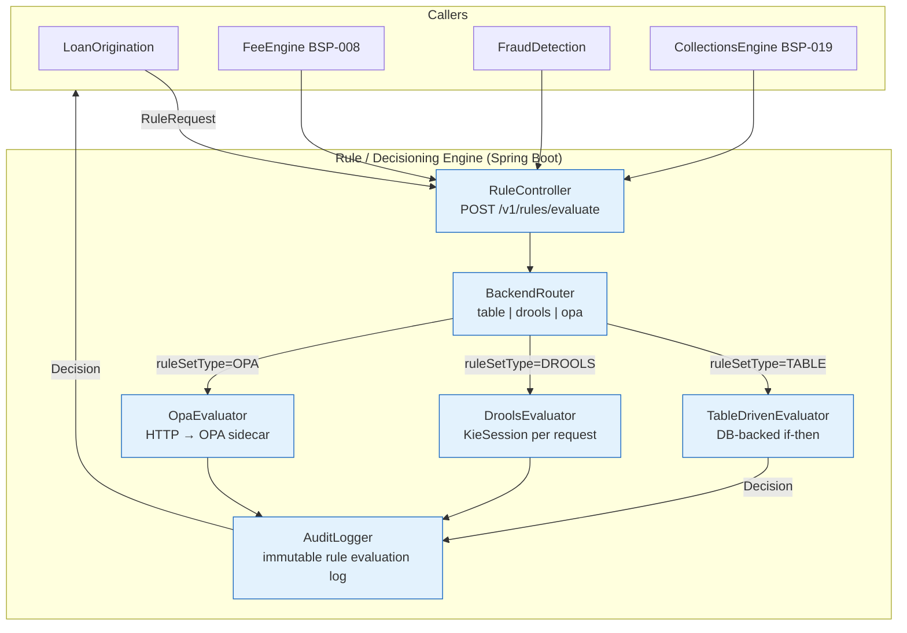

# Rule / Decisioning Engine

Status: Draft | Last Reviewed: 2026-05-21 | Owner: @tech-lead-backend
Catalog ID: BSP-010 | Radii
Tier Applicability: T0, T1

## Problem Statement

Eligibility rules governing personal loan approval (minimum monthly salary, maximum debt-to-income ratio, minimum credit score) are hard-coded in the loan origination service's Java classes. Every time the Finance Ministry or SBV updates the regulatory parameters, the engineering team must raise a change request, code the update, pass regression tests, and deploy — a cycle that takes 3–6 weeks while the bank may be operating under the wrong rule for that entire period.

AML transaction monitoring rules are buried inside the payment gateway's business logic, invisible to the Compliance team. When regulators ask "show me the rule that flagged this transaction," Compliance must ask Engineering to read code, breaching the four-eyes principle for regulated decisions.

Fee waiver eligibility is implemented three different ways: a hard-coded customer-tier lookup in the mobile backend, a Drools ruleset in the corporate portal, and a manual override screen in the CRM. A customer who qualifies for a waiver in one channel may be charged in another.

Approval workflow logic is duplicated across origination, servicing, and collections systems — credit approval in origination, limit override approval in servicing, and dunning strategy selection in collections all embed similar escalation logic that must be independently maintained.

## Context

The Rule / Decisioning Engine is a shared service called by any product that needs externalised, auditable business rules. It is mandatory (T0) for AML screening decisions and loan eligibility checks where regulatory traceability is required. T1 products use it for fee waiver evaluation, limit override approvals, and collections dunning strategy. The engine provides three pluggable backends — table-driven (simple if-then rules stored in DB, suitable for 90% of use cases), Drools 9.x (stateful complex rules with chaining and salience), and OPA/Rego (policy-as-code for compliance rules managed by the Compliance team as Git-controlled `.rego` files). The backend is selected per rule set at registration time, not per request.

## Solution

A shared RuleEngine service exposes a single `POST /v1/rules/evaluate` endpoint. Callers submit a `RuleRequest` containing a `ruleSetId` (identifies the registered rule set and its backend), a `ruleSetType` (TABLE, DROOLS, or OPA), and a `facts` map (customer attributes, transaction data, product features). The engine routes to the appropriate backend evaluator, logs the decision with all fired rules to an immutable audit topic, and returns a `Decision` (APPROVE / DECLINE / REFER + explanation + ruleSetVersion).



## Implementation Guidelines

**1. RuleRequest / Decision API contract**

```java
public record RuleRequest(
    String ruleSetId,          // e.g. "LOAN_ELIGIBILITY_VN", "FEE_WAIVER", "AML_SCREENING"
    String ruleSetType,        // "TABLE" | "DROOLS" | "OPA"
    Map<String, Object> facts  // customer, transaction, product attributes as key-value map
) {}

public record Decision(
    String outcome,            // "APPROVE" | "DECLINE" | "REFER"
    String reason,             // human-readable explanation for audit and customer notification
    List<String> firedRules,   // audit — which rules fired (rule IDs, not code references)
    String ruleSetVersion,     // version of the rule set evaluated — for audit trail
    Instant evaluatedAt
) {}

@RestController
@RequestMapping("/v1/rules")
@RequiredArgsConstructor
public class RuleController {

    private final BackendRouter router;
    private final AuditLogger auditLogger;

    @PostMapping("/evaluate")
    public Decision evaluate(@RequestBody RuleRequest request) {
        Decision decision = router.route(request);
        auditLogger.log(request, decision);
        return decision;
    }
}
```

**2. DroolsEvaluator — stateless per-request KieSession**

```java
@Component
public class DroolsEvaluator {

    private final KieContainer kieContainer;

    public Decision evaluate(RuleRequest request) {
        KieSession session = kieContainer.newKieSession(request.ruleSetId());
        try {
            DecisionHolder holder = new DecisionHolder();
            request.facts().forEach(session::setGlobal);
            session.insert(holder);
            session.fireAllRules();
            return holder.toDecision(request.ruleSetId());
        } finally {
            session.dispose();  // always dispose — no session reuse to prevent state leakage
        }
    }
}
```

Drools rulesets are version-controlled in Git as `.drl` files and deployed to a Nexus artifact repository. The `KieContainer` is rebuilt on deployment; callers never supply rule definitions — only facts.

**3. OPA evaluator — policy-as-code for compliance rules**

```java
@Component
@RequiredArgsConstructor
public class OpaEvaluator {

    private final WebClient opaClient;  // OPA sidecar at localhost:8181

    public Decision evaluate(RuleRequest request) {
        OpaInput input = new OpaInput(request.facts());
        OpaResult result = opaClient.post()
            .uri("/v1/data/" + request.ruleSetId().toLowerCase().replace('_', '/'))
            .bodyValue(Map.of("input", input))
            .retrieve()
            .bodyToMono(OpaResult.class)
            .block();
        return new Decision(
            result.allow() ? "APPROVE" : "DECLINE",
            result.reason(),
            result.firedRules(),
            result.version(),
            Instant.now()
        );
    }
}
```

OPA policies are stored in Git as `.rego` files, managed by the Compliance team using GitOps. The OPA sidecar exposes `/health/policies` which returns the SHA-256 hash of loaded policies — monitored to detect unauthorised policy drift.

## When to Use

- Any business decision where the rule must be externalised for regulatory auditability (AML, credit eligibility, limit override)
- When rules need to be updated by the Compliance or Risk team without a code deployment
- When the same rule logic is needed in multiple services (loan origination, servicing, collections)
- When a complete audit trail from the decision to the exact rule version that fired is required

## When Not to Use

- Simple flag checks (feature flags, configuration toggles) — use a feature flag service instead
- Pure data transformation (no true decisioning) — use a stream processor or ETL pipeline
- Ultra-low-latency paths (< 1ms requirement) — embed rule logic in-process; the network hop and KieSession overhead make the Rule Engine unsuitable for sub-millisecond decisions
- Rules that change on every transaction (e.g., real-time ML scoring) — use the ML scoring pipeline directly; the Rule Engine wraps the score threshold check, not the model

## Variants

| Variant | When to prefer | Trade-off |
|---------|----------------|-----------|
| Table-driven (DB-backed) | Simple if-then rules; non-technical stakeholders update rules via admin UI | Zero rule engine complexity; cannot handle chaining or stateful rules |
| Drools 9.x | Complex stateful rules with chaining, salience, and agenda groups; existing Drools expertise | Full rule engine power; KieSession lifecycle adds latency; DRL syntax learning curve |
| OPA/Rego | Compliance policies managed by non-engineers as Git-controlled `.rego` files; policy-as-code audit trail | Declarative and auditable; requires Rego expertise; sidecar deployment; best for compliance-by-default patterns |

## NFR Acceptance Criteria

```yaml
nfr_acceptance_criteria:
  catalog_id: BSP-010
  pattern: Rule / Decisioning Engine
  performance:
    - id: BSP-010-HP-01
      description: Table-driven evaluation must complete within 20ms p99; Drools within 100ms p99; OPA sidecar within 50ms p99.
      threshold: TABLE p99 < 20ms; DROOLS p99 < 100ms; OPA p99 < 50ms
  availability:
    - id: BSP-010-HA-01
      description: Rule Engine must be available 99.99% for T0 rule sets (AML screening, loan eligibility).
      threshold: availability ≥ 99.99% (T0 rule sets); ≥ 99.9% (T1 rule sets)
  throughput:
    - id: BSP-010-TP-01
      description: Table-driven backend must handle 5,000 evaluations per second per pod.
      threshold: ≥ 5,000 evaluations/second (TABLE backend, single pod)
  correctness:
    - id: BSP-010-COR-01
      description: Every Decision must include firedRules and ruleSetVersion for complete audit trail.
      threshold: 0 Decisions with null firedRules or null ruleSetVersion
```

## Compliance Mapping

| Ring | Regulation | Provision | How this pattern satisfies |
|------|-----------|-----------|---------------------------|
| Ring 0 | NIST SP 800-53 | SA-11 — Developer security testing | Rule sets are version-controlled in Git; integration tests assert DECLINE for known negative scenarios after every rule change |
| Ring 0 | OWASP ASVS | §12 — Business logic verification | Rule engine enforces business constraints (eligibility, limits, waivers) in a single auditable service; bypassing requires modifying rule sets in Git, not application code |
| Ring 1 | FATF Recommendation 6 | AML transaction monitoring rules must be documented and auditable | AML rule sets stored as `.rego` files in Git with full change history; every AML evaluation logs firedRules to immutable Kafka topic; regulators can replay any decision |
| Ring 1 | BCBS 239 | §6 — Adaptability of risk data | Every Decision record carries ruleSetId, ruleSetVersion, firedRules, and evaluatedAt; all decision data is queryable from the structured audit log without manual cross-reference |
| Ring 2 | SBV Circular 09/2020; Decree 13/2023 | §IV.2 — Decision audit log retained; Art. 9 — PII minimisation in rule facts | Decision audit log retained per SBV requirements; facts passed to rule engine are pre-filtered to remove PII fields not needed for the rule evaluation ⚠️ (working summary — pending Legal review) |

## Cost / FinOps Notes

- Rule Engine pods: 3 replicas (HA); stateless — each request is independent; ~$40/month compute
- Drools: KieSession created and disposed per request — no persistent state; heap tuned for short-lived objects (G1GC)
- OPA sidecar: 1 per Rule Engine pod; ~64 MB memory each; policy bundle fetched from Git on startup via bundle API
- Table-driven rule storage: < 50K rows in `rule_sets` table even at full scale; negligible PostgreSQL storage cost
- Kafka audit topic: `rule-decisions`, 12 partitions, retention 90 days for regulatory compliance; ~$20/month storage

## Threat Model Summary

**Elevation of Privilege — rule injection to bypass controls (Elevation of Privilege)**: an attacker submits a crafted `RuleRequest` with facts crafted to satisfy APPROVE conditions by exploiting rule ordering gaps or a missing NOT clause in a Drools ruleset, causing the Rule Engine to approve a loan the applicant should not receive. Mitigation: Drools rulesets are version-controlled in Git with branch protection and mandatory Compliance + Tech Lead review; rulesets are loaded from classpath or Nexus (callers never supply rule definitions — only facts); integration tests assert that every known DECLINE scenario still declines after each rule change; test suite is gated in CI.

**Tampering — OPA policy file modification (Tampering)**: an insider with Git access modifies the AML screening OPA policy to add a blanket `allow = true` exception for a customer tier, bypassing AML controls. Mitigation: OPA policies stored in Git with mandatory Compliance team code-owner approval; deployed to OPA sidecar via CI/CD only — no direct pod access; sidecar `/health/policies` endpoint exposes SHA-256 hash of loaded policy; Alert: OpaRuleHashMismatch fires when the hash differs from the expected value in the deployment manifest.

## Operational Runbook (stub)

1. Alert: RuleEvaluationTimeout — fires when p99 evaluation latency for any backend exceeds 500ms over a 5-minute window. p50 resolution: 10 min; p99: 45 min. For Drools: check for unbounded rule loops by reviewing the `.drl` file for rules without a termination condition; add `@ActivationListener("salience")` guard. For OPA: check OPA sidecar pod CPU throttling with `kubectl top pod`; restart sidecar if policy bundle is corrupted.

2. Alert: RuleAuditLag — fires when the Kafka producer lag on `rule-decisions` topic exceeds 1,000 messages. Check Rule Engine pod connectivity to Kafka brokers. If Kafka is unavailable, the Rule Engine continues evaluating (audit log is asynchronous) but the AuditLogger queues decisions in memory — if queue depth exceeds 10,000, the circuit breaker rejects new evaluations to prevent data loss.

3. Alert: OpaRuleHashMismatch — fires when the OPA sidecar reports a policy hash that does not match the expected hash in the deployment ConfigMap. Immediately escalate to the Compliance team and Tech Lead. Redeploy the OPA sidecar from the canonical CI/CD pipeline: `kubectl rollout restart deployment/rule-engine -n banking`. Do not allow evaluations to continue until the hash mismatch is resolved.

## Test Strategy (stub)

**Unit**: `DroolsEvaluatorTest` — load `LOAN_ELIGIBILITY_VN` ruleset; assert APPROVE for salary=20M VND / DTI=0.3; assert DECLINE for salary=5M VND; assert REFER for borderline DTI=0.55. `OpaEvaluatorTest` — mock OPA sidecar returning allow=true/false; assert correct Decision mapping.

**Integration**: `RuleEngineIT` (Testcontainers — PostgreSQL + Kafka; OPA sidecar in Docker) — evaluate TABLE rule set; assert Decision stored in `rule-decisions` Kafka topic with non-null firedRules; evaluate Drools rule set; assert same contract; change a table rule; assert new decision reflects updated rule within 1 second.

**Compliance**: `AmlRuleAuditIT` — evaluate AML_SCREENING rule set with suspicious transaction facts; assert Decision logged to `rule-decisions` with ruleSetVersion matching the deployed OPA policy SHA; assert no PII fields in the logged facts (fact keys allowlist checked).

**Regression**: after every rule change, the CI pipeline runs the full rule scenario matrix (`src/test/resources/rule-scenarios/*.yaml`) and fails if any previously-DECLINE scenario now returns APPROVE.

## Related Patterns

- [BSP-008 Fee Engine](fee-engine.md) — uses Rule Engine for fee waiver eligibility checks
- [SEC-010 Attribute-Based Access Control](../security/attribute-based-access-control.md) — ABAC policy evaluation can be backed by OPA rule sets; SEC-010 and BSP-010 share the OPA sidecar
- BSP-011 Credit Limit Engine — uses Rule Engine for limit override approvals (authored in Wave 9B)
- BSP-019 Collections Engine — uses Rule Engine for dunning strategy selection (authored in Wave 9D)

## References

- Drools 9.x Documentation — drools.org
- OPA Open Policy Agent — openpolicyagent.org
- FATF Recommendation 6 — Targeted Financial Sanctions — fatf-gafi.org
- NIST SP 800-53 Rev 5 — SA-11 Developer Testing
- BCBS 239 Principles for Effective Risk Data Aggregation — BCBS January 2013
- SBV Circular 09/2020/TT-NHNN — Information System Security for Credit Institutions

---
**Key Takeaway**: Externalise business rules into a pluggable Rule Engine so that eligibility, waiver, and compliance rules can be updated by the Compliance team without touching application code, and every decision is auditable to the exact rule version that fired.
