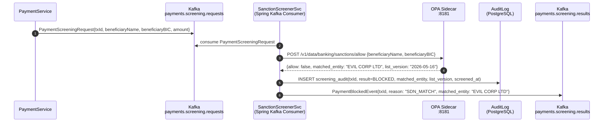

# Sanction Screening Pipeline

Status: Draft | Last Reviewed: 2026-05-16 | Owner: @risk-management-domain-owner
Catalog ID: BSP-003 | Radii
Tier Applicability: T0

## Problem Statement

- **Regulatory exposure**: executing a payment to a sanctioned entity (OFAC SDN list, UN Security Council, FATF high-risk jurisdictions, or SBV domestic AML list) constitutes a criminal violation with fines up to $1M per transaction and potential licence revocation for the bank.
- **Latency vs. safety trade-off**: naïve synchronous HTTP calls to an external screening vendor add 200–800 ms to the payment critical path, breaching the T0 latency budget; but skipping screening entirely creates unacceptable compliance risk.
- **SDN list staleness**: OFAC updates the SDN list without a fixed schedule. A screening service running with a 24-hour-old cache may miss newly designated entities, creating a compliance gap even for a correctly implemented pipeline.
- **Fuzzy name matching**: sanctioned entities appear under transliterations, aliases, and partial names. Exact-match screening misses variants (e.g., "Nguyen Van A" vs. "Van A Nguyen"); but overly aggressive fuzzy matching produces false positives that block legitimate payments and trigger SBV escalation.
- **Audit trail gaps**: SBV inspections require evidence that every payment was screened at the time of execution, with the list version used. Absent a structured audit record per payment, the bank cannot demonstrate compliance.

## Context

Sanction screening sits on the T0 payment authorization path: every outbound domestic (NAPAS), international (SWIFT), and interbank transfer must be screened before funds move. The screening must complete within the T0 latency budget (≤200 ms for the full payment authorization flow). The OPA-based local evaluation model achieves ≤5 ms screening latency by eliminating the external HTTP hop on the critical path. SDN list freshness is maintained by a Spring Batch nightly refresh job that re-loads the list into OPA's bundle server.

## Solution

Payment events are published to Kafka topic `payments.screening.requests`. A Spring Kafka consumer loads each event through an OPA policy (`banking/sanctions/allow`) that evaluates counterparty names against an in-memory SDN list loaded from the OPA bundle. Matches block the payment and publish a `PaymentBlockedEvent`; clears publish `PaymentClearedEvent`. Each screening decision is persisted to an audit log with the SDN list version. A Spring Batch job refreshes the OPA bundle nightly from an OFAC HTTPS endpoint and SBV's domestic list.



## Implementation Guidelines

### 1. SanctionScreenerService — Kafka consumer with OPA evaluation

```java
@Service
@RequiredArgsConstructor
public class SanctionScreenerService {

    private final OpaClient opaClient;
    private final ScreeningAuditRepository auditRepo;
    private final KafkaTemplate<String, Object> kafka;

    @KafkaListener(topics = "payments.screening.requests", groupId = "sanction-screener")
    public void screen(PaymentScreeningRequest request) {
        OpaInput input = OpaInput.of(
            "beneficiaryName", request.beneficiaryName(),
            "beneficiaryBIC", request.beneficiaryBIC()
        );
        SanctionDecision decision = opaClient.evaluate("banking/sanctions/allow", input,
            SanctionDecision.class);

        auditRepo.save(new ScreeningAudit(
            request.transactionId(), decision.allow() ? "CLEARED" : "BLOCKED",
            decision.matchedEntity(), decision.listVersion(), Instant.now()
        ));

        if (decision.allow()) {
            kafka.send("payments.screening.results",
                new PaymentClearedEvent(request.transactionId()));
        } else {
            kafka.send("payments.screening.results",
                new PaymentBlockedEvent(request.transactionId(), "SDN_MATCH", decision.matchedEntity()));
        }
    }
}
```

### 2. OPA Rego policy — fuzzy name matching with Jaro-Winkler threshold

```rego
package banking.sanctions

import future.keywords.if
import future.keywords.in

default allow = true

allow = false if {
    some entry in data.sdn_list.entries
    jaro_winkler_similarity(lower(input.beneficiaryName), lower(entry.name)) >= 0.92
}

allow = false if {
    input.beneficiaryBIC in data.sdn_list.blocked_bics
}
```

### 3. Spring Batch SDN refresh job — nightly OFAC + SBV list update

```java
@Configuration
@RequiredArgsConstructor
public class SdnRefreshJobConfig {

    @Bean
    public Job sdnRefreshJob(JobBuilderFactory jobs, Step downloadStep, Step uploadBundleStep) {
        return jobs.get("sdnRefreshJob")
            .incrementer(new RunIdIncrementer())
            .flow(downloadStep).next(uploadBundleStep).end().build();
    }

    @Bean
    @StepScope
    public Tasklet downloadSdnTasklet(
            @Value("${sdn.ofac-url}") String ofacUrl,
            @Value("${sdn.sbv-url}") String sbvUrl) {
        return (contribution, context) -> {
            List<SdnEntry> entries = new SdnDownloader().download(ofacUrl, sbvUrl);
            context.getJobExecutionContext().put("sdn_entries", entries);
            log.info("event=sdn_download count={}", entries.size());
            return RepeatStatus.FINISHED;
        };
    }
}
```

### 4. Audit schema

```sql
CREATE TABLE screening_audit (
    id              UUID        PRIMARY KEY DEFAULT gen_random_uuid(),
    transaction_id  TEXT        NOT NULL,
    result          TEXT        NOT NULL CHECK (result IN ('CLEARED','BLOCKED')),
    matched_entity  TEXT,
    list_version    DATE        NOT NULL,
    screened_at     TIMESTAMPTZ NOT NULL DEFAULT NOW()
);
CREATE INDEX idx_screening_audit_tx ON screening_audit(transaction_id);
CREATE INDEX idx_screening_audit_ts ON screening_audit(screened_at);
```

## When to Use

- All outbound payment flows (NAPAS domestic transfer, SWIFT international wire, interbank settlement) where the beneficiary is an external party whose sanction status must be verified before funds move.
- Any onboarding flow that establishes a relationship with an external counterparty — screen at relationship creation, not just at transaction time.
- Batch payment files (bulk salary payments, vendor disbursements) — screen each beneficiary before file submission to NAPAS; reject the file if any row matches.

## When Not to Use

- Internal fund transfers between two Techcombank accounts owned by the same KYC-verified customer — internal accounts have already been screened at onboarding; re-screening on every transfer is redundant overhead.
- Intra-group treasury movements between Techcombank legal entities — use an internal allowlist; sanction screening against the global SDN list for known internal accounts is wasteful.
- Real-time balance enquiries and account statement requests — screening applies to value movements, not read operations.

## Variants

| Variant | When to prefer | Trade-off |
|---------|----------------|-----------|
| Local OPA evaluation (this pattern) | T0 critical path; ≤5 ms latency budget; offline resilience needed | SDN list freshness depends on nightly refresh; very new designations may be missed for up to 24 hours |
| Synchronous external API (vendor) | Highest list accuracy; real-time list updates | Adds 200–800 ms to critical path; vendor SLA becomes a T0 dependency; circuit breaker required |
| Async pre-clearance cache | Pre-screen known payees daily; cached result served in <1 ms for repeat transactions | Only works for repeat payees; first-time payee still requires a sync check; cache invalidation on new SDN entries |

## NFR Acceptance Criteria

| Metric | Threshold | Measurement |
|--------|-----------|-------------|
| Screening decision p99 latency | ≤ 5 ms (OPA sidecar local evaluation) | Load test 1 000 rps; assert OPA `POST /v1/data` p99 ≤ 5 ms |
| End-to-end screening p99 (Kafka round-trip) | ≤ 500 ms | Measure from `PaymentScreeningRequest` publish to `PaymentClearedEvent` consume |
| SDN list freshness | ≤ 24 h (nightly refresh) | Monitor `sdn_list_last_updated` metric; alert if > 25 h |
| Audit record completeness | 100% — every payment has a screening_audit row | Reconcile `payments` table against `screening_audit` daily; assert 0 gaps |
| False positive rate | ≤ 0.01% of total volume | Weekly review of BLOCKED events; assert < 0.01% are legitimate payments |

## Compliance Mapping

| Ring | Regulation | Provision | How this pattern satisfies |
|------|-----------|-----------|---------------------------|
| Ring 0 | FATF Recommendation 6 | Targeted financial sanctions — financial institutions must implement real-time screening | OPA policy screens every payment against FATF-designated entities; `PaymentBlockedEvent` prevents funds movement; `screening_audit` provides evidence for FATF inspection. |
| Ring 1 | SWIFT CSP v2024 | Control 2.9 — Transaction screening; must screen against SDN and local sanction lists | OPA bundle includes both OFAC SDN and SBV domestic AML lists; `list_version` field in audit log proves which list version was active at screening time; nightly refresh maintains SWIFT CSP compliance. |
| Ring 2 | SBV Circular 09/2020 | §III.5 — AML/CFT controls; screening of counterparties against domestic sanction lists ⚠️ (working summary — pending Legal review) | OPA bundle includes SBV's domestic AML watchlist (sourced from SBV's published list); blocked payments are logged to `screening_audit` with `list_version = 'SBV-YYYY-MM-DD'`; Legal review required to confirm SBV list sourcing and reporting obligations are met. |

## Cost / FinOps

- OPA sidecar: 64 MiB memory, 0.1 vCPU at idle; SDN list in OPA data cache: ~20 MB (OFAC full list compressed). Negligible per pod.
- Kafka topic `payments.screening.requests`: at 100 payments/s, throughput is ~50 KB/s. Retain 24h; no long-term storage cost.
- Spring Batch SDN refresh: runs once per night, downloads ~2 MB from OFAC HTTPS endpoint; negligible cost.
- `screening_audit` table: ~300 bytes per row; at 10M payments/month = 3 GB/year. Date-partition and archive to S3 after 7 years.
- Cost of a missed sanction screening: OFAC civil penalty up to $1M per transaction; potential licence revocation; reputational damage. The screening infrastructure cost is immaterial by comparison.

## Threat Model

- **SDN list poisoning (Tampering)**: An attacker with access to the OPA bundle server substitutes a modified SDN list that removes a sanctioned entity, allowing payments to blocked counterparties. Mitigation: OPA bundle is signed with a Vault-managed HMAC key; OPA verifies the bundle signature before loading; bundle server access is restricted to the SDN refresh service account via Vault AppRole.
- **Screening bypass via encoding (Tampering)**: Attacker submits beneficiary name in an unusual Unicode normalization (e.g., Cyrillic homoglyphs for Latin characters) to evade the Jaro-Winkler matcher. Mitigation: `SanctionScreenerService` normalizes all input names to NFC Unicode and strips diacritics before OPA evaluation; the OPA policy operates on the normalized form.

## Runbook Stub

**Alert: `sdn_list_age_hours > 25`**
- p50 baseline: < 12 h | p99 SLO: ≤ 24 h
- Remediation: (1) Check the Spring Batch job log: `kubectl logs -l app=sdn-refresh-job`. (2) If OFAC endpoint is unreachable, use the last known good list (OPA keeps the previous bundle) — log an incident and retry manually. (3) If SBV endpoint changed, update `sdn.sbv-url` in the config map. (4) Notify the CISO that the list is stale beyond SLA.

**Alert: `screening_audit_gap > 0`** (payment with no audit row)
- p50 baseline: 0 | p99 SLO: 0
- Remediation: CRITICAL — (1) Identify the transaction IDs with missing audit rows from the daily reconciliation query. (2) Check Screener pod logs for the corresponding `transactionId` — if the Screener crashed after OPA evaluation but before the INSERT, re-screen manually. (3) If OPA was unavailable, determine if the payment should be reversed pending re-screening.

## Test Strategy Stub

### Unit Tests
- `SanctionScreenerServiceTest`: mock OPA returning `{allow: false, matchedEntity: "EVIL CORP"}`; assert `PaymentBlockedEvent` published; assert `screening_audit` INSERT called with `result=BLOCKED`. Mock OPA returning `{allow: true}`; assert `PaymentClearedEvent` published.
- `OpaRegoTest`: use OPA Go test runner on the Rego policy; assert `EVIL CORP LTD` matches with Jaro-Winkler ≥ 0.92; assert `TECHCOMBANK INTERNAL` does not match any SDN entry.

### Integration Tests
- Spring Boot Test + Testcontainers (Kafka + OPA + PostgreSQL): submit `PaymentScreeningRequest` for a name in the test SDN list; consume from `payments.screening.results`; assert `PaymentBlockedEvent`; assert `screening_audit` row exists with correct `list_version`.
- SDN refresh job IT: run `sdnRefreshJob` with a mock OFAC endpoint; assert OPA bundle is updated; assert new SDN entry is present in OPA data.

### Chaos Tests
- Kill OPA sidecar mid-screening: submit `PaymentScreeningRequest`; assert Screener retries with Resilience4j retry policy; assert eventual `PaymentBlockedEvent` (fail-closed: if OPA is unavailable, block the payment).

## Related Patterns

- [BSP-001 Double-Entry Ledger](double-entry-ledger.md) — the ledger that receives posting only after a CLEARED screening result
- [SEC-010 Attribute-Based Access Control](../../patterns/security/attribute-based-access-control.md) — OPA is also used for ABAC; the Rego policy structure is analogous
- [INT-001 Saga Orchestration](../integration/saga-orchestration.md) — sanction screening is one step in the payment authorization saga

## References

- [OFAC SDN List](https://ofac.treasury.gov/specially-designated-nationals-and-blocked-persons-list-sdn-human-readable-lists)
- [FATF Recommendation 6 — Targeted Financial Sanctions](https://www.fatf-gafi.org/en/recommendations/r6.html)
- [OPA Policy Language (Rego)](https://www.openpolicyagent.org/docs/latest/policy-language/)
- [SWIFT CSP v2024 Control 2.9 — Transaction Screening](https://www.swift.com/myswift/customer-security-programme-csp)
- SBV Circular 09/2020/TT-NHNN — AML/CFT requirements for credit institutions (unofficial translation)
- `knowledge-base/compliance/swift-csp-2024.md` — COMP-008
- `knowledge-base/_research-notes.md`

---

**Key Takeaway**: Run every outbound payment through a local OPA sanction screening evaluation (≤5 ms) fed by a nightly SDN bundle refresh — achieving T0 latency compliance while maintaining regulatory sanction-screening coverage with a full audit trail.
