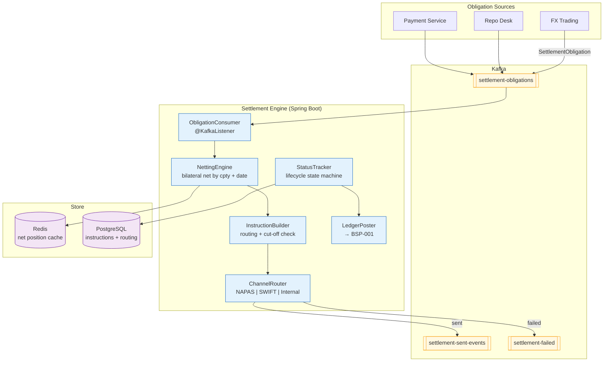

# Settlement Engine

Status: Draft | Last Reviewed: 2026-05-21 | Owner: @treasury-domain-owner
Catalog ID: BSP-016 | Radii
Tier Applicability: T0, T1

## Problem Statement

Settlement of FX trades, repo transactions, and interbank payments is orchestrated by four independent processes: the FX trading system sends MT202 SWIFT messages manually, repo settlement runs a nightly batch in the core banking adapter, interbank transfers use a NAPAS batch file generated by a separate script, and bond coupon payments are triggered from a spreadsheet by the back-office team. There is no shared settlement ledger, no cross-system netting, and no common failure-handling workflow.

Settlement failures are discovered by counterparty notice, not by internal monitoring. When NAPAS rejects a transfer, the rejection arrives as a flat file the next morning. The treasury operations team then manually traces the rejected item through the FX system, the core banking ledger, and the SWIFT messaging system — a process that takes 2–4 hours per failure and typically misses the same-day settlement cut-off, creating a T+1 overhang that inflates counterparty credit exposure overnight.

Netting opportunities are missed because each system settles gross. Two matched FX trades with the same counterparty on the same value date — a USD 5M purchase and a USD 4M sale — generate two separate payment instructions and two SWIFT messages, when a single net USD 1M settlement would reduce settlement risk and transaction fees.

Settlement instructions contain hard-coded correspondent bank BIC codes that were last updated three years ago. When a correspondent changes its BIC or ceases a currency relationship, the settlement fails silently and the payment reaches a wrong nostro account.

## Context

The Settlement Engine is the single orchestration point for all interbank and market settlement instructions. It receives settlement obligations from trading and payment systems, performs bilateral netting where eligible, constructs normalised settlement instructions, routes them to the appropriate settlement channel (NAPAS, SWIFT, internal book transfer), tracks settlement status through lifecycle events, and posts confirmed settlement entries to the Double-Entry Ledger (BSP-001). It is mandatory for T0 FX and interbank payments and T1 repo and fixed-income settlement. Correspondent bank routing tables and cut-off times are maintained in PostgreSQL with effective-date versioning.

## Solution

An event-driven SettlementEngine consumes `SettlementObligation` events from trading and payment systems, groups obligations by counterparty and value date for netting, constructs `SettlementInstruction` records, routes each instruction to the appropriate channel adapter (NAPAS, SWIFT MT202, internal), tracks instruction status transitions (PENDING → SENT → CONFIRMED/FAILED), and posts settlement entries to BSP-001 on confirmation. A `NettingEngine` computes bilateral net positions before instruction construction. Failed instructions are routed to a `settlement-failed` Kafka topic for manual review. Correspondent bank routing is served from a Caffeine cache refreshed every 5 minutes.



## Implementation Guidelines

**1. SettlementObligation and NettingEngine**

```java
public record SettlementObligation(
    String obligationId,        // UUID — idempotency key
    String counterpartyBic,     // SWIFT BIC of counterparty
    String currency,            // ISO 4217
    BigDecimal amount,          // positive = we pay; negative = we receive
    LocalDate valueDate,
    String instrument,          // "FX_SPOT" | "REPO" | "BOND_COUPON" | "PAYMENT"
    String sourceTradeId        // tradeId from originating system
) {}

@Service
@RequiredArgsConstructor
public class NettingEngine {

    private final StringRedisTemplate redis;

    public void accumulate(SettlementObligation ob) {
        // Net key: counterpartyBic + currency + valueDate
        String key = "settle:net:" + ob.counterpartyBic() + ":" + ob.currency()
            + ":" + ob.valueDate();
        long minor = ob.amount().movePointRight(2).longValueExact();
        redis.opsForValue().increment(key, minor);
        // TTL = 2 trading days; net position expires after value date + 1 day
        redis.expire(key, Duration.ofDays(2));
    }

    public BigDecimal getNetPosition(String counterpartyBic, String currency, LocalDate valueDate) {
        String key = "settle:net:" + counterpartyBic + ":" + currency + ":" + valueDate;
        String val = redis.opsForValue().get(key);
        return val == null ? BigDecimal.ZERO : new BigDecimal(val).movePointLeft(2);
    }
}
```

**2. ChannelRouter — NAPAS, SWIFT, and internal routing**

```java
@Service
@RequiredArgsConstructor
public class ChannelRouter {

    private final CorrespondentRoutingTable routingTable; // Caffeine cache → PostgreSQL
    private final NapasAdapter napasAdapter;
    private final SwiftAdapter swiftAdapter;
    private final InternalTransferAdapter internalAdapter;

    public RoutingResult route(SettlementInstruction instruction) {
        CorrespondentRoute route = routingTable.findRoute(
            instruction.counterpartyBic(), instruction.currency(), instruction.valueDate());

        if (route == null) {
            throw new NoRoutingException("No correspondent route for "
                + instruction.counterpartyBic() + " " + instruction.currency());
        }

        return switch (route.channel()) {
            case NAPAS    -> napasAdapter.submit(instruction);
            case SWIFT    -> swiftAdapter.submitMT202(instruction);
            case INTERNAL -> internalAdapter.transfer(instruction);
        };
    }
}
```

**3. Settlement instruction schema**

```sql
CREATE TABLE settlement_instructions (
    instruction_id   UUID PRIMARY KEY DEFAULT gen_random_uuid(),
    obligation_id    UUID NOT NULL,             -- source SettlementObligation
    counterparty_bic VARCHAR(11) NOT NULL,
    currency         CHAR(3) NOT NULL,
    net_amount       NUMERIC(20,2) NOT NULL,    -- signed; negative = receive
    value_date       DATE NOT NULL,
    channel          VARCHAR(20) NOT NULL,      -- NAPAS | SWIFT | INTERNAL
    status           VARCHAR(20) NOT NULL DEFAULT 'PENDING',
    channel_ref      VARCHAR(100),              -- NAPAS txn ID or SWIFT UETR
    submitted_at     TIMESTAMPTZ,
    confirmed_at     TIMESTAMPTZ,
    failed_at        TIMESTAMPTZ,
    failure_reason   TEXT,
    created_at       TIMESTAMPTZ NOT NULL DEFAULT now()
);

CREATE INDEX idx_settle_pending ON settlement_instructions (status, value_date)
    WHERE status = 'PENDING';

CREATE TABLE correspondent_routes (
    id               UUID PRIMARY KEY DEFAULT gen_random_uuid(),
    counterparty_bic VARCHAR(11) NOT NULL,
    currency         CHAR(3) NOT NULL,
    channel          VARCHAR(20) NOT NULL,
    nostro_account   VARCHAR(34),              -- our account at correspondent
    effective_from   DATE NOT NULL,
    effective_to     DATE,
    cut_off_time     TIME NOT NULL,            -- local cut-off for this channel
    UNIQUE (counterparty_bic, currency, effective_from)
);
```

## When to Use

- Any interbank or market settlement obligation that must be netted, routed, and tracked through a defined settlement lifecycle
- When bilateral netting across FX, repo, and coupon obligations with the same counterparty and value date is required to reduce settlement risk
- When settlement channel routing (NAPAS vs SWIFT vs internal) must be driven by centralised correspondent routing tables, not hard-coded service logic
- When confirmed settlement must trigger an idempotent ledger posting to BSP-001

## When Not to Use

- Customer retail payments (NAPAS direct credit) — use the retail payment service which handles customer authentication and payment authorisation; BSP-016 handles interbank settlement only
- Real-time gross settlement (RTGS) for large-value single payments above SBV thresholds — the RTGS adapter connects directly to SBV VietinBank RTGS; BSP-016 does not sit in that path
- Securities settlement via VSD (Vietnam Securities Depository) — VSD uses a DvP model with its own settlement finality rules; BSP-016 handles the cash leg only

## Variants

| Variant | When to prefer | Trade-off |
|---------|----------------|-----------|
| Bilateral netting + event-driven (this pattern) | Multi-counterparty FX and repo books with daily value-date netting | Netting requires accumulation window; not suitable for RTGS same-second finality |
| Gross settlement (no netting) | Regulatory requirement for gross reporting; single large-value payment | Simpler; higher settlement risk; more SWIFT messages and higher fees |
| CLS (Continuous Linked Settlement) | Banks with CLS membership for FX PVP settlement | Eliminates FX principal risk; only for major currency pairs; CLS membership fee |

## NFR Acceptance Criteria

```yaml
nfr_acceptance_criteria:
  catalog_id: BSP-016
  pattern: Settlement Engine
  performance:
    - id: BSP-016-HP-01
      description: Obligation receipt to settlement instruction construction and channel dispatch must complete within 100ms p99.
      threshold: p99 < 100ms
    - id: BSP-016-HP-02
      description: Netting accumulation including Redis increment must complete within 10ms p99.
      threshold: p99 < 10ms
  availability:
    - id: BSP-016-HA-01
      description: Settlement Engine must be available 99.99% during settlement hours (07:00–16:30 VND time) for T0 interbank payments.
      threshold: availability ≥ 99.99% during settlement hours
  correctness:
    - id: BSP-016-COR-01
      description: Duplicate obligation delivery must produce exactly one settlement instruction; idempotency key prevents double-settlement.
      threshold: 0 duplicate settlement instructions per day (verified by EOD reconciliation)
    - id: BSP-016-COR-02
      description: Settlement confirmation must trigger ledger posting to BSP-001 within 30 seconds of confirmation receipt.
      threshold: confirmation-to-ledger latency p99 < 30s
```

## Compliance Mapping

| Ring | Regulation | Provision | How this pattern satisfies |
|------|-----------|-----------|---------------------------|
| Ring 0 | PCI-DSS 4.0 | §10.7 — Transaction monitoring and audit trail | Every settlement instruction records obligationId, channel, counterpartyBic, amount, and status transitions with timestamps; channel reference (SWIFT UETR or NAPAS txn ID) stored for external reconciliation |
| Ring 0 | CPMI-IOSCO PFMI | Principle 8 — Settlement finality | Settlement instructions transition to CONFIRMED status only on receipt of positive settlement finality confirmation from the channel; PENDING and SENT states are distinguished; failed instructions are never silently dropped |
| Ring 1 | BCBS 239 | §5 Timeliness; §6 Adaptability | Settlement obligation and instruction events retained in Kafka 30 days; full settlement lifecycle queryable by obligationId for intraday risk reporting |
| Ring 2 | SBV Circular 09/2020; NAPAS Operating Rules | §IV.2 — Interbank payment data logging; NAPAS settlement finality | All NAPAS-routed instructions include the NAPAS transaction reference; rejections are captured in `settlement-failed` topic with NAPAS reason code; SBV-required same-day settlement reporting generated from confirmed instructions ⚠️ (working summary — pending Legal review) |

## Cost / FinOps Notes

- Redis for netting net positions: one key per counterpartyBic × currency × valueDate; ~500 active net keys at peak; TTL 2 days; negligible memory
- Kafka `settlement-obligations`, `settlement-sent-events`, `settlement-failed` topics: 12 partitions each; retention 30 days; ~$40/month
- PostgreSQL `settlement_instructions` and `correspondent_routes`: moderate write volume; `settlement_instructions` append-only; archived after 7 years; ~$15/month
- Settlement Engine pods: 2 replicas; ~$30/month; stateless hot path
- SWIFT MT202 fees: ~$0.10–0.25 per message (vendor-negotiated); netting reduces message count significantly — 200 gross FX trades between 5 counterparties may net to 10 instructions

## Threat Model Summary

**Settlement instruction injection (Tampering)**: an attacker with write access to the `settlement-obligations` Kafka topic injects a synthetic obligation directing a large payment to a controlled account, bypassing the originating trading system. Mitigation: the `settlement-obligations` topic is write-restricted to authenticated trading system service accounts via Kafka ACLs; each `SettlementObligation` is signed with HMAC-SHA256 using the source system's Vault-managed key; the SettlementEngine verifies the signature before processing; unsigned obligations are routed to `settlement-obligations-dlq` with an alert.

**Routing table manipulation (Tampering)**: an insider modifies the `correspondent_routes` table to redirect a VND/USD settlement through a fraudulent correspondent account, causing funds to be delivered to the wrong nostro. Mitigation: `correspondent_routes` rows are append-only enforced by a PostgreSQL trigger (no UPDATE/DELETE without audit entry and dual-approval); Debezium CDC streams all route changes to an immutable Kafka audit topic; Caffeine cache invalidation ensures the new route is active within 5 minutes of approval but all route changes are logged before taking effect.

## Operational Runbook (stub)

1. Alert: SettlementFailureSpike — fires when `settlement-failed` topic depth exceeds 10 messages in a 10-minute window. p50 resolution: 10 min; p99: 60 min. Check the `settlement-failed` topic for failure reasons: `kafka-console-consumer --topic settlement-failed --from-beginning`. Common causes: NAPAS cut-off missed (15:30 VND), SWIFT connection timeout, no correspondent route for counterpartyBic. For NAPAS cut-off failures, failed instructions must be re-submitted next business day — notify @treasury-domain-owner. For routing failures, check `correspondent_routes` for the affected BIC and create a new route if missing.

2. Alert: SettlementCutoffApproaching — fires at T−30 minutes before each channel cut-off when PENDING instructions remain for that channel. p50 resolution: 20 min (manual dispatch trigger); p99: 30 min. Trigger manual cut-off dispatch: `POST /actuator/settlement/dispatch?channel=NAPAS&valueDate=2026-05-21`. If instructions cannot be dispatched before cut-off, escalate to @treasury-domain-owner for same-day extension request.

3. Alert: NettingPositionOrphan — fires when a `settle:net:*` Redis key is > 3 days old without a corresponding CONFIRMED instruction. This indicates a netting accumulation without instruction generation. Check the `settlement_instructions` table for the obligationId. If no instruction exists, the obligation was received but instruction construction failed — re-trigger: `POST /actuator/settlement/retry-obligation?id={obligationId}`.

## Test Strategy (stub)

**Unit**: `NettingEngineTest` — accumulate BUY 5M USD and SELL 4M USD for same counterparty + value date; assert net position = +1M USD; accumulate duplicate obligationId (idempotency); assert net position unchanged. `ChannelRouterTest` — mock routing table returning NAPAS channel; assert NAPAS adapter called; mock routing table returning null; assert `NoRoutingException`.

**Integration**: `SettlementEngineIT` (Testcontainers — PostgreSQL + Redis + Kafka) — publish two FX obligations for same counterparty; assert net Redis key updated; trigger instruction construction; assert single `settlement_instructions` row with net amount; simulate NAPAS confirmation event; assert status transitions to CONFIRMED; assert `LedgerPostingRequest` sent to BSP-001 stub with correct idempotency key.

**Compliance**: `SettlementAuditTrailIT` — after instruction confirmation, assert `settlement_instructions` row has confirmed_at and channel_ref populated; assert Kafka `settlement-sent-events` record contains obligationId, channel, and SWIFT UETR or NAPAS txn ID; assert no PII beyond counterpartyBic in the event.

**Chaos**: Toxiproxy — drop NAPAS adapter connection for 30 seconds; assert settlement instructions remain in PENDING status (not silently lost); restore connection; assert pending instructions are retried and reach CONFIRMED status; assert no duplicate ledger postings.

## Related Patterns

- [BSP-001 Double-Entry Ledger](../banking-solutions/double-entry-ledger.md) — LedgerPoster posts confirmed settlement entries to BSP-001 using obligationId as idempotency key
- [BSP-014 FX Rate Engine](fx-rate-engine.md) — provides the FX rate used to calculate VND equivalent settlement amounts for cross-currency trades
- [BSP-015 Position Keeping Engine](position-keeping-engine.md) — consumes `settlement-sent-events` to update open position status for settled trades
- REF-017 Treasury Management Platform — primary orchestrator of FX and repo settlement obligations (authored in Wave 10)

Note: REF-017 is plain text as that file does not exist yet.

## References

- CPMI-IOSCO Principles for Financial Market Infrastructures (PFMI) — April 2012
- SWIFT MT202 Customer Transfer specification — SWIFT Standards
- PCI-DSS v4.0 — PCI Security Standards Council 2022
- BCBS 239 Principles for Effective Risk Data Aggregation — BCBS January 2013
- SBV Circular 09/2020/TT-NHNN — Information System Security for Credit Institutions
- NAPAS Operating Rules — National Payment Corporation of Vietnam

---
**Key Takeaway**: Route all interbank settlement obligations through a single engine that performs bilateral netting, enforces channel cut-offs via centralised routing tables, and posts confirmed settlement entries to the ledger idempotently — so settlement failures are detected in real time, netting reduces SWIFT fees and settlement risk, and every settlement has a complete audit trail from obligation to ledger entry.
