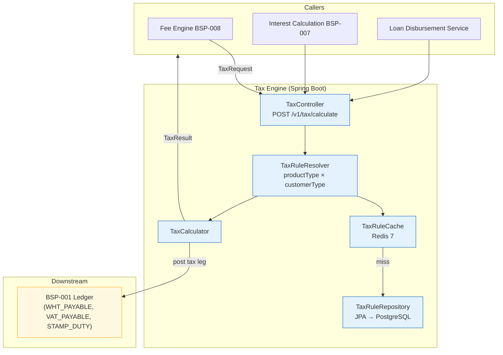

# Tax Calculation Engine

Status: Draft | Last Reviewed: 2026-05-21 | Owner: @head-of-compliance
Catalog ID: BSP-009 | Radii
Tier Applicability: T0, T1, T2

## Problem Statement

Withholding tax (WHT) rates on interest income change with each Finance Ministry circular — the 2023 update moved individual WHT from 5% to 5% with a new exemption threshold, while the 2024 draft proposes differentiated rates by deposit term. Banks that hard-code WHT rates into their interest calculation services must issue an emergency release for every regulatory change, creating a deployment window where incorrect tax is charged to customers and reported to the General Department of Taxation.

VAT on banking service fees is applied inconsistently across product lines: the retail banking team applies 10% VAT to all service fees, while the corporate banking team exempts advisory fees that are legally VATable under Circular 65/2013/TT-BTC. The inconsistency produces both under-reporting risk (corporate) and customer overcharging (retail).

Stamp duty on loan disbursements and real-estate-backed credit facilities is calculated manually by operations staff using a printed rate table, producing frequent errors on high-value transactions and generating reconciliation exceptions between the loan origination system and the ledger.

No existing system provides a complete audit trail from the source transaction to the tax posting: a regulatory examiner asking "show me all WHT deducted from individual savings interest in Q3" must manually cross-reference the interest calculation service, the GL, and the tax withholding certificate system — a process that takes a full day and remains error-prone.

## Context

The Tax Calculation Engine sits as a shared service called by the Interest Calculation Engine (BSP-007), the Fee Engine (BSP-008), and the Loan Disbursement Service whenever a taxable event occurs. It is mandatory for T0 products (savings deposits, consumer loans) where incorrect tax calculation creates regulatory reporting obligations to the General Department of Taxation. T1 products (trade finance, corporate loans) use it for stamp duty and VAT on fees. T2 services (internal tooling) may call it for informational tax estimates. Tax rules are stored as versioned, admin-managed configurations in PostgreSQL with effective dates; a Redis cache serves the hot path with a 5-minute TTL so that rule updates propagate within 5 minutes of approval without any redeployment.

## Solution

A configurable TaxEngine with tax rule tables stored in PostgreSQL. Rules are product-type × customer-type × jurisdiction-specific and version-controlled with effective dates. The engine supports Withholding Tax (WHT 5%/10% on interest by customer category), VAT (10% on qualifying service fees), and Stamp Duty (0.03% on real-estate transfers). It integrates with the Fee Engine (BSP-008) and Ledger (BSP-001) for posting; tax rules are updated without redeployment via an admin UI backed by a dual-approval workflow and Debezium-driven cache invalidation.



## Implementation Guidelines

**1. TaxRequest / TaxResult records and TaxRuleResolver**

```java
public record TaxRequest(
    String taxType,         // "WHT" | "VAT" | "STAMP_DUTY"
    String productType,     // "SAVINGS_INTEREST" | "SERVICE_FEE" | "LOAN_DISBURSEMENT"
    String customerType,    // "INDIVIDUAL" | "CORPORATE"
    String jurisdiction,    // "VN" (ISO 3166)
    BigDecimal taxableAmount,
    String currency,
    LocalDate valueDate
) {}

public record TaxResult(
    BigDecimal taxAmount,
    BigDecimal taxRate,     // e.g. 0.05 for 5% WHT
    String taxType,
    String ruleId,          // audit trail — references tax_rules.id
    String glAccount        // "WHT_PAYABLE" | "VAT_PAYABLE" | "STAMP_DUTY_PAYABLE"
) {}

@Service
@RequiredArgsConstructor
public class TaxRuleResolver {

    private final TaxRuleCache cache;
    private final TaxRuleRepository repository;

    public TaxRule resolve(String taxType, String productType,
                           String customerType, String jurisdiction, LocalDate valueDate) {
        String cacheKey = String.join(":", taxType, productType, customerType, jurisdiction,
                                      valueDate.toString());
        return cache.get(cacheKey, () ->
            repository.findEffective(taxType, productType, customerType, jurisdiction, valueDate)
                .orElseThrow(() -> new TaxRuleNotFoundException(cacheKey))
        );
    }
}
```

**2. TaxCalculator — rule-driven calculation**

```java
@Service
@RequiredArgsConstructor
public class TaxCalculator {

    private final TaxRuleResolver resolver;
    private final LedgerClient ledgerClient;

    public TaxResult calculate(TaxRequest req) {
        TaxRule rule = resolver.resolve(req.taxType(), req.productType(),
                                        req.customerType(), req.jurisdiction(), req.valueDate());
        BigDecimal taxAmount = req.taxableAmount()
            .multiply(rule.rate())
            .setScale(0, RoundingMode.HALF_UP);  // VND rounds to whole dong

        // Post tax leg to ledger idempotently — idempotency key derived from caller's correlation ID
        ledgerClient.post(LedgerPostingRequest.builder()
            .idempotencyKey("TAX:" + req.taxType() + ":" + rule.id())
            .debitAccountId(req.customerType().equals("INDIVIDUAL")
                ? "CUSTOMER_INTEREST_INCOME" : "CORPORATE_FEE_INCOME")
            .creditAccountId(rule.glAccount())
            .amount(taxAmount)
            .currency(req.currency())
            .narrative("TAX:" + req.taxType() + ":rule=" + rule.id())
            .build());

        return new TaxResult(taxAmount, rule.rate(), req.taxType(), rule.id(), rule.glAccount());
    }
}
```

**3. Tax rule schema with effective dating**

```sql
CREATE TABLE tax_rules (
    id              UUID PRIMARY KEY DEFAULT gen_random_uuid(),
    tax_type        VARCHAR(20) NOT NULL,    -- WHT | VAT | STAMP_DUTY
    product_type    VARCHAR(50) NOT NULL,
    customer_type   VARCHAR(20) NOT NULL,    -- INDIVIDUAL | CORPORATE
    jurisdiction    CHAR(2) NOT NULL DEFAULT 'VN',
    rate            NUMERIC(8,6) NOT NULL,
    gl_account      VARCHAR(50) NOT NULL,
    effective_from  DATE NOT NULL,
    effective_to    DATE,                    -- NULL = currently active rule
    source_ref      VARCHAR(200),            -- e.g. "Circular 123/2023/TT-BTC §5"
    approved_by     VARCHAR(100) NOT NULL,
    UNIQUE (tax_type, product_type, customer_type, jurisdiction, effective_from)
);

-- Partial index for fast effective-date lookups
CREATE INDEX idx_tax_rules_effective ON tax_rules (tax_type, product_type, customer_type, jurisdiction)
    WHERE effective_to IS NULL;
```

## When to Use

- Any product event that attracts WHT, VAT, or stamp duty under Vietnamese tax law
- When tax rules must be updated without a code deployment (regulatory rate change window)
- When a complete audit trail from taxable event to tax ledger posting is required for regulatory examination
- When multiple calling services (interest, fee, loan) need a consistent tax calculation across product lines

## When Not to Use

- Tax estimation for UI display only where posting is not required — call the rule resolver without posting to the ledger
- Jurisdictions outside Vietnam where a different tax engine with local rule sets is appropriate
- Simple fixed-rate products where the rate never changes and an audit trail is not required — hard-code in the calling service with a comment referencing the regulation

## Variants

| Variant | When to prefer | Trade-off |
|---------|----------------|-----------|
| Shared service (this pattern) | Multiple product lines, frequent regulatory rate changes | Separate deployment; network hop on every taxable event |
| Embedded library | Single product line, infrequent rule changes | Zero network latency; rule update requires library version bump across all consumers |
| Rule engine (Drools/OPA) | Complex conditional tax logic (e.g., exemption thresholds, cascading rules) | Higher operational complexity; overkill for rate-table lookups |

## NFR Acceptance Criteria

```yaml
nfr_acceptance_criteria:
  catalog_id: BSP-009
  pattern: Tax Calculation Engine
  performance:
    - id: BSP-009-HP-01
      description: Tax calculation including rule lookup must complete within 5ms p99 (cache hit path).
      threshold: p99 < 5ms (cache hit); p99 < 20ms (cache miss with DB lookup)
  availability:
    - id: BSP-009-HA-01
      description: Tax Engine must be available 99.99% for T0 products; rule cache TTL is 5 minutes.
      threshold: availability ≥ 99.99% (T0); cache miss fallback to DB within 20ms
  correctness:
    - id: BSP-009-COR-01
      description: Zero expired-rule calculations — every taxable event must resolve to a rule with effective_from ≤ valueDate ≤ effective_to (or NULL).
      threshold: 0 expired-rule calculations per day (verified by nightly audit job)
    - id: BSP-009-COR-02
      description: Rule updates must propagate to all Tax Engine pods within 5 minutes of admin approval.
      threshold: cache TTL ≤ 5 min; Debezium invalidation message delivered within 30 seconds
```

## Compliance Mapping

| Ring | Regulation | Provision | How this pattern satisfies |
|------|-----------|-----------|---------------------------|
| Ring 0 | OECD BEPS | Pillar Two — minimum tax transparency | TaxResult carries ruleId linking each calculation to the specific regulation and rate; supports country-by-country reporting extract |
| Ring 0 | FATF Rec. 6 | Targeted financial sanctions — WHT on suspicious transactions | WHT calculation events are correlated with BSP-003 Sanction Screening results; suspicious accounts flagged to compliance before WHT is posted |
| Ring 1 | BCBS 239 | §6 — Adaptability of risk data | Every TaxResult includes ruleId, taxType, and GL account; tax data aggregation for regulatory reporting is a query on structured TaxPostedEvent records with no manual cross-reference |
| Ring 2 | Vietnam Tax Law 38/2019; Circular 111/2013/TT-BTC; Decree 13/2023 | WHT rates on savings interest (Art. 10); personal data minimisation (Art. 9); SBV Circular 09/2020 §IV.3 — transaction logging | WHT rates stored as versioned rules with source_ref citing the specific circular; customer_type is the only stored PII — no name or NID; every tax posting written to structured audit log with correlation ID ⚠️ (working summary — pending Legal review) |

## Cost / FinOps Notes

- Tax Engine pods: 2 replicas steady-state; scales horizontally since rule resolution is stateless; ~$30/month compute
- Redis rule cache: shared with BSP-006 and BSP-007 caches; marginal incremental cost; TTL 5 min keeps memory footprint small
- PostgreSQL `tax_rules` table: < 1,000 rows even with full Vietnam regulatory coverage; no additional storage cost
- Debezium CDC for cache invalidation: shared Kafka Connect cluster; no additional cost for this pattern
- Annual cost of a missed WHT regulatory update: far exceeds infrastructure cost — primary justification for the shared-service model

## Threat Model Summary

**Tampering — tax rate manipulation (Tampering)**: an insider with DB access modifies `tax_rules.rate` to 0% for WHT on individual savings interest, causing the Tax Engine to post zero WHT to the ledger — evading the bank's withholding obligation to the General Department of Taxation. Mitigation: dual-approval workflow for all `tax_rules` inserts and updates enforced at the application layer; `effective_from` date prevents backdating to already-closed periods; Debezium CDC streams every `tax_rules` change to an immutable Kafka audit topic; nightly reconciliation compares WHT_PAYABLE ledger balance against an independently recalculated expected amount.

**Repudiation — dispute of WHT deduction by corporate customer (Repudiation)**: a corporate customer claims WHT was deducted in error and the bank cannot prove the applicable rate. Mitigation: every `TaxResult` stores `ruleId` which references the specific `tax_rules` row including `source_ref` (e.g., "Circular 123/2023/TT-BTC §5"); the WHT certificate issued at year-end is HMAC-signed and includes `ruleId` and the regulation citation; the certificate is non-repudiable evidence of the applicable rule at the time of deduction.

## Operational Runbook (stub)

1. Alert: TaxRuleVersionGap — fires when a nightly audit job finds `tax_type + product_type + customer_type + jurisdiction` combinations where all `effective_to` dates are in the past (no active rule). p50 resolution: 15 min; p99: 60 min. Tax Admin must immediately create a new `tax_rules` row with `effective_from = CURRENT_DATE` citing the applicable regulation. Until resolved, the Tax Engine returns `TaxRuleNotFoundException` for affected combinations and callers must handle it with a dead-letter queue.

2. Alert: TaxCacheInvalidationLag — fires when Debezium CDC lag on the `tax_rules` Kafka topic exceeds 2 minutes. Check Kafka Connect worker health: `kubectl get pods -n kafka-connect`. If the connector is down, restart it: `kubectl rollout restart deployment/debezium-connect -n kafka-connect`. Redis cache will serve stale rules until invalidation arrives — acceptable for up to 5 minutes per NFR BSP-009-COR-02.

3. Alert: TaxLedgerPostingFailure — fires when LedgerClient circuit breaker opens (≥ 5 consecutive failures to BSP-001). Tax calculation results are returned to the caller but the tax leg is NOT posted. The calling service (BSP-007 or BSP-008) must re-submit once the ledger recovers. Monitor `WHT_PAYABLE` balance vs. expected at end of day; any gap must be resolved before regulatory reporting runs.

## Test Strategy (stub)

**Unit**: `TaxCalculatorTest` — test WHT 5% on SAVINGS_INTEREST/INDIVIDUAL; WHT 10% on SAVINGS_INTEREST/CORPORATE; VAT 10% on SERVICE_FEE; Stamp Duty 0.03% on LOAN_DISBURSEMENT. Assert VND rounding to whole dong. `TaxRuleResolverTest` — mock cache returning empty; assert falls back to repository; assert result is cached on next call.

**Integration**: `TaxEngineIT` (Testcontainers — PostgreSQL + Redis) — insert `tax_rules` rows; call `POST /v1/tax/calculate` with each tax type; assert `TaxResult` amounts match expected rates; assert ledger posting request sent to BSP-001 stub with correct idempotency key; expire all rules; assert `TaxRuleNotFoundException` returned; insert new effective rule; assert it takes effect within cache TTL.

**Compliance**: `TaxAuditTrailIT` — after calculating WHT on savings interest, assert `TaxPostedEvent` on Kafka contains `ruleId`, `taxType`, `glAccount`, `taxAmount`, and no PII beyond `customerId`; assert `ruleId` resolves to a `tax_rules` row with a non-null `source_ref`.

**Chaos**: Toxiproxy — sever PostgreSQL connection with a warm cache; assert Tax Engine continues to serve tax calculations from Redis for up to 5 minutes; sever Redis connection; assert Tax Engine falls back to direct DB lookup within 20ms p99.

## Related Patterns

- [BSP-008 Fee Engine](fee-engine.md) — calls Tax Engine for VAT on service fees before posting to ledger
- [BSP-007 Interest Calculation Engine](interest-calculation-engine.md) — calls Tax Engine for WHT on accrued interest
- [BSP-001 Double-Entry Ledger](double-entry-ledger.md) — receives WHT_PAYABLE, VAT_PAYABLE, and STAMP_DUTY_PAYABLE postings from TaxCalculator

## References

- Vietnam Tax Law 38/2019/QH14 — Consolidated tax law
- Circular 111/2013/TT-BTC — Guidelines on personal income tax (WHT on interest)
- Decree 13/2023/ND-CP — Personal Data Protection (Vietnam)
- SBV Circular 09/2020/TT-NHNN — Information System Security for Credit Institutions
- OECD BEPS Pillar Two — Global minimum tax rules (2021)
- FATF Recommendation 6 — Targeted financial sanctions

---
**Key Takeaway**: Store tax rules as versioned, admin-managed configurations so that regulatory rate changes (WHT, VAT, stamp duty) take effect within minutes of approval without any code deployment or regression risk, while every tax deduction carries a complete audit chain from the taxable event to the ledger posting.
