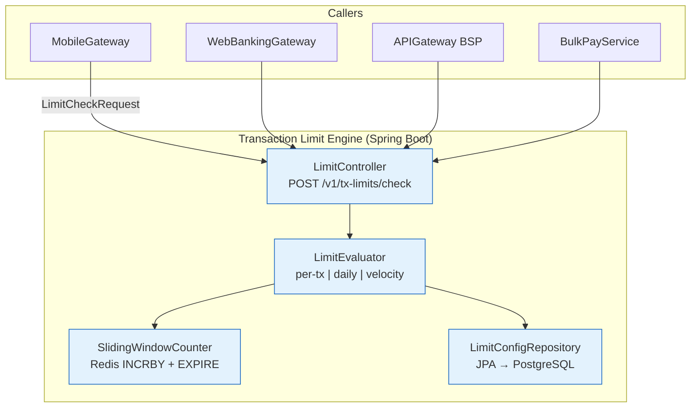

# Transaction Limit Engine

Status: Draft | Last Reviewed: 2026-05-21 | Owner: @risk-management-domain-owner
Catalog ID: BSP-012 | Radii
Tier Applicability: T0, T1, T2

## Problem Statement

Daily transfer limits are set differently per channel with no cross-channel aggregation: the mobile banking app allows VND 500M per day, the web banking portal allows VND 1B per day, and NAPAS caps individual transactions at VND 100M. A fraudster exploiting this fragmentation can initiate a VND 400M transfer via mobile at 09:00, a VND 800M transfer via web at 09:05, and bypass the mobile limit entirely — the web gateway has no visibility into the mobile channel's utilisation.

Per-transaction caps are not enforced uniformly across payment paths. The bulk payment service applies a different validation to bulk-pay batches than the single-payment service applies to individual transfers, creating a gap where a single bulk-pay entry can exceed the per-transaction cap that the single-pay path enforces.

Velocity limits — for example, a maximum of 20 transfers per hour — are not consistently applied. The mobile backend enforces a soft hourly limit via a database query (which misses concurrent requests), while the API gateway has no velocity check at all.

Limit configuration for new customer segments (e.g., a new "Premier" tier with a VND 2B daily limit) requires a code change in each channel's service, taking 3–4 weeks to coordinate and deploy across three teams.

## Context

The Transaction Limit Engine enforces per-transaction, daily aggregate, and hourly velocity limits across all payment channels from a single service. It is mandatory (T0) for retail and premium customer payment paths. T1 products (corporate bulk payment, trade finance) use it for velocity monitoring. T2 services (internal transfers) may use it for reporting only. Limit configurations are stored in PostgreSQL as customer-segment × channel × product rules and served from an application-level cache (Caffeine) refreshed every 5 minutes. Actual utilisation counters are maintained in Redis as sliding-window keys with TTL equal to the window size — no scheduled cleanup required. Cross-channel aggregation is achieved by keying the daily counter on `customerId` alone, not `customerId:channel`.

## Solution

A TransactionLimitEngine using sliding-window counters in Redis — per-customer velocity tracking across all channels. The engine evaluates three limit dimensions atomically: per-transaction cap (static config), daily aggregate (INCRBY with 86400s TTL), and hourly velocity count (INCRBY with 3600s TTL). It returns a `LimitCheckResult` with the remaining daily allowance so that calling services can display the headroom to the customer.



## Implementation Guidelines

**1. LimitEvaluator — three-dimension check**

```java
@Service
@RequiredArgsConstructor
public class LimitEvaluator {

    private final SlidingWindowCounter counter;
    private final LimitConfigRepository configRepo;

    public LimitCheckResult check(LimitCheckRequest req) {
        LimitConfig config = configRepo.find(req.customerId(), req.channel(), req.productCode());

        // 1. Per-transaction cap — static config check, no Redis call needed
        if (req.amount().compareTo(config.maxPerTransaction()) > 0) {
            return LimitCheckResult.declined("Per-transaction cap exceeded: max "
                + config.maxPerTransaction() + " " + req.currency());
        }

        // 2. Daily aggregate — cross-channel, keyed on customerId only
        BigDecimal dailyUsed = counter.getWindowTotal(req.customerId(), "DAILY", 86400);
        if (dailyUsed.add(req.amount()).compareTo(config.maxDaily()) > 0) {
            return LimitCheckResult.declined("Daily limit exceeded: used "
                + dailyUsed + ", requesting " + req.amount()
                + ", max " + config.maxDaily());
        }

        // 3. Hourly velocity (count-based, not amount-based)
        long hourlyCount = counter.getWindowCount(req.customerId(), "HOURLY_COUNT", 3600);
        if (hourlyCount >= config.maxTransactionsPerHour()) {
            return LimitCheckResult.declined("Velocity limit: max "
                + config.maxTransactionsPerHour() + " transactions per hour");
        }

        // All dimensions passed — increment counters atomically
        counter.increment(req.customerId(), "DAILY", req.amount(), 86400);
        counter.incrementCount(req.customerId(), "HOURLY_COUNT", 3600);

        return LimitCheckResult.approved(
            config.maxDaily().subtract(dailyUsed).subtract(req.amount())
        );
    }
}
```

**2. SlidingWindowCounter — Redis INCRBY with TTL**

```java
@Component
@RequiredArgsConstructor
public class SlidingWindowCounter {

    private final StringRedisTemplate redis;

    public BigDecimal getWindowTotal(String customerId, String dimension, long windowSeconds) {
        String key = "txlimit:" + customerId + ":" + dimension + ":" + windowSeconds;
        String val = redis.opsForValue().get(key);
        return val == null ? BigDecimal.ZERO : new BigDecimal(val);
    }

    public long getWindowCount(String customerId, String dimension, long windowSeconds) {
        String key = "txlimit:" + customerId + ":" + dimension + ":" + windowSeconds;
        String val = redis.opsForValue().get(key);
        return val == null ? 0L : Long.parseLong(val);
    }

    public void increment(String customerId, String dimension, BigDecimal amount, long windowSeconds) {
        String key = "txlimit:" + customerId + ":" + dimension + ":" + windowSeconds;
        long minor = amount.movePointRight(0).longValueExact();  // VND: no decimal needed
        Long result = redis.opsForValue().increment(key, minor);
        if (result != null && result == minor) {
            redis.expire(key, Duration.ofSeconds(windowSeconds));  // set TTL on first write
        }
    }

    public void incrementCount(String customerId, String dimension, long windowSeconds) {
        String key = "txlimit:" + customerId + ":" + dimension + ":" + windowSeconds;
        Long result = redis.opsForValue().increment(key, 1L);
        if (result != null && result == 1L) {
            redis.expire(key, Duration.ofSeconds(windowSeconds));
        }
    }
}
```

**3. Limit configuration schema**

```sql
CREATE TABLE transaction_limit_configs (
    id                       UUID PRIMARY KEY DEFAULT gen_random_uuid(),
    customer_segment         VARCHAR(50) NOT NULL,   -- RETAIL | PREMIUM | CORPORATE
    channel                  VARCHAR(30) NOT NULL,   -- MOBILE | WEB | API | BULK | ANY
    product_code             VARCHAR(50),            -- NULL = applies to all products
    currency                 CHAR(3) NOT NULL,
    max_per_transaction      NUMERIC(20,4) NOT NULL,
    max_daily                NUMERIC(20,4) NOT NULL,
    max_transactions_per_hour INT NOT NULL,
    effective_from           DATE NOT NULL,
    effective_to             DATE,
    UNIQUE (customer_segment, channel, product_code, currency, effective_from)
);

-- Partial index for current configs
CREATE INDEX idx_tx_limit_current ON transaction_limit_configs (customer_segment, channel)
    WHERE effective_to IS NULL;
```

## When to Use

- Any customer-facing payment path where per-transaction, daily, or velocity limits must be enforced across all channels consistently
- When cross-channel limit aggregation is required — a customer's mobile and web activity must count toward the same daily limit
- When limit configuration for customer segments must be updatable without code deployments
- When limit headroom must be returned to the calling service for display in the UI

## When Not to Use

- Credit facility limits (VND 5B corporate facility) — use BSP-011 Credit Limit Engine; BSP-012 handles transaction caps, not credit exposure
- Per-account balance checks — query the ledger (BSP-001) directly; this engine tracks transaction velocity, not balance
- Real-time fraud scoring — use the Fraud Screening platform (REF-007); BSP-012 enforces static configured limits, not dynamic fraud risk scores

## Variants

| Variant | When to prefer | Trade-off |
|---------|----------------|-----------|
| Redis sliding window (this pattern) | High-volume retail payments; sub-5ms requirement; no scheduled cleanup | Redis dependency; counter drift possible on Redis restart (mitigated by persistence) |
| Database advisory lock | Low-volume corporate payments; strong consistency required | Higher latency (DB round-trip); contention at scale |
| Token bucket (Resilience4j) | In-process rate limiting for internal APIs | No cross-pod sharing; resets on pod restart; not suitable for cross-channel aggregation |

## NFR Acceptance Criteria

```yaml
nfr_acceptance_criteria:
  catalog_id: BSP-012
  pattern: Transaction Limit Engine
  performance:
    - id: BSP-012-HP-01
      description: Limit check including Redis read and write must complete within 5ms p99.
      threshold: p99 < 5ms (all three dimensions checked)
  throughput:
    - id: BSP-012-TP-01
      description: Engine must handle 50,000 TPS burst for mobile payment peak hours.
      threshold: ≥ 50,000 TPS sustained for 60 seconds without degradation
  availability:
    - id: BSP-012-HA-01
      description: Transaction Limit Engine must be available 99.99% for T0 retail payment paths.
      threshold: availability ≥ 99.99% (T0); Redis TTL-based expiry requires no batch cleanup
  correctness:
    - id: BSP-012-COR-01
      description: Daily counter must aggregate across all channels for the same customerId.
      threshold: 0 cases where cross-channel daily spend exceeds configured max_daily (verified by reconciliation)
```

## Compliance Mapping

| Ring | Regulation | Provision | How this pattern satisfies |
|------|-----------|-----------|---------------------------|
| Ring 0 | PCI-DSS 4.0 | §10.7 — Transaction monitoring and daily limit controls | Per-transaction caps and daily aggregate limits configured and enforced per customer segment; limit configuration changes are logged to the structured audit trail |
| Ring 0 | NIST SP 800-53 | AC-4 — Information flow enforcement across channels | Cross-channel daily counter enforces that a customer's aggregate transaction flow does not exceed the configured policy regardless of which channel is used |
| Ring 1 | FATF Recommendation 16 | Velocity monitoring for wire transfer surveillance | Hourly velocity counter detects structuring attempts (multiple transfers just below the threshold); velocity anomalies trigger Fraud monitoring system notification |
| Ring 1 | BCBS 239 | §6 — Adaptability of limit event data | Every limit check result logged to `tx-limit-decisions` topic with customerId, channel, dimension, outcome, and remaining headroom; queryable for regulatory reporting |
| Ring 2 | SBV Circular 09/2020; Decree 13/2023 | §IV.2 — Transaction limit enforcement per SBV payment system rules; Art. 9 — PII minimisation | Redis keys use only customerId hash (no name, card number, or NID); daily limit enforced per SBV requirements; all limit decisions retained in structured audit log ⚠️ (working summary — pending Legal review) |

## Cost / FinOps Notes

- Transaction Limit Engine pods: 3 replicas (HA); stateless hot path; ~$35/month compute
- Redis sliding window counters: TTL-based expiry eliminates batch cleanup jobs; memory footprint = active customers × 2 keys (daily + hourly) × ~50 bytes = < 500 MB for 1M active daily customers
- PostgreSQL `transaction_limit_configs` table: < 1,000 rows even with full segment × channel × product coverage; Caffeine in-process cache eliminates DB calls on hot path
- Kafka `tx-limit-decisions` topic: high volume at peak; 24 partitions; retention 30 days; ~$30/month storage
- No GPU or ML infrastructure required — all limits are static configuration lookups

## Threat Model Summary

**Denial of Service — distributed limit bypass via channel fragmentation (Denial of Service)**: an adversary splits a large fraudulent transfer into many small transfers spread across mobile, web, and API channels to avoid per-channel limits, relying on the absence of cross-channel aggregation. Mitigation: the daily counter is keyed on `customerId` alone (not `customerId:channel`) — channel fragmentation does not help; Resilience4j `RateLimiter` on the `LimitController` endpoint (10,000 requests/second per pod) prevents per-pod overload; hourly velocity counter detects structuring patterns independent of channel.

**Spoofing — channel identity spoofing to access higher limits (Spoofing)**: an attacker intercepts and modifies the `channel` field in the JWT to claim they are using the BRANCH channel (which may have a higher limit than MOBILE), gaining access to a larger daily limit than their actual channel allows. Mitigation: `channel` claim in the JWT is set by the API Gateway and signed with the gateway's private key; the Transaction Limit Engine validates the JWT signature and rejects any token where `channel` does not match an expected gateway issuer; limit config key uses the validated channel from the JWT, not any caller-supplied parameter.

## Operational Runbook (stub)

1. Alert: TransactionLimitVelocityAnomaly — fires when a customer's hourly velocity counter reaches 80% of `maxTransactionsPerHour`. p50 resolution: 5 min (automated fraud alert sent); p99: 30 min. Notify the Fraud monitoring system via `POST /v1/fraud/signals` with `signal_type=VELOCITY_ANOMALY`. If the customer is confirmed fraud, revoke their session via SEC-011 Session Revocation immediately.

2. Alert: LimitConfigMissing — fires when `LimitEvaluator` cannot find a `LimitConfig` for a `customer_segment + channel` combination (throws `LimitConfigNotFoundException`). Default behaviour: return DECLINE with `REFER` outcome (safest fail-closed behaviour). Escalate to the Limit Admin team to create the missing config. p50 resolution: 15 min; p99: 2 hours.

3. Alert: TransactionLimitRedisUnavailable — fires when Redis connection pool exhaustion causes limit checks to fail. Fail-safe policy: apply the most restrictive static limit from the in-memory LimitConfig cache (no Redis increment). Log all transactions processed under fail-safe policy for post-recovery reconciliation. Alert fires with `recovery_mode=true` tag; ops team must confirm reconciliation complete before clearing.

## Test Strategy (stub)

**Unit**: `LimitEvaluatorTest` — per-transaction cap exceeded: assert DECLINE with cap message; daily aggregate exceeded: mock counter returning 90% of limit; request for 15% more: assert DECLINE; velocity exceeded: mock counter returning maxTransactionsPerHour; assert DECLINE. `SlidingWindowCounterTest` — first increment sets TTL; subsequent increments do not reset TTL; expired key returns ZERO.

**Integration**: `TransactionLimitEngineIT` (Testcontainers — PostgreSQL + Redis) — configure RETAIL MOBILE VND limit; submit 3 transactions consuming 95% of daily limit; 4th transaction exceeding daily: assert DECLINE with remaining headroom = 0; submit from WEB channel for same customer: assert same daily counter applies (cross-channel); next calendar day: assert counter reset (TTL expired).

**Compliance**: `LimitAuditIT` — after each limit check, assert `tx-limit-decisions` Kafka topic record contains customerId (hashed), channel, dimension, outcome, and remaining headroom; assert no raw PII (no name, card number) in the logged record.

**Chaos**: Toxiproxy — disconnect Redis for 10 seconds during a limit check burst; assert engine applies fail-safe static limits (no crash); reconnect Redis; assert first successful Redis increment sets TTL correctly (no orphaned counter).

## Related Patterns

- [BSP-011 Credit Limit Engine](credit-limit-engine.md) — BSP-012 handles per-transaction and velocity caps; BSP-011 handles credit facility exposure limits — both must pass for a payment to proceed
- [BSP-010 Rule / Decisioning Engine](rule-decisioning-engine.md) — adaptive limit tightening when fraud risk score is elevated uses BSP-010 rule evaluation
- [SEC-011 Session Revocation](../security/session-revocation.md) — velocity anomaly detection triggers immediate session revocation for confirmed fraud cases

## References

- PCI-DSS v4.0 — Transaction monitoring requirements §10.7
- FATF Recommendation 16 — Wire transfer monitoring
- BCBS 239 Principles for Effective Risk Data Aggregation — BCBS January 2013
- SBV Circular 09/2020/TT-NHNN — Information System Security for Credit Institutions
- Decree 13/2023/ND-CP — Personal Data Protection (Vietnam)
- Redis documentation: INCRBY and EXPIRE atomic patterns

---
**Key Takeaway**: Use Redis sliding-window counters keyed on `customerId` (not channel) to enforce per-transaction, daily aggregate, and hourly velocity limits with sub-5ms latency and automatic window expiry — so a customer's limit is consistent regardless of which channel they use, and cross-channel structuring attacks are prevented.
