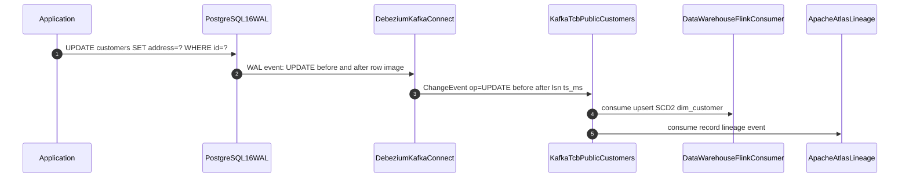

# Change Data Capture (General)

Status: Draft | Last Reviewed: 2026-05-16 | Owner: @tech-lead-backend
Catalog ID: DATA-008 | Radii
Tier Applicability: T0, T1

## Problem Statement

- Downstream data consumers (data warehouse, search index, analytics pipeline) need to reflect database changes in near-real-time; polling-based approaches (scheduled SELECT queries) impose high database load and introduce up to polling-interval latency.
- Manual event publishing in application code is fragile: if the application crashes between the database write and the Kafka publish, the event is lost and the downstream system falls out of sync — a dual-write consistency problem.
- PII column changes (customer address update, NRIC update) must be captured for Decree 13/2023 audit trail and BCBS 239 §3 lineage; application-level audit logging often misses edge cases (bulk updates via SQL, migrations, admin tooling).
- Schema migrations that add columns to operational tables are invisible to downstream consumers without a mechanism to detect and propagate structural changes.

## Context

Change Data Capture reads the PostgreSQL Write-Ahead Log (WAL) via the Debezium connector, which publishes every INSERT, UPDATE, and DELETE as a structured Kafka message containing the `before` and `after` image of the row. This is the general-purpose CDC pattern; for the specific case of transactional outbox (guaranteed exactly-once publishing for domain events), see INT-002. DATA-008 covers the broader use of CDC for data integration, lineage, and analytics fan-out.

## Solution

Debezium PostgreSQL connector uses logical replication (`pgoutput` plugin) to subscribe to PostgreSQL WAL. For each row change, Debezium publishes a `ChangeEvent` to a Kafka topic named `<server>.<schema>.<table>` (e.g., `tcb.public.customers`). The event envelope contains `op` (c/u/d/r), `before` (null for INSERTs), `after` (null for DELETEs), `ts_ms`, and source metadata (`lsn`, `txId`). Downstream consumers subscribe to relevant topics; schema evolution is managed via Confluent Schema Registry (Avro).



## Implementation Guidelines

### 1. Debezium PostgreSQL Connector Configuration (JSON)

```json
{
  "name": "tcb-postgres-cdc",
  "config": {
    "connector.class": "io.debezium.connector.postgresql.PostgresConnector",
    "database.hostname": "pg-primary.internal",
    "database.port": "5432",
    "database.user": "debezium_slot",
    "database.password": "${file:/opt/kafka/secrets/debezium.properties:password}",
    "database.dbname": "tcb_core",
    "database.server.name": "tcb",
    "plugin.name": "pgoutput",
    "table.include.list": "public.customers,public.accounts,public.transactions",
    "publication.name": "debezium_pub",
    "slot.name": "debezium_slot",
    "key.converter": "io.confluent.kafka.serializers.KafkaAvroSerializer",
    "value.converter": "io.confluent.kafka.serializers.KafkaAvroSerializer",
    "key.converter.schema.registry.url": "http://schema-registry:8081",
    "value.converter.schema.registry.url": "http://schema-registry:8081",
    "heartbeat.interval.ms": "30000",
    "snapshot.mode": "initial",
    "decimal.handling.mode": "double",
    "tombstones.on.delete": "false"
  }
}
```

### 2. PostgreSQL Logical Replication Setup

```sql
CREATE ROLE debezium_slot WITH REPLICATION LOGIN PASSWORD '...';
GRANT SELECT ON ALL TABLES IN SCHEMA public TO debezium_slot;

CREATE PUBLICATION debezium_pub FOR TABLE
    public.customers,
    public.accounts,
    public.transactions;
```

### 3. Kafka Consumer — SCD2 Upsert from CDC Event (Java 21)

```java
@Service
@RequiredArgsConstructor
public class CdcCustomerConsumer {

    private final Scd2CustomerRepository scd2Repo;

    @KafkaListener(topics = "tcb.public.customers", groupId = "cdc-dw-consumer")
    public void onCustomerChange(
            @Payload ChangeEvent<CustomerKey, CustomerValue> event) {

        if ("d".equals(event.payload().op())) {
            scd2Repo.closeCurrentRow(event.payload().before().customerId(),
                                     LocalDate.now());
            return;
        }

        CustomerValue after = event.payload().after();
        scd2Repo.scd2Merge(after.customerId(), after.name(),
                            after.address(), after.riskTier(),
                            LocalDate.now(), "CDC/tcb.public.customers");
    }
}

public record ChangeEvent<K, V>(K key, ChangePayload<V> payload) {}

public record ChangePayload<V>(
    String op,       // "c" insert, "u" update, "d" delete, "r" snapshot read
    V before,
    V after,
    long tsMs
) {}
```

## When to Use

- Downstream systems (data warehouse, search index, cache, lineage store) that need near-real-time database change propagation without polling the operational database.
- Environments requiring a complete audit trail of all row-level changes including those made by admin scripts and migrations — application-level event publishing misses out-of-band changes; WAL-based CDC captures everything.
- Multi-consumer fan-out scenarios where multiple downstream systems all need the same change events — Kafka topic provides durable, replayable multi-consumer delivery.

## When Not to Use

- Simple same-service cache invalidation where an application event is sufficient — WAL replication slot adds PostgreSQL operational overhead; a Redis `DEL` in the application is simpler.
- Environments where the source database cannot run logical replication (e.g., shared RDS with `rds.logical_replication` disabled, or legacy MySQL without binlog) — use polling-based CDC with awareness of latency trade-offs.
- When only domain events (business events, not all row changes) are needed — use the INT-002 Transactional Outbox pattern instead, which is more explicit and easier to test.

## Variants

| Variant | When to prefer | Trade-off |
|---------|----------------|-----------|
| Debezium + WAL (this pattern) | Capture all row changes including out-of-band; low latency; multi-consumer | Requires `REPLICATION` role; replication slot lag must be monitored; schema changes require Debezium reconfiguration |
| Polling-based CDC (Debezium snapshot) | Source DB does not support logical replication | Higher DB load; latency proportional to poll interval; does not capture DELETEs |
| Transactional Outbox (INT-002) | Only business-domain events needed; exactly-once delivery required for saga patterns | Application must explicitly publish outbox events; does not capture all row changes |

## NFR Acceptance Criteria

| Metric | Threshold | Measurement |
|--------|-----------|-------------|
| CDC lag (WAL to Kafka) | p99 ≤ 500 ms | Debezium `MilliSecondsBehindSource` metric; assert p99 ≤ 500 ms |
| Kafka topic retention for replay | ≥ 7 days | Verify `retention.ms` ≥ 604800000 on all CDC topics |
| Replication slot lag | ≤ 10,000 WAL bytes | `SELECT restart_lsn FROM pg_replication_slots WHERE slot_name = 'debezium_slot'`; alert if lag > 10,000 bytes |
| Schema registry compatibility | 100% backwards compatible | Schema registry `BACKWARD` compatibility mode; CI gate rejects breaking schema changes |
| Consumer throughput | ≥ 5,000 change events/s | Load test: 5,000 INSERTs/s; assert Kafka consumer keeps up within 500 ms lag |

## Compliance Mapping

| Ring | Regulation | Provision | How this pattern satisfies |
|------|-----------|-----------|---------------------------|
| Ring 0 | ISO 27001 | A.12.4.1 — Event logging; complete and tamper-evident log of data changes | Debezium WAL-based CDC captures ALL row changes including out-of-band SQL (admin, migrations); the Kafka topic with WORM-backed retention provides a tamper-evident audit trail of every database mutation. |
| Ring 1 | BCBS 239 | §3 — Data architecture; complete lineage from source to report | CDC events feed Apache Atlas lineage; every data warehouse row can be traced to its CDC source event via `lsn` and `ts_ms`; lineage is captured automatically rather than requiring manual ETL documentation. |
| Ring 2 | Decree 13/2023 | §9 — Personal data changes must be auditable for DSR fulfillment ⚠️ (working summary — pending Legal review) | CDC captures all PII column changes with before/after values and timestamps, enabling reconstruction of a customer's personal data history for DSR audit; however, storing `before.nric` in Kafka may itself constitute personal data processing requiring a consent basis; Legal review required to confirm CDC log retention rules under Decree 13/2023. |

## Cost / FinOps

- Replication slot: PostgreSQL replication slot adds WAL retention overhead proportional to slot lag. Monitor `pg_replication_slots.restart_lsn`; if Debezium is offline for > 4 hours, WAL accumulation can exhaust disk. Set `max_slot_wal_keep_size = 10GB` to auto-drop the slot before disk exhaustion (with alert at 8 GB).
- Kafka topic storage: CDC topics generate ~2× the transaction volume in messages. At 1,000 transactions/s × 500 bytes/message × 7-day retention = ~302 GB per topic. 3× replication factor = ~906 GB. At MSK pricing = ~$21/month per topic.
- Debezium Kafka Connect cluster: 3 workers on `m6g.large` = ~$1,800/year. Can share Connect cluster with other connectors.

## Threat Model

- **Replication slot lag leading to WAL disk exhaustion (Denial of Service)**: If Debezium is offline for extended periods, the replication slot prevents WAL cleanup; WAL files accumulate until disk exhaustion, causing a primary database outage. Mitigation: Prometheus alert on `pg_replication_slots_wal_retention_bytes > 8GB`; `max_slot_wal_keep_size = 10GB` causes automatic slot drop; on-call engineer investigates within 1 hour of alert.
- **PII in CDC events stored in Kafka without access control (Information Disclosure)**: CDC events contain full row images including PII. Mitigation: Kafka ACLs restrict `tcb.public.customers` topic to authorized consumer service accounts only; topic-level encryption via MSK encryption at rest; Schema Registry access controls prevent unauthorized schema reads.

## Runbook Stub

**Alert: `debezium_wal_lag_bytes > 8GB`**
- p50 baseline: ≤ 100 MB | p99 SLO: ≤ 1 GB
- Remediation: CRITICAL — (1) Check Debezium Connect worker status: `curl http://connect:8083/connectors/tcb-postgres-cdc/status`. (2) If connector is FAILED, check error in logs. (3) If Debezium cannot restart quickly, consider dropping the slot (`SELECT pg_drop_replication_slot('debezium_slot')`) — Debezium restarts from a new snapshot. (4) Alert DBA if WAL > 9 GB immediately.

**Alert: `cdc_consumer_lag > 50000`**
- p50 baseline: ≤ 1,000 messages | p99 SLO: ≤ 10,000
- Remediation: (1) Identify which consumer group is lagging: `kafka-consumer-groups.sh --describe --group cdc-dw-consumer`. (2) Scale the consumer service: `kubectl scale deploy cdc-dw-consumer --replicas=6`. (3) If lag is schema-related (deserialization errors), check schema registry compatibility logs.

## Test Strategy Stub

- **Unit**: `CdcCustomerConsumerTest` — mock SCD2 repository; send UPDATE ChangeEvent → assert `scd2Merge` called with correct fields. Send DELETE ChangeEvent → assert `closeCurrentRow` called. `CdcEnvelopeDeserializerTest` — deserialize sample Avro CDC envelope → assert `op`, `before`, `after` correctly mapped.
- **Integration**: Testcontainers (PostgreSQL + Kafka + Debezium + Schema Registry): INSERT a customer row; assert CDC event appears in Kafka within 1 second; UPDATE the row; assert UPDATE event with correct `before` and `after`; DELETE the row; assert DELETE event.
- **Schema evolution**: Add nullable column to customer table; assert Debezium continues publishing without interruption; assert Schema Registry records new schema version.
- **Compliance**: PII audit trail — INSERT customer with known NRIC hash; UPDATE address; assert both INSERT and UPDATE CDC events captured in Kafka with `ts_ms` and `lsn`; assert `before.nric_hash` is present in UPDATE event.

## Related Patterns

- [INT-002 CDC + Outbox Pattern](../../patterns/integration/cdc-outbox-pattern.md) — transactional outbox for domain event publishing (more explicit than general CDC)
- [DATA-009 Data Lineage](data-lineage.md) — Apache Atlas consumes CDC events for lineage tracking
- [DATA-004 Data Vault 2.0](data-vault-2.md) — DV2 Satellites are loaded from CDC event streams
- [SEC-012 Tamper-Evident Audit Logging](../../patterns/security/audit-logging-tamper-evident.md) — HMAC chain augments CDC log for compliance audit trail

## References

- [Debezium PostgreSQL Connector Documentation](https://debezium.io/documentation/reference/stable/connectors/postgresql.html)
- [PostgreSQL Logical Replication](https://www.postgresql.org/docs/16/logical-replication.html)
- [Confluent Schema Registry — Compatibility](https://docs.confluent.io/platform/current/schema-registry/avro.html)
- [BCBS 239 — Data Architecture and Lineage](https://www.bis.org/publ/bcbs239.htm)
- Catalog reference: `governance/standards/enterprise-architecture-catalog.md`
