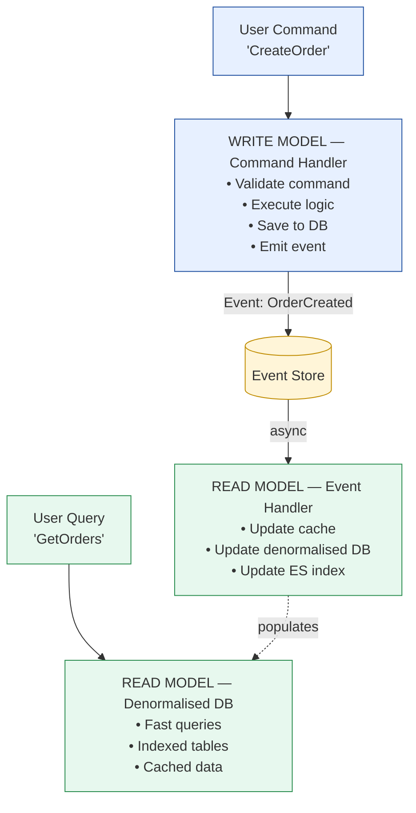

# CQRS (Command Query Responsibility Segregation) Pattern

Status: Approved | Last Reviewed: 2026-05-09 | Owner: @tech-lead-backend
Catalog ID: DATA-001 | Radii (upgraded to ops-runbook depth in Wave 3b)
Tier Applicability: T1, T2 (rarely applied to T0 — would add latency in the write path)

## Problem Statement

Single database model struggles with read/write asymmetry:
- Complex queries slow down the write model
- Denormalization hurts consistency
- Scaling reads differently from writes is difficult
- Reporting queries compete with transactional queries
- Query optimization complicates domain model

## Solution

Separate read and write models. Commands (write) go to one model; queries (read) from another. Sync via events (eventually consistent).



## Implementation Guidelines

1. **Write Model** (Command Handler)
   ```java
   @Service
   public class OrderCommandHandler {

     @Autowired
     private OrderRepository orderRepository;
     @Autowired
     private EventPublisher eventPublisher;
     @Autowired
     private OutboxRepository outboxRepository;

     @Transactional
     public Order createOrder(CreateOrderCommand command) {
       // Validate command
       if (command.getAmount().compareTo(BigDecimal.ZERO) <= 0) {
         throw new InvalidOrderException("Amount must be positive");
       }

       // Execute business logic
       Order order = Order.builder()
         .orderId(UUID.randomUUID().toString())
         .customerId(command.getCustomerId())
         .amount(command.getAmount())
         .status(OrderStatus.CREATED)
         .createdAt(Instant.now())
         .build();

       // Persist to write database
       order = orderRepository.save(order);

       // Emit event for read model subscribers
       OrderCreatedEvent event = OrderCreatedEvent.builder()
         .orderId(order.getId())
         .customerId(order.getCustomerId())
         .amount(order.getAmount())
         .timestamp(Instant.now())
         .build();

       // Save to outbox (ensures event durability)
       Outbox outboxRecord = Outbox.builder()
         .aggregateId(order.getId())
         .aggregateType("Order")
         .eventType("OrderCreated")
         .payload(objectMapper.writeValueAsString(event))
         .build();
       outboxRepository.save(outboxRecord);

       return order;
     }
   }
   ```

2. **Read Model** (Event Handler + Denormalized Tables)
   ```java
   @Service
   public class OrderReadModelUpdater {

     @Autowired
     private OrderReadRepository readRepository;
     @Autowired
     private ElasticsearchTemplate esTemplate;

     @KafkaListener(topics = "Order")
     public void onOrderCreated(OrderCreatedEvent event) {
       // Update denormalized read table
       OrderReadModel readModel = OrderReadModel.builder()
         .orderId(event.getOrderId())
         .customerId(event.getCustomerId())
         .amount(event.getAmount())
         .status("CREATED")
         .createdAt(event.getTimestamp())
         .build();
       readRepository.save(readModel);

       // Update Elasticsearch for fast searches
       IndexQuery indexQuery = new IndexQuery();
       indexQuery.setObject(readModel);
       esTemplate.index(indexQuery, IndexCoordinates.of("orders-index"));
     }

     @KafkaListener(topics = "Order")
     public void onOrderCompleted(OrderCompletedEvent event) {
       // Update read model
       Optional<OrderReadModel> existing = readRepository.findById(event.getOrderId());
       if (existing.isPresent()) {
         OrderReadModel model = existing.get();
         model.setStatus("COMPLETED");
         model.setCompletedAt(event.getTimestamp());
         readRepository.save(model);

         // Update Elasticsearch
         esTemplate.update(indexQuery, IndexCoordinates.of("orders-index"));
       }
     }
   }
   ```

3. **Query Model**
   ```java
   @Service
   public class OrderQueryService {

     @Autowired
     private OrderReadRepository readRepository;

     public List<OrderReadModel> getCustomerOrders(String customerId) {
       // Fast query from denormalized read model
       return readRepository.findByCustomerId(customerId);
     }

     public Page<OrderReadModel> searchOrders(
         String query, Pageable pageable) {
       // Full-text search via Elasticsearch
       SearchQuery searchQuery = new NativeSearchQueryBuilder()
         .withQuery(QueryBuilders.multiMatchQuery(query,
           "customerId", "orderId", "status"))
         .withPageable(pageable)
         .build();

       return elasticsearchTemplate.queryForPage(
         searchQuery, OrderReadModel.class
       );
     }

     public OrderReadModel getOrderById(String orderId) {
       return readRepository.findById(orderId).orElseThrow();
     }
   }
   ```

4. **Database Schema**
   ```sql
   -- WRITE MODEL (Normalized)
   CREATE TABLE orders (
     id VARCHAR(36) PRIMARY KEY,
     customer_id VARCHAR(36) NOT NULL,
     amount DECIMAL(19,2) NOT NULL,
     status VARCHAR(50) NOT NULL,
     created_at TIMESTAMP NOT NULL
   );

   -- READ MODEL (Denormalized)
   CREATE TABLE orders_read_model (
     id VARCHAR(36) PRIMARY KEY,
     customer_id VARCHAR(36) NOT NULL,
     amount DECIMAL(19,2) NOT NULL,
     status VARCHAR(50) NOT NULL,
     created_at TIMESTAMP NOT NULL,
     completed_at TIMESTAMP,
     customer_name VARCHAR(100),  -- Denormalized from customers table
     payment_method VARCHAR(50),  -- Denormalized from payments table
     INDEX idx_customer (customer_id),
     INDEX idx_status (status),
     INDEX idx_created (created_at)
   );

   -- EVENTS (Source of truth for async updates)
   CREATE TABLE events (
     event_id BIGINT PRIMARY KEY AUTO_INCREMENT,
     aggregate_id VARCHAR(36),
     event_type VARCHAR(100),
     payload JSON,
     created_at TIMESTAMP DEFAULT CURRENT_TIMESTAMP
   );
   ```

5. **Spring Boot Configuration**
   ```yaml
   spring:
     datasource:
       write:
         url: jdbc:postgresql://postgres-write:5432/orders
         username: app_write
         password: ${DB_WRITE_PASSWORD}
       read:
         url: jdbc:postgresql://postgres-read:5432/orders
         username: app_read
         password: ${DB_READ_PASSWORD}

     elasticsearch:
       uris: http://elasticsearch:9200
       username: elastic
       password: ${ES_PASSWORD}

     jpa:
       hibernate:
         ddl-auto: validate  # Don't auto-create

   kafka:
     bootstrap-servers: kafka:9092
     consumer:
       group-id: order-read-model-updater
       auto-offset-reset: earliest
   ```

## Read Model Implementations

| Implementation | Use Case |
|---|---|
| **Relational DB** | Complex queries, ACID consistency |
| **Elasticsearch** | Full-text search, faceted navigation |
| **Redis** | Real-time leaderboards, hot data |
| **MongoDB** | Document-based queries, flexible schema |
| **Data Warehouse** | Historical analysis, BI reporting |

## Consistency Guarantees

| Model | Consistency | Latency |
|-------|---|---|
| **Strong** | Write → immediately queryable | 0ms |
| **Eventual** | Write → queryable after event processing | 100ms-5s |
| **CQRS** | Write strong; Read eventual | Write 0ms, Read 100ms-5s |

CQRS accepts eventual consistency for benefits:
- Scales reads independently
- Optimizes each model separately
- Supports multiple query models

## When to Use

- Read/write volume asymmetry (more reads than writes)
- Complex queries on simple writes
- Multiple query patterns (reporting, search, listing)
- Real-time dashboards with event-driven updates
- Event sourcing (natural fit for CQRS)

## When NOT to Use

- Strong consistency requirement (banking transactions might need synchronous)
- Simple CRUD applications
- Single query pattern
- Real-time data integrity critical
- Low read complexity (use basic indexes instead)

## Handling Eventual Consistency Issues

1. **Stale Reads**: User might see old data momentarily
   - Solution: Version numbers, timestamps in UI
   - Show "data as of 5 seconds ago" if needed

2. **Write Then Read**: User writes, then immediately reads (sees stale data)
   - Solution: Return ID from write, use it for immediate read
   ```java
   Order order = createOrder(command);  // Returns ID
   OrderReadModel readModel = getOrder(order.getId());  // Might be stale
   // Retry with backoff if needed
   ```

3. **Synchronization Gaps**: Event processing delayed
   - Solution: Monitor lag, alert if > threshold
   - Consumer lag metrics via Kafka

## NFR Acceptance Criteria

- **HA**: write side and read side independently HA. Read side can be re-built from event stream on disaster, allowing T1 RPO ≈ 0 for reads even with full read-store loss.
- **HP**: read latency improved (denormalised, indexed for query patterns). Write latency essentially unchanged. Read lag SLO typically ≤ 1 s for T1; ≤ 5 s for T2 acceptable.
- **HR**: divergence between write and read state is the primary risk. Mitigation: monitored lag SLO; periodic reconciliation; rebuild-from-events procedure documented.

## Compliance Mapping

| Layer | Reference | Section/Control | How this satisfies |
|---|---|---|---|
| Ring 0 | Microservices.io — CQRS | Canonical pattern | Implementation reference |
| Ring 0 | Microsoft Cloud Patterns — CQRS | "Separate operations that read data from those that update data" | Same intent |
| Ring 1 | Basel BCBS 239 §3 (Timeliness) | "Risk data must be aggregated and reported on a timely basis" | Read models pre-aggregate for timely reporting |
| Ring 2 | (no direct mapping) | — | CQRS is a generic pattern; specific Vietnamese controls applied via the read/write models themselves (e.g., audit trail) |

## Cost / FinOps Notes

| Item | Cost driver | Order of magnitude |
|---|---|---|
| Read store | Volume × N read models | Often more storage than write side |
| Event-stream consumer (read-model builder) | Throughput | Modest compute |
| Reconciliation jobs | Periodic full scans | Off-peak runs; trivial |

**Cost of NOT using CQRS** when applicable: read queries on the normalised write model lock contention, hurt write performance, drive over-provisioning of the write DB. CQRS often pays for itself in DB cost reduction.

## Threat Model Summary

STRIDE: addresses **Tampering** (separation of concerns) and **Information Disclosure** (read store can be access-controlled separately).

- **Top 3 threats addressed**:
  1. *Read query saturating the write DB* — separated read store removes contention.
  2. *Sensitive-field exposure via wide read queries* — read model can omit / mask fields.
  3. *Rebuild-from-scratch resilience* — read model can be rebuilt from event log if corrupted.
- **Top 3 residual threats**:
  1. *Stale read returned to a customer* — application UX must communicate "as of" timestamps where staleness matters; alerts on lag > SLO.
  2. *Event-loss between write and read side* — eliminated by [INT-002 Outbox + CDC](../integration/cdc-outbox-pattern.md) + [EIP-024 Idempotent Receiver](../eip/idempotent-receiver.md).
  3. *Read-side bugs* producing inconsistent display — periodic reconciliation against the write store catches these.

## Operational Runbook (stub)

- **Alerts**:
  - `CQRS_ReadLag_<service>`: read lag > tier SLO. Severity: tier-dependent.
  - `CQRS_RebuildInProgress`: read-model rebuild active (informational; mute downstream alerts during rebuild).
  - `CQRS_ReconciliationDrift`: periodic-reconciliation job found > N rows differing between write and read. Severity: High.
- **Dashboards**: Grafana — `cqrs-overview` (per service: write rate, read rate, lag, reconciliation drift).
- **Rebuild procedure**: stop read consumer; truncate read store; replay events from earliest offset; verify lag returns to baseline.

## Test Strategy (stub)

- **Unit**: command handler tests; read-model projection tests.
- **Integration**: write a command → assert event published → read-side projection updated → query returns expected.
- **Chaos**: kill read-model builder; verify rebuild procedure works.
- **Property**: random sequence of commands → eventual consistency between write and read states.

## Related Patterns

- [INT-002 Transactional Outbox + CDC](../integration/cdc-outbox-pattern.md) — preferred event-publishing path
- [INT-004 Event Sourcing](../integration/event-sourcing.md) — frequent companion (write side as event log)
- [EIP-024 Idempotent Receiver](../eip/idempotent-receiver.md) — read-model builder must be idempotent
- [DATA-002 Data Mesh Ownership](data-mesh-ownership.md) — CQRS read models are common data products
- [PRIN-004 Database-Per-Service](../../principles/database-per-service.md) — CQRS lives within one service's bounded context

## References

- [CQRS Pattern](https://www.martinfowler.com/bliki/CQRS.html)
- [Greg Young on CQRS](https://cqrs.files.wordpress.com/2010/11/cqrs_documents.pdf)
- [Eventual Consistency](https://www.allthingsdistributed.com/2008/12/eventually_consistent.html)

---

**Key Takeaway**: Separate read and write models. Commands update normalised write DB and emit events via outbox+CDC (INT-002). Idempotent consumers (EIP-024) build denormalised read models. Monitor lag; reconcile periodically.
