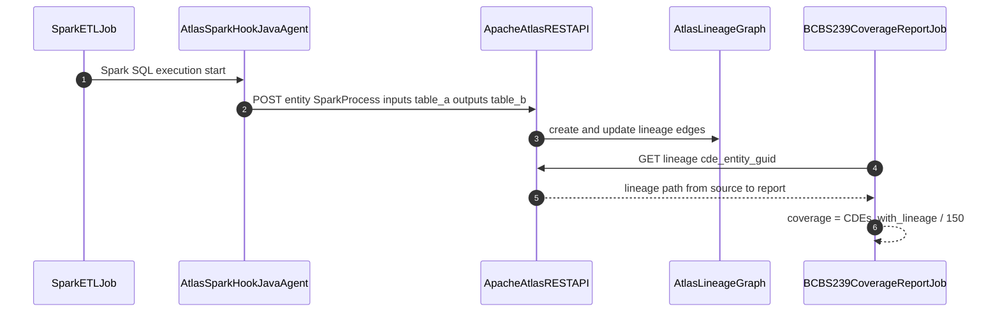

# Data Lineage

Status: Draft | Last Reviewed: 2026-05-16 | Owner: @data-platform-domain-owner
Catalog ID: DATA-009 | Radii
Tier Applicability: T1, T2

## Problem Statement

- BCBS 239 §3 requires banks to document the complete lineage of risk data — from source system to regulatory report — including every transformation step; without automated lineage capture, this documentation is manually maintained, immediately out of date, and not trusted by regulators.
- Impact analysis for schema changes is impossible without lineage: when a source table's column is renamed, engineers have no systematic way to identify which downstream reports, dashboards, and ML models are affected, leading to silent data corruption in regulatory submissions.
- Personal data flows must be documented under Decree 13/2023 Article 9 (data processing records); without lineage, the Privacy Officer cannot confirm that PII from source CRM has not propagated to unauthorized analytics systems.
- Data quality root cause analysis: when a regulatory report shows anomalous numbers, tracing the error to its source requires manual inspection of dozens of ETL scripts; automated lineage traversal reduces this from days to minutes.

## Context

Apache Atlas provides a central lineage graph where ETL pipelines, Spark jobs, and dbt models register their input/output entities (tables, columns, topics) and the process that connects them. Debezium CDC events (DATA-008) are registered as source entities; Spark jobs emit lineage via the Spark Atlas connector; dbt registers lineage via the Atlas REST API. BCBS 239 mandates that all critical data elements (CDEs) — approximately 150 fields identified by the Risk Data team — have documented end-to-end lineage.

## Solution

Apache Atlas lineage graph stores entities (Table, Column, KafkaTopic, SparkProcess, DbtModel) and relationships (lineage edges). ETL pipelines register their lineage at runtime via the Atlas REST API. The Atlas Hook (Java agent) is attached to Spark jobs and automatically captures Spark SQL lineage without code changes. dbt lineage is extracted via a post-run hook. A nightly BCBS 239 coverage report queries Atlas to verify that all 150 CDEs have at least one documented lineage path.



## Implementation Guidelines

### 1. Apache Atlas Java Client — Manual Lineage Registration

```java
@Component
@RequiredArgsConstructor
public class AtlasLineagePublisher {

    @Value("${atlas.url:http://atlas:21000}")
    private String atlasUrl;

    private final RestTemplate restTemplate;

    public void registerEtlLineage(String processName,
                                    List<String> inputTables,
                                    List<String> outputTables) {
        AtlasEntity process = new AtlasEntity();
        process.setTypeName("spark_process");
        process.setAttribute("name", processName);
        process.setAttribute("inputs", inputTables.stream()
            .map(t -> Map.of("typeName", "hive_table", "uniqueAttributes",
                             Map.of("qualifiedName", t)))
            .collect(Collectors.toList()));
        process.setAttribute("outputs", outputTables.stream()
            .map(t -> Map.of("typeName", "hive_table", "uniqueAttributes",
                             Map.of("qualifiedName", t)))
            .collect(Collectors.toList()));

        AtlasEntitiesWithExtInfo payload = new AtlasEntitiesWithExtInfo();
        payload.addEntity(process);

        restTemplate.postForObject(
            atlasUrl + "/api/atlas/v2/entity/bulk",
            payload, EntityMutationResponse.class);
    }
}
```

### 2. Spark Atlas Hook Configuration

```yaml
# spark-defaults.conf
spark.extraJavaOptions: -javaagent:/opt/atlas/hook/atlas-spark-hook.jar
spark.atlas.url: http://atlas:21000
spark.atlas.cluster.name: tcb-datalake
```

### 3. dbt Atlas Post-Run Hook

```python
# dbt_project.yml
on-run-end:
  - "{{ run_atlas_lineage(results) }}"

# macros/atlas_lineage.sql

  
  
    
      
    
  

```

### 4. BCBS 239 Coverage Report

```python
# bcbs239_coverage.py
import requests, os, sys

ATLAS_URL = "http://atlas:21000/api/atlas/v2"
CRITICAL_DATA_ELEMENTS = [
    "tcb.public.transactions.amount",
    "tcb.public.customers.risk_tier",
    # ... 148 more CDEs from BCBS 239 CDE registry
]

covered = 0
for cde in CRITICAL_DATA_ELEMENTS:
    resp = requests.get(
        f"{ATLAS_URL}/lineage/{cde}?depth=10&direction=BOTH",
        auth=("admin", os.environ["ATLAS_ADMIN_PASSWORD"])
    )
    if resp.ok and resp.json().get("relations"):
        covered += 1

coverage_pct = (covered / len(CRITICAL_DATA_ELEMENTS)) * 100
print(f"BCBS 239 CDE lineage coverage: {coverage_pct:.1f}% ({covered}/{len(CRITICAL_DATA_ELEMENTS)})")
if coverage_pct < 95:
    sys.exit(1)
```

## When to Use

- BCBS 239-regulated environments requiring documented lineage for all critical data elements from source to regulatory report — Atlas provides the audit evidence for regulator inspections.
- Organizations undergoing schema changes or platform migrations where impact analysis ("what downstream systems does this column feed?") must be automated to avoid silent data corruption.
- Privacy Officer needs to confirm PII flow compliance under Decree 13/2023 — Atlas lineage shows whether customer NRIC propagates to analytics systems that should not have it.

## When Not to Use

- Small data stacks with fewer than 10 tables — manual documentation in a YAML data dictionary is simpler and less operationally complex than running Atlas.
- Environments where lineage fidelity cannot be maintained — if engineers bypass ETL pipelines with ad-hoc SQL scripts that don't register lineage, Atlas becomes a false confidence artifact. Governance enforcement is a prerequisite.
- Projects where Atlas's Kerberos/LDAP/Ranger integration complexity exceeds the team's operational capacity — Atlas is a heavyweight system; only adopt when the data platform team can dedicate resources to its operation.

## Variants

| Variant | When to prefer | Trade-off |
|---------|----------------|-----------|
| Apache Atlas (this pattern) | Hadoop/Spark ecosystem; BCBS 239 audit evidence; column-level lineage | Heavyweight system; requires HBase backend; complex to operate |
| OpenLineage + Marquez | Cloud-native; Airflow/dbt native integration; lighter weight | Less mature column-level lineage; smaller ecosystem than Atlas |
| DataHub (LinkedIn) | Modern REST-first API; GraphQL query interface; strong UI | Less regulatory track record than Atlas for BCBS 239 audits |

## NFR Acceptance Criteria

| Metric | Threshold | Measurement |
|--------|-----------|-------------|
| BCBS 239 CDE coverage | ≥ 95% | Nightly coverage script; fail gate if < 95% |
| Lineage capture lag | ≤ 5 min (ETL completion to Atlas entity visible) | Time ETL job completion to Atlas entity creation; assert ≤ 5 min |
| Lineage query response | p99 ≤ 3 s (depth-10 traversal) | Atlas REST API lineage query benchmark; assert p99 ≤ 3 s |
| Atlas availability | 99.9% (non-critical-path system) | Prometheus uptime monitor; alert if Atlas down > 10 min |
| Schema migration impact report | ≤ 15 min to generate full impact report | Atlas lineage traversal from renamed column; assert report generated within 15 min |

## Compliance Mapping

| Ring | Regulation | Provision | How this pattern satisfies |
|------|-----------|-----------|---------------------------|
| Ring 0 | DAMA-DMBOK | Data lineage — capture and documentation of data movement and transformation | Atlas lineage graph satisfies DAMA's lineage documentation requirement; column-level lineage provides granularity beyond table-level lineage mandated by most frameworks. |
| Ring 1 | BCBS 239 | §3 — Data architecture and IT infrastructure; documented lineage from source to report for all risk data | Nightly BCBS 239 coverage report verifies ≥ 95% of critical data elements have documented lineage paths; Atlas lineage audit trail is available for regulator inspection; lineage coverage metric tracked in governance dashboard. |
| Ring 2 | Decree 13/2023 | §9 — Documentation of personal data processing activities (Art. 9 processing records) ⚠️ (working summary — pending Legal review) | Atlas lineage shows which ETL pipelines, data stores, and analytics models process customer PII; Privacy Officer can query Atlas to verify PII does not propagate to unauthorized systems; Legal review required to confirm that Atlas lineage graph export satisfies Decree 13/2023 Art. 9 documentation format requirements. |

## Cost / FinOps

- Atlas infrastructure: Apache Atlas requires HBase (for graph storage), Solr (for search), and Kafka (for hook messaging). Recommended deployment: 3-node Atlas cluster with co-located HBase = 3× `m6g.2xlarge` = ~$5,400/year. Share with existing Kafka cluster.
- Atlas Spark Hook: zero additional compute cost — the Java agent attaches to existing Spark executors.
- Coverage report job: runs nightly for < 5 minutes on a single small pod — negligible.
- Alternative (OpenLineage + Marquez): ~$2,400/year (single PostgreSQL + lightweight API server) but less mature for BCBS 239 audit evidence. Cost saving of ~$3,000/year.
- Cost of non-compliance: BCBS 239 regulatory finding for missing lineage documentation can result in supervisory action and remediation costs of 10+ engineer-weeks; Atlas operational cost is justified.

## Threat Model

- **Lineage poisoning — false lineage injection (Tampering)**: A misconfigured ETL pipeline registers incorrect lineage, causing the BCBS 239 coverage report to show false compliance. Mitigation: Atlas REST API authenticated via Kerberos/JWT; only authorized ETL service accounts can write lineage; lineage entries are auditable (Atlas audit log shows who registered which entity when); nightly consistency check compares Atlas lineage against actual ETL job configurations.
- **Atlas availability loss during regulatory audit (Denial of Service)**: Atlas is unavailable during a regulator's on-site inspection, preventing access to lineage evidence. Mitigation: Atlas weekly lineage snapshot exported to a static HTML report and stored in S3 WORM; regulators can access the static snapshot even if Atlas is offline; Atlas runs on a 3-node HA cluster with automatic failover.

## Runbook Stub

**Alert: `bcbs239_cde_coverage_pct < 95`**
- p50 baseline: ≥ 98% | p99 SLO: ≥ 95%
- Remediation: (1) Run coverage script to identify which CDEs lack lineage: `python3 scripts/bcbs239_coverage.py --verbose`. (2) For each uncovered CDE, identify the ETL pipeline that should register lineage. (3) Add Atlas lineage registration to the pipeline. (4) Re-run coverage script; assert ≥ 95% before next regulatory reporting cycle.

**Alert: `atlas_api_p99 > 5s`**
- p50 baseline: ≤ 1 s | p99 SLO: ≤ 3 s
- Remediation: (1) Check Atlas HBase region server health: `hbase hbck -details`. (2) Check Solr index health: `curl http://solr:8983/solr/vertex_index/admin/ping`. (3) If HBase compaction is running, Atlas will be slow until compaction completes. (4) If Atlas heap is exhausted, increase JVM max heap in Atlas startup script.

## Test Strategy Stub

- **Unit**: `AtlasLineagePublisherTest` — mock RestTemplate; call `registerEtlLineage`; assert correct payload structure with `inputs` and `outputs` lists; assert REST endpoint called once. `BCBS239CoverageTest` — mock Atlas API returning lineage for 143/150 CDEs; assert coverage = 95.3%; mock returning 140/150; assert script exits with code 1.
- **Integration**: Atlas Testcontainers (or mock Atlas): register ETL lineage; query Atlas `/lineage` API; assert entity and lineage edges are retrievable.
- **Compliance**: BCBS 239 §3 — after full ETL pipeline run with Atlas integration, run coverage report; assert ≥ 95% of 150 CDEs have documented lineage. Decree 13/2023 PII flow: register lineage for a pipeline known to process customer NRIC; query Atlas for NRIC column; assert lineage shows all downstream consumers; verify no consumer appears in unauthorized analytics schema.

## Related Patterns

- [DATA-008 Change Data Capture](change-data-capture.md) — CDC events are source entities in the lineage graph
- [DATA-004 Data Vault 2.0](data-vault-2.md) — DV2 load jobs register Hub/Link/Satellite lineage in Atlas
- [COMP-005 BCBS 239 Deep Dive](../../compliance/basel-bcbs-239.md) — §3 lineage mandate
- [SEC-012 Tamper-Evident Audit Logging](../../patterns/security/audit-logging-tamper-evident.md) — Atlas audit log for lineage changes

## References

- [Apache Atlas Documentation — Lineage](https://atlas.apache.org/1.2.0/Hook-Storm.html)
- [Apache Atlas REST API](https://atlas.apache.org/api/v2/index.html)
- [OpenLineage Specification](https://openlineage.io/spec/)
- [BCBS 239 — §3 Data Architecture and IT Infrastructure](https://www.bis.org/publ/bcbs239.htm)
- Catalog reference: `governance/standards/enterprise-architecture-catalog.md`
