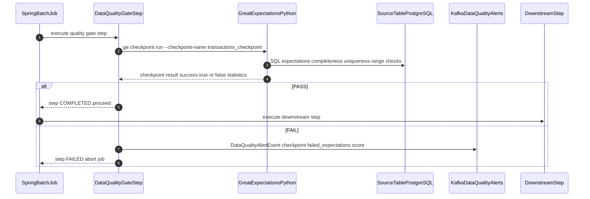

# Data Quality Rules

Status: Draft | Last Reviewed: 2026-05-16 | Owner: @data-platform-domain-owner
Catalog ID: DATA-011 | Radii
Tier Applicability: T1, T2

## Problem Statement

- BCBS 239 §4 requires banks to ensure risk data is accurate and complete; without automated quality gates, data quality defects (null amounts, duplicate transaction IDs, negative balances) silently propagate into regulatory reports and cause supervisory findings.
- Regulatory submission corrections (resubmissions after data quality failures) are costly — each resubmission to SBV requires formal notification, legal review, and remediation reporting; automated quality gates that catch errors before submission are far cheaper.
- Data quality rules are scattered across ETL scripts (inline assertions, ad-hoc SQL checks) with no central visibility; when a quality rule fails, there is no standard alert or blocking mechanism — the bad data continues downstream.
- Data quality degradation over time: a table that passes quality checks today may silently fail next month as new data sources are added or business rules change; without trending metrics, quality degradation goes undetected until a regulatory report is wrong.

## Context

Great Expectations is the open-source data quality framework that defines, tests, and documents quality expectations for data tables and Kafka streams. In Techcombank's context, Great Expectations checkpoints are integrated as Spring Batch steps: if a checkpoint fails (quality score < threshold), the Batch job aborts and triggers a P1 alert before the data reaches the regulatory reporting pipeline. Expectations are stored as JSON Expectation Suites in a GitOps repository, making quality rules version-controlled and peer-reviewed.

## Solution

Quality rules (expectations) are defined in Great Expectations ExpectationSuites stored in a Git repository. A Spring Batch `DataQualityGate` step runs Great Expectations via Python subprocess before each downstream processing step. If the checkpoint fails, the batch job fails with a `DATA_QUALITY_FAILURE` status and publishes a Kafka alert event. Prometheus tracks quality scores as gauges; a 7-day trend alert fires if any critical data element drops below 98%.



## Implementation Guidelines

### 1. Great Expectations ExpectationSuite (JSON)

```json
{
  "expectation_suite_name": "transactions_suite",
  "expectations": [
    {
      "expectation_type": "expect_column_values_to_not_be_null",
      "kwargs": {"column": "transaction_id"}
    },
    {
      "expectation_type": "expect_column_values_to_be_unique",
      "kwargs": {"column": "transaction_id"}
    },
    {
      "expectation_type": "expect_column_values_to_be_between",
      "kwargs": {"column": "amount", "min_value": 0, "max_value": 50000000000}
    },
    {
      "expectation_type": "expect_column_values_to_be_in_set",
      "kwargs": {"column": "channel", "value_set": ["NAPAS", "VISA", "ATM", "MOBILE", "BRANCH"]}
    },
    {
      "expectation_type": "expect_table_row_count_to_be_between",
      "kwargs": {"min_value": 1000, "max_value": 10000000}
    }
  ]
}
```

### 2. Great Expectations Checkpoint Configuration

```yaml
# checkpoints/transactions_checkpoint.yml
name: transactions_checkpoint
config_version: 1.0
class_name: Checkpoint
run_name_template: "%Y%m%d-%H%M%S-transactions"
action_list:
  - name: store_validation_result
    action:
      class_name: StoreValidationResultAction
  - name: send_alert_on_failure
    action:
      class_name: MicrosoftTeamsNotificationAction
      notify_on: failure
      webhook: "${TEAMS_WEBHOOK_URL}"
validations:
  - batch_request:
      datasource_name: tcb_postgres
      data_asset_name: transactions
      batch_identifiers:
        default_identifier_name: default_identifier
    expectation_suite_name: transactions_suite
```

### 3. Spring Batch DataQualityGate Step (Java 21)

```java
@Component
@RequiredArgsConstructor
public class DataQualityGate implements Tasklet {

    @Value("${ge.checkpoint.name}")
    private String checkpointName;

    private final DataQualityAlertPublisher alertPublisher;
    private final MeterRegistry meterRegistry;

    @Override
    public RepeatStatus execute(StepContribution contribution,
                                 ChunkContext chunkContext) throws Exception {
        ProcessBuilder pb = new ProcessBuilder(
            "python3", "-m", "great_expectations",
            "checkpoint", "run", checkpointName,
            "--config", "/opt/ge/great_expectations.yml"
        );
        pb.redirectErrorStream(true);
        Process proc = pb.start();
        String output = new String(proc.getInputStream().readAllBytes());
        int exit = proc.waitFor();

        if (exit != 0) {
            log.error("DataQualityGate FAILED checkpoint={}: {}", checkpointName, output);
            alertPublisher.publish(DataQualityAlertEvent.failed(checkpointName, output));
            throw new DataQualityException("Quality gate failed: " + checkpointName);
        }

        double score = parseSuccessPercent(output);
        meterRegistry.gauge("data_quality_score",
            Tags.of("checkpoint", checkpointName), score);
        return RepeatStatus.FINISHED;
    }
}
```

### 4. Prometheus Quality Trend Alert

```yaml
groups:
  - name: data_quality
    rules:
      - alert: DataQualityScoreLow
        expr: data_quality_score{checkpoint="transactions_checkpoint"} < 98
        for: 0m
        labels:
          severity: critical
        annotations:
          summary: "Transactions quality score below 98% (current: {{ $value }}%)"

      - alert: DataQualityTrendDegrading
        expr: (data_quality_score offset 7d) - data_quality_score > 2
        for: 30m
        labels:
          severity: warning
        annotations:
          summary: "Data quality score degraded > 2% over past 7 days"
```

## When to Use

- Pre-regulatory-submission data pipelines where data quality failures must abort the pipeline before bad data reaches SBV or internal risk management systems.
- BCBS 239-regulated environments requiring automated quality measurement and trending for critical data elements — Great Expectations checkpoints provide the audit evidence.
- Data pipelines with complex quality rules (cross-column consistency, referential integrity across tables) that are difficult to express as simple NOT NULL constraints.

## When Not to Use

- Simple operational databases with well-enforced NOT NULL and FOREIGN KEY constraints — database-level constraints handle quality at write time without the Great Expectations overhead.
- Real-time event streaming pipelines where a blocking quality gate is unacceptable — use stream-based anomaly detection (Flink CEP) rather than batch quality gates for T0/T1 real-time flows.
- Ad-hoc analytical queries — quality gates are designed for pipeline automation, not interactive exploration.

## Variants

| Variant | When to prefer | Trade-off |
|---------|----------------|-----------|
| Great Expectations + Spring Batch gate (this pattern) | Full audit trail; complex multi-column rules; BCBS 239 reporting | Requires Python environment alongside Java; subprocess overhead ~5–15 s per checkpoint |
| dbt tests | Already using dbt for transformation; want quality checks as dbt tests | Tightly coupled to dbt; less flexible for non-dbt pipelines |
| Apache Griffin | Batch quality monitoring with Spark; existing Spark infrastructure | Heavyweight; less actively maintained than Great Expectations |

## NFR Acceptance Criteria

| Metric | Threshold | Measurement |
|--------|-----------|-------------|
| Critical data quality score (BCBS 239 CDEs) | ≥ 99% | Nightly GE checkpoint; fail Spring Batch job if < 99% |
| Quality gate execution time | p99 ≤ 15 min | Time Spring Batch DataQualityGate step; assert p99 ≤ 15 min |
| Quality trend alert sensitivity | fires if score drops > 2% over 7 days | Simulate 1.9% drop — assert no alert. Simulate 2.1% drop — assert `DataQualityTrendDegrading` fires. |
| Zero silent quality failures | Any quality gate failure must produce a Kafka alert | Integration test: inject null transaction_id; assert DataQualityAlertEvent published to Kafka within 30 s |
| Expectation coverage | 100% of BCBS 239 critical columns covered by at least one expectation | `python3 scripts/bcbs239_ge_coverage.py`; assert 0 uncovered CDEs |

## Compliance Mapping

| Ring | Regulation | Provision | How this pattern satisfies |
|------|-----------|-----------|---------------------------|
| Ring 0 | ISO 8000 | Data quality — accuracy, completeness, uniqueness, timeliness | Great Expectations covers all four ISO 8000 data quality dimensions: `not_be_null` (completeness), `be_unique` (uniqueness), `be_between` (accuracy), and GE checkpoint run frequency (timeliness tracking). |
| Ring 1 | BCBS 239 | §4 — Accuracy and Integrity: risk data must be accurate; data management processes must include data quality controls | DataQualityGate step in every risk data pipeline implements BCBS 239 §4 controls; quality scores are tracked as Prometheus gauges and available for regulator inspection; checkpoint results are stored in GE's validation result store with full evidence of each expectation pass/fail. |
| Ring 2 | SBV Circular 09/2020 | §IV.1 — Data accuracy requirements for regulatory reporting submissions ⚠️ (working summary — pending Legal review) | DataQualityGate prevents regulatory reporting pipeline from proceeding if critical quality expectations fail; quality score history provides audit evidence for SBV inspections; Legal review required to confirm whether specific SBV §IV.1 quality thresholds are satisfied by the 99% threshold configured in this pattern. |

## Cost / FinOps

- Great Expectations: open-source; no licensing cost. Python subprocess overhead: ~5–15 seconds per checkpoint on a 10M row table.
- Spring Batch integration: no additional infrastructure — runs within the existing Spring Batch cluster.
- Prometheus gauges: 1 gauge per checkpoint per run = negligible storage. Alert manager routing to PagerDuty/Teams is within existing alerting infrastructure.
- Cost of NOT using quality gates: a single regulatory resubmission to SBV (caused by data quality failure) costs 2–4 engineer-weeks of remediation + legal review + formal notification. A year of daily Great Expectations checkpoints is < 1 engineer-week equivalent in compute.

## Threat Model

- **Quality gate bypass — direct table writes bypassing the pipeline (Elevation of Privilege)**: An engineer or admin script writes data directly to the reporting table, bypassing the Spring Batch pipeline and its quality gates. Mitigation: reporting table write permissions restricted to the Spring Batch service account only; GRANT/REVOKE managed via Vault dynamic credentials; direct writes trigger PostgreSQL audit trigger and Prometheus alert.
- **Great Expectations configuration tampering (Tampering)**: The ExpectationSuite JSON is modified (threshold loosened from 99% to 80%) without review. Mitigation: ExpectationSuites are stored in Git; all changes require PR review and CODEOWNERS approval from the Data Governance team; GE validation result store is append-only — past checkpoint results cannot be retroactively modified.

## Runbook Stub

**Alert: `DataQualityScoreLow`**
- p50 baseline: 100% (no failures) | p99 SLO: ≥ 99%
- Remediation: (1) Identify failed expectations: `ge checkpoint run --checkpoint-name <name> --verbose 2>&1 | grep FAILED`. (2) Check source system for data anomaly: null transaction IDs often indicate a source system migration event. (3) If failure is expected, create a temporary expectation override in Git with a time-bounded exception. (4) If unexpected, quarantine the bad data batch and reprocess from a clean source. (5) Do NOT proceed with regulatory reporting pipeline until the gate passes.

**Alert: `DataQualityTrendDegrading`**
- p50 baseline: 0 drops > 2% | p99 SLO: no sustained degradation
- Remediation: (1) Identify which expectation is degrading: review 7-day GE checkpoint history. (2) Common causes: new null column from source migration, data type change producing range failures. (3) If intentional (business rule change), update the expectation and document the change. (4) If unintentional, escalate to source system owner.

## Test Strategy Stub

- **Unit**: `DataQualityGateTest` — mock ProcessBuilder returning exit 0 → assert `RepeatStatus.FINISHED`. Mock exit 1 → assert `DataQualityException` thrown and `DataQualityAlertEvent` published. `QualityScoreParserTest` — parse GE output JSON with `"success_percent": 97.5` → assert score = 97.5.
- **Integration**: Testcontainers (PostgreSQL + Great Expectations): insert 1,000 valid transaction rows; run DataQualityGate step; assert PASS. Insert 10 rows with null `transaction_id`; assert FAIL and `DataQualityAlertEvent` published to Kafka.
- **Compliance**: BCBS 239 §4 — enumerate all 150 BCBS 239 critical data elements; assert each has at least one GE expectation covering accuracy or completeness; fail CI gate if any CDE is uncovered.

## Related Patterns

- [DATA-009 Data Lineage](data-lineage.md) — Atlas lineage shows which downstream systems are affected when a quality gate fails
- [BSP-004 End-of-Day Batch Window](../../patterns/banking-solutions/end-of-day-batch-window.md) — quality gate runs within the EOD batch window
- [COMP-005 BCBS 239 Deep Dive](../../compliance/basel-bcbs-239.md) — §4 accuracy mandate
- [DATA-010 Time-Series Modelling](time-series-modelling.md) — quality gate applied before ingest into TimescaleDB hypertable

## References

- [Great Expectations Documentation](https://docs.greatexpectations.io/docs/)
- [BCBS 239 — §4 Accuracy and Integrity](https://www.bis.org/publ/bcbs239.htm)
- [Spring Batch — Tasklet Step](https://docs.spring.io/spring-batch/docs/current/reference/html/step.html#taskletStep)
- [Prometheus — Custom Metrics](https://prometheus.io/docs/instrumenting/writing_clientlibs/)
- Catalog reference: `governance/standards/enterprise-architecture-catalog.md`
