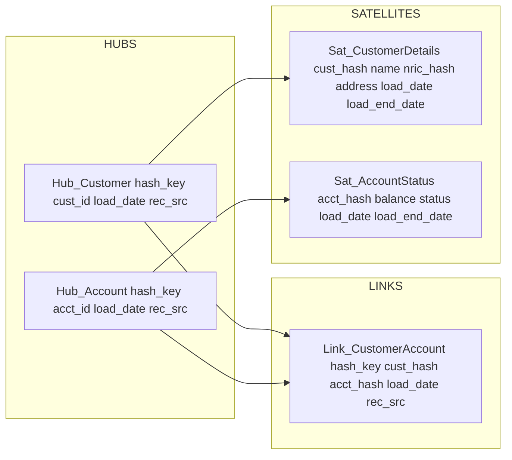

# Data Vault 2.0

Status: Draft | Last Reviewed: 2026-05-16 | Owner: @data-platform-domain-owner
Catalog ID: DATA-004 | Radii
Tier Applicability: T2, T3

## Problem Statement

- Traditional star/snowflake schemas are rigid: every business rule change (e.g., a customer can now belong to multiple segments) requires destructive ALTER TABLE operations that break historical comparisons and force reloads.
- Audit trail gaps in conventional data warehouses: UPDATE and DELETE operations overwrite history, making point-in-time reconstruction impossible — a BCBS 239 §3 violation.
- Integration complexity across T24 core banking, CRM, and NAPAS feed schemas: each source uses different customer identifiers; ETL code embeds business rules about which ID wins, making the warehouse untestable and fragile.
- Parallel load bottlenecks: star schema fact tables require complex dependency ordering; a single late-arriving dimension blocks the full load window, threatening the EOD batch SLA.
- PII sprawl in Satellites: without an explicit data classification layer, customer PII (NRIC, phone, address) propagates into every Satellite, complicating Decree 13/2023 retention enforcement.

## Context

Data Vault 2.0 (DV2) separates business keys (Hubs), relationships (Links), and descriptive attributes (Satellites) into independently loadable, append-only tables. This separation enables full historical auditability (BCBS 239 §3), parallel loads without dependency ordering, and schema evolution without rewrites. In Techcombank's context, DV2 is the appropriate data warehouse modeling strategy for the T2/T3 data lake serving regulatory reporting, risk analytics, and business intelligence.

## Solution

Three table types form the vault: **Hubs** store unique business keys with a SHA-256 hash key, load timestamp, and record source; **Links** record many-to-many relationships between Hubs; **Satellites** store descriptive attributes keyed to the Hub/Link hash, with `load_date` and `load_end_date` providing full history. All inserts are append-only; no UPDATE or DELETE. Spring Batch loads each Hub, Link, and Satellite in parallel since there are no cross-table dependencies.



## Implementation Guidelines

### 1. Hub and Satellite DDL (PostgreSQL 16)

```sql
CREATE TABLE dv.hub_customer (
    cust_hash     CHAR(64)     NOT NULL PRIMARY KEY,
    customer_id   VARCHAR(50)  NOT NULL,
    load_date     TIMESTAMPTZ  NOT NULL DEFAULT NOW(),
    record_source VARCHAR(100) NOT NULL
);

CREATE TABLE dv.link_customer_account (
    link_hash    CHAR(64)    NOT NULL PRIMARY KEY,
    cust_hash    CHAR(64)    NOT NULL REFERENCES dv.hub_customer(cust_hash),
    acct_hash    CHAR(64)    NOT NULL REFERENCES dv.hub_account(acct_hash),
    load_date    TIMESTAMPTZ NOT NULL DEFAULT NOW(),
    record_source VARCHAR(100) NOT NULL
);

CREATE TABLE dv.sat_customer_details (
    cust_hash     CHAR(64)    NOT NULL REFERENCES dv.hub_customer(cust_hash),
    load_date     TIMESTAMPTZ NOT NULL DEFAULT NOW(),
    load_end_date TIMESTAMPTZ,
    name          VARCHAR(255),
    nric_hash     CHAR(64),
    address       TEXT,
    record_source VARCHAR(100) NOT NULL,
    PRIMARY KEY (cust_hash, load_date)
);
```

### 2. Hash Key Generation (Java 21)

```java
@Component
public class DataVaultHasher {

    public String hubHash(String businessKey) {
        try {
            MessageDigest md = MessageDigest.getInstance("SHA-256");
            byte[] hash = md.digest(
                businessKey.trim().toUpperCase().getBytes(StandardCharsets.UTF_8));
            return Hex.encodeHexString(hash);
        } catch (NoSuchAlgorithmException e) {
            throw new IllegalStateException("SHA-256 unavailable", e);
        }
    }

    public String linkHash(String... businessKeys) {
        String combined = Arrays.stream(businessKeys)
            .map(String::trim)
            .map(String::toUpperCase)
            .sorted()
            .collect(Collectors.joining("|"));
        return hubHash(combined);
    }
}
```

### 3. Spring Batch Parallel Hub/Satellite Load

```java
@Configuration
@RequiredArgsConstructor
public class DataVaultLoadJob {

    @Bean
    public Job dataVaultLoadJob(JobRepository repo,
            Step hubCustomerStep, Step hubAccountStep,
            Step linkStep, Step satCustomerStep) {
        return new JobBuilder("dataVaultLoad", repo)
            .start(new FlowBuilder<SimpleFlow>("hubFlow")
                .split(new SimpleAsyncTaskExecutor())
                .add(new FlowBuilder<SimpleFlow>("hc").start(hubCustomerStep).build(),
                     new FlowBuilder<SimpleFlow>("ha").start(hubAccountStep).build())
                .build())
            .next(linkStep)
            .next(satCustomerStep)
            .build()
            .build();
    }
}
```

## When to Use

- Data warehouse or data lake requiring full point-in-time auditability and BCBS 239 §3 lineage compliance — every source row is traceable to its origin via `record_source`.
- Environments with multiple source systems that use different business keys for the same entity (T24 customer ID vs. CRM contact ID) — Hubs naturally handle multi-source key integration.
- When schema evolution is frequent and destructive ALTER TABLE operations on a production warehouse are unacceptable — Satellites are independently evolvable.

## When Not to Use

- Simple single-source reporting with no auditability requirement — a star schema is faster to query and simpler to maintain when BCBS 239 compliance is not needed.
- Real-time operational data (T0/T1 transactional systems) — DV2's append-only model and hash key joins add latency unsuitable for sub-200ms operational queries.
- Small datasets (<1M rows total) — DV2's structural complexity is unjustified for small reference tables; use a simple versioned table (DATA-003 Temporal Tables) instead.

## Variants

| Variant | When to prefer | Trade-off |
|---------|----------------|-----------|
| Data Vault 2.0 (this pattern) | Full auditability required; multi-source integration; BCBS 239 compliance | Higher query complexity — Business Vault views required for BI consumption |
| Data Vault 1.0 (Linstedt original) | Legacy tooling; no DV2 toolchain available | Missing PIT (Point-in-Time) and Bridge tables; slower historical queries |
| Anchor Modelling | Ultra-frequent schema changes; academic/research data | Very high join count; poor query performance at banking scale |

## NFR Acceptance Criteria

| Metric | Threshold | Measurement |
|--------|-----------|-------------|
| Daily delta load (100M rows) | 2 h end-to-end | Spring Batch load test with 100M synthetic rows; measure wall-clock time |
| Historical point-in-time query (3-year lookback) | p99 5 s | EXPLAIN ANALYZE on `sat_customer_details` with date filter; assert p99 5 s |
| Hash key uniqueness | 0 collisions in 1B rows | Unit test: 1B random business keys, assert zero SHA-256 collisions |
| Parallel load efficiency | 3x speedup vs sequential | Compare parallel Hub load time vs sequential; assert 3x improvement |
| Data lineage coverage | 100% of Hub rows have `record_source` | SQL: `SELECT COUNT(*) FROM hub_customer WHERE record_source IS NULL`; assert 0 |

## Compliance Mapping

| Ring | Regulation | Provision | How this pattern satisfies |
|------|-----------|-----------|---------------------------|
| Ring 0 | ISO 8000 | Data quality — completeness and traceability | Every row carries `record_source` and `load_date`; no row is ever overwritten; full data provenance is inherent to the DV2 structure. |
| Ring 1 | BCBS 239 | §3 — Data architecture and IT infrastructure; lineage and audit trail for risk data | Append-only Hubs, Links, and Satellites provide a complete immutable history of all risk-relevant data; `record_source` maps every row to its origin system; point-in-time queries satisfy BCBS 239 §3 traceability requirement. |
| Ring 2 | Decree 13/2023 | §9 — Retention and deletion of personal data; proportionality ⚠️ (working summary — pending Legal review) | Customer PII in Satellites (NRIC, address) must have a documented retention TTL enforced by OPA policy; NRIC stored as HMAC hash in `nric_hash`; raw PII must be purged from Satellites after retention period by setting `load_end_date` and running a partition drop; Legal review required to confirm retention periods and hash adequacy satisfy Decree 13/2023. |

## Cost / FinOps

- Storage overhead: DV2 stores all history (no overwrites), so storage grows proportionally to change rate. Customer address changes 2× per year on average; at 5M customers × 200 bytes/Satellite row × 2 changes/year = 2 GB/year incremental Satellite storage — negligible on PostgreSQL 16 with ZSTD compression.
- Hash key computation: SHA-256 at 10M rows/hour adds ~3 minutes to the load window — acceptable. Use PostgreSQL `gen_random_uuid()` for Link hashes if SHA-256 compute is a bottleneck.
- Query performance: Business Vault views (Point-in-Time tables) add one-time build cost but reduce ad-hoc query complexity for BI tools; build PIT tables nightly during the batch window.
- Parallel Spring Batch load reduces load window by ~60% compared to sequential star schema ETL, offsetting DV2's additional table count.

## Threat Model

- **Source data injection — malicious record_source value (Tampering)**: An attacker with ETL pipeline access injects a fraudulent `record_source` value, making fabricated rows appear to originate from a trusted system (e.g., T24). Because DV2 never deletes rows, the fabricated rows persist indefinitely. Mitigation: `record_source` is validated against an allowlist at load time (`VALID_SOURCES = {"T24", "CRM", "NAPAS", ...}`); unauthorized source names cause the batch job to abort and alert.
- **PII retention violation — Satellite rows retained beyond Decree 13/2023 TTL (Information Disclosure)**: Customer PII Satellite rows are never automatically deleted due to DV2's append-only model. If the retention enforcement job fails silently, PII is retained beyond its legal period. Mitigation: nightly OPA-driven retention job explicitly closes Satellite rows (sets `load_end_date`) past their TTL and archives to WORM storage; job failure triggers a P1 alert; Prometheus metric tracks `sat_pii_rows_past_ttl` with alert threshold 0.

## Runbook Stub

**Alert: `dv_load_job_duration > 7200s`** (load window SLA breach)
- p50 baseline: 5,400 s | p99 SLO: 7,200 s
- Remediation: (1) Check Spring Batch job execution table: `SELECT job_name, status, start_time, end_time FROM batch_job_execution ORDER BY start_time DESC LIMIT 5`. (2) Identify which step is slow (Hub vs. Link vs. Satellite). (3) If Hub load is slow, check PostgreSQL autovacuum blocking writes: `SELECT * FROM pg_stat_activity WHERE wait_event_type = 'Lock'`. (4) If parallel executor is throttled, increase `SimpleAsyncTaskExecutor` core pool size.

**Alert: `dv_pii_rows_past_ttl > 0`**
- p50 baseline: 0 | p99 SLO: 0
- Remediation: CRITICAL — (1) Identify which Satellite table has expired rows: `SELECT 'sat_customer_details', COUNT(*) FROM dv.sat_customer_details WHERE load_end_date IS NULL AND load_date < NOW() - INTERVAL '2 years'`. (2) Run retention enforcement job manually. (3) If OPA policy changed, verify TTL values are correctly configured. (4) Notify CISO if rows are more than 30 days past TTL.

## Test Strategy Stub

- **Unit**: `DataVaultHasherTest` — same input produces same hash; different case produces same hash (case-normalized); empty string produces valid SHA-256; null input throws `IllegalArgumentException`. `LinkHashTest` — two-key link hash is order-independent; swap keys produces same hash.
- **Integration**: Spring Batch Test with Testcontainers (PostgreSQL 16): load 10,000 customer rows from T24 source, assert Hub rows = unique customer IDs, assert Satellite rows = 10,000, assert `record_source` = "T24" on all rows. Load same customers again with updated addresses, assert Hub count unchanged, assert Satellite now has 20,000 rows with `load_end_date` set on old rows.
- **Compliance**: BCBS 239 lineage — after full load, assert 100% of Hub rows have non-null `record_source`, assert 0 rows with `load_date` in the future. Decree 13/2023 retention — insert Satellite rows with `load_date` = 3 years ago, run retention job, assert `load_end_date` is set on all expired rows, assert `nric_hash` is present (HMAC) but raw NRIC is absent.

## Related Patterns

- [DATA-003 Temporal Tables](temporal-tables.md) — alternative for single-source operational history
- [DATA-009 Data Lineage](data-lineage.md) — Atlas lineage layer on top of DV2 loads
- [COMP-005 BCBS 239 Deep Dive](../../compliance/basel-bcbs-239.md) — regulatory mandate driving DV2 adoption
- [DATA-011 Data Quality Rules](data-quality-rules.md) — quality gate applied to Hub/Satellite loads

## References

- Linstedt, D. & Olschimke, M. (2015) — Building a Scalable Data Warehouse with Data Vault 2.0
- [Data Vault Alliance — DV2 Standard Specification](https://www.datalinesoftware.com/dv2-standard/)
- [BCBS 239 — Principles for Effective Risk Data Aggregation](https://www.bis.org/publ/bcbs239.htm)
- [PostgreSQL 16 — SHA-256 via pgcrypto](https://www.postgresql.org/docs/16/pgcrypto.html)
- [Spring Batch — Parallel Steps](https://docs.spring.io/spring-batch/docs/current/reference/html/scalability.html)
- Catalog reference: `governance/standards/enterprise-architecture-catalog.md`
