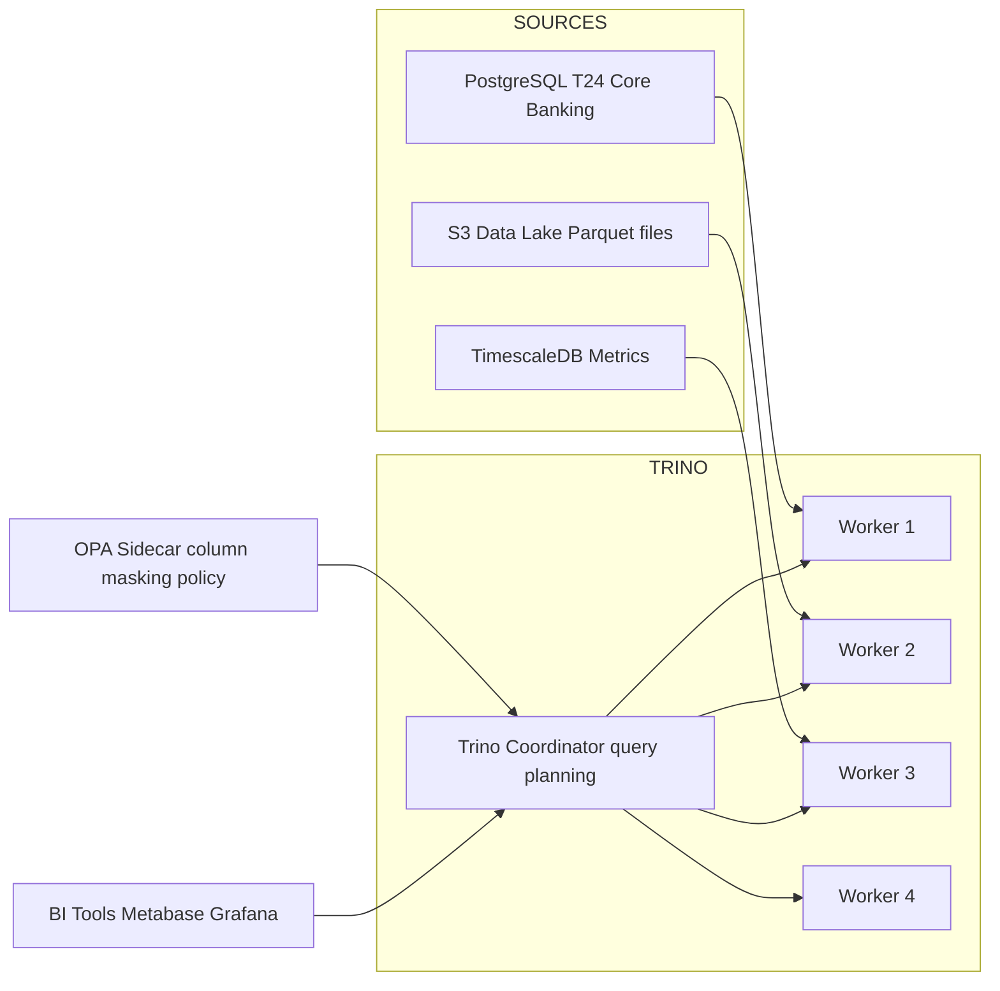

# Data Virtualization

Status: Draft | Last Reviewed: 2026-05-16 | Owner: @data-platform-domain-owner
Catalog ID: DATA-012 | Radii
Tier Applicability: T2, T3

## Problem Statement

- Regulatory and business analysts require cross-system queries (e.g., "join customer records from CRM with transaction history from T24 with risk scores from the risk engine") that traditionally require multi-day ETL pipelines to materialize into a single database before analysis can begin.
- ETL pipelines for analytical use cases proliferate: each new analytical requirement spawns a new ETL job, a new staging table, and a new operational dependency — the data platform becomes a sprawling collection of pipelines that are expensive to maintain and slow to change.
- BCBS 239 §5 completeness requirement: analysts must be able to query across all risk data sources without gaps; data silos where T24 data is inaccessible to the risk reporting tool violate completeness requirements.
- PII column access control: raw tables from the customer CRM contain NRIC, phone, and address that must not be visible to all analysts; a data virtualization layer can apply column masking policies centrally without requiring each source system to implement its own access control.

## Context

Data virtualization provides a logical, unified SQL interface over multiple heterogeneous data sources (PostgreSQL, S3 Parquet, TimescaleDB) without physically moving data. Trino (formerly PrestoSQL) is the open-source distributed SQL engine used for this purpose. In Techcombank's context, Trino federates queries across T24 PostgreSQL operational tables, the S3 data lake (Parquet files), and TimescaleDB time-series metrics. Column masking for PII is implemented via Trino row/column filters using OPA policies.

## Solution

Trino cluster (coordinator + 4 workers) connects to multiple catalogs: `postgresql` (T24 operational data), `hive` (S3 data lake), and `timescale` (TimescaleDB metrics). Analysts submit SQL queries to Trino via JDBC or REST API; Trino decomposes the query into per-catalog sub-queries, executes them in parallel, and merges results. OPA authorization policy evaluates `user.role` against the requested column (e.g., tellers cannot see `customer.nric` — OPA returns the column as `'****'`). Spring `TrinoDataSource` bean routes analytical queries to Trino.



## Implementation Guidelines

### 1. Trino Catalog Configuration

```properties
# /etc/trino/catalog/postgresql.properties
connector.name=postgresql
connection-url=jdbc:postgresql://pg-primary.internal:5432/tcb_core
connection-user=trino_readonly
connection-password=${PG_PASSWORD}

# /etc/trino/catalog/hive.properties
connector.name=hive-hadoop2
hive.metastore.uri=thrift://hive-metastore:9083
hive.s3.endpoint=https://s3.ap-southeast-1.amazonaws.com

# /etc/trino/catalog/timescale.properties
connector.name=postgresql
connection-url=jdbc:postgresql://timescale.internal:5432/metrics
connection-user=trino_readonly
connection-password=${TSDB_PASSWORD}
```

### 2. OPA Column Masking Policy (Trino Row Filter Plugin)

```rego
package trino_column_mask

default mask_nric = false

mask_nric {
    input.context.identity.user.role != "compliance_officer"
    input.context.identity.user.role != "kyc_analyst"
}

column_mask[col] = masked_value {
    col := "nric"
    mask_nric
    masked_value := "'****'"
}
```

Trino OPA plugin configuration:
```yaml
# /etc/trino/opa-plugin.properties
opa.policy.uri=http://opa-sidecar:8181/v1/data/trino_column_mask/column_mask
opa.row-filters.enabled=true
opa.column-masking.enabled=true
```

### 3. Federated Query Example

```sql
SELECT
    c.customer_id,
    c.name,
    c.nric,          -- masked to '****' for non-privileged users by OPA
    r.risk_score,
    m.total_amount AS ytd_transaction_amount
FROM postgresql.public.customers c
JOIN hive.risk_scores.customer_risk r
    ON c.customer_id = r.customer_id
JOIN (
    SELECT customer_id, SUM(amount) AS total_amount
    FROM timescale.metrics.transaction_metrics
    WHERE time >= DATE_TRUNC('year', NOW())
    GROUP BY customer_id
) m ON c.customer_id = m.customer_id
WHERE c.risk_tier = 'HIGH'
ORDER BY r.risk_score DESC
LIMIT 1000;
```

### 4. Spring DataSource Configuration (Java 21)

```java
@Configuration
public class TrinoConfig {

    @Bean
    @ConditionalOnProperty("trino.enabled", havingValue = "true")
    public DataSource trinoDataSource(
            @Value("${trino.jdbc-url}") String url,
            @Value("${trino.user}") String user) {
        return DataSourceBuilder.create()
            .url(url)
            .username(user)
            .driverClassName("io.trino.jdbc.TrinoDriver")
            .build();
    }
}
```

## When to Use

- Cross-source analytical queries where physical ETL pipelines would take days to build and the query pattern is exploratory or low-frequency — data virtualization enables self-service analytics without materializing data.
- Environments requiring centralized PII column masking across multiple source systems — Trino OPA plugin applies masking at the query layer without modifying source systems.
- BCBS 239 completeness requirements: regulators need ad-hoc queries across all risk data sources that would require weeks to ETL if done traditionally.

## When Not to Use

- High-frequency, latency-sensitive queries (p99 < 1 s required) — federated queries incur cross-system network overhead; pre-materialized views (DATA-006 Lambda, DATA-007 Kappa) are faster for known, repeated query patterns.
- Full data lake ingestion pipelines — data virtualization is for querying, not bulk loading; use Spark or Flink for ETL pipelines that transform and materialize data.
- Environments where source databases cannot accept additional read connections from Trino workers — Trino's parallel queries can saturate a heavily loaded source database; use a read replica.

## Variants

| Variant | When to prefer | Trade-off |
|---------|----------------|-----------|
| Trino (this pattern) | Large-scale federated SQL; S3/Hive connector; OPA integration | Operationally complex cluster; warm-up latency on first query |
| Dremio | Cloud-native; automatic reflections (pre-computed aggregations); strong BI tool integration | Commercial license for enterprise features; less flexible OPA integration |
| Denodo | Enterprise data virtualization with strong governance features; vendor support | Expensive commercial license; heavy operational footprint |

## NFR Acceptance Criteria

| Metric | Threshold | Measurement |
|--------|-----------|-------------|
| Federated query p99 (cross-source join, 1M row result) | ≤ 10 s | Benchmark cross-source query with Trino EXPLAIN ANALYZE; assert p99 ≤ 10 s |
| Data freshness (passthrough to source) | ≤ 15 min from source write to Trino query visibility | Write to PostgreSQL; query via Trino; assert row visible within 15 min |
| PII column masking correctness | 100% of NRIC/phone/address columns masked for non-privileged roles | Integration test: query `nric` column as `analyst` role; assert value = `'****'` |
| Trino cluster availability | 99.9% (non-critical-path system) | Prometheus uptime; alert if Trino coordinator down > 5 min |
| Source database connection overhead | ≤ 10% increase in source DB connection count under Trino load | Monitor `pg_stat_activity` connection count before and during Trino benchmark |

## Compliance Mapping

| Ring | Regulation | Provision | How this pattern satisfies |
|------|-----------|-----------|---------------------------|
| Ring 0 | NIST SP 800-162 | ABAC — access control based on user attributes for data access | Trino OPA column masking implements attribute-based data access control: `user.role` determines which columns are visible in full vs. masked — the same ABAC model as SEC-010. |
| Ring 1 | BCBS 239 | §5 — Completeness: risk data from all sources must be accessible for risk management | Trino federates all risk data sources (T24 PostgreSQL, S3 risk model outputs, TimescaleDB metrics) into a single query interface; analysts can perform completeness checks across all sources without physical ETL pipelines. |
| Ring 2 | Decree 13/2023 | §9 — Personal data processing must be purpose-limited; access to PII must be controlled ⚠️ (working summary — pending Legal review) | OPA column masking ensures that `nric`, `phone`, and `address` columns are masked for roles that do not have a documented purpose for accessing raw PII; masking is enforced at the query layer independent of source system ACLs; Legal review required to confirm that Trino query-layer masking satisfies Decree 13/2023 Art. 9 purpose limitation requirements. |

## Cost / FinOps

- Trino cluster: 1 coordinator + 4 workers on `m6g.2xlarge` = 5 instances × $0.308/hour = ~$13,500/year. Scale workers down to 2 during off-peak hours with autoscaling to ~$9,000/year.
- Hive Metastore: co-located with existing Hadoop cluster or AWS Glue ($0.10/10K API requests = negligible for analytical query volumes).
- Source database overhead: Trino issues parallel per-catalog queries. Use read replicas for T24 PostgreSQL to isolate analytical queries from operational traffic — existing RDS read replica adds ~$800/year.
- Cost of NOT using data virtualization: each new cross-source analytical requirement typically requires 1–2 weeks of ETL engineering. Trino reduces this to hours for standard SQL analytical queries.

## Threat Model

- **Trino coordinator SQL injection (Tampering)**: An analyst submits a Trino SQL query containing a subquery that reads from a sensitive catalog table they should not access. Mitigation: Trino `ACCESS CONTROL` rules restrict which catalogs and schemas each role can query; OPA policy enforces both column masking AND table-level row filters; all Trino queries are logged to the Trino query log for audit.
- **Cross-catalog data exfiltration via federated join (Information Disclosure)**: An analyst creates a federated query that joins a PII source with an unrestricted aggregation, effectively re-identifying masked PII. Mitigation: OPA row filter policies apply k-anonymity guards — results with fewer than 5 rows per group are suppressed; Data Governance team reviews any query that requests PII-adjacent columns across multiple catalogs.

## Runbook Stub

**Alert: `trino_query_p99_seconds > 30`**
- p50 baseline: ≤ 5 s | p99 SLO: ≤ 10 s
- Remediation: (1) Check Trino Web UI for slow queries at `http://trino-coordinator:8080/ui/`. (2) Identify which catalog sub-query is the bottleneck (Trino EXPLAIN shows per-stage timings). (3) If S3 reads are slow, check S3 endpoint latency and consider adding Alluxio caching layer. (4) If PostgreSQL connector is the bottleneck, ensure read replica is used for Trino.

**Alert: `trino_coordinator_unavailable`**
- p50 baseline: N/A | p99 SLO: ≤ 5 min downtime
- Remediation: (1) Check coordinator pod: `kubectl get pod -l app=trino-coordinator`. (2) Restart: `kubectl rollout restart deploy/trino-coordinator`. (3) Workers re-register with the restarted coordinator within 30 s. (4) All in-flight queries will fail; users must resubmit.

## Test Strategy Stub

- **Unit**: `TrinoDataSourceConfigTest` — verify Trino JDBC URL format is correct; verify `TrinoDriver` class loads. `OpaColumnMaskPolicyTest` — analyst role: NRIC column masked; compliance officer role: NRIC column unmasked; unknown role: default deny (mask all PII).
- **Integration**: Testcontainers (Trino + PostgreSQL + OPA): create `customers` table with NRIC; query via Trino as `analyst` role; assert NRIC = `'****'`; query as `compliance_officer` role; assert NRIC = real value. Federated join: PostgreSQL + S3 mock (MinIO) + Trino; assert cross-catalog join produces correct result set.
- **Compliance**: Decree 13/2023 — automated test asserts that `nric`, `phone`, `address`, and `email` columns return masked values for all roles except `compliance_officer` and `kyc_analyst`. BCBS 239 §5 — verify all 150 BCBS 239 CDEs are accessible via Trino query for compliance-authorized roles.

## Related Patterns

- [DATA-009 Data Lineage](data-lineage.md) — Trino query patterns should be registered in Atlas lineage for audit
- [SEC-008 Data Masking](../../patterns/security/data-masking.md) — column masking at query layer complements storage-layer masking
- [SEC-010 Attribute-Based Access Control](../../patterns/security/attribute-based-access-control.md) — OPA policies shared between SEC-010 and this pattern
- [DATA-011 Data Quality Rules](data-quality-rules.md) — quality gates on source tables ensure Trino query results are reliable

## References

- [Trino Documentation — Connectors](https://trino.io/docs/current/connector.html)
- [Trino OPA Access Control](https://trino.io/docs/current/security/opa-access-control.html)
- [BCBS 239 — §5 Completeness](https://www.bis.org/publ/bcbs239.htm)
- [Trino JDBC Driver](https://trino.io/docs/current/client/jdbc.html)
- Catalog reference: `governance/standards/enterprise-architecture-catalog.md`
