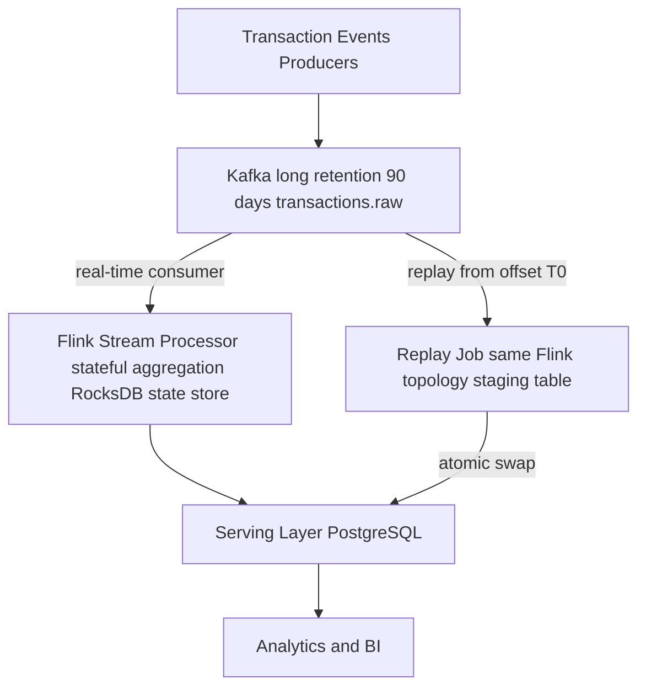

# Kappa Architecture

Status: Draft | Last Reviewed: 2026-05-16 | Owner: @data-platform-domain-owner
Catalog ID: DATA-007 | Radii
Tier Applicability: T2, T3

## Problem Statement

- Lambda Architecture's dual batch+streaming stacks double operational burden: two code bases, two deployment pipelines, two on-call runbooks. When the batch and speed layers diverge (different business logic versions), reconciling discrepancies consumes significant engineering time.
- Historical recomputation in Lambda requires re-running expensive Spark jobs over years of S3 data; Kappa leverages Kafka's long-retention log as the replayable source of truth, eliminating the need for a separate batch layer entirely.
- When a bug is found in stream processing logic, Lambda requires both a Spark backfill job AND a Flink job restart; Kappa only requires replaying from the beginning of the affected Kafka offset with corrected code — a single operation.
- Operational monitoring complexity: Lambda teams must manage health of both Spark clusters and Flink clusters; Kappa teams manage only Flink (or Kafka Streams), reducing the number of systems requiring 24/7 on-call coverage.

## Context

Kappa Architecture uses a single stream processing system (Apache Flink or Kafka Streams) for both real-time processing and historical reprocessing. Historical reprocessing is triggered by replaying Kafka topics from an earlier offset through the same job. Kappa is appropriate when the Kafka topic retention period covers the required historical horizon (typically 90–365 days for banking analytics) and when stream processing can handle the replay throughput.

## Solution

All raw events are persisted to Kafka with a long retention period (configurable per topic, e.g., 90 days for transactions). The Flink stream processing job continuously processes new events and writes aggregated results to the serving layer (PostgreSQL). When historical reprocessing is needed (bug fix, new metric), a separate replay job is launched from an earlier Kafka offset, using the same Flink topology but writing to a staging table. Once replay completes, the serving layer atomically swaps from the old results to the replayed results.



## Implementation Guidelines

### 1. Flink Stateful Stream Processor

```java
public class KappaAggregationJob {

    public static void main(String[] args) throws Exception {
        StreamExecutionEnvironment env = StreamExecutionEnvironment.getExecutionEnvironment();
        env.setParallelism(8);
        env.setStateBackend(new EmbeddedRocksDBStateBackend(true));
        env.getCheckpointConfig().setCheckpointInterval(60_000);
        env.getCheckpointConfig().setCheckpointStorage("s3://techcombank-flink-checkpoints/");

        KafkaSource<TransactionEvent> source = KafkaSource.<TransactionEvent>builder()
            .setBootstrapServers("kafka:9092")
            .setTopics("transactions.raw")
            .setGroupId("kappa-aggregation")
            .setStartingOffsets(OffsetsInitializer.committedOffsets(
                OffsetResetStrategy.EARLIEST))
            .setValueOnlyDeserializer(new TransactionEventDeserializer())
            .build();

        env.fromSource(source,
                WatermarkStrategy.<TransactionEvent>forBoundedOutOfOrderness(Duration.ofMinutes(5))
                    .withTimestampAssigner((e, ts) -> e.eventTs().toEpochMilli()),
                "kafka-source")
            .keyBy(e -> e.mcc() + "|" + e.channel())
            .window(TumblingEventTimeWindows.of(Time.hours(1)))
            .aggregate(new TxnAggregator())
            .addSink(new JdbcSink<>(
                "INSERT INTO analytics.kappa_hourly_agg " +
                "(window_start, mcc, channel, total_amount, txn_count) VALUES (?,?,?,?,?) " +
                "ON CONFLICT (window_start, mcc, channel) DO UPDATE SET " +
                "total_amount = EXCLUDED.total_amount, txn_count = EXCLUDED.txn_count",
                new TxnAggRowMapper(),
                JdbcExecutionOptions.builder().withBatchSize(1000).build(),
                new JdbcConnectionOptions.JdbcConnectionOptionsBuilder()
                    .withUrl(pgUrl).withDriverName("org.postgresql.Driver").build()
            ));

        env.execute("kappa-aggregation");
    }
}
```

### 2. Kafka Topic Retention Configuration

```bash
kafka-configs.sh --bootstrap-server kafka:9092 --entity-type topics \
  --entity-name transactions.raw --alter \
  --add-config retention.ms=7776000000
```

### 3. Replay Job — Historical Reprocessing from Specific Offset

```java
KafkaSource<TransactionEvent> replaySource = KafkaSource.<TransactionEvent>builder()
    .setBootstrapServers("kafka:9092")
    .setTopics("transactions.raw")
    .setGroupId("kappa-replay-" + replayRunId)
    .setStartingOffsets(OffsetsInitializer.timestamp(
        Instant.now().minus(30, ChronoUnit.DAYS).toEpochMilli()))
    .setBounded(OffsetsInitializer.latest())
    .setValueOnlyDeserializer(new TransactionEventDeserializer())
    .build();

// Write replay output to staging table.
// After replay completes, atomic swap:
// RENAME TABLE kappa_hourly_agg TO kappa_hourly_agg_old;
// RENAME TABLE kappa_hourly_agg_staging TO kappa_hourly_agg;
// DROP TABLE kappa_hourly_agg_old;
```

## When to Use

- Analytics pipelines where a single stream processing model satisfies both real-time and historical requirements — operational simplicity is prioritized over absolute historical correctness guarantees.
- Environments where Kafka retention can cover the required historical horizon (90–365 days for typical banking analytics) at acceptable cost.
- Teams that want to eliminate Lambda's operational complexity while retaining the ability to reprocess history when stream logic changes.

## When Not to Use

- Historical horizon requirements exceed Kafka retention limits (e.g., 7-year BCBS 239 audit trail) — Kafka retention for 7 years is prohibitively expensive; Lambda with S3 batch layer is more cost-effective.
- Streaming business logic is fundamentally different from batch logic (e.g., late data handling in batch uses manual reconciliation not possible in stream).
- Regulatory requirements demand a separate "definitive" batch computation that is provably independent of streaming pre-computation — Lambda's batch layer provides this separation; Kappa does not.

## Variants

| Variant | When to prefer | Trade-off |
|---------|----------------|-----------|
| Kappa with Flink (this pattern) | Stateful aggregations, complex CEP, event-time watermarks | Flink operational complexity; checkpoint management required |
| Kappa with Kafka Streams | Simple stateless or lightweight-stateful transformations; no separate cluster | Limited to Kafka ecosystem; less flexible than Flink for complex analytics |
| Kappa with Apache Beam | Multi-runner portability; can run on Flink, Spark, or Dataflow | Abstraction overhead; Beam's runner support varies by feature |

## NFR Acceptance Criteria

| Metric | Threshold | Measurement |
|--------|-----------|-------------|
| Real-time processing lag | p99 ≤ 1 s (event time to serving layer) | Kafka consumer lag metric; assert p99 ≤ 1 s end-to-end |
| Replay throughput | ≥ 10M events/hour | Trigger 30-day replay; measure events/hour until completion |
| Checkpoint completion | p99 ≤ 30 s (Flink checkpoint to S3) | Flink checkpoint duration metric; assert p99 ≤ 30 s |
| State store size (RocksDB) | ≤ 50 GB per TaskManager | Monitor `rocksdb.estimate-live-data-size`; alert if > 40 GB |
| Replay correctness | Serving layer after replay = within 0.01% of batch-computed ground truth | Compare replay output to Spark-computed baseline on same dataset |

## Compliance Mapping

| Ring | Regulation | Provision | How this pattern satisfies |
|------|-----------|-----------|---------------------------|
| Ring 0 | DAMA-DMBOK | Data architecture — single version of truth | Kappa's single processing path eliminates Lambda's "two versions of truth" problem; replay from Kafka produces deterministic results when the job is idempotent. |
| Ring 1 | BCBS 239 | §6 — Timeliness: risk data must be available with sufficient frequency | Flink's continuous processing with p99 ≤ 1 s lag satisfies intraday risk freshness requirements; replay capability ensures historical corrections can be applied without full recomputation from archive. |
| Ring 2 | SBV Circular 09/2020 | §IV.4 — Real-time transaction monitoring ⚠️ (working summary — pending Legal review) | Flink stream processor meets sub-second freshness for SBV transaction monitoring requirements; Kafka 90-day retention enables 90-day replay horizon; Legal review required to confirm whether SBV §IV.4 requires an independent batch verification path (which Kappa lacks, unlike Lambda). |

## Cost / FinOps

- Kafka topic retention: `transactions.raw` at 1 TB/day × 90 days × LZ4 compression (~30 TB) = ~$700/month on MSK. Compare to Lambda's S3 cost (~$350/month) — Kafka retention is ~2× more expensive but eliminates Spark cluster cost.
- Flink cluster: 8 TaskManagers continuously = ~$3,600/year at `m6g.xlarge` pricing. No Spark cluster needed — Kappa is cost-neutral vs. Lambda for this profile.
- RocksDB state: 50 GB state × 8 TaskManagers = 400 GB SSD; include in TaskManager instance size selection.

## Threat Model

- **State corruption on checkpoint failure (Tampering)**: Flink RocksDB checkpoint to S3 fails silently; Flink restores from a stale checkpoint, producing incorrect aggregates for the gap period. Mitigation: `CheckpointConfig.setTolerableCheckpointFailureNumber(0)` causes job failure on any checkpoint failure; job restarts from the last successful checkpoint, replaying Kafka from that offset.
- **Kafka topic truncation before replay completes (Denial of Service)**: A retention policy change truncates events needed for a historical replay; the replay job processes a shorter range, producing incomplete results. Mitigation: Kafka topic deletion requires `delete.topic.enable=true` (disabled in production); retention changes require CAB approval; replay jobs validate that the earliest available offset covers the requested replay range before starting.

## Runbook Stub

**Alert: `flink_job_restarting`**
- p50 baseline: N/A | p99 SLO: restarts < 3 times/hour
- Remediation: (1) Check Flink Web UI for exception at `http://flink-dashboard:8081`. (2) Common causes: OOMError in RocksDB (increase TaskManager heap); Kafka broker unreachable (check MSK health); deserialization error (schema version mismatch). (3) If restart loop > 3 times/hour, pause the job to prevent Kafka consumer lag buildup; page on-call data engineer.

**Alert: `kafka_consumer_lag_kappa > 100000`**
- p50 baseline: ≤ 1,000 messages | p99 SLO: ≤ 10,000 messages
- Remediation: (1) Scale Flink parallelism: increase `env.setParallelism()` and redeploy. (2) If Kafka partition count is the bottleneck, add partitions (requires coordinator approval). (3) Check RocksDB compaction if state backend is the bottleneck.

## Test Strategy Stub

- **Unit**: `TxnAggregatorTest` — 10 events in same window produce correct total; 0 events produce empty output; large amount (VND 10B) does not overflow. `KappaIdempotencyTest` — same event replayed twice produces same result via `ON CONFLICT DO UPDATE`.
- **Integration**: Flink MiniCluster test: publish 10,000 events to embedded Kafka; run Kappa job; assert serving layer row count and total_amount match expected.
- **Replay**: Publish 10,000 events; run live job; introduce aggregation bug; run replay job from earliest offset with fixed code to staging table; assert staging table matches ground truth within 0.01%.
- **Compliance**: BCBS 239 §6 timeliness: time event ingestion to serving layer update; assert p99 ≤ 1 s under 10,000 events/s load. Replay completeness: configure 30-day retention; trigger 30-day replay; assert 100% of events appear in replay output.

## Related Patterns

- [DATA-006 Lambda Architecture](lambda-architecture.md) — alternative dual-layer approach for longer historical horizons
- [DATA-008 Change Data Capture](change-data-capture.md) — Debezium CDC feeds the Kafka topic consumed by Kappa
- [INT-002 CDC + Outbox Pattern](../../patterns/integration/cdc-outbox-pattern.md) — reliable event publishing to Kafka from operational databases
- [COMP-005 BCBS 239 Deep Dive](../../compliance/basel-bcbs-239.md) — timeliness requirements

## References

- Kreps, J. (2014) — "Questioning the Lambda Architecture" (O'Reilly Radar)
- [Apache Flink Documentation — State Backends](https://nightlies.apache.org/flink/flink-docs-release-1.18/docs/ops/state/state_backends/)
- [Apache Flink — Kafka Connector](https://nightlies.apache.org/flink/flink-docs-release-1.18/docs/connectors/datastream/kafka/)
- [BCBS 239 — Principles for Effective Risk Data Aggregation](https://www.bis.org/publ/bcbs239.htm)
- Catalog reference: `governance/standards/enterprise-architecture-catalog.md`
