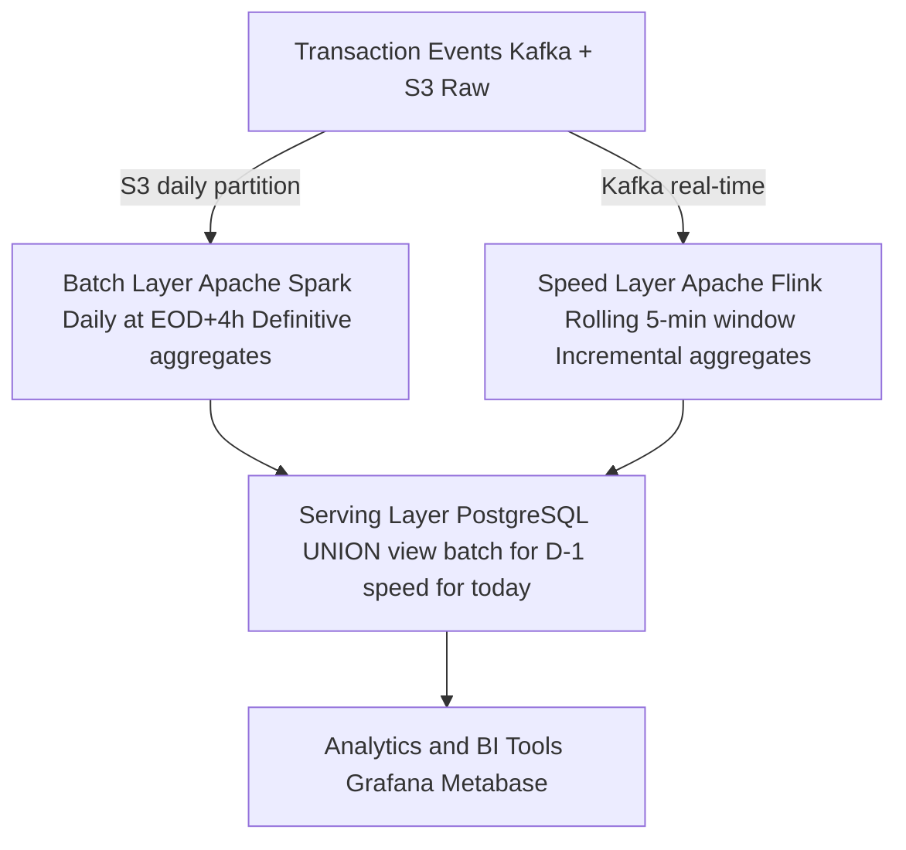

# Lambda Architecture

Status: Draft | Last Reviewed: 2026-05-16 | Owner: @data-platform-domain-owner
Catalog ID: DATA-006 | Radii
Tier Applicability: T2, T3

## Problem Statement

- Banking analytics require both historical completeness (full daily/monthly aggregations over years of data) and near-real-time freshness (fraud velocity, intraday P&L); no single processing system satisfies both at banking scale without architectural separation.
- End-of-day batch jobs (Apache Spark) produce definitive, recomputed aggregations that reconcile all late-arriving data — but they complete 4 hours after midnight, making intraday queries stale.
- Stream processing systems (Flink, Kafka Streams) provide sub-5-minute freshness but cannot efficiently recompute multi-year historical aggregations when late-arriving data requires correction.
- Downstream BI tools query a single serving layer; without a unified view that merges batch and streaming outputs, analysts must query two systems and manually reconcile discrepancies, introducing errors.
- BCBS 239 §5 requires completeness: risk reports must account for all transactions including late-arrivals; streaming-only pipelines that discard late data cannot satisfy this requirement.

## Context

Lambda Architecture splits data processing into a batch layer (recomputes correct historical aggregates from raw data), a speed layer (processes new events in near-real-time), and a serving layer (merges both for queries). In Techcombank's context, the batch layer runs Apache Spark on the EOD batch window (BSP-004), and the speed layer runs Apache Flink consuming from Kafka. The serving layer is a PostgreSQL view that UNION ALLs batch and incremental results.

## Solution

Raw events land in Kafka and S3 simultaneously. The batch layer (Spark, daily) reads from S3, recomputes definitive daily aggregates, and writes to `batch_results` table. The speed layer (Flink) reads from Kafka, computes rolling incremental aggregates, and writes to `speed_results` table (overwritten each run). The serving layer merges both: for dates before today, use batch results (definitive); for today, use speed results (fresh but preliminary). On batch completion, today's batch result supersedes the speed result.



## Implementation Guidelines

### 1. Spark Batch Layer (Daily Aggregation)

```python
# spark_daily_aggregation.py
from pyspark.sql import SparkSession
from pyspark.sql.functions import col, sum as _sum, count, to_date

spark = SparkSession.builder \
    .appName("lambda-batch-daily") \
    .config("spark.sql.adaptive.enabled", "true") \
    .getOrCreate()

raw = spark.read.parquet(
    f"s3://techcombank-datalake/transactions/dt={batch_date}/"
)

daily = raw.groupBy(
    to_date("event_ts").alias("txn_date"),
    "mcc",
    "channel"
).agg(
    _sum("amount").alias("total_amount"),
    count("*").alias("txn_count")
)

daily.write.mode("overwrite").partitionBy("txn_date").parquet(
    "s3://techcombank-datalake/batch-results/"
)

daily.write.jdbc(
    url=pg_url,
    table="analytics.batch_daily_agg",
    mode="overwrite",
    properties=jdbc_props
)
```

### 2. Flink Speed Layer (Rolling Window)

```java
public class DailyIncrementalJob {

    public static void main(String[] args) throws Exception {
        StreamExecutionEnvironment env = StreamExecutionEnvironment.getExecutionEnvironment();
        env.setParallelism(4);

        KafkaSource<TransactionEvent> source = KafkaSource.<TransactionEvent>builder()
            .setBootstrapServers("kafka:9092")
            .setTopics("transactions.raw")
            .setGroupId("lambda-speed-layer")
            .setValueOnlyDeserializer(new TransactionEventDeserializer())
            .build();

        DataStream<TransactionEvent> events = env.fromSource(
            source, WatermarkStrategy
                .<TransactionEvent>forBoundedOutOfOrderness(Duration.ofMinutes(5))
                .withTimestampAssigner((e, ts) -> e.eventTs().toEpochMilli()),
            "kafka-source"
        );

        events
            .keyBy(e -> e.mcc() + "|" + e.channel())
            .window(TumblingEventTimeWindows.of(Time.minutes(5)))
            .aggregate(new TxnAggregator(), new TxnWindowFunction())
            .addSink(new JdbcSink<>(
                "INSERT INTO analytics.speed_incremental_agg " +
                "(window_start, mcc, channel, total_amount, txn_count) VALUES (?,?,?,?,?) " +
                "ON CONFLICT (window_start, mcc, channel) DO UPDATE SET " +
                "total_amount = EXCLUDED.total_amount, txn_count = EXCLUDED.txn_count",
                new TxnAggRowMapper(),
                JdbcExecutionOptions.builder().withBatchSize(500).build(),
                new JdbcConnectionOptions.JdbcConnectionOptionsBuilder()
                    .withUrl(pgUrl).withDriverName("org.postgresql.Driver").build()
            ));

        env.execute("lambda-speed-layer");
    }
}
```

### 3. Serving Layer — PostgreSQL Union View

```sql
CREATE OR REPLACE VIEW analytics.v_daily_agg AS
SELECT txn_date, mcc, channel, total_amount, txn_count, 'batch' AS source
FROM analytics.batch_daily_agg
WHERE txn_date < CURRENT_DATE

UNION ALL

SELECT DATE(window_start) AS txn_date, mcc, channel,
       SUM(total_amount) AS total_amount, SUM(txn_count) AS txn_count,
       'speed' AS source
FROM analytics.speed_incremental_agg
WHERE DATE(window_start) = CURRENT_DATE
GROUP BY 1, 2, 3;
```

## When to Use

- Analytics workloads requiring both historical completeness (BCBS 239 §5) and near-real-time freshness (intraday risk, fraud velocity) that cannot be satisfied by a single processing model.
- Environments where late-arriving data (T24 EOD postings arriving 2–3 hours after transaction time) must be reconciled into definitive historical records without discarding early stream results.
- Teams with mature Spark and Flink operational capabilities — Lambda adds two processing paths to maintain; only adopt when the team can operate both.

## When Not to Use

- Workloads where stream processing alone satisfies freshness and completeness requirements — Lambda's operational complexity is not justified. Prefer DATA-007 Kappa Architecture when Kafka replay covers historical reprocessing.
- Simple daily batch analytics without real-time requirements — a single Spark batch job is operationally simpler and cheaper.
- Startup environments or small data teams — Lambda requires separate expertise for Spark and Flink; the operational burden outweighs the benefits for teams under 5 data engineers.

## Variants

| Variant | When to prefer | Trade-off |
|---------|----------------|-----------|
| Lambda (this pattern) | Both historical recomputation AND real-time freshness required; late data reconciliation critical | Two processing stacks to maintain; serving layer merge adds query complexity |
| Kappa (DATA-007) | Historical reprocessing via Kafka replay is sufficient; single processing model preferred | Kafka retention cost for long history; no separate batch correctness guarantee |
| Pure batch (Spark only) | No real-time requirement; BCBS 239 completeness is the only driver | 4+ hour staleness; intraday queries impossible |

## NFR Acceptance Criteria

| Metric | Threshold | Measurement |
|--------|-----------|-------------|
| Batch layer completion (EOD+) | ≤ 4 h after EOD batch close | Monitor Spark job completion; alert if not complete by 04:00 |
| Speed layer freshness | ≤ 5 min lag (Kafka event to serving layer) | Measure Kafka consumer lag on speed layer group; assert p99 ≤ 5 min |
| Serving layer query p99 | ≤ 3 s (30-day range, all MCCs) | EXPLAIN ANALYZE on `v_daily_agg` with 30-day date filter; assert p99 ≤ 3 s |
| Batch completeness (BCBS 239 §5) | 100% of transactions in S3 partition appear in batch aggregates | Row count reconciliation: `SELECT COUNT(*) FROM raw` vs. `SUM(txn_count) FROM batch_daily_agg` per date |
| Speed-to-batch handover correctness | Serving layer switches from speed to batch within 5 min of batch commit | Integration test: commit batch for today; query serving layer; assert `source = 'batch'` within 5 min |

## Compliance Mapping

| Ring | Regulation | Provision | How this pattern satisfies |
|------|-----------|-----------|---------------------------|
| Ring 0 | DAMA-DMBOK | Data architecture — separation of concerns between raw, processed, and serving layers | Lambda's three-layer architecture (raw → batch/speed → serving) follows DAMA data lake zoning principles; raw data is immutable in S3; all transformations are replayable. |
| Ring 1 | BCBS 239 | §5 — Completeness: risk data must account for all transactions, including late arrivals | Batch layer daily recomputation from immutable S3 raw partitions ensures late-arriving transactions are included in definitive aggregates; `source` column in serving view distinguishes preliminary (speed) from definitive (batch) results for audit purposes. |
| Ring 2 | SBV Circular 09/2020 | §IV.4 — Real-time risk monitoring requirements ⚠️ (working summary — pending Legal review) | Speed layer provides ≤5-minute freshness for intraday risk dashboards required by SBV §IV.4; batch layer provides the definitive regulatory submission data; Legal review required to confirm whether SBV §IV.4 "real-time" means sub-5-minute or sub-1-minute for specific report types. |

## Cost / FinOps

- Spark batch cluster: 10-node `m6g.2xlarge` cluster × 4 hours/day = 40 node-hours/day = ~$4,500/year. Right-size with Spark adaptive query execution — often reduces node hours by 30%.
- Flink stream cluster: 4 TaskManagers running continuously = ~$1,800/year at `m6g.large` pricing. Scale down during off-peak using Flink autoscaling.
- S3 storage: raw event partitions at 1 TB/year; batch result partitions at ~50 GB/year; ZSTD compression reduces both by ~60%.
- Operational cost: Lambda requires two on-call runbooks (Spark + Flink). If Kappa Architecture (DATA-007) satisfies requirements, single-stack operational cost is ~40% lower.

## Threat Model

- **Serving layer inconsistency during batch-to-speed handover (Tampering)**: A query arriving exactly when batch results are being written to the serving layer may read a mix of old batch results and stale speed results for the same date. Mitigation: batch writes to a staging table first; atomic view swap (`CREATE OR REPLACE VIEW`) after staging write completes — the DDL executes atomically in PostgreSQL.
- **Late data silently missed by speed layer (Information Disclosure)**: Events arriving more than 5 minutes after event time are dropped by Flink's watermark strategy; they appear in serving layer speed results with incorrect totals until the batch layer runs. Mitigation: Flink side output captures late events to a separate Kafka topic `transactions.late`; a late-data recovery job adds these to the speed aggregates; batch layer always produces the definitive figure regardless.

## Runbook Stub

**Alert: `spark_batch_job_failed`**
- p50 baseline: N/A | p99 SLO: completes by 04:00
- Remediation: (1) Check Spark history server for failed stage. (2) Common failures: S3 read throttling — retry with exponential backoff; OOM on executor — increase `spark.executor.memory`. (3) If batch misses the 04:00 SLA, serving layer continues to use speed results for the day — add `STALE_BATCH` alert and notify downstream consumers.

**Alert: `flink_speed_lag_minutes > 10`**
- p50 baseline: ≤ 2 min | p99 SLO: ≤ 5 min
- Remediation: (1) Check Flink job metrics: Kafka consumer lag on `transactions.raw`. (2) If lag is growing, scale Flink TaskManagers: `kubectl scale deploy flink-taskmanager --replicas=8`. (3) Check for checkpoint failures in Flink UI — checkpoint failure pauses processing.

## Test Strategy Stub

- **Unit**: `TxnAggregatorTest` — accumulate 5 events; assert total_amount = sum of all amounts; assert txn_count = 5. `ServingViewTest` — mock batch and speed tables; assert view returns batch rows for D-1 and speed rows for today; assert no duplicates.
- **Integration**: Testcontainers (Kafka + PostgreSQL + Flink local): publish 1,000 events; wait 5 minutes; query serving layer; assert speed results appear. Simulate batch write for today; assert serving layer switches to batch within 5 minutes.
- **Late data**: Publish event with timestamp 10 minutes in the past (beyond watermark); assert event appears in `transactions.late` side output; run late recovery job; assert serving layer total updated.
- **Compliance**: BCBS 239 §5 completeness: generate 100,000 events with 5% late-arriving (> 5 min); run full batch cycle; assert 100% of events appear in batch aggregates; assert zero silently dropped.

## Related Patterns

- [DATA-007 Kappa Architecture](kappa-architecture.md) — simpler single-layer alternative when Kafka replay is sufficient
- [DATA-008 Change Data Capture](change-data-capture.md) — raw event source feeding both Lambda layers
- [BSP-004 End-of-Day Batch Window](../../patterns/banking-solutions/end-of-day-batch-window.md) — defines the batch window the Spark layer must complete within
- [COMP-005 BCBS 239 Deep Dive](../../compliance/basel-bcbs-239.md) — completeness and timeliness requirements driving Lambda adoption

## References

- Marz, N. & Warren, J. (2015) — Big Data: Principles and Best Practices of Scalable Realtime Data Systems
- [Apache Spark Documentation — Structured Streaming](https://spark.apache.org/docs/latest/structured-streaming-programming-guide.html)
- [Apache Flink Documentation — Event Time and Watermarks](https://nightlies.apache.org/flink/flink-docs-release-1.18/docs/dev/datastream/event-time/generating_watermarks/)
- [BCBS 239 — Principles for Effective Risk Data Aggregation](https://www.bis.org/publ/bcbs239.htm)
- Catalog reference: `governance/standards/enterprise-architecture-catalog.md`
