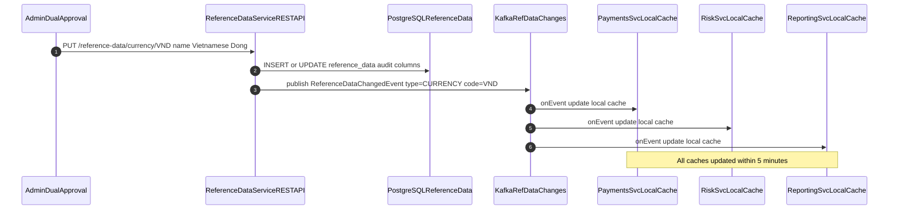

# Reference Data Master

Status: Draft | Last Reviewed: 2026-05-16 | Owner: @data-platform-domain-owner
Catalog ID: DATA-013 | Radii
Tier Applicability: T0, T1

## Problem Statement

- Hardcoded reference data (currency codes, MCC codes, country codes, product codes) duplicated across 50+ microservices creates divergence over time: one service uses ISO 4217 `VND`, another uses `704`, a third uses `VietnamDong` — inter-service data joins fail silently.
- Schema changes to reference data (a new product code, a deprecated MCC code, a regulatory addition of a new currency) require coordinated deployments across all consuming services — change management overhead is proportional to the number of duplicated copies.
- ISO 20022 messaging (COMP-007) requires canonical reference data codes (BIC, LEI, currency, country); if the payment service uses a non-canonical code, the ISO 20022 message fails validation at NAPAS or SWIFT.
- Reference data inconsistency causes BCBS 239 §6 timeliness violations: if a new risk category code is added to the risk engine but downstream reporting services have not updated their local copy, risk reports contain uncategorized transactions.

## Context

Reference Data Master is a microservice owning the canonical set of reference codes used across Techcombank's platform. It publishes changes to a Kafka topic (`ref-data.changes`) so all consumers maintain an eventually consistent local cache. A REST API (`GET /reference-data/{type}/{code}`) provides synchronous lookup for services that cannot maintain a local cache. The master database is PostgreSQL 16 with full audit columns; changes are made via an administrative API requiring dual-approval (matching SEC-010 ABAC controls for sensitive data changes).

## Solution

The `ReferenceDataService` Spring Boot application owns a PostgreSQL `reference_data` table with audit columns. Administrators update reference data via authenticated REST API; all changes are published to Kafka topic `ref-data.changes`. Each consuming microservice runs a `ReferenceDataConsumer` that maintains an in-memory cache with 1-hour TTL (refreshed on every Kafka event); on cache miss, the consumer falls back to the synchronous REST API. Zero hardcoded enum values in consuming services — all reference data lookups go through the cache.



## Implementation Guidelines

### 1. Reference Data Table DDL (PostgreSQL 16)

```sql
CREATE TABLE reference_data (
    id             BIGSERIAL    NOT NULL PRIMARY KEY,
    ref_type       VARCHAR(50)  NOT NULL,
    code           VARCHAR(20)  NOT NULL,
    name           VARCHAR(255) NOT NULL,
    metadata       JSONB,
    active         BOOLEAN      NOT NULL DEFAULT TRUE,
    effective_from DATE         NOT NULL DEFAULT CURRENT_DATE,
    effective_to   DATE,
    created_by     VARCHAR(100) NOT NULL,
    created_at     TIMESTAMPTZ  NOT NULL DEFAULT NOW(),
    updated_by     VARCHAR(100),
    updated_at     TIMESTAMPTZ,
    UNIQUE (ref_type, code, effective_from)
);

CREATE INDEX idx_ref_data_lookup ON reference_data(ref_type, code, active);
```

### 2. ReferenceDataService (Spring Boot 3.x)

```java
@Service
@RequiredArgsConstructor
@Slf4j
public class ReferenceDataService {

    private final ReferenceDataRepository repo;
    private final KafkaTemplate<String, ReferenceDataChangedEvent> kafka;

    @Transactional
    public ReferenceData update(String refType, String code,
                                 ReferenceDataUpdateRequest req,
                                 String updatedBy) {
        ReferenceData existing = repo.findActiveByTypeAndCode(refType, code)
            .orElseGet(ReferenceData::new);

        existing.setRefType(refType);
        existing.setCode(code);
        existing.setName(req.name());
        existing.setMetadata(req.metadata());
        existing.setUpdatedBy(updatedBy);
        existing.setUpdatedAt(Instant.now());

        ReferenceData saved = repo.save(existing);

        kafka.send("ref-data.changes",
            refType + ":" + code,
            new ReferenceDataChangedEvent(
                refType, code, req.name(), req.metadata(), Instant.now()));

        return saved;
    }

    public Optional<ReferenceData> lookup(String refType, String code) {
        return repo.findActiveByTypeAndCode(refType, code);
    }
}
```

### 3. ReferenceDataConsumer — Local Cache (Java 21)

```java
@Service
@Slf4j
public class ReferenceDataConsumer {

    private final ReferenceDataClient restClient;
    private final Cache<String, ReferenceDataDto> localCache;

    public ReferenceDataConsumer(ReferenceDataClient restClient) {
        this.restClient = restClient;
        this.localCache = Caffeine.newBuilder()
            .expireAfterWrite(1, TimeUnit.HOURS)
            .maximumSize(50_000)
            .build();
    }

    @KafkaListener(topics = "ref-data.changes",
                   groupId = "ref-data-consumer-#{T(java.util.UUID).randomUUID()}")
    public void onRefDataChange(ReferenceDataChangedEvent event) {
        String key = event.refType() + ":" + event.code();
        localCache.put(key, ReferenceDataDto.from(event));
    }

    public ReferenceDataDto get(String refType, String code) {
        String key = refType + ":" + code;
        ReferenceDataDto cached = localCache.getIfPresent(key);
        if (cached != null) return cached;
        return restClient.lookup(refType, code)
            .map(dto -> { localCache.put(key, dto); return dto; })
            .orElseThrow(() -> new ReferenceDataNotFoundException(refType, code));
    }
}
```

### 4. Dual-Approval Admin API Controller

```java
@RestController
@RequestMapping("/reference-data")
@RequiredArgsConstructor
public class ReferenceDataAdminController {

    private final ReferenceDataService service;
    private final ApprovalWorkflowService approvalService;

    @PutMapping("/{refType}/{code}")
    @PreAuthorize("hasRole('REF_DATA_EDITOR')")
    public ResponseEntity<ReferenceData> update(
            @PathVariable String refType,
            @PathVariable String code,
            @RequestBody ReferenceDataUpdateRequest request,
            Authentication auth) {

        ApprovalRequest approval = approvalService.create(
            "ref-data-update:" + refType + ":" + code,
            request, auth.getName());

        if (!approvalService.isApproved(approval.id())) {
            return ResponseEntity.accepted()
                .header("X-Approval-Id", approval.id())
                .build();
        }

        ReferenceData updated = service.update(refType, code, request, auth.getName());
        return ResponseEntity.ok(updated);
    }
}
```

## When to Use

- Any T0/T1 platform where multiple microservices share reference code sets (currency, MCC, country, product codes) and consistency across services is a compliance requirement (ISO 20022, BCBS 239).
- Environments where reference data changes must be propagated to all consumers within 5 minutes without requiring service restarts or deployments.
- ISO 20022 messaging pipelines where canonical BIC, LEI, and currency codes must match the ISO standard exactly — a central master prevents drift.

## When Not to Use

- Single-service applications where reference data is purely internal — a local `enum` or database table is simpler; Kafka fan-out adds operational overhead without benefit.
- Reference data that changes rarely (< 1 change per year) and has < 5 consuming services — a manual synchronized update is acceptable; the Kafka publishing infrastructure is over-engineering.
- Reference data with very high cardinality (> 1M unique codes) and high query frequency — Caffeine cache size limits may prevent caching all codes; use a distributed cache (Redis) instead.

## Variants

| Variant | When to prefer | Trade-off |
|---------|----------------|-----------|
| Kafka event-driven (this pattern) | Near-real-time propagation; many consumers; decoupled updates | Eventual consistency — consumers may lag up to 5 min; Kafka required |
| REST API pull + TTL cache | Simple; no Kafka dependency; acceptable 1-hour staleness | Higher latency for cache miss; no push notification on change |
| Git-based reference data (static config) | Reference data changes < quarterly; version control is primary governance | No runtime updates; requires deployment to change reference data |

## NFR Acceptance Criteria

| Metric | Threshold | Measurement |
|--------|-----------|-------------|
| Propagation lag (change to all consumers) | p99 ≤ 5 min | Publish change; measure time until all consumer caches updated; assert p99 ≤ 5 min |
| Cache freshness | ≤ 1 h TTL for stale-hit | Caffeine TTL configured to 1 h; after 1 h without Kafka event, cache evicts and falls back to REST API |
| REST API fallback p99 | ≤ 50 ms | Load test REST lookup endpoint; assert p99 ≤ 50 ms |
| Zero hardcoded reference codes | 0 hardcoded enum values for managed ref-types | ArchUnit rule: assert no Java enum contains values from managed ref-types |
| Dual-approval enforcement | 100% of updates require two distinct approvers | Integration test: single approver submits and approves; assert 403 on self-approval |

## Compliance Mapping

| Ring | Regulation | Provision | How this pattern satisfies |
|------|-----------|-----------|---------------------------|
| Ring 0 | ISO 4217 / ISO 3166 | Canonical currency and country codes | ReferenceDataService is the authoritative store for ISO 4217 currency codes and ISO 3166 country codes; all consuming services use canonical codes from the master, eliminating the risk of non-standard codes in ISO 20022 messages. |
| Ring 1 | BCBS 239 | §6 — Timeliness: reference data changes must propagate to risk systems within defined SLA | Kafka fan-out ensures all risk-relevant services receive reference data changes within p99 5 minutes; SLA is measurable via Kafka consumer lag monitoring; no manual deployment required for reference data updates. |
| Ring 2 | SBV Circular 09/2020 | §IV.3 — Data governance: reference data must be managed with documented change control ⚠️ (working summary — pending Legal review) | Dual-approval admin API implements change control; all changes logged to PostgreSQL `reference_data` audit columns with `created_by`/`updated_by`; Kafka event log provides a chronological change history; Legal review required to confirm that dual-approval workflow satisfies SBV §IV.3 change control requirements. |

## Cost / FinOps

- ReferenceDataService: single Spring Boot pod + PostgreSQL RDS `db.t3.medium` = ~$1,200/year. Shared across all consuming services.
- Kafka topic `ref-data.changes`: low-frequency (< 100 changes/year); 7-day retention; negligible storage cost.
- Caffeine local cache: 50,000 entries × ~200 bytes = ~10 MB per JVM instance. Zero additional infrastructure cost — embedded in each consuming service.
- Cost of NOT using Reference Data Master: one inconsistent reference code causing an ISO 20022 payment rejection at NAPAS costs ~2 hours of SRE investigation + possible SBV notification. Even one such incident per year justifies the $1,200/year infrastructure cost.

## Threat Model

- **Unauthorized reference data modification (Tampering)**: An attacker with `REF_DATA_EDITOR` role modifies a canonical MCC code, causing all payment transactions to be miscategorized in regulatory reports. Mitigation: dual-approval requirement ensures a second authorized user must confirm the change; OPA ABAC policy restricts `REF_DATA_EDITOR` role to a small group of data governance staff; all changes logged with `updated_by` and immutable Kafka event history.
- **Cache poisoning via malicious Kafka event (Tampering)**: A compromised Kafka producer publishes a fraudulent `ReferenceDataChangedEvent` to `ref-data.changes`, overwriting canonical codes in all consumer caches. Mitigation: Kafka ACL restricts `ref-data.changes` producer to the `ReferenceDataService` service account only; consumers validate event schema via Schema Registry; suspicious cache updates trigger an anomaly alert.

## Runbook Stub

**Alert: `ref_data_propagation_lag_minutes > 10`**
- p50 baseline: ≤ 2 min | p99 SLO: ≤ 5 min
- Remediation: (1) Check Kafka consumer lag for `ref-data-consumer` groups: `kafka-consumer-groups.sh --describe --all-groups | grep ref-data`. (2) Identify which service has a lagging consumer. (3) Check service pod logs for deserialization errors. (4) If consumer group is stuck, restart the consuming service pod.

**Alert: `ref_data_hardcoded_enum_detected`** (ArchUnit CI gate failure)
- p50 baseline: 0 violations | p99 SLO: 0 violations
- Remediation: Pipeline BLOCKED — (1) Identify the offending class from CI output. (2) Replace hardcoded enum values with `ReferenceDataConsumer.get("TYPE", "CODE")` calls. (3) Re-run ArchUnit tests; assert 0 violations before merge.

## Test Strategy Stub

- **Unit**: `ReferenceDataConsumerTest` — publish Kafka event; assert cache updated within 1 s; call `get()` for cached key; assert no REST fallback. Cache TTL expiry; call `get()`; assert REST fallback invoked. `ReferenceDataServiceTest` — mock Kafka template; call `update()`; assert `kafka.send()` called with correct event.
- **Integration**: Spring Boot Test with Testcontainers (PostgreSQL + Kafka): update `CURRENCY/VND`; assert Kafka event published; assert consuming service cache updated within 10 s.
- **Dual-approval**: single editor submits update; assert 202 Accepted; same editor approves; assert 403 Forbidden (self-approval blocked); second editor approves; assert 200 OK and Kafka event published.
- **Compliance**: ArchUnit — scan all service JARs; assert zero Java enums contain values from managed ref-types. BCBS 239 §6 — simulate RiskSvc cache miss for new risk category code; verify REST fallback returns within 50 ms; verify cache populated for subsequent calls.

## Related Patterns

- [DATA-008 Change Data Capture](change-data-capture.md) — CDC feeds initial reference data load from T24 source tables
- [COMP-007 ISO 20022 Messaging Deep Dive](../../compliance/iso-20022-messaging.md) — canonical code requirements that Reference Data Master satisfies
- [DATA-011 Data Quality Rules](data-quality-rules.md) — quality rules validate that reference codes in transaction data are in the master
- [SEC-010 Attribute-Based Access Control](../../patterns/security/attribute-based-access-control.md) — OPA ABAC controls for the dual-approval admin API

## References

- [ISO 4217 — Currency Codes](https://www.iso.org/iso-4217-currency-codes.html)
- [ISO 3166 — Country Codes](https://www.iso.org/iso-3166-country-codes.html)
- [ISO 18245 — Merchant Category Codes](https://www.iso.org/standard/33365.html)
- [Caffeine Cache — GitHub](https://github.com/ben-manes/caffeine)
- [BCBS 239 — §6 Timeliness](https://www.bis.org/publ/bcbs239.htm)
- Catalog reference: `governance/standards/enterprise-architecture-catalog.md`
