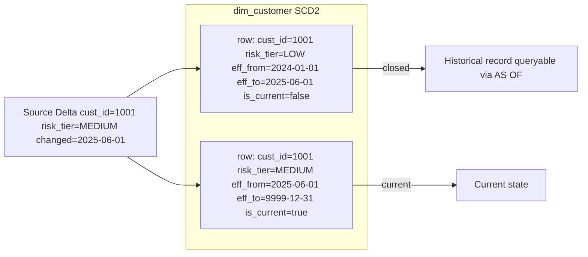

# Slowly Changing Dimensions (SCD Type 2)

Status: Draft | Last Reviewed: 2026-05-16 | Owner: @data-platform-domain-owner
Catalog ID: DATA-005 | Radii
Tier Applicability: T2, T3

## Problem Statement

- Customer profiles change over time (address, risk tier, product segment), but simple UPSERT overwrites the history, making it impossible to reconstruct which risk tier a customer held at the time of a historical transaction — violating BCBS 239 §4 accuracy requirements.
- Regulatory and audit queries require answering "what did we know at date X?" — SCD Type 1 (overwrite) or Type 0 (no change) cannot satisfy this; a time-travel mechanism is mandatory for regulatory reporting.
- Product portfolio changes (customer adds a new account type) cannot be modelled as a simple foreign key update; the relationship must be versioned to support cohort analysis and churn attribution.
- Traditional SCD2 implementations in application code are error-prone: developers forget the `current_flag` or `effective_to` column update, leaving dangling "current" records that corrupt downstream aggregations.
- Merge-based SCD2 loads in PostgreSQL require careful locking to prevent duplicate "current" rows under concurrent load; naive implementations produce data integrity violations at scale.

## Context

SCD Type 2 is the standard technique for tracking historical changes in dimension tables within a data warehouse or data lake. In Techcombank's context, the primary SCD2 dimensions are customer profile (address, NRIC status, risk classification), product holding (account type, credit limit), and branch assignment. These dimensions feed the regulatory reporting pipeline (COMP-005 BCBS 239) and risk analytics.

## Solution

Each dimension row carries `effective_from`, `effective_to` (9999-12-31 for the current row), and `is_current` boolean. On a detected change (hash of tracked columns differs from the current row), the existing current row is closed (`effective_to = change_date`, `is_current = false`) and a new row is inserted. Spring Batch processes daily delta files from the source system using a `ScdProcessor` that performs the hash comparison and generates INSERT/UPDATE pairs.



## Implementation Guidelines

### 1. SCD2 Table DDL (PostgreSQL 16)

```sql
CREATE TABLE dw.dim_customer (
    surrogate_key  BIGSERIAL    NOT NULL PRIMARY KEY,
    customer_id    VARCHAR(50)  NOT NULL,              -- natural/business key
    name           VARCHAR(255) NOT NULL,
    address        TEXT,
    risk_tier      VARCHAR(20)  NOT NULL,
    effective_from DATE         NOT NULL,
    effective_to   DATE         NOT NULL DEFAULT '9999-12-31',
    is_current     BOOLEAN      NOT NULL DEFAULT TRUE,
    row_hash       CHAR(64)     NOT NULL,              -- SHA-256 of tracked cols
    record_source  VARCHAR(100) NOT NULL
);

CREATE INDEX idx_dim_customer_bk ON dw.dim_customer(customer_id, is_current);
CREATE INDEX idx_dim_customer_range ON dw.dim_customer(customer_id, effective_from, effective_to);
```

### 2. SCD2 Merge Procedure (PostgreSQL)

```sql
CREATE OR REPLACE PROCEDURE dw.scd2_merge_customer(
    p_customer_id   VARCHAR,
    p_name          VARCHAR,
    p_address       TEXT,
    p_risk_tier     VARCHAR,
    p_change_date   DATE,
    p_record_source VARCHAR
) LANGUAGE plpgsql AS $$
DECLARE
    v_new_hash CHAR(64);
    v_old_hash CHAR(64);
BEGIN
    v_new_hash := encode(sha256((p_name || '|' || COALESCE(p_address,'') || '|' || p_risk_tier)::bytea), 'hex');

    SELECT row_hash INTO v_old_hash
    FROM dw.dim_customer
    WHERE customer_id = p_customer_id AND is_current = TRUE
    FOR UPDATE;

    IF NOT FOUND THEN
        INSERT INTO dw.dim_customer(customer_id, name, address, risk_tier,
                                     effective_from, is_current, row_hash, record_source)
        VALUES (p_customer_id, p_name, p_address, p_risk_tier,
                p_change_date, TRUE, v_new_hash, p_record_source);
    ELSIF v_old_hash != v_new_hash THEN
        UPDATE dw.dim_customer
        SET is_current = FALSE, effective_to = p_change_date - 1
        WHERE customer_id = p_customer_id AND is_current = TRUE;

        INSERT INTO dw.dim_customer(customer_id, name, address, risk_tier,
                                     effective_from, is_current, row_hash, record_source)
        VALUES (p_customer_id, p_name, p_address, p_risk_tier,
                p_change_date, TRUE, v_new_hash, p_record_source);
    END IF;
END;
$$;
```

### 3. Spring Batch SCD2 Processor (Java 21)

```java
@Component
@RequiredArgsConstructor
public class Scd2CustomerProcessor
        implements ItemProcessor<CustomerDelta, ScdMergeCommand> {

    private final DataVaultHasher hasher;
    private final DimCustomerRepository repo;

    @Override
    public ScdMergeCommand process(CustomerDelta delta) {
        String newHash = hasher.hubHash(
            delta.name() + "|" + delta.address() + "|" + delta.riskTier());

        Optional<DimCustomer> current = repo
            .findCurrentByCustomerId(delta.customerId());

        if (current.isEmpty() || !current.get().rowHash().equals(newHash)) {
            return ScdMergeCommand.changed(delta, newHash);
        }
        return null;
    }
}
```

### 4. dbt SCD2 Snapshot Model

```yaml

    {{
        config(
            target_schema='dw_snapshots',
            unique_key='customer_id',
            strategy='check',
            check_cols=['name', 'address', 'risk_tier']
        )
    }}
    SELECT customer_id, name, address, risk_tier, '{{ var("record_source") }}' AS record_source
    FROM {{ source('crm', 'customers') }}

```

## When to Use

- Dimension tables where point-in-time historical queries are required — "what was this customer's risk tier on 2025-01-15?" (BCBS 239 §4 accuracy, regulatory reporting).
- Customer, product, and branch dimensions with moderate change rates (< 10% rows changing per day) — SCD2 overhead is justified when historical accuracy matters.
- Data warehouse or data lake layers where audit queries need to reconstruct the exact dimension state that was visible to a batch job at run time.

## When Not to Use

- Rapidly changing dimensions (> 50% rows changing per day) — SCD2 produces table bloat and query complexity that outweighs the benefit; use Mini-Dimensions or bridge tables instead.
- Operational OLTP databases — SCD2 is a warehouse modeling technique; do not apply to T0/T1 transactional tables (use DATA-003 Temporal Tables for OLTP history).
- Dimensions with very high cardinality and frequent full reloads — full SCD2 merge on 500M rows is too slow for a 4-hour batch window; use partition swap (drop and reload) with a separate history table.

## Variants

| Variant | When to prefer | Trade-off |
|---------|----------------|-----------|
| SCD Type 2 (this pattern) | Full history required; BCBS 239 audit trail; cohort analysis | Table grows with every change; queries must filter `is_current = TRUE` |
| SCD Type 1 (overwrite) | Only current state needed; no historical queries; simple ETL | No history — regulatory and audit queries impossible |
| SCD Type 6 (hybrid 1+2+3) | Need both history (Type 2) and fast "previous value" access (Type 3 column) | Higher complexity; two current-state columns must be kept consistent |

## NFR Acceptance Criteria

| Metric | Threshold | Measurement |
|--------|-----------|-------------|
| SCD2 merge job duration (1M row dimension) | p99 ≤ 10 min | Spring Batch test with 1M row dimension; measure step duration |
| Historical point-in-time query | p99 ≤ 2 s | EXPLAIN ANALYZE: `SELECT * FROM dim_customer WHERE customer_id = ? AND effective_from <= ? AND effective_to > ?`; assert p99 ≤ 2 s |
| Duplicate current row rate | 0 | SQL: `SELECT customer_id, COUNT(*) FROM dim_customer WHERE is_current = TRUE GROUP BY customer_id HAVING COUNT(*) > 1`; assert 0 rows |
| Change detection accuracy | 100% | Test: modify tracked column; run merge; assert new row inserted and old row closed |
| dbt snapshot build time | ≤ 30 min (nightly) | dbt run --select dim_customer_snapshot; assert completes within 30 min |

## Compliance Mapping

| Ring | Regulation | Provision | How this pattern satisfies |
|------|-----------|-----------|---------------------------|
| Ring 0 | ISO 8000 | Data quality — historical accuracy and traceability | SCD2 preserves every version of dimension data with `effective_from`/`effective_to` timestamps; no data is lost on change; `row_hash` enables verification that rows were not modified after insertion. |
| Ring 1 | BCBS 239 | §4 — Accuracy and Integrity: risk data must be accurate at the point in time it was used | SCD2 enables reconstruction of the exact dimension state visible to any historical batch run; regulatory reports can be re-executed against historical dimension state, satisfying BCBS 239 §4 accuracy requirements. |
| Ring 2 | Decree 13/2023 | §9 — Retention of personal data must not exceed the purpose period ⚠️ (working summary — pending Legal review) | Historical SCD2 rows for customer address and risk tier contain PII; a retention enforcement job must close rows and archive to WORM storage after the Decree 13/2023 retention period; Legal review required to confirm which SCD2 columns constitute personal data and what the applicable retention period is. |

## Cost / FinOps

- Storage growth: SCD2 table grows by the number of changed rows per day. At 2% daily churn on 5M customer dimension = 100K new rows/day = ~20 MB/day uncompressed = ~7 GB/year. PostgreSQL ZSTD compression reduces to ~1-2 GB/year — negligible.
- Merge job compute: 1M row merge takes ~8 minutes on a `db.r7g.xlarge` Aurora instance; scheduled during the EOD batch window (BSP-004).
- Index maintenance: three indexes on `dim_customer` add ~15% overhead to insert throughput; acceptable given the read-heavy query pattern.
- dbt incremental strategy: using `check` strategy only processes changed rows; avoids full-table scans on the nightly snapshot, keeping dbt build time under 30 minutes.

## Threat Model

- **Duplicate current rows under concurrent merge (Tampering)**: Two ETL jobs running concurrently against the same `customer_id` can both read the current row, both detect a change, and both insert a new current row — leaving two `is_current = TRUE` rows for the same customer. Mitigation: `FOR UPDATE` lock on the current row check in the merge procedure; Spring Batch job configured with a single partition for each `customer_id` range to prevent concurrent writes on the same key.
- **PII in historical SCD2 rows retained indefinitely (Information Disclosure)**: Once a customer requests data erasure under Decree 13/2023, their historical SCD2 rows containing address and risk tier must be closed and archived. Mitigation: nightly retention job identifies SCD2 rows where `effective_to` is outside the Decree 13/2023 retention window; such rows are flagged for archival to WORM storage and masked in the active DW table.

## Runbook Stub

**Alert: `scd2_merge_duration_minutes > 15`**
- p50 baseline: ≤ 8 min | p99 SLO: ≤ 10 min
- Remediation: (1) Check PostgreSQL lock wait: `SELECT pid, query, wait_event FROM pg_stat_activity WHERE state = 'active' AND wait_event IS NOT NULL`. (2) If autovacuum is blocking, run `VACUUM ANALYZE dw.dim_customer` in a maintenance window. (3) If data volume increased, increase Spring Batch partition count and thread pool size. (4) Check for duplicate current rows: SQL above — fix by closing the older `is_current = TRUE` row.

**Alert: `scd2_duplicate_current_rows > 0`**
- p50 baseline: 0 | p99 SLO: 0
- Remediation: CRITICAL — (1) Identify affected customers: `SELECT customer_id FROM dim_customer WHERE is_current = TRUE GROUP BY customer_id HAVING COUNT(*) > 1`. (2) Close the older duplicate by setting `is_current = FALSE` on the row with the lower `surrogate_key`. (3) Post-incident: add database constraint `UNIQUE(customer_id) WHERE is_current = TRUE`.

## Test Strategy Stub

- **Unit**: `Scd2CustomerProcessorTest` — no change detected returns null; address changed returns `ScdMergeCommand.changed`; new customer (no current row) returns `ScdMergeCommand.changed`.
- **Integration**: Testcontainers (PostgreSQL 16): insert customer row; call merge with same data → assert 1 row, `is_current = TRUE`. Call merge with changed `risk_tier` → assert 2 rows, old row has `is_current = FALSE` and `effective_to = change_date - 1`, new row has `is_current = TRUE`.
- **Concurrent**: 10 threads concurrently merging different customers; assert zero duplicate current rows after all threads complete.
- **Compliance**: BCBS 239 §4 — after 3 daily merge cycles with changes, assert historical query `WHERE effective_from <= '2025-01-15' AND effective_to > '2025-01-15'` returns exactly the row valid on that date. Decree 13/2023 retention: insert rows with `effective_from` = 5 years ago; run retention job; assert rows are archived and PII columns are cleared.

## Related Patterns

- [DATA-004 Data Vault 2.0](data-vault-2.md) — complementary warehouse modeling technique with full hub/link/satellite separation
- [DATA-003 Temporal Tables](temporal-tables.md) — OLTP-layer alternative using database triggers for automatic history
- [COMP-005 BCBS 239 Deep Dive](../../compliance/basel-bcbs-239.md) — regulatory driver for historical dimension accuracy
- [BSP-004 End-of-Day Batch Window](../../patterns/banking-solutions/end-of-day-batch-window.md) — batch window within which SCD2 merge runs

## References

- Kimball, R. & Ross, M. (2013) — The Data Warehouse Toolkit, 3rd ed., Chapter 5: Slowly Changing Dimensions
- [dbt Snapshots — SCD2 with check strategy](https://docs.getdbt.com/docs/build/snapshots)
- [PostgreSQL — Stored Procedures with FOR UPDATE](https://www.postgresql.org/docs/16/plpgsql-transactions.html)
- [BCBS 239 — Principles for Effective Risk Data Aggregation](https://www.bis.org/publ/bcbs239.htm)
- Catalog reference: `governance/standards/enterprise-architecture-catalog.md`
