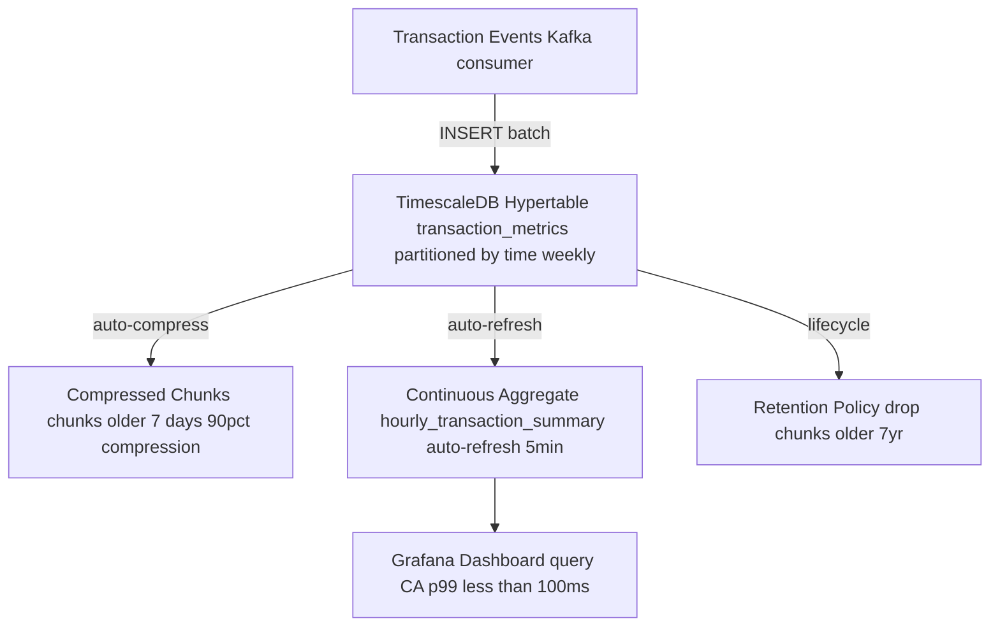

# Time-Series Modelling

Status: Draft | Last Reviewed: 2026-05-16 | Owner: @data-platform-domain-owner
Catalog ID: DATA-010 | Radii
Tier Applicability: T2, T3

## Problem Statement

- Financial time-series data (transaction rates, account balances, FX rates, risk metrics) accumulates at high velocity; storing this data in standard relational tables without time-partitioning produces table scans that degrade from seconds to minutes as data volume grows past 1 billion rows.
- Continuous aggregates (hourly, daily transaction totals) are expensive to recompute on every dashboard query; without pre-computed materialized views that auto-refresh, Grafana and BI dashboards impose 30-second query times on operations teams during incidents.
- SBV Circular 09/2020 §IV.4 requires real-time transaction monitoring; the monitoring dashboard must reflect current transaction volumes with ≤5-minute lag; a standard PostgreSQL table cannot support 100K TPS ingest while simultaneously serving analytical queries.
- Data retention management for time-series: financial time-series must be retained for 7 years (SBV requirement); storing 7 years of high-frequency data in a flat table is cost-prohibitive without compression and partition-based lifecycle management.

## Context

TimescaleDB is a PostgreSQL extension that partitions time-series data into "chunks" (time-based partitions) automatically, enables native compression of older chunks, and provides continuous aggregates (pre-computed materialized views that update incrementally). In Techcombank's context, TimescaleDB is the appropriate choice for T2/T3 time-series analytics workloads because it runs on existing PostgreSQL 16 infrastructure without a separate time-series database (InfluxDB, Prometheus) and supports standard SQL queries.

## Solution

A TimescaleDB hypertable partitions rows by `time` column into weekly chunks. Continuous aggregates precompute hourly and daily totals during the batch window, making Grafana dashboard queries instant. Compression is applied to chunks older than 7 days (90%+ compression ratio on financial data with low cardinality dimensions like `mcc` and `channel`). A retention policy drops chunks older than 7 years. Spring Data JPA accesses TimescaleDB via standard PostgreSQL JDBC.



## Implementation Guidelines

### 1. TimescaleDB Hypertable DDL

```sql
CREATE EXTENSION IF NOT EXISTS timescaledb;

CREATE TABLE metrics.transaction_metrics (
    time        TIMESTAMPTZ NOT NULL,
    channel     VARCHAR(20) NOT NULL,
    mcc         VARCHAR(4),
    amount      NUMERIC(19,2) NOT NULL,
    txn_count   INT NOT NULL DEFAULT 1,
    is_success  BOOLEAN NOT NULL
);

SELECT create_hypertable(
    'metrics.transaction_metrics',
    'time',
    chunk_time_interval => INTERVAL '1 week',
    if_not_exists => TRUE
);

CREATE INDEX ON metrics.transaction_metrics (channel, time DESC);
CREATE INDEX ON metrics.transaction_metrics (mcc, time DESC);
```

### 2. Continuous Aggregate — Hourly Summary

```sql
CREATE MATERIALIZED VIEW metrics.hourly_transaction_summary
WITH (timescaledb.continuous) AS
SELECT
    time_bucket('1 hour', time) AS bucket,
    channel,
    mcc,
    SUM(amount) AS total_amount,
    SUM(txn_count) AS total_count,
    AVG(amount) AS avg_amount,
    COUNT(*) FILTER (WHERE NOT is_success) AS failure_count
FROM metrics.transaction_metrics
GROUP BY bucket, channel, mcc
WITH NO DATA;

SELECT add_continuous_aggregate_policy(
    'metrics.hourly_transaction_summary',
    start_offset => INTERVAL '1 day',
    end_offset   => INTERVAL '5 minutes',
    schedule_interval => INTERVAL '5 minutes'
);
```

### 3. Compression and Retention Policies

```sql
ALTER TABLE metrics.transaction_metrics
SET (
    timescaledb.compress,
    timescaledb.compress_segmentby = 'channel, mcc',
    timescaledb.compress_orderby = 'time DESC'
);

SELECT add_compression_policy(
    'metrics.transaction_metrics',
    INTERVAL '7 days'
);

SELECT add_retention_policy(
    'metrics.transaction_metrics',
    INTERVAL '7 years'
);
```

### 4. Spring Data JPA — TimescaleDB Insert (Java 21)

```java
@Repository
@RequiredArgsConstructor
public class TransactionMetricsRepository {

    private final JdbcTemplate jdbc;

    public void insertBatch(List<TransactionMetric> metrics) {
        jdbc.batchUpdate(
            "INSERT INTO metrics.transaction_metrics " +
            "(time, channel, mcc, amount, txn_count, is_success) VALUES (?, ?, ?, ?, ?, ?)",
            new BatchPreparedStatementSetter() {
                @Override
                public void setValues(PreparedStatement ps, int i) throws SQLException {
                    TransactionMetric m = metrics.get(i);
                    ps.setTimestamp(1, Timestamp.from(m.time()));
                    ps.setString(2, m.channel());
                    ps.setString(3, m.mcc());
                    ps.setBigDecimal(4, m.amount());
                    ps.setInt(5, 1);
                    ps.setBoolean(6, m.isSuccess());
                }
                @Override public int getBatchSize() { return metrics.size(); }
            }
        );
    }

    public List<HourlySummary> queryHourlySummary(String channel, Instant from, Instant to) {
        return jdbc.query(
            "SELECT bucket, SUM(total_amount), SUM(total_count) " +
            "FROM metrics.hourly_transaction_summary " +
            "WHERE channel = ? AND bucket BETWEEN ? AND ? " +
            "GROUP BY bucket ORDER BY bucket",
            (rs, row) -> new HourlySummary(
                rs.getTimestamp(1).toInstant(),
                rs.getBigDecimal(2),
                rs.getLong(3)),
            channel, Timestamp.from(from), Timestamp.from(to)
        );
    }
}
```

## When to Use

- High-frequency financial time-series requiring both high-throughput ingest (≥100K TPS) and fast analytical queries (30-day range in < 2 s) — TimescaleDB's chunk-based partitioning satisfies both without a separate time-series database.
- Grafana or BI dashboards querying transaction volumes, account balance trends, or risk metrics where continuous aggregates eliminate repeated expensive scans.
- Environments already running PostgreSQL 16 that want time-series capabilities without introducing a new database technology.

## When Not to Use

- Metrics that are ONLY read by Prometheus and Grafana with no SQL analytics requirement — use Prometheus + Thanos for metrics-specific storage; adding TimescaleDB for Prometheus data is over-engineering.
- Very low-frequency time-series (< 1,000 rows/day per table) — a standard PostgreSQL table with a `TIMESTAMPTZ` index is sufficient; TimescaleDB adds complexity without benefit.
- Environments requiring sub-millisecond write latency for tick-by-tick trading data — dedicated time-series databases (InfluxDB IOx, QuestDB) have lower write overhead than TimescaleDB for extreme TPS requirements.

## Variants

| Variant | When to prefer | Trade-off |
|---------|----------------|-----------|
| TimescaleDB (this pattern) | SQL analytics + time-series in one system; PostgreSQL expertise available | TimescaleDB extension must be enabled; cloud-managed Timescale Cloud adds cost |
| InfluxDB / QuestDB | Extreme TPS (>1M writes/s); Flux/InfluxQL query language acceptable | No SQL compatibility; separate operational team required |
| PostgreSQL native partitioning | TimescaleDB extension not available; table size < 100M rows | Manual partition management; no continuous aggregates; no native compression |

## NFR Acceptance Criteria

| Metric | Threshold | Measurement |
|--------|-----------|-------------|
| Ingest throughput | ≥ 100K rows/s (batch insert) | JMeter load test: 100K INSERT/s for 60 s; assert all rows persisted |
| 30-day range query (raw table) | p99 ≤ 2 s | EXPLAIN ANALYZE: `SELECT SUM(amount) WHERE time BETWEEN now()-30d AND now()`; assert p99 ≤ 2 s |
| Continuous aggregate query | p99 ≤ 100 ms (hourly_transaction_summary, 30-day) | Grafana panel benchmark; assert p99 ≤ 100 ms |
| Compression ratio | ≥ 90% for chunks older than 7 days | `SELECT * FROM chunk_compression_stats('metrics.transaction_metrics')`; assert after/before bytes ≤ 0.10 |
| Retention policy correctness | 0 chunks older than 7 years | `SELECT COUNT(*) FROM timescaledb_information.chunks WHERE range_end < NOW() - INTERVAL '7 years'`; assert 0 |

## Compliance Mapping

| Ring | Regulation | Provision | How this pattern satisfies |
|------|-----------|-----------|---------------------------|
| Ring 0 | ISO 8000 | Data retention — time-series data must be retained and accessible for the required retention period | TimescaleDB retention policy enforces 7-year data retention with automatic chunk lifecycle management; compression preserves data integrity while reducing storage cost. |
| Ring 1 | BCBS 239 | §6 — Timeliness: risk data must be available with sufficient frequency for risk management decisions | Continuous aggregate auto-refresh every 5 minutes provides ≤5-minute lag for intraday risk metrics; raw hypertable enables on-demand historical queries for BCBS 239 audit evidence. |
| Ring 2 | SBV Circular 09/2020 | §IV.4 — Real-time transaction monitoring; data must reflect current volumes with acceptable freshness ⚠️ (working summary — pending Legal review) | TimescaleDB continuous aggregate refresh at 5-minute intervals satisfies SBV §IV.4 near-real-time monitoring; 7-year retention policy satisfies SBV data retention requirements; Legal review required to confirm whether SBV requires transaction monitoring data to be accessible as raw events or aggregated summaries for specific regulatory reports. |

## Cost / FinOps

- TimescaleDB extension: free open-source extension for PostgreSQL; TimescaleDB Cloud (managed) adds ~$500/month for a dedicated instance handling 100K TPS ingest.
- Storage: raw hypertable at 100K TPS × 100 bytes/row = 10 MB/s = 864 GB/day uncompressed. Compression reduces to ~86 GB/day after 7 days. Over 7 years: ~220 TB compressed. At $0.023/GB/month (Aurora GP3) = ~$5,000/month. Use S3 tiered storage for chunks older than 1 year.
- Continuous aggregate storage: hourly summaries are 1/3,600 of raw volume; negligible compared to raw storage.

## Threat Model

- **Retention policy misconfiguration — premature data deletion (Information Disclosure)**: A misconfigured retention policy (e.g., `INTERVAL '7 months'` instead of `INTERVAL '7 years'`) silently deletes chunks before the regulatory retention period expires. Mitigation: retention policy configuration is version-controlled in IaC; a daily audit job checks that no chunk with `range_end > NOW() - INTERVAL '7 years'` has been dropped; S3 WORM backup of compressed chunks provides a secondary copy for recovery.
- **Continuous aggregate staleness masking a data quality issue (Tampering)**: A data quality problem in the raw hypertable is averaged away in continuous aggregates and goes undetected. Mitigation: DATA-011 Data Quality Rules gate on raw hypertable ingest; Prometheus alert fires if raw row count deviates > 5σ from expected; nightly reconciliation compares raw aggregates to continuous aggregate for the same period.

## Runbook Stub

**Alert: `timescaledb_ingest_lag_seconds > 30`**
- p50 baseline: ≤ 2 s | p99 SLO: ≤ 10 s
- Remediation: (1) Check Kafka consumer lag: `kafka-consumer-groups.sh --describe --group tsdb-ingest`. (2) Scale ingest service: `kubectl scale deploy tsdb-ingest --replicas=4`. (3) Check PostgreSQL connection pool saturation; increase pool size if exhausted.

**Alert: `timescaledb_compression_lag_chunks > 20`**
- p50 baseline: 0–2 uncompressed old chunks | p99 SLO: ≤ 5
- Remediation: (1) Check background worker status: `SELECT * FROM timescaledb_information.jobs WHERE job_type = 'compress_chunks'`. (2) Run compression manually: `SELECT compress_chunk(c) FROM show_chunks('metrics.transaction_metrics', older_than => INTERVAL '7 days') c`. (3) If CPU is saturated during compression, schedule during low-traffic hours (02:00–04:00).

## Test Strategy Stub

- **Unit**: `TransactionMetricsRepositoryTest` — mock JdbcTemplate; insert 100 metrics; assert `batchUpdate` called with correct parameters. `HourlySummaryQueryTest` — mock JDBC result set; call `queryHourlySummary`; assert correct `HourlySummary` objects returned.
- **Integration**: Testcontainers (TimescaleDB 2.x on PostgreSQL 16): create hypertable; insert 10,000 rows across 30 days; create continuous aggregate; assert aggregate reflects correct totals; run compression; assert chunk compressed; run retention policy; assert old chunks dropped.
- **Compliance**: BCBS 239 §6 timeliness — measure continuous aggregate refresh lag; assert ≤ 5 min after raw data insert. Retention verification: create chunk with `time = NOW() - INTERVAL '8 years'`; run retention policy; assert chunk dropped; verify S3 WORM backup exists before drop.

## Related Patterns

- [DATA-007 Kappa Architecture](kappa-architecture.md) — Flink stream processor writing into TimescaleDB hypertable
- [DATA-011 Data Quality Rules](data-quality-rules.md) — quality gate applied before ingest into hypertable
- [BSP-004 End-of-Day Batch Window](../../patterns/banking-solutions/end-of-day-batch-window.md) — batch aggregation queries serve the EOD reporting window
- [COMP-005 BCBS 239 Deep Dive](../../compliance/basel-bcbs-239.md) — timeliness requirements for risk time-series

## References

- [TimescaleDB Documentation — Hypertables](https://docs.timescale.com/timescaledb/latest/how-to-guides/hypertables/)
- [TimescaleDB — Continuous Aggregates](https://docs.timescale.com/timescaledb/latest/how-to-guides/continuous-aggregates/)
- [TimescaleDB — Compression](https://docs.timescale.com/timescaledb/latest/how-to-guides/compression/)
- [BCBS 239 — Timeliness of Risk Data](https://www.bis.org/publ/bcbs239.htm)
- Catalog reference: `governance/standards/enterprise-architecture-catalog.md`
