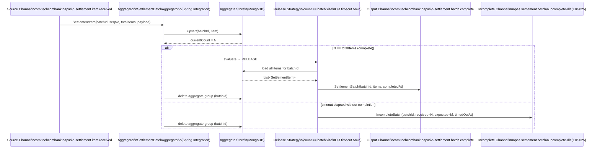

# Aggregator

Status: Draft | Last Reviewed: 2026-05-09 | Owner: @tech-lead-backend
Catalog ID: EIP-011 | Radii
Tier Applicability: T0, T1

## Problem Statement

- Many banking business events arrive as a sequence of correlated partial messages that are meaningless individually but together constitute a complete business record. A NAPAS settlement file contains hundreds of individual item lines; a daily customer statement is assembled from dozens of transaction events; a multi-leg SWIFT payment generates separate debit, credit, and confirmation events across different services. Consumers that try to act on each partial message independently produce incorrect intermediate states and trigger premature downstream actions.
- Without an Aggregator, each consumer must implement its own correlation and completion logic — duplicating stateful bookkeeping across services, each with subtly different timeout and failure semantics, creating reconciliation nightmares when one service's aggregation diverges from another's.
- In-memory aggregation state is lost on pod restart, causing incomplete aggregates to be silently abandoned. A settlement batch that is 95% aggregated when the pod crashes will never be released, and the missing 5% of settlement records causes a ledger imbalance that is difficult to diagnose.
- Aggregation without a defined completion condition (count-based, condition-based, or time-based) can hold messages indefinitely, blocking downstream processing and violating SLA commitments under BCBS 239 §5 Timeliness and SBV Circular 09/2020 §IV.2.

## Solution

The Aggregator collects individual messages correlated by a business key, buffers them in a durable store, and releases a single composite message when a completion condition is met. If the completion condition is not met within a timeout window, the partial aggregate is released as an incomplete event that triggers compensating action rather than being silently dropped.



### Aggregation dimensions

| Dimension | Strategy | Example |
|---|---|---|
| Correlation key | Business key extracted from payload | `batchId`, `settlementDate + bicCode`, `transactionId` |
| Completion — count | All N expected parts received | NAPAS batch: `seqNo count == header.totalItems` |
| Completion — condition | A specific "terminal" message received | SWIFT: `MT900 (credit confirmation)` marks leg complete |
| Completion — timeout | Wall-clock window expires | Daily statement: release at 23:55 VNT regardless of completeness |
| Incomplete handling | Partial aggregate → Incomplete DLT event | Triggers manual reconciliation workflow |

## Implementation Guidelines

1. **Use Spring Integration `AggregatingMessageHandler` as the core aggregator.** Define three beans: `CorrelationStrategy` (extracts the group key), `ReleaseStrategy` (determines when to release), and the `MessageGroupProcessor` (assembles the output message). Wire them into an `AggregatorFactoryBean`.

   ```java
   @Configuration
   @RequiredArgsConstructor
   public class SettlementAggregatorConfig {

       private final MessageGroupStore messageGroupStore;

       @Bean
       public AggregatingMessageHandler settlementAggregator() {
           AggregatingMessageHandler handler =
               new AggregatingMessageHandler(
                   new SettlementBatchProcessor(),       // MessageGroupProcessor
                   messageGroupStore,
                   new BatchCorrelationStrategy(),       // CorrelationStrategy
                   new BatchCompletionReleaseStrategy()  // ReleaseStrategy
               );
           // Release partial groups after 5-minute timeout
           handler.setSendPartialResultOnExpiry(false); // send to discard channel
           handler.setGroupTimeoutExpression(
               new ValueExpression<>(Duration.ofMinutes(5).toMillis()));
           handler.setDiscardChannel(settlementIncompleteChannel());
           return handler;
       }

       @Bean
       public MessageChannel settlementIncompleteChannel() {
           // Routes to DLT (EIP-025) for triage
           return new DirectChannel();
       }
   }
   ```

2. **Implement the correlation strategy to extract the business key.**

   ```java
   @Component
   public class BatchCorrelationStrategy implements CorrelationStrategy {

       @Override
       public Object getCorrelationKey(Message<?> message) {
           SettlementItem item = (SettlementItem) message.getPayload();
           // Correlation key: batchId + settlement date for uniqueness across days
           return item.getBatchId() + "|" + item.getSettlementDate();
       }
   }
   ```

3. **Implement the release strategy based on expected count from message headers.**

   ```java
   @Component
   public class BatchCompletionReleaseStrategy implements ReleaseStrategy {

       @Override
       public boolean canRelease(MessageGroup group) {
           if (group.getMessages().isEmpty()) return false;

           // First message in group carries the total expected count
           Message<?> first = group.getMessages().iterator().next();
           Integer totalExpected = (Integer) first.getHeaders()
               .get("batch_total_items");

           if (totalExpected == null) {
               log.warn("Batch message missing batch_total_items header; "
                   + "group={}", group.getGroupId());
               return false;
           }
           return group.size() >= totalExpected;
       }
   }
   ```

4. **Persist aggregate state in MongoDB for durability across restarts.** Use `MongoDbMessageStore` from `spring-integration-mongodb`. This ensures that an in-progress aggregation survives a pod restart or rolling deployment.

   ```java
   @Bean
   public MessageGroupStore messageGroupStore(MongoDatabase database) {
       MongoDbMessageStore store = new MongoDbMessageStore(database);
       store.setCollectionName("payment_aggregate_groups");
       return store;
   }
   ```

   MongoDB collection configuration: shard by `groupId` (the correlation key) for horizontal scalability. Set a TTL index on `lastModified` of 2 hours as a safety net against orphaned groups that the timeout strategy misses.

   ```javascript
   // MongoDB TTL index — applied via IaC migration script
   db.payment_aggregate_groups.createIndex(
     { "lastModified": 1 },
     { expireAfterSeconds: 7200 }
   );
   ```

5. **Implement the message group processor to assemble the output aggregate.**

   ```java
   @Component
   public class SettlementBatchProcessor implements MessageGroupProcessor {

       @Override
       public Object processMessageGroup(MessageGroup group) {
           List<SettlementItem> items = group.getMessages().stream()
               .map(m -> (SettlementItem) m.getPayload())
               .sorted(Comparator.comparingInt(SettlementItem::getSequenceNumber))
               .collect(Collectors.toList());

           SettlementItem first = items.get(0);
           return SettlementBatch.builder()
               .batchId(first.getBatchId())
               .settlementDate(first.getSettlementDate())
               .bicCode(first.getBicCode())
               .totalItems(items.size())
               .items(items)
               .aggregatedAt(Instant.now())
               .totalAmountVnd(items.stream()
                   .map(SettlementItem::getAmountVnd)
                   .reduce(BigDecimal.ZERO, BigDecimal::add))
               .build();
       }
   }
   ```

6. **Publish the aggregated output to a durable Kafka channel** using a `KafkaProducerMessageHandler` as the output channel's service activator. This ensures the assembled batch is durably committed before the aggregate group is deleted from MongoDB.

7. **Handle T24 integration for aggregated batch posting.** When the settlement batch is complete, the OFS bridge receives the `SettlementBatch` object and maps it to a single multi-entry OFS command (TELLER batch input). This is more efficient than posting N individual OFS calls for N settlement items, and reduces T24 lock contention during EOD.

## Banking Use Cases

1. **NAPAS inbound settlement batch aggregation** — NAPAS sends intra-day settlement files containing hundreds of individual credit/debit items. Each item arrives as a separate Kafka message on `com.techcombank.napas.settlement.item.received`. The Aggregator correlates by `settlementDate + clearingSession + bicCode`, waits for `count == header.totalItems`, and releases a `SettlementBatch` to the reconciliation service. This replaces a file-polling architecture with a real-time streaming equivalent that can process items as they arrive rather than waiting for the full file.

2. **Daily customer statement assembly** — Throughout the day, transaction events for each customer land on `com.techcombank.ledger.transaction.posted`. The Aggregator correlates by `customerId + statementDate`, uses a time-based release strategy (trigger at 23:55 VNT), and assembles a `DailyStatement` object containing all transactions, running balances, and summary totals. This is delivered to the Statement Service which renders the PDF and delivers to Digital Banking.

3. **Multi-leg SWIFT gpi payment confirmation** — A SWIFT gpi payment generates three events in sequence: `payment.initiated` (from Techcombank's outbound SWIFT adapter), `payment.acknowledged` (SWIFT gpi tracker confirms receipt by correspondent), and `payment.credited` (correspondent bank confirms credit to beneficiary). The Aggregator correlates by ISO 20022 `EndToEndId`, releases when all three events are received (condition-based: `payment.credited` event present), and emits a `SwiftPaymentSettled` event to the Payment Lifecycle Service.

4. **Split payment reconciliation** — A merchant payment that is split across multiple card network batches arrives as partial authorization messages. The Aggregator correlates by `merchantReferenceId + batchDate`, uses a count-based strategy (all partials received), and emits a `MerchantPaymentReconciled` event to the Merchant Portal.

5. **Regulatory transaction reporting batch** — Under SBV reporting requirements, individual transaction events must be batched into a daily regulatory report. The Aggregator time-triggers at 08:00 VNT (T+1 reporting deadline), assembles all transactions from the prior business day keyed by `reportDate + transactionCategory`, and emits a `RegulatoryReportBatch` to the Compliance Reporting Service.

## Compliance Mapping

| Ring | Regulation | Provision | How this pattern satisfies |
|---|---|---|---|
| Ring 0 | EIP Book (Hohpe & Woolf) | Chapter 7 — Aggregator | Canonical pattern; this doc implements it for Techcombank's settlement and statement use cases |
| Ring 0 | NIST SP 800-53 | SI-12 (Information Management and Retention) | MongoDB aggregate store with TTL index enforces controlled retention; no orphaned partial aggregates |
| Ring 0 | ISO 27001 | A.12.3 (Information Backup) | MongoDB replica set (3-node) ensures aggregate state survives single-node failure; no data loss on restart |
| Ring 1 | BCBS 239 §6 | Completeness — risk data must be complete, not partial | Aggregator's count-based release strategy ensures no partial settlement batch reaches downstream risk systems; incomplete batches go to DLT for explicit triage |
| Ring 1 | ISO 20022 | BatchBooking, GroupHeader, NumberOfTransactions | Aggregated output maps directly to ISO 20022 batch message structure; `totalItems` and `controlSum` fields validated before release |
| Ring 1 | SWIFT CSP 2024 | Control 2.9 — Transaction Business Controls | SWIFT gpi aggregation ensures the full payment lifecycle (initiate → acknowledge → credit) is confirmed before settlement accounting; no partial SWIFT confirmations reach the ledger |
| Ring 2 | SBV Circular 09/2020 §IV.2 | Operational continuity ⚠️ (working summary — pending Legal review) | MongoDB-backed aggregate store survives pod restart; timeout-based incomplete release prevents aggregates from blocking EOD indefinitely |

## NFR Acceptance Criteria

```yaml
nfr:
  catalog_id: EIP-011
  pattern: Aggregator

  availability:
    target: 99.99%  # T0 — settlement aggregation is on critical EOD path
    store_replication: "MongoDB replica set, 3 nodes across 2 AZs"
    pod_restart_recovery_ms: 5000   # aggregator resumes from MongoDB state on restart

  performance:
    aggregation_latency_p95_ms: 100   # time from last item received to output message published
    store_write_latency_p95_ms: 10    # MongoDB upsert for each incoming item
    release_evaluation_ms: 5          # release strategy predicate evaluation
    max_group_size: 10000             # items per aggregate group; larger batches split upstream

  durability:
    incomplete_group_fate: "released to DLT after timeout — never silently dropped"
    timeout_per_use_case:
      napas_settlement_batch: 5m
      daily_statement: "23:55 VNT wall-clock"
      swift_gpi_confirmation: 60m   # SWIFT correspondent may take up to 1 hour
    store_ttl_safety_net: 2h       # MongoDB TTL index cleans orphaned groups

  observability:
    required_metrics:
      - aggregator_groups_active_total
      - aggregator_groups_completed_total
      - aggregator_groups_timed_out_total
      - aggregator_store_size_bytes
      - aggregator_release_latency_ms
    alerts:
      - name: Aggregator_TimeoutRate_High
        condition: "aggregator_groups_timed_out_total rate > 1% over 10min"
        severity: High
      - name: Aggregator_StoreSize_High
        condition: "aggregator_store_size_bytes > 10GB"
        severity: Warning
      - name: Aggregator_GroupAge_Exceeded
        condition: "any group age > 2x configured timeout"
        severity: Critical

  scalability:
    horizontal_scaling: "limited — correlation requires sticky routing or shared store"
    sticky_routing: "partition Kafka input topic by correlationKey for co-location"
    shared_store_scaling: "MongoDB sharded by groupId for horizontal store scaling"
```

## Cost/FinOps

- **MongoDB aggregate store sizing** — Peak aggregate state size depends on concurrent open groups × avg group size. At 500 concurrent settlement batches × 1,000 items/batch × 2KB/item = 1GB peak. A 3-node MongoDB replica set with 50GB SSD per node comfortably accommodates this with 50× headroom. Cost: approximately USD 180/month (cloud-managed MongoDB).
- **TTL purge reduces storage costs** — The 2-hour TTL safety-net index runs as an internal MongoDB process with no additional operational cost. Without it, orphaned groups from edge cases would accumulate indefinitely, requiring manual cleanup.
- **Kafka input topic partition strategy impacts aggregator scaling** — If the input topic is partitioned by `correlationKey` (recommended), each aggregator pod handles a non-overlapping subset of groups and the shared MongoDB store is accessed at lower concurrency. Wrong partitioning (by timestamp) forces all pods to share state on every group lookup — 10× higher MongoDB read load.
- **Avoid aggregating in-memory for T0** — In-memory aggregation (Spring Integration `SimpleMessageStore`) is zero-cost in compute but loses state on restart. For T0 use cases (NAPAS settlement), this is unacceptable. The MongoDB store cost is the price of durability.
- **Batch posting to T24 reduces OFS overhead** — Posting a 500-item settlement batch as a single OFS batch command rather than 500 individual OFS calls reduces T24 transaction overhead by approximately 80%, freeing T24 capacity during peak EOD windows. This is a direct FinOps benefit of the Aggregator pattern beyond its architectural merits.

## Threat Model

- **Correlation key collision** — Two unrelated batches that happen to share the same `batchId` are aggregated together, producing a corrupted combined batch that posts incorrect settlement amounts to the ledger. Mitigation: correlation keys must include both `batchId` and `settlementDate` (preventing cross-day collisions); NAPAS batch IDs are validated against the NAPAS batch header before acceptance; schema validation at EIP-001 layer rejects malformed batch IDs.
- **Aggregate state injection** — An attacker with write access to the MongoDB aggregate store inserts fraudulent settlement items into an open group, inflating the released batch amount. Mitigation: MongoDB access is restricted to the aggregator service account (network policy + RBAC); the service account credential is rotated monthly via Vault; the T24 OFS bridge validates the released batch total against the NAPAS control sum before posting.
- **Timeout exploitation** — An attacker deliberately suppresses one item in a batch, causing the timeout to fire and the partial batch to route to the DLT — denying service for the affected settlement session. Mitigation: incomplete batch alerts fire within 5 minutes; the triage team investigates; NAPAS provides a re-transmission mechanism for missing items; partial-batch DLT entries are retained for 30 days for forensic analysis.
- **Duplicate item injection** — The same settlement item is published to the inbound channel twice (producer retry), causing the aggregator to count N+1 items and either over-release (if count-based) or produce a corrupted batch. Mitigation: the aggregator applies [EIP-024 Idempotent Receiver](idempotent-receiver.md) logic on each incoming item using `sequenceNumber` as the idempotency key within a group; duplicate items within a group are rejected before the correlation store upsert.
- **MongoDB store unavailability** — If MongoDB is unavailable, the aggregator cannot persist incoming items. Messages accumulate on the Kafka inbound topic (consumer lag grows). Mitigation: the aggregator pod fails fast on MongoDB write failure (throws exception, message remains on Kafka topic); consumer lag alert fires; MongoDB HA (replica set) provides automatic failover in < 30 seconds.
- **Large group memory pressure** — A pathologically large batch (100K items) causes the `MessageGroupProcessor` to load all items into JVM heap simultaneously during release, causing OOM. Mitigation: `max_group_size` guard (10K items) rejects oversized batches at the correlation strategy; for legitimately large batches, the upstream producer must split into sub-batches of ≤ 10K items.
- **Stale group from rolled-back producer** — A producer publishes partial items then crashes without completing the batch. The aggregator holds an open group until timeout. Mitigation: timeout releases the partial group to the DLT; the DLT triage workflow notifies the upstream producer team to re-send; group age alerts at 2× timeout catch long-running stale groups.

## Operational Runbook

1. **Alert: Aggregator_TimeoutRate_High** — A surge in timed-out groups (> 1% of total) indicates systematic incomplete batches from an upstream producer. Open Grafana `aggregator-overview`. Check `aggregator_groups_timed_out_total` by `correlationKeyPrefix` to identify the affected use case. Inspect the DLT for the incomplete batch payload; examine the `received` vs `expected` counts. Contact the upstream producer team (NAPAS operations or SWIFT gateway team) to investigate missing items.

2. **Alert: Aggregator_GroupAge_Exceeded** — A specific group has been open for more than 2× its configured timeout, suggesting the timeout strategy failed to fire (e.g., MongoDB TTL index rebuild paused it). Identify the group using `db.payment_aggregate_groups.find({ lastModified: { $lt: new Date(Date.now() - 2*timeout) } })`. Manually trigger release or delete as appropriate after confirming with the business owner. Investigate why the timeout strategy did not fire.

3. **MongoDB store recovery** — If MongoDB undergoes a failover (primary election), the aggregator will experience write failures for < 30 seconds. Kafka consumer lag will grow. After MongoDB recovers, the aggregator resumes automatically. Verify: check `aggregator_groups_active_total` returns to pre-failure levels; check consumer lag trend reverses. No manual intervention required if lag normalises within 5 minutes.

4. **Replay of failed aggregation** — If a released batch was corrupted (e.g., a MongoDB write completed but the Kafka publish failed), the group was deleted but the output message was lost. To recover: identify the `batchId` from the incident report; query MongoDB for any residual partial data (if TTL has not expired); re-publish the individual items to the inbound Kafka topic from the source system (NAPAS re-transmission); the aggregator will re-aggregate and re-release. Pair with [EIP-024 Idempotent Receiver](idempotent-receiver.md) to prevent duplicate posting on the output side.

5. **Incomplete batch triage** — Open the DLT consumer for `napas.settlement.batch.incomplete-dlt`. For each incomplete batch entry, record `batchId`, `received`, `expected`, and `timedOutAt`. Contact NAPAS operations with the batch reference. NAPAS will either re-transmit the missing items (triggering a new aggregation cycle) or provide a reconciliation file. Update the incident ticket with the resolution.

6. **Increasing aggregate store size** — If `aggregator_store_size_bytes` is growing faster than expected, check for groups with very old `lastModified` timestamps (stuck groups). Run: `db.payment_aggregate_groups.aggregate([{ $group: { _id: null, maxAge: { $max: "$lastModified" } } }])`. Investigate stuck groups; force-expire via the TTL index (reduce TTL temporarily then restore). Check if a new use case is producing unexpectedly large groups.

7. **Rolling deployment of aggregator** — During a rolling deployment, in-flight aggregate groups in MongoDB are preserved (MongoDB-backed). New pods pick up open groups from the store automatically. However: during the rollout window, if both old and new pod versions handle the same group, ensure the correlation logic is backwards-compatible (same key derivation). Add integration tests that verify the new version can release groups created by the old version.

## Test Strategy

**Unit tests** — Test each of the three strategy beans in isolation: `BatchCorrelationStrategy` (returns expected key for valid and invalid payloads), `BatchCompletionReleaseStrategy` (returns `true` when count equals `batch_total_items` header, `false` otherwise, handles missing header gracefully), `SettlementBatchProcessor` (assembles correct `SettlementBatch` from a `MessageGroup` with N items; verifies sort order and total amount sum).

**Integration tests** — Use Testcontainers (MongoDB + Kafka) to run a full aggregation pipeline. Test: (a) happy path — publish N items with `batch_total_items=N`, verify the output channel receives one `SettlementBatch` with all items; (b) timeout path — publish N-1 items, wait for timeout, verify the incomplete channel receives one `IncompleteBatch` with `received=N-1, expected=N`; (c) duplicate item — publish the same item twice, verify it is counted only once (idempotency).

**Chaos tests** — Kill the aggregator pod after 50% of items have been received. Restart it. Verify: (a) the surviving pod resumes from MongoDB state; (b) the remaining items (published again from the test harness) are aggregated correctly; (c) the final released batch contains exactly the correct N items without duplicates. This test validates the MongoDB durability guarantee.

**Compliance tests** — For BCBS 239 §6 Completeness: run a property-based test (jqwik) that publishes random N between 1 and 1000 items with `batch_total_items=N`. Assert that the released batch always contains exactly N items. Assert that the incomplete channel never receives a batch when all N items were published. Run 1,000 iterations.

**Performance tests** — Gatling scenario: 50 concurrent settlement batches × 500 items each = 25,000 messages. Verify all batches are released within 2× the configured timeout; verify MongoDB write latency stays < 10ms P95; verify no message loss.

## References

- Hohpe, G. & Woolf, B. — Enterprise Integration Patterns (Addison-Wesley), Chapter 7: Aggregator
- Spring Integration Reference — Aggregator, MessageGroupStore
- MongoDB documentation — TTL Indexes, Change Streams
- Kafka Streams documentation — Windowed Aggregation, KTable
- Related catalog IDs: [EIP-001 Message Channel](message-channel.md), [EIP-013 Resequencer](resequencer.md), [EIP-017 Process Manager](process-manager.md), [EIP-024 Idempotent Receiver](idempotent-receiver.md), [EIP-025 Dead Letter Channel](dead-letter-channel.md), [INT-001 Saga Orchestration](../integration/saga-orchestration.md)

---

**Key Takeaway**: The Aggregator collects correlated partial messages into a single composite using durable MongoDB state — preventing partial settlement batches or incomplete statements from reaching downstream systems — and always releases explicitly, whether complete or timed-out, with no silent drops.
