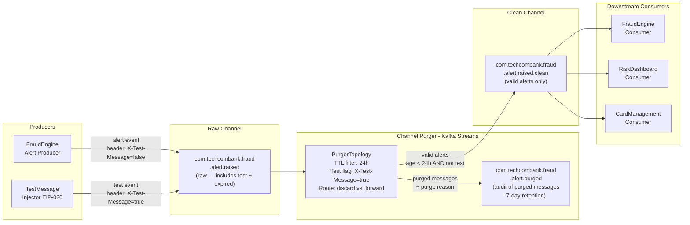

# Channel Purger

Status: Draft | Last Reviewed: 2026-05-09 | Owner: @tech-lead-backend
Catalog ID: EIP-021 | Radii
Tier Applicability: T0, T1, T2

## Problem Statement

- Fraud-alert events on the `com.techcombank.fraud.alert.raised` channel have a meaningful TTL of 24 hours: an alert that has not been actioned within 24 hours is either resolved by another path or is stale context that will mislead downstream systems if processed late. Consumers processing a 25-hour-old fraud alert may block a customer's card unnecessarily, causing customer harm and NPS impact.
- Test messages injected into production Kafka topics by the EIP-020 Test Message pattern (wire-tap testing, smoke tests, integration probes) must be purged before downstream consumers — Fraud Engine, Ledger Poster, Notification Service — mistakenly process them as real transactions, triggering spurious notifications, false ledger entries, or bogus fraud alerts.
- Kafka's topic-level `retention.ms` is a blunt instrument: it deletes all messages older than a configured age without regard to message type, business TTL, or consumer group offset. It cannot selectively remove test messages by header or purge messages of one type while retaining others.
- Without active purging of expired fraud alerts, the Fraud Engine's consumer lag metric becomes polluted with messages it must still read and discard — inflating operational costs and potentially triggering false scaling events from KEDA, which scales based on lag count not message validity.
- During staging-to-production promotion incidents, test data occasionally flows into production topics. Without a fast-path purging mechanism, the only remediation today is an emergency Kafka topic deletion and recreation, which drops all messages including legitimate ones — a high-blast-radius, regulated-change-control operation lasting several hours.
- Regulatory audit topics must not contain test message artefacts. If EIP-020 test messages accumulate in the `regulatory-audit` consumer group's backlog, they create spurious entries in the SBV audit log, requiring manual correction that itself requires an SBV notification under Circular 09/2020.

## Solution

A Channel Purger selectively removes messages from a channel that have expired, are of a specific unwanted type, or match a predicate — without affecting other messages in the channel. In Techcombank's Kafka stack, the Channel Purger is implemented as a dedicated consumer service that reads the channel, evaluates each message against a purge predicate (TTL check, header flag, message type), and either forwards valid messages to a clean output topic or silently drops expired/test messages. For Kafka, which does not support mid-stream deletion, the purger re-publishes valid messages to a shadow topic and routes consumers to the shadow; or it operates in-line as a Kafka Streams topology that filters messages before they reach downstream consumers.



## Implementation Guidelines

1. **Implement the purger as a Kafka Streams topology for stateless, scalable filtering.** Kafka Streams runs as a regular Spring Boot application and scales horizontally. The topology reads from the raw topic, applies the purge predicate (TTL + test-message flag), routes valid messages to the clean topic, and routes purged messages (with a purge reason header) to the purged-audit topic for investigation.

   ```java
   @Configuration
   public class FraudAlertPurgerTopology {

       private static final String RAW_TOPIC =
           "com.techcombank.fraud.alert.raised";
       private static final String CLEAN_TOPIC =
           "com.techcombank.fraud.alert.raised.clean";
       private static final String PURGED_TOPIC =
           "com.techcombank.fraud.alert.purged";
       private static final Duration ALERT_TTL = Duration.ofHours(24);

       @Bean
       public KStream<String, FraudAlertEvent> fraudAlertPurgerStream(
               StreamsBuilder builder) {
           KStream<String, FraudAlertEvent> raw = builder.stream(RAW_TOPIC,
               Consumed.with(Serdes.String(), fraudAlertSerde()));

           KStream<String, FraudAlertEvent>[] branches = raw.branch(
               (key, alert) -> isValid(alert),
               (key, alert) -> true  // catch-all for purge
           );

           KStream<String, FraudAlertEvent> valid = branches[0];
           KStream<String, FraudAlertEvent> purged = branches[1];

           valid.to(CLEAN_TOPIC, Produced.with(Serdes.String(), fraudAlertSerde()));

           purged.transformValues(PurgeReasonTransformer::new)
               .to(PURGED_TOPIC, Produced.with(Serdes.String(), fraudAlertSerde()));

           return valid;
       }

       private boolean isValid(FraudAlertEvent alert) {
           boolean isTestMessage = Boolean.parseBoolean(
               alert.getHeaders().getOrDefault("X-Test-Message", "false"));
           if (isTestMessage) return false;

           Instant alertTime = Instant.ofEpochMilli(alert.getAlertTimestamp());
           boolean isExpired = alertTime.plus(ALERT_TTL).isBefore(Instant.now());
           return !isExpired;
       }
   }
   ```

2. **Attach a purge reason to every discarded message before routing to the purged-audit topic.** The purged-audit topic is the audit trail for Channel Purger actions — it must contain enough information to reconstruct why a message was purged and by whom. Include: `purgeReason` (enum: `TTL_EXPIRED`, `TEST_MESSAGE`, `SCHEMA_INVALID`, `DUPLICATE`), `purgedAt` timestamp, `purgerInstanceId`, and the original message in its entirety.

   ```java
   public class PurgeReasonTransformer
           implements ValueTransformer<FraudAlertEvent, FraudAlertEvent> {

       private ProcessorContext context;

       @Override
       public void init(ProcessorContext context) {
           this.context = context;
       }

       @Override
       public FraudAlertEvent transform(FraudAlertEvent alert) {
           String reason = determinePurgeReason(alert);
           context.headers().add("X-Purge-Reason",
               reason.getBytes(StandardCharsets.UTF_8));
           context.headers().add("X-Purged-At",
               Instant.now().toString().getBytes(StandardCharsets.UTF_8));
           context.headers().add("X-Purger-Instance",
               System.getenv("POD_NAME").getBytes(StandardCharsets.UTF_8));

           log.info("Purging message alertId={} reason={} alertAge={}ms",
               alert.getAlertId(),
               reason,
               System.currentTimeMillis() - alert.getAlertTimestamp());

           return alert;
       }

       private String determinePurgeReason(FraudAlertEvent alert) {
           if (Boolean.parseBoolean(
                   alert.getHeaders().getOrDefault("X-Test-Message", "false"))) {
               return "TEST_MESSAGE";
           }
           Instant alertTime = Instant.ofEpochMilli(alert.getAlertTimestamp());
           if (alertTime.plus(Duration.ofHours(24)).isBefore(Instant.now())) {
               return "TTL_EXPIRED";
           }
           return "UNKNOWN";
       }
   }
   ```

3. **Route all downstream consumers to the clean topic, never the raw topic.** This is the most critical operational step: update all consumer `@KafkaListener` configurations to consume from `com.techcombank.fraud.alert.raised.clean` rather than the raw topic. The raw topic becomes an implementation detail of the purger topology. Use a configuration property so that the clean topic name can be updated without recompilation.

   ```java
   @Component
   @RequiredArgsConstructor
   public class FraudEngineAlertConsumer {

       @Value("${techcombank.kafka.fraud-alert-clean-topic:"
           + "com.techcombank.fraud.alert.raised.clean}")
       private String cleanAlertTopic;

       @KafkaListener(
           topics = "#{@environment.getProperty("
               + "'techcombank.kafka.fraud-alert-clean-topic',"
               + "'com.techcombank.fraud.alert.raised.clean')}",
           groupId = "fraud-engine",
           containerFactory = "manualAckContainerFactory"
       )
       public void onCleanFraudAlert(
               @Payload FraudAlertEvent alert,
               @Header(KafkaHeaders.RECEIVED_PARTITION) int partition,
               @Header(KafkaHeaders.OFFSET) long offset,
               Acknowledgment ack) {

           MDC.put("correlationId", alert.getAlertId());
           log.info("FraudEngine processing clean alert alertId={} "
               + "alertAge={}ms partition={} offset={}",
               alert.getAlertId(),
               System.currentTimeMillis() - alert.getAlertTimestamp(),
               partition, offset);

           fraudEvaluationService.evaluate(alert);
           ack.acknowledge();
       }
   }
   ```

4. **Configure Kafka Streams for fault-tolerant, stateless processing.** The purger topology is stateless (no KTable or state store) — it is a pure filter. Stateless topologies scale horizontally without state rebalancing overhead. Configure `num.stream.threads` to match the topic's partition count for maximum throughput. Use `processing.guarantee=at_least_once` (default) since the downstream clean topic consumers are idempotent.

   ```java
   @Configuration
   public class PurgerStreamsConfig {

       @Bean(name = KafkaStreamsDefaultConfiguration
           .DEFAULT_STREAMS_CONFIG_BEAN_NAME)
       public KafkaStreamsConfiguration purgerStreamsConfig(
               KafkaProperties props) {
           Map<String, Object> config = new HashMap<>(
               props.buildConsumerProperties());
           config.put(StreamsConfig.APPLICATION_ID_CONFIG,
               "fraud-alert-channel-purger");
           config.put(StreamsConfig.NUM_STREAM_THREADS_CONFIG, 6);
           config.put(StreamsConfig.PROCESSING_GUARANTEE_CONFIG,
               StreamsConfig.AT_LEAST_ONCE);
           config.put(StreamsConfig.DEFAULT_KEY_SERDE_CLASS_CONFIG,
               Serdes.String().getClass());
           config.put(StreamsConfig.COMMIT_INTERVAL_MS_CONFIG, 100);
           config.put(StreamsConfig.producerPrefix(
               ProducerConfig.ACKS_CONFIG), "all");
           return new KafkaStreamsConfiguration(config);
       }
   }
   ```

5. **Emit metrics for purge rate, purge reason distribution, and clean throughput.** Operational visibility is essential: a sudden spike in `TTL_EXPIRED` purges may indicate the Fraud Engine is falling behind; a spike in `TEST_MESSAGE` purges may indicate a runaway test harness has been misconfigured against production.

   ```java
   @Component
   @RequiredArgsConstructor
   public class PurgerMetricsEmitter {

       private final MeterRegistry metrics;

       public void recordPurged(String reason) {
           metrics.counter("cp.message.purged",
               "reason", reason,
               "topic", "fraud.alert.raised").increment();
       }

       public void recordForwarded() {
           metrics.counter("cp.message.forwarded",
               "topic", "fraud.alert.raised.clean").increment();
       }

       public void recordPurgeRatio(long purged, long forwarded) {
           if (purged + forwarded > 0) {
               double ratio = (double) purged / (purged + forwarded);
               metrics.gauge("cp.purge.ratio",
                   Tags.of("topic", "fraud.alert.raised"), ratio);
               if (ratio > 0.10) {
                   log.warn("High purge ratio detected ratio={} — "
                       + "investigate upstream producer", ratio);
               }
           }
       }
   }
   ```

6. **Define and enforce TTL at the schema level using a mandatory `expiresAt` field.** Rather than computing TTL from the `alertTimestamp` header in the purger, embed an `expiresAt` epoch millisecond field in the `FraudAlertEvent` Avro schema. The producer sets `expiresAt = alertTimestamp + 86_400_000` (24 hours). The purger compares `Instant.now()` against `expiresAt`, making the TTL contract explicit and auditable. Schema Registry enforces the field as non-nullable.

   ```json
   {
     "type": "record",
     "name": "FraudAlertEvent",
     "namespace": "com.techcombank.fraud",
     "fields": [
       { "name": "alertId", "type": "string" },
       { "name": "alertTimestamp", "type": "long", "logicalType": "timestamp-millis" },
       { "name": "expiresAt", "type": "long", "logicalType": "timestamp-millis",
         "doc": "Unix epoch ms at which this alert expires (alertTimestamp + TTL)" },
       { "name": "alertType", "type": "string" },
       { "name": "accountId", "type": "string" },
       { "name": "riskScore", "type": "double" }
     ]
   }
   ```

## When to Use

- Messages have a **business TTL** after which they are harmful or misleading to process (fraud alerts, OTP verification events, session tokens in a message channel).
- **Test messages** (EIP-020) are injected into production channels and must be surgically removed without affecting legitimate messages.
- A channel accumulates **stale messages** due to a slow consumer and processing old messages would produce incorrect results (e.g., a balance threshold alert based on yesterday's balance).
- **Regulatory channels must be clean** of non-production traffic; test artefacts must not reach the SBV audit log.
- Selective message removal is needed that Kafka's blunt `retention.ms` cannot provide (different TTLs for different message types on the same topic).

## When NOT to Use

- All messages on the channel have the same TTL and Kafka's `retention.ms` provides exactly the right behaviour — adding a Kafka Streams purger adds operational complexity for no benefit.
- The channel is T0 and messages must **never** be discarded before all subscriber groups have consumed them. In this case, design the upstream producer to not publish expired events in the first place.
- **Purging based on content that requires joining with external state** (e.g., "purge alerts for accounts that have since been closed"). This requires a stateful Kafka Streams topology with a KTable — significantly more complex and operationally expensive.
- The volume of messages to purge is so high that the Kafka Streams purger would add more lag than it removes. Profile first: if purge rate > 50% of total volume, reconsider the upstream producer's TTL enforcement.

## Variants and Trade-offs

| Variant | When | Trade-off |
|---|---|---|
| Kafka Streams stateless filter (standard) | TTL and header-based purging; stateless predicate | Adds one extra topic hop (raw → clean); consumers must be reconfigured to clean topic |
| Kafka topic `retention.ms` only | Uniform TTL for all messages; no selective removal needed | Cannot differentiate by message type or test flag; blunt instrument |
| Consumer-side discard (filter at listener) | Cannot change channel topology; purger Streams app not available | Wastes bandwidth — all consumers still receive and parse expired messages; no single audit trail of discards |
| Log compaction + tombstone | Key-based deduplication or deletion of specific keys | Only works for key-addressed messages; cannot express time-based TTL without a compaction-aware consumer |

## NFR Acceptance Criteria

```yaml
nfr:
  catalog_id: EIP-021
  pattern: Channel Purger

  acceptance_criteria:
    - id: CP-1
      name: TTL Enforcement Accuracy
      description: >
        No FraudAlertEvent with age > 24 hours must appear on the clean topic
        com.techcombank.fraud.alert.raised.clean. Verified by publishing alerts
        with fabricated timestamps spanning 0–48 hours; confirm clean topic
        contains only alerts aged < 24 hours.
      tier: T1

    - id: CP-2
      name: Test Message Elimination
      description: >
        All messages with header X-Test-Message=true must be routed to the
        purged-audit topic and must not appear on the clean topic. Zero test
        messages must reach FraudEngine, RiskDashboard, or CardManagement consumers.
        Verified by injecting 1,000 test messages and confirming clean topic count
        does not increase.
      tier: T1

    - id: CP-3
      name: Purger Processing Latency
      description: >
        The Channel Purger topology must add no more than 50ms p95 latency to
        the path from raw topic produce to clean topic consume, measured under
        5,000 alerts/second sustained load.
      tier: T1

    - id: CP-4
      name: Purge Audit Completeness
      description: >
        Every message routed to the purged-audit topic must include purgeReason,
        purgedAt, purgerInstanceId, and the original alertId. The purged-audit topic
        must have 7-day retention minimum. Verified by inspecting 100 random purged
        messages for header completeness.
      tier: T2

    - id: CP-5
      name: Purger Availability
      description: >
        The Kafka Streams purger topology must maintain >= 99.9% uptime on T1
        channels. A purger outage causes raw-topic consumers to accumulate TTL-expired
        messages; monitor purger application health and alert within 2 minutes
        of topology failure.
      tier: T1
```

## Compliance Mapping

| Layer | Reference | Section/Control | How this pattern satisfies |
|---|---|---|---|
| Ring 0 (global) | Enterprise Integration Patterns (Hohpe/Woolf) | Chapter 11 — Channel Purger | Canonical pattern definition; Kafka Streams stateless filter implements the purge-and-audit semantics described by Hohpe/Woolf |
| Ring 0 (global) | NIST SP 800-53 | SI-12 Information Management; AU-3 Content of Audit Records | Purged messages are archived to the purged-audit topic with reason and timestamp; audit trail of all purge actions is maintained |
| Ring 1 (international) | BCBS 239 §6 Accuracy | Risk data must be current and accurate | Purging TTL-expired fraud alerts prevents the Fraud Engine from acting on stale risk assessments that would degrade risk accuracy |
| Ring 1 (international) | ISO 27001 | A.12.4.1 Event Logging | All purge actions logged with structured reason, timestamp, and actor; purged-audit topic provides tamper-evident log of channel modifications |
| Ring 2 (Vietnam) | SBV Circular 09/2020 §IV.2 ⚠️ (working summary — pending Legal review) | Data quality; prohibition of test data in production audit records | Test message purging ensures the SBV regulatory audit log (populated by the Durable Subscriber) contains only real transaction events; purged test messages archived separately for evidence |

## Cost / FinOps Notes

- **Kafka Streams overhead** — The purger is a lightweight stateless topology. At 5,000 alerts/second, a 2-pod deployment (2 vCPU, 4GB RAM each) is sufficient. Kafka Streams does not use remote state stores for stateless topologies, eliminating RocksDB and state store replication costs.
- **Extra topic storage (clean topic)** — The clean topic stores only valid (non-expired, non-test) messages. If 10% of messages are purged, the clean topic holds 90% of the raw topic's volume. Storage cost = raw topic cost × 0.9 × retention_days × 3 replicas. The purged-audit topic at 10% volume × 7-day retention is negligible (< 1GB).
- **Consumer compute savings** — Without the purger, downstream consumers (FraudEngine, RiskDashboard, CardManagement) must each parse and discard expired messages. If 10% of messages are expired, all 3 consumers waste 10% of their compute parsing messages they discard. The purger centralises this cost into one service, saving 2 × (10% compute savings on 3 consumers) = net positive with > 3 consumers.
- **Purged-audit topic retention** — 7-day retention is appropriate for operational investigation. If the purged-audit topic must satisfy a longer-term evidence retention requirement (e.g., for SBV: "why was this alert not processed?"), extend to 30 days and budget accordingly: at 10% purge rate × 10M events/day × 10% × 2KB × 30 days × 3 replicas ≈ 180GB.
- **KEDA autoscaling for purger** — The purger scales with raw topic lag. Configure KEDA to scale purger pods between 2 (baseline) and 6 (peak) based on the raw topic's `fraud-alert-channel-purger` consumer group lag. At peak (e.g., EOD batch), the purger must keep up with ingest rate; scaling keeps latency within the 50ms SLA.

## Threat Model Summary

STRIDE: Tampering, Information Disclosure, Denial of Service addressed; Repudiation addressed via purge audit.

- **Purge predicate manipulation** — An attacker modifies the purger's TTL configuration (e.g., sets TTL to 0) to cause all fraud alerts to be purged, disabling the fraud detection pipeline. Mitigation: purger configuration is managed via GitOps IaC with code review and dual approval; no runtime configuration endpoint is exposed; purge ratio alert fires immediately if > 50% of messages are purged.
- **Test-flag spoofing to suppress legitimate alerts** — A malicious internal actor sets `X-Test-Message=true` on a real fraud alert to cause the purger to discard it, preventing fraud detection. Mitigation: the `X-Test-Message` flag is a signed header — producers must include an HMAC of the flag value using a producer-specific key; the purger verifies the HMAC before trusting the flag. Unsigned or incorrectly signed `X-Test-Message=true` headers are treated as invalid and the message is forwarded as a legitimate alert.
- **Purged-audit topic tampering** — An insider deletes entries from the purged-audit topic to conceal a fraudulent purge of real alerts. Mitigation: purged-audit topic uses Kafka's `retention.bytes` and `delete.topic.enable=false` configuration; write access to the purged-audit topic is restricted to the purger service account only; consumers (compliance audit team) have read-only access.
- **Residual — Purger outage creates backlog on raw topic** — If the purger is down, the raw topic accumulates both valid and expired messages. Downstream consumers reading the raw topic directly would process expired messages; consumers reading the clean topic receive nothing until the purger recovers. Mitigate with fast purger recovery (< 2 minutes via KEDA) and consumer fallback configuration to temporarily consume the raw topic with consumer-side TTL filtering during purger outage.
- **Residual — Race condition on TTL boundary** — Messages published close to the 24-hour TTL boundary may be classified differently by two purger instances (one sees them as valid, one as expired). Mitigate by using the embedded `expiresAt` field from the Avro schema (set by the producer at publish time) rather than computing TTL at purge time; all purger instances evaluate the same `expiresAt` value deterministically.

## Operational Runbook (stub)

1. **Alert: `CP_PurgeRatio_High`** — `cp.purge.ratio > 0.50` for the fraud alert topic. More than 50% of messages are being purged. Investigate: (a) check if a test harness is flooding the raw topic with `X-Test-Message=true` events; (b) check if the Fraud Engine consumer group has large lag causing TTL-expired accumulation; (c) verify the purger's TTL configuration has not been incorrectly set. Identify and stop the root cause before the fraud alert channel is rendered ineffective.

2. **Alert: `CP_Purger_Down`** — Kafka Streams application `fraud-alert-channel-purger` is in `ERROR` or `REBALANCING` state for > 2 minutes. Check pod logs: `kubectl logs -l app=fraud-alert-channel-purger`. Common causes: schema registry unavailability (cannot deserialise), broker connectivity loss, or out-of-memory. Restart the purger pod: `kubectl rollout restart deployment/fraud-alert-channel-purger`. During outage, downstream consumers on the clean topic receive no messages; this is safe (no expired messages pass through) but monitor clean topic consumer lag.

3. **Test message contamination incident** — If test messages are confirmed present on the clean topic (CP-2 violated), immediately: (a) identify the source producer by checking the `X-Purger-Instance` header in the purged-audit topic for un-purged test events; (b) disable the rogue producer service account via Kafka ACL revocation; (c) assess which downstream consumers processed the test messages and trigger compensating actions (delete spurious ledger entries, notify Fraud Engine to discard the alert IDs).

4. **Clean topic lag buildup** — If downstream consumers on the clean topic accumulate lag despite the purger running, check the purger's forwarding throughput metric `cp.message.forwarded`. If the purger is a bottleneck, scale it: `kubectl scale deployment fraud-alert-channel-purger --replicas=6`. Ensure the number of purger stream threads equals the raw topic partition count.

5. **Purged-audit topic capacity** — If purged-audit topic storage approaches the cluster quota, check if the purge ratio has increased unexpectedly. Increase purged-audit topic retention temporarily if forensic investigation is ongoing. Do not delete the purged-audit topic without compliance team sign-off.

6. **TTL configuration change procedure** — Changing the fraud alert TTL from 24 hours to a different value is a compliance-affecting change. Require: (a) Architecture Guild approval; (b) Fraud Operations sign-off; (c) Risk team review of any regulatory implications; (d) deployment via GitOps PR with JIRA change request reference. Never change TTL via a runtime API call.

7. **Purger lag on raw topic** — The purger's consumer group `fraud-alert-channel-purger` may accumulate lag if the raw topic ingress rate spikes. Monitor `kafka_consumer_lag_by_group_topic_partition` for this group. High lag means expired messages are accumulating on the raw topic and valid alerts are delayed to the clean topic. Scale purger pods and alert the Fraud Operations team that fraud alert latency may be elevated.

## Test Strategy (stub)

- **Unit** — Test `FraudAlertPurgerTopology` using `TopologyTestDriver`: publish a mix of valid alerts, expired alerts (age > 24h), and test-flagged messages; verify the clean topic output contains only valid alerts; verify the purged-audit topic receives expired and test messages with correct `purgeReason` headers; test the TTL boundary (alert age exactly = 24h is treated as expired).
- **Integration** — Use Testcontainers (Kafka + Schema Registry) to run the full purger topology end-to-end; publish 10,000 mixed messages (70% valid, 20% expired, 10% test); verify clean topic count = 7,000; verify purged-audit topic count = 3,000; verify all 3 downstream consumer mocks (FraudEngine, RiskDashboard, CardManagement) receive only the 7,000 valid messages.
- **Chaos** — Kill the purger pod during a 5,000 alerts/second load test; verify downstream clean topic consumers accumulate lag during the outage; verify no expired or test messages appear on the clean topic after purger recovery; verify purger catches up raw topic lag within 5 minutes of pod restart.

## Related Patterns

- [EIP-001 Message Channel](message-channel.md) — the base channel that the purger reads from and writes to
- [EIP-020 Test Message](test-message.md) — produces the test messages that this pattern is responsible for removing from production channels
- [EIP-003 Publish-Subscribe Channel](publish-subscribe-channel.md) — the fraud alert channel is a Pub-Sub channel; the purger is applied to its raw topic before fan-out
- [EIP-018 Message Store](message-store.md) — purged messages in the audit topic feed the Message Store for long-term retention
- [EIP-025 Dead Letter Channel](dead-letter-channel.md) — distinct from purging: DLT handles processing failures; Channel Purger handles business TTL and test contamination

## References

- Hohpe, G. & Woolf, B. — Enterprise Integration Patterns (Addison-Wesley), Chapter 11 — Channel Purger (pp. 535–537)
- Apache Kafka Streams documentation — Stateless topology, `KStream.branch()`, `KStream.to()`
- Spring Kafka Streams documentation — `@EnableKafkaStreams`, `StreamsBuilder`, `KafkaStreamsConfiguration`
- Kafka Streams `TopologyTestDriver` documentation — unit testing Streams topologies
- Related catalog IDs: [EIP-001](message-channel.md), [EIP-003](publish-subscribe-channel.md), [EIP-018](message-store.md), [EIP-020](test-message.md)

---
**Key Takeaway**: The Channel Purger protects Techcombank's fraud detection pipeline from acting on stale or test-injected events by running a Kafka Streams stateless filter that routes only valid, non-expired fraud alerts to the clean topic that downstream consumers subscribe to — while archiving every discarded message to a purged-audit topic for compliance investigation.
