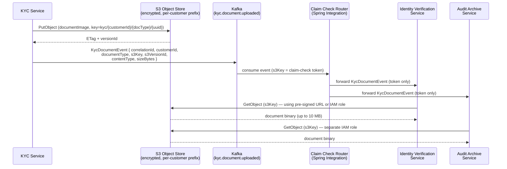

# Claim Check

Status: Draft | Last Reviewed: 2026-05-09 | Owner: @tech-lead-backend
Catalog ID: EIP-009 | Radii: Ring 0, Ring 1, Ring 2
Tier Applicability: T0, T1

## Problem Statement

- KYC onboarding requires uploading up to five identity documents (CCCD front/back, utility bill, selfie with liveness video) totalling up to 10 MB per customer; Kafka messages have a practical payload limit of 1 MB (default broker config) and must never carry binary blobs — putting document images directly in Kafka events would breach broker limits, degrade consumer throughput for unrelated payment topics sharing the cluster, and make log-compaction semantically invalid.
- The fraud-detection ML model requires a feature vector of up to 500 floating-point values per transaction evaluation; these vectors cannot be regenerated cheaply and must be available to multiple consumers (model scoring, audit archive, model-retraining pipeline) without duplicating the payload in each downstream message.
- The SWIFT MX message gateway assembles large `camt.054` statements (bank-to-customer debit/credit notifications) that can exceed 2 MB for accounts with many transactions in a statement period; forwarding the full statement body through the integration bus would saturate the message broker for a small fraction of the message volume.
- Biometric verification templates produced by the liveness-detection service are up to 500 KB each and are subject to strict access-control requirements under Decree 13/2023/ND-CP; embedding them in a Kafka event makes it impossible to enforce per-consumer access control or apply retention TTLs independently of the event stream.
- Retaining large payloads on the Kafka topic beyond the minimum processing window wastes expensive SSD-backed broker storage; the payloads themselves belong in object storage with independent lifecycle policies (S3 Glacier tiering after 30 days, deletion after regulatory retention period expires).
- Without a claim-check indirection, any single large payload entering the bus degrades throughput for all consumers on the same partition, creating a head-of-line blocking problem that violates the SLA for real-time NAPAS payment events sharing the cluster.

## Solution

A Claim Check separates a large message payload from its routing envelope: the sender stores the payload in a durable data store (S3 for documents, Redis for ephemeral ML vectors), replaces it with a lightweight reference token (the "claim check") in the message, publishes the token-carrying message to the bus, and authorised receivers exchange the token for the original payload when they are ready to process it.



## Implementation Guidelines

### 1. S3 upload before event publication — KYC document store

The KYC service must store the payload in S3 and obtain a confirmed write acknowledgement (ETag) before publishing the Kafka event. Never publish the token first: a consumer that receives the token before the payload is stored will get a 404 from S3, which is operationally indistinguishable from an access-denied error.

```java
// KycDocumentClaimCheckProducer.java
@Service
@Slf4j
public class KycDocumentClaimCheckProducer {

    private final S3Client s3Client;
    private final KafkaTemplate<String, KycDocumentEvent> kafkaTemplate;

    @Value("${kyc.document.bucket}")
    private String bucketName;

    public void uploadAndPublish(String customerId,
                                  DocumentType docType,
                                  byte[] documentBytes,
                                  String contentType,
                                  String correlationId) {
        String s3Key = buildS3Key(customerId, docType, correlationId);
        // 1. Store payload — must succeed before event is published
        PutObjectResponse s3Response = s3Client.putObject(
            PutObjectRequest.builder()
                .bucket(bucketName)
                .key(s3Key)
                .contentType(contentType)
                .contentLength((long) documentBytes.length)
                .serverSideEncryption(ServerSideEncryption.AWS_KMS)
                .ssekmsKeyId("${kyc.kms.key-id}")
                .tagging("customerId=" + customerId + "&docType=" + docType.name()
                         + "&correlationId=" + correlationId)
                .build(),
            RequestBody.fromBytes(documentBytes));

        log.info("action=kyc_document_stored correlationId={} s3Key={} etag={} sizeBytes={}",
                 correlationId, s3Key, s3Response.eTag(), documentBytes.length);

        // 2. Publish token event — only after confirmed S3 write
        KycDocumentEvent event = new KycDocumentEvent(
            correlationId,
            customerId,
            docType,
            s3Key,
            s3Response.versionId(),
            contentType,
            documentBytes.length,
            Instant.now()
        );
        // Publish token only after confirmed S3 write
        kafkaTemplate.send("kyc.document.uploaded", customerId, event)
            .whenComplete((result, ex) -> {
                if (ex != null) {
                    log.error("action=kyc_event_publish_failed cid={} s3Key={} error={}",
                              correlationId, s3Key, ex.getMessage(), ex);
                    // Orphan handled by daily cleanup job
                }
            });
    }

    private String buildS3Key(String customerId, DocumentType docType, String correlationId) {
        return String.format("kyc/%s/%s/%s",
            customerId, docType.name().toLowerCase(), correlationId);
    }
}
```

### 2. Claim-check event model

The event published to Kafka carries no binary data — only the reference token and metadata needed for routing, access control, and audit.

```java
// KycDocumentEvent.java
public record KycDocumentEvent(
    String correlationId,
    String customerId,
    DocumentType documentType,       // CCCD_FRONT, CCCD_BACK, SELFIE, LIVENESS_VIDEO, UTILITY_BILL
    String s3Key,                    // the claim-check reference token
    String s3VersionId,              // S3 versioning for idempotent retrieval
    String contentType,              // image/jpeg, video/mp4, application/pdf
    long sizeBytes,
    Instant uploadedAt
) {}
```

### 3. Consumer-side payload retrieval with pre-signed URL

Consumers retrieve the payload from S3 using a short-lived pre-signed URL generated by the consumer's own IAM role. This means S3 bucket policies control which services can read which prefixes, independently of the Kafka topic ACLs.

```java
// KycDocumentRetriever.java
@Component
@Slf4j
public class KycDocumentRetriever {

    private final S3Presigner s3Presigner;
    private final RestClient restClient;

    @Value("${kyc.document.bucket}")
    private String bucketName;

    @Value("${kyc.presigned-url.ttl-seconds:300}")
    private int presignedUrlTtlSeconds;

    public byte[] retrieve(String s3Key, String correlationId) {
        log.info("action=kyc_document_retrieve correlationId={} s3Key={}", correlationId, s3Key);
        PresignedGetObjectRequest presigned = s3Presigner.presignGetObject(r -> r
            .signatureDuration(Duration.ofSeconds(presignedUrlTtlSeconds))
            .getObjectRequest(g -> g.bucket(bucketName).key(s3Key)));

        return restClient.get()
            .uri(presigned.url().toString())
            .retrieve()
            .body(byte[].class);
    }
}
```

### 4. Redis-backed claim check for ephemeral ML feature vectors

Fraud-detection feature vectors are ephemeral: they are needed only during the scoring window (< 60 seconds) and must not persist beyond the transaction lifecycle. Use Redis with a 5-minute TTL as the claim-check store instead of S3.

```java
// FraudFeatureVectorClaimCheck.java
@Component
public class FraudFeatureVectorClaimCheck {

    private final RedisTemplate<String, float[]> redisTemplate;

    @Value("${fraud.feature-vector.ttl-seconds:300}")
    private int ttlSeconds;

    /** Store vector and return the claim-check UUID token. */
    public String store(float[] featureVector) {
        String token = UUID.randomUUID().toString();
        String redisKey = "fraud:fv:" + token;
        redisTemplate.opsForValue().set(redisKey, featureVector,
                                         Duration.ofSeconds(ttlSeconds));
        return token;
    }

    /** Retrieve and immediately delete (claim is consumed once). */
    public float[] claimAndDelete(String token) {
        String redisKey = "fraud:fv:" + token;
        float[] vector = redisTemplate.opsForValue().getAndDelete(redisKey);
        if (vector == null) {
            throw new ClaimCheckExpiredException(token,
                "Feature vector not found or already claimed; token=" + token);
        }
        return vector;
    }
}

// FraudScoringEvent.java
public record FraudScoringEvent(
    String correlationId,
    String transactionId,
    String featureVectorToken,    // Redis key UUID — the claim-check reference
    int featureDimensions,
    Instant generatedAt
) {}
```

### 5. Orphaned payload cleanup and idempotency

A background job identifies S3 objects whose Kafka event was never confirmed (producer failure after S3 write) and soft-deletes them using S3 object tags written at upload time correlated against the processed-correlationId repository.

```java
// OrphanedClaimCheckCleanupJob.java
@Component @Slf4j
public class OrphanedClaimCheckCleanupJob {

    private final S3Client s3Client;
    private final ProcessedCorrelationIdRepository processedRepo;

    @Scheduled(cron = "0 0 2 * * *")  // daily at 02:00
    public void cleanupOrphans() {
        Instant cutoff = Instant.now().minus(Duration.ofHours(24));
        s3Client.listObjectsV2Paginator(r -> r.bucket(bucketName).prefix("kyc/"))
            .stream().flatMap(p -> p.contents().stream())
            .filter(obj -> obj.lastModified().isBefore(cutoff))
            .forEach(obj -> {
                String cid = getTagValue(obj.key(), "correlationId");
                if (!processedRepo.exists(cid)) {
                    log.warn("action=orphan_candidate s3Key={} cid={}", obj.key(), cid);
                    tagForDeletion(obj.key());  // actual delete after 7-day grace period
                }
            });
    }
}
```

### 6. Transactional outbox pattern to prevent lost events

If Kafka publish fails after the S3 write, the payload is orphaned. Use a transactional outbox: write a `KycDocumentOutboxEntry` to the same JDBC transaction as the S3-key record; a relay process publishes unpublished entries to Kafka every 2 seconds and marks them published on success.

```java
// KycDocumentOutboxRelay.java
@Component @Slf4j
public class KycDocumentOutboxRelay {

    private final KycDocumentOutboxRepository outboxRepo;
    private final KafkaTemplate<String, KycDocumentEvent> kafkaTemplate;

    @Scheduled(fixedDelay = 2000)
    @Transactional
    public void relay() {
        outboxRepo.findByPublishedFalse(PageRequest.of(0, 100)).forEach(entry -> {
            kafkaTemplate.send("kyc.document.uploaded", entry.getCustomerId(), toEvent(entry))
                .thenRun(() -> {
                    entry.setPublished(true);
                    entry.setPublishedAt(Instant.now());
                    outboxRepo.save(entry);
                });
        });
    }
}
```

## When to Use / When NOT to Use

**Use when:**
- The payload exceeds the message broker's practical size threshold (typically 1 MB for Kafka in a shared cluster).
- The payload must be retained under a different lifecycle policy than the event stream (e.g., KYC documents retained 10 years; payment events retained 7 days on Kafka).
- Access to the payload must be controlled independently from access to the routing event (IAM prefix policies on S3 per document type; consumer groups on Kafka per business function).
- The payload is needed by some consumers but not all — consumers that only need routing metadata skip the retrieval step entirely, saving bandwidth.

**Do NOT use when:**
- The payload is small and self-contained (under 50 KB for infrequent messages, under 10 KB for high-throughput topics) — the indirection overhead exceeds the benefit.
- The payload store introduces a single point of failure that the original message bus did not have; if the payload store is less reliable than Kafka, claim-check makes the system less reliable, not more.
- Message ordering is critical and the payload retrieval step introduces non-deterministic latency that breaks ordering guarantees.
- The downstream consumer cannot tolerate payload retrieval latency (e.g., a sub-1 ms real-time path) — the S3 GetObject round-trip is 5–50 ms.

## Variants and Trade-offs

| Variant | When | Trade-off |
|---|---|---|
| S3 + IAM pre-signed URL | Large binary payloads (documents, images, video) with per-consumer access control | Durable, cheap at scale; S3 GetObject adds 10–50 ms latency per retrieval |
| Redis ephemeral claim check | Short-lived ML feature vectors, session state; TTL-bounded | Sub-millisecond retrieval; data lost on Redis failure if no persistence; memory cost |
| PostgreSQL BYTEA column | Small-medium payloads needing ACID semantics with the event record | Transactional; poor scalability above ~100 MB table; not suitable for binary blobs |
| MinIO (self-hosted S3) | Data sovereignty: payload must not leave the Vietnam data centre | Compatible API; operational burden of running MinIO cluster |
| Azure Blob / GCS | Techcombank cloud strategy chooses non-AWS provider | Provider-specific SDK; otherwise same trade-offs as S3 |

## NFR Acceptance Criteria

```yaml
id: CC-1
pattern: Claim Check
service: kyc-document-service / fraud-scoring-service

availability:
  s3_target: "99.99% (AWS S3 SLA)"
  redis_target: "99.9% (Redis cluster, 3-node)"
  claim_check_event_delivery: "99.95% (Kafka + transactional outbox guarantees at-least-once)"

performance:
  s3_put_p99_ms: 200
  s3_get_p99_ms: 80
  redis_get_p99_ms: 2
  event_publish_p99_ms: 30
  basis: "Measured in ap-southeast-1 region; document upload is async from user response"

reliability:
  payload_durability: "S3 11-nines durability; versioning enabled to protect against accidental delete"
  token_validity: "S3 claim-check token valid indefinitely (versioned object); Redis token TTL = 300 s"
  orphan_cleanup: "Orphaned S3 objects detected and tagged-for-deletion within 24 hours"
  idempotency: "Consumer must be idempotent on duplicate event delivery (outbox may re-deliver)"

security:
  s3_encryption: "SSE-KMS with per-customer-prefix KMS key alias"
  presigned_url_ttl: "300 seconds maximum"
  redis_encryption: "TLS in-transit, encryption at rest enabled"
  iam_least_privilege: "Each consuming service has GetObject on its own S3 prefix only"

observability:
  metrics:
    - "eip.claim_check.s3_put_latency_ms (histogram)"
    - "eip.claim_check.s3_get_latency_ms (histogram)"
    - "eip.claim_check.redis_get_latency_ms (histogram)"
    - "eip.claim_check.orphaned_objects (gauge, from cleanup job)"
    - "eip.claim_check.token_expired_errors (counter)"
  alerts:
    - "token_expired_errors > 5 over 5 min → PagerDuty P2 (TTL misconfiguration)"
    - "orphaned_objects > 100 → Slack #kyc-ops (outbox relay degraded)"
    - "s3_put_latency_ms p99 > 500 ms → PagerDuty P3"
```

## Compliance Mapping

| Layer | Reference | Section / Control | How |
|---|---|---|---|
| Ring 0 (global) | Enterprise Integration Patterns (Hohpe/Woolf) | Ch. 8 — Claim Check | Pattern definition; large payload stored externally, token travels on bus |
| Ring 1 (international banking) | BCBS 239 §6 — Data Accuracy and Integrity | Principle 6 | S3 versioned objects provide immutable audit trail of each document version; `s3VersionId` in event enables lineage |
| Ring 1 (international banking) | PCI-DSS v4.0 Requirement 3.5 | Protect primary account numbers wherever stored | Card-related claim-check payloads encrypted with SSE-KMS; presigned URLs expire in 300 s limiting exposure window |
| Ring 2 (Vietnam) | SBV Circular 09/2020 §III.4 ⚠️ (working summary — pending Legal review) | Document retention for KYC and customer onboarding | S3 lifecycle policy retains KYC documents 10 years per SBV requirement; Kafka events retained 7 days independently |
| Ring 2 (Vietnam) | Decree 13/2023/ND-CP Art. 9 ⚠️ (working summary — pending Legal review) | Sensitive personal data — biometric / financial | Biometric templates stored in S3 with KMS encryption; access controlled by IAM prefix policy; not transmitted in Kafka message body |

## Cost / FinOps Notes

- S3 Standard for KYC documents: 5 000 customers/day × 5 docs × 2 MB = 50 GB/day. Transition to S3 Intelligent-Tiering after 30 days, Glacier Instant Retrieval after 1 year. 10-year cost: ~$800/month vs ~$15 000/month on Kafka cluster SSDs.
- S3 API costs: PutObject + GetObject negligible at KYC volumes; at fraud-vector throughput (3 000 tx/s × 2 calls = 6 000 req/s) budget ~$80/month.
- Redis for feature vectors: 500 floats × 4 bytes = 2 KB each; 3 000 concurrent × 300 s TTL = 6 MB peak — use existing Redis cluster, no dedicated instance needed.
- KMS: 5 000 documents/day → ~$55/year — negligible.
- Transactional outbox adds one JDBC write per upload; keep outbox table on the same RDS instance as the KYC service to avoid distributed transaction overhead.

## Threat Model Summary

| Threat | Vector | Mitigation |
|---|---|---|
| Token enumeration / payload access | Attacker guesses s3Key (if not random) | s3Key includes a UUID component; bucket has no public access; GetObject requires IAM role or pre-signed URL |
| Pre-signed URL theft | URL intercepted in transit or logged | Pre-signed URLs expire in 300 s; HTTPS only; URLs must not appear in application logs (log sanitiser strips `X-Amz-Signature` parameter) |
| S3 write-after-publish race | Consumer receives event before payload is committed to S3 | Transactional outbox: Kafka event published only after outbox relay confirms S3 ETag is stored |
| Redis token replay | Attacker obtains Redis key and retrieves feature vector | `getAndDelete` pattern: token consumed on first retrieval; duplicate retrieval raises `ClaimCheckExpiredException` |
| Cross-customer prefix access | Consumer IAM role has overly broad GetObject permission | IAM condition: `s3:prefix` restricted to consumer's own service prefix; verified in IaC policy unit tests |
| Biometric data exfiltration via S3 | Compromised service account exfiltrates all KYC documents | S3 Access Analyzer detects cross-account or public access; CloudTrail logs all GetObject calls; anomaly detection on unusual access patterns (DLP alert) |

## Operational Runbook (stub)

- **Health check:** `GET /actuator/health/claim-check` verifies S3 HeadBucket reachability and Redis ping.
- **Token-expired response:** If consumers report `ClaimCheckExpiredException` on Redis tokens, verify scoring pipeline is processing within the 300 s TTL; scale fraud scoring consumer group if lagging.
- **S3 403 alert:** Verify IAM role policy was not modified by a recent Terraform apply; check CloudTrail for policy change events.
- **Orphan cleanup:** Monitor `eip.claim_check.orphaned_objects` daily; rising count means outbox relay is degraded — check `kyc_document_outbox.published = false` count in RDS.
- **KMS rotation:** Annual rotation is automatic; verify via CloudTrail `RotateKey` event.
- **RTBF deletion:** Delete S3 object versions for the customer prefix, publish a Kafka tombstone event, delete outbox entries. Coordinate with Legal for retention override.

## Test Strategy (stub)

- **Unit tests:** Mock S3Client and KafkaTemplate; assert `uploadAndPublish` never calls `send` if S3 `putObject` throws; assert s3Key format matches expected prefix.
- **Integration tests:** Use LocalStack for S3 and embedded Redis; run full round-trip (store → event → retrieve) for KYC document and fraud feature-vector scenarios.
- **Idempotency tests:** Deliver the same `KycDocumentEvent` twice; assert `getAndDelete` is called once and the second delivery raises `ClaimCheckExpiredException` without duplicate processing.
- **Orphan cleanup test:** Write an S3 object without a corresponding outbox entry; run cleanup job; assert object is tagged for deletion.
- **Security tests:** Assert a consumer with the wrong IAM prefix cannot retrieve a document via a valid token from another prefix (LocalStack IAM simulation).
- **Chaos tests:** Kill Redis mid-transaction; assert DLQ routing (not silent failure). Kill S3 endpoint; assert outbox relay back-offs and does not publish token events.

## Related Patterns

- **EIP-006 Message Translator** — translate format before storage when the payload needs format conversion (OFS → ISO 20022).
- **EIP-007 Content Enricher** — claim-check token is a lightweight enrichment reference; consumers that only need routing metadata skip retrieval entirely.
- **EIP-008 Content Filter** — apply after retrieval to strip PII before forwarding to analytics consumers.
- **Transactional Outbox** — mandatory companion; guarantees the token event is published if and only if the payload is durably stored.
- **EIP-004 Dead Letter Channel** — retrieval failures (expired token, S3 unavailable) must route to DLQ with the original event intact for replay after recovery.

## References

- Hohpe, G. & Woolf, B. — *Enterprise Integration Patterns* (2003), Chapter 8: Claim Check
- AWS S3 Presigned URLs: `https://docs.aws.amazon.com/AmazonS3/latest/userguide/using-presigned-url.html`
- AWS S3 Lifecycle policies: `https://docs.aws.amazon.com/AmazonS3/latest/userguide/object-lifecycle-mgmt.html`
- Decree 13/2023/ND-CP on personal data protection (Vietnam): `https://vanban.chinhphu.vn/`
- SBV Circular 09/2020: State Bank of Vietnam portal
- Transactional Outbox pattern: `https://microservices.io/patterns/data/transactional-outbox.html`
- LocalStack (local AWS emulation for testing): `https://localstack.cloud/`
- Catalog reference: `governance/standards/enterprise-architecture-catalog.md`

---
**Key Takeaway**: The Claim Check pattern keeps Kafka messages lean and broker-friendly by storing large KYC document images in S3 (with SSE-KMS encryption and per-consumer IAM prefix policies) and ephemeral ML feature vectors in Redis (with TTL-bounded `getAndDelete` semantics), passing only a lightweight reference token on the bus so that payload lifecycle, access control, and retention policies are managed independently of the event stream.
