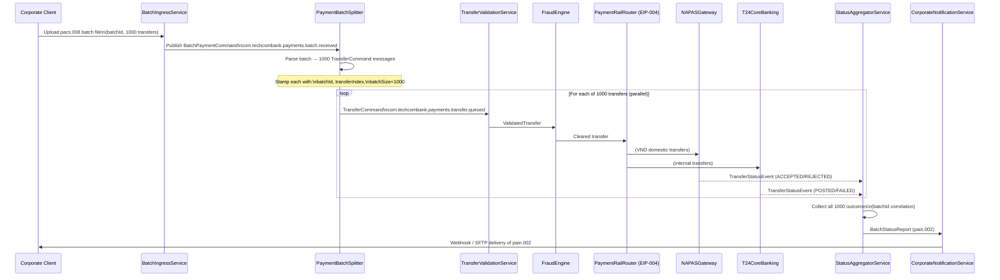

# Composed Message Processor

Status: Draft | Last Reviewed: 2026-05-09 | Owner: @tech-lead-backend
Catalog ID: EIP-014 | Radii
Tier Applicability: T0, T1

## Problem Statement

- Corporate banking clients at Techcombank submit batch payment files containing hundreds to thousands of individual ISO 20022 `pacs.008` credit-transfer instructions in a single file upload. Processing the entire batch as a monolith forces each downstream rail processor (NAPAS, SWIFT, T24) to receive, parse, and filter the full file to extract the transfers relevant to it — wasteful and tightly coupled.
- Individual transfers within a batch may fail validation independently: one beneficiary account number may be invalid, another may exceed a daily limit, while others in the same batch are perfectly valid. A monolithic batch processor must choose between rejecting the entire batch (unacceptable to the client) or embedding per-transfer validation logic inside the batch handler (violates Single Responsibility).
- NAPAS settlement requires each transfer to be submitted as an individual ISO 20022 message, not as a batch. The batch file must be decomposed before submission. Similarly, T24 OFS posting accepts one transaction at a time. The decomposition step must be transparent to the processing services — they should receive individual transfer messages, not batch references.
- Reporting requires a consolidated status file: after all individual transfers have been processed, a single ISO 20022 `pain.002` payment status report must be generated and delivered back to the corporate client. This requires reassembly of all individual outcomes — including partial failures — into one cohesive response.
- Processing 1,000 individual transfers sequentially at 50ms per transfer takes 50 seconds. By splitting the batch and processing transfers in parallel across multiple consumers, the wall-clock time collapses to approximately `50ms × ceil(1000 / parallel_consumers)`. At 20 consumers, that is 50ms × 50 = 2.5 seconds — a 20× improvement required to meet the corporate SLA of < 5 seconds for batch status acknowledgement.
- Correlation is critical: every individual transfer must carry a reference back to its parent batch so that the reassembler can collect exactly the right set of outcomes. Losing or duplicating the correlation reference causes either an incomplete or an inflated status report — a financial data-integrity defect.

## Solution

A Composed Message Processor (CMP) chains three collaborating patterns: a **Splitter** decomposes the batch `pacs.008` file into individual transfer messages; downstream processors (validation, FraudEngine, rail-specific handlers) process each transfer independently in parallel; an **Aggregator** reassembles the individual outcomes into a single `pain.002` status report once all transfers in the batch have completed.



## Implementation Guidelines

1. **Implement the Splitter as a Spring Integration `@Splitter` component** that parses the ISO 20022 batch XML, extracts individual `CreditTransferTransactionInformation` elements, and emits each as an independent `TransferCommand` message carrying the `batchId` and the transfer's index within the batch.

   ```java
   @Component
   @RequiredArgsConstructor
   @Slf4j
   public class PaymentBatchSplitter {

       private final Pacs008Parser parser;
       private final KafkaTemplate<String, TransferCommand> kafkaTemplate;
       private final MeterRegistry metrics;

       @KafkaListener(
           topics = "com.techcombank.payments.batch.received",
           groupId = "payment-batch-splitter"
       )
       public void split(
               @Payload BatchPaymentCommand batch,
               @Header("X-Correlation-Id") String correlationId,
               Acknowledgment ack) {

           List<CreditTransfer> transfers = parser.parseTransfers(batch.getPacs008Xml());
           int batchSize = transfers.size();

           log.info("CMP split: batchId={} transferCount={} correlationId={}",
               batch.getBatchId(), batchSize, correlationId);

           for (int i = 0; i < transfers.size(); i++) {
               TransferCommand cmd = TransferCommand.builder()
                   .transferId(UUID.randomUUID().toString())
                   .batchId(batch.getBatchId())
                   .batchSize(batchSize)
                   .transferIndex(i)
                   .creditTransfer(transfers.get(i))
                   .correlationId(correlationId)
                   .build();

               ProducerRecord<String, TransferCommand> record =
                   new ProducerRecord<>(
                       "com.techcombank.payments.transfer.queued",
                       batch.getBatchId(),  // partition by batchId for ordering within batch
                       cmd);
               record.headers()
                   .add("X-Batch-Id", batch.getBatchId().getBytes(StandardCharsets.UTF_8))
                   .add("X-Batch-Size", String.valueOf(batchSize).getBytes(StandardCharsets.UTF_8))
                   .add("X-Transfer-Index", String.valueOf(i).getBytes(StandardCharsets.UTF_8))
                   .add("X-Correlation-Id", correlationId.getBytes(StandardCharsets.UTF_8));

               kafkaTemplate.send(record);
           }

           metrics.counter("cmp.split.transfers_emitted",
               "batchId", batch.getBatchId()).increment(batchSize);
           ack.acknowledge();
       }
   }
   ```

2. **Maintain the split count in a durable store so the Aggregator knows when a batch is complete.** The Splitter atomically writes `{batchId: X, expectedCount: 1000}` to Redis at the start of the split operation. The Aggregator reads this to determine its completion condition — avoiding the need to embed `batchSize` in every individual transfer message.

   ```java
   @Component
   @RequiredArgsConstructor
   public class BatchRegistry {

       private final RedisTemplate<String, Integer> redisTemplate;
       private static final Duration BATCH_TTL = Duration.ofHours(24);

       public void registerBatch(String batchId, int expectedCount) {
           redisTemplate.opsForValue()
               .set("batch:expected:" + batchId, expectedCount, BATCH_TTL);
       }

       public int getExpectedCount(String batchId) {
           Integer count = redisTemplate.opsForValue()
               .get("batch:expected:" + batchId);
           if (count == null) {
               throw new BatchNotFoundException(
                   "No batch registration found for batchId: " + batchId);
           }
           return count;
       }

       public void recordOutcome(String batchId, TransferStatusEvent event) {
           redisTemplate.opsForList()
               .rightPush("batch:outcomes:" + batchId, event);
           redisTemplate.expire("batch:outcomes:" + batchId, BATCH_TTL);
       }
   }
   ```

3. **Implement the Aggregator as a Spring Integration aggregator that releases when `received == expectedCount`.** Use the Redis-backed `MessageGroupStore` so aggregation state is not lost when an aggregator pod restarts mid-batch.

   ```java
   @Configuration
   @RequiredArgsConstructor
   public class StatusAggregatorConfig {

       private final BatchRegistry batchRegistry;
       private final RedisMessageGroupStore groupStore;

       @Bean
       public IntegrationFlow batchStatusAggregatorFlow(
               MessageChannel transferStatusChannel) {
           return IntegrationFlow.from(transferStatusChannel)
               .aggregate(spec -> spec
                   .messageStore(groupStore)
                   .correlationStrategy(msg ->
                       msg.getHeaders().get("X-Batch-Id", String.class))
                   .releaseStrategy(group -> {
                       String batchId = (String) group.getGroupId();
                       int expected = batchRegistry.getExpectedCount(batchId);
                       return group.size() >= expected;
                   })
                   .groupTimeout(Duration.ofMinutes(10).toMillis())
                   .sendPartialResultOnExpiry(true)
                   .outputProcessor(this::assembleBatchStatusReport))
               .channel("batchStatusReportChannel")
               .get();
       }

       private BatchStatusReport assembleBatchStatusReport(
               MessageGroup group) {
           List<TransferStatusEvent> outcomes = group.getMessages().stream()
               .map(m -> (TransferStatusEvent) m.getPayload())
               .collect(Collectors.toList());

           long accepted = outcomes.stream()
               .filter(o -> o.getStatus() == TransferStatus.ACCEPTED
                   || o.getStatus() == TransferStatus.POSTED)
               .count();
           long rejected = outcomes.size() - accepted;

           log.info("CMP reassemble: batchId={} total={} accepted={} rejected={}",
               outcomes.get(0).getBatchId(), outcomes.size(), accepted, rejected);

           return BatchStatusReport.builder()
               .batchId(outcomes.get(0).getBatchId())
               .totalCount(outcomes.size())
               .acceptedCount((int) accepted)
               .rejectedCount((int) rejected)
               .transferOutcomes(outcomes)
               .generatedAt(Instant.now())
               .build();
       }
   }
   ```

4. **Ensure each individual transfer processor is idempotent using `transferId` as the idempotency key.** Kafka retries at any processing stage could cause a transfer to be submitted twice to NAPAS or T24. Each downstream handler checks a Redis idempotency set for the `transferId` before executing. A duplicate detected within a 24-hour window returns the cached outcome without re-processing.

   ```java
   @Component
   @RequiredArgsConstructor
   @Slf4j
   public class TransferValidationService {

       private final IdempotencyStore idempotencyStore;
       private final ValidationRuleEngine validator;
       private final KafkaTemplate<String, ValidatedTransfer> kafkaTemplate;

       @KafkaListener(
           topics = "com.techcombank.payments.transfer.queued",
           groupId = "transfer-validation-service",
           concurrency = "20"  // 20 parallel consumers for batch throughput
       )
       public void validate(
               @Payload TransferCommand cmd,
               @Header("X-Batch-Id") String batchId,
               Acknowledgment ack) {

           if (idempotencyStore.isDuplicate(cmd.getTransferId())) {
               log.info("CMP idempotent skip: transferId={} batchId={}",
                   cmd.getTransferId(), batchId);
               ack.acknowledge();
               return;
           }

           ValidationResult result = validator.validate(cmd.getCreditTransfer());
           idempotencyStore.record(cmd.getTransferId());

           // publish to next stage regardless of validation outcome
           // (rejected transfers still need to reach the aggregator as REJECTED status)
           kafkaTemplate.send("com.techcombank.payments.transfer.validated",
               batchId, ValidatedTransfer.of(cmd, result));
           ack.acknowledge();
       }
   }
   ```

5. **Partition Kafka topics by `batchId`** to ensure that all messages for a given batch are handled by the same consumer pod during the split phase. This is a performance optimisation — correct behaviour does not depend on it, but it improves Redis locality and reduces cross-pod coordination overhead.

6. **Generate the ISO 20022 `pain.002` status report from the `BatchStatusReport` domain object** and deliver it to the corporate client via the configured channel (SFTP for batch file clients, webhook for API-integrated clients). The `CorporateNotificationService` is downstream of the aggregator and decoupled from the aggregation mechanism.

   ```java
   @Service
   @RequiredArgsConstructor
   @Slf4j
   public class CorporateNotificationService {

       private final Pain002Generator pain002Generator;
       private final CorporateDeliveryRouter deliveryRouter;

       @ServiceActivator(inputChannel = "batchStatusReportChannel")
       public void notify(BatchStatusReport report) {
           String pain002Xml = pain002Generator.generate(report);

           log.info("CMP notify: batchId={} deliveryChannel={} accepted={} rejected={}",
               report.getBatchId(),
               deliveryRouter.resolveChannel(report.getBatchId()),
               report.getAcceptedCount(),
               report.getRejectedCount());

           deliveryRouter.deliver(report.getBatchId(), pain002Xml);
       }
   }
   ```

## When to Use / When NOT to Use

**Use when:**
- A single incoming message is a composite of independently processable sub-items (batch files, multi-transfer envelopes, multi-leg transactions).
- Sub-items can fail independently and a partial success must be reported rather than an all-or-nothing outcome.
- Sub-items must be processed by different downstream services (different rails, different validators) based on their individual content.
- The client expects a single consolidated response after all sub-items have been processed.

**Do NOT use when:**
- The composite message is small enough to be processed atomically in a single transaction — splitting adds overhead without benefit.
- Sub-items must be processed strictly in order and the order cannot be restored after splitting — consider a Resequencer (EIP-013) if ordering can be restored, or avoid splitting if it cannot.
- The sub-item count is unknown at split time and can be unbounded — the aggregator's completion condition must be definable; if the total is unknown, the aggregator cannot know when to release.
- All sub-items must succeed for any to be committed — use a distributed Saga (INT-001) for all-or-nothing semantics.

## Variants & Trade-offs

| Variant | When | Trade-off |
|---|---|---|
| Full CMP (Splitter + parallel processing + Aggregator, this doc) | Batch requires parallel processing and consolidated response | Maximum throughput; aggregator complexity and Redis dependency |
| Splitter-only (fire and forget) | Sub-items processed independently; no consolidated response needed | Simpler; no aggregator; no consolidated status report for the client |
| Sequential CMP | Ordering within the batch is critical and cannot be violated | Simpler aggregation (in-order, no resequencing needed); loses parallel throughput benefit |
| Hierarchical split | Batch contains batches (e.g., multi-bank disbursement file) | Two-level split and two-level aggregation; very powerful but significantly more complex |
| Chunked split | Split into fixed-size chunks rather than individual items | Reduces number of Kafka messages; downstream processors handle mini-batches; trades granularity for message volume |

## NFR Acceptance Criteria

```yaml
nfr:
  catalog_id: EIP-014
  service_name: payment-batch-composed-processor
  tier: T1

  availability:
    target: 99.95%
    failure_mode: "splitter crash → batch stays on batch.received topic (Kafka retention 72h); aggregator crash → Redis group store retains partial outcomes"
    recovery: "splitter restart < 60s; aggregator restart < 30s; Redis group state survives pod restarts"

  performance:
    batch_split_throughput_transfers_per_second: 5000   # splitter publish rate
    end_to_end_batch_p95_seconds: 300                   # 1000 transfers at 20 consumers × 50ms each
    aggregation_completion_accuracy: 100%               # aggregator must collect exactly batchSize outcomes
    parallel_transfer_consumers: 20

  correctness:
    split_count_integrity: "exactly batchSize TransferCommand messages emitted per batch; verified by BatchRegistry"
    aggregation_completeness: "pain.002 report contains exactly batchSize outcomes (accepted + rejected + failed)"
    idempotency: "no transfer submitted to NAPAS/T24 more than once within 24h window"
    partial_failure_handling: "batches with 1-N rejected transfers produce a pain.002 with per-transfer status; batch is not fully rejected"

  observability:
    required_metrics:
      - cmp_split_transfers_emitted_total (by batchId)
      - cmp_aggregate_outcomes_received_total (by batchId, status)
      - cmp_batch_processing_duration_seconds (histogram)
      - cmp_aggregation_timeout_total
      - cmp_idempotent_skip_total
    log_fields: [batchId, correlationId, transferId, transferIndex, batchSize, stage, outcome]
    alerts:
      - name: CMP_AggregationTimeout_High
        condition: "rate(cmp_aggregation_timeout_total[15m]) > 0.01"
        severity: High
      - name: CMP_SplitCountMismatch
        condition: "cmp_split_transfers_emitted_total != cmp_aggregate_outcomes_received_total (by batchId, at batch close)"
        severity: Critical
```

## Compliance Mapping

| Layer | Reference | Section/Control | How this pattern satisfies |
|---|---|---|---|
| Ring 0 (global) | Enterprise Integration Patterns (Hohpe/Woolf) | Chapter 7 — Composed Message Processor (Splitter + Aggregator) | Canonical pattern; this doc applies it to ISO 20022 batch payment processing at Techcombank |
| Ring 0 | NIST SP 800-53 | SI-12 Information Management and Retention | Individual transfer processing records and the consolidated `pain.002` are retained per the payment records policy (7 years); idempotency records retained 24 hours |
| Ring 0 | ISO 20022 pacs.008.001.10 / pain.002.001.12 | CreditTransferTransaction + PaymentStatusReport | The splitter produces ISO 20022-compliant `TransferCommand` objects; the aggregator produces an ISO 20022 `pain.002` — standards compliance is structural |
| Ring 1 (international banking) | BCBS 239 §6 | Accuracy & Completeness | Every transfer outcome (accepted, rejected, or failed) is captured in the `pain.002`; the aggregator's completion check ensures no outcome is missing |
| Ring 1 | SWIFT gpi (Tracker) | Payment status reporting obligations | For SWIFT-rail transfers in the batch, the individual `TransferStatusEvent` carries the UETR (Unique End-to-end Transaction Reference) required by gpi Tracker |
| Ring 1 | PCI DSS v4.0 | Requirement 3 — Protect stored account data | Card or account numbers in batch transfer payloads are tokenised before splitting; individual transfer messages carry tokens, not raw PANs |
| Ring 2 (Vietnam) | SBV Circular 09/2020 §IV.2 ⚠️ (working summary — pending Legal review) | Operational continuity — batch payment processing | Splitter and Aggregator are independently deployable and horizontally scalable; Redis-backed group store survives pod failures within batch retention window |
| Ring 2 | NAPAS Batch Payment Specification v3.0 ⚠️ (working summary — pending Legal review) | Individual transfer submission requirement | The Splitter decomposes batch files into individual NAPAS-compatible transfer messages; each transfer carries the NAPAS-required reference fields |

## Cost / FinOps Notes

- **Kafka message volume** — A 1,000-transfer batch produces 1,000 `TransferCommand` messages + 1,000 `TransferStatusEvent` messages = 2,001 Kafka messages (including the original batch message). At average 2KB per transfer message, this is 4MB per batch. At 500 batches/day, this is 2GB/day of transfer-topic throughput — within standard Kafka capacity.
- **Redis group store** — Each batch's aggregation group holds 1,000 `TransferStatusEvent` messages in Redis during collection. At ~500 bytes per event: 500KB per batch. With 50 concurrent batches: 25MB Redis working set. TTL 10 minutes (aggregation window) + 24 hours (idempotency records). Redis node: 8GB, shared with other patterns. Estimated cost: USD 30/month increment.
- **Parallel consumer compute** — 20 concurrent Kafka consumers for the transfer validation service. Each consumer is a thread within the Spring Boot process; 5 pods × 4 threads/pod. At 2 vCPU/4GB per pod: USD 75/month for the validation service.
- **Split and aggregation overhead** — The splitter and aggregator add latency per batch: split publish time ~200ms for 1,000 transfers; aggregator release ~50ms. These are one-time overheads per batch, not per transfer. Total overhead: < 0.5 seconds per batch.
- **Cost of a split-count mismatch** — If the aggregator times out waiting for the last transfer outcome, the `pain.002` is delivered with incomplete data. The corporate client must then investigate and re-submit. Preventing this (via the `BatchRegistry` split-count integrity check and the `CMP_SplitCountMismatch` alert) avoids expensive manual reconciliation.

## Threat Model Summary

- **Malicious batch injection** — An attacker uploads a batch file containing 100,000 transfers to exhaust splitter throughput and flood downstream topics. Mitigation: the `BatchIngressService` enforces a maximum batch size (configurable, default 5,000 transfers) and a per-client daily batch-count limit. Batches exceeding limits are rejected at ingress with a `BATCH_SIZE_EXCEEDED` error before the splitter is invoked.
- **Split-count forgery** — An attacker manipulates the `X-Batch-Size` header to a lower number so the aggregator releases prematurely with an incomplete `pain.002`. Mitigation: the aggregator does not trust the `X-Batch-Size` header; it reads the expected count from the `BatchRegistry` (written by the Splitter using the actual parsed transfer count, not a header). The header is informational only.
- **Transfer payload tampering in transit** — A man-in-the-middle modifies individual transfer amounts after splitting. Mitigation: each `TransferCommand` carries a SHA-256 hash of the original `CreditTransferTransactionInformation` element; the validation service re-hashes and compares before processing.
- **Aggregation group store poisoning** — An attacker injects fabricated `TransferStatusEvent` messages with a known `batchId` into the aggregation response topic, inflating the aggregate count and triggering premature release. Mitigation: the response topic has strict Kafka ACLs — only the rail gateway service accounts (NAPAS adapter, T24 adapter) can produce to `transfer.status.events`; events are signed with service-account HMAC keys.
- **Redis aggregation store data exposure** — Aggregation groups contain in-flight payment data. Mitigation: Redis in TLS, encrypted at rest; group store TTL 24 hours; Redis access restricted to aggregator service account.

## Operational Runbook (stub)

1. **Alert: CMP_SplitCountMismatch** — The aggregator received fewer outcomes than the registered expected count. Check the `cmp_aggregate_outcomes_received_total` counter for the `batchId`. Identify which `transferId` values are missing from the aggregation group (query Redis `batch:outcomes:<batchId>`). Replay the missing transfers from the `transfer.queued` topic (if still within retention window) or escalate to the Payments Operations team.
2. **Alert: CMP_AggregationTimeout_High** — Batches are timing out in the aggregator. Check consumer lag on `transfer.status.events` for NAPAS and T24 adapters. If a rail adapter is down, transfers are processed but status events are not published — resolve the adapter issue first. Once resolved, queued status events will be consumed and pending aggregation groups will complete.
3. **Scaling for large batches** — Corporate clients occasionally submit batches > 5,000 transfers. To support this, increase `transfer-validation-service` concurrency (`@KafkaListener(concurrency = "40")`), increase Redis `BATCH_TTL` to 48 hours for large batches, and increase the aggregation timeout to 30 minutes. Coordinate the change with the Payments Operations team before the batch is submitted.
4. **Investigating a pain.002 with incorrect outcome counts** — Retrieve the `BatchStatusReport` from the event store. Compare `totalCount` against `BatchRegistry.getExpectedCount(batchId)`. If counts differ, the aggregator released on timeout (check `cmp_aggregation_timeout_total` for that batch window). Identify missing outcomes and replay from the rail adapter's dead-letter channel.

## Test Strategy (stub)

- **Unit tests** — Test `PaymentBatchSplitter.split`: provide a 10-transfer `BatchPaymentCommand`, assert 10 `TransferCommand` messages are published with correct `batchId`, `batchSize`, and `transferIndex`. Test `assembleBatchStatusReport`: provide 10 `TransferStatusEvent` messages, assert the `BatchStatusReport` contains correct `acceptedCount` and `rejectedCount`.
- **Integration tests** — Embedded Kafka + embedded Redis. Submit a 50-transfer batch. Assert all 50 `TransferCommand` messages are published. Simulate downstream rail adapters publishing `TransferStatusEvent` messages. Assert the `BatchStatusReport` is released and contains 50 outcomes.
- **Partial failure tests** — Submit a 10-transfer batch where 2 transfers fail validation. Assert the `pain.002` marks exactly 2 transfers as `REJECTED` and 8 as `ACCEPTED`. Assert the batch is not fully rejected.
- **Idempotency tests** — Trigger a Kafka retry for the same `TransferCommand`. Assert the transfer is processed only once (idempotency key present in Redis); the downstream NAPAS/T24 mock is called only once.
- **Aggregation timeout tests** — Suppress 2 of 10 status events from being published. Assert that after the aggregation timeout, a partial `BatchStatusReport` is released with 8 outcomes and 2 marked as missing.
- **Load tests** — Submit 100 concurrent 1,000-transfer batches. Assert all batches complete within 300 seconds P95. Assert Redis memory stays within the allocated 8GB.

## Related Patterns

- [EIP-013 Resequencer](resequencer.md) — If transfer messages arrive out of order, the Resequencer restores sequence before the Aggregator collects outcomes
- [EIP-015 Scatter-Gather](scatter-gather.md) — Scatter-Gather broadcasts one request to multiple recipients; CMP splits one composite message into independent parts
- [EIP-016 Routing Slip](routing-slip.md) — Routes a message sequentially through multiple processors; combine with CMP when each split part needs its own multi-step processing pipeline
- [EIP-024 Idempotent Receiver](idempotent-receiver.md) — Required at every downstream handler to survive Kafka retries without duplicate NAPAS/T24 submissions
- [EIP-025 Dead Letter Channel](dead-letter-channel.md) — Receives split messages that fail validation or cannot be delivered to a rail within the retry policy
- [INT-001 Saga Orchestration](../integration/saga-orchestration.md) — Use instead of CMP when all transfers in a batch must succeed or all must roll back (distributed atomic batch)

## References

- Hohpe, G. & Woolf, B. — Enterprise Integration Patterns (Addison-Wesley), Chapter 7: Splitter, Aggregator, Composed Message Processor
- ISO 20022 pacs.008.001.10 — Credit Transfer Initiation (batch format)
- ISO 20022 pain.002.001.12 — Payment Status Report
- NAPAS Vietnam — Batch Payment Technical Specification (internal, restricted)
- Spring Integration Reference — Splitter, Aggregator, MessageGroupStore, RedisMessageGroupStore
- Spring Kafka Reference — Concurrent `@KafkaListener`, partitioning strategies

---
**Key Takeaway**: The Composed Message Processor decomposes Techcombank's corporate batch payment files into individually processed transfers — enabling parallel NAPAS and T24 submission across 20 concurrent consumers — then reassembles all individual outcomes into a single ISO 20022 `pain.002` status report, turning a 50-second sequential batch into a sub-5-minute parallel workflow with per-transfer failure granularity.
