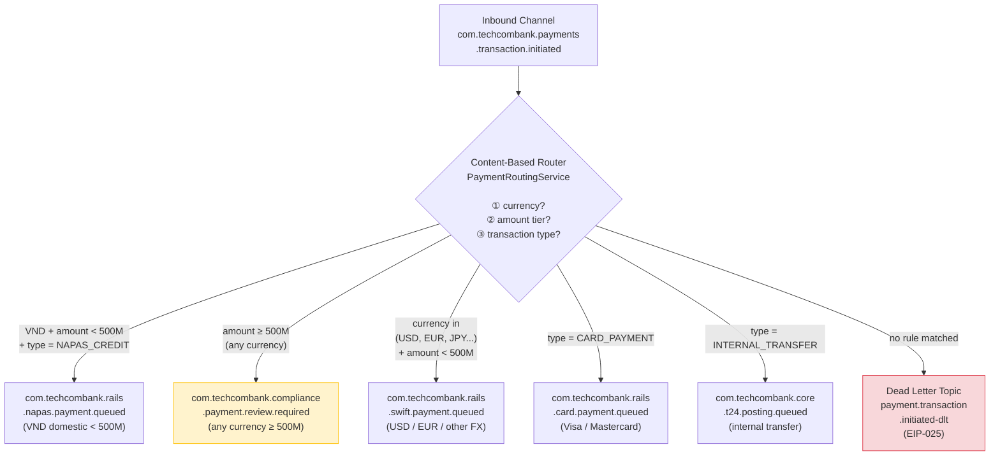

# Content-Based Router

Status: Draft | Last Reviewed: 2026-05-09 | Owner: @tech-lead-backend
Catalog ID: EIP-005 | Radii
Tier Applicability: T0, T1

## Problem Statement

- In a mixed-currency, multi-rail banking platform, a single inbound payment message may require entirely different processing paths — NAPAS domestic rails for VND transfers, SWIFT gpi for USD/EUR cross-border, card network APIs for card payments, and T24 OFS direct-posting for internal transfers. Coupling every handler to every message type bloats each service and creates hidden dependencies that break silently when a new payment type is introduced.
- Without explicit routing logic, each consumer must inspect the message to decide whether to act — leading to duplicated predicate code across services, inconsistent handling when a predicate is updated in one service but not others, and no single audit point for routing decisions.
- Compliance requirements mandate that high-value transactions (≥ VND 500M) are routed to a compliance-review path before execution. Embedding this threshold check inside individual services makes threshold changes a multi-team coordinated release instead of a single-config update.
- Silent routing failures — where a message matches no routing rule — cause the message to be dropped without any observable signal, violating BCBS 239 §6 Completeness and creating potential ledger gaps.

## Solution

A Content-Based Router (CBR) sits between the inbound Message Channel and the downstream handler channels. It inspects the message payload and/or headers and routes each message to exactly one downstream channel based on a set of versioned, observable routing rules. An explicit default route catches any message that matches no rule and routes it to the Dead Letter Channel (EIP-025) with a `ROUTING_UNMATCHED` exception — no silent drops.



### Routing rule precedence

Rules are evaluated in priority order. The compliance-threshold rule (amount ≥ VND 500M) takes precedence over the currency/rail rule so that a large USD payment is still flagged for compliance review before it proceeds to SWIFT.

| Priority | Rule | Destination |
|---|---|---|
| 1 | `amount >= 500_000_000 VND equivalent` | Compliance Review Channel |
| 2 | `type == CARD_PAYMENT` | Card Rail Channel |
| 3 | `type == INTERNAL_TRANSFER` | T24 Direct Channel |
| 4 | `currency == VND && type in (NAPAS_CREDIT, NAPAS_DEBIT)` | NAPAS Channel |
| 5 | `currency in (USD, EUR, GBP, JPY, SGD, AUD)` | SWIFT Channel |
| 99 | _(default)_ | Dead Letter Channel |

## Implementation Guidelines

1. **Implement the router as a Spring Integration `@Router` component.** The router bean is stateless and side-effect-free — it inspects the message and returns a channel name. This makes it trivially testable and restartable.

   ```java
   @Component
   @RequiredArgsConstructor
   @Slf4j
   public class PaymentRoutingService {

       private static final BigDecimal COMPLIANCE_THRESHOLD_VND =
           new BigDecimal("500000000");

       private final ExchangeRateService fxRate;
       private final MeterRegistry metrics;

       @Router(inputChannel = "paymentInitiatedChannel",
               defaultOutputChannel = "paymentDltChannel")
       public String route(PaymentInitiatedEvent event) {
           String correlationId = MDC.get("correlationId");
           String destination = resolveDestination(event);

           log.info("CBR route: transactionId={} currency={} amountVND={} "
               + "type={} destination={} correlationId={}",
               event.getTransactionId(), event.getCurrency(),
               toVnd(event), event.getTransactionType(),
               destination, correlationId);

           metrics.counter("cbr.route.decision",
               "destination", destination,
               "currency", event.getCurrency(),
               "type", event.getTransactionType().name()).increment();

           return destination;
       }

       private String resolveDestination(PaymentInitiatedEvent event) {
           BigDecimal amountVnd = toVnd(event);

           // Priority 1: compliance threshold
           if (amountVnd.compareTo(COMPLIANCE_THRESHOLD_VND) >= 0) {
               return "complianceReviewChannel";
           }
           // Priority 2: card payment
           if (event.getTransactionType() == TransactionType.CARD_PAYMENT) {
               return "cardRailChannel";
           }
           // Priority 3: internal transfer
           if (event.getTransactionType() == TransactionType.INTERNAL_TRANSFER) {
               return "t24DirectChannel";
           }
           // Priority 4: VND domestic (NAPAS)
           if ("VND".equals(event.getCurrency()) &&
               Set.of(TransactionType.NAPAS_CREDIT,
                      TransactionType.NAPAS_DEBIT)
                  .contains(event.getTransactionType())) {
               return "napasRailChannel";
           }
           // Priority 5: FX / SWIFT
           if (Set.of("USD","EUR","GBP","JPY","SGD","AUD")
                  .contains(event.getCurrency())) {
               return "swiftRailChannel";
           }
           // Default: unmatched — routed to DLT by @Router defaultOutputChannel
           log.warn("CBR no rule matched: transactionId={} currency={} type={}",
               event.getTransactionId(), event.getCurrency(),
               event.getTransactionType());
           return "paymentDltChannel";
       }

       private BigDecimal toVnd(PaymentInitiatedEvent event) {
           if ("VND".equals(event.getCurrency())) return event.getAmount();
           return fxRate.toVnd(event.getAmount(), event.getCurrency());
       }
   }
   ```

2. **Declare routing channels as Spring Integration beans.** Each destination channel is a `DirectChannel` (in-process) or a `KafkaProducerMessageHandler`-backed channel (for out-of-process routing to a Kafka topic). Prefer Kafka-backed channels for inter-service routing so that the decision is durable and observable.

   ```java
   @Configuration
   public class PaymentRoutingChannelConfig {

       @Bean
       public MessageChannel paymentInitiatedChannel() {
           return new DirectChannel();
       }

       @Bean
       public MessageChannel napasRailChannel() {
           return MessageChannels.queue("napasRailChannel", 1000).get();
       }

       @Bean
       @ServiceActivator(inputChannel = "napasRailChannel")
       public KafkaProducerMessageHandler<String, PaymentInitiatedEvent>
               napasKafkaHandler(KafkaTemplate<String, PaymentInitiatedEvent> tpl) {
           var handler = new KafkaProducerMessageHandler<>(tpl);
           handler.setTopicExpression(
               new LiteralExpression(
                   "com.techcombank.rails.napas.payment.queued"));
           handler.setMessageKeyExpression(
               new SpelExpressionParser()
                   .parseExpression("payload.customerId"));
           return handler;
       }
       // ... repeat for each destination channel
   }
   ```

3. **Externalise routing thresholds to configuration — never hardcode.** The VND 500M compliance threshold and the set of SWIFT-eligible currencies must be configurable via `application.yml` and refreshable via Spring Cloud Config without redeployment.

   ```yaml
   techcombank:
     payments:
       routing:
         compliance-threshold-vnd: 500000000
         swift-currencies: [USD, EUR, GBP, JPY, SGD, AUD, CHF, CNH]
         napas-transaction-types: [NAPAS_CREDIT, NAPAS_DEBIT]
   ```

4. **Log every routing decision with structured fields** including `transactionId`, `correlationId`, `currency`, `amountVnd`, `transactionType`, and `destination`. This log stream is the audit trail for routing correctness under BCBS 239 §6. Forward to the SIEM via the ELK/OpenSearch pipeline.

5. **Test routing rules with contract tests.** Maintain a YAML file of routing test vectors (`routing-test-cases.yml`) that specifies input payment attributes and the expected destination. Run these as parameterised JUnit 5 tests on every commit. Any change to routing logic must add a new test vector before merging.

6. **Version the routing rule set.** Store routing rules in a version-controlled configuration file. When rules change, emit a `RoutingRuleChangedEvent` to the audit log channel with the old and new rule sets and the approver's identity. This satisfies ISO 27001 change management controls.

## Banking Use Cases

1. **Multi-currency payment rail selection** — A retail customer initiates a USD 5,000 wire transfer via Techcombank's mobile app. The CBR receives the `transaction.initiated` event, converts USD 5,000 to VND equivalent (≈ VND 125M), finds it below the 500M threshold, identifies currency = USD, and routes to the SWIFT rail channel. A second customer sends VND 10,000 to a friend — same inbound channel, routed to NAPAS. The router handles both with a single stateless predicate chain; neither the NAPAS service nor the SWIFT service sees the other's messages.

2. **Compliance escalation for large transfers** — A corporate customer initiates a VND 2B payroll disbursement. The CBR's first predicate fires (amount ≥ 500M) and routes to the Compliance Review Channel regardless of currency or transaction type. The compliance officer reviews the batch in the compliance UI and approves it, which publishes a `payment.compliance.approved` event that re-enters the routing flow with a `compliance_cleared=true` header. On re-entry, the amount predicate is suppressed (header present) and the VND domestic predicate routes it to NAPAS.

3. **ISO 20022 message-type routing** — Inbound SWIFT MT-to-MX migration messages arrive on `com.techcombank.swift.message.received`. A CBR inspects the ISO 20022 message type: `pacs.008` (credit transfer) → credit processing service; `pacs.007` (return) → return processing service; `camt.054` (debit/credit notification) → reconciliation service. This isolates each ISO 20022 message type to its specialist handler and makes adding a new message type a single router rule addition.

4. **Chargeback dispute routing by evidence type** — A card dispute event carries a `disputeType` header: `FRAUD` → fraud investigation queue; `MERCHANT_ERROR` → merchant resolution queue; `DUPLICATE_CHARGE` → auto-resolution service (amount < VND 1M duplicate charges are auto-resolved). The CBR encodes this business decision centrally, preventing each dispute handler from duplicating the classification logic.

5. **T24 direct-posting for internal book transfers** — Internal transfers between Techcombank accounts (same legal entity) bypass NAPAS/SWIFT entirely and post directly to T24 via the OFS bridge channel. The CBR identifies `type == INTERNAL_TRANSFER` at priority 3 — before the currency check — because VND internal transfers would otherwise match the NAPAS predicate and incur unnecessary NAPAS fees.

## Compliance Mapping

| Ring | Regulation | Provision | How this pattern satisfies |
|---|---|---|---|
| Ring 0 | EIP Book (Hohpe & Woolf) | Chapter 7 — Content-Based Router | Canonical pattern; this doc applies it to Techcombank's payment rail topology |
| Ring 0 | OWASP ASVS V5 | Input Validation — V5.1 Input Validation Requirements | All routing predicates operate on schema-validated payloads (schema registry pre-validation at EIP-001 layer); routing itself is a validation gate |
| Ring 0 | NIST SP 800-53 | AC-4 Information Flow Enforcement | Routing rules constitute the formal information-flow policy between payment processing zones; no message crosses a rail boundary without an explicit rule |
| Ring 1 | BCBS 239 §6 | Accuracy — routing correctness is a data accuracy control; incorrect routing = incorrect risk data | Every routing decision is logged; default route to DLT (not drop) ensures no silent misrouting; automated contract tests verify rule correctness |
| Ring 1 | ISO 20022 | Message type identification (BizMsgIdr, MsgId, TxId) | CBR uses ISO 20022 standard identifiers as routing keys; pacs.008/pacs.007/camt.054 type field drives router branches |
| Ring 1 | FATF Recommendation 16 (Travel Rule) | Cross-border wire transfers ≥ threshold must carry originator/beneficiary data | CBR routes FX payments to the SWIFT channel which enforces Travel Rule enrichment before transmission; threshold predicate can be aligned to FATF/SBV thresholds |
| Ring 2 | SBV Circular 09/2020 §IV.2 | Operational continuity ⚠️ (working summary — pending Legal review) | Stateless router can be replicated horizontally; routing rules stored in Spring Cloud Config with fallback to local file for DR scenarios |

## NFR Acceptance Criteria

```yaml
nfr:
  catalog_id: EIP-005
  pattern: Content-Based Router

  availability:
    target: 99.99%  # T0 — router is on the critical payment path
    failure_mode: "router crash → message stays on inbound Kafka topic (unconsumed)"
    recovery: "pod restart < 30s; Kafka consumer group rebalance < 10s"

  performance:
    routing_decision_latency_p95_ms: 2    # includes FX conversion call (cached)
    routing_decision_latency_p99_ms: 5
    fx_rate_cache_ttl_seconds: 60         # stale FX rate acceptable for routing threshold
    throughput_tps: 5000                  # must sustain peak EOD volume

  correctness:
    routing_accuracy_target: 100%         # zero tolerance for misrouted financial messages
    unmatched_message_slo: "<0.001%"      # any unmatched message is a configuration defect
    contract_test_coverage: 100%          # all routing rules covered by named test vectors

  observability:
    required_metrics:
      - cbr_route_decision_total (by destination, currency, type)
      - cbr_unmatched_total
      - cbr_fx_conversion_latency_ms
    log_level: INFO                       # every routing decision logged at INFO
    alert:
      - name: CBR_Unmatched_Rate_High
        condition: "cbr_unmatched_total rate > 0.1/min over 5min"
        severity: High
      - name: CBR_FxService_Unavailable
        condition: "cbr_fx_conversion_error_rate > 5% over 1min"
        severity: Critical

  scalability:
    horizontal_scaling: true    # stateless; add pods freely up to Kafka partition count
    state: none                 # router holds no in-memory state between messages
```

## Cost/FinOps

- **Compute cost is negligible** — the router is stateless and CPU-bound only by the routing predicate evaluation. At 5,000 TPS with a 2ms P95 decision time, a single 2-vCPU pod sustains the load. Run 3 pods for HA; total cost approximately USD 30/month in pod compute.
- **FX rate service dependency** — The compliance threshold check requires a VND equivalent amount. An in-process, TTL-cached FX rate table (refreshed every 60 seconds from the treasury system) eliminates a synchronous external call per message. Cache memory footprint: < 1MB for ~150 currency pairs.
- **Kafka channel proliferation** — Each routing destination is a Kafka topic. At 6 destination topics (NAPAS, SWIFT, Card, T24, Compliance, DLT) × T0 configuration (RF=3, 30-day retention), incremental storage cost is approximately USD 240/month. This is fixed cost regardless of routing volume — route more messages at zero marginal cost.
- **Routing rule misconfiguration cost** — A misconfigured routing threshold (e.g., missing compliance rule for a new currency) that routes a high-value payment directly to NAPAS instead of compliance review carries significant regulatory and reputational cost. Contract test suites and a mandatory architecture review for routing-rule changes are non-optional controls.
- **Monitoring overhead** — The CBR emits one Prometheus counter increment per routed message. At 5,000 TPS this is 5K/s metric data points — well within Prometheus/VictoriaMetrics budget. No sampling; every routing decision is counted.

## Threat Model

- **Routing rule tampering** — An insider modifies the routing threshold configuration to route large transactions below the compliance threshold, bypassing AML screening. Mitigation: routing configuration is stored in version-controlled Git (GitOps); changes require a pull request approved by the Security Architecture team; Spring Cloud Config is read-only for the application service account; config changes emit an audit event.
- **FX rate manipulation for threshold evasion** — An attacker manipulates the FX rate service to inflate the VND equivalent of a foreign-currency transaction below the 500M threshold. Mitigation: the FX rate cache has a 60-second TTL sourced from the treasury system (authenticated mTLS); routing uses a slightly conservative FX rate (mid-rate rounded up) to avoid edge-case evasion; compliance review also applies a server-side threshold check independent of the router.
- **Default-route abuse as data exfiltration** — An attacker crafts messages that match no routing rule, flooding the DLT with payment events containing PII. Mitigation: DLT topic access is restricted to the triage team (Kafka ACLs); PII in DLT entries is subject to the same data classification controls as the source topic; DLT entries are encrypted at rest.
- **Routing decision log replay** — Routing logs containing `transactionId`, `amountVnd`, and `currency` are forwarded to the SIEM. A compromised SIEM could expose routing patterns. Mitigation: `customerId` and `accountNumber` are masked in logs (last 4 chars only); raw amounts are logged only at DEBUG level in production (INFO logs show amount-tier label, not raw amount).
- **Unmatched message silent drop** — Before the `defaultOutputChannel` was added, unmatched messages were silently discarded by Spring Integration. Mitigation: the `@Router(defaultOutputChannel = "paymentDltChannel")` annotation ensures every unmatched message is observable; `CBR_Unmatched_Rate_High` alert fires immediately.
- **Predicate ordering bug** — A developer adds a new routing rule at the wrong priority, causing a VND internal transfer to match the NAPAS rule before the internal-transfer rule. Mitigation: routing rule priority is explicitly declared and documented; the contract test suite includes test vectors for each priority-edge case (e.g., VND internal transfer, VND large internal transfer); CI blocks merge on test failure.
- **Compliance bypass via header injection** — An attacker sets `compliance_cleared=true` on a new payment event, causing it to bypass the compliance-threshold predicate. Mitigation: the `compliance_cleared` header is only trusted when countersigned with a HMAC using the compliance service's signing key; the router validates the HMAC before suppressing the threshold predicate.

## Operational Runbook

1. **Alert: CBR_Unmatched_Rate_High** — Open Grafana `cbr-routing-overview`. Filter `cbr_unmatched_total` by time. Inspect the Dead Letter Topic `payment.transaction.initiated-dlt` for the unmatched messages. Examine the `transactionType` and `currency` of unmatched entries. If a new payment type or currency has been introduced without a routing rule, add the rule to `application.yml` and deploy via the normal change process. If the unmatched messages are malformed, investigate the upstream producer.

2. **Alert: CBR_FxService_Unavailable** — The compliance threshold check requires VND equivalent conversion. Check FX rate service health (`kubectl get pods -n fx-service`). The router's FX cache will serve stale rates for up to 60 seconds. If the FX service is unavailable beyond 60 seconds, the router will use a fallback rate (configurable: `techcombank.payments.routing.fx-fallback-rate-vnd-per-usd`). Log a P2 incident; notify Treasury team.

3. **Routing threshold change procedure** — All changes to routing thresholds (e.g., updating the 500M VND compliance threshold) must follow the change management process: (a) raise a change request with business justification; (b) update `application.yml` in Git with approval from Security Architecture and Compliance; (c) add/update contract test vectors; (d) deploy to UAT and run full routing test suite; (e) deploy to production during low-volume window (typically 22:00–02:00 VNT).

4. **Debugging a misrouted payment** — Retrieve the `transactionId` from the incident report. Search Kibana for `transactionId=<id>` in the `cbr-routing` log index. Inspect the `resolveDestination` log entry to see which predicate fired. Compare against the routing rule table in this document. If the rule fired correctly but the destination service rejected the message, check that service's logs.

5. **Router pod health** — The router is a Spring Boot service. Check `/actuator/health` endpoint. Verify `kafka.consumer.lag` on the inbound topic (`com.techcombank.payments.transaction.initiated`) is decreasing. If the router is stopped (lag growing, no routing log entries), restart the pod: `kubectl rollout restart deployment/payment-router`.

6. **Canary routing rule deployment** — When introducing a new routing rule for a new payment type, deploy with the new rule in `shadow` mode first: the router emits a log entry with the would-be destination but continues routing to the existing destination. After 24 hours of shadow-mode validation, flip to live routing. This prevents a misconfigured new rule from disrupting live payment flows.

## Test Strategy

**Unit tests** — Parameterised JUnit 5 tests covering every row in the routing rule table plus every edge case (amount exactly at 500M threshold, amount 1 VND below threshold, currency not in either list, null transactionType). Test vectors are externalised to `src/test/resources/routing-test-cases.yml`. The `PaymentRoutingService` is tested with a mocked `ExchangeRateService` returning known rates — no external calls.

**Integration tests** — Spring Integration test context with an embedded Spring Integration channel topology (no Kafka required). Send `PaymentInitiatedEvent` messages to the `paymentInitiatedChannel` and assert they arrive on the expected downstream channel. Verify the DLT channel receives unmatched messages.

**Contract tests** — A separate module (`payment-routing-contracts`) generates a test for every routing-test-case YAML entry. This module is also run against the production configuration snapshot in CI to detect configuration drift from documented behaviour.

**Compliance tests** — Automated test asserts that every event with VND equivalent amount ≥ 500M routes to `complianceReviewChannel`, across 100 randomly generated currency/amount combinations (property-based testing with jqwik). This provides statistical confidence that the compliance threshold is correctly applied across all currency combinations.

**Chaos tests** — Kill the FX rate service while routing is active; verify the router uses its cached/fallback rate and continues routing (no message loss); verify an alert fires. Kill one router pod during peak load; verify Kafka consumer group rebalances and routing resumes within 30 seconds with no gap in the routing log.

## References

- Hohpe, G. & Woolf, B. — Enterprise Integration Patterns (Addison-Wesley), Chapter 7: Content-Based Router
- Spring Integration Reference — Message Routing, @Router annotation
- Kafka Streams — Branch Processor documentation
- Related catalog IDs: [EIP-001 Message Channel](message-channel.md), [EIP-008 Content Filter](content-filter.md), [EIP-024 Idempotent Receiver](idempotent-receiver.md), [EIP-025 Dead Letter Channel](dead-letter-channel.md), [INT-001 Saga Orchestration](../integration/saga-orchestration.md)

---

**Key Takeaway**: The Content-Based Router centralises all payment-routing predicates in one audited, versioned, testable component — routing VND to NAPAS, FX to SWIFT, and any amount ≥ VND 500M to compliance review — with an explicit default-DLT route that eliminates silent drops.
