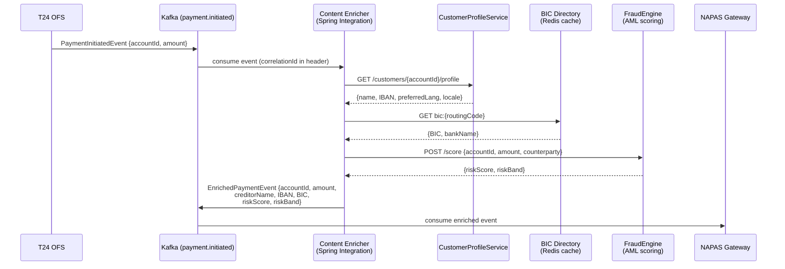

# Content Enricher

Status: Draft | Last Reviewed: 2026-05-09 | Owner: @tech-lead-backend
Catalog ID: EIP-007 | Radii: Ring 0, Ring 1, Ring 2
Tier Applicability: T1, T2

## Problem Statement

- A payment initiation event produced by T24 OFS contains only the minimum routing key — debit account ID and credit amount — yet NAPAS clearing requires creditor name, IBAN, and BIC in the pacs.008 envelope; these fields live in the Customer Profile Service, not in T24.
- AML screening mandates that every cross-border payment carry a risk score computed by the FraudEngine before it enters the SWIFT gateway; attaching the score at the clearing adapter would couple the compliance check to the network-facing layer, violating separation of concerns.
- Mobile push notification events emitted by the payments domain carry only a transaction reference and amount; the notification dispatcher needs device locale, preferred language, and opt-in channel (FCM / APNs / SMS) from the Customer Profile Service before it can render a localised message.
- Enrichment data (BIC tables, IBAN check-digits, customer locale) is stable over seconds-to-minutes but expensive to re-fetch per message; without a shared enrichment layer each microservice reinvents its own caching strategy, creating cache drift and redundant load on upstream services.
- Enrichment failures must be treated as first-class faults: a missing BIC results in a NAPAS hard-reject, so a partially-enriched message that silently omits a required field is worse than a hard failure that triggers a retry or dead-letter.
- Regulatory traceability (BCBS 239) requires that the source of every enriched field is recorded — which service provided the BIC, at what timestamp, from which data version — so the enrichment step must write provenance metadata into message headers.

## Solution

A Content Enricher intercepts a message on the input channel, fetches supplementary data from one or more authoritative sources keyed on information already in the message, merges the additional data into an augmented copy of the message, and emits the enriched message on the output channel — leaving the original message immutable.



## Implementation Guidelines

### 1. Enrichment domain model and immutability contract

Never mutate the incoming message object. Build an enriched record as a new value type. This makes enrichment side-effect-free and allows parallel enrichment calls without locking.

```java
// PaymentInitiatedEvent.java  (source — immutable)
public record PaymentInitiatedEvent(
    String correlationId,
    String debitAccountId,
    BigDecimal amount,
    String currencyCode,
    Instant initiatedAt
) {}

// EnrichedPaymentEvent.java  (output — immutable)
public record EnrichedPaymentEvent(
    String correlationId,
    String debitAccountId,
    BigDecimal amount,
    String currencyCode,
    Instant initiatedAt,
    // enriched fields
    String creditorName,
    String creditorIban,
    String creditorBic,
    String creditorBankName,
    int amlRiskScore,
    String amlRiskBand,
    // provenance
    Instant enrichedAt,
    String profileServiceVersion,
    String bicDirectoryVersion
) {}
```

### 2. Parallel enrichment with CompletableFuture and virtual threads

Enrichment calls to CustomerProfileService, BIC Directory, and FraudEngine are independent. Run them concurrently using Java 21 virtual threads to keep end-to-end latency bounded by the slowest call, not their sum.

```java
// PaymentEnricherService.java
@Service
@Slf4j
public class PaymentEnricherService {

    private final CustomerProfileClient profileClient;
    private final BicDirectoryClient bicClient;
    private final FraudEngineClient fraudClient;
    private final Executor virtualThreadExecutor =
        Executors.newVirtualThreadPerTaskExecutor();

    public EnrichedPaymentEvent enrich(PaymentInitiatedEvent event) {
        String cid = event.correlationId();
        log.info("action=enrich_payment correlationId={} accountId={}",
                 cid, event.debitAccountId());

        CompletableFuture<CustomerProfile> profileFuture = CompletableFuture
            .supplyAsync(() -> profileClient.getProfile(event.debitAccountId()), virtualThreadExecutor);

        CompletableFuture<BicRecord> bicFuture = CompletableFuture
            .supplyAsync(() -> bicClient.lookup(event.debitAccountId()), virtualThreadExecutor);

        CompletableFuture<AmlScore> scoreFuture = CompletableFuture
            .supplyAsync(() -> fraudClient.score(event.debitAccountId(),
                                                  event.amount(),
                                                  event.currencyCode()), virtualThreadExecutor);

        try {
            CompletableFuture.allOf(profileFuture, bicFuture, scoreFuture).join();
            CustomerProfile profile = profileFuture.get();
            BicRecord bic         = bicFuture.get();
            AmlScore   score      = scoreFuture.get();

            return new EnrichedPaymentEvent(
                cid,
                event.debitAccountId(),
                event.amount(),
                event.currencyCode(),
                event.initiatedAt(),
                profile.fullName(),
                profile.iban(),
                bic.bicCode(),
                bic.bankName(),
                score.score(),
                score.band(),
                Instant.now(),
                profile.serviceVersion(),
                bic.directoryVersion()
            );
        } catch (ExecutionException | InterruptedException e) {
            Thread.currentThread().interrupt();
            throw new EnrichmentException(cid, e);
        }
    }
}
```

### 3. Redis-backed BIC directory cache with TTL

The BIC directory is a large, stable dataset. Cache lookups in Redis with a 1-hour TTL to eliminate repetitive network calls to the reference data service. Use Spring Cache with a custom `CacheErrorHandler` so a Redis outage degrades gracefully to direct lookup, not a hard failure.

```java
// BicDirectoryClient.java
@Component
public class BicDirectoryClient {

    private final RestClient restClient;

    @Cacheable(value = "bic-directory", key = "#routingCode",
               unless = "#result == null")
    public BicRecord lookup(String routingCode) {
        return restClient.get()
            .uri("/bic/{code}", routingCode)
            .retrieve()
            .body(BicRecord.class);
    }
}

// CacheConfig.java
@Configuration
public class CacheConfig {

    @Bean
    public RedisCacheConfiguration bicDirectoryCacheConfig() {
        return RedisCacheConfiguration.defaultCacheConfig()
            .entryTtl(Duration.ofHours(1))
            .disableCachingNullValues()
            .serializeValuesWith(
                RedisSerializationContext.SerializationPair
                    .fromSerializer(new GenericJackson2JsonRedisSerializer()));
    }
}
```

### 4. Spring Integration enrichment flow with error routing

```java
// PaymentEnrichmentFlow.java
@Configuration
public class PaymentEnrichmentFlow {

    @Bean
    public IntegrationFlow enrichmentFlow(
            MessageChannel paymentInitiatedChannel,
            PaymentEnricherService enricherService,
            MessageChannel enrichedPaymentChannel,
            MessageChannel enrichmentDlqChannel) {

        return IntegrationFlow.from(paymentInitiatedChannel)
            .handle(PaymentInitiatedEvent.class, (payload, headers) -> {
                String cid = headers.getOrDefault(
                    "X-Correlation-Id", UUID.randomUUID()).toString();
                try {
                    return enricherService.enrich(payload);
                } catch (EnrichmentException ex) {
                    throw new MessageHandlingException(
                        MessageBuilder.withPayload(payload)
                            .setHeader("X-Correlation-Id", cid)
                            .setHeader("X-Enrichment-Error", ex.getMessage())
                            .build(), ex.getMessage(), ex);
                }
            })
            .channel(enrichedPaymentChannel)
            .get();
    }

    @Bean
    public IntegrationFlow enrichmentErrorFlow(MessageChannel enrichmentDlqChannel) {
        return IntegrationFlow.from("errorChannel")
            .channel(enrichmentDlqChannel)
            .get();
    }
}
```

### 5. Enrichment of mobile push notification events

A separate enrichment flow handles `NotificationRequestedEvent`, fetching locale and push token from CustomerProfileService. The same parallel pattern applies; the flow emits a `LocalisedNotificationEvent` consumed by the push-dispatch service.

```java
// NotificationEnricherService.java
@Service
public class NotificationEnricherService {

    private final CustomerProfileClient profileClient;

    public LocalisedNotificationEvent enrich(NotificationRequestedEvent event) {
        CustomerProfile profile = profileClient.getProfile(event.accountId());
        return new LocalisedNotificationEvent(
            event.correlationId(),
            event.accountId(),
            event.transactionRef(),
            event.amount(),
            event.currencyCode(),
            profile.locale(),              // e.g., "vi-VN"
            profile.preferredLanguage(),   // e.g., "vi"
            profile.pushTokenFcm(),
            profile.pushTokenApns(),
            Instant.now()
        );
    }
}
```

### 6. Provenance headers for BCBS 239 lineage

After enrichment, stamp the message headers with the source-service version and enrichment timestamp. Downstream consumers must propagate these headers without modification.

```java
// EnrichmentProvenanceHeaderEnricher.java
@Component
public class EnrichmentProvenanceHeaderEnricher {

    public Message<EnrichedPaymentEvent> stamp(Message<EnrichedPaymentEvent> msg) {
        EnrichedPaymentEvent event = msg.getPayload();
        return MessageBuilder.fromMessage(msg)
            .setHeader("X-Enriched-At",               event.enrichedAt().toString())
            .setHeader("X-Profile-Service-Version",    event.profileServiceVersion())
            .setHeader("X-Bic-Directory-Version",      event.bicDirectoryVersion())
            .setHeader("X-Enrichment-Pattern",         "EIP-007-ContentEnricher")
            .build();
    }
}
```

## When to Use / When NOT to Use

**Use when:**
- The consuming system requires fields that are authoritative in a different bounded context (e.g., BIC lives in a reference-data service, not in the payments domain).
- Enrichment data changes infrequently enough to benefit from caching, reducing load on upstream services.
- Compliance mandates (AML scoring, BCBS 239 lineage) require enrichment to happen at a defined, auditable integration point rather than scattered across consumers.
- Multiple downstream consumers all need the same enriched fields — enrich once at the integration layer rather than in each consumer.

**Do NOT use when:**
- The enrichment lookup itself is a business decision (e.g., "should we block this payment based on the risk score?"). That is routing logic — separate it from enrichment.
- Enrichment source availability is so low that it would make the enricher a synchronous bottleneck; consider event-driven enrichment (publish-subscribe) or eventual enrichment instead.
- The additional data is already present in the message and only needs reshaping — use Message Translator (EIP-006) instead.
- Enrichment would require joining data from more than four services synchronously; consider a materialised-view pattern or a pre-aggregated projection in a read model.

## Variants and Trade-offs

| Variant | When | Trade-off |
|---|---|---|
| Synchronous parallel (CompletableFuture) | Enrichment sources respond in < 100 ms, downstream needs enriched data immediately | Low latency; enricher availability coupled to all upstream services |
| Polling enricher | Enrichment source pushes updates; enricher subscribes and caches locally | Zero per-message latency; cache staleness window |
| Event-driven enrichment (join streams) | Kafka Streams / Flink: join payment stream with profile change-log stream | Decoupled; handles high throughput; operational complexity of stateful stream join |
| Saga-based enrichment | Enrichment requires write-side effects (e.g., record that profile was accessed for AML) | Transactional correctness; much higher latency and complexity |
| Pre-aggregated projection | Read model pre-joins customer + BIC + risk profile, event carries ID only | Fastest read path; projection must be kept current |

## NFR Acceptance Criteria

```yaml
id: CE-1
pattern: Content Enricher
service: payment-enrichment-service

availability:
  target: "99.9%"
  note: "Enricher inherits availability of weakest upstream; design for graceful degradation"
  degraded_mode: "If FraudEngine unavailable, route to manual-review queue rather than block"

performance:
  p99_latency_ms: 80
  basis: "Parallel enrichment from 3 sources; slowest source target p99 < 60 ms (Redis + REST)"
  throughput_per_second: 3000

reliability:
  enrichment_completeness: "All mandatory fields (creditorName, IBAN, BIC, amlRiskScore) must be present or message routed to DLQ"
  partial_enrichment_policy: "Reject — do not forward partially enriched payment events"
  dead_letter_topic: "payment.enrichment.dlq"
  retry_policy: "2 retries with 200 ms exponential back-off per upstream; then DLQ"

caching:
  bic_directory_ttl: "1 hour"
  customer_profile_ttl: "60 seconds (profile changes must propagate within SLA)"
  cache_miss_fallback: "Direct lookup with circuit breaker (Resilience4j)"

observability:
  metrics:
    - "eip.enrichment.latency_ms (histogram, per upstream)"
    - "eip.enrichment.cache_hit_rate (gauge, per cache)"
    - "eip.enrichment.failures (counter, per upstream × error type)"
  logs: "Structured JSON with correlationId, enrichment source, field names added"
  alerts:
    - "cache_hit_rate < 70% over 5 min → investigate Redis eviction policy"
    - "FraudEngine failure_rate > 1% over 2 min → PagerDuty P1 (compliance critical)"

data_lineage:
  headers: "X-Enriched-At, X-Profile-Service-Version, X-Bic-Directory-Version mandatory on output"
```

## Compliance Mapping

| Layer | Reference | Section / Control | How |
|---|---|---|---|
| Ring 0 (global) | Enterprise Integration Patterns (Hohpe/Woolf) | Ch. 8 — Content Enricher | Pattern definition; enricher adds data from external resource before forwarding |
| Ring 1 (international banking) | BCBS 239 §6 — Data Accuracy and Integrity | Principle 6 | Provenance headers (source service version, enrichment timestamp) satisfy lineage requirement |
| Ring 1 (international banking) | FATF Recommendation 16 (Wire Transfer Rule) | Originator and beneficiary information | Enricher ensures creditor name, account, and BIC are present on every cross-border payment message |
| Ring 1 (international banking) | ISO 20022 pacs.008 mandatory fields | CdtrAgt/FinInstnId/BICFI; Cdtr/Nm; CdtrAcct/Id/IBAN | Enricher populates exactly these mandatory ISO 20022 fields from authoritative sources |
| Ring 2 (Vietnam) | SBV Circular 09/2020 §III.3 ⚠️ (working summary — pending Legal review) | Completeness of inter-bank payment instructions | All NAPAS-bound messages must carry beneficiary identity fields; enricher is the enforcement point |
| Ring 2 (Vietnam) | SBV Circular 09/2020 §IV.2 ⚠️ (working summary — pending Legal review) | Audit trail for automated payment processing | Enrichment provenance headers retained in audit log for 7 years |

## Cost / FinOps Notes

- Redis cache for BIC directory drastically reduces calls to the reference-data service: at 3 000 msg/s and 1-hour TTL with ~50 000 unique BIC codes, cache hit rate should exceed 95% in steady state, saving ~2 850 REST calls/s.
- CustomerProfileService REST calls are not cacheable at 60-second TTL with high cardinality (millions of customers); cost is proportional to throughput. Consider a customer profile change-data-capture stream and a local read-model instead if profile volume warrants it.
- FraudEngine scoring is the most expensive enrichment call (ML inference); negotiate a bulk-score API with the AML team to batch 100 events per HTTP call at high throughput rather than one-per-message.
- Virtual thread overhead per enrichment: ~1 KB stack vs ~512 KB for platform threads; at 3 000 concurrent enrichment operations this saves ~1.5 GB RAM compared to thread-per-request with platform threads.
- Monitor Redis memory footprint: BIC directory (~50 K entries × ~200 bytes) = ~10 MB; well within bounds. Add alerting if Redis used memory exceeds 80% of allocation.

## Threat Model Summary

| Threat | Vector | Mitigation |
|---|---|---|
| Enrichment source returning stale or tampered BIC | Compromised Redis cache | Cache values are signed with HMAC on write; validation on read; TTL limits exposure window |
| AML score bypass | FraudEngine unavailable → enricher uses cached/default score | Zero-default policy: unavailable FraudEngine routes to manual-review queue, never uses 0-risk default |
| Information leakage via enriched events | Enriched event contains PII (full name, IBAN) on topics accessible to analytics consumers | Apply Content Filter (EIP-008) on the analytics fan-out branch before crossing data-residency boundary |
| SSRF via enrichment endpoint injection | Attacker injects a crafted accountId that resolves to an internal service URL | All upstream clients use allow-listed base URLs from Spring config; account IDs are UUID-validated before use in URL path |
| Enrichment amplification DoS | High-rate event flood causes thundering herd on upstream services | Resilience4j rate limiter on each upstream client; Kafka consumer lag back-pressure |

## Operational Runbook (stub)

- **Health check:** `GET /actuator/health/enrichment` reports status of each upstream (CustomerProfileService, BICDirectory, FraudEngine) as sub-components.
- **Cache warm-up:** On service startup, pre-load top-1000 most-frequent BIC codes from reference-data service into Redis to avoid cold-start miss storm.
- **FraudEngine degraded procedure:** Toggle feature flag `enrichment.fraud-score.enabled=false` to route directly to manual-review queue; restore flag once FraudEngine recovers. Alert SoC team.
- **DLQ triage:** Consume `payment.enrichment.dlq`; inspect `X-Enrichment-Error` header; common causes: CustomerProfileService 404 (account closed), FraudEngine timeout, IBAN validation failure. Replay after upstream recovery.
- **Cache eviction investigation:** If Redis hit rate drops below 70%, check `INFO keyspace` for unexpected TTL changes or eviction policy (`maxmemory-policy`) misconfiguration.

## Test Strategy (stub)

- **Unit tests:** Mock all three upstream clients (CustomerProfileService, BICDirectory, FraudEngine); assert every field of `EnrichedPaymentEvent` is populated correctly, including provenance headers. Test partial-failure scenarios for each upstream independently.
- **Integration tests:** Spin up WireMock stubs for all upstream REST APIs; run enrichment flow end-to-end; assert output Kafka message contains all mandatory fields.
- **Cache tests:** Assert BIC lookup is called exactly once when two events with the same routing code are processed within the TTL window.
- **Resilience tests:** Use Resilience4j test utilities to simulate FraudEngine circuit-open; assert messages route to manual-review queue, not to DLQ with hard error.
- **Performance tests:** k6 load test at 3 000 msg/s for 10 minutes; assert p99 enrichment latency < 80 ms and no DLQ messages under normal upstream response times.
- **Contract tests:** PactJVM contracts for CustomerProfileService and FraudEngine; enricher is consumer, upstream services are providers. Run on every PR.

## Related Patterns

- **EIP-006 Message Translator** — typically precedes enrichment in the pipeline: translate T24 OFS to canonical domain model, then enrich with BIC and AML score.
- **EIP-008 Content Filter** — follows enrichment on analytics fan-out branches to strip PII fields that were added during enrichment before crossing data-residency boundaries.
- **EIP-004 Message Router** — uses the `amlRiskBand` enriched field to route high-risk payments to a manual-review channel.
- **Canonical Data Model** — the enrichment layer targets the canonical `EnrichedPaymentEvent` record, not a per-consumer schema.
- **Claim Check (EIP-009)** — if enrichment produces a very large payload (e.g., full KYC document set), store payload in S3 and pass claim-check reference instead.

## References

- Hohpe, G. & Woolf, B. — *Enterprise Integration Patterns* (2003), Chapter 8: Content Enricher
- FATF Recommendation 16 — Wire Transfer (Funds Transfer) Rule: `https://www.fatf-gafi.org/publications/`
- BCBS 239 — Principles for effective risk data aggregation (Jan 2013)
- Resilience4j documentation: `https://resilience4j.readme.io/`
- SBV Circular 09/2020: authoritative Vietnamese text at State Bank of Vietnam portal
- Catalog reference: `governance/standards/enterprise-architecture-catalog.md`

---
**Key Takeaway**: The Content Enricher augments thin payment and notification events with customer identity, BIC, and AML risk data fetched in parallel from authoritative upstream services, ensuring that NAPAS-clearing and compliance requirements are satisfied at a single, auditable integration point rather than scattered across each consuming microservice.
