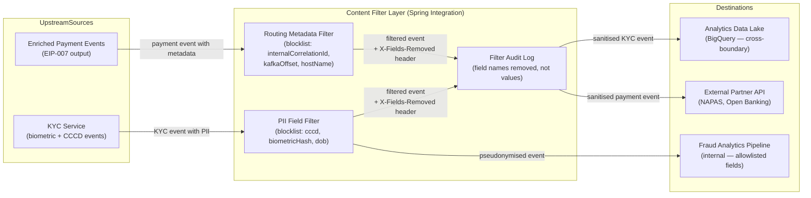

# Content Filter

Status: Draft | Last Reviewed: 2026-05-09 | Owner: @tech-lead-backend
Catalog ID: EIP-008 | Radii: Ring 0, Ring 1, Ring 2
Tier Applicability: T1, T2

## Problem Statement

- KYC onboarding events contain biometric template hashes and CCCD numbers classified as sensitive personal data under Decree 13/2023/ND-CP; forwarding them to the analytics data lake without stripping PII breaches Vietnamese personal data protection law.
- NAPAS payment events carry internal routing metadata (Kafka partition offsets, correlation IDs, host names) that must not appear in messages delivered to external partner APIs — leaking infrastructure topology violates Techcombank's API governance standards.
- The fraud analytics pipeline (BigQuery export) has a data-residency constraint: enriched events crossing the cloud boundary must not carry Decree 13/2023 sensitive fields (biometric hash, full CCCD, date of birth combined with full name).
- Without a dedicated filtering step, each consumer implements its own PII-stripping logic inconsistently; a forgotten field causes a silent compliance breach discovered only at SBV audit.
- Rapid schema evolution means new upstream fields may inadvertently introduce PII into existing subscriptions; an allowlist-first filter excludes unknown fields by default.
- Filtered events must be auditable: compliance teams must confirm that a field was present and removed, without being able to reconstruct its value from the filtered output.

## Solution

A Content Filter receives a message, applies a deterministic allowlist or blocklist transformation that removes specified fields or redacts their values, and emits a sanitised copy of the message on the output channel — without altering the original message or any fields not in scope.



## Implementation Guidelines

### 1. Allowlist-based Jackson ObjectNode filter

Prefer an allowlist (retain only named fields) over a blocklist (remove named fields) wherever possible. An allowlist fails safely: an unanticipated new field is automatically excluded. A blocklist fails open: a new field passes through unless someone remembers to add it to the blocklist.

```java
// AllowlistContentFilter.java
@Component
@Slf4j
public class AllowlistContentFilter {

    private final ObjectMapper objectMapper;

    public String filterToAllowlist(String jsonPayload,
                                    Set<String> allowedFields,
                                    String correlationId) throws JsonProcessingException {
        JsonNode original = objectMapper.readTree(jsonPayload);
        ObjectNode filtered = objectMapper.createObjectNode();
        Set<String> removedFields = new TreeSet<>();

        original.fields().forEachRemaining(entry -> {
            if (allowedFields.contains(entry.getKey())) {
                filtered.set(entry.getKey(), entry.getValue());
            } else {
                removedFields.add(entry.getKey());
            }
        });

        if (!removedFields.isEmpty()) {
            log.info("action=content_filter correlationId={} fields_removed={}",
                     correlationId, removedFields);
        }
        return objectMapper.writeValueAsString(filtered);
    }
}
```

### 2. PII blocklist filter for KYC analytics events

For semi-structured KYC documents where the schema is not fully enumerable, supplement with a configuration-driven blocklist of sensitive field names and glob patterns — compliance changes deploy without code releases.

```java
// PiiContentFilterConfig.java
@ConfigurationProperties(prefix = "content-filter.pii")
@Validated
public record PiiContentFilterConfig(
    @NotEmpty List<String> blockedFields,      // exact names
    @NotEmpty List<String> blockedPatterns     // glob patterns, e.g. "*biometric*"
) {}

// PiiContentFilter.java
@Component
@Slf4j
public class PiiContentFilter {

    private final PiiContentFilterConfig config;
    private final ObjectMapper objectMapper;
    private final List<PathMatcher> compiledPatterns;

    public PiiContentFilter(PiiContentFilterConfig config, ObjectMapper objectMapper) {
        this.config = config;
        this.objectMapper = objectMapper;
        FileSystem fs = FileSystems.getDefault();
        this.compiledPatterns = config.blockedPatterns().stream()
            .map(p -> fs.getPathMatcher("glob:" + p))
            .toList();
    }

    public FilterResult filter(String jsonPayload, String correlationId)
            throws JsonProcessingException {
        JsonNode original = objectMapper.readTree(jsonPayload);
        ObjectNode filtered = ((ObjectNode) original).deepCopy();
        Set<String> removedFields = new TreeSet<>();

        List<String> allFields = new ArrayList<>();
        filtered.fieldNames().forEachRemaining(allFields::add);

        for (String field : allFields) {
            if (isBlocked(field)) {
                filtered.remove(field);
                removedFields.add(field);
            }
        }

        log.info("action=pii_filter correlationId={} removed_count={} fields={}",
                 correlationId, removedFields.size(), removedFields);
        return new FilterResult(objectMapper.writeValueAsString(filtered), removedFields);
    }

    private boolean isBlocked(String fieldName) {
        if (config.blockedFields().contains(fieldName)) return true;
        Path p = Path.of(fieldName);
        return compiledPatterns.stream().anyMatch(m -> m.matches(p));
    }
}

// FilterResult.java
public record FilterResult(String filteredJson, Set<String> removedFields) {}
```

### 3. Spring Integration filter flow with audit header

Wire the filter into a Spring Integration flow and stamp `X-Fields-Removed` on output with the names (not values) of removed fields — satisfying the audit requirement without re-introducing sensitive data.

```java
// KycAnalyticsFilterFlow.java
@Configuration
public class KycAnalyticsFilterFlow {

    private static final Set<String> KYC_ANALYTICS_ALLOWLIST = Set.of(
        "eventId", "correlationId", "accountId", "kycStatus",
        "kycTier", "onboardingChannel", "completedAt", "reviewOutcome"
        // CCCD, biometricHash, dateOfBirth are intentionally ABSENT
    );

    @Bean
    public IntegrationFlow kycAnalyticsFilterFlow(
            MessageChannel kycEventsChannel,
            AllowlistContentFilter allowlistFilter,
            MessageChannel analyticsOutboundChannel) {

        return IntegrationFlow.from(kycEventsChannel)
            .transform(Message.class, msg -> {
                String cid = msg.getHeaders()
                    .getOrDefault("X-Correlation-Id", "UNKNOWN").toString();
                String payload = (String) msg.getPayload();
                try {
                    String filtered = allowlistFilter.filterToAllowlist(
                        payload, KYC_ANALYTICS_ALLOWLIST, cid);
                    Set<String> removed = diff(extractFieldNames(payload),
                                               extractFieldNames(filtered));
                    return MessageBuilder.withPayload(filtered)
                        .copyHeaders(msg.getHeaders())
                        .setHeader("X-Fields-Removed", String.join(",", removed))
                        .setHeader("X-Filter-Pattern", "EIP-008-ContentFilter")
                        .setHeader("X-Filtered-At", Instant.now().toString())
                        .build();
                } catch (JsonProcessingException e) {
                    throw new MessageHandlingException(msg, "JSON parse failure", e);
                }
            })
            .channel(analyticsOutboundChannel).get();
    }

    private Set<String> extractFieldNames(String json) throws JsonProcessingException {
        Set<String> names = new TreeSet<>();
        new ObjectMapper().readTree(json).fieldNames().forEachRemaining(names::add);
        return names;
    }

    private Set<String> diff(Set<String> a, Set<String> b) {
        Set<String> d = new TreeSet<>(a); d.removeAll(b); return d;
    }
}
```

### 4. Routing metadata strip for external partner API delivery

Payment events destined for the NAPAS Open Banking API must not carry Kafka infrastructure metadata; a dedicated filter removes internal-routing fields before the HTTP adapter sends the event.

```java
// PartnerApiMetadataFilter.java
@Component
public class PartnerApiMetadataFilter {

    private static final Set<String> INTERNAL_METADATA_FIELDS = Set.of(
        "kafkaPartition", "kafkaOffset", "kafkaTopic",
        "internalCorrelationId", "originatingHostName",
        "springIntegrationFlowId", "translationMappingVersion"
    );

    private final ObjectMapper objectMapper;

    public String stripMetadata(String jsonPayload) throws JsonProcessingException {
        ObjectNode node = (ObjectNode) objectMapper.readTree(jsonPayload);
        INTERNAL_METADATA_FIELDS.forEach(node::remove);
        return objectMapper.writeValueAsString(node);
    }
}
```

### 5. Pseudonymisation as an alternative to removal

Full removal of `accountId` breaks fraud model training. Replace it with an HMAC-SHA256 token keyed with a secret held only in the analytics environment — events remain linkable within a session but not reversible to a real identity.

```java
// PseudonymisationFilter.java
@Component
public class PseudonymisationFilter {

    private final Mac hmac;

    public PseudonymisationFilter(@Value("${filter.pseudonym.secret}") String secretKey)
            throws NoSuchAlgorithmException, InvalidKeyException {
        SecretKeySpec keySpec = new SecretKeySpec(
            secretKey.getBytes(StandardCharsets.UTF_8), "HmacSHA256");
        this.hmac = Mac.getInstance("HmacSHA256");
        this.hmac.init(keySpec);
    }

    public synchronized String pseudonymise(String plainValue) {
        byte[] raw = hmac.doFinal(plainValue.getBytes(StandardCharsets.UTF_8));
        return HexFormat.of().formatHex(raw);
    }
}
```

### 6. Configuration-driven filter rule management

Store allowlists, blocklists, and pseudonymisation targets in Spring Cloud Config Server so compliance changes deploy via Config Server refresh without a code release.

```yaml
# application-content-filter.yml (served from Config Server)
content-filter:
  pii:
    blocked-fields:
      - cccdNumber
      - biometricTemplateHash
      - biometricRawImage
      - dateOfBirth
      - motherMaidenName
    blocked-patterns:
      - "*biometric*"
      - "*cccd*"
      - "*national_id*"
  pseudonymise-fields:
    - accountId
    - deviceId
  analytics-allowlist:
    - eventId
    - correlationId
    - kycStatus
    - kycTier
    - onboardingChannel
    - completedAt
    - reviewOutcome
```

## When to Use / When NOT to Use

**Use when:**
- A message crosses a trust boundary (internal → external partner, internal → analytics lake, VN → cloud) and the full payload contains fields that must not appear on the other side.
- Upstream schema evolution risk is high; allowlist-first ensures new fields are excluded by default.
- Regulatory mandates (Decree 13/2023, GDPR-equivalent) require auditable proof that sensitive fields were removed before transit.
- Multiple consumers need the same sanitised view; centralise filtering once rather than duplicating in each consumer.

**Do NOT use when:**
- All fields are appropriate for the destination — adding a filter stage for zero compliance benefit is unwarranted latency.
- The filtering decision is conditional on field values (e.g., "remove if riskScore > 80") — that is routing, not filtering.
- Reshaping or renaming is needed — use Message Translator (EIP-006) instead.
- Sub-5 ms real-time paths — JSON parse + field removal adds 0.5–2 ms; emit separate schemas per audience instead.

## Variants and Trade-offs

| Variant | When | Trade-off |
|---|---|---|
| Allowlist filter | Destination schema is well-defined and stable | Safest: new fields excluded by default; requires schema governance discipline |
| Blocklist filter | Source schema changes frequently; only a few fields need removal | Convenient; fails open — a new sensitive field passes until blocklist is updated |
| Pseudonymisation | Field is needed for analytics correlation but must not be personally identifiable | Preserves analytical utility; key management adds operational complexity |
| Schema projection (Avro) | Avro schema registry controls field visibility per topic | Zero-runtime-cost filtering via schema; couples filter to schema registry toolchain |
| Field-level encryption | Field must be present in message but only decryptable by authorised consumers | Maximum control; key management overhead; adds latency per encrypted field |

## NFR Acceptance Criteria

```yaml
id: CF-1
pattern: Content Filter
service: content-filter-service

availability:
  target: "99.9%"
  note: "Filter is stateless; horizontal scaling trivial"

performance:
  p99_latency_ms: 5
  throughput_per_second: 10000
  basis: "Jackson ObjectNode manipulation in-process; no I/O in hot path"

reliability:
  filter_correctness: "Zero PII fields may appear in output of PII filter; verified by automated field-presence assertions in CI"
  allowlist_coverage: "All output schemas must have a corresponding allowlist definition in Config Server; CI fails if schema has unmapped fields"
  dead_letter_topic: "content-filter.dlq"
  retry_policy: "No retries on filter logic failure — if JSON is unparseable, send to DLQ immediately"

auditability:
  header: "X-Fields-Removed must be present on every filtered message listing names of removed fields"
  log_retention: "Filter audit logs retained 7 years per SBV Circular 09/2020"
  no_value_logging: "Removed field VALUES must never appear in logs — only field names"

observability:
  metrics:
    - "eip.filter.fields_removed (counter, per filter rule × field name)"
    - "eip.filter.latency_ms (histogram)"
    - "eip.filter.unknown_fields_blocked (counter) — new fields hit by allowlist default-deny"
  alerts:
    - "unknown_fields_blocked > 0 → Slack #architecture-alerts (schema evolution signal)"
    - "PII field detected in filter output (post-filter assertion) → PagerDuty P1 (compliance breach)"
```

## Compliance Mapping

| Layer | Reference | Section / Control | How |
|---|---|---|---|
| Ring 0 (global) | Enterprise Integration Patterns (Hohpe/Woolf) | Ch. 8 — Content Filter | Pattern definition; filter removes data items not needed by recipient |
| Ring 1 (international banking) | PCI-DSS v4.0 Requirement 3.3 | Protect stored and transmitted account data | Content filter strips card PANs and sensitive authentication data from events crossing zone boundaries |
| Ring 1 (international banking) | BCBS 239 §7 — Data Completeness | Principle 7 | X-Fields-Removed header documents which fields were present and removed, supporting lineage audit |
| Ring 2 (Vietnam) | SBV Circular 09/2020 §IV.2 ⚠️ (working summary — pending Legal review) | Audit trail for data transmission | Filter audit log (field names removed, timestamp, correlationId) retained 7 years |
| Ring 2 (Vietnam) | Decree 13/2023/ND-CP Art. 9 ⚠️ (working summary — pending Legal review) | Sensitive personal data — biometric / financial | Content filter removes PII (CCCD, biometric hash) before cross-boundary transit to analytics lake |

## Cost / FinOps Notes

- Jackson ObjectNode manipulation is CPU-cheap; at 10 000 msg/s the filter adds negligible CPU compared to downstream I/O. Do not pre-optimise.
- Allowlist filtering on Avro-serialised events (schema projection) eliminates the JSON parse entirely; evaluate if the analytics lake already uses Confluent Schema Registry.
- Config Server-driven rules allow compliance changes without redeployment, removing the cost of emergency releases to add a blocked field.
- Pseudonymisation key rotation requires a re-pseudonymisation batch job on historical analytics data; factor this into FinOps when estimating compliance tooling cost.
- Audit log volume at 10 000 msg/s: ~200 bytes/entry = ~2 GB/day. Archive to S3 after 30 days with 7-year Glacier lifecycle policy (~$0.004/GB/month).

## Threat Model Summary

| Threat | Vector | Mitigation |
|---|---|---|
| PII field survives filter | New field added to source schema; not in blocklist | Allowlist-first: unknown fields excluded by default; CI asserts no unregistered fields pass through |
| Filter bypass via nested JSON | Sensitive value nested inside an allowed object | Recursive filter with depth limit of 10 levels |
| Audit log value leakage | Developer logs removed field values in error handler | ArchUnit lint rule asserts filter classes never log removed field values |
| Pseudonymisation key exposure | HMAC secret committed to Git | Secret fetched from Vault at startup; never in source control |
| Filter misconfiguration | Allowlist omitted, all fields stripped | CI golden-event test asserts expected fields present and prohibited fields absent |
| Replay of pre-filter message | Attacker replays raw Kafka message to analytics topic | Analytics topic ACL: only content-filter-service has write access |

## Operational Runbook (stub)

- **Health check:** `GET /actuator/health/content-filter` returns current rule-set version from Config Server.
- **Adding a blocked field:** Update `content-filter.pii.blocked-fields` in Config Server; `@RefreshScope` propagates within 30 s; verify via `GET /actuator/env/content-filter.pii.blocked-fields`.
- **PII-in-output P1:** Immediately suspend the analytics outbound channel; invoke the data-residency incident response procedure; do not restart until root cause is identified.
- **DLQ triage:** Consume `content-filter.dlq`; most common cause is unparseable JSON from an upstream schema break. Fix upstream, then replay.
- **Schema evolution alert:** If `eip.filter.unknown_fields_blocked > 0`, identify the new field via `X-Fields-Removed` on recent messages; decide within 24 hours whether to allowlist or keep blocked; document in ADR.

## Test Strategy (stub)

- **Golden-path unit tests:** For each filter rule (KYC analytics, partner API metadata strip), provide a reference input JSON and assert exact output field set.
- **Negative assertions:** Assert every field in `content-filter.pii.blocked-fields` is absent from filter output when present in input. These tests are the compliance evidence artefact.
- **Allowlist default-deny test:** Add an unlisted field to the test input; assert it does not appear in output and that `X-Fields-Removed` header contains the field name.
- **Schema regression test:** On every PR, run filter against the latest schema from Confluent Schema Registry; fail build if a newly added field is not explicitly allowlisted or blocklisted.
- **Audit log format test:** Assert `X-Fields-Removed` contains only field names, never values; use a regex assertion on log output.
- **Pseudonymisation determinism test:** Assert the same input produces the same pseudonym within a key epoch; assert different inputs produce different pseudonyms.

## Related Patterns

- **EIP-007 Content Enricher** — precedes the filter; enricher adds data for internal processing, filter strips sensitive enriched fields before cross-boundary delivery.
- **EIP-006 Message Translator** — use when stripped fields need reshaping, not just removal.
- **EIP-009 Claim Check** — when a field cannot be transmitted but must reach authorised receivers, store via claim-check rather than filtering it out.
- **EIP-004 Message Router** — fans out a single enriched event to multiple channels, each with a different filter rule.
- **Data Residency Boundary** (Techcombank principle) — Content Filter is the technical enforcement point for this policy.

## References

- Hohpe, G. & Woolf, B. — *Enterprise Integration Patterns* (2003), Chapter 8: Content Filter
- Decree 13/2023/ND-CP on personal data protection (Vietnam): `https://vanban.chinhphu.vn/` (authoritative Vietnamese text)
- PCI-DSS v4.0: `https://www.pcisecuritystandards.org/`
- BCBS 239 — Principles for effective risk data aggregation (Jan 2013)
- Spring Cloud Config Server: `https://docs.spring.io/spring-cloud-config/`
- SBV Circular 09/2020: State Bank of Vietnam portal
- Catalog reference: `governance/standards/enterprise-architecture-catalog.md`

---
**Key Takeaway**: The Content Filter enforces data-residency and PII-protection rules at a single, auditable integration point using an allowlist-first policy that defaults to excluding unknown fields, ensuring that biometric data and CCCD numbers never reach the analytics lake or external partner APIs regardless of upstream schema evolution.
