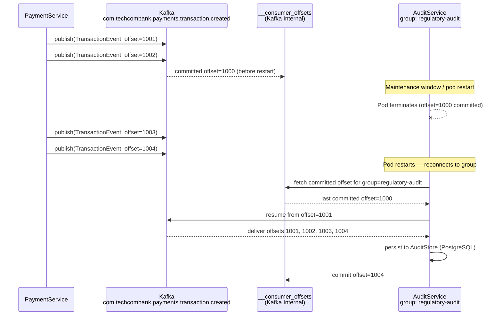

# Durable Subscriber

Status: Draft | Last Reviewed: 2026-05-09 | Owner: @tech-lead-backend
Catalog ID: EIP-022 | Radii
Tier Applicability: T0, T1

## Problem Statement

- The SBV regulatory audit service must receive a complete, unbroken record of every transaction event — including those that occur during its scheduled maintenance windows, deployment restarts, or unexpected crashes. Any gap in the audit event stream constitutes a regulatory violation under SBV Circular 09/2020 §IV.2 and BCBS 239 §6 Completeness.
- A naive subscriber that establishes a new channel subscription on each startup only receives messages published after it reconnects. Events published during its downtime are permanently lost — a non-durable subscriber is incompatible with the zero-miss guarantee required by financial regulators.
- Techcombank's regulatory reporting cycle requires the audit service to process and archive transactions from the preceding day before the 08:00 VNT morning deadline. If the service was offline overnight and events were not retained, the morning batch cannot be completed.
- Scheduled maintenance on T0 consumer services (OS patching, certificate rotation, schema migration) must not create gaps in the audit trail. Maintenance windows last between 15 and 90 minutes; events published during that window must be queued and delivered on reconnection.
- In a microservices deployment, pods are ephemeral: Kubernetes may reschedule a consumer pod to a different node at any time. Without durable subscription state persisted outside the pod, every pod reschedule loses the subscription position and creates a gap or a flood of redeliveries.
- Rolling deployments of the audit service (zero-downtime upgrade) involve a brief period where old and new pod instances coexist. Without stable group membership and persisted offsets, the transition can cause double-delivery or missed-delivery of events.

## Solution

A Durable Subscriber maintains its subscription state and message position externally from the subscriber process, so that when the subscriber restarts it resumes exactly where it left off. In Techcombank's Kafka-based stack, durability is achieved through a persistent consumer group with committed offsets stored in Kafka's `__consumer_offsets` topic, combined with a sufficiently long channel retention period to cover the maximum expected downtime. The consumer group ID is stable across restarts; offset commits are manual and occur only after events are durably persisted to the audit store.



## Implementation Guidelines

1. **Use a stable, registered group ID that never changes.** The group ID `regulatory-audit` must be treated as an immutable infrastructure resource. Changing it abandons the committed offset history and creates a gap. Register it in the Channel Design Record with an explicit note that it is a durable-subscriber group and must not be deleted without a formal offboarding procedure.

   ```java
   @Component
   @RequiredArgsConstructor
   @Slf4j
   public class RegulatoryAuditListener {

       private final AuditEventStore auditStore;
       private final MeterRegistry metrics;

       @KafkaListener(
           topics = {
               "com.techcombank.payments.transaction.created",
               "com.techcombank.payments.transfer.command",
               "com.techcombank.accounts.balance.changed"
           },
           groupId = "regulatory-audit",
           containerFactory = "durableAuditContainerFactory"
       )
       public void onTransactionEvent(
               @Payload GenericRecord avroRecord,
               @Header(KafkaHeaders.RECEIVED_TOPIC) String topic,
               @Header(KafkaHeaders.RECEIVED_PARTITION) int partition,
               @Header(KafkaHeaders.OFFSET) long offset,
               @Header(KafkaHeaders.RECEIVED_TIMESTAMP) long timestamp,
               Acknowledgment ack) {

           MDC.put("correlationId", extractCorrelationId(avroRecord));
           MDC.put("auditGroup", "regulatory-audit");

           log.info("DS consume: group=regulatory-audit topic={} partition={} "
               + "offset={} eventTime={}",
               topic, partition, offset,
               Instant.ofEpochMilli(timestamp));

           auditStore.persist(AuditRecord.builder()
               .topic(topic)
               .partition(partition)
               .offset(offset)
               .eventTimestamp(Instant.ofEpochMilli(timestamp))
               .payload(avroRecord.toString())
               .correlationId(extractCorrelationId(avroRecord))
               .build());

           // Commit only after durable persistence to audit store
           ack.acknowledge();

           metrics.counter("ds.event.persisted",
               "topic", topic,
               "group", "regulatory-audit").increment();
       }
   }
   ```

2. **Configure the consumer factory for maximum durability.** Use `AckMode.MANUAL_IMMEDIATE`; never use `BATCH` for audit consumers because a batch failure leaves unclear which records were persisted. Set `auto.offset.reset=earliest` so that a group ID with no prior committed offset starts from the beginning of available history, not from the latest message. Set `enable.auto.commit=false` unconditionally.

   ```java
   @Configuration
   public class DurableSubscriberConfig {

       @Bean("durableAuditContainerFactory")
       public ConcurrentKafkaListenerContainerFactory<String, GenericRecord>
               durableAuditContainerFactory(KafkaProperties props) {
           Map<String, Object> config = props.buildConsumerProperties();
           config.put(ConsumerConfig.GROUP_ID_CONFIG, "regulatory-audit");
           config.put(ConsumerConfig.ENABLE_AUTO_COMMIT_CONFIG, false);
           config.put(ConsumerConfig.AUTO_OFFSET_RESET_CONFIG, "earliest");
           config.put(ConsumerConfig.SESSION_TIMEOUT_MS_CONFIG, 45_000);
           config.put(ConsumerConfig.HEARTBEAT_INTERVAL_MS_CONFIG, 15_000);
           // Allow longer poll interval — audit store writes may be slow
           config.put(ConsumerConfig.MAX_POLL_INTERVAL_MS_CONFIG, 600_000);
           config.put(ConsumerConfig.MAX_POLL_RECORDS_CONFIG, 100);
           config.put(ConsumerConfig.ISOLATION_LEVEL_CONFIG, "read_committed");
           config.put(ConsumerConfig.VALUE_DESERIALIZER_CLASS_CONFIG,
               KafkaAvroDeserializer.class);
           config.put(AbstractKafkaSchemaSerDeConfig.SPECIFIC_AVRO_READER_CONFIG, false);

           var factory = new ConcurrentKafkaListenerContainerFactory<String, GenericRecord>();
           factory.setConsumerFactory(new DefaultKafkaConsumerFactory<>(config));
           factory.getContainerProperties()
               .setAckMode(ContainerProperties.AckMode.MANUAL_IMMEDIATE);
           factory.setCommonErrorHandler(new DefaultErrorHandler(
               new DeadLetterPublishingRecoverer(auditDltTemplate()),
               new FixedBackOff(5000L, 5)  // slower retries for audit — favour completeness
           ));
           return factory;
       }
   }
   ```

3. **Guarantee retention coverage for the maximum expected downtime.** The channel retention period must exceed the maximum tolerable downtime of the audit service. T0 channels have 30-day retention (see EIP-001), which comfortably covers a 90-minute maintenance window. However, if a disaster recovery scenario could extend downtime beyond 30 days, the audit service must use an external offset checkpoint (e.g., persisted to PostgreSQL alongside each batch of audit records) that allows it to seek to a known-good offset on reconnect, even after Kafka retention has expired.

   ```java
   @Service
   @RequiredArgsConstructor
   public class AuditOffsetCheckpointService {

       private final AuditOffsetRepository offsetRepo;

       /**
        * Called by the rebalance listener on partition assignment.
        * If the Kafka committed offset is absent (group was absent longer than retention),
        * seek to the last durably checkpointed offset from PostgreSQL.
        */
       public void seekToCheckpointIfNeeded(
               Consumer<String, GenericRecord> consumer,
               Collection<TopicPartition> partitions) {
           for (TopicPartition tp : partitions) {
               Optional<Long> checkpoint = offsetRepo.findCheckpoint(
                   tp.topic(), tp.partition());
               checkpoint.ifPresent(offset -> {
                   log.warn("Kafka offset absent — seeking to PostgreSQL checkpoint "
                       + "topic={} partition={} checkpointOffset={}",
                       tp.topic(), tp.partition(), offset);
                   consumer.seek(tp, offset);
               });
           }
       }
   }
   ```

4. **Use static group membership to eliminate unnecessary rebalances.** Configure `group.instance.id` per pod (e.g., using the Kubernetes pod name from the `POD_NAME` environment variable). With static membership, when a pod restarts within the `session.timeout.ms` window, Kafka does not trigger a full group rebalance — the pod rejoins with the same instance ID and reclaims its previous partition assignments immediately. This is critical for the audit service, which must resume processing with minimal delay after a pod restart.

   ```java
   @Configuration
   public class StaticGroupMembershipConfig {

       @Value("${POD_NAME:audit-pod-0}")
       private String podName;

       @Bean
       public ConsumerFactory<String, GenericRecord> durableAuditConsumerFactory(
               KafkaProperties props) {
           Map<String, Object> config = props.buildConsumerProperties();
           // Static membership — pod identity survives restarts within session timeout
           config.put(ConsumerConfig.GROUP_INSTANCE_ID_CONFIG,
               "regulatory-audit-" + podName);
           config.put(ConsumerConfig.SESSION_TIMEOUT_MS_CONFIG, 45_000);
           return new DefaultKafkaConsumerFactory<>(config);
       }
   }
   ```

5. **Implement a rebalance listener that logs and checkpoints on partition revocation.** When partitions are revoked (rebalance or pod shutdown), the listener must flush any in-progress audit store batch writes and commit Kafka offsets before returning. Failing to do so risks processing the same events twice on the next assignment.

   ```java
   @Component
   @RequiredArgsConstructor
   public class AuditRebalanceListener implements ConsumerAwareRebalanceListener {

       private final AuditOffsetCheckpointService checkpointService;
       private final AuditEventStore auditStore;

       @Override
       public void onPartitionsRevokedBeforeCommit(
               Consumer<?, ?> consumer, Collection<TopicPartition> partitions) {
           log.warn("Audit partitions being revoked — flushing audit store count={}",
               partitions.size());
           auditStore.flush();
       }

       @Override
       public void onPartitionsAssigned(
               Consumer<?, ?> consumer, Collection<TopicPartition> partitions) {
           log.info("Audit partitions assigned count={}", partitions.size());
           @SuppressWarnings("unchecked")
           Consumer<String, GenericRecord> typedConsumer =
               (Consumer<String, GenericRecord>) consumer;
           checkpointService.seekToCheckpointIfNeeded(typedConsumer, partitions);
       }
   }
   ```

6. **Alert on group offline duration, not just lag.** Consumer lag alone does not reveal how long the audit service has been offline. Instrument a `ds.group.offline.duration.seconds` gauge using the Kafka Admin API: poll the consumer group describe API periodically and emit a metric when the group state is `Empty` or `Dead`. Alert if offline duration exceeds 15 minutes for the `regulatory-audit` group on any T0 topic.

   ```java
   @Component
   @RequiredArgsConstructor
   public class DurableSubscriberHealthMonitor {

       private final AdminClient adminClient;
       private final MeterRegistry metrics;

       @Scheduled(fixedDelay = 60_000)
       public void checkGroupHealth() {
           try {
               Map<String, ConsumerGroupDescription> groups = adminClient
                   .describeConsumerGroups(List.of("regulatory-audit"))
                   .all().get(10, TimeUnit.SECONDS);
               ConsumerGroupDescription desc = groups.get("regulatory-audit");
               boolean isActive = desc != null &&
                   desc.state() == ConsumerGroupState.STABLE;
               metrics.gauge("ds.group.active",
                   Tags.of("group", "regulatory-audit"),
                   isActive ? 1.0 : 0.0);
               if (!isActive) {
                   log.warn("Durable subscriber group offline state={} group=regulatory-audit",
                       desc != null ? desc.state() : "UNKNOWN");
               }
           } catch (Exception ex) {
               log.error("Failed to check regulatory-audit group health error={}",
                   ex.getMessage());
           }
       }
   }
   ```

## When to Use

- The subscriber **must not miss any messages** even during planned maintenance windows, rolling deployments, or unexpected restarts.
- Regulatory or audit obligations require a complete, contiguous event log (SBV Circular 09/2020, BCBS 239 §6).
- The subscriber processes events at a slower pace than they are published (the channel retains messages until the subscriber catches up).
- The subscriber is a stateful service whose processing depends on an unbroken sequence of events (ledger reconciliation, regulatory reporting, fraud pattern learning).
- Messages published during a deployment pipeline's downtime must be processed after deployment completes, not discarded.

## When NOT to Use

- The subscriber only cares about the **current state** and has no need for history (e.g., a cache warm-up that only needs the latest balance). Use a compacted Kafka topic with a non-durable consumer instead.
- The subscriber is stateless and idempotent, and message loss is acceptable (e.g., a metrics aggregation scraper that can reconstruct state from other sources).
- **Very short retention** on the channel and the subscriber's maximum downtime exceeds that retention. This pattern cannot guarantee delivery if messages have been deleted before the subscriber reconnects — address this with longer retention or a Message Store (EIP-018).
- The subscriber is a UI dashboard where stale events are irrelevant and catching up would degrade user experience.

## Variants and Trade-offs

| Variant | When | Trade-off |
|---|---|---|
| Kafka consumer group with committed offsets (standard) | Most T0/T1 durable subscriber scenarios | Durability up to retention window; cannot recover events older than retention |
| External offset checkpoint (PostgreSQL) | Subscriber may be offline longer than Kafka retention | Adds complexity; checkpoint write must be atomic with event processing |
| Static group membership (`group.instance.id`) | Pod restarts within session timeout are common | Rebalance-free reconnect; requires pod name to be stable across restarts |
| Kafka MirrorMaker 2 replica for DR subscriber | Audit service in DR region must also be durable | Replication lag adds to effective offline tolerance; consumer group offsets must be translated between clusters |

## NFR Acceptance Criteria

```yaml
nfr:
  catalog_id: EIP-022
  pattern: Durable Subscriber

  acceptance_criteria:
    - id: DS-1
      name: Zero Message Loss on Restart
      description: >
        When the regulatory-audit consumer group is offline for up to 90 minutes
        (planned maintenance window), all events published during the downtime must
        be delivered and persisted to the AuditStore on reconnection. Verified by
        publishing 10,000 events during a simulated 90-minute outage; confirm all
        10,000 are present in the AuditStore after service recovery.
      tier: T0

    - id: DS-2
      name: Catch-up Throughput
      description: >
        After reconnection following a 90-minute maintenance window at peak load
        (500 events/second), the audit service must reduce its lag backlog to zero
        within 30 minutes. Minimum catch-up throughput: 1,000 events/second.
      tier: T0

    - id: DS-3
      name: Static Membership Rebalance Time
      description: >
        When a regulatory-audit pod is restarted (rolling deployment), the consumer
        group rebalance must complete within 5 seconds when static membership
        (group.instance.id) is configured. Verified by measuring rebalance duration
        during rolling deployment under 200 events/second load.
      tier: T0

    - id: DS-4
      name: Group Offline Alert Response
      description: >
        Alert ds.group.active=0 for group=regulatory-audit must fire within 2 minutes
        of the group going offline. On-call response SLA: acknowledge within 5 minutes,
        restore within 30 minutes.
      tier: T1

    - id: DS-5
      name: Offset Checkpoint Integrity
      description: >
        The PostgreSQL offset checkpoint must be updated atomically with each batch
        of audit records. A database transaction that rolls back must not advance the
        checkpoint, ensuring the events are reprocessed on next poll.
      tier: T0
```

## Compliance Mapping

| Layer | Reference | Section/Control | How this pattern satisfies |
|---|---|---|---|
| Ring 0 (global) | Enterprise Integration Patterns (Hohpe/Woolf) | Chapter 10 — Durable Subscriber | Canonical pattern; Kafka committed consumer group offsets implement the Hohpe/Woolf durable subscription model |
| Ring 0 (global) | NIST SP 800-53 | AU-9 Protection of Audit Information; AU-11 Audit Record Retention | Durable offset ensures no audit event is lost; 30-day channel retention backed by 5-year audit store retention satisfies AU-11 |
| Ring 1 (international) | BCBS 239 §6 Completeness | Risk data aggregation must be complete without gaps | Committed offset + retention window guarantees the regulatory audit subscriber receives every transaction event, including those during downtime |
| Ring 1 (international) | ISO 20022 | Transaction reference completeness | `EndToEndId` and `MessageId` persisted in AuditStore for every event; durable subscriber ensures no transaction reference is missing from the regulatory record |
| Ring 2 (Vietnam) | SBV Circular 09/2020 §IV.2 ⚠️ (working summary — pending Legal review) | 5-year transaction record retention; completeness of regulatory reporting | Durable subscriber feeds the AuditStore with a 5-year retention policy; zero-gap delivery guarantee satisfies SBV's completeness requirement for transaction audit records |

## Cost / FinOps Notes

- **Increased retention cost for durable subscriber topics** — T0 topics supporting the regulatory audit group are configured with 30-day retention (versus 7 days for T1). The additional storage for the audit-relevant topics at 10M events/day × 2KB × 23 extra days × 3 replicas ≈ additional 1.38 TB. At USD 0.023/GB-month this is approximately USD 32/month — a negligible cost relative to regulatory compliance risk.
- **Static group membership eliminates rebalance churn** — Each rebalance temporarily halts consumption. With static membership, pod restarts within the session timeout window do not trigger full rebalances. At 5 rolling deployment pods per day, this saves approximately 5 × 15 seconds = 75 seconds of audit event processing downtime per day. More importantly, it avoids the partition handoff delay that can leave short gaps in audit coverage.
- **PostgreSQL offset checkpoint overhead** — Each batch of 100 audit records triggers one checkpoint write to PostgreSQL. At 500 events/second ÷ 100 per batch = 5 checkpoint writes/second. A single PostgreSQL instance handles this comfortably. Use a connection pool (HikariCP, max 10 connections) to avoid connection churn.
- **AuditStore storage cost (5-year retention)** — 10M events/day × 2KB × 365 days × 5 years = 36.5 TB. This is the dominant cost of the Durable Subscriber pattern. Use partitioned PostgreSQL tables (partition by event year) with cold-tier archive to object storage (e.g., S3 Glacier) after 2 years to reduce cost. Budget approximately USD 800/month for active AuditStore storage, USD 150/month for archive.
- **Admin API polling for health monitor** — The `describeConsumerGroups` call runs every 60 seconds and incurs negligible broker overhead. Do not poll more frequently than 30 seconds to avoid impacting broker coordinator threads.

## Threat Model Summary

STRIDE: Repudiation, Tampering, Denial of Service addressed; Information Disclosure partially addressed.

- **Audit log tampering** — An insider modifies persisted audit records in the AuditStore to conceal a fraudulent transaction. Mitigation: AuditStore uses append-only PostgreSQL table with no UPDATE/DELETE grants to the audit service role; write-once storage policy enforced at the database level; periodic hash-chain verification (HMAC of sequential audit records) detects any retroactive modification.
- **Offset manipulation to create gaps** — An attacker with Kafka admin access advances the `regulatory-audit` committed offset, causing events to be skipped and creating a gap in the audit trail. Mitigation: GitOps-only offset management with dual approval; PostgreSQL checkpoint provides an independent reference for gap detection; gap detection job runs nightly and alerts if AuditStore sequence has discontinuities.
- **Retention expiry before subscriber recovery** — The audit service is offline for longer than the Kafka retention window (30 days), causing events to be deleted before consumption. Mitigation: group offline alert fires at 15 minutes; if offline duration approaches the retention window, the incident team must either restore the service or manually extract events from the MirrorMaker 2 DR replica before they expire.
- **Residual — Group ID collision** — A misconfigured non-audit service uses the `regulatory-audit` group ID, consuming audit events without persisting them to the AuditStore. The legitimate audit service never receives those events. Mitigate with Kafka ACLs restricting `group:regulatory-audit` to the audit service account only; monitor for unexpected group members.
- **Residual — AuditStore write failure with offset advance** — If the audit service acknowledges (commits offset) before the AuditStore write is confirmed, an AuditStore failure causes a gap. Mitigate with `MANUAL_IMMEDIATE` ack mode where offset is committed only after successful `auditStore.persist()` returns; transactional database writes with explicit commit before ack.

## Operational Runbook (stub)

1. **Alert: `DS_Group_Offline`** — `ds.group.active=0` for `regulatory-audit`. Immediately check pod status: `kubectl get pods -l app=regulatory-audit-service`. If pods are in `CrashLoopBackOff`, inspect logs: `kubectl logs -l app=regulatory-audit-service --previous`. Check AuditStore (PostgreSQL) connectivity — a database outage is the most common cause of audit service crash. Restore within the 30-minute on-call SLA.

2. **Alert: `DS_CatchupLag_Critical`** — Consumer lag on `regulatory-audit` group exceeds 500,000 messages after service recovery. Scale up audit pods: `kubectl scale deployment regulatory-audit --replicas=6`. Monitor lag trend. If catch-up throughput is insufficient (< 1,000 events/second), check AuditStore write latency — a slow PostgreSQL write path is the usual bottleneck. Consider temporarily disabling non-critical AuditStore indexes during catch-up.

3. **Planned maintenance procedure** — Before taking the audit service offline, confirm Kafka topic retention > maintenance window duration. Set a Grafana annotation marking the maintenance start time. After restoration, verify the consumer group resumes from the correct offset by comparing the first processed event timestamp to the maintenance start annotation.

4. **Gap detection and remediation** — The nightly gap detection job queries AuditStore for sequence breaks in `(topic, partition, offset)`. If a gap is found: first check the Kafka topic for the missing offsets (they may still be in retention); use `kafka-console-consumer.sh` to extract the missing events and manually replay them through the audit ingestor. If the events are beyond Kafka retention, retrieve from the MirrorMaker 2 DR replica topic.

5. **Offset checkpoint divergence** — If the PostgreSQL checkpoint offset is ahead of the Kafka committed offset (e.g., after a crash between AuditStore commit and Kafka ack), the events between the two offsets will be redelivered on next poll. The audit service must handle this idempotently — AuditStore unique constraint on `(topic, partition, offset)` rejects duplicate inserts silently.

6. **Rolling deployment procedure** — Use `kubectl rollout` with `maxUnavailable=0`. Static group membership ensures each pod reclaims its partitions within 5 seconds. Monitor the `ds.group.active` metric throughout the rollout; alert if it drops to 0 for more than 10 seconds during deployment.

7. **DR failover** — If the primary Kafka cluster is lost, activate the DR Kafka cluster (MirrorMaker 2 replica). The `regulatory-audit` group on the DR cluster must have its offset translated using `MirrorMaker 2`'s offset translation mechanism (`kafka-consumer-groups.sh --to-offset` with the translated value). Consult the DR playbook (REF-001) for the full offset translation procedure.

## Test Strategy (stub)

- **Unit** — Test `RegulatoryAuditListener` with a `MockConsumer`: verify `auditStore.persist()` is called before `ack.acknowledge()`; verify that if `auditStore.persist()` throws, `ack.acknowledge()` is not called and the message is retried; verify MDC fields are set correctly.
- **Integration** — Use Testcontainers (Kafka + Schema Registry + PostgreSQL) to publish 1,000 events, stop the consumer group mid-stream (at offset 500), publish 500 more events while the group is offline, restart the consumer, and verify all 1,000 events are present in the AuditStore exactly once; verify the PostgreSQL checkpoint matches the final Kafka committed offset.
- **Chaos** — Kill the audit service pod at random intervals over a 60-minute load test at 500 events/second; verify AuditStore event count equals published count at end of test; verify no gaps in the `(topic, partition, offset)` sequence; verify static group membership allows recovery without full rebalance when pod restarts within session timeout.

## Related Patterns

- [EIP-001 Message Channel](message-channel.md) — the base channel whose retention period enables durable delivery
- [EIP-003 Publish-Subscribe Channel](publish-subscribe-channel.md) — the fan-out channel that the durable subscriber subscribes to
- [EIP-018 Message Store](message-store.md) — stores audit records that the Durable Subscriber delivers; covers long-term retention beyond Kafka channel lifetime
- [EIP-024 Idempotent Receiver](idempotent-receiver.md) — required when durable subscriber may receive redeliveries after crash/restart
- [EIP-025 Dead Letter Channel](dead-letter-channel.md) — captures events the audit service cannot process after all retries

## References

- Hohpe, G. & Woolf, B. — Enterprise Integration Patterns (Addison-Wesley), Chapter 10 — Durable Subscriber (pp. 522–527)
- Apache Kafka documentation — Consumer Group Offset Management, Static Group Membership (`group.instance.id`)
- Spring Kafka documentation — `ConsumerAwareRebalanceListener`, `AckMode.MANUAL_IMMEDIATE`
- SBV Circular 09/2020 — Transaction Record Retention Requirements (internal Legal summary)
- Related catalog IDs: [EIP-001](message-channel.md), [EIP-003](publish-subscribe-channel.md), [EIP-018](message-store.md), [EIP-024](idempotent-receiver.md)

---
**Key Takeaway**: The Durable Subscriber ensures Techcombank's regulatory audit service receives every single transaction event — including those published during maintenance windows or pod restarts — by persisting its offset in Kafka's consumer group store, using static group membership for fast reconnection, and maintaining a PostgreSQL checkpoint as a safety net beyond Kafka's retention window.
