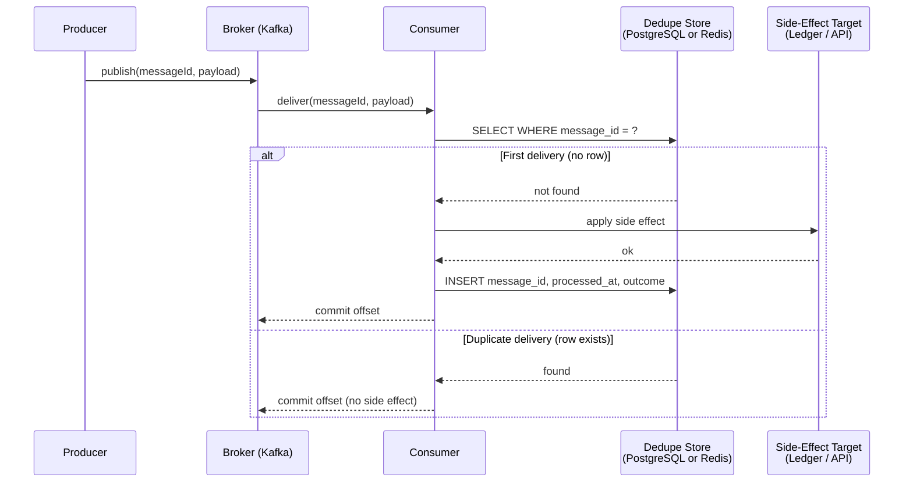

# Idempotent Receiver

Status: Draft | Last Reviewed: 2026-05-09 | Owner: @tech-lead-backend
Catalog ID: EIP-024 | Radii
Tier Applicability: T0, T1

## Problem Statement

Message-driven banking flows replay. A Kafka consumer rebalance, a broker hiccup, a DR failover, an explicitly retried producer — all cause the same logical message to be delivered more than once. Without idempotent reception, a duplicate message becomes a duplicate ledger entry, a duplicate KYC record, a customer notified twice. The Idempotent Receiver pattern (Hohpe & Woolf §10.1) defines how a consumer safely processes the same logical message any number of times with the same effect as processing it once.

## Context

Reach for this pattern when:

- Consuming any banking-relevant Kafka / RabbitMQ / Solace topic.
- Building any side-effect-producing message handler (ledger post, payment notification, KYC update).
- Implementing a saga step ([INT-001](../integration/saga-orchestration.md)) that processes incoming events.
- Designing a DR-failover-safe consumer where tail events may be replayed from the standby.

This is the messaging-side complement to the [PRIN-006 Idempotency-by-default](../../principles/idempotency-by-default.md) principle. PRIN-006 covers HTTP write APIs (where the client supplies an `Idempotency-Key`); EIP-024 covers async message consumers (where the receiver derives the key from the message).

## Solution



### Three keying strategies

| Strategy | Key source | When to use |
| --- | --- | --- |
| **A. Message-header** | Producer attaches `messageId` (UUID v4) in Kafka header | Default for new flows |
| **B. Natural key** | Server derives from payload (e.g., ISO 20022 `EndToEndId`, `TransactionId`) | Inter-bank flows where the producer can't be modified |
| **C. Body-hash** | SHA-256 of canonical JSON | Last resort when no other key exists; fragile (any whitespace change breaks dedup) |

### Atomic write rule

The dedupe insert and the side effect MUST be written as a single transaction (or the side effect must itself be idempotent — e.g., if the side effect is a downstream HTTP call that uses [PRIN-006](../../principles/idempotency-by-default.md), the receiver can safely retry on dedupe-store failure).

For Kafka consumers, the canonical pattern is:

1. Use a database transaction that includes both the side-effect write and the dedupe-store insert.
2. After commit, commit the Kafka offset.
3. If the Kafka commit fails after DB commit, the next delivery will hit the dedupe-store row and be skipped — exactly-once effective semantics.

## Implementation Guidelines

### Java / Spring Kafka — header-based dedupe (Strategy A)

```java
@Component
@RequiredArgsConstructor
public class IdempotentPaymentEventHandler {

    private final ProcessedMessageRepository dedupe;
    private final PaymentService payments;
    private final TransactionTemplate tx;

    @KafkaListener(topics = "payment-events", groupId = "ledger-poster")
    public void handle(@Payload PaymentEvent event,
                       @Header("messageId") String messageId,
                       Acknowledgment ack) {

        Boolean processed = tx.execute(status -> {
            if (dedupe.existsById(messageId)) {
                log.debug("Duplicate payment event {} — skipping", messageId);
                return false;
            }
            payments.applyEvent(event);
            dedupe.save(new ProcessedMessage(messageId, Instant.now(), "ledger-poster"));
            return true;
        });

        if (processed != null && processed) {
            log.info("Processed payment event {}", messageId);
        }
        ack.acknowledge();
    }
}
```

### Natural-key strategy (B) — ISO 20022

```java
public String deriveMessageKey(Pacs008 message) {
    // EndToEndId is mandatory and unique per ISO 20022 spec
    return message.getCdtTrfTxInf().getPmtId().getEndToEndId();
}
```

### Dedupe table (PostgreSQL)

```sql
CREATE TABLE processed_messages (
    message_id     VARCHAR(64)  PRIMARY KEY,
    consumer_id    VARCHAR(64)  NOT NULL,
    processed_at   TIMESTAMPTZ  NOT NULL DEFAULT now(),
    expires_at     TIMESTAMPTZ  NOT NULL
);
CREATE INDEX processed_messages_expires_at ON processed_messages (expires_at);

-- background TTL purge (or use pg_cron):
DELETE FROM processed_messages WHERE expires_at < now();
```

TTL choice: ≥ max plausible replay window. For Kafka consumers, a value of `retention.ms` × 2 is a safe default (typically 14 days). For DR-replay, ≥ the longest planned DR test cycle.

### Redis-based dedupe (high-RPS alternative)

```java
@Component
public class RedisDedupeStore {
    private final StringRedisTemplate redis;
    public boolean tryClaim(String messageId, Duration ttl) {
        Boolean ok = redis.opsForValue().setIfAbsent("dedupe:" + messageId, "1", ttl);
        return Boolean.TRUE.equals(ok);
    }
}
```

Caveat: Redis dedupe is fast but loses durability under simultaneous Redis outage + replay. Use only for tier T1/T2 or as a fast L1 in front of the PostgreSQL store.

### Kafka Streams alternative — `KTable` deduplication

```java
KStream<String, PaymentEvent> events = builder.stream("payment-events");
KTable<String, Boolean> seen = events
    .map((k, v) -> KeyValue.pair(v.getMessageId(), Boolean.TRUE))
    .toTable(Materialized.as("processed-messages-store"));

events
    .leftJoin(seen, (event, alreadySeen) -> alreadySeen != null ? null : event)
    .filter((k, v) -> v != null)
    .foreach((k, event) -> ledger.post(event));
```

This is elegant when the consumer is already a Kafka Streams app; for plain Spring listeners, the database approach is simpler.

### T24 / legacy integration

T24 OFS-bridge consumers must apply Idempotent Receiver before posting to T24. The OFS bridge supports a `keyId` header that doubles as the natural key on T24's side; pair with the dedupe store to avoid double-posting if the OFS call itself is retried.

### Frontend / Mobile

Not directly applicable — clients don't typically run message consumers. However, push-notification handlers on iOS/Android are message consumers and benefit from the same pattern (use APNs `apns-collapse-id` / FCM `tag` as the natural key).

## Variants & Trade-offs

| Variant | When | Trade-off |
| --- | --- | --- |
| **Database-backed dedupe** (default) | T0, durable side effects | Writes to dedupe-table on every message |
| **Redis L1 + DB L2** | High-RPS T0 | Fast hot path; cold path on Redis miss falls through to DB |
| **Kafka Streams KTable** | Already-streams pipeline | No external store; partitioned with the topic |
| **Bloom filter** (advisory only) | Detect *probable* duplicates fast; pair with deeper check | False positives possible — not safe alone |

## NFR Acceptance Criteria

- **HA**: dedupe store is HA per [NFR-001](../../nfr/service-tiering-rto-rpo.md) Tier of the consuming service. T0 → cross-region sync replication on the dedupe DB.
- **HP**: dedupe lookup adds 1–2ms P95 (PostgreSQL primary-key fetch with index in cache); 0.2ms P95 with Redis L1. Within T0 budget per [NFR-002](../../nfr/latency-budget-model.md).
- **HR**: failure mode is "duplicate processed" if dedupe store is unavailable AND retry occurs within recovery window — bounded by the side-effect's own idempotency. Combine with PRIN-006 on downstream HTTP calls for defence-in-depth.

## Compliance Mapping

| Layer | Reference | Section/Control | How this satisfies |
| --- | --- | --- | --- |
| Ring 0 | EIP §10.1 (Hohpe/Woolf) | Endpoint Patterns — Idempotent Receiver | Canonical pattern; this doc applies it to banking |
| Ring 0 | Microservices.io — Idempotent Consumer | Consumer-side idempotency pattern | Same shape; same intent |
| Ring 1 | Basel BCBS 239 — Principle 6 (Accuracy) | Risk-data aggregation must avoid double-counting | Idempotent reception prevents duplicate ledger postings → accurate aggregation |
| Ring 1 | ISO 20022 — `EndToEndId` | Each interbank message carries a unique end-to-end ID | Used as natural key for Strategy B |
| Ring 2 | SBV Circular 09/2020 §IV.2; Decree 13/2023 | Operational continuity; data localisation for dedupe store | Required behaviour for retried messages during EOD batch and network instability ⚠️ (working summary — pending Legal review) |

## Cost / FinOps Notes

| Item | Driver | Order of magnitude |
|---|---|---|
| Dedupe-store storage (PostgreSQL) | rows × payload-key size × TTL | ≈ 60 bytes/row; 10M ops/day × 14d TTL ≈ 8 GB; trivial |
| Dedupe-store latency overhead | extra DB round-trip per message | ~1ms P95 (cached index) |
| Redis L1 (optional) | Memory × instance count | ~$50/month per shard at 10M ops/day |
| Background purge | one cron, low CPU | Negligible |

**Cost of NOT applying**: each duplicate ledger entry on a payment requires manual reconciliation, customer support engagement, and possibly regulatory reporting. The dedupe store cost is negligible compared to a single such incident.

## Threat Model Summary

STRIDE: addresses Tampering (replay attacks) and Repudiation (no double-effect).

- **Top 3 threats addressed**:
  1. *Replay attack (Tampering)* — attacker re-publishes a captured message; same key returns no-side-effect.
  2. *DR failover replay (Repudiation)* — tail events replay from standby region; safely absorbed without producing duplicate ledger entries.
  3. *Consumer-rebalance double-processing (Tampering)* — default Kafka at-least-once behaviour, addressed by dedupe store check before every side effect.
- **Top 3 residual threats**:
  1. *Key collision* — UUID v4 collision is astronomically rare; natural-key collision is the real risk (verify EndToEndId is genuinely unique per the producing scheme).
  2. *Dedupe-store outage during retry (Denial of Service)* — failure mode degrades to duplicate-process. Mitigation: pair with HTTP-level idempotency on downstream calls.
  3. *TTL-too-short (Tampering)* — late retries (e.g., 30-day-old DR replay) treated as new. Mitigation: tune TTL per service; consider 30+ days for T0.

## Operational Runbook (stub)

- **Alerts**:
  - **Alert: IdempotentReceiver_DuplicateRate** — % of messages skipped as duplicates. Sustained >10% sudden change → investigate producer retry behaviour. Severity: Warning.
  - **Alert: IdempotentReceiver_DedupeStoreDown** — dedupe queries failing. Severity: Critical (consumers will halt or duplicate-process per fallback config).
  - **Alert: IdempotentReceiver_StoreSize** — store growing > 2× baseline. Severity: Warning (TTL purge may have stopped).
- **Dashboards**: Grafana — `idempotent-receiver-overview` (rate, skip %, store size, latency).
- **Recovery**: stale entries purged automatically; if store corrupts, accept duplicate-process risk during recovery window.

## Test Strategy (stub)

- **Unit**: handler-level test — same message processed twice; verify second is skipped.
- **Integration**: Kafka testcontainer, send same `messageId` twice; verify ledger has one row.
- **Chaos**: kill consumer between dedupe insert and offset commit; on restart, verify skip behaviour.
- **DR-drill**: failover broker; replay last 5 minutes of messages; verify no duplicate side effects.

## When to Use

- **Always** on any consumer of banking event topics or queues.
- Mandatory for [INT-001 Saga](../integration/saga-orchestration.md) step receivers, [INT-002 Outbox](../integration/cdc-outbox-pattern.md) downstream consumers, and [REF-002 Real-Time Payments](../../reference-architectures/real-time-payments-napas.md) settlement consumers.

## When NOT to Use

- Pure read-only telemetry consumers with naturally-idempotent side effects (e.g., metric aggregation by sum) — although the cost is so low it's usually still worth applying.

## Related Patterns

- [PRIN-006 Idempotency-by-default](../../principles/idempotency-by-default.md) — HTTP-side companion
- [EIP-025 Dead Letter Channel](dead-letter-channel.md) — handles non-idempotent failures
- [EIP-023 Guaranteed Delivery](guaranteed-delivery.md) — at-least-once delivery is what makes this pattern necessary
- [INT-001 Saga Orchestration](../integration/saga-orchestration.md) — saga steps require idempotent reception
- [INT-002 Transactional Outbox + CDC](../integration/cdc-outbox-pattern.md) — outbox publishers + idempotent consumers = effective exactly-once
- [BSP-002 Idempotent Payment Key](../banking-solutions/idempotent-payment-key.md) — banking-specific application

## References

- Hohpe, G. & Woolf, B. — Enterprise Integration Patterns (Addison-Wesley) Chapter 10
- Microservices.io — Idempotent Consumer
- Apache Kafka exactly-once semantics
- `_research-notes.md` §EIP §Microservices.io

---

**Key Takeaway**: Every banking message consumer is idempotent — derive a key (header / natural / body-hash), check the dedupe store, write side-effect + dedupe-row in one transaction, then commit offset. PRIN-006 covers HTTP write APIs; EIP-024 covers message consumers.
