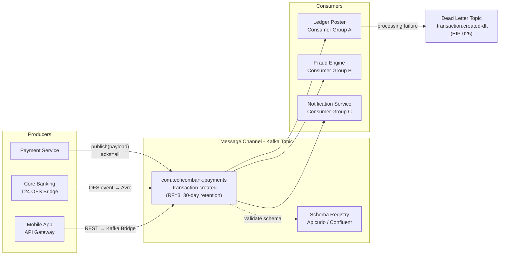

# Message Channel

Status: Draft | Last Reviewed: 2026-05-09 | Owner: @tech-lead-backend
Catalog ID: EIP-001 | Radii
Tier Applicability: T0, T1, T2

## Problem Statement

- Application code that couples directly to other applications via shared databases, synchronous HTTP calls, or raw sockets becomes brittle: every interface change must be coordinated, every downstream outage cascades upstream, and horizontal scaling requires shared-state management that is error-prone and expensive.
- Without a named, durable Message Channel, producers embed consumer-location knowledge (host, port, schema version), making independent deployment impossible and violating the loose-coupling mandate of a modern banking platform.
- Consumers that must poll or maintain persistent socket connections to producers cannot scale independently; demand spikes create thundering-herd effects that destabilise the entire call graph.
- Loss of the in-flight payload during a consumer restart means data loss with no replay path — unacceptable under BCBS 239 §6 Completeness and SBV Circular 09/2020 §IV.2 operational continuity requirements.

## Context

Apache Kafka is the primary Message Channel substrate for Techcombank's inter-service communication. A Kafka topic acts as a named, durable, partitioned log — producers append events and consumers read at their own pace using independent consumer groups. Spring Integration channels are used for in-process routing within a single service (e.g., pipeline stages between deserialization and business logic). The channel taxonomy in this document covers the full range from Point-to-Point (EIP-002) through Publish-Subscribe (EIP-003) and Dead Letter (EIP-025), all sharing the same Kafka infrastructure.

## Solution

A Message Channel is a logical, named conduit through which one application sends messages and another receives them, with no direct knowledge of each other. In Techcombank's stack, Apache Kafka topics are the primary Message Channel implementation for event streams; Spring Integration channels handle in-process routing between pipeline stages.



### Channel taxonomy

| Channel Type | Catalog ID | Kafka Realisation | Use When |
|---|---|---|---|
| Point-to-Point | EIP-002 | Single consumer group, one partition per key | Command routing; exactly one recipient |
| Publish-Subscribe | EIP-003 | Multiple independent consumer groups | Event fan-out; many recipients |
| Dead Letter | EIP-025 | `<source>-dlt` topic | Un-processable messages |
| Datatype | EIP-004 | Topic scoped to one Avro schema | Enforce single message type per channel |

## Implementation Guidelines

1. **Name channels after the domain event, not the producing service.** Use the convention `com.techcombank.<domain>.<entity>.<action>` — for example `com.techcombank.payments.transaction.created`, `com.techcombank.kyc.customer.verified`, `com.techcombank.fraud.alert.raised`. Topic names must be registered in the internal API catalog before first use.

2. **Register every schema in Apicurio/Confluent Schema Registry before producing.** Avro is the preferred wire format for T0/T1 channels; JSON Schema is acceptable for T2 internal tooling. Enable `FULL_TRANSITIVE` compatibility mode on financial message schemas to prevent breaking changes.

3. **Configure replication and retention by tier.**

   | Tier | Replication Factor | Min ISR | Retention | Partitions |
   |---|---|---|---|---|
   | T0 | 3 (cross-AZ) | 2 | 30 days | ≥ 12 |
   | T1 | 3 | 2 | 7 days | ≥ 6 |
   | T2 | 2 | 1 | 3 days | ≥ 3 |

4. **Choose partitioning strategy deliberately.** Partition by `customerId` for ordering guarantees within a customer's event stream (critical for ledger posting). Partition by `region` for localisation and compliance isolation. Partition by `transactionType` for predictable consumer group assignment. Document the partition key in the channel's schema-registry entry.

5. **Configure producers for durability.** Use `acks=all` and `enable.idempotence=true`. Set `retries=Integer.MAX_VALUE` and `delivery.timeout.ms=120000`. Use Spring Kafka's `KafkaTemplate` backed by a `DefaultKafkaProducerFactory`.

   ```java
   @Configuration
   public class KafkaProducerConfig {

       @Bean
       public ProducerFactory<String, Object> producerFactory(KafkaProperties props) {
           Map<String, Object> config = props.buildProducerProperties();
           config.put(ProducerConfig.ACKS_CONFIG, "all");
           config.put(ProducerConfig.ENABLE_IDEMPOTENCE_CONFIG, true);
           config.put(ProducerConfig.RETRIES_CONFIG, Integer.MAX_VALUE);
           config.put(ProducerConfig.DELIVERY_TIMEOUT_MS_CONFIG, 120_000);
           // Schema registry — Avro serialiser
           config.put(ProducerConfig.VALUE_SERIALIZER_CLASS_CONFIG,
               KafkaAvroSerializer.class);
           config.put("schema.registry.url",
               "${techcombank.kafka.schema-registry-url}");
           return new DefaultKafkaProducerFactory<>(config);
       }

       @Bean
       public KafkaTemplate<String, Object> kafkaTemplate(
               ProducerFactory<String, Object> pf) {
           return new KafkaTemplate<>(pf);
       }
   }
   ```

6. **Configure consumers with manual offset commit.** Never rely on `enable.auto.commit=true` for banking channels. Commit offsets only after side-effects are durably persisted. Pair with [EIP-024 Idempotent Receiver](idempotent-receiver.md) and [EIP-025 Dead Letter Channel](dead-letter-channel.md).

   ```java
   @Component
   @RequiredArgsConstructor
   public class TransactionCreatedListener {

       private final LedgerPostingService ledger;
       private final MeterRegistry metrics;

       @KafkaListener(
           topics = "com.techcombank.payments.transaction.created",
           groupId = "ledger-poster",
           containerFactory = "manualAckContainerFactory"
       )
       public void onTransactionCreated(
               @Payload TransactionCreatedEvent event,
               @Header(KafkaHeaders.RECEIVED_KEY) String partitionKey,
               @Header(KafkaHeaders.RECEIVED_PARTITION) int partition,
               @Header(KafkaHeaders.OFFSET) long offset,
               Acknowledgment ack) {

           String correlationId = MDC.get("correlationId");
           log.info("Channel consume: topic=payments.transaction.created "
               + "partition={} offset={} customerId={} correlationId={}",
               partition, offset, event.getCustomerId(), correlationId);

           ledger.post(event);
           ack.acknowledge();

           metrics.counter("channel.message.consumed",
               "topic", "payments.transaction.created",
               "partition", String.valueOf(partition)).increment();
       }
   }
   ```

7. **Integrate T24 OFS events via a bridge service.** The T24 OFS Bridge subscribes to T24 notification streams (NOFILE/NOTIFY) and publishes normalised Avro events to the appropriate Kafka channel. This ensures T24 legacy events flow through the same channel governance as modern-service events. The bridge applies schema validation before publishing; invalid OFS events are routed to a bridge-specific dead-letter topic.

8. **Govern channel lifecycle.** Every new channel requires a Channel Design Record (CDR) filed in the `governance/channels/` directory, signed off by the Architecture Guild. CDR fields: channel name, schema ID, tier, partition key, retention, producer team, consumer teams, compliance owner.

## When to Use

- Asynchronous inter-service communication where producers and consumers must scale and deploy independently.
- Events or commands that multiple downstream services need to consume at their own pace (fan-out to independent consumer groups).
- Audit and compliance scenarios requiring durable, replayable event streams (30-day retention for T0 channels).
- Environments requiring ordered processing per entity (partition by `customerId` for ledger consistency).

## When Not to Use

- Synchronous request-response where the caller must receive an immediate result (use REST or gRPC instead; latency of Kafka-based channels is typically 5–15 ms P99).
- In-process routing between pipeline stages within the same JVM — use Spring Integration `DirectChannel` for zero-latency in-process dispatch.
- Very low-cardinality, low-frequency events with a single consumer and no replay requirement — a simple database polling or HTTP webhook is simpler to operate.

## Variants

| Variant | When to prefer | Trade-off |
|---------|----------------|-----------|
| Kafka topic (this pattern) | Multiple independent consumers; high throughput; replay and durability required | Operational Kafka cluster required; eventual consistency between producer and consumers |
| Spring Integration DirectChannel | In-process routing within one JVM; sub-millisecond latency | No durability; single JVM only; cannot scale across instances |
| RabbitMQ AMQP Queue | Low-latency messaging; complex routing topologies (exchanges, bindings) | No native log replay; shorter retention; less suitable for financial audit trails |

## Banking Use Cases

1. **Real-time payment event fan-out** — When a payment is authorised in T24, the OFS bridge publishes to `com.techcombank.payments.transaction.created`. Three independent consumer groups process simultaneously: the Ledger Poster records the accounting entry, the Fraud Engine evaluates behavioural patterns, and the Notification Service sends the customer push notification. Each group processes at its own pace without blocking the others.

2. **KYC lifecycle events** — `com.techcombank.kyc.customer.verified` carries the output of the eKYC process (document check, face-match score, AML screening result). Downstream consumers include the Account Opening Service (to proceed with account creation) and the CRM (to update onboarding status). Channel partitioning by `customerId` guarantees ordered KYC state transitions per customer.

3. **Fraud alert propagation** — `com.techcombank.fraud.alert.raised` is a high-priority T0 channel. When the Fraud Engine raises an alert, the channel fans out to: Card Management (to block/unblock the card), the Risk Dashboard, and the Customer Engagement Service (to trigger a customer call workflow via EIP-017 Process Manager). Retention is 30 days to support post-incident investigation.

4. **NAPAS settlement file events** — `com.techcombank.napas.settlement.batch.received` carries inbound NAPAS settlement file metadata. The Aggregator (EIP-011) listens on this channel and accumulates individual settlement records until the batch is complete, then emits a single aggregated settlement event downstream to reconciliation.

5. **T24 end-of-day batch coordination** — `com.techcombank.eod.batch.step.completed` carries step-completion events from the EOD orchestration process. The Process Manager (EIP-017) consumes this channel to advance the EOD workflow state machine, enabling parallel step execution while maintaining sequencing constraints.

## Compliance Mapping

| Ring | Regulation | Provision | How this pattern satisfies |
|---|---|---|---|
| Ring 0 | EIP Book (Hohpe & Woolf) | Chapter 3 — Message Channel | Canonical pattern definition; this doc implements the Hohpe/Woolf channel model using Kafka topics |
| Ring 0 | NIST SP 800-53 | SC-8 (Transmission Confidentiality), SI-12 (Information Management) | mTLS on Kafka listeners; schema registry enforces message type integrity |
| Ring 0 | ISO 27001 | A.13.2.1 (Information Transfer Policies) | Channel naming convention and schema registry constitute the formal transfer policy |
| Ring 1 | BCBS 239 §6 | Accuracy and Completeness — risk data must be captured without gaps | Durable channels with `acks=all` and retention ensure no message is silently dropped; DLT makes failures observable |
| Ring 1 | ISO 20022 | Message envelope and identification concepts | Channel schema models ISO 20022 message structure (EndToEndId, TransactionId, MessageId headers) |
| Ring 2 | SBV Circular 09/2020 §IV.2 | Operational continuity requirements ⚠️ (working summary — pending Legal review) | 30-day T0 retention enables replay during prolonged outage; MirrorMaker 2 cross-region replication satisfies DR requirements |

## NFR Acceptance Criteria

```yaml
nfr:
  catalog_id: EIP-001
  pattern: Message Channel

  availability:
    target: 99.99%  # T0 channels
    measurement: "Kafka topic produce/consume success rate over rolling 30-day window"
    broker_replication_factor: 3
    min_in_sync_replicas: 2
    cross_region_replication: required_for_T0  # MirrorMaker 2

  performance:
    produce_latency_p95_ms: 5       # local cluster, acks=all
    produce_latency_p99_ms: 15
    consume_lag_alert_threshold: 10000  # messages; alert if consumer group lags beyond this
    schema_validation_overhead_ms: 1    # Apicurio / Confluent schema-registry lookup (cached)

  durability:
    message_loss_tolerance: 0       # zero tolerance for T0/T1 financial channels
    retention_days:
      T0: 30
      T1: 7
      T2: 3
    acks: all
    enable_idempotence: true

  scalability:
    partition_count_minimum:
      T0: 12
      T1: 6
      T2: 3
    consumer_group_independence: true  # each group progresses independently

  observability:
    required_metrics:
      - kafka_consumer_lag_by_group_topic_partition
      - kafka_producer_request_latency_avg
      - kafka_topic_messages_in_per_sec
      - schema_registry_request_error_rate
    log_fields:
      - correlationId
      - topic
      - partition
      - offset
      - customerId (masked to last 4 chars in T2)
```

## Cost/FinOps

- **Kafka cluster sizing** — T0 channel cluster (12 broker nodes, 3 AZs) costs approximately USD 4,500/month on cloud VMs. Partition count drives parallelism but not storage cost directly; size partitions for peak throughput headroom (2× current peak). Review partition counts quarterly.
- **Retention storage** — Storage cost is `messages_per_day × avg_message_size_bytes × retention_days × replication_factor`. At 10M transactions/day × 2KB average × 30 days × 3 replicas = approximately 1.8 TB. At USD 0.023/GB-month on cloud block storage, this is roughly USD 40/month for storage alone — trivial relative to compute.
- **Schema registry** — Confluent Cloud Schema Registry is priced per schema version; Apicurio self-hosted adds compute cost (~2 vCPU, 4GB RAM) but eliminates per-schema fees. For Techcombank's expected 200-400 active schema versions, Apicurio self-hosted is lower cost long-term.
- **Cross-region replication (MirrorMaker 2)** — T0 channels replicated to DR region incur inter-region egress costs (~USD 0.08/GB). At 1.8 TB/month data volume, egress is approximately USD 145/month. Budget this per T0 channel pair; it is a regulatory cost of doing business under SBV §IV.2.
- **Consumer group lag monitoring** — Confluent Control Center or Grafana + JMX exporter provides consumer lag metrics at no additional Kafka cost. Instrumenting lag alerting takes 1 sprint; prevents costly manual investigation of "lost message" incidents.

## Threat Model

- **Unauthorised channel access (Elevation of Privilege)** — A misconfigured producer publishes to a financial channel it does not own, injecting fraudulent events. Mitigation: Kafka ACLs enforce per-service-account topic-level produce/consume permissions; service accounts provisioned via GitOps IaC (no manual console access). OWASP ASVS V8 data protection controls apply.
- **Schema poisoning (Tampering)** — A producer publishes a message with an incompatible schema version, corrupting the consumer's deserialisation. Mitigation: `FULL_TRANSITIVE` compatibility mode in the schema registry rejects incompatible schema evolution; consumers use the schema registry to deserialise (never assume a schema version from the payload alone).
- **Man-in-the-middle on the broker network** — An attacker on the broker network intercepts payment event payloads containing PII. Mitigation: mTLS enforced on all Kafka listeners (NIST SP 800-53 SC-8); certificate rotation managed by the internal PKI (SEC-001); TLS 1.3 minimum.
- **Consumer lag exhaustion (DoS)** — A slow or stuck consumer group causes its committed offset to fall so far behind that Kafka's log compaction or retention deletes unconsumed messages. Mitigation: consumer lag alerts at 10K messages; automatic scale-out of consumer pods via KEDA on lag metric; DLT as safety valve for un-processable messages.
- **Retention expiry before consumption** — A consumer offline for longer than the channel retention window returns to find messages already deleted — silent loss. Mitigation: T0 consumer groups are monitored with a maximum offline tolerance of 24 hours; alert fires at 50% of retention window; cross-region replica extends effective retention during outages.
- **Message replay abuse** — An attacker with access to the broker replays historical payment events. Mitigation: [EIP-024 Idempotent Receiver](idempotent-receiver.md) on all consumers deduplicates; Kafka ACLs restrict consumer group read access; SWIFT/NAPAS messages carry ISO 20022 `MessageId` with 35-character uniqueness guarantee.
- **Partition hot-spotting** — A single partition key (e.g., a VIP customer with extreme transaction volume) overwhelms one partition. Mitigation: partition key monitoring in Grafana; add a secondary hash suffix to the partition key for hot customers (coordinated with the consuming team's idempotency key).

## Operational Runbook

1. **Alert: ConsumerLag_T0_High** — Fires when any T0 consumer group lag exceeds 10,000 messages for 5 minutes. Open Grafana `message-channel-overview` dashboard. Identify the lagging consumer group and partition. Check pod health and JVM GC pressure for that consumer deployment.

2. **Scale consumer pods** — If lag is caused by throughput, scale the consumer deployment: `kubectl scale deployment <consumer> --replicas=<n>` (max = partition count). KEDA is configured to trigger this automatically but can be overridden manually. Confirm lag trend reverses within 2 minutes.

3. **Schema registry unavailability** — If schema registry is down, producers and consumers using Avro will fail serialisation/deserialisation. Check schema registry pod status. In an emergency, consumers can be temporarily reconfigured to `use.latest.version=true` with `auto.register.schemas=false` and a cached schema — but this is a break-glass procedure requiring incident-command approval.

4. **Broker leader election / ISR shrinkage** — If `UnderReplicatedPartitions > 0` alert fires, check which broker is lagging: `kafka-topics.sh --describe --topics-with-overrides`. If ISR drops below `min.insync.replicas`, producers with `acks=all` will fail with `NotEnoughReplicasException`. Escalate to platform team immediately; this is a P1 for T0 channels.

5. **Dead messages accumulating in DLT** — See [EIP-025 Dead Letter Channel](dead-letter-channel.md) runbook. The channel itself is functioning correctly; the issue is with the consumer's processing logic.

6. **MirrorMaker 2 replication lag (cross-region DR)** — Alert fires when DR replica is > 60 seconds behind. Check MirrorMaker 2 pod logs for authentication or network errors. Replication lag during normal operations should be < 5 seconds. If lag exceeds 5 minutes, invoke the DR coordination process per REF-001.

7. **Channel decommission procedure** — Submit a CDR update marking the channel as `DEPRECATED`. Notify all registered consumer teams. Set retention to 1 day. Monitor consumer lag to confirm no active consumers. After 30 days, delete the topic via GitOps IaC change (never via console). Remove schema versions from the registry.

8. **Partition reassignment** — If a partition must be moved (broker decommission, rebalance), use `kafka-reassign-partitions.sh` with a pre-generated reassignment JSON. Monitor `kafka_server_reassignment_partition_bytes_remaining` — do not trigger reassignment during peak trading hours (08:30–17:00 VNT).

## Test Strategy

**Unit tests** — Test the `KafkaProducerConfig` bean wiring: verify `acks=all`, `enable.idempotence=true`, and schema-registry URL are correctly loaded from application properties. Test the `@KafkaListener` method in isolation using a `MessageBuilder` to inject test payloads; verify side-effect is called and `ack.acknowledge()` is invoked.

**Integration tests** — Use Testcontainers (`confluentinc/cp-kafka` + `confluentinc/cp-schema-registry`) to spin up a real Kafka broker and schema registry. Publish a valid Avro `TransactionCreatedEvent` and verify the consumer group receives it, the side-effect fires, and the offset is committed. Verify schema validation rejects a payload with a missing mandatory field.

**Schema compatibility tests** — On every schema change PR, run `schema-compatibility-check.sh` against the local schema registry container. Gate the CI pipeline on `FULL_TRANSITIVE` compatibility. Reject PRs that introduce breaking schema changes without a major version bump and migration plan.

**Chaos tests** — Kill one of three Kafka brokers while the producer is publishing; verify zero message loss (all messages land on the remaining ISR). Kill the consumer pod mid-processing; verify the message is redelivered and the [EIP-024 Idempotent Receiver](idempotent-receiver.md) deduplicates it. Simulate schema registry unavailability; verify producer fails fast with a clear exception (no silent data corruption).

**Compliance tests** — Verify that T0 topic configuration matches the NFR YAML: replication factor = 3, min ISR = 2, retention = 30 days. This is automated as a post-deployment smoke test in the CI/CD pipeline using `kafka-topics.sh --describe`.

## References

- Hohpe, G. & Woolf, B. — Enterprise Integration Patterns (Addison-Wesley), Chapter 3: Messaging Channels
- Apache Kafka documentation — Topic Configuration, Producer Configuration
- Confluent / Apicurio Schema Registry documentation
- Related catalog IDs: [EIP-002 Point-to-Point Channel](point-to-point-channel.md), [EIP-003 Publish-Subscribe Channel](publish-subscribe-channel.md), [EIP-024 Idempotent Receiver](idempotent-receiver.md), [EIP-025 Dead Letter Channel](dead-letter-channel.md), [INT-002 Transactional Outbox + CDC](../integration/cdc-outbox-pattern.md), [NFR-001 Service Tiering RTO/RPO](../../nfr/service-tiering-rto-rpo.md)

---

**Key Takeaway**: Every inter-service message in Techcombank flows through a named, durable Kafka Message Channel governed by a schema registry, partitioned for ordering, and tiered by retention — decoupling producers from consumers while preserving full auditability and replay capability.
