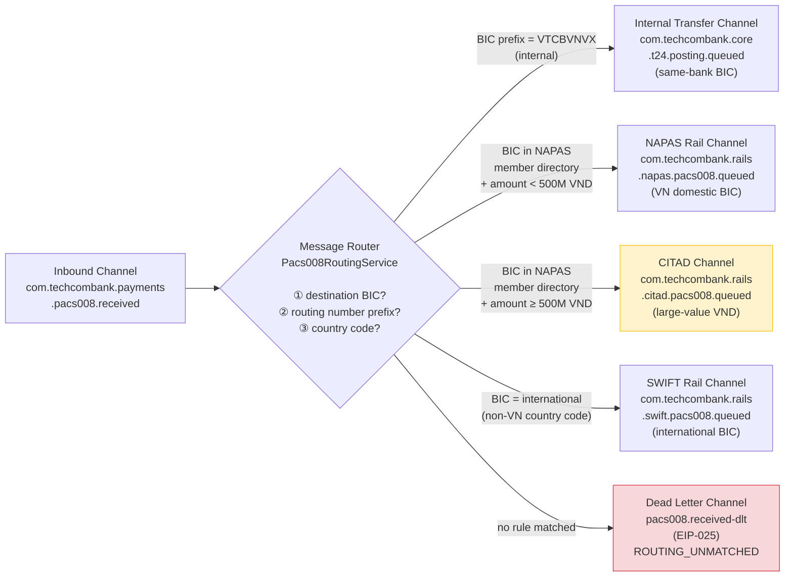

# Message Router

Status: Draft | Last Reviewed: 2026-05-09 | Owner: @tech-lead-backend
Catalog ID: EIP-004 | Radii
Tier Applicability: T0, T1

## Problem Statement

- Techcombank's payment platform receives ISO 20022 `pacs.008` credit-transfer messages from multiple ingestion channels (NAPAS, SWIFT, mobile app, corporate banking portal). Each message carries a destination BIC or routing number that determines which settlement rail must process it, but a single inbound Kafka topic is shared by all producers. Without a centralised routing component, each downstream service must subscribe to every message and filter locally — creating N copies of the same routing predicate and a silent-failure surface when predicates drift.
- Compliance obligations require that SWIFT cross-border transfers and NAPAS domestic transfers be processed by entirely separate authorised services. Coupling routing decisions into individual service consumers means a deployment change to one service could inadvertently allow domestic payments to flow through the cross-border handler, creating AML and NAPAS membership-rule violations.
- Adding a new settlement rail (e.g., onboarding the ASEAN regional payment scheme) must not require changes to existing handlers. Without a Message Router, every existing handler must be patched to ignore the new message type — violating the Open/Closed Principle and increasing regression risk.
- Network latency spikes occasionally cause out-of-order or duplicate `pacs.008` arrivals from the SWIFT gateway adapter. The router must route all messages to the correct processor before duplicate detection (EIP-024) is applied; mixing routing and deduplication logic in a single service produces code that is hard to test independently.
- Silent routing failures — where a `pacs.008` arrives with an unrecognised BIC prefix or an unsupported destination country code — must surface as observable DLT entries with a `ROUTING_UNMATCHED` code, not as message drops. BCBS 239 §6 requires completeness; any dropped payment event is a regulatory data-quality defect.
- Throughput during NAPAS end-of-day settlement windows reaches 8,000 TPS. The router must scale horizontally without shared state so that adding pods increases throughput linearly up to the Kafka partition limit.

## Context

Techcombank's ISO 20022 payment hub receives `pacs.008` CustomerCreditTransfer messages on a single inbound Kafka topic and must route each to the correct settlement rail (NAPAS, SWIFT, T24 direct-post). The Message Router sits between the inbound topic and the rail-specific outbound topics, keeping each rail handler completely decoupled from routing logic. It extends EIP-005 Content-Based Router with the full ISO 20022 field-inspection capability needed for multi-rail financial messaging.

## Solution

A Message Router sits on the inbound `pacs.008` Kafka topic, inspects each message's destination BIC and routing-number fields, and publishes it to exactly one downstream topic corresponding to the target settlement rail. An explicit default route publishes any unmatched message to the Dead Letter Channel (EIP-025) with reason code `ROUTING_UNMATCHED`.



### Routing rule table

| Priority | Predicate | Destination Channel |
|---|---|---|
| 1 | `destinationBic.startsWith("VTCBVNVX")` (own-bank) | Internal Transfer — T24 Direct |
| 2 | `destinationBic` in NAPAS member directory AND `amount < 500_000_000 VND` | NAPAS Rail |
| 3 | `destinationBic` in NAPAS member directory AND `amount >= 500_000_000 VND` | CITAD Large-Value Rail |
| 4 | `destinationCountryCode` not VN (international BIC) | SWIFT Rail |
| 99 | _(default)_ | Dead Letter Channel |

## Implementation Guidelines

1. **Implement the router as a stateless `@KafkaListener` that publishes to the resolved destination topic.** The service holds no mutable state between messages; all routing decisions are derived from the message payload and an in-memory BIC directory refreshed from a reference-data Kafka compacted topic.

   ```java
   @Component
   @RequiredArgsConstructor
   @Slf4j
   public class Pacs008RoutingService {

       private static final String OWN_BIC_PREFIX = "VTCBVNVX";
       private static final BigDecimal CITAD_THRESHOLD_VND =
           new BigDecimal("500000000");

       private final NapasMemberDirectory napasBics;
       private final FxRateCache fxRate;
       private final KafkaTemplate<String, Pacs008Message> kafkaTemplate;
       private final MeterRegistry metrics;

       @KafkaListener(
           topics = "com.techcombank.payments.pacs008.received",
           groupId = "pacs008-message-router",
           containerFactory = "pacs008KafkaListenerFactory"
       )
       public void route(
               @Payload Pacs008Message msg,
               @Header(KafkaHeaders.RECEIVED_KEY) String messageKey,
               Acknowledgment ack) {

           String correlationId = MDC.get("correlationId");
           String destination = resolveDestination(msg);

           log.info("MR route: msgId={} destBic={} amount={} currency={} "
               + "destination={} correlationId={}",
               msg.getMsgId(), msg.getDestinationBic(),
               msg.getInstructedAmount(), msg.getCurrency(),
               destination, correlationId);

           metrics.counter("mr.pacs008.route",
               "destination", destination,
               "currency", msg.getCurrency()).increment();

           kafkaTemplate.send(destination, messageKey, msg)
               .whenComplete((result, ex) -> {
                   if (ex != null) {
                       log.error("MR publish failed: msgId={} dest={} error={}",
                           msg.getMsgId(), destination, ex.getMessage());
                   } else {
                       ack.acknowledge();
                   }
               });
       }

       private String resolveDestination(Pacs008Message msg) {
           // Priority 1: own-bank internal transfer
           if (msg.getDestinationBic().startsWith(OWN_BIC_PREFIX)) {
               return "com.techcombank.core.t24.posting.queued";
           }
           // Priority 2 & 3: NAPAS domestic — split by CITAD threshold
           if (napasBics.contains(msg.getDestinationBic())) {
               BigDecimal amountVnd = toVnd(msg);
               if (amountVnd.compareTo(CITAD_THRESHOLD_VND) >= 0) {
                   return "com.techcombank.rails.citad.pacs008.queued";
               }
               return "com.techcombank.rails.napas.pacs008.queued";
           }
           // Priority 4: international SWIFT
           if (!msg.getDestinationBic().contains("VN")) {
               return "com.techcombank.rails.swift.pacs008.queued";
           }
           // Default: unmatched
           log.warn("MR unmatched: msgId={} destBic={}",
               msg.getMsgId(), msg.getDestinationBic());
           return "pacs008.received-dlt";
       }

       private BigDecimal toVnd(Pacs008Message msg) {
           return "VND".equals(msg.getCurrency())
               ? msg.getInstructedAmount()
               : fxRate.toVnd(msg.getInstructedAmount(), msg.getCurrency());
       }
   }
   ```

2. **Keep the NAPAS BIC directory as an in-memory cache refreshed from a compacted Kafka topic.** The NAPAS member BIC list changes infrequently (quarterly updates), but the router must not make a synchronous HTTP call per message. A `@KafkaListener` on `com.techcombank.refdata.napas-members.v1` (compacted topic) maintains a `ConcurrentHashMap<String, NapasMember>` that the routing service reads lock-free.

   ```java
   @Component
   @Slf4j
   public class NapasMemberDirectory {

       private final ConcurrentHashMap<String, NapasMember> directory =
           new ConcurrentHashMap<>();

       @KafkaListener(
           topics = "com.techcombank.refdata.napas-members.v1",
           groupId = "napas-bic-directory-loader",
           containerFactory = "compactedTopicListenerFactory"
       )
       public void onMemberUpdate(
               @Payload NapasMember member,
               @Header(KafkaHeaders.RECEIVED_KEY) String bic) {
           if (member == null) {
               directory.remove(bic); // tombstone = member removed
               log.info("NapasBicDirectory removed: bic={}", bic);
           } else {
               directory.put(bic, member);
               log.info("NapasBicDirectory updated: bic={} name={}",
                   bic, member.getBankName());
           }
       }

       public boolean contains(String bic) {
           return directory.containsKey(bic);
       }
   }
   ```

3. **Publish to Kafka using transactional producers so that consume-transform-publish is atomic.** The router reads from the inbound topic and writes to the destination topic in a single Kafka transaction. This prevents a failure between consume and publish from causing a message to be neither processed nor re-queued.

   ```java
   @Bean
   public KafkaTransactionManager<String, Pacs008Message> kafkaTxManager(
           ProducerFactory<String, Pacs008Message> pf) {
       return new KafkaTransactionManager<>(pf);
   }

   @Bean
   public KafkaListenerContainerFactory<?> pacs008KafkaListenerFactory(
           ConsumerFactory<String, Pacs008Message> cf,
           KafkaTransactionManager<String, Pacs008Message> txMgr) {
       var factory = new ConcurrentKafkaListenerContainerFactory<String, Pacs008Message>();
       factory.setConsumerFactory(cf);
       factory.getContainerProperties()
           .setTransactionManager(txMgr);
       factory.getContainerProperties()
           .setAckMode(ContainerProperties.AckMode.RECORD);
       return factory;
   }
   ```

4. **Externalise routing thresholds and BIC-override lists to Spring Cloud Config.** The CITAD threshold (VND 500M) and any forced-override BIC mappings (e.g., a partner bank that must route via SWIFT even though it has a NAPAS BIC) are configurable without redeployment.

   ```yaml
   techcombank:
     payments:
       pacs008-router:
         citad-threshold-vnd: 500000000
         own-bic-prefix: "VTCBVNVX"
         swift-force-bics: []          # BICs that must always go to SWIFT
         napas-fallback-on-directory-empty: false  # fail-safe: reject if directory not loaded
   ```

5. **Emit a structured routing decision log entry for every message.** The log entry constitutes the audit trail required by BCBS 239 §6 and must include: `msgId`, `correlationId`, `destinationBic`, `currency`, `amountVnd` (rounded to nearest 1,000 VND in logs to reduce PII exposure), and `resolvedRail`. Forward to the SIEM via the ELK pipeline with index pattern `techcombank-mr-pacs008-*`.

6. **Validate the message against the ISO 20022 `pacs.008.001.10` schema before routing.** A malformed message should be rejected to the DLT with reason `SCHEMA_INVALID` before routing logic runs. Use the Confluent Schema Registry Avro validator registered at `pacs008SchemaId` — the router never routes a message it cannot deserialise.

## When to Use

- A single inbound channel receives messages destined for multiple distinct downstream processors and the routing decision is based on message content or headers.
- Adding new destination channels must not require changes to existing downstream handlers.
- Routing decisions must be centrally audited and observable (compliance, BCBS 239).
- The router predicate is a pure function of message content — no cross-message state is needed to make the decision.

## When Not to Use

- The routing decision requires querying external systems per message (latency kills throughput at 8,000 TPS); cache reference data locally instead.
- You need to fan-out a single message to multiple recipients simultaneously — use Publish-Subscribe Channel (EIP-003) or Scatter-Gather (EIP-015) instead.
- Processing steps must be executed in a defined sequence on the same message — use Routing Slip (EIP-016) or Process Manager (EIP-017) instead.
- The number of destination channels is one — a router with a single route is just unnecessary indirection.

## Variants & Trade-offs

| Variant | When | Trade-off |
|---|---|---|
| Static predicate router (this doc) | Routing rules are stable and version-controlled | Fast, testable; adding a rule requires a code or config change + deploy |
| Rules-engine router (Drools / Easy Rules) | Business users need to change routing rules without engineering | Flexible; adds runtime complexity, harder to unit-test, rules engine is a new dependency |
| BIC directory lookup router | Destination set is large (thousands of BICs) and maintained by ops | Directory lookup is fast if in-memory; directory staleness is a risk |
| Header-based router | Upstream producer stamps a `X-Destination-Rail` header | Minimal payload inspection; router trusts the header — requires producer authentication to prevent header injection |
| Dynamic router (EIP-018) | Destination channels created at runtime | Maximum flexibility; complex management of channel registry and lifecycle |

## NFR Acceptance Criteria

```yaml
nfr:
  catalog_id: EIP-004
  service_name: pacs008-message-router
  tier: T0

  availability:
    target: 99.99%
    failure_mode: "router crash → pacs008.received consumer lag grows; no message loss (Kafka retention 72h)"
    recovery: "pod restart < 30s; consumer group rebalance < 15s"

  performance:
    routing_decision_latency_p95_ms: 3
    routing_decision_latency_p99_ms: 8
    throughput_tps: 8000
    bic_directory_lookup_ns: 200  # ConcurrentHashMap get — no blocking

  correctness:
    routing_accuracy_target: 100%
    unmatched_message_slo: "<0.001% of daily volume"
    schema_invalid_slo: "all schema-invalid messages reach DLT within 500ms"
    contract_test_vectors: "≥1 vector per routing rule + ≥3 edge-case vectors"

  observability:
    required_metrics:
      - mr_pacs008_route_total (by destination, currency)
      - mr_pacs008_unmatched_total
      - mr_pacs008_routing_latency_ms (histogram)
      - mr_pacs008_bic_directory_size (gauge)
    log_fields: [msgId, correlationId, destinationBic, currency, amountVndBucket, resolvedRail]
    alerts:
      - name: MR_Unmatched_Rate_High
        condition: "rate(mr_pacs008_unmatched_total[5m]) > 0.1"
        severity: High
      - name: MR_BicDirectory_Empty
        condition: "mr_pacs008_bic_directory_size == 0"
        severity: Critical
```

## Compliance Mapping

| Layer | Reference | Section/Control | How this pattern satisfies |
|---|---|---|---|
| Ring 0 (global) | Enterprise Integration Patterns (Hohpe/Woolf) | Chapter 7 — Message Router | Canonical pattern; this doc applies it to ISO 20022 pacs.008 rail selection at Techcombank |
| Ring 0 | NIST SP 800-53 | AC-4 Information Flow Enforcement | Routing rules constitute the formal information-flow policy between payment rails; no message crosses a rail boundary without an explicit routing rule |
| Ring 0 | OWASP ASVS V5 | V5.1 Input Validation | All routing decisions operate on schema-validated payloads (pacs.008.001.10 Avro); malformed messages are rejected before routing |
| Ring 1 (international banking) | BCBS 239 §6 | Accuracy & Completeness | Every routing decision is logged; default-DLT route ensures no silent drops; unmatched rate alert fires within 5 minutes |
| Ring 1 | ISO 20022 (pacs.008.001.10) | CdtTrfTxInf/DbtrAgt/FinInstnId/BICFI | Router uses the standard BICFI field as the primary routing key — ISO 20022 compliance is structural |
| Ring 1 | FATF Recommendation 16 (Travel Rule) | Cross-border wire ≥ threshold must carry originator data | SWIFT-rail routing enforces Travel Rule enrichment check in the SWIFT gateway downstream; router ensures all international pacs.008 messages reach that gateway |
| Ring 2 (Vietnam) | SBV Circular 09/2020 §IV.2 ⚠️ (working summary — pending Legal review) | Operational continuity | Stateless router scales horizontally; BIC directory failsafe prevents routing if directory is not loaded; DR runbook covers failover to secondary Kafka cluster |
| Ring 2 | SBV Circular 35/2015/TT-NHNN ⚠️ (working summary — pending Legal review) | NAPAS participation rules | Router enforces NAPAS-vs-CITAD split at VND 500M per SBV large-value payment regulations; CITAD route is mandatory above threshold |

## Cost / FinOps Notes

- **Compute** — The router is stateless and CPU-bound only by Avro deserialisation and map lookups. At 8,000 TPS with a 3ms P95 decision, a single 2-vCPU pod sustains the load. Run 3 pods for HA; estimated cost USD 35/month in pod compute.
- **Kafka topic proliferation** — 5 destination topics (NAPAS, CITAD, SWIFT, T24, DLT) at T0 configuration (RF=3, 72-hour retention for payment topics). Incremental storage cost approximately USD 180/month, fixed regardless of volume.
- **BIC directory topic** — A compacted Kafka topic for ~200 NAPAS member BICs. Negligible storage cost; compacted topics retain only the latest value per key.
- **FX rate cache** — Shared with the Content-Based Router (EIP-005). One cache instance per pod; ~1MB memory. FX rate service call frequency: once per 60-second TTL, not per message.
- **DLT monitoring** — DLT messages require manual triage. At < 0.001% unmatched rate on 8,000 TPS, this is < 1 message every 14 minutes during peak — low ops burden. Any spike above the alert threshold triggers an on-call page.

## Threat Model Summary

- **BIC directory poisoning** — An attacker publishes a malicious tombstone to the compacted BIC topic, removing a legitimate NAPAS member and causing their payments to be DLT'd. Mitigation: the BIC directory topic has producer ACLs restricted to the `refdata-publisher` service account; tombstones are audited; BIC directory size alert fires if directory shrinks below expected member count.
- **Header injection to bypass routing** — An upstream producer stamps `X-Destination-Rail: swift` to force an internal transfer to SWIFT. Mitigation: the router ignores all custom destination headers; routing is derived exclusively from payload fields (BIC, country code). Header-based routing is a variant that is explicitly not used for the pacs.008 primary path.
- **Routing rule configuration tampering** — A developer changes the CITAD threshold in Spring Cloud Config to route large-value payments to NAPAS, bypassing the SBV large-value requirement. Mitigation: routing configuration is version-controlled in Git; changes require approval from the Architecture and Compliance teams; config change events are emitted to the audit log.
- **Transaction replay causing double-routing** — A Kafka consumer offset reset causes already-routed `pacs.008` messages to be re-consumed and re-published to destination topics. Mitigation: downstream services implement idempotent receivers (EIP-024) using `MsgId` as the idempotency key; the router itself is idempotent — routing the same message twice produces two identical events, and deduplication downstream removes the second.

## Operational Runbook (stub)

1. **Alert: MR_Unmatched_Rate_High** — Inspect DLT topic `pacs008.received-dlt` for unmatched messages. Examine `destinationBic` field. If a new bank has joined NAPAS without a BIC directory update, trigger the `refdata-publisher` pipeline to refresh the directory. If the BIC is genuinely unrecognised, raise an incident with the Payments Operations team.
2. **Alert: MR_BicDirectory_Empty** — The NAPAS BIC directory has zero entries, likely because the compacted topic consumer has not caught up on startup. Check `napas-bic-directory-loader` consumer group lag. Restart the router pod only after confirming the compacted topic is readable.
3. **Adding a new destination rail** — Add a new routing predicate at the correct priority in `Pacs008RoutingService.resolveDestination`, add the corresponding Kafka topic to infrastructure-as-code, add contract test vectors, and follow the standard change-management process. Do not deploy without passing the full routing test suite.
4. **Debugging a misrouted payment** — Search Kibana index `techcombank-mr-pacs008-*` for `msgId=<id>`. Inspect the `resolvedRail` field and the predicate log to confirm which rule fired. Cross-reference the NAPAS BIC directory snapshot at the time of routing (stored in the directory update audit log).

## Test Strategy (stub)

- **Unit tests** — Parameterised JUnit 5 tests with one test vector per routing rule row plus edge cases: BIC exactly matching own-prefix, BIC in both NAPAS directory and SWIFT-force list, amount exactly at CITAD threshold, null BIC, schema-invalid payload. Mock `NapasMemberDirectory` and `FxRateCache`.
- **Integration tests** — Embedded Kafka (spring-kafka-test) with a pre-loaded BIC directory compacted topic. Send `pacs.008` messages to the inbound topic and assert consumer group on each destination topic receives exactly the expected subset of messages.
- **Contract tests** — YAML test-vector file `src/test/resources/pacs008-routing-test-cases.yml` executed against production Spring Cloud Config snapshot in CI to detect configuration drift.
- **Chaos tests** — Simulate BIC directory topic unavailability on startup; verify router refuses to route (configurable fail-safe) rather than routing to DLT with a stale empty directory.

## Related Patterns

- [EIP-005 Content-Based Router](content-based-router.md) — CBR is the general form; this document applies the pattern specifically to ISO 20022 pacs.008 rail routing
- [EIP-006 Publish-Subscribe Channel](publish-subscribe-channel.md) — Use when the same message must reach multiple recipients; MR routes to exactly one
- [EIP-015 Scatter-Gather](scatter-gather.md) — Use when multiple services must respond to one request and results must be aggregated
- [EIP-016 Routing Slip](routing-slip.md) — Use when a message must visit multiple processors in sequence
- [EIP-024 Idempotent Receiver](idempotent-receiver.md) — Downstream services must be idempotent to survive router replay
- [EIP-025 Dead Letter Channel](dead-letter-channel.md) — Default route for all unmatched or schema-invalid messages

## References

- Hohpe, G. & Woolf, B. — Enterprise Integration Patterns (Addison-Wesley), Chapter 7: Message Router
- ISO 20022 pacs.008.001.10 Credit Transfer Initiation schema
- NAPAS Vietnam — Technical Integration Specification (internal document, restricted)
- SBV Circular 35/2015/TT-NHNN — Large-value payment regulations (CITAD)
- Spring Kafka Reference — `@KafkaListener`, transactional producers, consumer group management
- Spring Cloud Config Reference — Externalised configuration and refresh

---
**Key Takeaway**: The Message Router centralises all ISO 20022 pacs.008 rail-selection logic in a single stateless, audited service — routing domestic transfers to NAPAS or CITAD based on BIC and amount, cross-border transfers to SWIFT, and own-bank transfers directly to T24 — with an explicit DLT route that guarantees no silent drops under BCBS 239.
