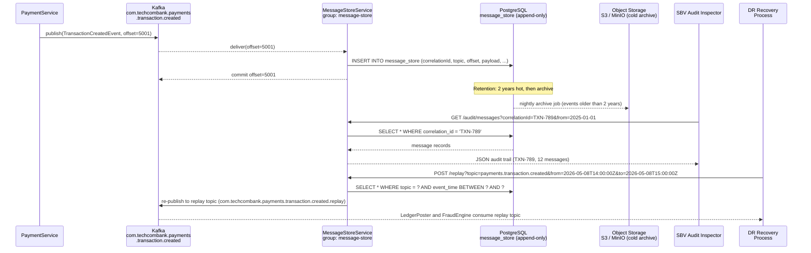

# Message Store

Status: Draft | Last Reviewed: 2026-05-09 | Owner: @tech-lead-backend
Catalog ID: EIP-018 | Radii
Tier Applicability: T0, T1

## Problem Statement

- SBV Circular 09/2020 §IV.2 requires Techcombank to retain complete, queryable transaction records for a minimum of 5 years. Kafka's channel retention (30 days for T0 topics) is insufficient for this obligation — events are deleted from the channel long before the regulatory retention window closes.
- During a Disaster Recovery event (e.g., primary data centre loss), payment events that were in-flight or processed in the last 30 days must be replayable to reconstruct the exact ledger state. Without a durable Message Store external to Kafka, the replay source is limited to Kafka's retention window and recovery is incomplete.
- The SBV's technology supervision team conducts ad hoc audits requiring Techcombank to produce a complete message-by-message trace of how a specific transaction was processed — which services handled it, in what sequence, with what payload at each step. Without a central Message Store, this reconstruction requires cross-querying log aggregators, database tables, and Kafka topic snapshots, which is error-prone and time-consuming.
- BCBS 239 §6 requires that risk data (including all transaction events that feed the risk aggregation system) be stored with sufficient accuracy and completeness to support intraday and end-of-day reporting. Ad hoc querying of live Kafka topics is not a substitute for a structured, indexed store.
- Without a Message Store, debugging a failed payment requires correlating logs across 6+ microservices (PaymentService, FraudEngine, LedgerPoster, NotificationService, T24 OFS Bridge, NAPAS Gateway) using only a correlation ID in log aggregation — a process that takes 30–90 minutes per incident. A Message Store enables sub-minute reconstruction of the full message flow for any correlation ID.
- Integration testing and DR recovery procedures require the ability to replay specific sets of messages (e.g., "replay all payment events for account X between 14:00 and 15:00 yesterday"). Kafka's offset-based seek cannot target messages by business key without scanning the entire partition.

## Solution

A Message Store is a durable, queryable repository that persists a copy of every message flowing through designated channels, capturing the full payload, headers, routing metadata, and timestamps. It enables long-term audit retention, ad hoc message lookup by business key, and targeted replay for DR and debugging. In Techcombank's stack, the Message Store is implemented as a Spring Boot service that consumes from Kafka topics as a Durable Subscriber (EIP-022) and persists each message to a PostgreSQL append-only audit table, with cold-tier archival to object storage after 2 years.



## Implementation Guidelines

1. **Implement the Message Store consumer as a Durable Subscriber (EIP-022).** The Message Store must never miss a message — it is the source of truth for regulatory audit and DR replay. Use the `message-store` consumer group with `auto.offset.reset=earliest`, `enable.auto.commit=false`, and `AckMode.MANUAL_IMMEDIATE`. Commit offsets only after the PostgreSQL `INSERT` is durably committed (inside the same Spring `@Transactional` boundary where possible, or sequenced so that offset commit follows confirmed DB write).

   ```java
   @Component
   @RequiredArgsConstructor
   @Slf4j
   public class MessageStoreIngestor {

       private final MessageStoreRepository repository;
       private final MeterRegistry metrics;

       @KafkaListener(
           topics = {
               "com.techcombank.payments.transaction.created",
               "com.techcombank.payments.transfer.command",
               "com.techcombank.accounts.balance.changed",
               "com.techcombank.fraud.alert.raised",
               "com.techcombank.kyc.customer.verified"
           },
           groupId = "message-store",
           containerFactory = "messageStoreContainerFactory"
       )
       public void ingest(
               @Payload byte[] rawPayload,
               @Header(KafkaHeaders.RECEIVED_TOPIC) String topic,
               @Header(KafkaHeaders.RECEIVED_PARTITION) int partition,
               @Header(KafkaHeaders.OFFSET) long offset,
               @Header(KafkaHeaders.RECEIVED_TIMESTAMP) long eventTimestamp,
               @Headers MessageHeaders headers,
               Acknowledgment ack) {

           String correlationId = extractHeader(headers, "X-Correlation-ID");
           String sourceSystem = extractHeader(headers, "X-Source-System");

           MDC.put("correlationId", correlationId);

           log.info("MS ingest: topic={} partition={} offset={} correlationId={}",
               topic, partition, offset, correlationId);

           MessageStoreRecord record = MessageStoreRecord.builder()
               .topic(topic)
               .partition(partition)
               .offset(offset)
               .correlationId(correlationId)
               .sourceSystem(sourceSystem)
               .eventTimestamp(Instant.ofEpochMilli(eventTimestamp))
               .ingestedAt(Instant.now())
               .rawPayload(rawPayload)
               .headers(extractAllHeaders(headers))
               .build();

           repository.insertWithUpsertGuard(record);
           ack.acknowledge();

           metrics.counter("ms.message.ingested",
               "topic", topic).increment();
       }

       private String extractHeader(MessageHeaders headers, String key) {
           byte[] value = (byte[]) headers.get(key);
           return value != null ? new String(value, StandardCharsets.UTF_8) : "UNKNOWN";
       }
   }
   ```

2. **Design the PostgreSQL schema for append-only writes and range-query performance.** The `message_store` table must never be updated or deleted by the application — only the archival job may move rows to cold storage. Use a composite unique constraint on `(topic, partition, offset)` to prevent duplicate inserts on redelivery. Partition the table by year to enable efficient cold archival and regulatory queries scoped to a calendar year.

   ```sql
   CREATE TABLE message_store (
       id              BIGSERIAL,
       topic           VARCHAR(255)    NOT NULL,
       partition       INTEGER         NOT NULL,
       "offset"        BIGINT          NOT NULL,
       correlation_id  VARCHAR(255)    NOT NULL,
       source_system   VARCHAR(100),
       event_timestamp TIMESTAMPTZ     NOT NULL,
       ingested_at     TIMESTAMPTZ     NOT NULL DEFAULT NOW(),
       raw_payload     BYTEA           NOT NULL,
       headers         JSONB,
       archived        BOOLEAN         NOT NULL DEFAULT FALSE,
       PRIMARY KEY (id, event_timestamp)
   ) PARTITION BY RANGE (event_timestamp);

   -- Annual partitions (created by automated job each December for the following year)
   CREATE TABLE message_store_2026
       PARTITION OF message_store
       FOR VALUES FROM ('2026-01-01') TO ('2027-01-01');

   -- Indexes for audit query patterns
   CREATE INDEX idx_ms_correlation_id
       ON message_store (correlation_id, event_timestamp DESC);
   CREATE INDEX idx_ms_topic_time
       ON message_store (topic, event_timestamp DESC);
   CREATE UNIQUE INDEX idx_ms_dedup
       ON message_store (topic, partition, "offset");
   ```

3. **Expose a read-only audit query API for SBV inspector access and internal debugging.** The API must be read-only; no endpoint may modify or delete records. Enforce this at the Spring Security layer (read-only role `AUDIT_READER`) and at the database layer (the API service connects with a PostgreSQL user that has `SELECT` privilege only on `message_store`). Return paginated results to prevent SBV queries from exhausting heap.

   ```java
   @RestController
   @RequestMapping("/api/v1/audit/messages")
   @PreAuthorize("hasRole('AUDIT_READER')")
   @RequiredArgsConstructor
   public class AuditQueryController {

       private final MessageStoreQueryService queryService;

       @GetMapping
       public Page<MessageStoreDto> query(
               @RequestParam(required = false) String correlationId,
               @RequestParam(required = false) String topic,
               @RequestParam @DateTimeFormat(iso = DateTimeFormat.ISO.DATE_TIME)
                   Instant from,
               @RequestParam @DateTimeFormat(iso = DateTimeFormat.ISO.DATE_TIME)
                   Instant to,
               @PageableDefault(size = 100, sort = "eventTimestamp") Pageable pageable) {

           log.info("Audit query: correlationId={} topic={} from={} to={} "
               + "requestedBy={}", correlationId, topic, from, to,
               SecurityContextHolder.getContext().getAuthentication().getName());

           validateDateRange(from, to);
           return queryService.query(correlationId, topic, from, to, pageable);
       }

       private void validateDateRange(Instant from, Instant to) {
           if (Duration.between(from, to).toDays() > 365) {
               throw new ResponseStatusException(HttpStatus.BAD_REQUEST,
                   "Date range must not exceed 365 days per query");
           }
       }
   }
   ```

4. **Implement the DR replay API to re-publish stored messages to a replay topic.** The replay API reads messages from the Message Store by topic, time range, or correlation ID and re-publishes them to a dedicated replay topic (e.g., `com.techcombank.payments.transaction.created.replay`). Downstream systems (LedgerPoster, FraudEngine) are reconfigured to consume the replay topic during DR recovery. The replay API adds an `X-Replay=true` header and the original `X-Correlation-ID` to each re-published message so idempotent consumers (EIP-024) correctly suppress duplicates.

   ```java
   @Service
   @RequiredArgsConstructor
   public class MessageReplayService {

       private final MessageStoreRepository repository;
       private final KafkaTemplate<String, byte[]> replayTemplate;

       public ReplaySummary replay(ReplayRequest request) {
           log.info("DR replay initiated: topic={} from={} to={} requestedBy={}",
               request.getTopic(), request.getFrom(), request.getTo(),
               request.getRequestedBy());

           String replayTopic = request.getTopic() + ".replay";
           AtomicLong replayed = new AtomicLong(0);

           repository.streamByTopicAndTimeRange(
                   request.getTopic(), request.getFrom(), request.getTo())
               .forEach(record -> {
                   var producerRecord = new ProducerRecord<>(
                       replayTopic,
                       null,
                       record.getEventTimestamp().toEpochMilli(),
                       record.getCorrelationId(),
                       record.getRawPayload()
                   );
                   producerRecord.headers()
                       .add("X-Replay", "true".getBytes(StandardCharsets.UTF_8))
                       .add("X-Original-Topic",
                           record.getTopic().getBytes(StandardCharsets.UTF_8))
                       .add("X-Original-Offset",
                           String.valueOf(record.getOffset())
                               .getBytes(StandardCharsets.UTF_8))
                       .add("X-Correlation-ID",
                           record.getCorrelationId().getBytes(StandardCharsets.UTF_8));

                   replayTemplate.send(producerRecord);
                   replayed.incrementAndGet();
               });

           log.info("DR replay complete: replayTopic={} messagesReplayed={}",
               replayTopic, replayed.get());
           return new ReplaySummary(replayTopic, replayed.get());
       }
   }
   ```

5. **Implement a nightly cold-archival job to move records older than 2 years to object storage.** The archival job reduces PostgreSQL hot storage while preserving regulatory compliance. Export records to Parquet format (queryable via Athena/Presto), upload to the designated S3 bucket (server-side encrypted with KMS), and mark rows as `archived = true` in PostgreSQL. After confirming the S3 upload, delete the archived rows from the active partition to free space.

   ```java
   @Component
   @RequiredArgsConstructor
   public class MessageStoreArchivalJob {

       private final MessageStoreRepository repository;
       private final S3ArchiveClient s3Client;
       private final MeterRegistry metrics;

       @Scheduled(cron = "0 2 0 * * *", zone = "Asia/Ho_Chi_Minh")  // 02:00 VNT daily
       public void archiveOldRecords() {
           Instant archiveBefore = Instant.now().minus(Duration.ofDays(730)); // 2 years
           log.info("Starting cold archival for records before={}", archiveBefore);

           List<MessageStoreRecord> batch;
           long totalArchived = 0;

           do {
               batch = repository.findUnarchived(archiveBefore, 10_000);
               if (batch.isEmpty()) break;

               String s3Key = buildS3Key(batch);
               s3Client.uploadParquet(s3Key, batch);
               repository.markArchived(batch.stream()
                   .map(MessageStoreRecord::getId)
                   .collect(Collectors.toList()));

               totalArchived += batch.size();
           } while (batch.size() == 10_000);

           log.info("Cold archival complete: archived={}", totalArchived);
           metrics.counter("ms.records.archived").increment(totalArchived);
       }

       private String buildS3Key(List<MessageStoreRecord> batch) {
           LocalDate date = batch.get(0).getEventTimestamp()
               .atZone(ZoneId.of("Asia/Ho_Chi_Minh")).toLocalDate();
           return String.format("message-store-archive/%d/%02d/%02d/batch-%d.parquet",
               date.getYear(), date.getMonthValue(), date.getDayOfMonth(),
               System.currentTimeMillis());
       }
   }
   ```

6. **Emit structured metrics for ingest throughput, storage growth, and query latency.** The Message Store is a critical shared infrastructure service. Instrument: ingest rate per topic, ingest lag behind the Kafka offset (how far behind the store is from real-time), PostgreSQL write latency p95/p99, query response time, archive job duration, and S3 upload success rate. Alert if ingest lag exceeds 5,000 messages on any T0 topic.

   ```java
   @Bean
   public MeterBinder messageStoreMetrics(MessageStoreRepository repository,
           DataSource dataSource) {
       return registry -> {
           // Storage size gauge
           Gauge.builder("ms.storage.rows.total",
               repository, MessageStoreRepository::countAll)
               .description("Total rows in active message store")
               .register(registry);

           // Ingest lag (populated by the DurableSubscriberHealthMonitor)
           Gauge.builder("ms.ingest.lag.messages",
               registry, r -> 0.0)  // updated by Kafka consumer lag monitor
               .tag("group", "message-store")
               .register(registry);

           // Database connection pool health
           HikariDataSource hikari = (HikariDataSource) dataSource;
           Gauge.builder("ms.db.pool.active",
               hikari, HikariDataSource::getHikariPoolMXBean,
               pool -> (double) pool.getActiveConnections())
               .register(registry);
       };
   }
   ```

## When to Use

- **Regulatory retention obligations** require queryable message history beyond Kafka's retention window (SBV 5-year requirement, BCBS 239 §6).
- **DR replay** is required: the ability to re-process a defined set of messages after a system failure or data corruption event.
- **Cross-service message tracing** is needed: given a `correlationId`, retrieve the full sequence of messages that resulted from a single originating event, across multiple Kafka topics.
- **Audit queries** from compliance teams, internal risk, or external regulators require structured, queryable access to message history (not just log file searches).
- **Integration debugging** requires the ability to inspect exact message payloads at each processing step without reconstructing them from application logs.

## When NOT to Use

- The channel is T2 and only internal tooling — regulatory retention is not required and Kafka's retention window is sufficient.
- The message payload contains **highly sensitive PII** (e.g., full card numbers, biometric data) that must not be persisted outside the originating system without explicit data classification approval. Apply field-level encryption or tokenisation before the Message Store ingests these channels.
- The use case only requires **latest state** per key (not history). A Kafka compacted topic or a normal database table updated on each event is a simpler and cheaper solution.
- **High-volume, low-value telemetry** streams (metrics, heartbeats, debug traces) where retention is expensive and replay is never needed. Use a time-series database or log aggregation system instead.

## Variants and Trade-offs

| Variant | When | Trade-off |
|---|---|---|
| PostgreSQL append-only table (standard) | Structured queries, rich indexing, ACID writes | Storage cost grows linearly; requires annual partition maintenance; cold archival required after 2 years |
| Object storage only (S3 / MinIO, Parquet) | Very high volume; cold-tier audit only; Athena queries acceptable | No sub-second query latency; unsuitable for real-time debugging or DR replay triggering |
| Kafka topic as long-retention store | Simple; no additional database | Offset-based access only (no key lookup); impractical for 5-year SBV retention; compaction loses message history |
| Elasticsearch for full-text audit queries | Compliance team needs free-text search over message content | High operational cost; complex schema management; not ACID; use as a secondary index over the PostgreSQL store |
| Wire tap + async enrichment | Message Store must not slow down the main processing path | Adds architectural complexity; wire tap must be at-least-once reliable to not create gaps |

## NFR Acceptance Criteria

```yaml
nfr:
  catalog_id: EIP-018
  pattern: Message Store

  acceptance_criteria:
    - id: MS-1
      name: Regulatory Retention Completeness
      description: >
        Every message published to designated T0 topics must be persisted in the
        Message Store within 5 seconds of publication (p95). After 5 years, 100% of
        messages must be retrievable from either the hot PostgreSQL store or the cold
        S3 archive. Verified by publishing 100,000 messages and confirming all are
        present in the store within the 5-second window.
      tier: T0

    - id: MS-2
      name: Audit Query Response Time
      description: >
        Query by correlationId must return results within 500ms p95 for queries
        spanning up to 90 days. Query by topic + time range must return the first
        page (100 records) within 2 seconds p95 for queries spanning up to 30 days.
        Verified under a concurrent query load of 20 simultaneous audit queries.
      tier: T0

    - id: MS-3
      name: DR Replay Throughput
      description: >
        The replay API must be capable of re-publishing at least 5,000 messages
        per second to the replay topic, enabling a 1-hour transaction window
        (approximately 1.8M messages at peak load) to be replayed within 6 minutes.
      tier: T0

    - id: MS-4
      name: Deduplication on Redelivery
      description: >
        If the Message Store consumer receives a redelivered message (same topic,
        partition, offset), the duplicate must be silently ignored (unique constraint
        on message_store). Zero duplicate rows must appear in the store. Verified
        by simulating 1,000 redeliveries and confirming row count does not increase.
      tier: T0

    - id: MS-5
      name: Cold Archive Integrity
      description: >
        Every row archived to S3 must be verifiable by re-reading the Parquet file
        and confirming (topic, partition, offset) matches the PostgreSQL record
        before deletion. The archival job must emit a checksum manifest alongside
        each Parquet file. Archive job failures must alert and halt; no row is
        deleted from PostgreSQL until S3 upload is confirmed.
      tier: T1
```

## Compliance Mapping

| Layer | Reference | Section/Control | How this pattern satisfies |
|---|---|---|---|
| Ring 0 (global) | Enterprise Integration Patterns (Hohpe/Woolf) | Chapter 11 — Message Store | Canonical pattern; PostgreSQL append-only table implements the Hohpe/Woolf message persistence model with queryable access |
| Ring 0 (global) | NIST SP 800-53 | AU-11 Audit Record Retention; AU-9 Protection of Audit Information | 5-year retention in PostgreSQL + S3 archive satisfies AU-11; append-only schema with read-only query role satisfies AU-9 tamper-evidence requirement |
| Ring 1 (international) | BCBS 239 §6 Accuracy and Completeness | Risk data aggregation systems must store data accurately and completely to support regulatory reporting | Message Store captures the full payload and headers of every transaction event; enables point-in-time reconstruction of the risk data state for any historical date |
| Ring 1 (international) | ISO 20022 | End-to-end transaction identification; message integrity | `EndToEndId`, `MessageId`, `correlationId` stored as indexed columns; enables ISO 20022-level transaction traceability across all processing steps |
| Ring 1 (international) | SWIFT CSP v2024 | Control 6.1 Operator Session Security; 6.2 Software Integrity | Message Store API access controlled by role-based authentication; all audit query activity logged with requesting user identity |
| Ring 2 (Vietnam) | SBV Circular 09/2020 §IV.2 ⚠️ (working summary — pending Legal review) | Article IV.2 — 5-year transaction record retention; availability for regulatory inspection | Hot PostgreSQL store (2 years) + cold S3 archive (years 3–5) provides 5-year queryable retention; read-only audit API enables SBV inspector access without direct database exposure |

## Cost / FinOps Notes

- **PostgreSQL hot storage (2-year active tier)** — 10M events/day × 2KB payload × 365 days × 2 years = 14.6 TB raw. With PostgreSQL compression (TOAST for BYTEA columns, approximately 30% reduction), effective storage ≈ 10 TB. At USD 0.115/GB-month for SSD-backed managed PostgreSQL = USD 1,150/month. Use partitioned tables and annual partition detachment to keep query planning efficient as the table grows.
- **Cold archive storage (years 3–5 on S3)** — Parquet compression typically achieves 5–10× reduction over raw bytes. 14.6 TB × 3 years in S3 Glacier ≈ 3–5 TB compressed. At USD 0.004/GB-month for Glacier = USD 12–20/month for the cold archive. Significantly cheaper than extending PostgreSQL retention.
- **Ingest compute** — The `message-store` consumer service requires 2 pods (2 vCPU, 4GB RAM each) for 10M events/day at 120 events/second average. During peak ingest (EOD batch, NAPAS settlement), scale to 4 pods via KEDA. PostgreSQL write batching (JDBC batch inserts of 500 records) maximises throughput per pod.
- **Query API compute** — Audit queries are infrequent (compliance team, SBV inspections, incident debugging). A single pod (2 vCPU, 4GB RAM) with HikariCP connection pool (max 20 connections) handles concurrent audit query load. Scale to 2 pods only during SBV audit exercises.
- **Archival job compute** — The nightly archival job is a batch workload running at 02:00 VNT for approximately 30–60 minutes. Run as a Kubernetes CronJob with 2 vCPU, 8GB RAM (Parquet serialisation is memory-intensive). No persistent pod cost — the job pod terminates after completion.

## Threat Model Summary

STRIDE: Repudiation, Tampering, Information Disclosure, Denial of Service addressed.

- **Message Store tampering (audit record modification)** — An insider updates or deletes rows from the `message_store` table to conceal a fraudulent transaction's audit trail. Mitigation: the application database role has `INSERT` and `SELECT` privileges only — no `UPDATE` or `DELETE`; DDL changes require a DBA role with dual approval via GitOps; periodic hash-chain verification (SHA-256 chain across sequential inserts ordered by `(topic, partition, offset)`) detects any retroactive modification; mismatch triggers an immediate P1 security alert.
- **Audit API data exfiltration** — An attacker with the `AUDIT_READER` role executes large-range queries to exfiltrate bulk transaction data. Mitigation: query date range capped at 365 days per request; rate limiting on the audit API (max 10 requests/minute per authenticated user); all query requests logged with the user identity, query parameters, and result row count; anomaly detection on query volume per user.
- **S3 archive integrity loss** — An attacker with cloud storage admin access deletes or corrupts archived Parquet files, creating gaps in the 5-year audit trail. Mitigation: S3 Object Lock (WORM — Write Once Read Many) enabled on the archive bucket with a 5-year retention lock; bucket versioning enabled; all S3 operations logged to CloudTrail; the archival job retains a local manifest of all uploaded files with SHA-256 checksums that can be independently verified.
- **Ingest consumer offset manipulation** — An attacker advances the `message-store` consumer group offset, causing a gap in the stored audit trail. Mitigation: same GitOps-only offset management control as EIP-022; gap detection job (described in Operational Runbook) detects sequence breaks; dual approval required for any `kafka-consumer-groups.sh --reset-offsets` operation on the `message-store` group.
- **Residual — PII in archived payloads** — The Message Store persists raw Avro payloads that may contain PII (account numbers, customer names). S3 archive must be server-side encrypted with KMS; PostgreSQL `raw_payload` column encrypted at the application layer using field-level encryption for T0 topics; data classification review required before adding a new topic to the Message Store subscriber list.

## Operational Runbook (stub)

1. **Alert: `MS_IngestLag_High`** — `message-store` consumer group lag > 5,000 messages on any T0 topic. Check Message Store pod health and PostgreSQL write latency (Grafana `message-store-overview` dashboard). If PostgreSQL write latency > 100ms p95, check for table bloat (run `VACUUM ANALYZE message_store_<year>`) or connection pool exhaustion. Scale ingest pods if lag trend is increasing.

2. **Alert: `MS_IngestPodDown`** — Message Store ingest pod in `CrashLoopBackOff`. Check PostgreSQL connectivity and schema registry availability. Common causes: database connection limit exceeded, schema registry deserialization failure on an unexpected Avro schema version. Restore within 15 minutes to minimise audit trail gap.

3. **SBV audit inspection request** — When SBV requests a message trace for a specific transaction: (a) authenticate the inspector via the internal LDAP-backed `AUDIT_READER` role provisioning process; (b) provide the read-only API endpoint URL and the specific `correlationId` or time range; (c) log the access grant with JIRA ticket reference; (d) revoke the role after the inspection period (maximum 48 hours). For archived data (> 2 years), retrieve from S3 using the internal Athena query interface.

4. **DR replay procedure** — During a DR recovery event: (a) confirm the primary cluster is unavailable and DR activation has been authorised by the Incident Commander; (b) identify the recovery time window (from last confirmed T24 ledger snapshot to DR activation time); (c) call the replay API: `POST /api/v1/replay` with the topic, `from`, `to`, and `requestedBy` fields; (d) monitor the replay topic consumer lag on LedgerPoster and FraudEngine; (e) confirm reconciliation totals match expected transaction counts; (f) document the replay event in the incident record for SBV notification.

5. **Cold archival job failure** — If the nightly archival job fails: (a) check pod logs (`kubectl logs -l app=message-store-archival`); (b) confirm S3 connectivity and KMS key availability; (c) no rows are deleted from PostgreSQL until S3 upload is confirmed — the job is safe to retry. Re-run manually: `kubectl create job --from=cronjob/message-store-archival manual-archive-$(date +%Y%m%d)`. Investigate S3 upload failures before re-running to avoid partial Parquet files.

6. **Hash-chain integrity check failure** — If the periodic hash-chain verification job detects a mismatch (tampered or missing rows), immediately: (a) page the Security Operations team; (b) identify the affected `(topic, partition, offset)` range; (c) cross-reference with Kafka (if within retention) or S3 archive to determine if the original message can be restored; (d) file an incident report with SBV notification team — a tampered audit record is a regulatory reportable event.

7. **PostgreSQL partition management** — Each December, create the next year's `message_store_<year>` partition: `CREATE TABLE message_store_<year> PARTITION OF message_store FOR VALUES FROM ('<year>-01-01') TO ('<year+1>-01-01')`. Run as an automated job in the GitOps pipeline. Detach and archive the oldest partition (3 years back) after confirming all records are in S3: `ALTER TABLE message_store DETACH PARTITION message_store_<old-year>`. Drop the detached table after SBV confirmation.

## Test Strategy (stub)

- **Unit** — Test `MessageStoreIngestor` with a mock `MessageStoreRepository`: verify `insertWithUpsertGuard` is called with all required fields (topic, partition, offset, correlationId, rawPayload); verify `ack.acknowledge()` is not called if the repository throws; verify duplicate records (same topic/partition/offset) are handled silently by the upsert guard without rethrowing.
- **Integration** — Use Testcontainers (Kafka + Schema Registry + PostgreSQL) to publish 1,000 `TransactionCreatedEvent` records; verify all 1,000 appear in the `message_store` table with correct topic, partition, offset, and correlationId; verify the deduplication constraint silently rejects 100 redelivered messages (row count stays at 1,000); verify the audit query API returns correct paginated results for a `correlationId` query.
- **Chaos** — Kill the Message Store ingest pod at offset 500 of 1,000 published events; verify no gap in stored records after pod restart (events 1–500 and 501–1,000 all present); verify no duplicate rows (unique constraint holds on redelivery); verify the DR replay API re-publishes all 1,000 records to the replay topic in the correct order.

## Related Patterns

- [EIP-001 Message Channel](message-channel.md) — the source channels from which the Message Store consumes
- [EIP-022 Durable Subscriber](durable-subscriber.md) — the Message Store ingestor is implemented as a Durable Subscriber to guarantee no events are missed
- [EIP-003 Publish-Subscribe Channel](publish-subscribe-channel.md) — the Message Store subscribes to Pub-Sub channels alongside operational subscribers
- [EIP-024 Idempotent Receiver](idempotent-receiver.md) — Message Store uses a unique constraint as its idempotency mechanism for redelivered messages
- [EIP-021 Channel Purger](channel-purger.md) — purged messages should also be captured by the Message Store (on the raw topic) before purging, to maintain audit completeness

## References

- Hohpe, G. & Woolf, B. — Enterprise Integration Patterns (Addison-Wesley), Chapter 11 — Message Store (pp. 531–535)
- Apache Kafka documentation — Consumer Groups, Manual Offset Commit
- Spring Kafka documentation — `@KafkaListener`, `AckMode.MANUAL_IMMEDIATE`, `MessageStoreRepository`
- PostgreSQL documentation — Declarative Table Partitioning, BYTEA compression (TOAST)
- AWS S3 documentation — Object Lock (WORM), Server-Side Encryption with KMS
- Apache Parquet documentation — columnar storage format for efficient archival queries
- SBV Circular 09/2020 — Article IV.2 Transaction Record Retention (internal Legal summary)
- Related catalog IDs: [EIP-001](message-channel.md), [EIP-003](publish-subscribe-channel.md), [EIP-021](channel-purger.md), [EIP-022](durable-subscriber.md), [EIP-024](idempotent-receiver.md)

---
**Key Takeaway**: The Message Store is Techcombank's regulatory memory — it captures every message flowing through T0 and T1 channels into a 5-year queryable audit store, enabling SBV Circular 09/2020 compliance, point-in-time DR replay of any transaction window, and sub-minute cross-service message tracing for incident investigation.
