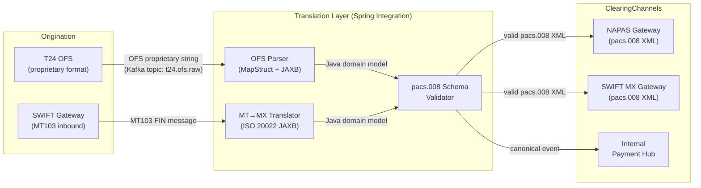

# Message Translator

Status: Draft | Last Reviewed: 2026-05-09 | Owner: @tech-lead-backend
Catalog ID: EIP-006 | Radii: Ring 0, Ring 1, Ring 2
Tier Applicability: T0, T1

## Problem Statement

- T24 Temenos OFS uses a proprietary positional-field message format (e.g., `FUNDS.TRANSFER,CREATE/I/PROCESS/1,/USD10000.00/...`) that no external clearing network understands natively; every outbound payment must be reshaped before it leaves the bank's perimeter.
- NAPAS real-time payments and SWIFT correspondent banking both require ISO 20022 pacs.008 (CustomerCreditTransferInitiation) XML; a single T24 debit instruction must fan out to two structurally different XML documents depending on the clearing rail chosen.
- The ongoing SWIFT MT-to-MX migration corridor mandates that legacy MT103 messages still arriving from correspondent banks are translated to pacs.008 before entering Techcombank's internal payment hub, creating a parallel inbound translation path.
- Without a dedicated translation layer, each consuming service would need to embed its own OFS or MT parser, spreading format-coupling across dozens of microservices and making field-mapping logic impossible to audit or certify under SBV Circular 09/2020.
- Translation errors at the field level (wrong currency code, truncated beneficiary name, missing BIC) cause NAPAS rejects or SWIFT repair queues that incur direct financial penalties and breach settlement SLAs.
- Regulatory reporting (BCBS 239 data lineage) requires that every field mapping is traceable: which source field produced which target field, at what timestamp, and in which version of the mapping definition.

## Solution

A Message Translator intercepts a message on an input channel, applies a deterministic field-mapping function that knows only about source structure and target structure, and emits the translated message on an output channel — with no business logic embedded in the translation itself.



## Implementation Guidelines

### 1. MapStruct mapper for OFS-to-domain translation

Define an immutable domain model for a credit transfer, then use MapStruct to map from the parsed OFS value object. Keep all null-safety and currency-code normalisation inside the mapper — never in upstream or downstream services.

```java
// CreditTransferMapper.java
@Mapper(componentModel = "spring",
        nullValuePropertyMappingStrategy = NullValuePropertyMappingStrategy.IGNORE,
        unmappedTargetPolicy = ReportingPolicy.ERROR)
public interface CreditTransferMapper {

    @Mapping(source = "debitAccountId",   target = "debtorAccount.identification")
    @Mapping(source = "creditAccountId",  target = "creditorAccount.identification")
    @Mapping(source = "currencyAmount",   target = "interbankSettlementAmount",
             qualifiedByName = "parseCurrencyAmount")
    @Mapping(source = "valueDate",        target = "interbankSettlementDate",
             dateFormat = "yyyyMMdd")
    @Mapping(source = "transactionRef",   target = "endToEndIdentification")
    CreditTransferDomain ofsToDomain(OfsPaymentRecord ofs);

    @Named("parseCurrencyAmount")
    static ActiveCurrencyAndAmount parseCurrencyAmount(String raw) {
        // raw = "USD10000.00"
        String ccy = raw.substring(0, 3);
        BigDecimal amount = new BigDecimal(raw.substring(3));
        return new ActiveCurrencyAndAmount(ccy, amount);
    }
}
```

### 2. ISO 20022 JAXB marshalling to pacs.008

Generate JAXB classes from the official ISO 20022 XSD (`pain.008.001.08`). Use a dedicated `Jaxb2Marshaller` bean scoped to the payment-processing Spring Integration flow.

```java
// Pacs008Marshaller.java
@Configuration
public class Pacs008MarshallerConfig {

    @Bean
    public Jaxb2Marshaller pacs008Marshaller() {
        Jaxb2Marshaller m = new Jaxb2Marshaller();
        m.setPackagesToScan("iso.std.iso._20022.tech.xsd.pacs_008_001");
        m.setSchema(new ClassPathResource("xsd/pacs.008.001.08.xsd"));
        return m;
    }
}

// Pacs008TranslatorService.java
@Service
@Slf4j
public class Pacs008TranslatorService {

    private final CreditTransferMapper mapper;
    private final Jaxb2Marshaller marshaller;

    public String translateOfs(OfsPaymentRecord ofs, String correlationId) {
        log.info("action=translate_ofs_to_pacs008 correlationId={} ref={}",
                 correlationId, ofs.getTransactionRef());
        CreditTransferDomain domain = mapper.ofsToDomain(ofs);
        Document doc = buildPacs008Document(domain);
        StringWriter sw = new StringWriter();
        marshaller.marshal(doc, new StreamResult(sw));
        return sw.toString();
    }

    private Document buildPacs008Document(CreditTransferDomain ct) {
        // ... populate JAXB object graph from domain model
    }
}
```

### 3. MT103-to-MX translator using Spring Integration

Consume MT103 FIN messages from the SWIFT inbound topic, parse with a dedicated tokeniser, and emit pacs.008 on the outbound channel. Each step is a discrete `MessageHandler` to keep concerns separated and individually testable.

```java
// Mt2MxTranslationFlow.java
@Configuration
public class Mt2MxTranslationFlow {

    @Bean
    public IntegrationFlow mt103InboundFlow(
            MessageChannel swiftInboundChannel,
            Mt103Parser mt103Parser,
            Pacs008TranslatorService translatorService,
            MessageChannel pacs008OutboundChannel) {

        return IntegrationFlow.from(swiftInboundChannel)
            .transform(Mt103Message.class, msg -> {
                String correlationId = msg.getHeaders()
                    .getOrDefault("X-Correlation-Id", UUID.randomUUID())
                    .toString();
                OfsPaymentRecord ofs = mt103Parser.toOfsRecord(msg.getPayload());
                return translatorService.translateOfs(ofs, correlationId);
            })
            .channel(pacs008OutboundChannel)
            .get();
    }
}
```

### 4. Schema validation as a mandatory gate

Always validate translated XML against the canonical XSD before it leaves the translation layer. Validation failures must route to a dead-letter topic and emit a structured alert — not be swallowed or logged-only.

```java
// Pacs008SchemaValidator.java
@Component
public class Pacs008SchemaValidator {

    private final Schema schema;

    public Pacs008SchemaValidator() throws SAXException {
        SchemaFactory sf = SchemaFactory.newInstance(XMLConstants.W3C_XML_SCHEMA_NS_URI);
        this.schema = sf.newSchema(
            new ClassPathResource("xsd/pacs.008.001.08.xsd").getURL());
    }

    public ValidationResult validate(String pacs008Xml) {
        try {
            Validator v = schema.newValidator();
            v.validate(new StreamSource(new StringReader(pacs008Xml)));
            return ValidationResult.ok();
        } catch (SAXException | IOException e) {
            return ValidationResult.failed(e.getMessage());
        }
    }
}
```

### 5. Mapping-version metadata in message headers

Every translated message must carry a `X-Mapping-Version` header recording the MapStruct artifact version and the XSD version used. This satisfies BCBS 239 §6 data-lineage traceability without coupling consumers to mapping internals.

```java
// TranslationHeaderEnricher.java
@Component
public class TranslationHeaderEnricher {

    @Value("${translation.mapping-version}")
    private String mappingVersion;   // e.g., "OFS-to-pacs008-v2.3"

    public Message<String> enrich(Message<String> msg) {
        return MessageBuilder.fromMessage(msg)
            .setHeader("X-Mapping-Version", mappingVersion)
            .setHeader("X-Translated-At", Instant.now().toString())
            .setHeader("X-Source-Format", "T24_OFS")
            .setHeader("X-Target-Format", "ISO20022_pacs.008.001.08")
            .build();
    }
}
```

### 6. Dead-letter handling and operational alerting

```java
// TranslationErrorHandler.java
@Component
@Slf4j
public class TranslationErrorHandler implements MessageHandler {

    private final KafkaTemplate<String, TranslationErrorEvent> deadLetterTemplate;
    private final MeterRegistry meterRegistry;

    @Override
    public void handleMessage(Message<?> message) {
        MessagingException ex = (MessagingException) message.getPayload();
        String correlationId = message.getHeaders()
            .getOrDefault("X-Correlation-Id", "UNKNOWN").toString();
        log.error("action=translation_failed correlationId={} error={}",
                  correlationId, ex.getMessage(), ex);
        meterRegistry.counter("eip.translation.failures",
            "pattern", "message-translator").increment();
        deadLetterTemplate.send("payment.translation.dlq",
            correlationId,
            new TranslationErrorEvent(correlationId, ex.getMessage(),
                                      Instant.now()));
    }
}
```

## When to Use / When NOT to Use

**Use when:**
- Two systems must exchange messages but their schemas are incompatible and cannot be changed at source or destination.
- A regulatory mandate (ISO 20022 migration, NAPAS onboarding) forces an explicit format boundary.
- The mapping logic is stable enough to be versioned and audited independently of business logic.
- Multiple downstream consumers require different formats from the same source event.

**Do NOT use when:**
- The source and target schemas are semantically identical — prefer a simple serialisation change (e.g., JSON to Avro with the same field names) without a full translator pattern.
- Business decisions must be made during translation (routing based on amount, fraud flags). Separate translation from routing — use Message Translator then a separate Router pattern.
- The mapping is trivial (one field rename) and the overhead of a MapStruct mapper and JAXB marshaller exceeds the value — use a lightweight `@Transformer` lambda instead.
- Real-time stream processing with sub-millisecond budgets — JAXB marshalling adds 0.5–2 ms per message; evaluate Avro or FlatBuffers for ultra-low-latency paths.

## Variants and Trade-offs

| Variant | When | Trade-off |
|---|---|---|
| MapStruct compile-time mapper | Schema stable, high throughput (>5 000 msg/s) | Fast, type-safe; requires redeployment on schema change |
| XSLT stylesheet | XML-to-XML, mapping owned by non-Java teams | Declarative and auditable; XSLT debugging is painful |
| Smooks data processor | Complex hierarchical OFS → ISO 20022 with loops | Handles cardinality mismatches; steeper learning curve |
| JSON Patch / JMESPath | Lightweight JSON-to-JSON field mapping | Low overhead; poor for structural reshaping |
| Apache Camel data-format | Camel-based integration routes already in use | Broad format support; adds Camel runtime dependency |

## NFR Acceptance Criteria

```yaml
id: MT-1
pattern: Message Translator
service: payment-translation-service

availability:
  target: "99.95%"
  measurement: "30-day rolling window, per rail (NAPAS / SWIFT)"
  failover: "Active-active across two AZs; translation stateless so no session affinity needed"

performance:
  p99_latency_ms: 15
  throughput_per_second: 8000
  basis: "pacs.008 XML generation via JAXB on Java 21 virtual threads, JVM warm"

reliability:
  zero_message_loss: true
  dead_letter_topic: "payment.translation.dlq"
  retry_policy: "3 retries with 100ms exponential back-off; then DLQ"
  schema_validation: "Mandatory pre-emit; hard reject on XSD violation"

observability:
  metrics:
    - "eip.translation.latency_ms (histogram, per source-format × target-format)"
    - "eip.translation.failures (counter, per error type)"
    - "eip.translation.mapping_version (gauge, for drift detection)"
  logs: "Structured JSON, correlation-id on every log line"
  alerts:
    - "failure_rate > 0.1% over 5 min → PagerDuty P2"
    - "p99 latency > 30 ms over 2 min → PagerDuty P2"

data_lineage:
  header: "X-Mapping-Version must be present on every translated message"
  audit_log: "Retained 7 years per SBV Circular 09/2020"
```

## Compliance Mapping

| Layer | Reference | Section / Control | How |
|---|---|---|---|
| Ring 0 (global) | Enterprise Integration Patterns (Hohpe/Woolf) | Ch. 8 — Message Transformation | Pattern definition; translator is stateless, single-responsibility |
| Ring 0 (global) | ISO 20022 Harmonisation Standard | pacs.008.001.08 XSD | Mandatory target schema for all credit transfers on ISO 20022 rails |
| Ring 1 (international banking) | BCBS 239 §6 — Data Lineage | Principle 6: Accuracy and Integrity | `X-Mapping-Version` + `X-Translated-At` headers provide field-level provenance |
| Ring 1 (international banking) | SWIFT Standards MT-MX Migration | Phase 2 (Nov 2025 deadline) | MT103-to-pacs.008 translator satisfies mandatory coexistence-period conversion |
| Ring 2 (Vietnam) | SBV Circular 09/2020 §III.2 ⚠️ (working summary — pending Legal review) | Inter-bank payment message format requirements | OFS-to-pacs.008 translation produces SBV-conformant NAPAS clearing messages |
| Ring 2 (Vietnam) | SBV Circular 09/2020 §IV.2 ⚠️ (working summary — pending Legal review) | Audit trail retention for payment instructions | Translation audit log (correlation-id, mapping version, timestamps) retained 7 years |

## Cost / FinOps Notes

- JAXB marshalling is CPU-bound; profile allocation rate at 5 000 msg/s — GC pressure can be significant with large XSD-generated object graphs. Use Java 21 virtual threads to absorb I/O wait without excess OS threads.
- Each translator instance is stateless; horizontal scaling is linear — add pods when `eip.translation.latency_ms p99 > 20 ms` sustained for 3 minutes.
- Schema validation adds ~15% CPU overhead per message compared to unvalidated marshalling; this cost is mandatory for compliance but can be bypassed on internal fan-out topics that stay within the translation layer's trust boundary.
- Archive translated pacs.008 messages to S3 Glacier (7-year retention) rather than keeping on Kafka; Kafka retention beyond 72 hours for this volume (~700 M msg/month) is cost-prohibitive.
- Consider caching parsed XSD `Schema` objects (expensive to instantiate) as singleton Spring beans — do not instantiate per-message.

## Threat Model Summary

| Threat | Vector | Mitigation |
|---|---|---|
| Malformed OFS injection | Adversarial T24 record with oversized field values | OFS parser enforces field-length bounds; fails fast with structured error |
| XML external entity (XXE) injection | Crafted pacs.008 payload from inbound SWIFT channel | `XMLInputFactory.IS_SUPPORTING_EXTERNAL_ENTITIES = false` on all parsers |
| Mapping-version tampering | Consumer ignores `X-Mapping-Version` and applies wrong deserialiser | Consumers must validate header; schema registry enforces Avro compatibility on internal topics |
| Schema downgrade attack | Older mapping version produces pacs.008 missing mandatory fields | XSD validation is mandatory gate; old-version messages fail validation and go to DLQ |
| Translation service as single point of failure | Translation pod crash during peak | Stateless; Kubernetes liveness/readiness probes restart within 10 s; Kafka consumer lag alert fires within 30 s |

## Operational Runbook (stub)

- **Health check:** `GET /actuator/health/translation` returns `{ "status": "UP", "mappingVersion": "..." }`.
- **Schema update procedure:** Deploy new MapStruct mapper artifact → bump `translation.mapping-version` property → rolling restart → verify `X-Mapping-Version` header on sample messages in staging before promoting.
- **DLQ triage:** Consume from `payment.translation.dlq`, inspect `errorType` field; common causes: missing BIC, XSD constraint violation on `IntrBkSttlmAmt`. Replay after manual correction using `payment-replay-tool`.
- **Lag alert response:** If Kafka consumer lag on `t24.ofs.raw` exceeds 10 000 messages, scale translation pods via `kubectl scale deployment payment-translation --replicas=N`.

## Test Strategy (stub)

- **Unit tests:** One test per MapStruct mapping expression; assert exact field values, currency code normalisation, date format, and null-safety. Target: 100% branch coverage on mapper.
- **Contract tests:** PactJVM consumer contract for each downstream (NAPAS adapter, SWIFT MX adapter); translation service is the provider. Run on every PR.
- **Schema validation tests:** Parameterised test suite with 20+ real OFS sample records (anonymised); assert every output passes XSD validation.
- **MT103 corpus tests:** SWIFT publishes a public MT103 sample corpus; run translator against all samples and assert valid pacs.008 output.
- **Performance baseline:** JMH benchmark at 5 000 msg/s with realistic pacs.008 payload size (4 KB); p99 must stay under 15 ms. Run nightly in CI.
- **Chaos test:** Kill translator pod mid-batch; assert Kafka consumer offset is not committed for unprocessed records; assert DLQ receives no duplicates on restart.

## Related Patterns

- **EIP-007 Content Enricher** — often chained after translation to augment the canonical pacs.008 with BIC lookups or AML scores before clearing.
- **EIP-004 Message Router** — selects NAPAS vs SWIFT channel after translation; translator produces one canonical format, router decides the rail.
- **EIP-005 Message Filter** — may precede translation to discard zero-value or test transactions before expensive JAXB marshalling.
- **EIP-008 Content Filter** — strips internal routing metadata from translated messages before delivery to external partners.
- **Canonical Data Model** (enterprise pattern) — the `CreditTransferDomain` Java record is Techcombank's canonical payment model; all translators target this model, not each other.

## References

- Hohpe, G. & Woolf, B. — *Enterprise Integration Patterns* (2003), Chapter 8: Message Transformation
- ISO 20022 XSD schemas: `https://www.iso20022.org/catalogue-messages/iso-20022-messages-archive`
- SWIFT MT-MX Migration Hub: `https://www.swift.com/standards/data-standards/iso-20022/migration`
- SBV Circular 09/2020 on inter-bank electronic payment: `https://vbsp.org.vn/` (authoritative Vietnamese text)
- BCBS 239 — Principles for effective risk data aggregation and risk reporting (Jan 2013)
- MapStruct documentation: `https://mapstruct.org/documentation/stable/reference/html/`
- Catalog reference: `governance/standards/enterprise-architecture-catalog.md`

---
**Key Takeaway**: The Message Translator isolates all format-mapping logic in a single, versioned, schema-validated layer so that T24 OFS proprietary messages and legacy MT103 FIN messages can reach NAPAS and SWIFT as compliant ISO 20022 pacs.008 XML without spreading format-coupling across the payment microservice estate.
