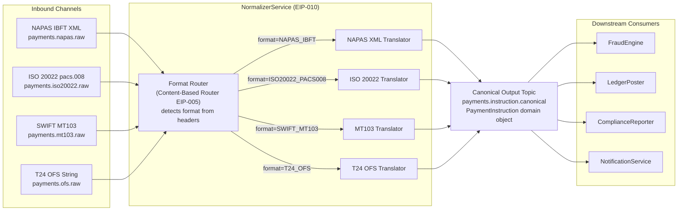

# Normalizer

Status: Draft | Last Reviewed: 2026-05-09 | Owner: @tech-lead-backend
Catalog ID: EIP-010 | Radii
Tier Applicability: T0, T1

## Problem Statement

- Techcombank's payment integration layer receives inbound payment instructions across four distinct wire formats — NAPAS IBFT XML (domestic interbank), ISO 20022 pacs.008 (SWIFT MX cross-border), SWIFT MT103 (legacy cross-border), and T24 Temenos OFS strings (internal core-banking postings). Each format has different field names, date encodings, amount representations, and identifier schemes, making it impossible for downstream services (fraud, ledger, compliance) to consume a single canonical event without knowing the source format.
- Coupling each downstream consumer to every possible inbound format creates an N×M maintenance problem: four formats multiplied by six downstream services means twenty-four independent parsing paths, all of which must be updated when a field changes in any format. A format evolution in NAPAS (e.g., adding an ISO 20022 sub-field) would require coordinated releases across every downstream team.
- Schema diversity creates audit gaps: when a payment is investigated, engineers must know which format it arrived in to reconstruct the original values. Without normalisation, each service stores a format-specific snapshot that is hard to compare or aggregate under BCBS 239's data lineage requirements.
- Regulatory reporting to SBV requires amounts expressed in VND with a consistent precision of two decimal places. SWIFT MT103 encodes amounts without decimal separators; NAPAS XML uses a comma-decimal; OFS strings embed amounts in positional fields. Direct consumption by the reporting service forces business logic into a compliance-critical component that should remain format-agnostic.
- Without a single normalisation point, a format-specific bug (e.g., an off-by-one in the MT103 amount parser) proliferates silently across all consumers. A Normalizer centralises the defect surface to one translator per format, making regression testing tractable.

## Context

Techcombank receives payment instructions from three sources with incompatible formats: T24 OFS proprietary format, SWIFT MT103 legacy text, and ISO 20022 pacs.008 XML. Before any downstream service (fraud screening, ledger posting, regulatory reporting) can act on these instructions, they must be converted to a single `PaymentInstruction` canonical domain object. The Normalizer pattern applies a router (EIP-004) to identify the format and dispatches to a dedicated translator (EIP-006) for each format — keeping format-specific parsing isolated and independently versioned.

## Solution

A Normalizer is composed of a router that identifies the inbound format and dispatches each message to the appropriate format-specific translator; each translator converts its input into a single canonical `PaymentInstruction` domain object. All downstream services consume only the canonical form from a shared Kafka topic.



## Implementation Guidelines

1. **Define the canonical `PaymentInstruction` record first — the translators are secondary.** The domain object is the contract. All downstream services depend on it; no downstream service may depend on a format-specific type. Use a Java record with an `@Schema`-annotated Avro schema registered in the Confluent Schema Registry before any translator is written.

   ```java
   /**
    * Canonical payment instruction — format-agnostic domain object produced
    * by the Normalizer (EIP-010). All amounts in VND-equivalent BigDecimal
    * with scale=2. Timestamps in Instant (UTC).
    */
   public record PaymentInstruction(
       String paymentId,           // globally unique; sourced from originating format's TxId
       String correlationId,       // set by the originating gateway; propagated via MDC
       PaymentFormat sourceFormat, // NAPAS_IBFT | ISO20022_PACS008 | SWIFT_MT103 | T24_OFS
       String debtorAccountNumber,
       String creditorAccountNumber,
       String creditorBankBic,
       BigDecimal instructedAmount,
       String instructedCurrency,
       BigDecimal amountVnd,       // VND equivalent at time of normalisation
       Instant valueDate,
       String remittanceInfo,
       Map<String, String> sourceHeaders,  // original format headers for audit
       Instant normalisedAt
   ) {}

   public enum PaymentFormat {
       NAPAS_IBFT, ISO20022_PACS008, SWIFT_MT103, T24_OFS
   }
   ```

2. **Implement each translator as a Spring `@Component` with a single `translate(RawMessage) → PaymentInstruction` method.** Translators must be stateless. Inject only the `ExchangeRateService` (for VND conversion) and `MeterRegistry` (for per-format metrics). Each translator is independently unit-testable with no Spring context required.

   ```java
   @Component
   @RequiredArgsConstructor
   @Slf4j
   public class NapasIbftTranslator implements FormatTranslator<NapasIbftMessage> {

       private final ExchangeRateService fxService;
       private final MeterRegistry metrics;

       @Override
       public PaymentInstruction translate(NapasIbftMessage raw) {
           String correlationId = MDC.get("correlationId");

           // NAPAS IBFT XML amounts are in VND only — no conversion needed
           BigDecimal amount = parseNapasAmount(raw.getSoTien()); // comma-decimal

           log.info("Normalizer NAPAS translate: txId={} debtorAcct={} amount={} correlationId={}",
               raw.getMaThuChiId(), raw.getTaiKhoanNo(), amount, correlationId);

           metrics.counter("normalizer.translated",
               "format", "NAPAS_IBFT").increment();

           return new PaymentInstruction(
               raw.getMaThuChiId(),
               correlationId,
               PaymentFormat.NAPAS_IBFT,
               raw.getTaiKhoanNo(),
               raw.getTaiKhoanCo(),
               raw.getMaNganHangThu(),
               amount,
               "VND",
               amount,         // NAPAS is always VND
               LocalDate.parse(raw.getNgayGiaoDich(),
                   DateTimeFormatter.ofPattern("ddMMyyyy"))
                   .atStartOfDay(ZoneId.of("Asia/Ho_Chi_Minh")).toInstant(),
               raw.getNoiDungCK(),
               Map.of("napas.sequence", raw.getSoThuTu()),
               Instant.now()
           );
       }

       private BigDecimal parseNapasAmount(String raw) {
           // NAPAS encodes "1.234.567,89" — strip thousands separator, replace comma
           return new BigDecimal(raw.replace(".", "").replace(",", "."));
       }
   }
   ```

3. **Implement the Format Router as a Spring Integration `@Router` that dispatches by Kafka message header, not by payload inspection.** Each inbound adapter stamps a `payment-format` header before publishing. Relying on headers (not payload parsing) keeps the router fast and format-agnostic, and avoids deserialising the raw payload at the routing layer.

   ```java
   @Component
   @Slf4j
   public class PaymentFormatRouter {

       @Router(inputChannel = "rawPaymentChannel",
               defaultOutputChannel = "normalizerDltChannel")
       public String route(Message<?> message) {
           String format = (String) message.getHeaders().get("payment-format");
           String correlationId = (String) message.getHeaders().get("correlationId");

           if (format == null) {
               log.warn("Normalizer router: missing payment-format header correlationId={}",
                   correlationId);
               return "normalizerDltChannel";
           }

           return switch (format) {
               case "NAPAS_IBFT"        -> "napasTranslatorChannel";
               case "ISO20022_PACS008"  -> "iso20022TranslatorChannel";
               case "SWIFT_MT103"       -> "mt103TranslatorChannel";
               case "T24_OFS"           -> "ofsTranslatorChannel";
               default -> {
                   log.warn("Normalizer router: unknown format={} correlationId={}",
                       format, correlationId);
                   yield "normalizerDltChannel";
               }
           };
       }
   }
   ```

4. **Publish the normalised `PaymentInstruction` to the canonical Kafka topic using a typed `KafkaTemplate` backed by the Schema Registry.** The canonical topic's schema is the only cross-service contract; all consumers pin to it via Schema Registry subject compatibility (`BACKWARD_TRANSITIVE`).

   ```java
   @Component
   @RequiredArgsConstructor
   public class CanonicalPublisher {

       private static final String CANONICAL_TOPIC = "payments.instruction.canonical";

       private final KafkaTemplate<String, PaymentInstruction> kafkaTemplate;
       private final MeterRegistry metrics;

       public void publish(PaymentInstruction instruction) {
           ProducerRecord<String, PaymentInstruction> record =
               new ProducerRecord<>(
                   CANONICAL_TOPIC,
                   instruction.debtorAccountNumber(),  // partition by debtor for ordering
                   instruction);
           record.headers().add("correlationId",
               instruction.correlationId().getBytes(StandardCharsets.UTF_8));
           record.headers().add("sourceFormat",
               instruction.sourceFormat().name().getBytes(StandardCharsets.UTF_8));

           kafkaTemplate.send(record)
               .whenComplete((result, ex) -> {
                   if (ex != null) {
                       log.error("Normalizer publish failed: paymentId={} correlationId={}",
                           instruction.paymentId(), instruction.correlationId(), ex);
                       metrics.counter("normalizer.publish.error",
                           "format", instruction.sourceFormat().name()).increment();
                   } else {
                       metrics.counter("normalizer.publish.success",
                           "format", instruction.sourceFormat().name()).increment();
                   }
               });
       }
   }
   ```

5. **Preserve the original raw message as a `sourceHeaders` map and store it in the Message Store (EIP-014) for audit.** Regulators and audit teams may need to retrieve the exact original wire message for a given `paymentId`. The normalised form is for processing; the original is for proof.

   ```java
   // In each translator, capture raw headers before transformation
   Map<String, String> sourceHeaders = Map.of(
       "raw.format",    PaymentFormat.NAPAS_IBFT.name(),
       "raw.topic",     "payments.napas.raw",
       "raw.offset",    String.valueOf(kafkaOffset),
       "raw.partition", String.valueOf(kafkaPartition),
       "raw.timestamp", Instant.now().toString()
   );
   ```

6. **Expose per-format translation latency and error rate as Prometheus metrics. Alert on any format whose error rate exceeds 1% over 5 minutes** — this signals a format change upstream (e.g., NAPAS schema update) that requires a translator patch.

   ```yaml
   # alerting rules — values.yaml / Prometheus rule CRD
   - alert: NormalizerTranslationErrorRateHigh
     expr: |
       rate(normalizer_translated_total{result="error"}[5m])
         / rate(normalizer_translated_total[5m]) > 0.01
     for: 5m
     labels:
       severity: high
     annotations:
       summary: "Normalizer {{ $labels.format }} error rate > 1%"
       description: "Check if upstream {{ $labels.format }} schema changed."
   ```

## When to Use

- Two or more source formats must feed the same downstream consumers.
- Downstream consumers are format-agnostic and should remain so.
- Compliance or audit requirements demand a single canonical record regardless of source.
- Format evolution of one wire protocol must not require a release of all downstream services.

## When Not to Use

- Only one format exists and the probability of adding another is negligible — the additional indirection costs deployment complexity.
- The canonical form would lose information that some downstream services need — in that case, enrich the canonical form rather than carrying multiple formats forward.
- Downstream services need to react to format-specific metadata (e.g., NAPAS sequence number for settlement reconciliation) — expose these as typed optional fields on the canonical object rather than skipping normalisation.

## Variants & Trade-offs

| Variant | When | Trade-off |
|---|---|---|
| **Static routing by topic** (this doc) | Each format arrives on its own Kafka topic, stamped by the ingress adapter | Simple; predictable; requires an ingress adapter per source format |
| **Dynamic routing by content inspection** | Formats arrive on a single topic; router parses first bytes to detect format | Eliminates per-source topic; increases router coupling to every format |
| **Translator-per-format microservice** | Very high volume per format; need independent scaling or deployment of translators | Maximises isolation; increases operational complexity (more deployments, more topics) |
| **Schema-based auto-detection via Schema Registry** | All formats are Avro/JSON Schema-registered; registry subject lookup identifies format | Elegant for Avro ecosystems; does not work for legacy text formats like MT103 or OFS |

## NFR Acceptance Criteria

```yaml
nfr:
  catalog_id: EIP-010
  pattern: Normalizer

  availability:
    target: 99.99%   # T0 — normaliser is on the critical payment path
    failure_mode: "normaliser down → raw topic consumer lag grows; no data loss (Kafka retention)"
    recovery: "pod restart < 30s; consumer group rebalance < 10s"

  performance:
    translation_latency_p95_ms: 5     # includes VND FX conversion (cached)
    translation_latency_p99_ms: 15
    throughput_tps: 3000              # sustained peak including EOD NAPAS batch burst
    fx_cache_ttl_seconds: 60

  correctness:
    canonical_schema_compatibility: BACKWARD_TRANSITIVE
    translation_accuracy: 100%       # zero tolerance for amount or identifier mis-mapping
    unknown_format_handling: DLT     # no silent drops; every unrecognised message to DLT

  observability:
    required_metrics:
      - normalizer_translated_total (by format, result=success|error)
      - normalizer_translation_latency_ms (by format, p50/p95/p99)
      - normalizer_publish_error_total (by format)
    log_level: INFO
    structured_fields: [paymentId, correlationId, sourceFormat, normalisedAt]
    alert:
      - name: NormalizerTranslationErrorRateHigh
        condition: "error rate > 1% over 5m for any format"
        severity: High
      - name: NormalizerConsumerLagHigh
        condition: "raw topic consumer lag > 5000 messages"
        severity: High

  scalability:
    horizontal_scaling: true   # translators are stateless
    state: none                # no in-memory state between messages
    partition_strategy: "debtor account number — preserves ordering per account"
```

## Compliance Mapping

| Layer | Reference | Section/Control | How |
|---|---|---|---|
| Ring 0 (global) | Enterprise Integration Patterns (Hohpe/Woolf) | Chapter 8 — Normalizer | Canonical pattern; this document applies it to Techcombank's four-format payment ingestion pipeline |
| Ring 0 (global) | OWASP ASVS V5.1 | Input Validation | Each translator validates its format-specific payload against a schema before producing the canonical object; invalid payloads route to DLT |
| Ring 1 (international) | BCBS 239 §6 (Accuracy and Integrity) | All material risk data must be captured completely and accurately | The canonical `PaymentInstruction` is the single source of truth for all downstream risk systems; format-specific parsing defects are isolated to one translator |
| Ring 1 (international) | ISO 20022 MX migration (pacs.008) | Payment message standard compliance | The ISO 20022 translator is the authoritative mapping from pacs.008 fields to the canonical domain object; updated as the ISO 20022 standard evolves |
| Ring 2 (Vietnam) | SBV Circular 09/2020 §IV.2 ⚠️ (working summary — pending Legal review) | Operational continuity | Stateless translators are horizontally scalable; raw Kafka topics retain messages for 7 days, enabling replay if the normaliser is temporarily unavailable |

## Cost / FinOps Notes

- **Compute**: Each translator is stateless and CPU-bound only by XML/string parsing. Four translator instances (one per format) each consume approximately 0.25 vCPU at 3,000 TPS aggregate. Total compute cost is approximately USD 20/month per environment.
- **Kafka topics**: The canonical output topic (`payments.instruction.canonical`) adds one topic with the same retention and replication as the source topics. At T0 (RF=3, 30-day retention, ~500 bytes per `PaymentInstruction`), estimated storage is approximately 4 GB/month at 3,000 TPS daily peak.
- **FX conversion**: The VND-equivalent field requires one FX lookup per non-VND payment. An in-process TTL-60s cache serving the SWIFT and OFS translators keeps this to near-zero external calls. Cache memory footprint: under 1 MB.
- **Schema Registry**: One Avro subject (`PaymentInstruction-value`) with `BACKWARD_TRANSITIVE` compatibility. Schema evolution is free; mismatched schemas are caught at registration time, not at runtime.
- **Savings from normalisation**: Without this pattern, each of six downstream services would maintain its own parser for each of four formats — 24 parsers, each with independent CI pipelines, test suites, and on-call runbooks. Consolidating to four translators reduces the ongoing maintenance surface by approximately 80%.

## Threat Model Summary

- **Amount mis-mapping — Tampering (HIGH risk)**: A translator bug maps the MT103 `:32A:` amount field incorrectly (e.g., treating the cents digits as whole units). Mitigation: amount-specific unit tests with golden-file test vectors for each format; canary comparison of normalised amount vs. source amount for all VND-denominated messages.
- **Identifier collision across formats**: Two formats use the same identifier namespace (e.g., NAPAS `MaThuChiId` and OFS `TransactionRef` both happen to produce the same string). The `paymentId` must be namespaced by source format: `NAPAS-<MaThuChiId>`, `OFS-<TransactionRef>`. This is enforced in the translator and validated on the canonical topic by a consumer-side check.
- **Format injection attack (Spoofing)**: A malicious actor crafts a message with `payment-format: T24_OFS` header but delivers a NAPAS XML payload, causing the OFS translator to parse XML as positional OFS fields and produce a corrupt `PaymentInstruction`. Mitigation: each translator validates the payload structure before field extraction; a format mismatch exception routes the message to the DLT with `TRANSLATOR_FORMAT_MISMATCH` exception class.
- **Schema drift without translator update**: NAPAS releases a new version of the IBFT XML schema, adding a mandatory field. The existing translator silently ignores the field, producing an incomplete canonical record. Mitigation: strict XML schema validation against the registered XSD before translation; a failed validation routes to DLT; alerts fire on DLT depth growth.
- **PII in source headers map**: The `sourceHeaders` field on `PaymentInstruction` carries Kafka metadata but must not carry raw payload fragments that include account numbers or names. Translators are reviewed to ensure `sourceHeaders` contains only offsets, partition numbers, and timestamps.

## Operational Runbook (stub)

- **Alert: NormalizerTranslationErrorRateHigh** — Open Grafana `normalizer-overview`. Filter `normalizer_translated_total{result="error"}` by format. Inspect the DLT topic (`payments.normalizer-dlt`) for rejected messages. Examine the `kafka_dlt-exception-class` header. If exception is `SchemaValidationException`, the upstream format has changed — compare the received payload against the registered XSD/Avro schema and update the translator. If the exception is `NullPointerException` in a translator, raise P1 and roll back the last translator deployment.
- **Alert: NormalizerConsumerLagHigh** — Check pod count (`kubectl get pods -n payment-normalizer`). Scale up horizontally up to the partition count of the raw topic. Verify FX service health (stale cache degrades VND conversion).
- **Adding a new source format** — (a) Register the new raw Kafka topic; (b) implement a new `FormatTranslator<T>` class with full unit test coverage; (c) add the format case to `PaymentFormatRouter`; (d) add the new `payment-format` header value to the ingress adapter; (e) run the canonical contract test suite against the new format's golden-file vectors before deploying.
- **Translator rollback** — Translators are deployed as part of the `payment-normalizer` service. Roll back via `kubectl rollout undo deployment/payment-normalizer`. Messages that failed during the broken deployment are in the DLT; replay after rollback.

## Test Strategy (stub)

- **Unit tests (per translator)**: Golden-file test vectors for each format — one YAML file per translator containing 10–20 representative raw messages and their expected `PaymentInstruction` fields. Tests run with no external dependencies (mocked `ExchangeRateService`). Special vectors cover: zero-amount, max-amount, non-VND currency, missing optional fields, malformed amounts.
- **Integration tests**: Embedded Kafka (Testcontainers); send a raw message on each format's topic with the appropriate `payment-format` header; assert the canonical `PaymentInstruction` arrives on `payments.instruction.canonical` with the expected field values within 500ms.
- **Contract tests**: Schema Registry compatibility check in CI — every PR that modifies `PaymentInstruction` must pass a `BACKWARD_TRANSITIVE` compatibility check against the registered schema before merge.
- **Chaos tests**: Kill the FX service; verify the normaliser uses cached rates and continues processing non-VND payments; verify an alert fires if the cache TTL expires with the FX service still down.
- **Regression tests**: For each reported translator defect, add a named golden-file vector that reproduces the defect. The vector becomes a permanent regression guard.

## Related Patterns

- [EIP-005 Content-Based Router](content-based-router.md) — the format router inside the Normalizer is a specialised CBR
- [EIP-008 Content Filter](content-filter.md) — translators may strip format-specific noise fields before producing the canonical form
- [EIP-009 Message Translator](message-translator.md) — each per-format translator is an instance of the Message Translator pattern
- [EIP-014 Message Store](message-store.md) — original raw messages are archived for audit alongside the canonical form
- [EIP-025 Dead Letter Channel](dead-letter-channel.md) — unrecognised formats and translation failures route here

## References

- Hohpe, G. & Woolf, B. — Enterprise Integration Patterns (Addison-Wesley), Chapter 8: Normalizer
- NAPAS IBFT Technical Specification (internal — contact NAPAS Integration Team)
- SWIFT Standards — MT103 Field Definitions
- ISO 20022 — pacs.008.001.09 (FI Credit Transfer)
- T24 Temenos OFS Programmer Guide (internal — contact Core Banking Team)
- Spring Integration Reference — Message Routing and Transformation
- Confluent Schema Registry — Compatibility Types

---
**Key Takeaway**: The Normalizer isolates every format-specific parsing concern into a dedicated translator, letting all downstream payment services operate on a single, schema-governed `PaymentInstruction` canonical object — regardless of whether the payment arrived as NAPAS XML, ISO 20022, SWIFT MT103, or T24 OFS.
