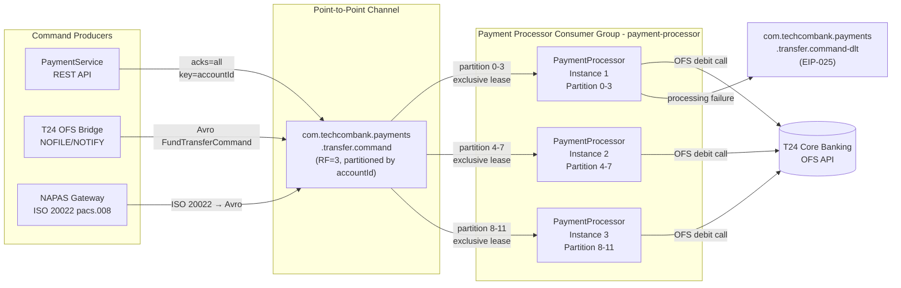

# Point-to-Point Channel

Status: Draft | Last Reviewed: 2026-05-09 | Owner: @tech-lead-backend
Catalog ID: EIP-002 | Radii
Tier Applicability: T0, T1

## Problem Statement

- A payment fund-transfer command must be processed by exactly one Payment Processor. If multiple consumers receive the same debit instruction, double-spend occurs — a catastrophic data-integrity failure in a regulated banking environment.
- NAPAS real-time credit transfer debit instructions carry a unique end-to-end transaction ID (`EndToEndId`) under ISO 20022. Delivering the same instruction to more than one processor violates the NAPAS scheme rules and triggers reconciliation failures with the NAPAS settlement system.
- T24 OFS debit-instruction events are stateful: the core banking system has already reserved the funds. Duplicate processing causes an over-debit that cannot be rolled back without manual intervention and SBV reporting.
- Without strict single-consumer delivery semantics, competing consumers that each receive the same message will contend on the same database record, triggering optimistic-lock exceptions or, worse, race conditions that corrupt the account balance ledger.
- Standard Publish-Subscribe fan-out (EIP-003) is inappropriate for commands — commands have one intended target and represent an imperative action, whereas events represent a fact that may interest many parties.
- Horizontal scaling of the Payment Processor must not break exclusivity; adding more processor instances must only increase throughput, not create duplicate delivery.

## Solution

A Point-to-Point Channel guarantees that each message published to the channel is delivered to exactly one consumer instance, even when multiple instances of the same consumer service are running. In Techcombank's stack, this is realised with a Kafka topic where all processor instances share the same `group.id` — Kafka's partition assignment mechanism ensures each partition is owned by exactly one group member at a time.



## Implementation Guidelines

1. **Use a shared `group.id` across all consumer instances.** Every instance of `PaymentProcessorService` must declare the same `groupId = "payment-processor"` in the `@KafkaListener` annotation. Kafka's group coordinator ensures each partition is assigned to at most one member at any time — this is the exclusive-consumer contract.

   ```java
   @Component
   @RequiredArgsConstructor
   @Slf4j
   public class FundTransferCommandListener {

       private final PaymentProcessingService paymentService;
       private final MeterRegistry metrics;

       @KafkaListener(
           topics = "com.techcombank.payments.transfer.command",
           groupId = "payment-processor",
           containerFactory = "manualAckContainerFactory",
           concurrency = "4"   // matches partition count per instance
       )
       public void onFundTransferCommand(
               @Payload FundTransferCommand command,
               @Header(KafkaHeaders.RECEIVED_KEY) String accountId,
               @Header(KafkaHeaders.RECEIVED_PARTITION) int partition,
               @Header(KafkaHeaders.OFFSET) long offset,
               Acknowledgment ack) {

           MDC.put("correlationId", command.getEndToEndId());
           MDC.put("accountId", maskAccount(accountId));

           log.info("P2P consume: topic=transfer.command partition={} offset={} "
               + "endToEndId={} amount={} currency={}",
               partition, offset,
               command.getEndToEndId(),
               command.getAmount(),
               command.getCurrency());

           paymentService.processTransfer(command);
           ack.acknowledge();

           metrics.counter("p2p.command.processed",
               "topic", "payments.transfer.command",
               "currency", command.getCurrency()).increment();
       }

       private String maskAccount(String accountId) {
           if (accountId == null || accountId.length() < 4) return "****";
           return "****" + accountId.substring(accountId.length() - 4);
       }
   }
   ```

2. **Partition by account ID for ordering and exclusivity.** Each fund-transfer command is keyed by `accountId`. Commands for the same account always land in the same partition, guaranteeing ordered processing per account — critical for sequential debit/credit operations on the same balance. Use `StringSerializer` as the key serialiser; Kafka's default murmur2 hash distributes keys uniformly across partitions.

   ```java
   @Service
   @RequiredArgsConstructor
   public class PaymentCommandPublisher {

       private final KafkaTemplate<String, FundTransferCommand> kafkaTemplate;
       private static final String TOPIC = "com.techcombank.payments.transfer.command";

       public void dispatch(FundTransferCommand command) {
           String partitionKey = command.getDebitAccountId();  // ensures per-account ordering
           var record = new ProducerRecord<>(TOPIC, partitionKey, command);
           record.headers().add("X-Correlation-ID",
               command.getEndToEndId().getBytes(StandardCharsets.UTF_8));
           record.headers().add("X-Source-System",
               command.getSourceSystem().getBytes(StandardCharsets.UTF_8));

           kafkaTemplate.send(record)
               .whenComplete((result, ex) -> {
                   if (ex != null) {
                       log.error("Failed to dispatch transfer command endToEndId={} error={}",
                           command.getEndToEndId(), ex.getMessage(), ex);
                       throw new PaymentDispatchException("Kafka send failure", ex);
                   }
                   log.info("Dispatched transfer command partition={} offset={} endToEndId={}",
                       result.getRecordMetadata().partition(),
                       result.getRecordMetadata().offset(),
                       command.getEndToEndId());
               });
       }
   }
   ```

3. **Implement idempotency at the consumer.** A consumer may receive the same message twice — after a rebalance, a pod restart before offset commit, or a broker failover. The Payment Processor must deduplicate on `endToEndId` using a distributed idempotency store (Redis with a 48-hour TTL) before invoking the T24 OFS API. See [EIP-024 Idempotent Receiver](idempotent-receiver.md).

   ```java
   @Service
   @RequiredArgsConstructor
   public class PaymentProcessingService {

       private final T24OfsClient ofsClient;
       private final RedisTemplate<String, String> redis;

       private static final String IDEMPOTENCY_PREFIX = "p2p:processed:";
       private static final Duration IDEMPOTENCY_TTL = Duration.ofHours(48);

       public void processTransfer(FundTransferCommand command) {
           String idempotencyKey = IDEMPOTENCY_PREFIX + command.getEndToEndId();

           Boolean isNew = redis.opsForValue()
               .setIfAbsent(idempotencyKey, "1", IDEMPOTENCY_TTL);

           if (Boolean.FALSE.equals(isNew)) {
               log.warn("Duplicate transfer command suppressed endToEndId={}",
                   command.getEndToEndId());
               return;
           }

           try {
               ofsClient.postDebitInstruction(command);
           } catch (Exception ex) {
               redis.delete(idempotencyKey);  // allow retry on failure
               throw ex;
           }
       }
   }
   ```

4. **Configure the consumer factory for manual acknowledgement and appropriate session timeout.** For T0 payment channels, the session timeout must be short enough to detect dead consumers quickly but long enough to tolerate GC pauses. Use `session.timeout.ms=30000` and `heartbeat.interval.ms=10000`. Max poll interval must be set generously to account for synchronous T24 OFS call latency.

   ```java
   @Configuration
   public class KafkaConsumerConfig {

       @Bean
       public ConsumerFactory<String, FundTransferCommand> paymentConsumerFactory(
               KafkaProperties props) {
           Map<String, Object> config = props.buildConsumerProperties();
           config.put(ConsumerConfig.GROUP_ID_CONFIG, "payment-processor");
           config.put(ConsumerConfig.ENABLE_AUTO_COMMIT_CONFIG, false);
           config.put(ConsumerConfig.SESSION_TIMEOUT_MS_CONFIG, 30_000);
           config.put(ConsumerConfig.HEARTBEAT_INTERVAL_MS_CONFIG, 10_000);
           config.put(ConsumerConfig.MAX_POLL_INTERVAL_MS_CONFIG, 300_000);
           config.put(ConsumerConfig.AUTO_OFFSET_RESET_CONFIG, "earliest");
           config.put(ConsumerConfig.VALUE_DESERIALIZER_CLASS_CONFIG,
               KafkaAvroDeserializer.class);
           return new DefaultKafkaConsumerFactory<>(config);
       }

       @Bean
       public ConcurrentKafkaListenerContainerFactory<String, FundTransferCommand>
               manualAckContainerFactory(
               ConsumerFactory<String, FundTransferCommand> cf) {
           var factory = new ConcurrentKafkaListenerContainerFactory<String, FundTransferCommand>();
           factory.setConsumerFactory(cf);
           factory.getContainerProperties()
               .setAckMode(ContainerProperties.AckMode.MANUAL_IMMEDIATE);
           factory.setCommonErrorHandler(new DefaultErrorHandler(
               new DeadLetterPublishingRecoverer(kafkaTemplate()),
               new FixedBackOff(1000L, 3)
           ));
           return factory;
       }
   }
   ```

5. **Monitor partition assignment and rebalance events.** Rebalances temporarily halt consumption. Instrument `ConsumerRebalanceListener` to emit metrics and log rebalance events. Alert on rebalances that exceed 10 seconds — they indicate unhealthy consumer instances or oversized `max.poll.records`.

   ```java
   @Component
   public class PaymentConsumerRebalanceListener implements ConsumerRebalanceListener {

       private final MeterRegistry metrics;

       @Override
       public void onPartitionsRevoked(Collection<TopicPartition> partitions) {
           log.warn("Partitions revoked count={} partitions={}",
               partitions.size(), partitions);
           metrics.counter("p2p.rebalance.revoked",
               "topic", "payments.transfer.command").increment();
       }

       @Override
       public void onPartitionsAssigned(Collection<TopicPartition> partitions) {
           log.info("Partitions assigned count={} partitions={}",
               partitions.size(), partitions);
           metrics.gauge("p2p.partitions.assigned",
               Tags.of("topic", "payments.transfer.command"),
               partitions.size());
       }
   }
   ```

6. **Handle NAPAS pacs.008 inbound messages via a dedicated ISO 20022 translator.** The NAPAS Gateway receives ISO 20022 `pacs.008` credit transfer messages, translates them to the internal `FundTransferCommand` Avro schema, and publishes to the point-to-point channel. The translator validates mandatory ISO 20022 fields (`EndToEndId`, `IntrBkSttlmAmt`, `CdtrAcct`) before publishing; invalid messages are quarantined in a dedicated error topic with the raw payload preserved for investigation.

## When to Use

- A message represents a **command** with a single intended executor (debit instruction, account freeze command, payment reversal).
- Exactly-once processing semantics are required — duplicate execution causes financial harm or violates regulatory obligations.
- Multiple instances of the same service must compete for work without duplicating it (horizontal scaling via consumer group).
- Ordered processing per entity (per-account transaction sequencing) is required alongside exclusive delivery.
- Inter-service communication where the producer knows and intends a specific type of processor, not a broadcast.

## When NOT to Use

- The message represents an **event** — a fact that has occurred and is of interest to multiple independent parties. Use [EIP-003 Publish-Subscribe Channel](publish-subscribe-channel.md) instead.
- Multiple different services need to react to the same message (fan-out). Point-to-Point delivers to only one consumer group instance.
- Low-latency synchronous request-reply patterns where a response is needed inline — use gRPC or REST with circuit breakers for those cases.
- Broadcasting system-wide configuration or state updates to all service instances — use EIP-003.

## Variants and Trade-offs

| Variant | When | Trade-off |
|---|---|---|
| Single-partition, single-consumer | Strict global ordering required (EOD batch step sequencing) | Zero parallelism; single point of failure if consumer dies |
| Multi-partition, shared group (standard) | High-throughput command routing with per-key ordering | Rebalance pauses; partition count caps max parallelism |
| Competing consumers with external locking | Legacy systems without Kafka; database-backed queue | Lock contention degrades throughput; polling adds latency |
| Priority queue via separate topics | High-value vs. standard payment commands need differentiated SLA | Operational complexity of managing multiple topics and consumer thread pools |

## NFR Acceptance Criteria

```yaml
nfr:
  catalog_id: EIP-002
  pattern: Point-to-Point Channel

  acceptance_criteria:
    - id: P2P-1
      name: Exclusive Delivery
      description: >
        Each fund-transfer command is delivered to exactly one PaymentProcessor instance.
        Verified by publishing 10,000 commands across 3 consumer instances under load;
        zero duplicates processed as confirmed by idempotency-store hit-rate metric = 0.
      tier: T0

    - id: P2P-2
      name: Command Processing Latency
      description: >
        End-to-end latency from NAPAS receipt to T24 OFS debit confirmation must be
        p95 <= 800ms, p99 <= 1500ms under 1,000 TPS sustained load.
      tier: T0

    - id: P2P-3
      name: Consumer Lag Bound
      description: >
        payment-processor consumer group lag must not exceed 5,000 messages for more
        than 60 seconds. Alert threshold: 5,000 messages; KEDA autoscale trigger: 2,000.
      tier: T0

    - id: P2P-4
      name: Zero Message Loss on Consumer Restart
      description: >
        When a PaymentProcessor pod is killed mid-processing, the in-flight message
        must be redelivered and processed exactly once (idempotency guard). Verified
        via Chaos Engineering test: pod kill during 500 TPS sustained load, zero
        transactions lost or duplicated.
      tier: T0

    - id: P2P-5
      name: Rebalance Recovery Time
      description: >
        Consumer group rebalance (pod add/remove) must complete within 15 seconds.
        Static membership (group.instance.id) should be configured to reduce rebalance
        frequency in steady state.
      tier: T1
```

## Compliance Mapping

| Layer | Reference | Section/Control | How this pattern satisfies |
|---|---|---|---|
| Ring 0 (global) | Enterprise Integration Patterns (Hohpe/Woolf) | Chapter 3 — Point-to-Point Channel | Canonical pattern definition; Kafka consumer group implements the single-receiver guarantee described by Hohpe/Woolf |
| Ring 0 (global) | NIST SP 800-53 | SI-10 Information Input Validation; AC-4 Information Flow Enforcement | Avro schema validation on produce; Kafka ACLs enforce which service accounts may produce to the payment command topic |
| Ring 1 (international) | BCBS 239 §6 Accuracy | Risk data must flow without gaps or duplication | `acks=all` + idempotent producer eliminates broker-level duplicates; consumer-side idempotency key eliminates redelivery duplicates |
| Ring 1 (international) | ISO 20022 pacs.008 | EndToEndId uniqueness; payment instruction integrity | `EndToEndId` used as idempotency key; ISO 20022 mandatory fields validated before topic admission |
| Ring 1 (international) | NAPAS Real-Time Payment Scheme Rules | Single-processing obligation for credit transfer debit | Consumer group exclusivity satisfies NAPAS requirement that each debit instruction is processed by one and only one participant system |
| Ring 2 (Vietnam) | SBV Circular 09/2020 §IV.2 ⚠️ (working summary — pending Legal review) | Operational continuity; transaction processing integrity | 30-day T0 retention + consumer group offset persistence enables replay during outage; manual offset commit prevents data loss on consumer failure |

## Cost / FinOps Notes

- **Partition sizing drives max throughput ceiling.** 12 partitions on the T0 transfer command topic supports up to 12 concurrent `PaymentProcessor` pods. Over-provisioning partitions is cheap (storage is per-message, not per-partition); under-provisioning caps horizontal scale. Review peak TPS quarterly and increase partition count proactively — Kafka partition count increases require a rolling restart-free reassignment but do require rebalancing.
- **Consumer group offset storage** is negligible — Kafka stores offsets in the `__consumer_offsets` internal topic at less than 1KB per consumer group per partition. 12 partitions × 1 consumer group = 12KB of offset metadata.
- **Idempotency store (Redis) cost** — A 48-hour TTL idempotency key per transaction at 100 bytes per key, 500K transactions/day = 50MB active key space per day. A Redis cache node with 2GB RAM handles this comfortably. Use Redis Cluster for HA; avoid ElastiCache Multi-AZ cost for a T1 idempotency store; T0 requires Multi-AZ.
- **Dead Letter Topic storage** — DLT messages are typically < 0.1% of volume but must be retained for manual investigation (7-day retention recommended). At 500K transactions/day × 0.001 × 2KB × 7 days × 3 replicas = approximately 21MB — trivial.
- **KEDA autoscaling cost** — Scaling `PaymentProcessor` from 3 to 12 pods during peak hours (08:30–17:00 VNT) adds approximately 9 pod-hours/day of compute. Budget as a variable compute cost that scales with transaction volume, not a fixed infrastructure cost.

## Threat Model Summary

STRIDE: Spoofing, Tampering, Repudiation, Denial of Service addressed; Elevation of Privilege partially addressed.

- **Fraudulent command injection** — An attacker produces a forged `FundTransferCommand` to the payment channel with a manipulated amount or account. Mitigation: Kafka ACLs restrict produce rights to the `payment-service` service account only; mTLS client certificate validates service identity; Avro schema validation rejects structurally malformed commands.
- **Replay of expired payment commands** — An attacker with broker read access replays a historical debit instruction. Mitigation: Redis idempotency store with 48-hour TTL rejects replayed `EndToEndId` values; ISO 20022 `CreationDateTime` validated to be within ±5 minutes of server time before idempotency check; Kafka ACLs restrict consumer group read access to the `payment-processor` service account.
- **Partition starvation (DoS)** — A rogue producer floods specific partition keys, overwhelming partitions assigned to legitimate processors. Mitigation: Kafka broker-level quota configuration (`producer_byte_rate` per service account) limits maximum throughput per producer; KEDA scales consumers if lag builds regardless of cause; rate limiting at the API Gateway layer upstream.
- **Residual — Insider threat on broker** — A privileged Kafka admin with broker access can read payment command payloads. Mitigate with field-level encryption for PII (account numbers) within the Avro payload; this is a defence-in-depth measure beyond ACL enforcement.
- **Residual — Consumer group hijacking** — A misconfigured service uses the `payment-processor` group ID, stealing partition assignments. Mitigate with Kafka ACLs restricting `group:payment-processor` membership to the payment-processor service account; alert on unexpected group member join events.

## Operational Runbook (stub)

1. **Alert: `P2P_ConsumerLag_High`** — Consumer group `payment-processor` lag exceeds 5,000 messages. Open Grafana `point-to-point-overview` dashboard. Identify the lagging partition(s). Check pod health: `kubectl get pods -l app=payment-processor`. If pods are healthy, check T24 OFS latency — a slow OFS call will back-pressure the consumer. Scale up if lag trend is increasing: `kubectl scale deployment payment-processor --replicas=<n>` (max = partition count = 12).

2. **Alert: `P2P_ProcessingError_Rate_High`** — Error rate on `payments.transfer.command` exceeds 1% in 5 minutes. Check DLT topic `payments.transfer.command-dlt` for message accumulation. Inspect consumer pod logs for exception type. If T24 OFS is returning errors, check the T24 health dashboard and engage the Core Banking team on-call.

3. **Alert: `P2P_RebalanceFrequency_High`** — More than 3 rebalances in 10 minutes. Check for crashing pods (`kubectl get events`). Verify `max.poll.interval.ms` is not being exceeded — a T24 OFS call that takes longer than `max.poll.interval.ms` will cause the consumer to be evicted from the group and trigger a rebalance. Increase `max.poll.interval.ms` if T24 OFS latency is legitimately high.

4. **Duplicate processing investigation** — If a duplicate transaction is suspected, query the Redis idempotency store: `redis-cli GET "p2p:processed:<endToEndId>"`. Check the T24 transaction log for the `EndToEndId`. If the Redis key is absent but T24 shows two postings, escalate to the Core Banking team — this indicates a failure of the idempotency guard that requires manual reversal.

5. **NAPAS pacs.008 translation failure** — If the NAPAS Gateway fails to translate an inbound message, the raw pacs.008 payload is written to `com.techcombank.napas.translation.error`. Inspect this topic using the internal Kafka UI. Forward the raw message to the NAPAS integration team for investigation. Do not attempt manual re-injection without validation.

6. **Consumer group offset reset (break-glass)** — If offsets must be reset to replay transactions (e.g., T24 outage recovery), follow the DR playbook: stop all `payment-processor` pods, reset offsets to the desired timestamp using `kafka-consumer-groups.sh --reset-offsets --to-datetime`, restart pods. Notify the Risk team before replay — re-processing transactions has compliance implications.

7. **Partition count increase** — If sustained throughput exceeds 80% of current partition capacity, file a Channel Design Record update. Increase partition count via the IaC pipeline (not console). Monitor reassignment progress: `kafka-reassign-partitions.sh --verify`. Do not perform this during NAPAS settlement windows (08:30–11:00, 13:00–16:00 VNT).

## Test Strategy (stub)

- **Unit** — Test `FundTransferCommandListener` with a mock `PaymentProcessingService`: verify `ack.acknowledge()` is called on success and not called on exception; verify MDC fields (`correlationId`, `accountId`) are set correctly; verify duplicate `EndToEndId` triggers the idempotency guard and `ofsClient` is not called a second time.
- **Integration** — Use Testcontainers (Kafka + Schema Registry + Redis) to publish 3 identical `FundTransferCommand` records with the same `endToEndId`; verify `ofsClient.postDebitInstruction` is called exactly once; verify offset is committed after successful processing; verify the DLT receives the message after 3 retries on `ofsClient` failure.
- **Chaos** — Kill a `PaymentProcessor` pod while 500 commands/second are in-flight; verify zero message loss (compare published count to T24 OFS confirmation count); verify no duplicate postings in T24; verify rebalance completes within 15 seconds and lag returns to zero within 2 minutes.

## Related Patterns

- [EIP-001 Message Channel](message-channel.md) — parent pattern; Point-to-Point is a specialisation
- [EIP-003 Publish-Subscribe Channel](publish-subscribe-channel.md) — the complementary fan-out pattern for events
- [EIP-022 Durable Subscriber](durable-subscriber.md) — ensures the single consumer never misses messages across restarts
- [EIP-024 Idempotent Receiver](idempotent-receiver.md) — required companion for safe exactly-once processing semantics
- [EIP-025 Dead Letter Channel](dead-letter-channel.md) — handles commands that fail all retry attempts

## References

- Hohpe, G. & Woolf, B. — Enterprise Integration Patterns (Addison-Wesley), Chapter 3: Point-to-Point Channel (pp. 103–106)
- Apache Kafka documentation — Consumer Groups and Partition Assignment
- Spring Kafka documentation — `@KafkaListener`, `ConcurrentKafkaListenerContainerFactory`, `ContainerProperties.AckMode`
- NAPAS Real-Time Payment Scheme Technical Specifications (internal, restricted)
- ISO 20022 pacs.008 Credit Transfer Initiation message definition
- Related catalog IDs: [EIP-001](message-channel.md), [EIP-003](publish-subscribe-channel.md), [EIP-022](durable-subscriber.md), [EIP-024](idempotent-receiver.md), [EIP-025](dead-letter-channel.md)

---
**Key Takeaway**: The Point-to-Point Channel guarantees that every fund-transfer command is processed by exactly one PaymentProcessor instance — enforced through Kafka consumer group exclusivity, per-account partition keying, and a Redis idempotency guard — making it the only safe pattern for payment commands in Techcombank's regulated environment.
