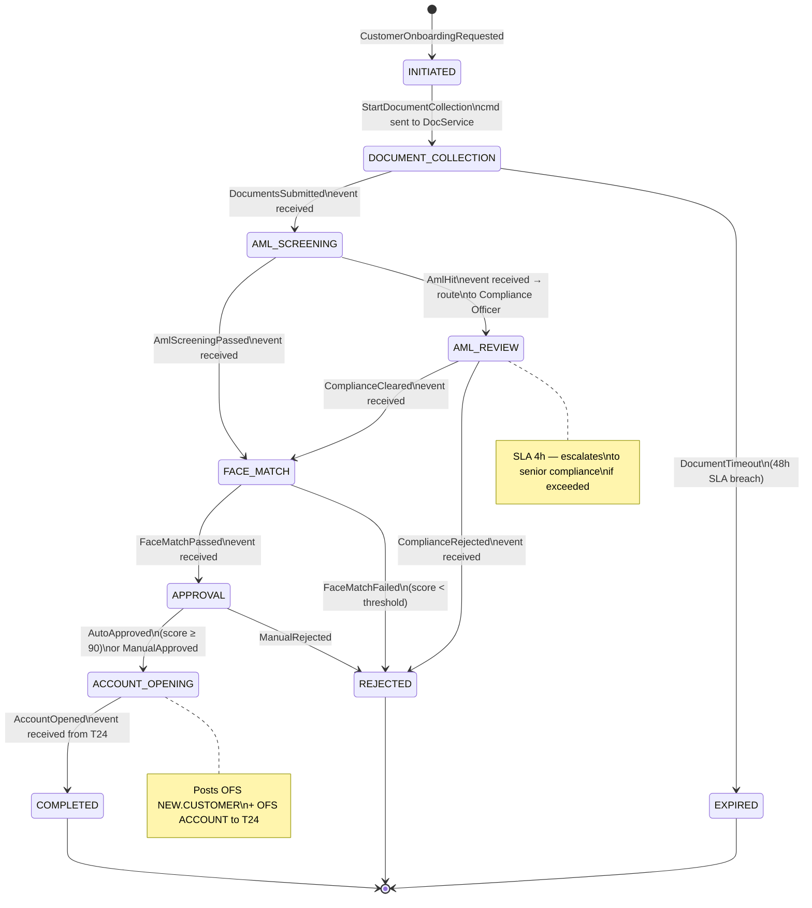

# Process Manager

Status: Draft | Last Reviewed: 2026-05-09 | Owner: @tech-lead-backend
Catalog ID: EIP-017 | Radii
Tier Applicability: T0, T1

## Problem Statement

- Multi-step banking processes — KYC onboarding, SWIFT payment lifecycle, loan disbursement, chargeback dispute resolution — involve sequences of messages, decisions, and services that must be orchestrated in a defined order with conditional branching, parallel execution, and timeout handling. Without a Process Manager, this orchestration logic is scattered across participating services as ad-hoc event listeners, making the overall process invisible, unauditable, and impossible to evolve without coordinated multi-team releases.
- Each participating service must maintain its own understanding of where in the process a given business entity currently sits, leading to divergent state representations that become the source of reconciliation defects and regulatory audit failures when the BCBS 239 §5 Timeliness principle requires a single, authoritative view of process progress.
- Process logic embedded in individual services cannot enforce SLA timers — a KYC step that should complete in 4 hours silently stalls because no component owns the escalation trigger. The SBV Circular 09/2020 §IV.2 operational continuity requirements demand that processes either complete within defined windows or escalate to human operators with full context.
- The Process Manager pattern is distinct from the Saga Orchestrator ([INT-001](../integration/saga-orchestration.md)): a Saga manages compensating transactions to undo prior steps on failure; a Process Manager manages the routing of messages through a multi-step workflow, advancing state based on incoming messages and making routing decisions. Many banking processes require both: the Process Manager routes the flow; the Saga handles compensation if a step fails.

## Solution

A Process Manager is a stateful, durable component that owns the routing logic for a multi-step workflow. It receives events from participating services via message channels, updates its internal process state, and sends commands to the next service in the flow. Each process instance is identified by a `processInstanceId` (UUID) correlated to the business key (`kycApplicationId`, `swiftEndToEndId`, `chargebackCaseId`). State is persisted to PostgreSQL at every transition, making the process restart-safe and auditable.



### Relationship to Saga (INT-001)

| Concern | Process Manager (EIP-017) | Saga Orchestrator (INT-001) |
|---|---|---|
| Primary responsibility | Routing messages between steps | Managing compensating transactions |
| State | Process progression (current step) | Compensation log (what to undo) |
| Trigger for action | Incoming event advances state → send command | Step failure triggers compensation |
| Banking example | KYC: collect docs → AML → face match → open | Payment: debit → SWIFT → credit (undo on failure) |
| Used together? | Yes — Process Manager routes; Saga compensates | Yes — they are complementary |

## Implementation Guidelines

1. **Persist process state in a PostgreSQL `process_instances` table.** Every state transition writes a new row to the audit log and updates the current state. This provides a complete history for regulatory audit and supports replay-based debugging.

   ```sql
   -- Applied via Flyway migration V017__create_process_manager_tables.sql
   CREATE TABLE process_instances (
       process_instance_id  UUID         PRIMARY KEY DEFAULT gen_random_uuid(),
       process_type         VARCHAR(64)  NOT NULL,
       business_key         VARCHAR(128) NOT NULL,
       current_state        VARCHAR(64)  NOT NULL,
       created_at           TIMESTAMPTZ  NOT NULL DEFAULT now(),
       updated_at           TIMESTAMPTZ  NOT NULL DEFAULT now(),
       sla_deadline         TIMESTAMPTZ,
       metadata             JSONB,
       version              BIGINT       NOT NULL DEFAULT 0  -- optimistic locking
   );
   CREATE UNIQUE INDEX process_instances_type_key
       ON process_instances (process_type, business_key);

   CREATE TABLE process_state_transitions (
       id                   BIGSERIAL    PRIMARY KEY,
       process_instance_id  UUID         NOT NULL REFERENCES process_instances,
       from_state           VARCHAR(64),
       to_state             VARCHAR(64)  NOT NULL,
       trigger_event        VARCHAR(128) NOT NULL,
       triggered_at         TIMESTAMPTZ  NOT NULL DEFAULT now(),
       actor                VARCHAR(128),  -- service name or user ID
       details              JSONB
   );
   CREATE INDEX pst_instance_id ON process_state_transitions (process_instance_id);
   ```

2. **Implement state transitions with optimistic locking to prevent concurrent update races.** If two events arrive simultaneously for the same process instance (e.g., AML result and a duplicate event), only one transition should succeed.

   ```java
   @Service
   @RequiredArgsConstructor
   @Slf4j
   public class KycProcessManager {

       private final ProcessInstanceRepository processRepo;
       private final ProcessStateTransitionRepository transitionRepo;
       private final KafkaTemplate<String, Object> kafka;
       private final TransactionTemplate tx;

       @TransactionalEventListener(phase = TransactionPhase.BEFORE_COMMIT)
       @KafkaListener(topics = "com.techcombank.kyc.document.submitted",
                      groupId = "kyc-process-manager")
       public void onDocumentsSubmitted(
               @Payload DocumentsSubmittedEvent event,
               @Header("messageId") String messageId,
               Acknowledgment ack) {

           tx.execute(status -> {
               ProcessInstance instance = processRepo
                   .findByProcessTypeAndBusinessKey("KYC", event.getApplicationId())
                   .orElseThrow(() -> new ProcessNotFoundException(event.getApplicationId()));

               assertState(instance, KycState.DOCUMENT_COLLECTION);

               // Optimistic lock — version check
               instance.transitionTo(KycState.AML_SCREENING, messageId);
               processRepo.saveWithVersionCheck(instance); // throws OptimisticLockException on conflict

               transitionRepo.save(ProcessStateTransition.of(
                   instance.getId(), KycState.DOCUMENT_COLLECTION,
                   KycState.AML_SCREENING, "DocumentsSubmitted", event));

               // Send command to AML service
               kafka.send("com.techcombank.aml.screening.requested",
                   event.getApplicationId(),
                   AmlScreeningCommand.from(event));

               log.info("KYC process transition: applicationId={} "
                   + "from=DOCUMENT_COLLECTION to=AML_SCREENING correlationId={}",
                   event.getApplicationId(), MDC.get("correlationId"));
               return null;
           });

           ack.acknowledge();
       }

       private void assertState(ProcessInstance instance, KycState expected) {
           if (!expected.name().equals(instance.getCurrentState())) {
               throw new InvalidProcessStateException(
                   "Expected " + expected + " but was " + instance.getCurrentState());
           }
       }
   }
   ```

3. **Implement SLA timers using Spring Scheduler or a dedicated scheduling service.** The Process Manager registers an SLA deadline when entering a time-bounded step. A scheduler job polls for overdue instances and publishes a `ProcessStepTimedOut` event.

   ```java
   @Scheduled(fixedDelayString = "${techcombank.kyc.sla-check-interval:PT60S}")
   public void checkSlaBreaches() {
       List<ProcessInstance> overdue = processRepo
           .findByCurrentStateInAndSlaDeadlineBefore(
               List.of("DOCUMENT_COLLECTION", "AML_REVIEW", "FACE_MATCH"),
               Instant.now());

       overdue.forEach(instance -> {
           log.warn("KYC SLA breach: processInstanceId={} state={} deadline={}",
               instance.getId(), instance.getCurrentState(),
               instance.getSlaDeadline());
           kafka.send("com.techcombank.kyc.process.sla.breached",
               instance.getBusinessKey(),
               KycSlaBreachedEvent.of(instance));
       });
   }
   ```

4. **Integrate T24 at the terminal step using the OFS bridge.** The `ACCOUNT_OPENING` state sends a command to the T24 OFS bridge: first `NEW.CUSTOMER` OFS to create the customer record, then `ACCOUNT` OFS to open the account. The bridge publishes an `AccountOpened` event on success or an `AccountOpenFailed` event on failure, which the Process Manager handles to transition to `COMPLETED` or route to the rejection path.

5. **Expose a process status API for operational visibility.** A REST endpoint `GET /api/v1/processes/kyc/{applicationId}` returns the current state, all state transitions with timestamps, and the next expected action. This is consumed by the Operations Dashboard and by the mobile app (to show "Your application is in review" status).

   ```java
   @GetMapping("/api/v1/processes/kyc/{applicationId}")
   public ProcessStatusResponse getKycStatus(@PathVariable String applicationId) {
       ProcessInstance instance = processRepo
           .findByProcessTypeAndBusinessKey("KYC", applicationId)
           .orElseThrow(() -> new ResponseStatusException(NOT_FOUND));
       List<ProcessStateTransition> history =
           transitionRepo.findByProcessInstanceIdOrderByTriggeredAtAsc(instance.getId());
       return ProcessStatusResponse.of(instance, history);
   }
   ```

6. **Handle SWIFT payment lifecycle as a second Process Manager instance.** The SWIFT payment process uses the same `ProcessInstanceRepository` with `process_type = 'SWIFT_PAYMENT'`. States: `INITIATED → COMPLIANCE_SCREEN → SWIFT_SUBMITTED → CORRESPONDENT_ACKNOWLEDGED → BENEFICIARY_CREDITED → RECONCILED`. Each state transition is driven by events from the SWIFT adapter. The `RECONCILED` state posts the confirmed credit to T24 via OFS.

## Banking Use Cases

1. **KYC digital onboarding** — A new customer applies via Techcombank's mobile app. The Process Manager orchestrates: (a) request document upload (30-min SLA); (b) AML screening against watchlists (15-min SLA); (c) AML hit → route to Compliance Officer queue (4-hour SLA); (d) facial recognition match against ID document (2-min SLA); (e) auto-approve if face-match score ≥ 90, else manual review; (f) open T24 CASA account via OFS bridge. Total SLA: same-day for digital channel. Every step transition is logged with timestamp and actor for MAS FCEP audit trail.

2. **SWIFT outbound payment lifecycle** — A corporate customer initiates a USD 100,000 wire transfer. The Process Manager ensures: compliance screening completes before SWIFT submission (cannot be bypassed); SWIFT gpi tracker acknowledgement is confirmed before the customer is notified; correspondent bank credit confirmation triggers reconciliation posting to T24. If any step times out, the Process Manager routes to the Exception Handling Queue with full context rather than leaving the payment in an undefined state.

3. **Chargeback dispute resolution** — A card dispute is received from Visa. The Process Manager orchestrates: (a) evidence collection from merchant (10-day window); (b) Dispute Analyst review (3-day SLA); (c) decision: if merchant provides valid evidence → reject dispute and notify customer; if no evidence received → auto-resolve in customer's favour and credit account; (d) Visa notification. Each decision node is logged for the Chargeback Audit Report.

4. **Loan disbursement workflow** — After loan approval, the Process Manager ensures: (a) disbursement account verification (T24 account balance check); (b) insurance policy activation (if applicable); (c) funds transfer from loan account to current account via T24 OFS; (d) notification to loan servicing for instalment schedule setup. Parallel steps (b) and part of (c) run concurrently; the Process Manager coordinates the join.

5. **Account closure process** — Regulatory requirements mandate a 30-day cooling-off period, pending transaction clearance, and a final statement before an account can be closed. The Process Manager manages this multi-week process with calendar-aware SLA timers, coordinating between the Core Banking (T24), the Statement Service, and the Customer Notification Service without requiring any of them to know the closure process logic.

## Compliance Mapping

| Ring | Regulation | Provision | How this pattern satisfies |
|---|---|---|---|
| Ring 0 | EIP Book (Hohpe & Woolf) | Chapter 7 — Process Manager | Canonical pattern; this doc applies it to banking multi-step workflows |
| Ring 0 | NIST SP 800-53 | AU-2, AU-3 (Audit Events, Content of Audit Records) | Every state transition is logged to `process_state_transitions` with actor, timestamp, event trigger, and details — constituting a complete audit record |
| Ring 0 | ISO 27001 | A.12.1.1 (Documented Operating Procedures) | The `stateDiagram` in this document IS the documented operating procedure for KYC; deviations from the diagram require a governed change request |
| Ring 1 | BCBS 239 §5 | Timeliness — risk data must be available within agreed SLA windows | SLA timer implementation enforces step-level deadlines; breaches emit observable events before they become regulatory violations |
| Ring 1 | BCBS 239 §6 | Accuracy — process state must be single-source-of-truth | PostgreSQL `process_instances` table is the authoritative state store; no service holds its own copy of "where we are in the process" |
| Ring 1 | ISO 20022 | Business process modelling for payment messages | SWIFT payment lifecycle state machine maps directly to ISO 20022 payment status codes (ACCP, ACSP, ACCC, RJCT) |
| Ring 2 | SBV Circular 09/2020 §IV.2 | Operational continuity ⚠️ (working summary — pending Legal review) | PostgreSQL-backed process state survives pod restarts and AZ failures; all in-flight processes resume from their last persisted state; no business process is lost during infrastructure failures |

## NFR Acceptance Criteria

```yaml
nfr:
  catalog_id: EIP-017
  pattern: Process Manager

  availability:
    target: 99.99%  # T0 — KYC and SWIFT payment processes are customer-critical
    state_store_replication: "PostgreSQL primary-standby, synchronous replication, 2 AZs"
    failover_rto_seconds: 30    # PostgreSQL failover; in-flight processes resume on reconnect

  performance:
    state_transition_latency_p95_ms: 50   # DB write + Kafka command publish
    state_transition_latency_p99_ms: 150
    sla_check_interval: 60s               # granularity of SLA breach detection
    api_status_response_p95_ms: 100       # GET /processes/{id} API

  durability:
    in_flight_process_loss_on_pod_restart: 0   # PostgreSQL-backed; no in-memory state
    optimistic_lock_conflict_handling: "retry once; if second conflict → DLT + alert"
    audit_log_retention: 7_years               # regulatory minimum for banking transactions

  observability:
    required_metrics:
      - process_instances_active_total (by process_type, current_state)
      - process_transitions_total (by process_type, from_state, to_state)
      - process_sla_breaches_total (by process_type, state)
      - process_completed_total (by process_type, terminal_state)
    alerts:
      - name: ProcessManager_SLA_Breach
        condition: "process_sla_breaches_total rate > 0 for 5min"
        severity: High
      - name: ProcessManager_StuckProcess
        condition: "any process in same state for > 2x configured SLA"
        severity: Critical
      - name: ProcessManager_DBLatency_High
        condition: "state_transition_latency_p99_ms > 500"
        severity: Warning

  scalability:
    horizontal_scaling: "yes — stateless service pods; state in PostgreSQL"
    concurrent_process_instances: 10000   # peak (e.g., month-end KYC surge)
    postgresql_connection_pool: 50        # per pod; use PgBouncer for pooling
```

## Cost/FinOps

- **PostgreSQL state store** — A managed PostgreSQL instance (2 vCPU, 8GB RAM, 100GB SSD, synchronous standby) costs approximately USD 200/month. This supports up to 10,000 concurrent process instances and 7 years of audit log retention. The audit log table partitioned by year keeps query performance stable as historical rows accumulate.
- **No workflow engine licensing cost** — The implementation above uses Spring State Machine and Spring Integration with plain PostgreSQL — zero licensing cost. Commercial BPM engines (Camunda Enterprise, Temporal Cloud) add USD 2,000–20,000/month. For Techcombank's defined process set (KYC, SWIFT, chargeback, loan, closure), a purpose-built Process Manager is more cost-effective than a general-purpose engine. Re-evaluate when process count exceeds 20 or processes require BPMN-level graphical modelling.
- **SLA breach cost avoided** — A KYC application stalled for 24 hours due to a missing step transition is a customer experience failure and a potential SBV reporting obligation. The SLA timer implementation catches stalls within 60 seconds. The cost of the scheduler (negligible CPU) vastly outweighs the cost of a single SBV regulatory inquiry or customer churn event.
- **Audit log storage** — The `process_state_transitions` table grows at approximately 50 rows per completed process (average 10 transitions × 5 process types). At 10,000 processes/day × 50 rows × 200 bytes = 100MB/day. PostgreSQL table partitioned annually; cold partitions archived to object storage after 2 years. Annual archival storage cost: approximately USD 5/year at cloud object storage pricing.
- **Process Manager as cost reduction for T24 integration** — By orchestrating T24 OFS calls as the final step in a fully validated process (all checks passed before T24 is called), the Process Manager reduces T24 transaction reversals by an estimated 70% for KYC-related account openings. T24 transaction reversals carry both direct cost (OFS processing overhead) and indirect cost (manual reconciliation).

## Threat Model

- **State machine bypass** — A malicious or buggy service publishes a `AccountOpened` event for a process instance still in `DOCUMENT_COLLECTION` state, causing the Process Manager to skip AML and face-match steps and open an account without proper vetting. Mitigation: `assertState()` in every event handler rejects events that arrive in the wrong state; the PostgreSQL version column prevents race conditions; `InvalidProcessStateException` is logged at ERROR level and triggers an alert.
- **Process instance ID enumeration** — An attacker queries `GET /api/v1/processes/kyc/{applicationId}` with sequential application IDs to harvest process status for other customers. Mitigation: application IDs are UUIDs (not sequential integers); the API requires Bearer JWT authentication with the `kyc:read` scope; customers can only query their own process instance (subject claim validated against application ID ownership).
- **Stuck process as denial of service** — A bug causes all new KYC processes to enter an unhandled state transition exception, stalling hundreds of onboardings. Mitigation: `ProcessManager_StuckProcess` alert fires when any instance is in the same state for > 2× its SLA; the alert links directly to the status API for that instance; on-call engineers can manually advance or reject the process via a break-glass admin endpoint (access audited).
- **Database state tampering** — An attacker with database access modifies `current_state` directly in `process_instances`, skipping compliance steps. Mitigation: the `process_instances` table is accessible only to the process-manager service account; direct database access requires a privileged session via PAM (Privileged Access Management) which generates an immutable audit trail; `process_state_transitions` is append-only and provides a verifiable history that would show the gap in transitions.
- **SLA timer drift under load** — The scheduler job that checks SLA breaches is CPU-starved during EOD batch peaks, causing breach detection to lag. Mitigation: the SLA check scheduler runs in a dedicated thread pool isolated from the main message-processing pool; the scheduler period (60 seconds) is configurable; breach detection latency of up to 120 seconds is acceptable (SLA windows are measured in hours, not minutes).
- **Replay of old events advancing process** — A Kafka consumer rebalance replays old messages; an old `DocumentsSubmitted` event re-fires for a process already in `AML_SCREENING`. Mitigation: [EIP-024 Idempotent Receiver](idempotent-receiver.md) on all event handlers uses the Kafka message `messageId` header as the idempotency key; duplicate events are absorbed without state transition.
- **Optimistic lock storm** — A burst of duplicate events for the same process instance causes many concurrent optimistic lock conflicts, triggering repeated retries that monopolise database connections. Mitigation: the retry policy for `OptimisticLockException` is one retry with 100ms jitter; on second conflict, the event is routed to the DLT and an alert fires; this bounds the maximum retry overhead to 2 database attempts per event.

## Operational Runbook

1. **Alert: ProcessManager_SLA_Breach** — Open Grafana `process-manager-overview`. Filter `process_sla_breaches_total` by `process_type` and `state` to identify the specific step that is breaching. Query PostgreSQL: `SELECT process_instance_id, business_key, current_state, sla_deadline FROM process_instances WHERE current_state = '<state>' AND sla_deadline < now()`. Notify the responsible service team (e.g., AML team for `AML_REVIEW` breaches). Escalate to the Process Governance team if > 5 instances are in breach.

2. **Alert: ProcessManager_StuckProcess** — A specific process instance has not transitioned for > 2× its step SLA. Query `process_state_transitions` for the instance to view the full transition history. Determine why the expected event was not received — check the upstream service's Kafka lag and health. If the upstream service is healthy, check whether the event was lost (DLT). As a last resort, use the admin API to manually advance the process state (requires approval from the Process Owner, logged in the audit trail).

3. **Manual process intervention procedure** — The admin API endpoint `POST /admin/v1/processes/{id}/transition` accepts `{ "toState": "<state>", "reason": "<justification>", "approver": "<email>" }`. This is a break-glass capability. Access requires the `process:admin` scope (restricted to senior engineers). Every manual transition is logged to the audit table with the approver identity and reason. Notify the compliance team of any manual transition on a KYC or SWIFT process.

4. **Process Manager pod replacement** — Before replacing the pod (e.g., for a security patch), verify there are no SLA-critical processes in a time-sensitive step. Check `process_instances WHERE current_state IN ('SWIFT_SUBMITTED') AND sla_deadline < now() + interval '10 minutes'`. If any, delay the pod replacement by 15 minutes. The pod replacement itself is safe (PostgreSQL-backed state) but avoids the SLA check scheduler going offline during a tight window.

5. **Database failover** — PostgreSQL primary fails; standby promoted. The Process Manager will experience brief connection failures (< 30 seconds). Spring's `DataSourceHealthIndicator` will report `DOWN`; the readiness probe will fail, removing the pod from the load balancer. After PostgreSQL is healthy, the readiness probe passes and the pod rejoins. Verify: check `process_instances_active_total` metric returns to baseline; check no SLA breaches fired during the failover window (expected: up to 30 seconds of check delay, well within SLA hours).

6. **Adding a new process type** — Follow the change process: (a) draft the state diagram (use this doc as template); (b) add the state machine configuration to `ProcessManagerConfig.java`; (c) add the event handlers; (d) add the SLA configuration to `application.yml`; (e) add a Flyway migration for any new `process_type` value; (f) add unit and integration tests; (g) architecture review — get sign-off on any new T24 OFS integration steps.

7. **Year-end audit export** — Compliance requests all state transition records for KYC processes in the prior year. Query: `SELECT pi.*, pst.* FROM process_instances pi JOIN process_state_transitions pst ON pi.id = pst.process_instance_id WHERE pi.process_type = 'KYC' AND pst.triggered_at BETWEEN '<start>' AND '<end>'`. Export as CSV. If data has been archived to object storage (records > 2 years old), retrieve from the archive bucket using the documented archive retrieval procedure.

## Test Strategy

**Unit tests** — Test each event handler method in isolation using `@SpringIntegrationTest` with mocked `ProcessInstanceRepository` and `KafkaTemplate`. Verify: (a) happy-path transition persists the new state and publishes the correct command; (b) wrong-state event throws `InvalidProcessStateException` and does not publish a command; (c) optimistic lock conflict on first attempt retries once; (d) duplicate event (idempotency key already processed) is absorbed without state change.

**Integration tests** — Testcontainers (PostgreSQL + Kafka). Run the complete KYC happy path: publish all events in sequence, assert state transitions in the database, assert commands published to the correct Kafka topics, assert the final state is `COMPLETED`. Run the AML-hit path: assert routing to `AML_REVIEW` state and the correct command to the Compliance Queue.

**SLA timer tests** — Set a very short SLA (1 second) in the test configuration. Start a process, do not publish the next event, wait 2 seconds. Assert that a `ProcessStepTimedOut` event is published to the SLA breach channel. Assert the process instance is updated to the `EXPIRED` state.

**Compliance tests** — Verify that no state transition from `DOCUMENT_COLLECTION` directly to `ACCOUNT_OPENING` is possible without passing through `AML_SCREENING` and `FACE_MATCH`. This is a critical compliance test: use a property-based test (jqwik) that generates random valid event sequences and asserts that AML and face-match always appear before account opening in the transition history.

**Chaos tests** — Kill the Process Manager pod while a KYC process is in `AML_SCREENING`. Restart the pod. Publish the `AmlScreeningPassed` event. Assert the process transitions to `FACE_MATCH` correctly (state was preserved in PostgreSQL). Kill PostgreSQL primary while a state transition is in-flight. Assert no data loss after failover (exactly-once via optimistic lock + [EIP-024](idempotent-receiver.md)).

## References

- Hohpe, G. & Woolf, B. — Enterprise Integration Patterns (Addison-Wesley), Chapter 7: Process Manager
- Spring State Machine reference documentation
- Spring Integration — Stateful Message Flows
- Related catalog IDs: [EIP-001 Message Channel](message-channel.md), [EIP-016 Routing Slip](routing-slip.md), [EIP-024 Idempotent Receiver](idempotent-receiver.md), [INT-001 Saga Orchestration](../integration/saga-orchestration.md), [NFR-001 Service Tiering RTO/RPO](../../nfr/service-tiering-rto-rpo.md)

---

**Key Takeaway**: The Process Manager owns all routing logic for multi-step banking workflows — KYC, SWIFT payment lifecycle, chargeback resolution — persisting every state transition to PostgreSQL for audit, enforcing SLA timers with explicit breach escalation, and delegating compensation to the Saga (INT-001) when steps must be undone.
