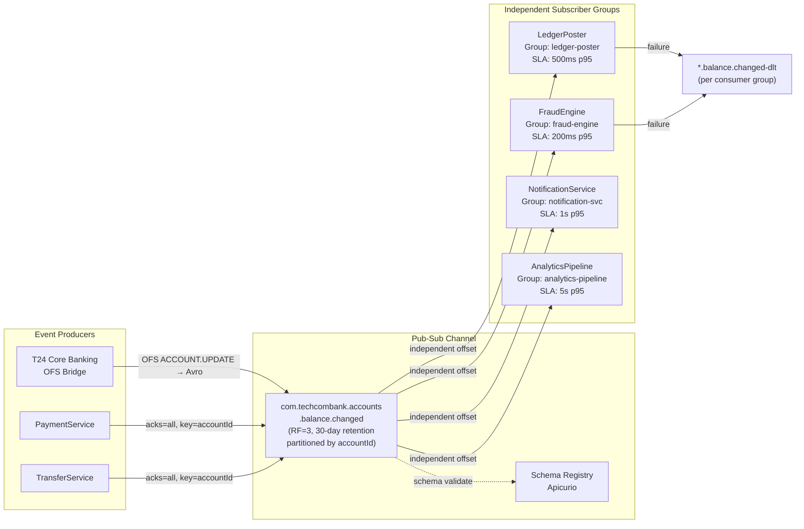

# Publish-Subscribe Channel

Status: Draft | Last Reviewed: 2026-05-09 | Owner: @tech-lead-backend
Catalog ID: EIP-003 | Radii
Tier Applicability: T0, T1, T2

## Problem Statement

- When an account balance changes — due to a debit, credit, fee collection, or reversal — at least four independent systems must react: the Ledger must post the accounting entry, the Fraud Engine must evaluate the new balance pattern, the Notification Service must push a customer alert, and the Analytics pipeline must update real-time dashboards. Coupling any of these together forces sequential processing and creates cascading failure dependencies.
- A point-to-point approach (EIP-002) cannot fan-out: it delivers each message to exactly one consumer, so serving multiple downstream systems requires either the producer to know every consumer address (tight coupling) or a broker-side router (added complexity and a new single point of failure).
- If the Ledger Poster or Fraud Engine is slow or temporarily offline, it must not delay the Notification Service's delivery of a customer alert. Each subscriber must process at its own pace independently.
- Adding a new subscriber — for example, a Machine Learning feature-store pipeline — must not require changes to the producing service or any existing subscriber. The channel must be open to new consumers without redeployment of existing participants.
- T24 Core Banking fires OFS `ACCOUNT.UPDATE` events synchronously in its batch cycle; downstream consumers with different SLAs (real-time notification vs. overnight regulatory reporting) must decouple from T24's batch cadence.
- Without durable fan-out, a downstream system that is temporarily unavailable during a high-value transaction event will miss it permanently — an unacceptable gap under BCBS 239 §6 Completeness and SBV audit requirements.

## Context

Techcombank's platform fires many domain events that multiple independent services must react to: `ACCOUNT.BALANCE.CHANGED`, `TRANSACTION.POSTED`, `KYC.CUSTOMER.VERIFIED`, and `FRAUD.ALERT.RAISED` are all candidates for fan-out. Kafka's consumer group model implements this natively: one topic, N independent consumer groups, each with its own committed offset and independent scaling. This avoids the point-to-point limitation (EIP-002) where each message goes to only one consumer, and avoids tight producer-consumer coupling where the producer must know all consumers. Retention (7–30 days) allows late-joining or recovering subscribers to replay missed events without requiring the producer to re-publish.

## Solution

A Publish-Subscribe Channel delivers each published message to all registered subscriber groups independently. In Techcombank's stack, a single Kafka topic with multiple independent consumer groups implements the pattern: each consumer group maintains its own offset, processes at its own pace, and fails or scales without affecting other groups.



## Implementation Guidelines

1. **Each subscriber must use a unique, stable `group.id`.** Group IDs must follow the convention `<service-name>` (e.g., `ledger-poster`, `fraud-engine`, `notification-svc`). Never reuse a group ID across different logical consumers — doing so silently routes messages to the wrong service and is extremely difficult to diagnose. Register group IDs in the Channel Design Record alongside the topic name.

   ```java
   @Component
   @RequiredArgsConstructor
   @Slf4j
   public class BalanceChangedFraudListener {

       private final FraudEvaluationService fraudService;
       private final MeterRegistry metrics;

       @KafkaListener(
           topics = "com.techcombank.accounts.balance.changed",
           groupId = "fraud-engine",
           containerFactory = "manualAckContainerFactory",
           concurrency = "6"
       )
       public void onBalanceChanged(
               @Payload AccountBalanceChangedEvent event,
               @Header(KafkaHeaders.RECEIVED_KEY) String accountId,
               @Header(KafkaHeaders.RECEIVED_PARTITION) int partition,
               @Header(KafkaHeaders.OFFSET) long offset,
               Acknowledgment ack) {

           MDC.put("correlationId", event.getCorrelationId());
           MDC.put("subscriberGroup", "fraud-engine");

           log.info("PSC consume: group=fraud-engine partition={} offset={} "
               + "accountId={} changeType={} correlationId={}",
               partition, offset,
               maskAccount(accountId),
               event.getChangeType(),
               event.getCorrelationId());

           fraudService.evaluateBalanceAnomaly(event);
           ack.acknowledge();

           metrics.counter("psc.event.consumed",
               "topic", "accounts.balance.changed",
               "group", "fraud-engine",
               "changeType", event.getChangeType()).increment();
       }
   }
   ```

2. **Publish balance change events with `acks=all` and partition by `accountId`.** Partitioning by `accountId` ensures ordered delivery of balance events for the same account across all subscriber groups — the Ledger sees debits and credits in the correct sequence. The producer must include `correlationId` and `sourceTransactionId` in the Kafka record headers to enable cross-service tracing.

   ```java
   @Service
   @RequiredArgsConstructor
   public class AccountBalanceEventPublisher {

       private final KafkaTemplate<String, AccountBalanceChangedEvent> kafkaTemplate;
       private static final String TOPIC = "com.techcombank.accounts.balance.changed";

       public void publish(AccountBalanceChangedEvent event) {
           var record = new ProducerRecord<>(TOPIC, event.getAccountId(), event);
           record.headers().add("X-Correlation-ID",
               event.getCorrelationId().getBytes(StandardCharsets.UTF_8));
           record.headers().add("X-Source-Transaction-ID",
               event.getSourceTransactionId().getBytes(StandardCharsets.UTF_8));
           record.headers().add("X-Event-Type",
               "AccountBalanceChanged".getBytes(StandardCharsets.UTF_8));

           kafkaTemplate.send(record)
               .whenComplete((result, ex) -> {
                   if (ex != null) {
                       log.error("Failed to publish balance event accountId={} error={}",
                           maskAccount(event.getAccountId()), ex.getMessage(), ex);
                       // Outbox pattern fallback — see INT-002
                       throw new EventPublishException("Balance event publish failure", ex);
                   }
               });
       }
   }
   ```

3. **Wire T24 OFS `ACCOUNT.UPDATE` events through the OFS Bridge with Avro translation.** The T24 OFS Bridge subscribes to T24's `ACCOUNT.UPDATE` NOFILE/NOTIFY event stream, maps each OFS record to an `AccountBalanceChangedEvent` Avro schema, and publishes to the Pub-Sub channel. The bridge applies field-level mapping (OFS `WORKING.BALANCE` → `newBalance`; OFS `DR.CR.CODE` → `changeDirection`) and validates the Avro schema before publishing. OFS events that fail mapping are quarantined to a bridge-specific DLT with the raw OFS payload preserved.

   ```java
   @Component
   @RequiredArgsConstructor
   public class T24BalanceEventBridge {

       private final AccountBalanceEventPublisher publisher;
       private final OfsEventMapper mapper;

       @Scheduled(fixedDelayString = "${techcombank.t24.poll-interval-ms:500}")
       public void pollAndBridge() {
           List<OfsAccountUpdateEvent> ofsEvents = ofsClient.pollAccountUpdates();
           for (OfsAccountUpdateEvent ofsEvent : ofsEvents) {
               try {
                   AccountBalanceChangedEvent event = mapper.fromOfs(ofsEvent);
                   publisher.publish(event);
               } catch (OfsMappingException ex) {
                   log.error("OFS bridge mapping failure ofsRef={} error={}",
                       ofsEvent.getOfsRef(), ex.getMessage());
                   bridgeDltTemplate.send("com.techcombank.t24.bridge.error",
                       ofsEvent.getOfsRef(), ofsEvent);
               }
           }
       }
   }
   ```

4. **Enforce subscriber SLA isolation using separate consumer thread pools.** Do not use a single shared `ConcurrentKafkaListenerContainerFactory` across subscribers with different SLAs. The Fraud Engine (200ms p95) and Analytics Pipeline (5s p95) must have separate thread pools and separate `maxPollRecords` settings. A slow Analytics subscriber must not starve the Fraud Engine's polling thread.

   ```java
   @Configuration
   public class PubSubConsumerConfig {

       @Bean("fraudEngineContainerFactory")
       public ConcurrentKafkaListenerContainerFactory<String, AccountBalanceChangedEvent>
               fraudEngineFactory(KafkaProperties props) {
           Map<String, Object> config = props.buildConsumerProperties();
           config.put(ConsumerConfig.MAX_POLL_RECORDS_CONFIG, 50);
           config.put(ConsumerConfig.MAX_POLL_INTERVAL_MS_CONFIG, 30_000);
           var factory = new ConcurrentKafkaListenerContainerFactory
               <String, AccountBalanceChangedEvent>();
           factory.setConsumerFactory(new DefaultKafkaConsumerFactory<>(config));
           factory.getContainerProperties()
               .setAckMode(ContainerProperties.AckMode.MANUAL_IMMEDIATE);
           return factory;
       }

       @Bean("analyticsContainerFactory")
       public ConcurrentKafkaListenerContainerFactory<String, AccountBalanceChangedEvent>
               analyticsFactory(KafkaProperties props) {
           Map<String, Object> config = props.buildConsumerProperties();
           config.put(ConsumerConfig.MAX_POLL_RECORDS_CONFIG, 500);  // batch-oriented
           config.put(ConsumerConfig.MAX_POLL_INTERVAL_MS_CONFIG, 120_000);
           var factory = new ConcurrentKafkaListenerContainerFactory
               <String, AccountBalanceChangedEvent>();
           factory.setConsumerFactory(new DefaultKafkaConsumerFactory<>(config));
           factory.getContainerProperties()
               .setAckMode(ContainerProperties.AckMode.BATCH);
           return factory;
       }
   }
   ```

5. **Implement per-subscriber Dead Letter Topics.** Each subscriber group must have its own DLT (e.g., `com.techcombank.accounts.balance.changed-ledger-poster-dlt`) so that a poison-pill message in the Ledger Poster's DLT does not interfere with the Fraud Engine's processing. Configure `DeadLetterPublishingRecoverer` to route to the group-specific DLT using a topic-naming function.

   ```java
   @Bean
   public DefaultErrorHandler ledgerPosterErrorHandler(
           KafkaTemplate<String, AccountBalanceChangedEvent> template) {
       var recoverer = new DeadLetterPublishingRecoverer(template,
           (record, ex) -> new TopicPartition(
               record.topic() + "-ledger-poster-dlt",
               record.partition()
           )
       );
       return new DefaultErrorHandler(recoverer, new FixedBackOff(2000L, 3));
   }
   ```

6. **Monitor consumer lag per group independently.** Alert thresholds differ by subscriber SLA. The Fraud Engine must alert at 1,000 messages lag; the Analytics Pipeline at 100,000 messages lag. Grafana dashboards must show per-group lag on the same panel for cross-subscriber comparison. Grafana alert IDs: `PSC_FraudEngine_Lag_High`, `PSC_LedgerPoster_Lag_High`, `PSC_Notification_Lag_High`.

## When to Use

- A single event must be processed by **multiple independent services** — balance change fan-out to Ledger, Fraud, Notification, Analytics.
- Subscribers have **different processing SLAs** and must not block each other.
- **Adding new subscribers** in the future must not require changes to the producer or existing subscribers.
- The producer publishes a fact about what has happened (an event), not an instruction to a specific recipient.
- Decoupling the T24 batch event cadence from real-time digital-channel consumers is required.
- Regulatory fan-out — the same payment event must feed both real-time fraud screening and asynchronous audit log ingestion without coupling those two concerns.

## When NOT to Use

- The message is a **command** intended for exactly one processor. Use [EIP-002 Point-to-Point Channel](point-to-point-channel.md).
- There is only one consumer and the system will never have more than one. The overhead of a Pub-Sub topic is unnecessary; a direct call or Point-to-Point channel is simpler.
- **Strict ordering across subscriber groups** is required (Kafka does not guarantee ordering across independent consumer groups consuming the same partition simultaneously — each group sees the same order, but they process concurrently).
- **Synchronous request-reply** semantics are needed. Pub-Sub is fire-and-forget from the producer's perspective.

## Variants and Trade-offs

| Variant | When | Trade-off |
|---|---|---|
| Single topic, multiple consumer groups (standard) | Most banking event fan-out scenarios | Consumer groups are operationally independent; lag monitoring required per group |
| Topic-per-subscriber (copy-on-write) | Different retention or schema requirements per subscriber | Storage multiplied by subscriber count; producers must know all subscribers |
| Filtered Pub-Sub (content-based routing at broker) | Only a subset of events is relevant to each subscriber | Reduces subscriber processing overhead; Kafka Streams filter adds latency |
| Hierarchical topics (domain.subdomain.entity.action) | Large event taxonomy with selective subscription | Requires naming governance; consumer must opt-in by topic prefix convention |

## NFR Acceptance Criteria

```yaml
nfr:
  catalog_id: EIP-003
  pattern: Publish-Subscribe Channel

  acceptance_criteria:
    - id: PSC-1
      name: Fan-out Completeness
      description: >
        Each AccountBalanceChangedEvent published to the channel must be delivered
        to all 4 registered subscriber groups (ledger-poster, fraud-engine,
        notification-svc, analytics-pipeline). Verified by comparing published
        count to per-group consumed count over a 1-hour load test window.
        Tolerance: zero missed deliveries.
      tier: T0

    - id: PSC-2
      name: Subscriber Independence
      description: >
        Taking the analytics-pipeline consumer group offline for 30 minutes must
        not increase lag or processing latency for the fraud-engine or notification-svc
        groups by more than 5%. Verified by chaos test.
      tier: T0

    - id: PSC-3
      name: Fraud Engine Latency
      description: >
        End-to-end latency from balance event publish to fraud evaluation completion
        must be p95 <= 200ms, p99 <= 500ms under 2,000 events/second sustained load.
      tier: T0

    - id: PSC-4
      name: Notification Delivery Latency
      description: >
        Customer push notification must be dispatched within 3 seconds of the
        balance change event being published, p95, under normal operating conditions.
      tier: T1

    - id: PSC-5
      name: New Subscriber Onboarding
      description: >
        Adding a new consumer group to the channel must require no changes to the
        producing service and no redeployment of existing subscribers. Verified by
        adding a test consumer group and confirming it receives all events published
        after its first poll, with no prior messages lost (earliest offset reset).
      tier: T2
```

## Compliance Mapping

| Layer | Reference | Section/Control | How this pattern satisfies |
|---|---|---|---|
| Ring 0 (global) | Enterprise Integration Patterns (Hohpe/Woolf) | Chapter 3 — Publish-Subscribe Channel | Canonical pattern; multiple independent consumer groups implement Hohpe/Woolf's subscriber model on Kafka |
| Ring 0 (global) | NIST SP 800-53 | SI-12 Information Management; AU-9 Protection of Audit Information | Each subscriber group receives a complete independent copy of the event stream; no subscriber can suppress delivery to others |
| Ring 1 (international) | BCBS 239 §6 Completeness | All relevant risk data must reach risk aggregation systems | Per-subscriber durable offset ensures Fraud Engine and Analytics receive every balance event; 30-day retention allows replay for missed events |
| Ring 1 (international) | ISO 20022 | Message identification and routing | `correlationId` and `sourceTransactionId` headers carried through fan-out enable end-to-end ISO 20022 message traceability across all subscribers |
| Ring 1 (international) | SWIFT CSP v2024 | Control 2.4A — Application hardening; segregated processing | Each subscriber group processes in an isolated consumer pod with its own service account and ACLs; cross-subscriber contamination is impossible |
| Ring 2 (Vietnam) | SBV Circular 09/2020 §IV.2 ⚠️ (working summary — pending Legal review) | Audit completeness; regulatory reporting obligations | Dedicated audit-log subscriber group with 30-day retention and separate DLT ensures SBV-required event records are never lost due to other subscriber failures |

## Cost / FinOps Notes

- **Storage multiplier is 1×, not N×.** Kafka stores each message once regardless of how many consumer groups subscribe. The cost of fan-out is the per-group offset metadata (~1KB per partition per group) and the consumer compute, not storage. At 4 subscriber groups × 12 partitions × 1KB = 48KB of additional offset metadata per fan-out topic — negligible.
- **Consumer compute scales per group SLA.** The Fraud Engine (low latency, high throughput) requires more pods than the Analytics Pipeline (high latency tolerance, batch-friendly). Budget compute independently: Fraud Engine 6 pods × 2 vCPU = 12 vCPU; Analytics Pipeline 2 pods × 4 vCPU = 8 vCPU. Autoscale each group independently via KEDA.
- **Per-subscriber DLT storage** — With 4 DLTs at negligible volume (< 0.1% error rate), DLT storage is approximately 4 × 21MB = 84MB. DLT retention of 7 days is appropriate; extend to 30 days for the audit-log subscriber DLT to support compliance investigation.
- **Schema registry lookup cost** — Each consumer group deserialises messages using the schema registry. With Apicurio in-cluster and a schema cache TTL of 60 seconds, the steady-state schema registry load is 4 groups × polling overhead, well within Apicurio's default thread pool. No additional schema registry nodes required for 4 subscriber groups.
- **MirrorMaker 2 cross-region replication** — The `accounts.balance.changed` topic is T0; replicate to DR region. Egress cost at 1M events/day × 2KB = 2GB/day × USD 0.08/GB = USD 0.16/day = ~USD 5/month. All 4 subscriber groups benefit from the single replicated topic at this cost.

## Threat Model Summary

STRIDE: Spoofing, Information Disclosure, Denial of Service addressed; Repudiation partially addressed.

- **Subscriber impersonation (Spoofing)** — A rogue service adopts the `fraud-engine` group ID and diverts fraud evaluation events, causing fraudulent transactions to go unscreened. Mitigation: Kafka ACLs restrict `group:fraud-engine` membership to the fraud-engine service account (mTLS client certificate); group ID squatting is logged and alerts on unexpected group member join events.
- **Event eavesdropping across subscriber groups (Information Disclosure)** — A subscriber for the Analytics Pipeline (lower trust level) reads raw account balance data intended for the Ledger Poster. Mitigation: field-level encryption of sensitive fields (account number, balance delta) within the Avro payload; Analytics subscriber receives an encrypted payload and holds only the analytics decryption key, not the ledger key.
- **Fan-out amplification (DoS)** — A burst of balance events (e.g., EOD batch posting) overwhelms all 4 subscriber groups simultaneously. Mitigation: per-consumer-group rate limiting via `max.poll.records`; KEDA independent autoscaling per group; subscriber SLA monitoring with per-group lag alerts; EOD batch event bursts are predictable and pre-scaled.
- **Residual — Subscriber group offset tampering** — An administrator with broker access resets a consumer group's offset, causing replay or skipping of events. Mitigation: GitOps-only offset management; offset reset requires a Change Request with dual approval; alert on unexpected `__consumer_offsets` changes for T0 groups.
- **Residual — Producer masquerade** — A service with network access but without the `account-service` Kafka service account attempts to inject forged balance change events. Residual risk after mTLS ACL enforcement is low but not zero; mitigate with event signing (HMAC on payload using a per-producer key) on T0 channels.

## Operational Runbook (stub)

1. **Alert: `PSC_LedgerPoster_Lag_High`** — `ledger-poster` group lag > 2,000 messages for 2 minutes. Check Grafana `pub-sub-channel-overview` dashboard. If Ledger Poster pods are healthy, check T24 OFS posting latency. If T24 is slow, scale Ledger Poster pods (max = 12 = partition count). If T24 is down, the lag will grow — invoke T24 incident process and monitor; messages are durable and will be processed on T24 recovery.

2. **Alert: `PSC_FraudEngine_Lag_High`** — `fraud-engine` group lag > 1,000 messages for 1 minute. This is a high-severity alert: unprocessed balance events means fraud goes unscreened. Scale Fraud Engine pods immediately. If the Fraud Engine service is down, invoke the Fraud Operations on-call. Consider temporarily routing high-value transactions to synchronous fraud check fallback while the Kafka consumer recovers.

3. **New subscriber onboarding** — To add a new consumer group, submit a CDR update to the `accounts.balance.changed` Channel Design Record. Create the service account and Kafka ACL via IaC PR. Set `auto.offset.reset=earliest` for the first deployment to receive historical events. Monitor lag from first deployment; the new subscriber will catch up from offset 0.

4. **Subscriber removal** — Remove the consumer group's ACL via IaC PR. Archive the group's DLT (change retention to 1 day and monitor for consumer activity). After 30 days of confirmed zero consumption, delete the consumer group using `kafka-consumer-groups.sh --delete`. Update the CDR to reflect the removed subscriber.

5. **OFS Bridge lag** — If T24 OFS events are arriving late on the Pub-Sub channel, check the OFS Bridge's polling interval and T24 NOFILE/NOTIFY event queue depth. The bridge's `pollAccountUpdates` scheduled task should complete within 500ms. Alert `PSC_OFSBridge_PollLatency_High` fires if poll duration exceeds 2 seconds.

6. **Schema evolution** — When adding a new field to `AccountBalanceChangedEvent`, verify `FULL_TRANSITIVE` compatibility in the schema registry before merging. Deploy the new schema version to Schema Registry via CI/CD before deploying any producer that uses the new field. Consumer groups will automatically use the new schema version on their next poll.

7. **Cross-region replication health** — MirrorMaker 2 replication lag alert fires at > 30 seconds. Check MirrorMaker 2 pod logs. The DR consumer groups reading from the replica topic will see the replication lag added to their own processing lag. Escalate to platform team if MirrorMaker 2 is down; DR activation requires the balance.changed topic to be current.

## Test Strategy (stub)

- **Unit** — Test each `@KafkaListener` independently with `MockConsumer`; verify correct `group.id` is used; verify `ack.acknowledge()` is called after successful processing; verify DLT routing on exception after 3 retries; verify MDC `subscriberGroup` field is set.
- **Integration** — Use Testcontainers (Kafka + Schema Registry) to publish one `AccountBalanceChangedEvent`; verify all 4 consumer group listener beans receive the event; verify each group's offset advances independently; simulate `ledger-poster` failure and verify `fraud-engine` and `notification-svc` continue processing without interruption.
- **Chaos** — Terminate `analytics-pipeline` pods for 30 minutes while 2,000 events/second flow; verify Fraud Engine and Notification Service lag remain within SLA; verify Analytics Pipeline catches up within 10 minutes of pod restart; verify zero message loss across all 4 subscriber groups.

## Related Patterns

- [EIP-001 Message Channel](message-channel.md) — parent pattern; Pub-Sub is a specialisation with multiple independent consumers
- [EIP-002 Point-to-Point Channel](point-to-point-channel.md) — complementary pattern for single-consumer command routing
- [EIP-022 Durable Subscriber](durable-subscriber.md) — ensures each subscriber group survives restarts without missing events
- [EIP-025 Dead Letter Channel](dead-letter-channel.md) — per-subscriber DLT for un-processable events
- [EIP-018 Message Store](message-store.md) — audit logging of events passing through the Pub-Sub channel

## References

- Hohpe, G. & Woolf, B. — Enterprise Integration Patterns (Addison-Wesley), Chapter 3: Publish-Subscribe Channel (pp. 106–110)
- Apache Kafka documentation — Consumer Groups, Independent Offsets, Partition Assignment
- Spring Kafka documentation — Multiple `@KafkaListener` beans, `ConcurrentKafkaListenerContainerFactory`, `DeadLetterPublishingRecoverer`
- KEDA documentation — Kafka consumer lag autoscaling triggers
- Related catalog IDs: [EIP-001](message-channel.md), [EIP-002](point-to-point-channel.md), [EIP-022](durable-subscriber.md), [EIP-025](dead-letter-channel.md)

---
**Key Takeaway**: The Publish-Subscribe Channel fans out every account balance change event to all four downstream systems — Ledger, Fraud Engine, Notification, and Analytics — through independent Kafka consumer groups, so each subscriber processes at its own SLA without coupling, blocking, or risk of a single slow consumer impacting the others.
